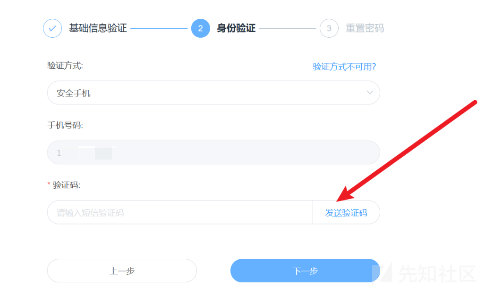
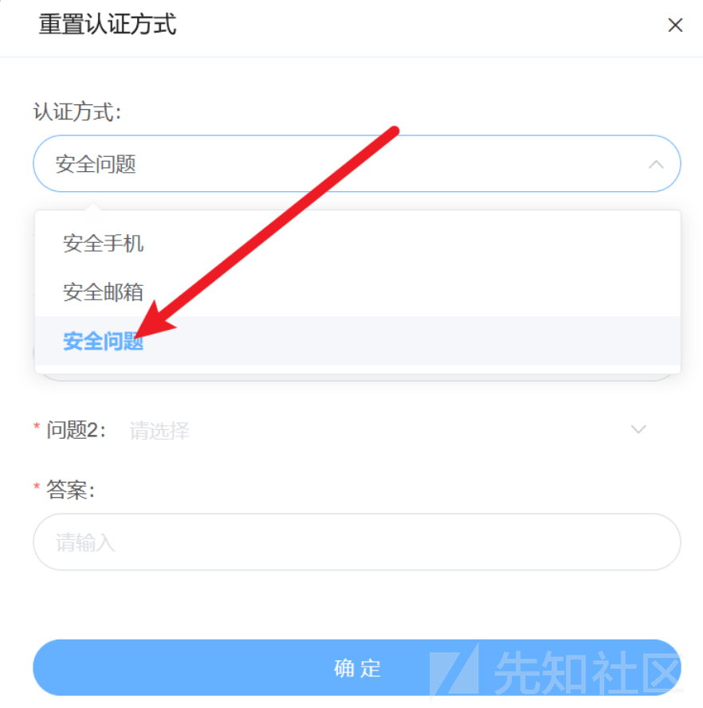
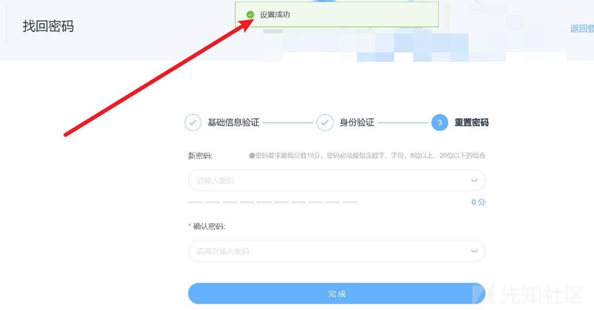
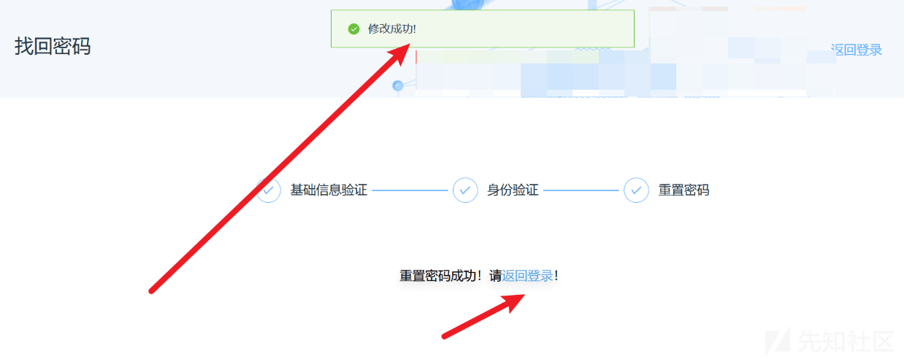
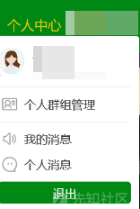
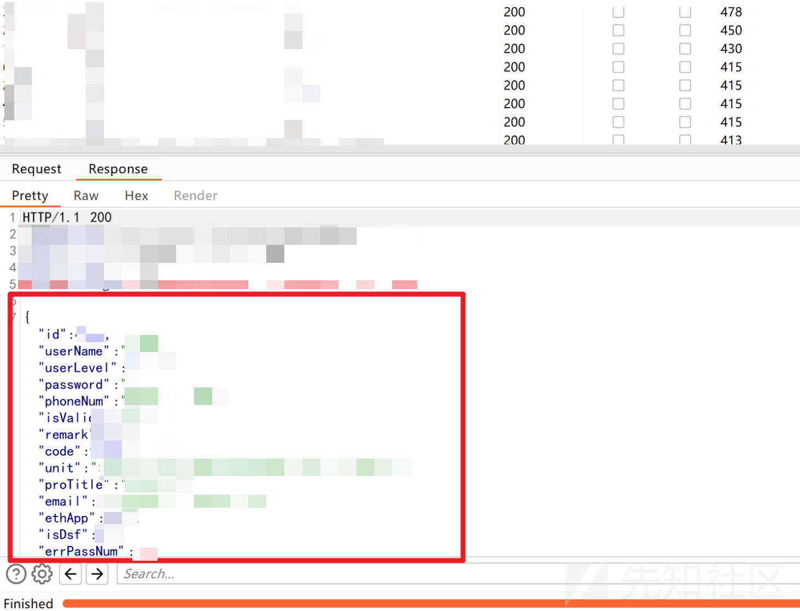
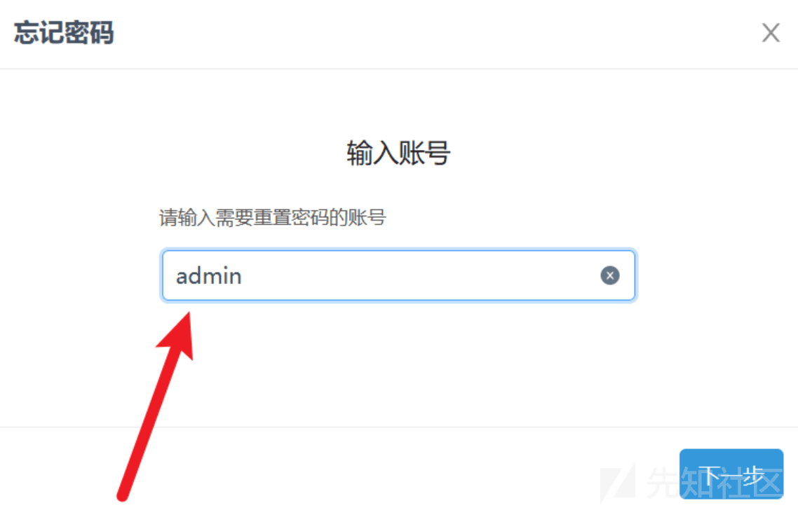
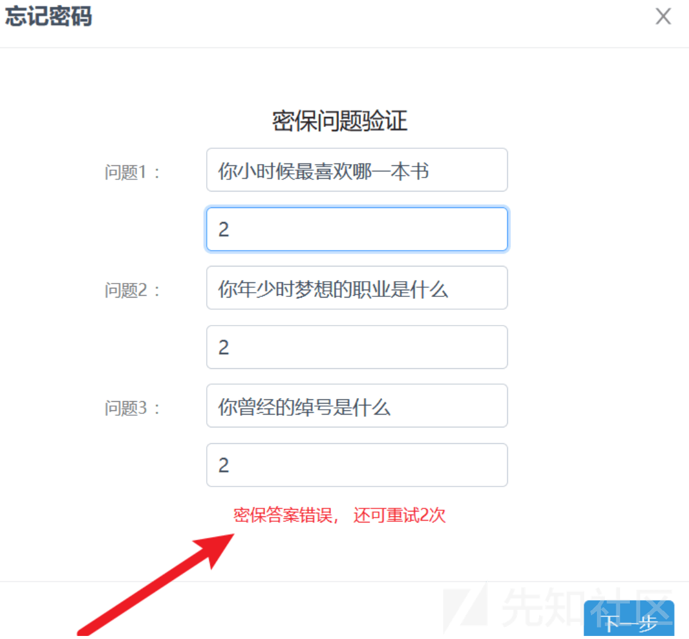
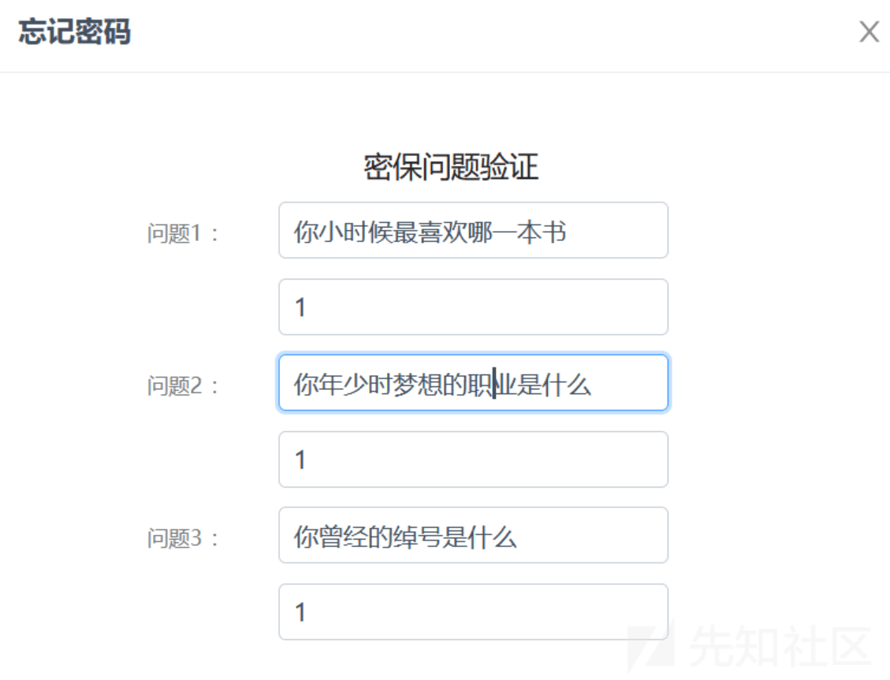
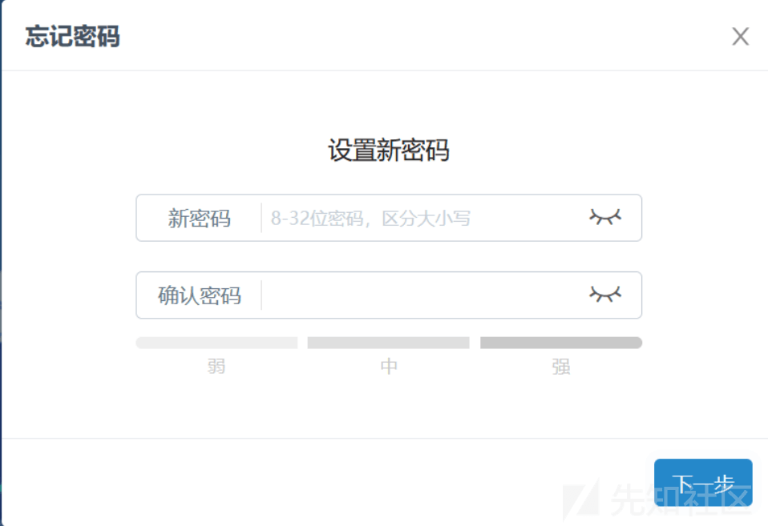

# 实战中遇到的一些莫名其妙的漏洞 - 先知社区

实战中遇到的一些莫名其妙的漏洞

- - -

# 前言

​ 真实案例，文中所写漏洞现已经被修复，厚码分享也是安全起见，请各位大佬见谅哈！

# 案例一：奇怪的找回密码方式

​ 某次漏洞挖掘的过程中，遇到某单位的登录框，按以往的流程测试了一下发现并没有挖掘出漏洞，在我悻悻地点开找回密码的功能并填入了基础信息之后，我发现他的业务流程与常见的安全的找回密码的方式并没有什么区别，都是需要接收到手机验证码或者邮箱验证码或者回答正确安全问题才能进行下一步重置密码。

[](https://xzfile.aliyuncs.com/media/upload/picture/20240222200617-c84f8968-d17a-1.png)

​ 但是敏锐的我，发现了右上角存在一个`验证方式不可用？`的功能，我点开发现竟然直接跳到重置认证方式里面去了：

[](https://xzfile.aliyuncs.com/media/upload/picture/20240222200643-d816794c-d17a-1.png)

​ 然后我把原号主的安全问题重置之后，更令我意外的是直接跳转到重置密码的步骤了（令人哭笑不得 2333）：

[](https://xzfile.aliyuncs.com/media/upload/picture/20240222200657-e00e7000-d17a-1.png)

​ 就这样我就修改了原号主的密码成功进入了系统进行后续安全测试：

[](https://xzfile.aliyuncs.com/media/upload/picture/20240222200707-e6713018-d17a-1.png)

[](https://xzfile.aliyuncs.com/media/upload/picture/20240222200717-ec10fada-d17a-1.png)

# 案例二：且丘世专

​ 在某次 SRC 挖掘过程中，我发现了一个站点可以进行任意用户注册，在往下继续挖掘的过程中，发现了一个比较有趣的越权。

​ 当我成功登录的时候，我抓到了一个数据包大致如下 (已脱敏)：

```plain
GET /XXX?id=%E4%B8%94%E4%B8%98%E4%B8%96%E4%B8%93 HTTP/1.1
Host: XXX
Accept: /
......
Connection: close
```

​ 我敏锐的直觉告诉我这里很有可能存在越权的漏洞，但是这个 id 看起来实在确实很抽象，经验丰富的师傅可能一眼就看出来是 URL 编码，我们拿去解码一番：

​ 发现解码出来我们的 id 居然是：`且丘世专`

​ 有趣，经过我的一番 FUZZ 后我发现有下面的对应规则：

| 序号  | 汉字  | URL 编码 |
| --- | --- | --- |
| 0   | 丐   | %E4%B8%90 |
| 1   | 丑   | %E4%B8%91 |
| 2   | 丒   | %E4%B8%92 |
| 3   | 专   | %E4%B8%93 |
| 4   | 且   | %E4%B8%94 |
| 5   | 丕   | %E4%B8%95 |
| 6   | 世   | %E4%B8%96 |
| 7   | 丗   | %E4%B8%97 |
| 8   | 丘   | %E4%B8%98 |
| 9   | 丙   | %E4%B8%99 |

​ 所以`且丘世专`对应着我的 id 也就是 4863。

​ 然后我将对应的 id 值进行遍历一下就越权查看了大量用户的信息：

[](https://xzfile.aliyuncs.com/media/upload/picture/20240222200755-02cee9d0-d17b-1.png)

# 案例三：1 + 1 + 1？

​ 在另外一次 SRC 挖掘中，同样是找回密码功能处，我选择直接重置 admin 账户的密码

[](https://xzfile.aliyuncs.com/media/upload/picture/20240222200813-0de0cf78-d17b-1.png)

​ 该找回密码的逻辑是输入正确的密保问题，于是我随便输入了三个 2 来测试：

[](https://xzfile.aliyuncs.com/media/upload/picture/20240222200827-161ab528-d17b-1.png)

​ 确实很安全，那么 3 个 1 呢？

[](https://xzfile.aliyuncs.com/media/upload/picture/20240222200842-1ed97c12-d17b-1.png)

​ 居然直接进入了重置密码的界面。。。。。。

​ 由于是 admin 账户，我没有贸然去修改密码，后续厂商也是承认了该漏洞。

[](https://xzfile.aliyuncs.com/media/upload/picture/20240222200856-276e0bea-d17b-1.png)

# 总结

​ 有些时候有些漏洞确实非常莫名其妙，本文其实并没有太深的技术支持，但是也算是一种思路的补充吧！
