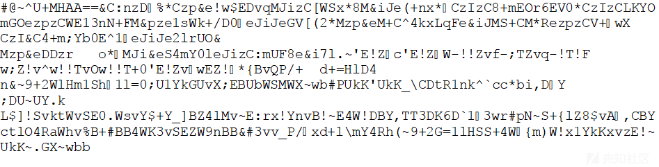

# 对 JavaScript 混淆的 Dropper 进行逆向工程 - 先知社区

对 JavaScript 混淆的 Dropper 进行逆向工程

- - -

# 1\. 引言

如今，最常用于在 Windows 上传播恶意软件的技术之一 systems 正在使用 JavaScript（js）dropper。js dropper 表示，在 大多数攻击场景，恶意软件感染的第一阶段。发生这种情况是因为 Windows 系统允许执行各种 使用 Windows 脚本宿主（WScript）的脚本语言。这意味着 通过 JavaScript，它可以执行对 底层操作系统。使用 js dropper 作为恶意软件感染的第一阶段是一个 允许恶意软件作者绕过 NIDS、HIDS 和端点的方法 反恶意软件比丢弃包含 整个恶意逻辑。同时，JavaScript 混淆也很多 比二进制混淆更容易实现。此外，它更难 检测混淆模式，为恶意 由于脚本语言的动态性，dropper。考虑到这一点，相同的 js 混淆技术也被用于 对浏览器进行混淆利用，防止代码被盗和重用。在 在本文中，我将展示不同的混淆技术和 真正的实际例子来理解知道如何的重要性 反转混淆的 js 滴管，因为大多数时候它们是 被一种或多种技术的链混淆。

# 2\. JavaScript 代码混淆技术

混淆 JavaScript 代码会使 恶意代码。混淆的主要目的是使 更难理解代码逻辑，同时让 代码不变。通过动态分析，您可以观察到 代码，但前提是某些条件为真。如果这些条件是 从未见过，您无法发现代码的恶意行为 动态分析。条件可以是检查实际环境是否 的执行未虚拟化，如果此条件为 false，则 代码将不会执行。这发生在我分析的 js dropper 上。让我们看一下更详细的内容。当动态分析无法帮助分析人员时，手动反转变得很重要。根据该研究\[1\]，可以确定基本的 JavaScript 混淆技术，分为以下几类：

-   随机化混淆：在这种类型的混淆中，JavaScript 代码的一些元素是 在不更改代码语义的情况下插入或更改。此类别中使用的常用技术 是空白随机化、注释随机化和变量 名称随机化。
-   数据混淆：这些技术的主要目的是转换变量或常量 值转换为一个或服务器变量的计算结果，或者 常数。两种主要技术属于这一类：字符串拆分和关键字替换。
    
    -   字符串拆分包括将一个字符串转换为多个子字符串的串联。
    -   **关键字替换**包括将 JavaScript 关键字放在变量中，然后使用该变量而不是 JavaScript 关键字。
-   编码**混淆：**  
    通常有三种方法可以对原始代码进行编码。第一种方式 是将代码转换为转义的 ASCII 字符、Unicode 或 十六进制表示。第二种方法使用自定义编码 函数，攻击者通常使用编码函数来创建 混淆后的代码，并附加解码功能进行解码 执行。
    
    此外，一些标准加密和 可以使用解密方法来进行 JavaScript 混淆。为 例如，JScript.Encode 是 Microsoft 创建的用于编码的方法 JavaScript 代码。它可用于保护源代码以及 逃避检测。
    
-   逻辑混淆：  
    这种类型的**混淆**技术是操纵执行 通过更改逻辑结构来流 JavaScript 代码，无需 影响原始语义。有两种方法可以实现逻辑 结构混淆。一种方法是插入一些指令，这些指令是 与功能无关。另一个是添加或更改一些 条件分支，例如 if ...否则，切换......case、for、while 等
    
    这些技术的力量在它们结合在一起时就来了，对于分析师来说，单独对每种技术进行反混淆可能很容易。相反，如果将它们链接在一起，并且还有动态的 链中的参数，它们可能很难分析。
    

# 3\. 真实案例场景

最近，我有机会分析了一个 js dropper，它使用了 自定义混淆函数，用于混淆常见的字符串拆分 混淆技术（String.fromCharCode）和这需要动态 参数依次正确执行。它还具有编码混淆功能 对于变量名称，并且自定义混淆函数包含一个 很多垃圾代码。对于反混淆器脚本实现，您可以选择任何 可以支持正则表达式的脚本语言，在这种情况下，我使用了 Python。滴管是在.rar 存档中发送的，在我有 .jse 滴管.rar 内。.rar 的 SHA256 哈希值为：0d72340c876292dcdc8dfa5b3b1cc7b6010902a2d28b5b15c8c35a3a284e7d35.jse 的 SHA256 哈希值为：652566914671a9d5fb5ad0b75b6c9023fa8c9cff2c2d2254daad78ba40c14e0b

## 3.1 第 1 步：脚本解码

打开.jse 滴管，我很快意识到它是编码的 使用 Microsoft 提供的 JScript.Encode 函数，遵循 示例代码：我使用在线找到的二进制文件以 .js 格式对脚本 \[2\] 进行解码，并得到解码后的混淆滴管：

[](https://xzfile.aliyuncs.com/media/upload/picture/20240205232711-08576064-c43b-1.png)

[](https://xzfile.aliyuncs.com/media/upload/picture/20240205232719-0cd2fcf2-c43b-1.png)

## 3.2 第 2 步：对编码混淆进行反混淆

为了弄清楚滴管中使用的混淆技术是什么，我 需要通过一些在线美化器来美化代码\[3\]，因为 原始滴管在单个上包含五十万个字符 行，结果跟着一小段代码：请注意，所有的去混淆步骤都是在原始 js 上完成的 滴管，而不是美化代码。使用美化代码 只是为了有更好的可读性。如您所见，使用的第一种混淆技术是使用 Unicode 表示法进行编码混淆。为了以更易读的格式对其进行解码，我使用以下正则表达式来解析字符：

[](https://xzfile.aliyuncs.com/media/upload/picture/20240205232726-116c137a-c43b-1.png)

（\\u0\\d{3}）+

我定义了一个回调函数来替换每个匹配项。我使用回调函数作为替换，因为我需要一个 根据 Python 代码根据解析的数据进行动态替换：其 utf-8 编码将替换匹配的每次出现。请注意，编码不是混淆;它被用作混淆技术，只是为了使变量名称更难理解。

[](https://xzfile.aliyuncs.com/media/upload/picture/20240205232740-193a79de-c43b-1.png)

## 3.3 第 3 步：对主要混淆模式进行去混淆

因此，我开始环顾四周，试图找出 基本混淆技术的链接。这不是一件容易的事 因为.js 包含超过 16,000 行代码。这 下面是代码示例：

[](https://xzfile.aliyuncs.com/media/upload/picture/20240205232750-1f89d67c-c43b-1.png)

在处理这个巨大的混淆滴管时，不可能识别每种混淆技术并手动更换。因此，为了对其进行反混淆，我需要了解混淆模式 逻辑，并编写了一个脚本，该脚本可以自动进行反混淆。一种或多种混淆技术的链接将创建混淆模式。混淆模式中使用的混淆技术是我在第 2 章中解释的基本技术。在花了一些时间调试上面的代码后，我发现使用的函数是“return String（fromCharCode（staticParam，dynamicParam））”函数的混淆版本。这是字符串拆分数据混淆技术的实现。在那之后，我专注于寻找要自动化的混淆模式 通过 Python 脚本进行反混淆过程。最后，发现此混淆模式具有不同的混淆层。识别混淆模式是逆转的关键步骤 JavaScript 混淆代码，因为一旦你识别了它，你就有了 完成了 80% 的去混淆任务。这是最耗时的 活动，但对于自动化过程来说是值得的。随后，我只需要实现一个脚本来解析混淆模式并在需要时替换代码。所以，从现在开始，这只是一个常规的问题 可以解析我确定的混淆模式的工作表达式。这不是一项艰巨的任务，只是需要一些时间和测试。在 就我而言，我使用文本编辑器（Notepad++\[4\]）来调试正则表达式 在 Python 脚本中执行之前创建。最后，我有以下正则表达式来解析混淆模式：

```plain
（|\x27\x27+）{\w+\：.？\，[A-Za-z0-9]+\：[A-Za-z0-9]+\，[A-Za-z0-9]+\：function\（.？\）{.？}.？}[.？]\（.？\x27Code\x27\，\d{1,3}\）]
```

观察识别的混淆模式，您可以看到 混淆函数 data\_obfuscation.string\_splitting（staticParam1 + dynamicParam1））有两个参数，我需要解析它们来反混淆 数据。这两个参数将是 2 个数字，一个是静态的 另一个将是动态的。第一个可以在附近找到 函数返回参数，所以例如在上面的代码中会是 96 第二个在函数调用中作为参数传递，它是 3. 96+3=99 是字符“c”的 ASCII 十进制代码。为了解析静态参数，我使用了以下正则表达式：

```plain
返回\sString.*\（（\d{1,3}）+pi\）;
```

相反，为了解析我使用的动态参数：

```plain
].*？\，\x27Code\x27\，（\d{1,3}）\）
```

## 3.4 第 4 步：调整脚本

正如每个程序员都知道的那样，每个编写的脚本都必须经过调整，才能按您的预期工作。事实上，上述脚本的运行并没有以我作为分析师想要达到的最佳可读性来对数据进行反混淆。发生这种情况是因为正则表达式仅匹配块解析的平均情况。调试脚本时，我注意到 混淆模式用于不同的地方（即 语句，在 try catch 块中，在 while 循环中 和 在变量中 定义）。每个都以不同的右括号结尾，或者 标点符号和其中一些，不太常见，我没有 注意，打破了正则表达式匹配。所以，为了调整我的剧本，我只需要 改进原有的正则表达式，恢复每个的结束字符 匹配大小写。用于解析所有出现的混淆模式的新正则表达式变成了：

```plain
（|\x27\x27+）{\w+\：.？\，[A-Za-z0-9]+\：[A-Za-z0-9]+\，[A-Za-z0-9]+\：function\（.？\）{.？}.？}[.？]\（.？\x27Code\x27\，\d{1,3}\）（=|\！|\）|\，|*|]|+|\s|;)
```

## 3.5 第 5 步：分析样品

在这一步中，我分析了清晰易读的代码，这只是一个对 JavaScript 的理解问题。

我专注于识别潜在的恶意函数，以提取有意义的 IOC。

在去混淆版本中，我很快发现了一些有用的 IOC，它们 可以防止这种威胁传播（也可以检测一次威胁 run），例如，磁盘上的两个文件 .exe 和 .gop 在 %TEMP% 文件夹中

此外，保存在每个可用文件上找到的所有文件名 在名为“saymyname.txt”的文件中具有特定扩展名的磁盘 %TEMP% 目录

此外，还将下载主有效载荷的 c2 服务器

这些可以代表一组很好的 IOC，用于防止威胁在整个内部网络中传播。但是，我想更深入地了解两个方面：第一个方面，为什么示例未在我的 VM 中运行？二、是动态的吗 c2 服务器后面的算法来服务于主要有效载荷，或者我可以只是 只需下载.exe？在代码中侦察，我看到了一个可疑的“如果”，其中包含有趣的条件，遵循代码：

从上面的代码片段中，我看到 dropper 检查 正在运行的特定进程名称和进程的特定所有者。

首先，它枚举正在运行的进程，然后枚举它 将一些信息存储在数组中。此数组保存的信息 将是进程名称、可执行文件路径、所有者域和所有者名称。

之后，它将检查在如此生成的数组中是否包含 一些字符串，可能意味着执行环境是 VM，沙盒或逆向工程机器。

这就是这个滴管没有在我的虚拟机中运行的原因。

为了回答我的第二个疑问，我尝试访问我找到的 c2 服务器页面，但显然，.exe 不会那么容易获得服务。

然后，我决定在代码中查找 HTTP 连接调用。我 注意到 URL 包含一些动态参数，这些参数是 通过一些“*for*”迭代技巧生成

最终 URL 的格式必须如上所述，否则 c2server 将无法提供二进制有效负载。变量“*hashere*”需要，因为 PHP 页面的第三个参数是动态生成的 使用 A 作为使分析复杂化的技巧。如果此参数错误，提供的有效负载不会解压缩并执行，因为它会错过 二进制有效负载的解包例程的参数。其他一些 参数是静态的（即“*param\_1*”），其他参数是随机的（即“*lastParam*”）。

最后，注释掉 HTTP 连接的代码并添加一个 debug print 函数 我可以获取一个可以允许下载的 URL 可运行的二进制有效负载

导航到该页面时，我下载了主要的二进制有效负载，即 以 base64 编码，哈希 SHA256:1572b8cc6dc1af0403bf91e24b20f9c39f6722258329b0bafa89f300989393f5。下载的二进制文件似乎是银行木马 Zusy（也称为 Tinba）的变体。

# 结论

总之，我想说的是，知道如何处理混淆 JavaScript dropper 可以帮助安全分析师提供有效的 IOC 以防止或检测威胁。它只需要一个很好的知识 正则表达式，熟悉脚本语言和 课程还有 JavaScript 知识;那么这只是一个问题 识别混淆模式并自动进行反混淆 过程。正如你所注意到的，没有很多可用的 js 反混淆器 在线。那是因为写一个将军真的很难 反混淆器，由于 语言。另一方面，作为分析师，您不能只依赖动态分析，因为有时它无济于事。
