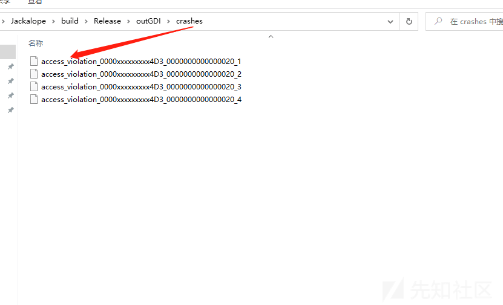

# 对 Tinylnst And Jackalope 初探 - 先知社区

对 Tinylnst And Jackalope 初探

- - -

介绍  
本文是从 Tinylnst 的了解学习再到 Jackalope 的使用再到首次编写 Fuzzer 的初探话不多说进入正题。

## **Tinylnst**

TinyInst 是一个轻量级动态检测库（插桩工具用于执行时代码覆盖率分析）可用于检测流程中选定的模块同时让流程的其余部分在本机运行。  
跟传统的 DynamoRIO 相比 PJ0 团队对于 TinyInst 的定义主打的就是轻量级，而且 TinyInst 支持很多种架构 Windows (x86 和 x64)、macOS (x64 和 arm64)、Linux (x64 和 arm64) 和 Android (ARM64)。  
通过直接安装 vs2019 然后使用官方提供的命令一把梭即可编译。这里官方还说 64 位编译的可以 32 位目标上工作因此可能没有必要编译 32 位

```plain
记得安装 python3
mkdir build
cd build
cmake -G "Visual Studio 16 2019" -A x64 ..
cmake --build . --config Release
```

在 TinyInst 框架中其代码主要分为三个大类分别是 debugger 类，Tinylnst 类还有 LiteCov 类。而其中三个类的关系分别是 debugger 作为最底层的调试处理，而 Tinylnst 是继承与 debugger 类而 LiteCov 类又继承于 Tinylnst 类。TinyInst 也提供了测试用例，其在 Windows 运行命令如下  
litecov.exe -instrument\_module notepad.exe -coverage\_file coverage.txt -- notepad.exe

[](https://xzfile.aliyuncs.com/media/upload/picture/20240213164835-acae1312-ca4c-1.png)  
对于 TinyInst 的设计理念此文不叙述太多因为 github 项目下 pj0 给了一些核心观念，我们还是从其中的函数出发看看是怎么进行代码处理的然后才能更好的通过 TinyInst 去使用 Jackalope-fuzz 工具。

## **Debugger**

此处来介绍一下此类中几个关键逻辑的函数首先来看一下 debugger.h 文件中的定义在此文件中就是定义了 Debugger 的类  
在下方它定义了命令行的选项这代表可以根据自己的需求定期自己的命令行选项，要运行和控制程序的话则通过函数

```plain
DebuggerStatus Run(int argc, char **argv, uint32_t timeout);
```

debugger 类还提供了 Kill 和 Continue 功能，这是为了当 run 和 attach 在目标进程仍然存在的时候就可以通过此函数来进行终止或者继续调试处理。

[](https://xzfile.aliyuncs.com/media/upload/picture/20240213164940-d34e257a-ca4c-1.png)

在往下我们可以看到一些成员函数和成员变量，用于处理调试过程中的各种事件和操作

[](https://xzfile.aliyuncs.com/media/upload/picture/20240213165019-ea47d302-ca4c-1.png)  
Debugger::OnModuleLoaded 函数是当模块被加载的时候调用的，在下方还可以看见 AddBreakpoint(target\_address, BREAKPOINT\_TARGET) 函数的调用  
因为其内部有一处判断如果指定了 target\_module 和 target\_method 而且这个 module 就是 target\_module  
就去通过 GetTargetAddress 函数获取目标方法的地址并通过 AddBreakpoint 函数在该地址添加 BREAKPOINT\_TARGET 类型的断点。

[](https://xzfile.aliyuncs.com/media/upload/picture/20240213165030-f0e9d62e-ca4c-1.png)

Debugger::OnProcessCreated 函数是当目标进程被创建或附加时调用其中还考虑包含了当附加到目标进程主模块的加载逻辑。当附加到进程下方则是对主模块调用并使用函数 OnModuleLoaded。

[](https://xzfile.aliyuncs.com/media/upload/picture/20240213165054-ff728ad8-ca4c-1.png)  
Debugger::HandleExceptionInternal 函数是在目标程序发现异常的时候调用，它会根据提供的 EXCEPTION\_RECORD 创建一个异常对象，然后检测异常是否为断点异常因为这可能是调试器触发的断点导致的。然后通过 Start 或 Continue 来判断调试器该继续执行，此函数还检测了特定的异常类型：对于访问冲突异常，它检查是否定义了特定的目标函数，以及异常地址是否与预定义的结束地址匹配。如果是，它处理目标结束并返回 DEBUGGER\_TARGET\_END。否则，将其视为崩溃（DEBUGGER\_CRASHED）。  
而对于其他特定异常，如非法指令栈溢出堆损坏等，它标记调试器已崩溃。  
最后对于任何其他未处理的异常，如果设置了 trace\_debug\_events，它会打印一条消息，然后返回 DEBUGGER\_CONTINUE。最后，它返回适当的调试器状态。

[](https://xzfile.aliyuncs.com/media/upload/picture/20240213165110-08930c14-ca4d-1.png)  
Debugger::HandleTargetEnded 此函数作用恢复目标方法地址处添加的 BREAKPOINT\_TARGET 类型的断点  
它获取目标方法的返回值，保存在 target\_return\_value 中，如果处于循环模式（loop\_mode）则进行参数和执行上下文的恢复；如果不处于循环模式则恢复目标函数的返回地址，并且添加目标入口断点。  
[](https://xzfile.aliyuncs.com/media/upload/picture/20240213165119-0e3fba72-ca4d-1.png)  
Debugger::HandleDllLoadInternal 此函数在 Dll 加载的时候调用的主要是通过 OnModuleLoaded 函数传递加载的 dll 基地址和基本信息。

[](https://xzfile.aliyuncs.com/media/upload/picture/20240213165130-14848124-ca4d-1.png)  
Debugger::DebugLoop 此函数通过存储调试器的返回状态还有判断目标进程是否存活等信息还进行循环处理，其主循环中的 WaitForDebugEvent 是用于等待调试事件的发生，循环会根据传入的 timeout 来判断是否超时。如果成功等待到了调试事件就设置 dbg\_continue\_needed，如果超时返回 DEBUGGER\_HANGED 表示调试器挂起。在处理调试事件之前将 dbg\_continue\_status 设置为 DBG\_CONTINUE。  
根据调试事件的类型进行处理，对于异常调试事件，调用 HandleExceptionInternal 处理异常，并根据返回值判断是否需要继续调试或者目标进程已崩溃。  
对于创建线程、创建进程、线程退出、进程退出、加载 DLL、卸载 DLL 等调试事件，分别调用相应的处理函数。对于其他类型的调试事件不做处理。处理完调试事件后调用 ContinueDebugEvent 继续执行调试事件并继续主循环。当目标进程退出时打印相应的信息然后退出循环，并返回 DEBUGGER\_PROCESS\_EXIT 表示目标进程已退出。

[](https://xzfile.aliyuncs.com/media/upload/picture/20240213165201-274f4a78-ca4d-1.png)

还有一些 Debugger 相关的命令参数在运行的时候可以添加像-trace\_debug\_events 打印调试器事件 (加载的模块，异常等)-trace\_basic\_blocks 在执行基本块时打印它们，-trace\_module\_entries 将所有列表打印到检测代码中。-full\_address\_map 维护一个指令级的地址从检测代码到原始代码的地址。

## **TinyInst**

TinyInst 类是涉及到了插桩的实现，其基于自定义调试器而调试器负责监视目标进程的事件如加载模块、命中断点、触发异常。通过指定目标的方法调试器还可以进行断点和持久化处理。  
最初被检测的模块中的所有可执行区域都会被标记为不可执行但会保留其他读写权限，每当控制流到达被检测的模块时就会触发异常然后被调试器捕获和处理。  
而 TinyInst 还会在原始模块地址范围的 2GB 内分配一个可执行内存区域这里就是模块的插桩/重写代码将被放置的地方，然后所有使用\[rip+offset\]形式寻址的指令都被\[rip+fixed\_offset\]取代。  
TinyInst 这个类提供了一系列功能，包括初始化、启用/禁用插桩、处理调试事件、处理异常、模块加载和卸载、间接跳转插桩等。我们到大致看一下其中的一些函数  
TinyInst::FixCrossModuleLinks 该函数用于修复指定模块相关的所有跨模块链接。  
它遍历所有跨模块链接，找到目标模块相关的链接，并调用 FixCrossModuleLink 函数来修复链接。  
而 TinyInst::FixCrossModuleLink 函数用于修复跨模块链接。它通过指向 CrossModuleLink 结构的指针作为参数，并在相关模块上执行操作以修复链接。

[](https://xzfile.aliyuncs.com/media/upload/picture/20240213165223-3437cb7a-ca4d-1.png)  
TinyInst::ClearCrossModuleLinks 该函数用于清除指定模块相关的所有跨模块链接。它遍历所有跨模块链接，找到目标模块相关的链接，并将其从列表中移除。

[](https://xzfile.aliyuncs.com/media/upload/picture/20240213165247-42ba42d6-ca4d-1.png)

TinyInst::InitGlobalJumptable 此函数用于初始化全局跳转表并获取当前指令地址，以便在代码插桩和跳转表的使用中进行有效的管理和调度。  
通过记录插桩代码的大小，设置全局跳转表的偏移量，设置全局间接跳转新目标地址的偏移量，在全局间接跳转新目标地址的位置写入全局跳转表的地址，调用 Breakpoint 函数在指定模块上设置断点，提交新插桩代码的变化来实现。

[](https://xzfile.aliyuncs.com/media/upload/picture/20240213165316-53df12e4-ca4d-1.png)

而在上述的 TinyInst::CommitCode 函数和 TinyInst::WritePointer 函数作用分别是，首先是 TinyInst::CommitCode 该函数用于提交已写入的插桩代码，此函数首先检查插桩代码是否已被映射到远程进程中，如果没有，则直接返回。  
接着它调用 RemoteWrite 函数，将本地的插桩代码数据从指定的起始偏移量开始写入到远程进程中。这个函数的目的是将在本地内存中修改的插桩代码数据提交到远程进程中。  
TinyInst::WritePointer 该函数将一个指针值写入到指定模块的插桩代码中。函数检查是否有足够的空间来存储指针值。然后，根据指针的大小（child\_ptr\_size），将指定的值转换为相应的整数类型（uint64\_t 或 uint32\_t）并将其写入到插桩代码的当前位置。函数更新已分配的插桩代码大小以便下一次写入时不会覆盖已有的数据。

[](https://xzfile.aliyuncs.com/media/upload/picture/20240213165328-5b11eb4a-ca4d-1.png)

而在上图中还有 TinyInst::WriteCode 函数，它是用于写入插桩代码到指定模块中的指定偏移量。  
它接受一个指向 ModuleInfo 结构的指针 module、一个指向插桩代码数据的指针 data 和一个大小 size 作为参数。函数首先检查是否有足够的空间来存储新写入的代码。然后，函数使用 memcpy 函数将指定大小的插桩代码数据从给定的数据指针复制到指定模块的插桩代码中，并更新已分配的插桩代码大小。  
此时再来回过头看一下上述提供的命令参数  
litecov.exe -instrument\_module notepad.exe -coverage\_file coverage.txt -- notepad.exe  
这里调试进程就是指的 litecov.exe，目标进程就是指的 notepad.exe。插桩的代码是先写到 litecov.exe 的地址空间 (TinyInst::WriteCode 实现的) 再写到 notepad.exe 的地址空间 (TinyInst::CommitCode 实现的)。  
TinyInst::HandleBreakpoint 此函数实现了处理各种类型断点的功能，像基本块追踪信息指示正在执行的基本块的原始地址和插桩后的地址；还会遍历钩子列表，对每个钩子调用其 HandleBreakpoint 方法，以处理特定类型的断点。函数调用 HandleIndirectJMPBreakpoint 来处理间接跳转的断点。

[](https://xzfile.aliyuncs.com/media/upload/picture/20240213165338-61411f18-ca4d-1.png)

TinyInst::TranslateBasicBlockRecursive 函数递归地翻译指定地址处的基本块及其后续基本块，记录当前模块的插桩代码大小调用 TranslateBasicBlock 函数来翻译指定地址处的基本块。并调用汇编器的 FixOffset 方法来修正跳转指令的偏移量，计算翻译后的代码大小 code\_size\_after。  
最后提交所有更改的代码调用 CommitCode 方法来提交从 code\_size\_before 开始的插桩代码

[](https://xzfile.aliyuncs.com/media/upload/picture/20240213165348-67223566-ca4d-1.png)

TinyInst::TryExecuteInstrumented 函数负责尝试执行插桩后的代码，检查给定地址获取模块信息，并且使用转换后的地址更新程序计数器 (PC) 寄存器以便执行插桩后的代码。

[](https://xzfile.aliyuncs.com/media/upload/picture/20240213165359-6d7f36d4-ca4d-1.png)  
TinyInst::InstrumentModule 此函数是核心的插桩函数；它检查插桩是否被禁用；如果启用了持久化插桩数据，并且模块已经被插桩过，那么直接重用之前的插桩数据。  
如果模块尚未被插桩过，首先通过调用 ExtractCodeRanges 函数提取模块的代码范围和大小。  
分配用于插桩代码的本地缓冲区。如果间接插桩模式为全局或自动则还需额外分配大小为 child\_ptr\_size \* JUMPTABLE\_SIZE 的跳转表空间。  
在本地分配的缓冲区附近或在指定模块的地址范围内分配远程内存用于存储插桩代码。如果是 ARM64 架构，使用 RemoteAllocate 函数分配可读可执行的内存，否则使用 RemoteAllocateNear 函数。  
如果间接插桩模式为全局或自动，则初始化全局跳转表。这个跳转表是一组指针，用于存储间接跳转的目标地址。将模块的 instrumented 标志设置为 true，表示该模块已被插桩。修复跨模块链接，确保所有相关的跳转地址被正确修正。调用 OnModuleInstrumented 函数，通知任何已注册的监听器该模块已被插桩。  
如果启用了模块入口点的修正还会调用 PatchModuleEntries 函数对模块的入口点进行修正。

[](https://xzfile.aliyuncs.com/media/upload/picture/20240213165409-73b57b26-ca4d-1.png)

所以 TinyLnst 的插桩主要是进行指令替换和重写的操作，而且插桩的模块都会插桩被命中的基本块；并且通过实现全局跳转表来进行操作且对于直接调用/间接调用都有对应的控制流的处理。  
最后的 LiteCov 类就主要是关于代码覆盖率的处理了：  
通过 OnModuleInstrumented 函数在模块插桩后调用，初始化模块的覆盖率数据并分配远程覆盖率缓冲区。又使用 InstrumentBasicBlock 和 InstrumentEdge 函数用于在指定的基本块或边上插入覆盖率插桩。其 EmitCoverageInstrumentation 函数主要用于在指定的地址插入覆盖率插桩指令。随便使用 CollectCoverage 和 GetCoverage 进行收集覆盖率；然后通过 IgnoreCoverage；HasNewCoverage；ClearCoverage 函数进行覆盖率数据的处理。  
通过 CompareCoverage 函数比较两个覆盖率数据集，并返回它们的差异。  
LiteCov 类主要就是采取轻量级的代码去实现了覆盖率检测包括插桩、收集、处理和管理覆盖率数据等操作。  
大致了解 TinyLnst 其内部的一些设计理念然后就进入到正题 Jackalope 的操作了。

## **Jackalope**

Jackalope 是一个可定制的、分布式的、覆盖引导的模糊器，专用于 Windows/macOS 的黑盒 fuzz 开源工具，而且 Jackalope 默认附带了上述中介绍的插桩工具 TinyLnst 还有语法变异引擎。在 windows 平台的编译命令如下，可以看见其中也是先把 TinyLnst 加进来的。

```plain
cd Jackalope
git clone --recurse-submodules https://github.com/googleprojectzero/TinyInst.git
mkdir build
cd build
cmake -G "Visual Studio 16 2019" -A x64 ..
cmake --build . --config Release
```

编译完成之后它会生成 fuzzer.exe 还有一个 test.exe；其中 test.exe 是 Jackalope 源码中提供的 test.cpp 测试代码会自动编译生成用来进行测试用例。

[](https://xzfile.aliyuncs.com/media/upload/picture/20240213165445-891271a4-ca4d-1.png)

以 test.exe 目标程序为例在 windows 上运行的命令如下所示：  
fuzzer.exe -in in -out out -t 1000 -delivery shmem -instrument\_module test.exe -target\_module test.exe -target\_method fuzz -nargs 1 -iterations 10000 -persist -loop -cmp\_coverage -- test.exe -m @@

[](https://xzfile.aliyuncs.com/media/upload/picture/20240213165454-8e28d0f2-ca4d-1.png)

\-in 代表着输入目录也就是样本集（Jackalope 并没有提供优秀的变异种子生成算法，所以样本集的深度要依靠与用户自身的修改获取）-out 就是输出目录了。  
\-t 是超时的示例时间；-delivery 样品传送机制使用。如果是文件则每个示例都作为文件输出，目标参数中的“@@”将被替换为文件的路径。如果是 shmem，则 fuzzer 将创建共享内存，并用共享内存的名称替换目标参数中的“@@”。在这种情况下默认为 file。-nthreads 就是 fuzz 的线程数 -instrument\_module 就是目标模块收集覆盖率；-cmp\_coverage 代表使用比较覆盖  
再来介绍一下 Jackalope 中主要功能类像：Fuzzer 是用来跟踪语料库和覆盖范围处理高级任务的；像其中的 Fuzzer::RunSampleAndGetCoverage 函数就是负责运行单个样本并获取覆盖率信息；样本被传递给目标程序执行；而如果目标程序执行过程中发生了崩溃或会将样本保存到对应的文件中，并记录崩溃的信息。

[](https://xzfile.aliyuncs.com/media/upload/picture/20240213165502-936836b6-ca4d-1.png)

Mutator 主要工作是调用样本定义的上限处理突变信息的比如-SpliceMutator::Mutate 函数称为 Splice Mutator 的突变器（Mutator）用于对输入样本进行修改。这个突变器的主要功能是将一个样本的部分内容替换为另一个样本的相应部分内容生成新的样本。

[](https://xzfile.aliyuncs.com/media/upload/picture/20240213165511-98777388-ca4d-1.png)

Instrumentation-是用来处理目标的运行和收集覆盖 fuzzer 还附带了一个使用 tinyist 的 Instrumentation

[](https://xzfile.aliyuncs.com/media/upload/picture/20240213165523-9fc7ac66-ca4d-1.png)

SampleDelivery 类负责处理将样本传递到目标；它在其中定义了两个类用于样本交付的不同方法  
FileSampleDelivery 类用于将样本保存到文件中；而 SHMSampleDelivery 类用于将样本传递给共享内存它的构造函数接受共享内存的名称和大小。

[](https://xzfile.aliyuncs.com/media/upload/picture/20240213165532-a52d9184-ca4d-1.png)

Jackalope 还提供了自定义的 fuzzer 编写；通过 BinaryFuzzer 的类它继承自 Fuzzer 类；BinaryFuzzer 类重写了 Fuzzer 类中的两个成员函数并提供了自己的实现。再往下就是 CreateMutator 函数；此函数用于创建一个突变器对象，用于修改输入样本以生成新的样本。函数使用 override 关键字进行了重写，意味着它覆盖了基类 Fuzzer 中的同名函数。  
TrackHotOffsets 函数：这个函数用于指示是否追踪热点偏移量；函数使用 override 关键字进行了重写，意味着它覆盖了基类 Fuzzer 中的同名函数。  
除此之外还有 CreateInstrumentation() - 可以被重写，以便 fuzzer 使用自定义的检测。CreatePRNG() -可以被重写以使用自定义 PRNG。

[](https://xzfile.aliyuncs.com/media/upload/picture/20240213165541-aa83bc76-ca4d-1.png)

然后我编写了一个简单的 fuzzer-gdi32 库的用例虽然还有些许 bug 但是也能跑了并且产生 crash。

[](https://xzfile.aliyuncs.com/media/upload/picture/20240213165554-b23af998-ca4d-1.png)  
fuzzer.exe -in inGDI -out outGDI -t 1000 -delivery shmem -instrument\_module gdiplus.dll -target\_module ConsoleApplication9.exe -target\_offset 0x1170 -target\_method fuzz -nargs 1 -iterations 10000 -persist -loop -cmp\_coverage -- ConsoleApplication9.exe -m @@\\

[](https://xzfile.aliyuncs.com/media/upload/picture/20240213165606-b995586e-ca4d-1.png)

从网上找了一些语法料库当语料库的种子

[](https://xzfile.aliyuncs.com/media/upload/picture/20240213165636-cb5797b0-ca4d-1.png)  
跑了一段时间就生成了一些 crash 剩下的就是要分析了。

[](https://xzfile.aliyuncs.com/media/upload/picture/20240213165647-d179d6d0-ca4d-1.png)

Jackalope 也可以用来编写去 fuzz-mpengine.dll 像下文中的作者也是通过 Jackalope 编写 harness 去 fuzzdefender 的模块，通过调用函数去触发此模块然后找一些语料库不断进行优化处理等等；网上关于 Jackalope 玩法的文章远没有 winafl 多但 Jackalope 在某些方便确实很便捷其效率也不算很低但还需继续多尝试多个模块的 fuzz 效果哇

[](https://xzfile.aliyuncs.com/media/upload/picture/20240213165657-d7cd1db2-ca4d-1.png)

参考  
[https://github.com/googleprojectzero/TinyInst](https://github.com/googleprojectzero/TinyInst)  
[https://www.anquanke.com/post/id/234925](https://www.anquanke.com/post/id/234925)  
[https://github.com/googleprojectzero/Jackalope](https://github.com/googleprojectzero/Jackalope)
