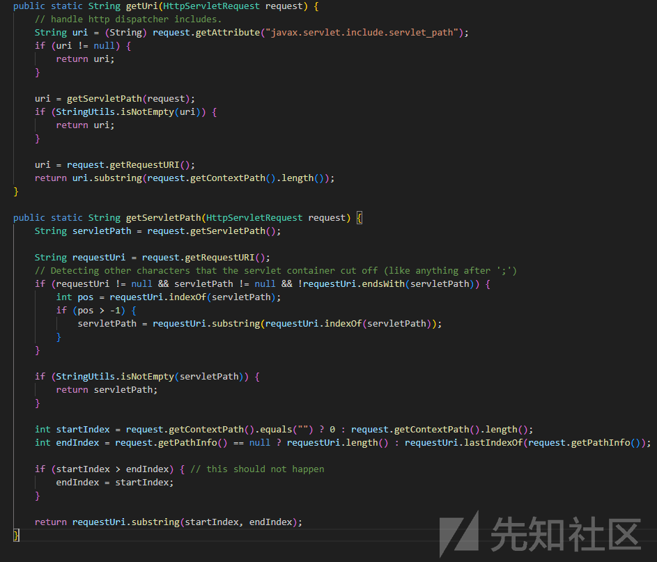
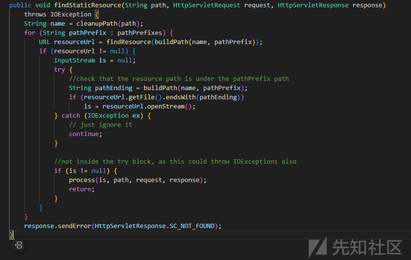
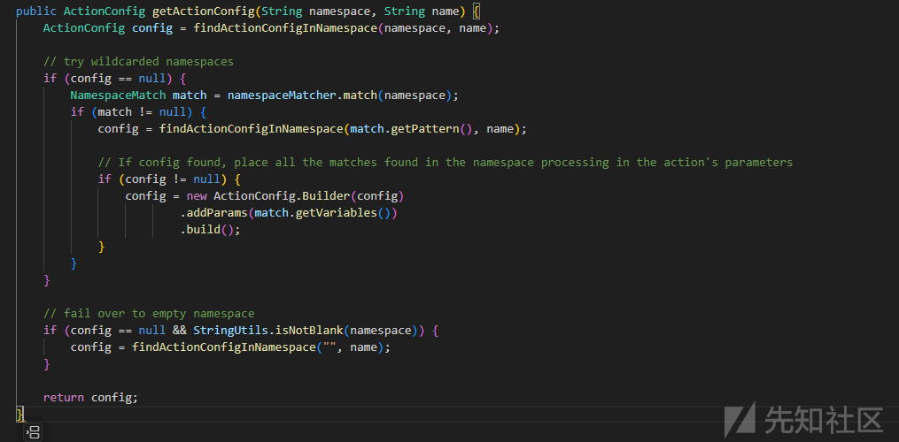
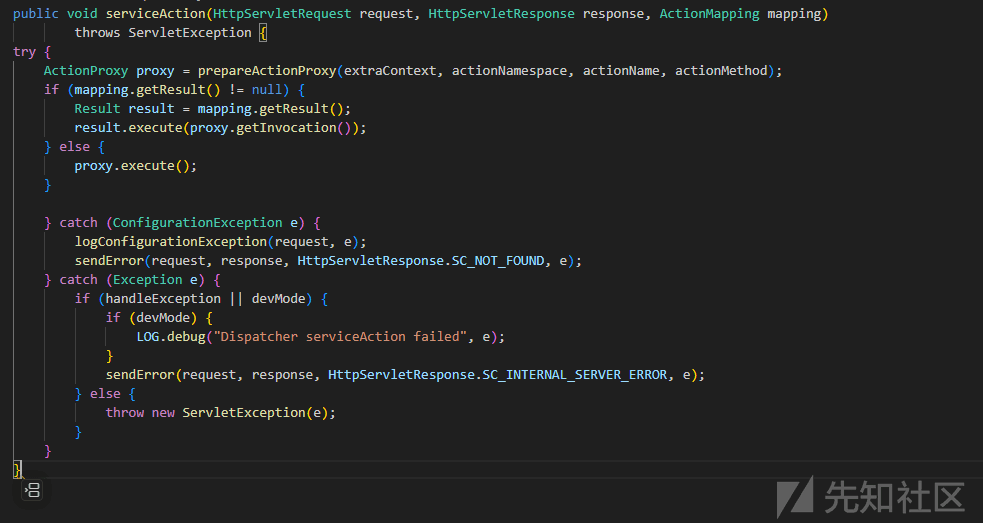

# 对于古老的 Struts2 框架的逻辑概述和漏洞分析 - 先知社区

对于古老的 Struts2 框架的逻辑概述和漏洞分析

- - -

## Struts 结构概述

Struts 应用属于 JavaEE 应用，但是虽然基于 Servlet API，但是将功能通过 Filter 插入了 Filter 中。这种设计使得 Struts 应用更加灵活和高效。

```plain
<?xml version="1.0" encoding="UTF-8"?>
<web-app id="WebApp_ID" version="2.4"
    xmlns="http://java.sun.com/xml/ns/j2ee" 
    xmlns:xsi="http://www.w3.org/2001/XMLSchema-instance"
    xsi:schemaLocation="http://java.sun.com/xml/ns/j2ee http://java.sun.com/xml/ns/j2ee/web-app_2_4.xsd">
    <display-name>Basic Struts2</display-name>
    <filter>
        <filter-name>struts2</filter-name>
        <filter-class>org.apache.struts2.dispatcher.filter.StrutsPrepareAndExecuteFilter</filter-class>
    </filter>

    <filter-mapping>
        <filter-name>struts2</filter-name>
        <url-pattern>/*</url-pattern>
    </filter-mapping>

    <welcome-file-list>
        <welcome-file>index</welcome-file>
    </welcome-file-list>
</web-app>
```

## `struts.xml`

`StrutsPrepareAndExecuteFilter`过滤器可以接受所哟普请求

并将`struts.xml`配置路由映射配置

```plain
<?xml version="1.0" encoding="UTF-8"?>
<!DOCTYPE struts PUBLIC
   "-//Apache Software Foundation//DTD Struts Configuration 2.5//EN"
   "http://struts.apache.org/dtds/struts-2.5.dtd">

<struts>

   <constant name="struts.devMode" value="true" />

   <package name="myapp" extends="struts-default">
       <action name="myaction">
           <result>/index.jsp</result>
       </action>
   </package>

</struts>
```

# Struts 内部逻辑

[](https://xzfile.aliyuncs.com/media/upload/picture/20231210151610-fe92b2ea-972b-1.png)

```plain
Struts 应用程序使用 FilterPipeline 过滤器链来处理每个请求。在过滤器链中，StrutsPrepareAndExecuteFilter 是第一个过滤器，它负责在请求处理之前和之后执行一些特定的操作，如准备请求参数、执行控制器方法、处理结果和清理请求。

在用户请求到达时，FilterChain 会按照注册的过滤器顺序依次调用已注册的过滤器。当 Struts 过滤器链处理完所有其他过滤器后，它会检查请求的 URL 是否与已注册的 ActionProxy 匹配。如果匹配，则调用相应的 ActionProxy 处理请求。

在调用 ActionProxy 时，开发人员可以定义和注册 Interceptor，以实现诸如过滤参数、打印日志、记录请求时间等操作。Struts 的架构设计非常优雅，开发者可以定义和注册自己的 Interceptor，以实现鉴权等业务逻辑。
```

## URL 获取逻辑

URLd 的获取逻辑需要查看`org.apache.struts2.RequestUtils#getUri`

首先尝试获取请求中包含的`javax.servlet.include.servlet_path`属性，如果存在该属性，则直接使用该属性作为请求的 URI。

如果该属性为空，则使用 getServletPath() 方法获取请求的 Servlet 路径。如果 Servlet 路径不为空，则使用该 Servlet 路径作为请求的 URI。

如果 Servlet 路径为空，则使用 request.getRequestURI() 获取请求的完整 URI。然后，它将请求的 URI 从 Servlet 容器提供的上下文路径中移除，以获取请求的相对路径。

[](https://xzfile.aliyuncs.com/media/upload/picture/20231210151621-05582fce-972c-1.png)

## 请求处理逻辑（handleRequest 方法）

```plain
handleRequest 方法是 ActionServlet 中的一个方法，它负责处理 HTTP 请求。ActionServlet 是一个 Servlet，它是 Struts 应用程序的核心组件，它负责处理 Action 类中的业务逻辑。

handleRequest 方法接收一个 HttpServletRequest 对象作为参数，它包含了请求的详细信息，如请求方法（GET、POST 等）、请求协议、请求主机、请求路径、请求参数等。handleRequest 方法会根据请求的路径和参数查找对应的 Action 类，并调用该类的 execute 方法执行相应的业务逻辑。

handleRequest 方法是 Struts 中处理 HTTP 请求的核心方法，它使得 Struts 应用程序能够高效地处理 HTTP 请求，并实现 Action 类中的业务逻辑。
```

[](https://xzfile.aliyuncs.com/media/upload/picture/20231210151637-0edb9004-972c-1.png)

### 静态资源处理逻辑

```plain
executeStaticResourceRequest 方法是 ActionServlet 中的一个方法，它负责处理静态资源请求。静态资源是指位于 Web 应用程序根目录下的资源，如 CSS、JavaScript、图片等。

当用户请求静态资源时，ActionServlet 会调用 executeStaticResourceRequest 方法处理请求。executeStaticResourceRequest 方法会根据请求的路径查找相应的静态资源文件，并返回给客户端。

例如，当用户请求一个 CSS 文件时，ActionServlet 会调用 executeStaticResourceRequest 方法处理请求，并将 CSS 文件的内容返回给客户端。
```

executeStaticResourceRequest 方法是 Struts 中处理静态资源请求的核心方法，它使得 Struts 应用程序能够高效地提供静态资源，并提高用户体验。

```plain
public boolean executeStaticResourceRequest(HttpServletRequest request, HttpServletResponse response) throws IOException, ServletException {
    String resourcePath = RequestUtils.getServletPath(request);

    if ("".equals(resourcePath) && null != request.getPathInfo()) {
        resourcePath = request.getPathInfo();
    }

    StaticContentLoader staticResourceLoader = dispatcher.getContainer().getInstance(StaticContentLoader.class);
    if (staticResourceLoader.canHandle(resourcePath)) {
        staticResourceLoader.findStaticResource(resourcePath, request, response);
        // The framework did its job here
        return true;

    } else {
        return false;
    }
}
```

#### `uiStaticContentPath`

```plain
uiStaticContentPath 是一个系统属性，它用于指定 UI 静态内容的路径。UI 静态内容是指位于 Web 应用程序的 "WEB-INF/struts-ui-static" 目录下的资源，如 CSS、JavaScript、图片等。

当用户请求 UI 静态资源时，Struts 会根据 uiStaticContentPath 属性指定的路径查找相应的静态资源文件，并返回给客户端。

例如，当用户请求一个 CSS 文件时，Struts 会根据 uiStaticContentPath 属性指定的路径查找 "WEB-INF/struts-ui-static" 目录下的 CSS 文件，并将文件的内容返回给客户端。
```

#### `DefaultStaticContentLoader#findStaticResource`

```plain
方法用于查找静态资源。静态资源是指位于 Web 应用程序根目录下的资源，如 CSS、JavaScript、图片等。
```

findStaticResource 方法接收一个请求路径作为参数，它会根据请求路径查找相应的静态资源文件。如果找到了相应的文件，它将返回一个 StaticResource 对象，该对象包含了静态资源的详细信息，如文件名、文件类型、文件内容等。

例如，当用户请求一个 CSS 文件时，findStaticResource 方法会根据请求路径查找 "WEB-INF/struts-static" 目录下的 CSS 文件，并将文件的内容封装成 StaticResource 对象返回给客户端。

[](https://xzfile.aliyuncs.com/media/upload/picture/20231210151648-1552f1b6-972c-1.png)

#### `cleanupPath`删除 `/static`

```plain
protected String cleanupPath(String path) {
    if (path.startsWith(uiStaticContentPath)) {
        return path.substring(uiStaticContentPath.length());
    } else {
        return path;
    }
}
```

#### 动态调试 `pathPrefixes`

```plain
org/apache/struts2/static/
template/
static/
org/apache/struts2/interceptor/debugging/
```

#### `buildPath` 实现

二次解码 URL

```plain
protected String buildPath(String name, String packagePrefix) throws UnsupportedEncodingException {
    String resourcePath;
    if (packagePrefix.endsWith("/") && name.startsWith("/")) {
        resourcePath = packagePrefix + name.substring(1);
    } else {
        resourcePath = packagePrefix + name;
    }

    return URLDecoder.decode(resourcePath, encoding);
}
```

### 路由逻辑

Struts 排除静态资源时，便会查找实际路径

[](https://xzfile.aliyuncs.com/media/upload/picture/20231210151659-1ba095e6-972c-1.png)

#### executeAction 映射实现逻辑

```plain
ActionMapping 是一个映射器类，它用于将 HTTP 请求映射到相应的 Action 类。ActionMapping 类包含了 Action 类的信息，如 Action 类的全限定名、请求方法、请求路径等。

ActionMapping 类是 Struts 中处理 HTTP 请求的核心类之一，它使得 Struts 应用程序能够高效地处理 HTTP 请求，并实现 Action 类中的业务逻辑。

在 Struts 中，ActionMapping 对象通常是由 ActionServlet 创建的，它会在应用程序启动时扫描 Action 类，并将它们的信息存储到 ActionMapping 对象中。然后，在处理 HTTP 请求时，ActionServlet 会根据请求的路径和请求方法查找对应的 ActionMapping 对象，并调用相应的 Action 类执行相应的业务逻辑。

通过 ActionMapping 类，开发人员可以定义 Action 类之间的依赖关系，并实现 Action 类之间的通信。例如，可以使用 ActionMapping 类将多个 Action 类映射到同一个请求路径，以实现跨模块的通信。

executeAction 方法是 ActionServlet 中的一个方法，它负责处理 HTTP 请求。executeAction 方法接收一个 HttpServletRequest 对象作为参数，它包含了请求的详细信息，如请求方法（GET、POST 等）、请求协议、请求主机、请求路径、请求参数等。

executeAction 方法会根据请求的路径和参数查找对应的 Action 类，并调用该类的 execute 方法执行相应的业务逻辑。execute 方法是 Action 类中的一个方法，它用于实现具体的业务逻辑。

例如，当用户提交表单时，ActionServlet 会调用 executeAction 方法处理请求，并将请求参数封装成 Action 对象传递给 Action 类。Action 类会根据请求参数执行相应的业务逻辑，并将结果封装成 ActionResult 对象返回给 ActionServlet。ActionServlet 会将 ActionResult 对象封装成 HTTP 响应，并返回给客户端。
```

### ActionMapping

```plain
ActionMapping 是 Struts 框架中用于映射 Action 与 URL 请求的映射关系的一个核心类。它通过存储 Action 类的基本信息，如 Action 类的全限定名、请求方法、请求路径等，实现 Action 类与 URL 请求之间的映射关系。ActionMapping 的创建和初始化是由 ActionServlet 负责的，ActionServlet 会在应用程序启动时扫描 Action 类，并将它们的信息存储到 ActionMapping 对象中。
```

#### `org.apache.struts2.dispatcher.mapper.DefaultActionMapper#getMapping`方法

[](https://xzfile.aliyuncs.com/media/upload/picture/20231210151709-21a286c0-972c-1.png)

```plain
在 Struts2 中，URL 请求通常是由 ActionMapping 来映射到相应的 Action 类上的。在`parseNameAndNamespace`方法中，它首先通过遍历所有的`PackageConfig`配置来查找可能匹配的 URI，然后获取其对应的 namespace。接下来，它获取 URI 中最后一个斜杠之后的部分作为 actionName。也就是说，URI 中斜杠之前的部分不会影响路由结果。
```

举个例子，假设我们有以下配置：

```plain
ActionMapping mapping1 = new ActionMapping("/users", "users", "list");
ActionMapping mapping2 = new ActionMapping("/users/{id}", "users", "show");
ActionMapping mapping3 = new ActionMapping("/users/{id}/edit", "users", "edit");
```

如果请求的 URI 是`/users`，那么`parseNameAndNamespace`方法会找到`mapping1`，并返回`users`作为 namespace。如果请求的 URI 是`/users/123`，那么`parseNameAndNamespace`方法会找到`mapping2`，并返回`users`作为 namespace。如果请求的 URI 是`/users/123/edit`，那么`parseNameAndNamespace`方法会找到`mapping3`，并返回`users`作为 namespace。

### ActionProxy

```plain
在 Struts2 中，ActionMapping 对象包含了请求路径、请求方法、Action 类全限定名等信息。在 findActionMapping 方法中，它会根据请求的路径和参数查找对应的 ActionMapping 对象。如果找到了匹配的 ActionMapping 对象，它会返回这个对象；否则，返回 null。

在找到 ActionMapping 对象之后，Struts2 会通过 ActionProxy 来执行 Action 类的方法。ActionProxy 是一个代理对象，它封装了 Action 类的方法，并提供了 execute 方法。在 execute 方法中，它会根据请求的路径和参数调用 Action 类的方法，并将结果封装成 ActionResult 对象返回。
```

[](https://xzfile.aliyuncs.com/media/upload/picture/20231210151727-2cbc690e-972c-1.png)

**在 Struts 官方文档中，提到了此处代码的三种查找逻辑**

> The default namespace is - an empty string. The default namespace is used as a “catch-all” namespace. If an action configuration is not found in a specified namespace, the default namespace is also be searched.

#### `org.apache.struts2.dispatcher.Dispatcher#serviceAction`处理逻辑

```plain
它负责根据请求的路径和参数查找对应的 ActionMapping 对象，然后通过 ActionProxy 来执行 Action 类的方法。如果执行过程中出现异常，它会将异常信息封装成 `ActionResult` 对象返回给客户端。

在 Struts2 中，每个请求都会被映射到相应的 Action 类上，这个映射是通过 ActionMapper 来实现的。ActionMapping 对象包含了请求路径、请求方法、Action 类全限定名等信息。在 `findActionMapping` 方法中，它会根据请求的路径和参数查找匹配的 ActionMapping 对象。如果找到了匹配的 ActionMapping 对象，它会返回这个对象；否则，返回 null。

在找到 ActionMapping 对象之后，Struts2 会通过 ActionProxy 来执行 Action 类的方法。ActionProxy 是一个代理对象，它封装了 Action 类的方法，并提供了 execute 方法。在 execute 方法中，它会根据请求的路径和参数调用 Action 类的方法，并将结果封装成 ActionResult 对象返回。

如果执行过程中出现异常，`serviceAction` 方法会将异常信息封装成 ActionResult 对象，并将这个 ActionResult 对象返回给客户端。客户端可以根据 ActionResult 对象中的异常信息来判断执行是否成功，并进行相应的处理。
```

[](https://xzfile.aliyuncs.com/media/upload/picture/20231210151741-350ae914-972c-1.png)

### Interceptors

```plain
在 Struts2 中，每个 Action 类都会对应一个 ActionInterceptor 列表，这个列表定义了在执行 Action 之前或之后需要调用的拦截器。

在 `invoke` 方法中，它会首先调用 Action 类的方法，然后遍历 ActionInterceptor 列表，并按照列表中定义的顺序调用拦截器的方法。在调用拦截器的方法时，它会将当前的请求和响应对象作为参数传递给拦截器。

拦截器可以对请求和响应进行处理，例如添加请求头、修改请求参数、拦截请求的执行等。它们可以对 Action 类的方法进行增强或扩展，从而实现一些特定的功能。
```

[](https://xzfile.aliyuncs.com/media/upload/picture/20231210151746-37f6bab8-972c-1.png)

#### `setParameters`

```plain
这个方法的作用是将请求参数绑定到 Action 类中对应的 POJO 对象上。

在 Struts2 中，每个 Action 类都会对应一个 POJO 对象，这个对象通常是由 Action 类中的 getter 和 setter 方法来访问和修改的。在 HTTP 请求中，客户端可以通过请求参数来设置 POJO 对象的值，从而实现参数绑定。

在 `setParameters` 方法中，它会将请求参数转换为 POJO 对象，并将 POJO 对象的值设置到请求上下文中。这个过程是通过 OGNL 引擎来实现的，它使用 POJO 对象的 getter 和 setter 方法来完成参数的绑定。

`setParameters` 方法是 Struts2 中实现参数绑定的核心方法，它通过将请求参数绑定到 Action 类中对应的 POJO 对象上，实现了从 HTTP 到 Java 的参数绑定。
```

# CVE-2023-22518

`namespaceActionConfigs` 哈希表中包含 namespace 所有 action，除了包含当前 `<package>` 中定义的 action，还包括通过 `extends` 属性继承的父 package 中的 action。

## `struts.xml`配置

```plain
<package name="default"></pacakge>
<package name="setup" extends="default" namespace="/setup">
    <action name="setup-restore" class="com.atlassian.confluence.importexport.actions.SetupRestoreAction">
    </action>
</package>
<package name="admin" extends="setup" namespace="/admin">
    <action name="console" class="com.atlassian.confluence.admin.actions.AdministrationConsoleAction" method="doDefault">
    </action>
</pacakge>
<package name="json" extends="admin" namespace="/json"></pacakge>
```

当请求`/json/console`

路由会直接指向`/admin/console`

导致非预期 URL

## 补丁

```plain
diff --git a/com/atlassian/confluence/importexport/actions/SetupRestoreAction.java b/com/atlassian/confluence/importexport/actions/SetupRestoreAction.java
index 8b64751..6c307ce 100644
--- a/com/atlassian/confluence/importexport/actions/SetupRestoreAction.java
+++ b/com/atlassian/confluence/importexport/actions/SetupRestoreAction.java
@@ -1,5 +1,6 @@
 package com.atlassian.confluence.importexport.actions;

+import com.atlassian.confluence.impl.security.SystemAdminOnly;
 import com.atlassian.confluence.importexport.DefaultImportContext;
 import com.atlassian.confluence.importexport.ImportExportException;
 import com.atlassian.confluence.importexport.impl.ExportDescriptor;
@@ -8,6 +9,7 @@ import com.atlassian.confluence.importexport.impl.UnexpectedImportZipFileContent
 import com.atlassian.confluence.tenant.OpenTenantGateLongRunningTask;
 import com.atlassian.confluence.util.HtmlUtil;
 import com.atlassian.core.task.longrunning.LongRunningTask;
+import com.atlassian.sal.api.websudo.WebSudoRequired;
 import com.atlassian.xwork.HttpMethod;
 import com.atlassian.xwork.PermittedMethods;
 import com.atlassian.xwork.RequireSecurityToken;
@@ -16,6 +18,8 @@ import org.slf4j.Logger;
 import org.slf4j.LoggerFactory;

 @Deprecated
+@WebSudoRequired
+@SystemAdminOnly
 public class SetupRestoreAction extends RestoreAction {
    private static final Logger log = LoggerFactory.getLogger(SetupRestoreAction.class);
```
