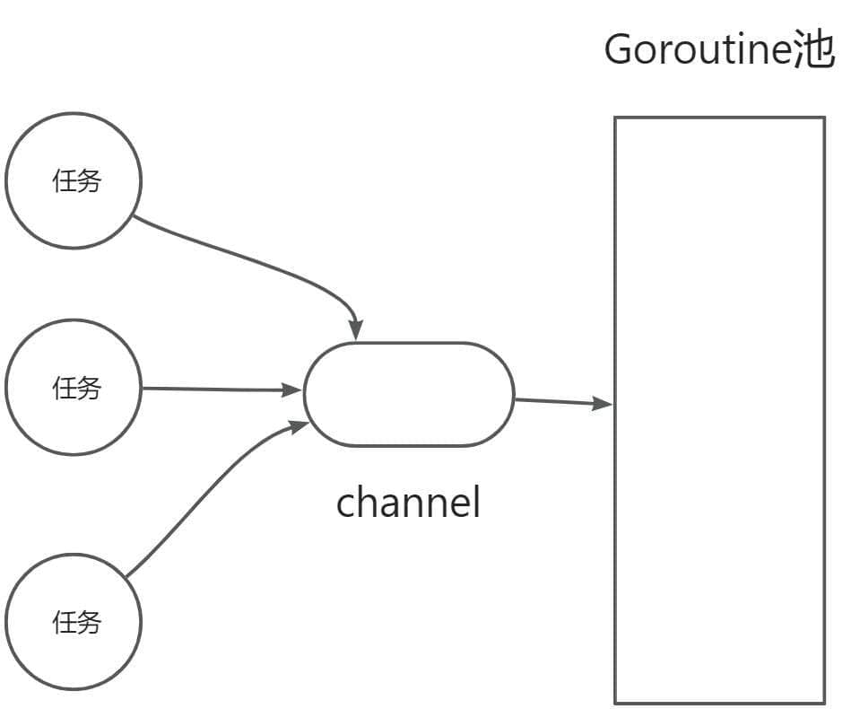

# 开发一款扫描器，Goroutine 越多越好？ - 先知社区

开发一款扫描器，Goroutine 越多越好？

- - -

## 前言

俗话说“千里之堤，溃于蚁穴”，攻击者发起攻击时的第一个重要步骤就是扫描，扫描相当于逐寸敲打“千里之堤”，试图找出可以进人的“蚁穴”，从而有针对性地对目标系统发起攻击。  
安全工作者常用的一个防御模型是 PDR 模型，防御、检测、响应，其中检测部分是利用本地或远程扫描、流程分析和入侵检测等手段，发现自己业务系统的漏洞，或者被入侵后能实时发现。  
所以，对于我们安全工作者来说，开发扫描器是非常重要的环节。得益于 Go 语言方便极强的并发性，我们对扫描器的异步性能实现，也非常简单。但是，真的可以一直 Go 下去，实现我们的扫描器？本文从一个基本的扫描器思路开始讲起，一步步带你深度分析 Go 扫描器实现中的注意事项。

## TCP 单线程端口扫描

TCP 全连接端口扫描器是最基础的扫描器，它的原理是调用 Socket 的 connect 函数连接到目标 P 的特定端口上，如果连接成功说明端口是开放的，如果连接失败，说明端口没有开放。  
对应的代码逻辑如下：

```plain
func Connect(ip string,port int)(net.Conn,error){ 
    conn,err net.DialTimeout "tcp",fmt.Sprintf "v:v",ip,port )2 time.Second) 
    defer func(){ 
        if conn!=nil{ 
            _conn.close() 
        }
    }() 
    return conn,err
}
```

如上，是一个最基本的扫描器探测实现，但是你会发现，他只能检测一次，所以一种的合理逻辑就是通过任务列表，让他支持多 IP、多端口扫描。  
伪代码思路如下：

```plain
func main() {
    for i := 0; i < task_cnt; i++ {
        //对任务列表进行依次调用探测
    }
}
```

## 有问题的多线程并发

显然，上面的逻辑虽然实现了扫描功能，但是是依次执行每一个端口探测，这种效率非常低，所以我们通常会引入并发机制来进行优化，所以，借助 Go 语言的并发特性，你会很容易地写出下面逻辑的代码：

```plain
func main() {

    for i := 0; i < task_cnt; i++ {
        go //... do some busi...
    }
}
```

这样子看似好像没有问题，但是其实非常危险，虽然 Goroutine 具备如下两个特点

-   体积轻量
-   优质的 GMP 调度

但是他还是占用资源的啊！如果无限开辟，会导致一个问题：

-   CPU 使用率浮动上涨
-   Memory 占用不断上涨。
-   主进程崩溃（被杀掉了）
    
    > 这样我空口说没有凭据，我们做个实验一探究竟。
    

### 实验验证

```plain
package main

import (
    "fmt"
    "math"
    "runtime"
)

func main() {
    //模拟扫描的任务数量
    task_cnt := math.MaxInt64

    for i := 0; i < task_cnt; i++ {
        go func(i int) {
            //... do some busi...

            fmt.Println("go func ", i, " goroutine count = ", runtime.NumGoroutine())
        }(i)
    }
}
```

执行上面代码后，最后被操作系统以 Kill 信号，强制终结了该进程：

```plain
signal: killed
```

这些资源实际上是所有用户态程序共享的资源，所以大批的 goroutine 最终引发的灾难不仅仅是自身，还会关联其他运行的程序。所以在编写逻辑的时候，限制 goroutine 是我们必须要重视的问题。

## 限制扫描 Goroutine 的方法

其实方法也很简单，通过 channel 来进行限速，但是不同限速也有不同的点，也有一些性能上的问题区别。

### 有缓存的 channel 来限制

```plain
package main

import (
    "fmt"
    "math"
    "runtime"
)

func busi(ch chan bool, i int) {

    fmt.Println("go func ", i, " goroutine count = ", runtime.NumGoroutine())
    <-ch
}

func main() {
    //模拟扫描的任务数量
    task_cnt := math.MaxInt64
    //task_cnt := 10

    ch := make(chan bool, 3)

    for i := 0; i < task_cnt; i++ {

        ch <- true

        go busi(ch, i)
    }

}
```

结果：

```plain
...
go func  352277  goroutine count =  4
go func  352278  goroutine count =  4
go func  352279  goroutine count =  4
go func  352280  goroutine count =  4
go func  352281  goroutine count =  4
go func  352282  goroutine count =  4
go func  352283  goroutine count =  4
go func  352284  goroutine count =  4
go func  352285  goroutine count =  4
go func  352286  goroutine count =  4
go func  352287  goroutine count =  4
go func  352288  goroutine count =  4
go func  352289  goroutine count =  4
go func  352290  goroutine count =  4
go func  352291  goroutine count =  4
go func  352292  goroutine count =  4
go func  352293  goroutine count =  4
go func  352294  goroutine count =  4
go func  352295  goroutine count =  4
go func  352296  goroutine count =  4
go func  352297  goroutine count =  4
go func  352298  goroutine count =  4
go func  352299  goroutine count =  4
go func  352300  goroutine count =  4
go func  352301  goroutine count =  4
go func  352302  goroutine count =  4
...
```

从结果看，程序并没有出现崩溃，而是按部就班的顺序执行，并且数量控制在 3。但是你仔细一个，这里限制的，是循环的速度，而非扫描的速度。  
所以有一个问题，如果任务很小，那么 main 进程结束了，而 Go 还没有执行完任务，这明显与我们的逻辑不一致。所以需要在结尾引入进行阻塞。

#### 阻塞等待

利用 wait，就能很容易地实现阻塞等待。

```plain
package main

import (
    "fmt"
    "math"
    "sync"
    "runtime"
)

var wg = sync.WaitGroup{}

func busi(ch chan bool, i int) {

    fmt.Println("go func ", i, " goroutine count = ", runtime.NumGoroutine())

    <-ch

    wg.Done()
}

func main() {
    //模拟扫描的任务数量
    task_cnt := math.MaxInt64

    ch := make(chan bool, 3)

    for i := 0; i < task_cnt; i++ {
        wg.Add(1)

        ch <- true

        go busi(ch, i)
    }

      wg.Wait()
}
```

### 无缓存的 channel 与任务发送/执行分类方式（推荐）

```plain
package main

import (
    "fmt"
    "math"
    "sync"
    "runtime"
)

var wg = sync.WaitGroup{}

func busi(ch chan int) {

    for t := range ch {
        fmt.Println("go task = ", t, ", goroutine count = ", runtime.NumGoroutine())
        wg.Done()
    }
}

func sendTask(task int, ch chan int) {
    wg.Add(1)
    ch <- task
}

func main() {

    ch := make(chan int)   //无buffer channel

    goCnt := 3              //启动goroutine的数量
    for i := 0; i < goCnt; i++ {
        //启动go
        go busi(ch)
    }

    taskCnt := math.MaxInt64  //模拟扫描数量
    for t := 0; t < taskCnt; t++ {
        //发送任务
        sendTask(t, ch)
    }

      wg.Wait()
}
```

这种方式，也是很多 Go 框架的 Worker 工作池方式实现，即实现了控制生产，也控制了消费。  
[](https://cdn.nlark.com/yuque/0/2024/jpeg/29466846/1709192804798-6628f8b2-b4a1-4d55-bab0-ce9a17a0d39d.jpeg)

## 实现并发的 TCP 全连接端口扫描思路

上面，我们把扫描器的并发控制进行了一个介绍，接下来我们结合这些点，谈一下实现这个扫描器，还需要其他哪些步骤，因为本文侧重讲解 Go 并发注意事项，故后面再来细致讲解实现，本篇就卖个关子先谈一些思路。

#### 生成扫描任务列表

我们的目标是实现类型于 Nmap 那样支持对多个 IP 于端口进行扫描的扫描器，要实现多 IP 扫描，需要引入一个第三方包 github.com/malfunkt/iprange，他实现了类似于 Nmap 风格的解析。使用举例如下：

```plain
package main

import (
    "log"

    "github.com/malfunkt/iprange"
)

func main() {
    list, err := iprange.ParseList("10.0.0.1, 10.0.0.5-10, 192.168.1.*, 192.168.10.0/24")
    if err != nil {
        log.Printf("error: %s", err)
    }
    log.Printf("%+v", list)

    rng := list.Expand()
    log.Printf("%s", rng)
}
```

#### 分割扫描任务

上面将并发编程中，我们说到一个点就是任务。在实际的扫描过程中，我们的工具开发，都是以任务为单位，所以我们需要对生成的任务列表进行分组。从而让每个 Goroutine 去扫描更多的端口和 IP，而不是只探测一次就结束。我们可以以\[ \]map\[IP\]Port 的的方式进行存储，更加 Port 进行切片分组。

#### 按组执行扫描任务

最后就是执行并发扫描了，也就是我们上面说到一个比较优的扫描模型。

```plain
func main() {

    ch := make(chan int)   //无buffer channel

    goCnt := 3              //启动goroutine的数量，即扫描最大任务数量
    for i := 0; i < goCnt; i++ {
        //启动go
        go busi(ch)
    }

    taskCnt := math.MaxInt64  //模拟扫描数量
    for t := 0; t < taskCnt; t++ {
        //发送扫描任务
        sendTask(t, ch)
    }

      wg.Wait()
}
```

#### 展示扫描结果

展示的话，简单的可以进行直接存储，但是在实际红队中，我们通常会将结果存入数据库，如 ES 或者 MySQL，用于后续打点的进一步挖掘分析。

> 以上就是本文的内容，希望对你有帮助！
