# 快速审计记录 (一)--inxedu - 先知社区

快速审计记录 (一)--inxedu

- - -

闲言少序，书归正传

# SQL 注入

[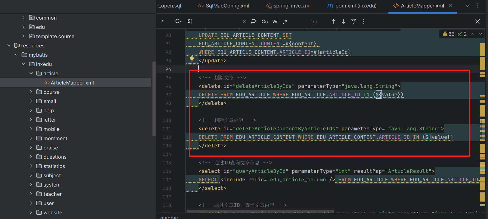](https://cdn.nlark.com/yuque/0/2024/png/21762749/1707034528079-352d4d50-ef80-4166-a266-5118f87ef299.png#averageHue=%23262a2e&clientId=uec81cdf9-4a08-4&from=paste&height=567&id=u73ab90a4&originHeight=850&originWidth=1885&originalType=binary&ratio=1.5&rotation=0&showTitle=false&size=209289&status=done&style=none&taskId=ua3f03de1-dd20-4ab1-bb70-d202fd05a55&title=&width=1256.6666666666667)  
[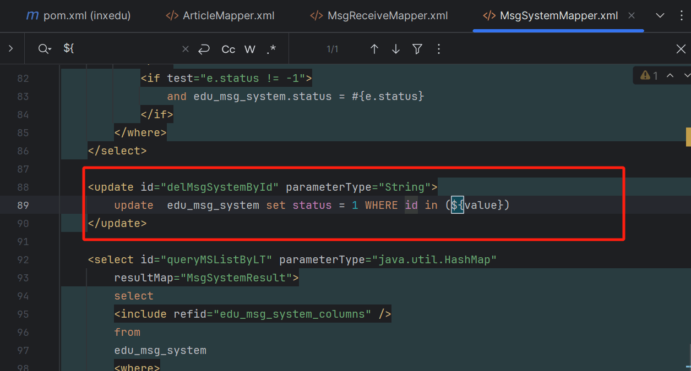](https://cdn.nlark.com/yuque/0/2024/png/21762749/1707034556689-196ef1d9-d526-4315-9884-6e76e6c69ee4.png#averageHue=%23242d31&clientId=uec81cdf9-4a08-4&from=paste&height=450&id=ubb36d42c&originHeight=675&originWidth=1255&originalType=binary&ratio=1.5&rotation=0&showTitle=false&size=100929&status=done&style=none&taskId=u1155689e-ce2a-4db4-9671-2cf28546bec&title=&width=836.6666666666666)  
Mapper 中存在不少地方用${}进行拼接，这里我仅仅跟着一个 SQL 跟踪  
`src/main/resources/mybatis/inxedu/article/ArticleMapper.xml`  
[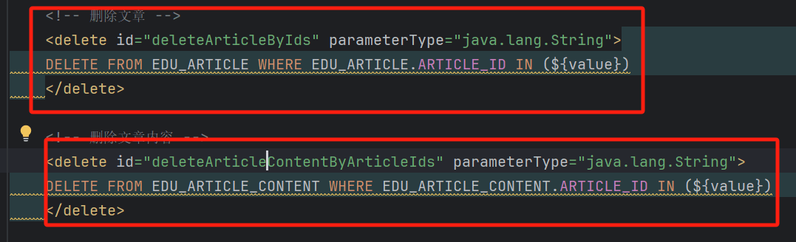](https://cdn.nlark.com/yuque/0/2024/png/21762749/1707035020504-944c2c31-0d8c-4eec-bc76-ebc010967824.png#averageHue=%2322282c&clientId=uec81cdf9-4a08-4&from=paste&height=219&id=u75cc6cd0&originHeight=328&originWidth=1077&originalType=binary&ratio=1.5&rotation=0&showTitle=false&size=50885&status=done&style=none&taskId=u1d448b82-5104-4e92-93ef-e172dbea602&title=&width=718)  
查看 dao 的调用`src/main/java/com/inxedu/os/edu/dao/article/ArticleDao.java`  
[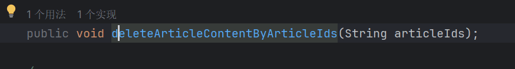](https://cdn.nlark.com/yuque/0/2024/png/21762749/1707035064528-9d6dd534-f70d-4796-becc-56a7c7853116.png#averageHue=%23212429&clientId=uec81cdf9-4a08-4&from=paste&height=79&id=iYxFN&originHeight=118&originWidth=874&originalType=binary&ratio=1.5&rotation=0&showTitle=false&size=13536&status=done&style=none&taskId=u6fa05111-7e98-4753-9b3e-1064b80545c&title=&width=582.6666666666666)  
`src/main/java/com/inxedu/os/edu/service/impl/article/ArticleServiceImpl.java`  
[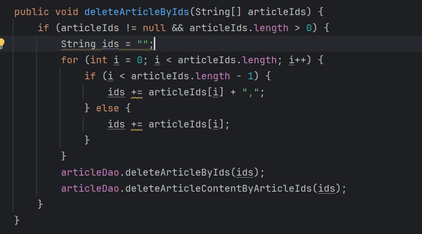](https://cdn.nlark.com/yuque/0/2024/png/21762749/1707035082275-2dddafc8-bd00-4ff2-bd2f-33a7d9a8a866.png#averageHue=%23202226&clientId=uec81cdf9-4a08-4&from=paste&height=321&id=sJRmm&originHeight=481&originWidth=867&originalType=binary&ratio=1.5&rotation=0&showTitle=false&size=58082&status=done&style=none&taskId=uc95c5551-dd0d-4d87-ad60-e6a7d4aa7c9&title=&width=578)  
`src/main/java/com/inxedu/os/edu/controller/article/AdminArticleController.java`  
[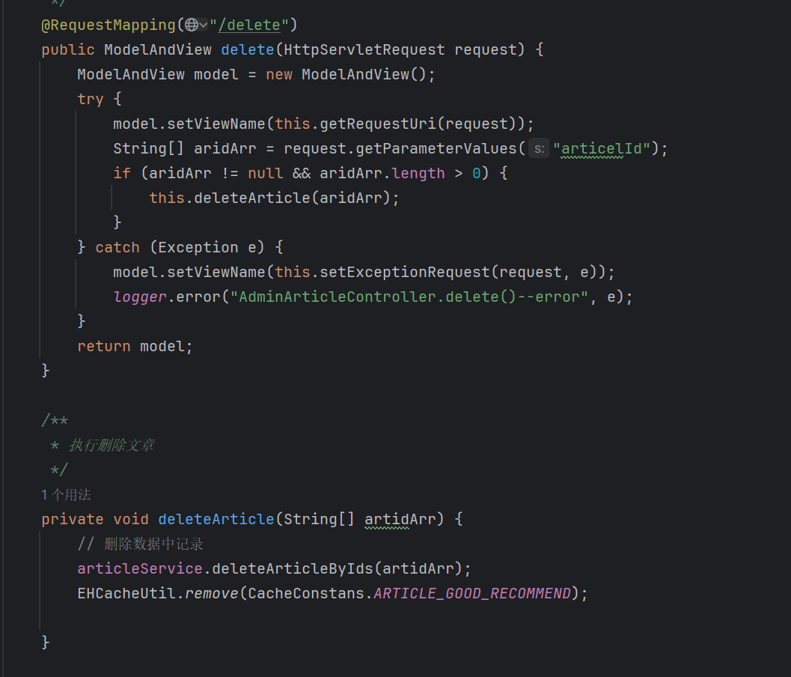](https://cdn.nlark.com/yuque/0/2024/png/21762749/1707035503382-673f98a4-3cc7-40f3-90a4-afdcce9cf461.png#averageHue=%231f2124&clientId=uec81cdf9-4a08-4&from=paste&height=603&id=aZLOu&originHeight=904&originWidth=1057&originalType=binary&ratio=1.5&rotation=0&showTitle=false&size=113021&status=done&style=none&taskId=u366a5d9c-f0b7-4051-a7ea-2ffc2eb46b2&title=&width=704.6666666666666)  
漏洞复现：  
[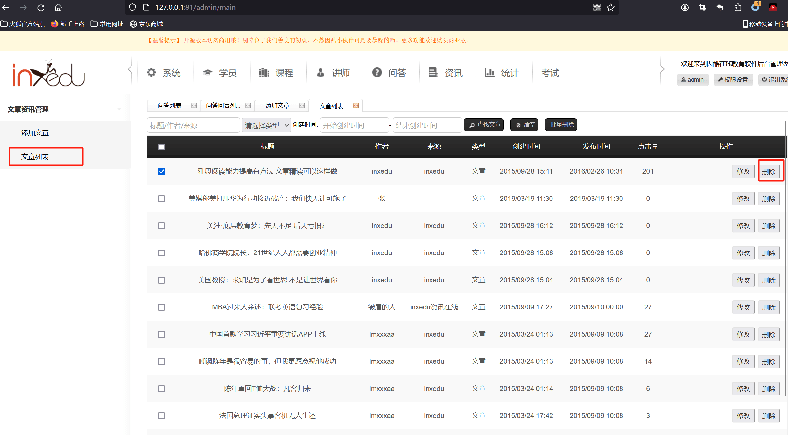](https://cdn.nlark.com/yuque/0/2024/png/21762749/1707035522410-ad96c57f-a89b-4751-a82f-6be36e7acb7b.png#averageHue=%23efeeeb&clientId=uec81cdf9-4a08-4&from=paste&height=887&id=MyDHv&originHeight=1330&originWidth=2409&originalType=binary&ratio=1.5&rotation=0&showTitle=false&size=306690&status=done&style=none&taskId=ua991e090-e530-4c9b-af72-50f13c4bb12&title=&width=1606)  
[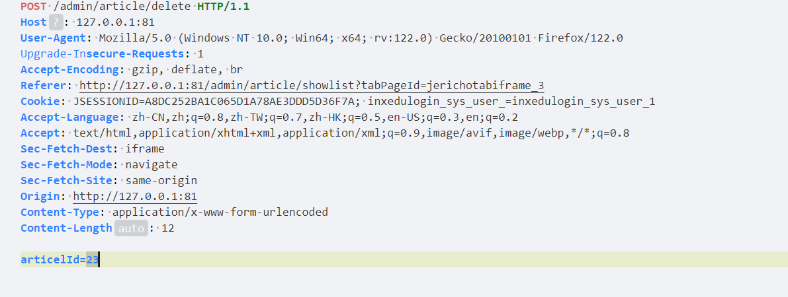](https://cdn.nlark.com/yuque/0/2024/png/21762749/1707035481662-df39a084-1cd7-4e8a-a48a-6aad9e007278.png#averageHue=%23eaeef4&clientId=uec81cdf9-4a08-4&from=paste&height=300&id=k1Orp&originHeight=450&originWidth=1191&originalType=binary&ratio=1.5&rotation=0&showTitle=false&size=69071&status=done&style=none&taskId=ud9d24bd8-07e6-4ed1-afc1-9bf4f55b2d6&title=&width=794)

[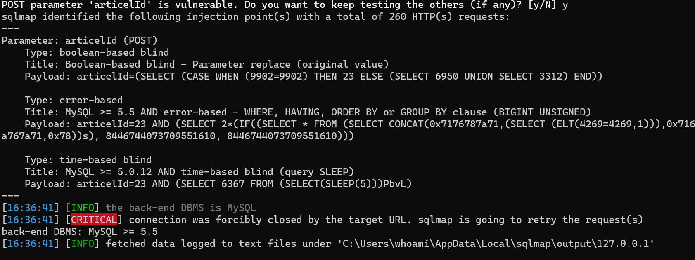](https://cdn.nlark.com/yuque/0/2024/png/21762749/1707035818383-d15798dd-47a4-4d97-9a72-dac850d014c9.png#averageHue=%231a1a1a&clientId=uec81cdf9-4a08-4&from=paste&height=421&id=oVEN4&originHeight=631&originWidth=1683&originalType=binary&ratio=1.5&rotation=0&showTitle=false&size=109903&status=done&style=none&taskId=u8997ab3a-96cc-43ad-b698-a4a04034b93&title=&width=1122)

# 任意文件上传

[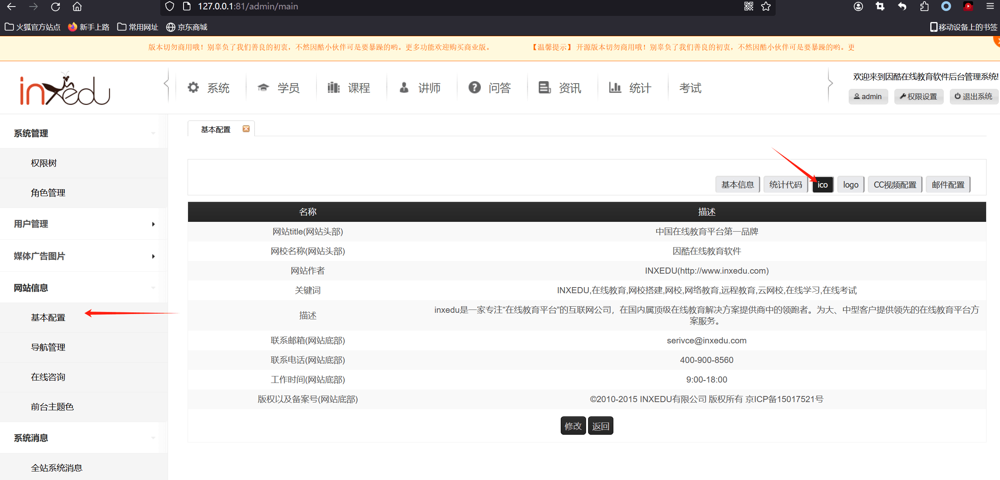](https://cdn.nlark.com/yuque/0/2024/png/21762749/1707036400638-59fe8d90-0d80-40db-9611-367729fc8111.png#averageHue=%23f2f0ee&clientId=uec81cdf9-4a08-4&from=paste&height=785&id=u13c8164e&originHeight=1177&originWidth=2452&originalType=binary&ratio=1.5&rotation=0&showTitle=false&size=229127&status=done&style=none&taskId=u1321eb71-1c60-4f12-9dcf-001cfdff014&title=&width=1634.6666666666667)  
上传 ico[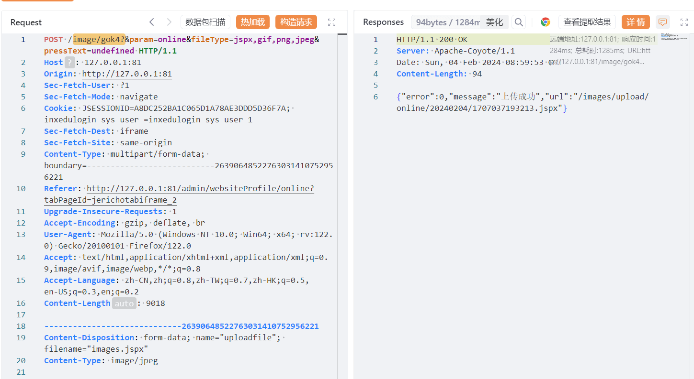](https://cdn.nlark.com/yuque/0/2024/png/21762749/1707037205261-c29663b2-06e0-4f10-9635-a23e084c5955.png#averageHue=%23ebeff4&clientId=uec81cdf9-4a08-4&from=paste&height=529&id=ude3f55b8&originHeight=793&originWidth=1449&originalType=binary&ratio=1.5&rotation=0&showTitle=false&size=153998&status=done&style=none&taskId=u1ea4a59d-db8a-4bec-8849-baec589afc5&title=&width=966)  
针对接口进行 debug  
[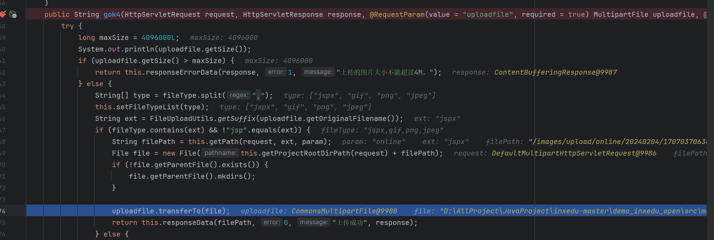](https://cdn.nlark.com/yuque/0/2024/png/21762749/1707037086155-7875b41c-4d78-4d27-958a-3f43f776e0f0.png#averageHue=%2321242a&clientId=uec81cdf9-4a08-4&from=paste&height=457&id=uf6f62c7f&originHeight=685&originWidth=2028&originalType=binary&ratio=1.5&rotation=0&showTitle=false&size=206686&status=done&style=none&taskId=u982a65e6-f039-4e09-b9a4-2d3995391d5&title=&width=1352)  
这个类封装的真的离谱，只对 jsp 进行过滤。别的直接放行。  
基本上后端所有文件上传都是用的这个接口服务，后台随便 RCE

# 越权

使用 admin 查看用户数据  
[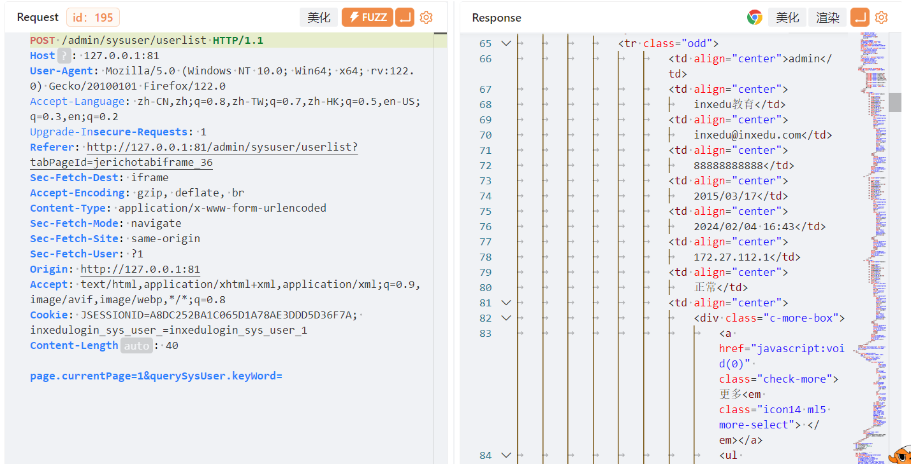](https://cdn.nlark.com/yuque/0/2024/png/21762749/1707038272449-a502f11e-6421-4376-bab3-8294ac3291f9.png#averageHue=%23ebeff4&clientId=uec81cdf9-4a08-4&from=paste&height=487&id=ue5c994d7&originHeight=730&originWidth=1429&originalType=binary&ratio=1.5&rotation=0&showTitle=false&size=195122&status=done&style=none&taskId=u5ff76245-2d5a-45f9-ad72-76b86d68064&title=&width=952.6666666666666)  
退出替换普通用户 cookie  
  
使用此用户 cookie 也可进行操作  
[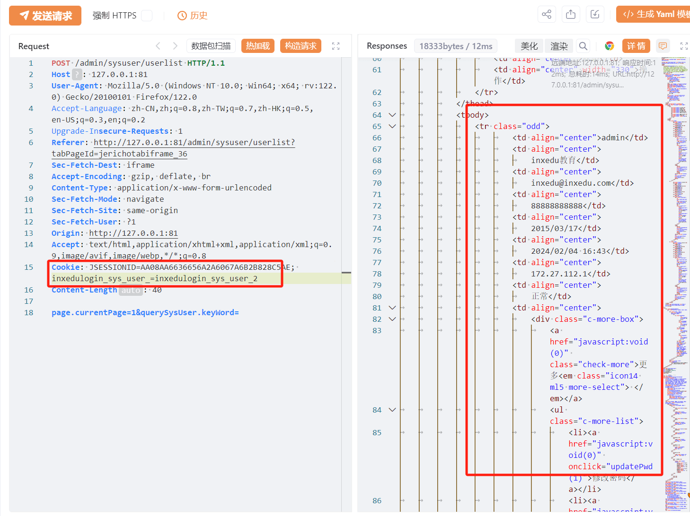](https://cdn.nlark.com/yuque/0/2024/png/21762749/1707038445695-a3267419-6bf6-448e-95da-c986f845bc55.png#averageHue=%23ecf0f4&clientId=uec81cdf9-4a08-4&from=paste&height=728&id=u7b96cbc2&originHeight=1092&originWidth=1458&originalType=binary&ratio=1.5&rotation=0&showTitle=false&size=274127&status=done&style=none&taskId=uf3d15e48-9c42-40ff-bb46-f000e2eee7d&title=&width=972)  
漏洞分析  
[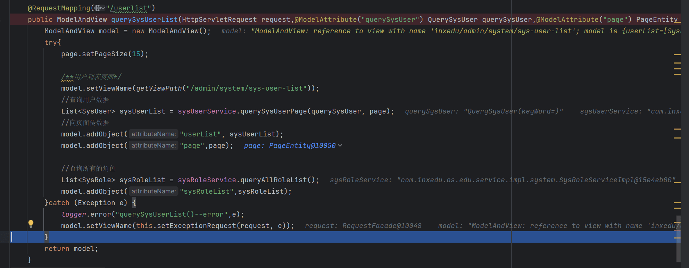](https://cdn.nlark.com/yuque/0/2024/png/21762749/1707038529755-eef4385c-231c-4243-ab80-9b9dd2644db3.png#averageHue=%2320232a&clientId=uec81cdf9-4a08-4&from=paste&height=515&id=u2ee571e8&originHeight=772&originWidth=1984&originalType=binary&ratio=1.5&rotation=0&showTitle=false&size=184031&status=done&style=none&taskId=ua1c5185d-712f-4a2f-b2e9-81cac6e5581&title=&width=1322.6666666666667)  
没有任何关于权限校验的代码前台用户也可以进行越权。

# 存储 XSS

前台用户提问  
[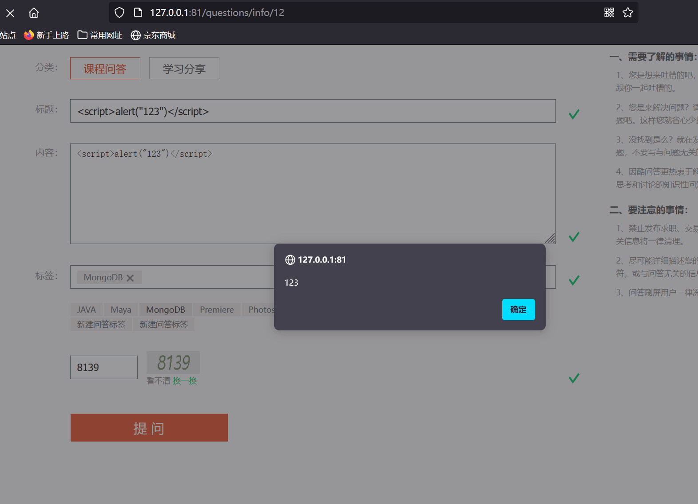](https://cdn.nlark.com/yuque/0/2024/png/21762749/1707041232275-2bcb046b-3630-4d33-96a9-d3ccc978fdac.png#averageHue=%23868589&clientId=u755977a4-f1f3-4&from=paste&height=759&id=u77c792df&originHeight=1138&originWidth=1572&originalType=binary&ratio=1.5&rotation=0&showTitle=false&size=108973&status=done&style=none&taskId=ude112ed3-6cd1-444f-ac98-8fbd57aa0a0&title=&width=1048)  
对应的 api 接口为`/questions/ajax/add`[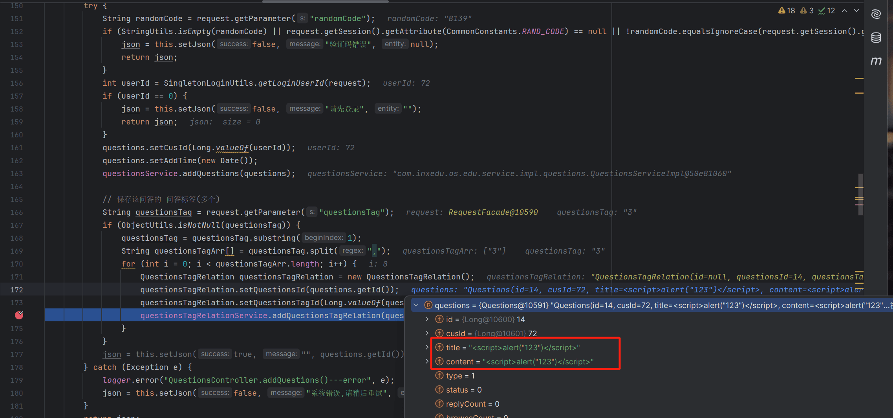](https://cdn.nlark.com/yuque/0/2024/png/21762749/1707041445854-cb16d73a-b9ad-4706-b3c9-4ebd2ff2b492.png#averageHue=%2323252a&clientId=u755977a4-f1f3-4&from=paste&height=712&id=u3b0d82d8&originHeight=1068&originWidth=2274&originalType=binary&ratio=1.5&rotation=0&showTitle=false&size=365190&status=done&style=none&taskId=u31f7f31b-1cf9-4bf9-9904-a1fadde9c48&title=&width=1516)  
这里的 title 和 content 已经被 iset 到`questionsTagRelation`属性中了，之后  
调用了`questionsTagRelationService.addQuestionsTagRelation`方法  
`src/main/java/com/inxedu/os/edu/service/impl/questions/QuestionsTagRelationServiceImpl.java`  
[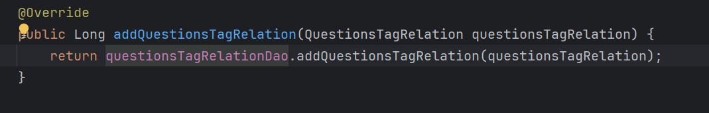](https://cdn.nlark.com/yuque/0/2024/png/21762749/1707041579641-46f7fb92-c42e-4e39-9375-fdb636131a62.png#averageHue=%23212328&clientId=u755977a4-f1f3-4&from=paste&height=115&id=u8aceade9&originHeight=172&originWidth=1069&originalType=binary&ratio=1.5&rotation=0&showTitle=false&size=23575&status=done&style=none&taskId=u0d1cf64b-89b5-477a-a946-30f4e26a431&title=&width=712.6666666666666)  
之后便是调用 dao 层，调用 xml  
[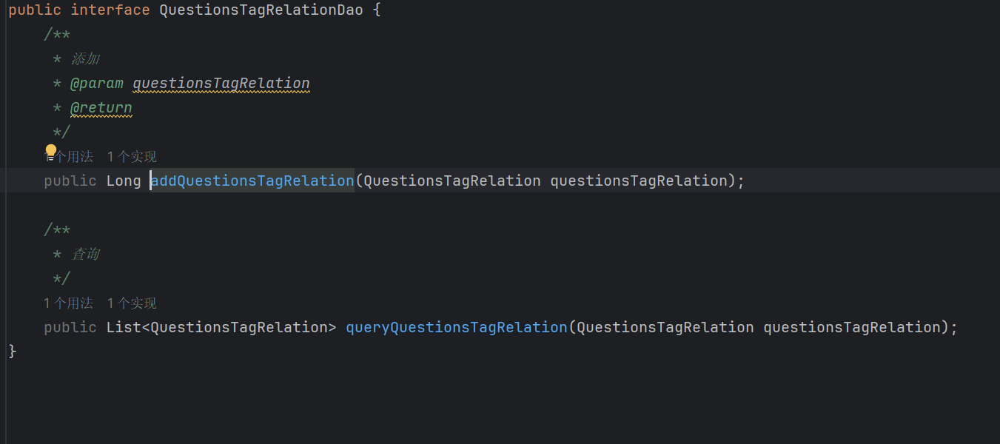](https://cdn.nlark.com/yuque/0/2024/png/21762749/1707041642225-9c7a525d-f754-430e-ab6e-5bdba93742cc.png#averageHue=%231f2024&clientId=u755977a4-f1f3-4&from=paste&height=400&id=u048aca12&originHeight=600&originWidth=1351&originalType=binary&ratio=1.5&rotation=0&showTitle=false&size=53190&status=done&style=none&taskId=u78a4ff66-b356-40ec-9a19-fbc971a3f2d&title=&width=900.6666666666666)
