# 快速审计记录 (二)--oasys - 先知社区

快速审计记录 (二)--oasys

- - -

oasys 最新版未进行审计，此次审计针对历史版本进行审计学习。

# fastjson

在最开始看项目大概的时候就注意到了这个 fastjson  
[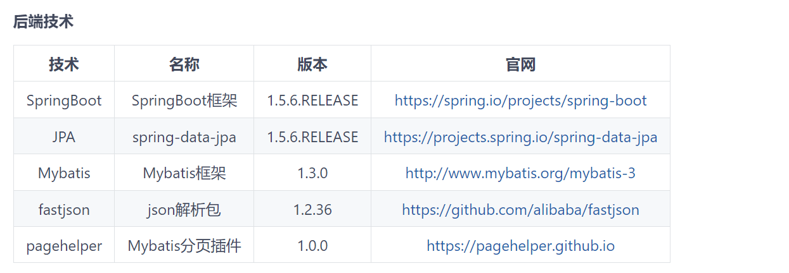](https://cdn.nlark.com/yuque/0/2024/png/21762749/1707098868797-9b00b5ba-7bff-43e0-b41e-be985614c47f.png#averageHue=%23e9d1b3&clientId=u804acea1-abde-4&from=paste&height=288&id=u34c2d993&originHeight=432&originWidth=1245&originalType=binary&ratio=1.5&rotation=0&showTitle=false&size=77359&status=done&style=none&taskId=u467800b7-d8ab-444b-b066-7cdeaaca9bc&title=&width=830)  
1.2.36 版本，多半是有漏洞的，但是去看 pom 文件  
[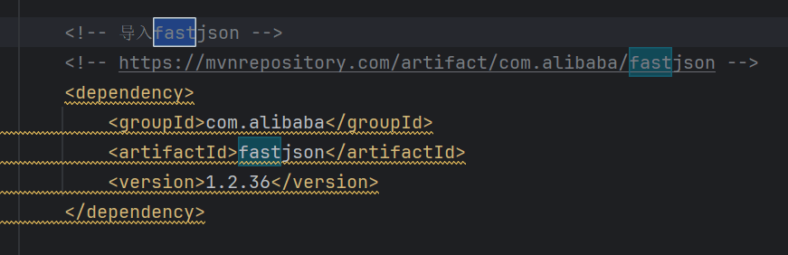](https://cdn.nlark.com/yuque/0/2024/png/21762749/1707100529850-6446f5be-c020-42b2-bc19-86e407371cce.png#averageHue=%23202226&clientId=u6afa3b57-481e-4&from=paste&height=188&id=u4ff57114&originHeight=282&originWidth=871&originalType=binary&ratio=1.5&rotation=0&showTitle=false&size=32926&status=done&style=none&taskId=ud5df4528-2bf2-47cf-a277-566d0e7b737&title=&width=580.6666666666666)  
全局搜索`JSON.parseObject`  
[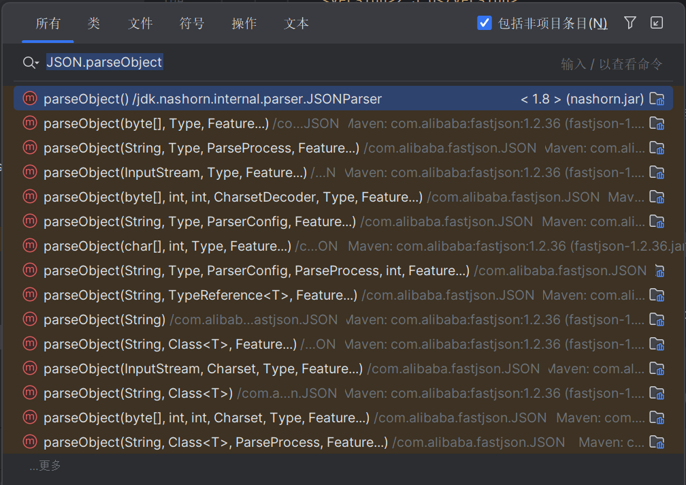](https://cdn.nlark.com/yuque/0/2024/png/21762749/1707100623671-9fb5c183-76ae-4ed8-a00a-20f9667395f3.png#averageHue=%23a0a290&clientId=u6afa3b57-481e-4&from=paste&height=475&id=ua14ada2c&originHeight=712&originWidth=1008&originalType=binary&ratio=1.5&rotation=0&showTitle=false&size=227593&status=done&style=none&taskId=u7e0d2783-33f0-462d-a4b9-21f30751d32&title=&width=672)  
并没有类调用此方法。  
在最新版本已经升级到 1.2.83 版本  
[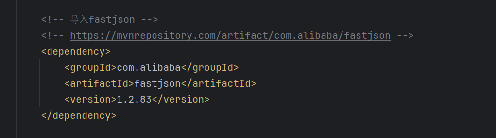](https://cdn.nlark.com/yuque/0/2024/png/21762749/1707100668514-ad0309b9-e61d-49e8-b0cc-04f0ede4e966.png#averageHue=%231f2023&clientId=u6afa3b57-481e-4&from=paste&height=190&id=u8c722e7b&originHeight=285&originWidth=1021&originalType=binary&ratio=1.5&rotation=0&showTitle=false&size=29514&status=done&style=none&taskId=u6f763c9f-9df7-48fb-af47-d978f9cfca9&title=&width=680.6666666666666)

# 薛定谔的 SQL 注入

查看 mapper 的写法，发现两个仅有的 mapper 均有使用$进行拼接  
[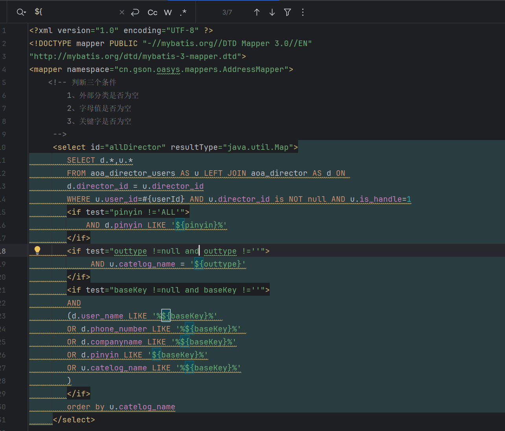](https://cdn.nlark.com/yuque/0/2024/png/21762749/1707100796875-93e617aa-f58b-47ca-b420-79443ea0653d.png#averageHue=%23242f33&clientId=u6afa3b57-481e-4&from=paste&height=731&id=u9238c7d9&originHeight=1096&originWidth=1284&originalType=binary&ratio=1.5&rotation=0&showTitle=false&size=172717&status=done&style=none&taskId=udad67b08-2512-4072-851d-0b2a6f1436c&title=&width=856)  
[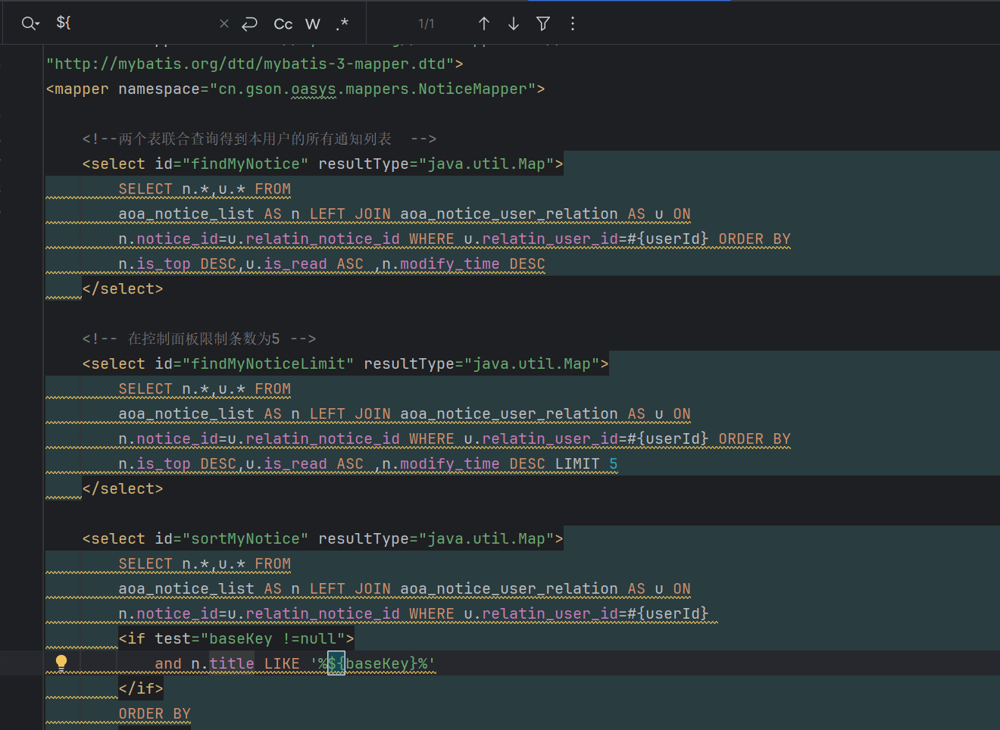](https://cdn.nlark.com/yuque/0/2024/png/21762749/1707100785676-b39d5df9-7a7c-435b-a319-08e9b6e5db8a.png#averageHue=%23242e32&clientId=u6afa3b57-481e-4&from=paste&height=643&id=u5e3e841d&originHeight=964&originWidth=1320&originalType=binary&ratio=1.5&rotation=0&showTitle=false&size=151350&status=done&style=none&taskId=u1bff3066-23fe-4a0b-8a83-813026dc5dc&title=&width=880)  
这里跟踪`src/main/resources/mappers/address-mapper.xml`对应的 dao  
[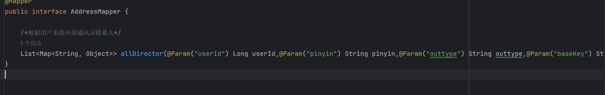](https://cdn.nlark.com/yuque/0/2024/png/21762749/1707101141851-d172555c-20d4-4d5a-ab8b-3f750d95f5c3.png#averageHue=%231f2124&clientId=u6afa3b57-481e-4&from=paste&height=199&id=u4bb1ee00&originHeight=298&originWidth=1879&originalType=binary&ratio=1.5&rotation=0&showTitle=false&size=33758&status=done&style=none&taskId=uff041475-7a1f-4004-8b27-79710fc0517&title=&width=1252.6666666666667)  
这个 dao 被`outaddresspaging`接口调用[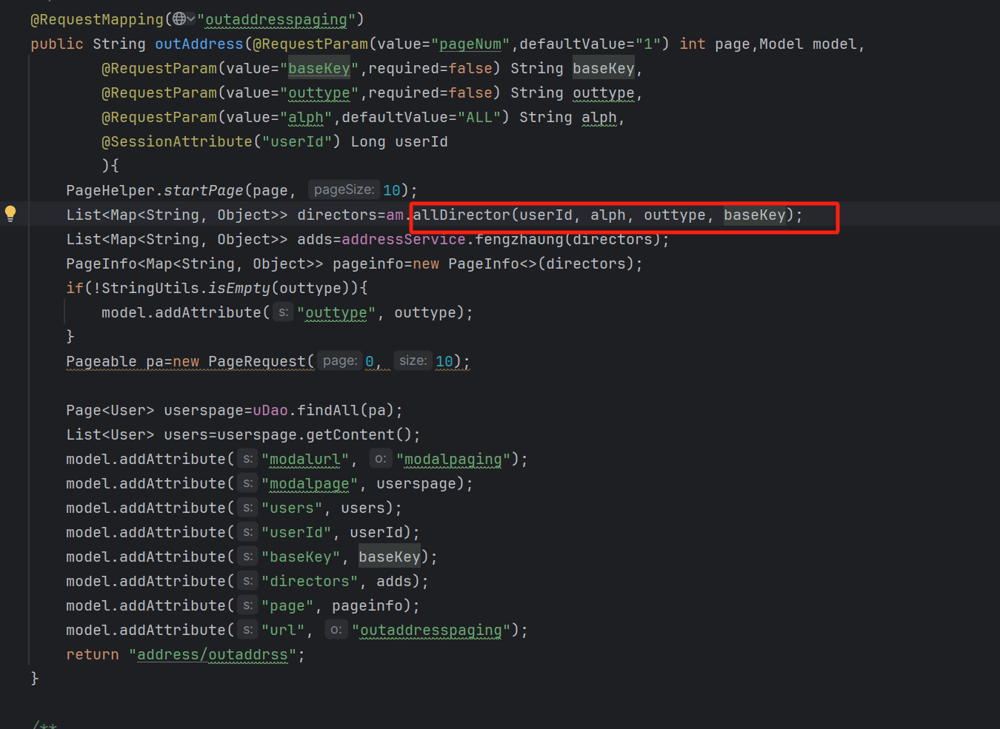](https://cdn.nlark.com/yuque/0/2024/png/21762749/1707101172699-b29d56bc-1511-44f9-a32a-2140c3d477bd.png#averageHue=%23202225&clientId=u6afa3b57-481e-4&from=paste&height=657&id=u73e513af&originHeight=985&originWidth=1350&originalType=binary&ratio=1.5&rotation=0&showTitle=false&size=211670&status=done&style=none&taskId=u15857613-4b62-4c93-b426-45e66c39079&title=&width=900)  
[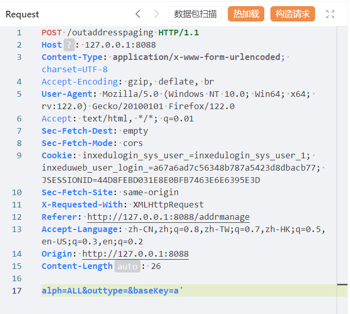](https://cdn.nlark.com/yuque/0/2024/png/21762749/1707103181966-83aad54d-665c-4cb7-93b5-d61f1d990501.png#averageHue=%23e8eef4&clientId=u6afa3b57-481e-4&from=paste&height=409&id=u29350926&originHeight=613&originWidth=682&originalType=binary&ratio=1.5&rotation=0&showTitle=false&size=82709&status=done&style=none&taskId=u584a8750-f545-4f3e-b60a-8420e819378&title=&width=454.6666666666667)  
进行 debug 测试  
[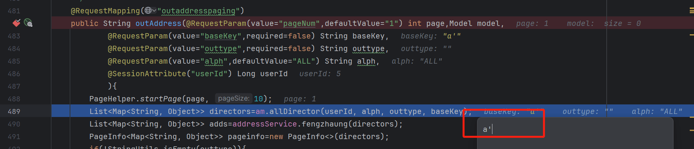](https://cdn.nlark.com/yuque/0/2024/png/21762749/1707103169546-b6932889-4825-46c0-8d6f-b0094686a92d.png#averageHue=%23232831&clientId=u6afa3b57-481e-4&from=paste&height=261&id=ua800c9d0&originHeight=391&originWidth=1804&originalType=binary&ratio=1.5&rotation=0&showTitle=false&size=139801&status=done&style=none&taskId=u57502c78-a2be-4f5b-bd50-074879addc1&title=&width=1202.6666666666667)  
查看控制台输出  
[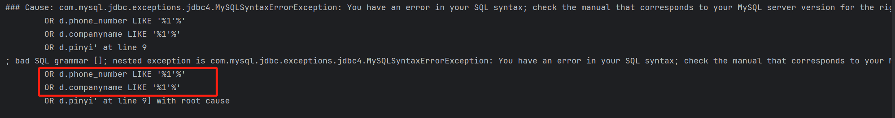](https://cdn.nlark.com/yuque/0/2024/png/21762749/1707103377905-ed0f5506-8702-4e64-816c-3ded7c5455b5.png#averageHue=%23202226&clientId=u6afa3b57-481e-4&from=paste&height=195&id=ue230020e&originHeight=292&originWidth=2200&originalType=binary&ratio=1.5&rotation=0&showTitle=false&size=53127&status=done&style=none&taskId=uef642dfd-f1f5-47a7-889f-63cc2641473&title=&width=1466.6666666666667)  
发现确实带入到了语句中，但是语句执行报错了，后端返回 500，理论上这里存在 SQL，但是进行复现的时候并未成功。  
这里去看第二个 mapper 对应的 dao  
`src/main/java/cn/gson/oasys/mappers/NoticeMapper.java`的`sortMyNotice`  
[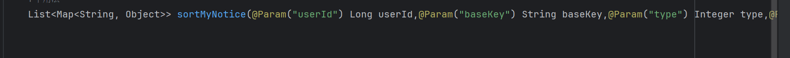](https://cdn.nlark.com/yuque/0/2024/png/21762749/1707103959052-c6b67ae4-a08f-466c-bd6a-ced142517cad.png#averageHue=%231f2125&clientId=u6afa3b57-481e-4&from=paste&height=82&id=ufdd20d07&originHeight=123&originWidth=1650&originalType=binary&ratio=1.5&rotation=0&showTitle=false&size=17335&status=done&style=none&taskId=uba737be7-bc4b-40bf-82c1-97abc80dad1&title=&width=1100)  
其调用接口如下  
[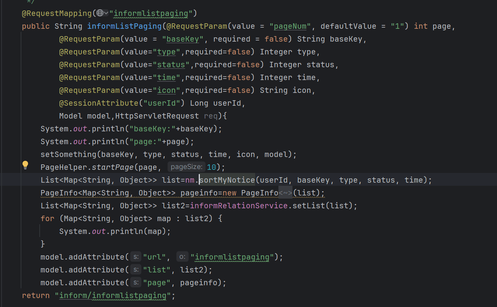](https://cdn.nlark.com/yuque/0/2024/png/21762749/1707103971823-8def8ac9-a325-41ab-bf1c-c74a29df361a.png#averageHue=%23202226&clientId=u6afa3b57-481e-4&from=paste&height=527&id=u29b0761f&originHeight=790&originWidth=1278&originalType=binary&ratio=1.5&rotation=0&showTitle=false&size=190666&status=done&style=none&taskId=u30537af6-63be-436d-828a-a4dded2631c&title=&width=852)  
这里要通知列表的分页，因为通知太少 只有一个，就先搁置吧。  
[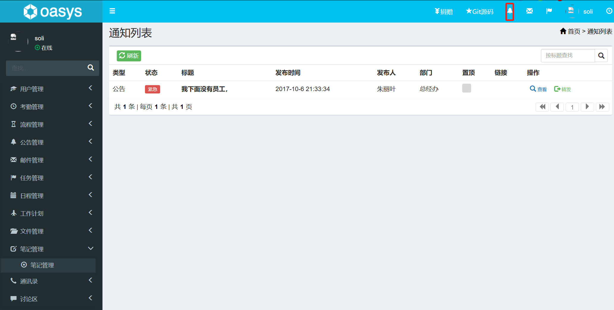](https://cdn.nlark.com/yuque/0/2024/png/21762749/1707104503683-38e284d2-461e-404e-a356-d9017a8d2193.png#averageHue=%23b2c7d0&clientId=u6afa3b57-481e-4&from=paste&height=697&id=u5dee410f&originHeight=1045&originWidth=2067&originalType=binary&ratio=1.5&rotation=0&showTitle=false&size=99667&status=done&style=none&taskId=u3356479f-f82a-404f-98e6-54a049cf0e0&title=&width=1378)

# 任意文件上传

[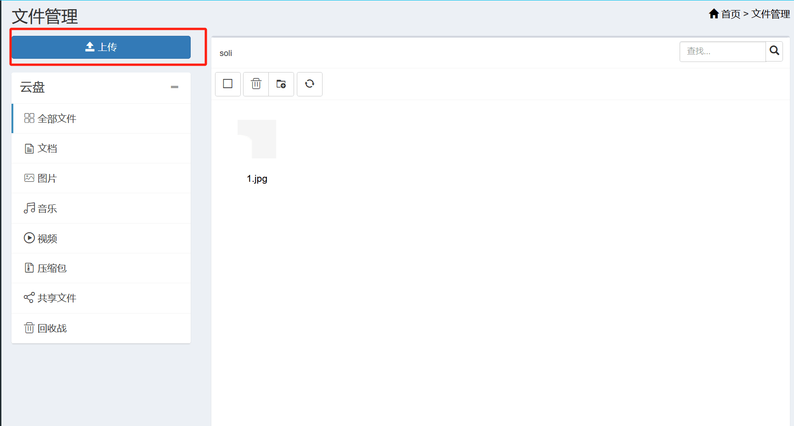](https://cdn.nlark.com/yuque/0/2024/png/21762749/1707104956144-419ee7f4-1c9f-4ef9-9ca1-64f19c2c6558.png#averageHue=%23fefdfc&clientId=u6afa3b57-481e-4&from=paste&height=619&id=u6c7ed7d9&originHeight=928&originWidth=1728&originalType=binary&ratio=1.5&rotation=0&showTitle=false&size=40065&status=done&style=none&taskId=ub66ddbee-419e-427b-ac1c-fa5a6083341&title=&width=1152)  
修改后缀为 jsp  
[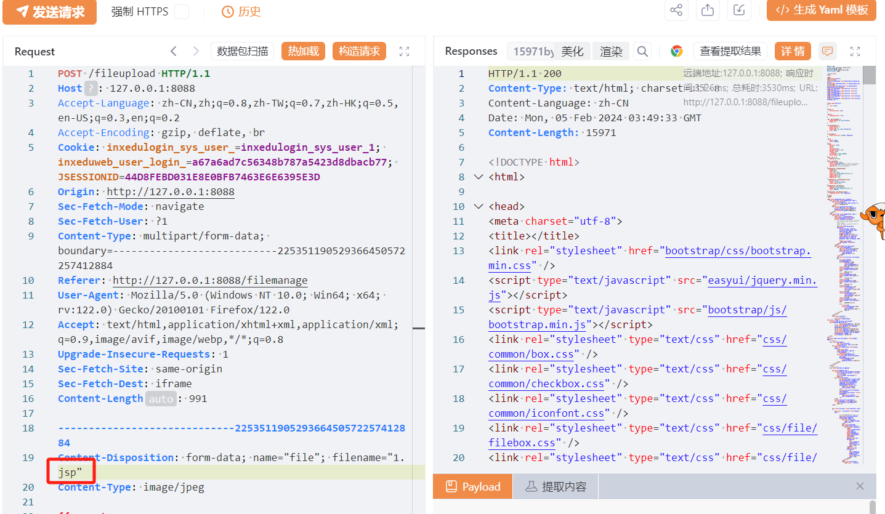](https://cdn.nlark.com/yuque/0/2024/png/21762749/1707105001849-ff18aa92-e230-4612-8e29-9907f13efc79.png#averageHue=%23ebeff4&clientId=u6afa3b57-481e-4&from=paste&height=557&id=u0010570a&originHeight=835&originWidth=1437&originalType=binary&ratio=1.5&rotation=0&showTitle=false&size=256252&status=done&style=none&taskId=u8898d5fa-20c6-4e37-8bbe-54370d04c51&title=&width=958)  
查看接口  
[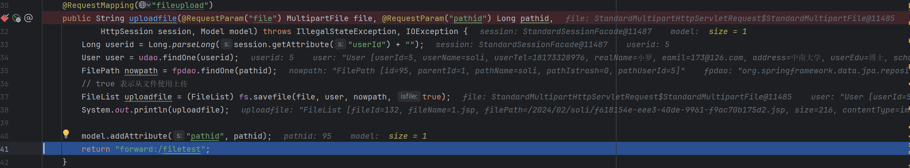](https://cdn.nlark.com/yuque/0/2024/png/21762749/1707104933703-d59947c6-f965-4167-9185-fbba95194778.png#averageHue=%2322262f&clientId=u6afa3b57-481e-4&from=paste&height=283&id=u240c7e08&originHeight=424&originWidth=2289&originalType=binary&ratio=1.5&rotation=0&showTitle=false&size=172699&status=done&style=none&taskId=uf94addb3-9a41-45f3-85aa-8ef7981b7cb&title=&width=1526)  
代码处对文件后缀并未过滤，可上传 jsp，这里我想尝试 [https://forum.butian.net/share/2499](https://forum.butian.net/share/2499)  
此文章的做法，上传 jar 包，控制路径，getshell，但是发现代码对文件名进行了随机数生成，无法目录穿越  
[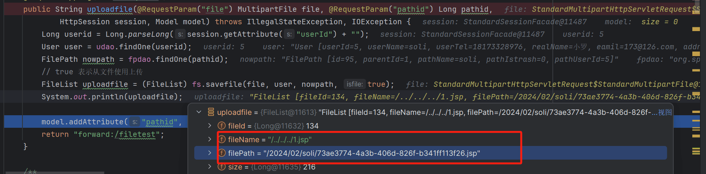](https://cdn.nlark.com/yuque/0/2024/png/21762749/1707105347886-5a844253-4f17-47ab-a754-3f4505e1aaf7.png#averageHue=%23262a32&clientId=u6afa3b57-481e-4&from=paste&height=306&id=uebd30d7c&originHeight=459&originWidth=1857&originalType=binary&ratio=1.5&rotation=0&showTitle=false&size=190667&status=done&style=none&taskId=ua59db780-6ffd-4355-8ecb-68fb1d28aef&title=&width=1238)

# 失败的任意文件读取和任意文件删除

[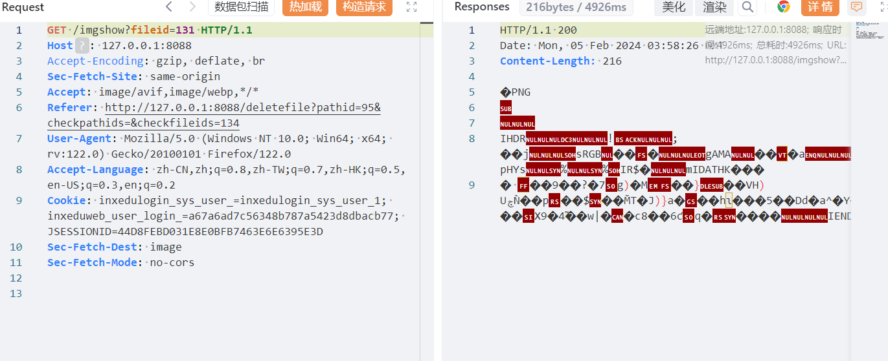](https://cdn.nlark.com/yuque/0/2024/png/21762749/1707105513752-a91fe5e6-8874-49f6-a9c2-3b0938a8ff32.png#averageHue=%23ebeff3&clientId=u6afa3b57-481e-4&from=paste&height=373&id=u820b8426&originHeight=559&originWidth=1371&originalType=binary&ratio=1.5&rotation=0&showTitle=false&size=118298&status=done&style=none&taskId=u7b533c67-5658-4b7d-b6bf-88ffe54d731&title=&width=914)  
发现图片展示，对应的 id，想尝试构造目录穿越，查看代码  
[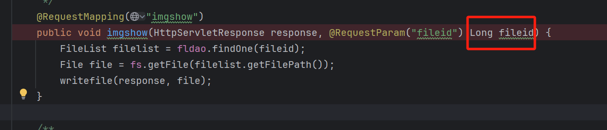](https://cdn.nlark.com/yuque/0/2024/png/21762749/1707105560415-209be6bc-fd5c-4cef-924e-baf1da43559d.png#averageHue=%23212226&clientId=u6afa3b57-481e-4&from=paste&height=179&id=ubdcbaa79&originHeight=268&originWidth=1245&originalType=binary&ratio=1.5&rotation=0&showTitle=false&size=38702&status=done&style=none&taskId=u2604ab97-e8ea-4b13-a114-6f560124a7d&title=&width=830)  
下一位，任意文件删除。G  
[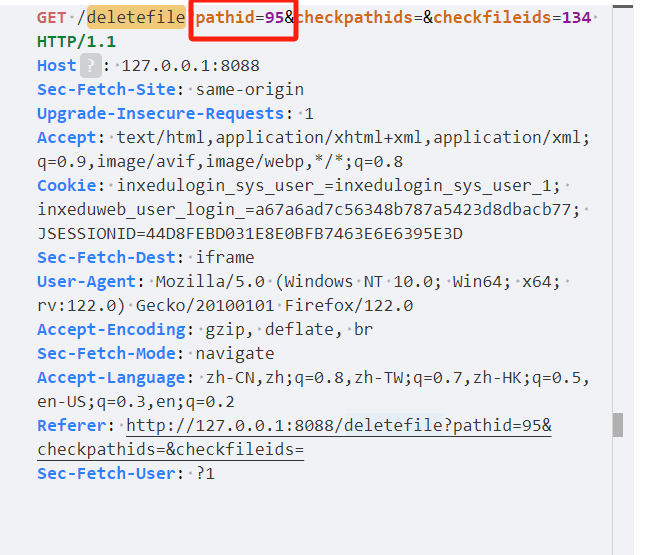](https://cdn.nlark.com/yuque/0/2024/png/21762749/1707105617680-9463674d-5553-44c4-8cf1-adc545aa8a49.png#averageHue=%23e8edf3&clientId=u6afa3b57-481e-4&from=paste&height=370&id=uc8f910e0&originHeight=555&originWidth=645&originalType=binary&ratio=1.5&rotation=0&showTitle=false&size=70274&status=done&style=none&taskId=uff25ba47-4ed6-410e-a601-f95fc162f21&title=&width=430)  
[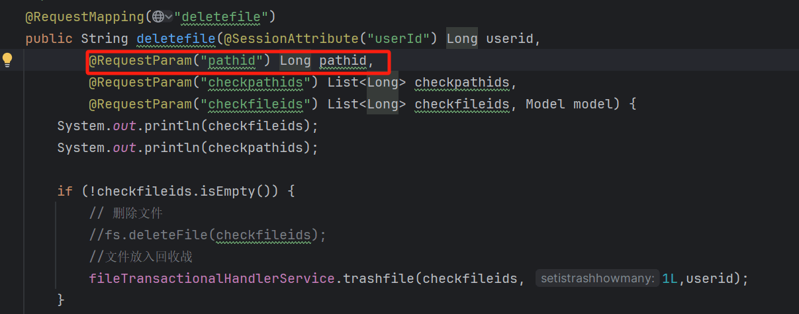](https://cdn.nlark.com/yuque/0/2024/png/21762749/1707105605286-33e70162-fc37-4a4d-9f6f-e8bcb23c2f35.png#averageHue=%23202225&clientId=u6afa3b57-481e-4&from=paste&height=317&id=u10e54cb5&originHeight=475&originWidth=1207&originalType=binary&ratio=1.5&rotation=0&showTitle=false&size=91083&status=done&style=none&taskId=uc70195fb-a610-44ab-a582-86cc2b8b3a4&title=&width=804.6666666666666)

# 越权

[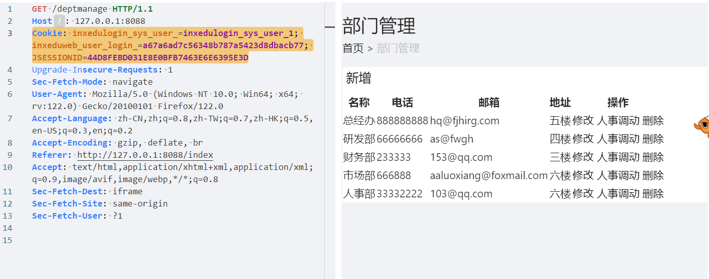](https://cdn.nlark.com/yuque/0/2024/png/21762749/1707106247169-19b83d1a-df5d-4383-be87-6c5f3a9f7d4f.png#averageHue=%23bae1dd&clientId=u6afa3b57-481e-4&from=paste&height=367&id=uddfa9908&originHeight=550&originWidth=1395&originalType=binary&ratio=1.5&rotation=0&showTitle=false&size=148528&status=done&style=none&taskId=u4d60bfc1-6197-43df-83fa-a9931448f80&title=&width=930)  
用 admin 用户查看用户列表，切换普通用户  
[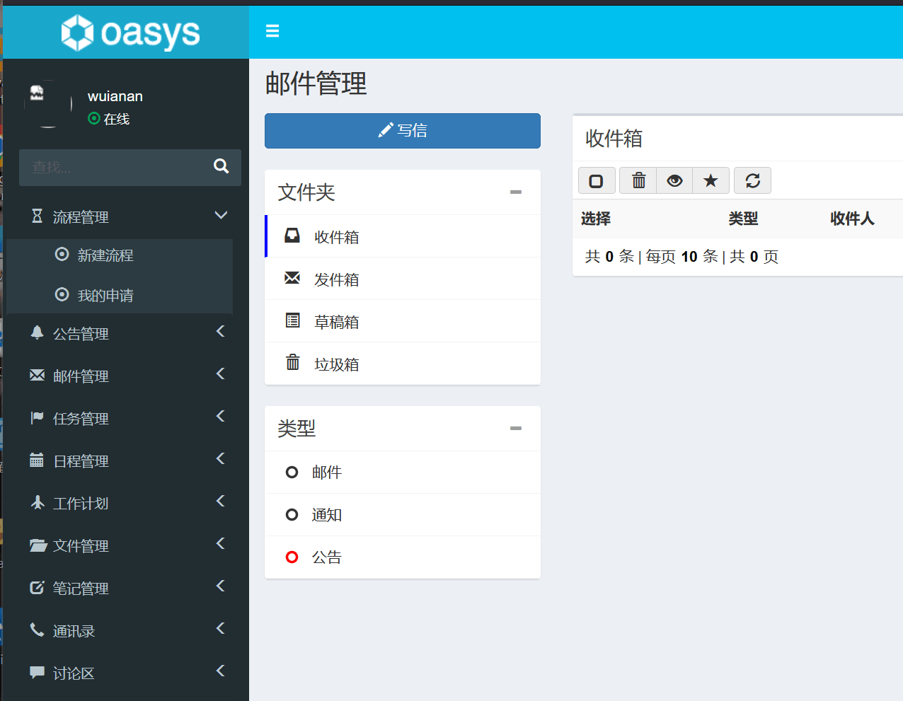](https://cdn.nlark.com/yuque/0/2024/png/21762749/1707106274906-1cb71765-249e-4df4-b216-1e973cddbc42.png#averageHue=%231e5260&clientId=u6afa3b57-481e-4&from=paste&height=661&id=ub17e6e5f&originHeight=991&originWidth=1276&originalType=binary&ratio=1.5&rotation=0&showTitle=false&size=87441&status=done&style=none&taskId=ue2e73787-3e0a-4975-b58d-07297aa8141&title=&width=850.6666666666666)  
可以看到普通用户没有用户管理这一项  
用普通用户的 cookie 进行操作依旧可行  
[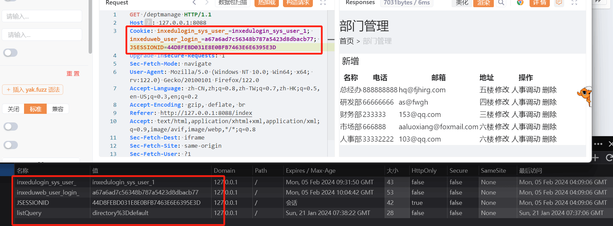](https://cdn.nlark.com/yuque/0/2024/png/21762749/1707106342659-0a2a4aa5-8704-47ca-8bb5-02b32b14014b.png#averageHue=%23acd7cc&clientId=u6afa3b57-481e-4&from=paste&height=441&id=ucf07895a&originHeight=661&originWidth=1785&originalType=binary&ratio=1.5&rotation=0&showTitle=false&size=243527&status=done&style=none&taskId=u57220b7f-368b-4cff-9a70-6c5372ba398&title=&width=1190)  
debug 查看代码  
[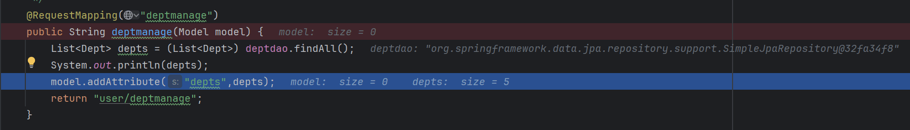](https://cdn.nlark.com/yuque/0/2024/png/21762749/1707106416886-634d0f84-2194-4f5b-a93c-607381c280c9.png#averageHue=%23212834&clientId=u6afa3b57-481e-4&from=paste&height=172&id=ud39b7ccc&originHeight=258&originWidth=1795&originalType=binary&ratio=1.5&rotation=0&showTitle=false&size=59294&status=done&style=none&taskId=u0665d2e1-8bfc-4e0a-b3b3-f19153d83c2&title=&width=1196.6666666666667)  
并未做权限设置。并且之后查看代码发现管理员的操作接口都未作权限设置。

# XSS

xss 就不审计了，没有任何过滤，基本上跟数据库又交互的地方都有 XSS

# 小结

后台文件处并不能控制路径 所以并不能 RCE
