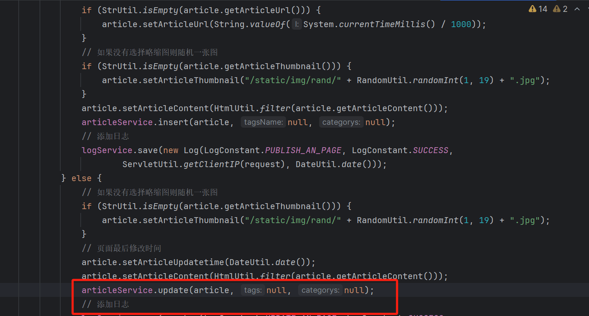
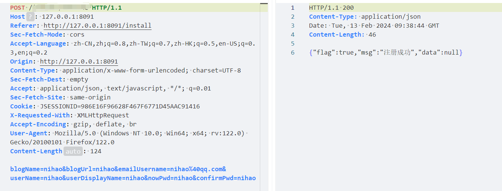

# 快速审计记录 (五)--某 blog 系统 - 先知社区

快速审计记录 (五)--某 blog 系统

- - -

# SQL 注入

首先去 mapper.xml 中去查找是否有`${`进行拼接的情况  
  
找出对应的 dao 层  
  
调用方法为 update 方法  
  
到保存文章的界面  
 本以为有希望，但是发现在 xml 中`parameterType="java.lang.Integer"`只允许接受 Integer 类型的参数  
之后找到一个`Example_Where_Clause`但是全局搜索并未找到 dao 层，估计是用来做示例的  
  
最终找到一个  
  
对应的 dao  
  
对应的 service  
  
但是经过查看代码，这种`xxxByExample`都是不可控的。细看这个 service 都是传入`themeName`到那时传入`selectByExample`的是`themeExample`

# 网站注册处逻辑处理错误导致用户登录异常

此 blog 在第一次使用的时候会出现用户注册的情况  
  
再次重发  
  
发现出现错误  
去查看代码处理  
  
并未做多次写入的判断，直接进行了保存  
  
两次`userService.save``optionsService.save`都进行了保存，在进行`insert`操作的时候出现了错误，导致前端回显错误  
查看数据库表时候，可以看到成功插入  
  
之后进行登录时出现错误  
  
查看报错  
  
应该返回一个或者 null 但是返回了多个结果，导致用户无法登录。可直接影响管理员用户的登录。

# 任意文件上传

此网站的所有上传接口均为此接口  
  
查看上传文件详情的时候可以看到路径  
  
查看代码  
  
调用`uploadAttachment`方法  
  
主要对上传文件进行了重命名和获取后缀，也就是无法通过`../`进行目录穿越，只能上传 webshell，但是此 blog 不解析 jsp

# 失败的任意文件删除

  
删除处通过上传的时候赋予的 id 进行删除操作，查看代码  
  
可以看到 id 的类型为 int 无法进行目录穿越进行任意文件删除

# fastjson

  
1.2.83，但是代码中并未使用 paresobject  
  
参考[https://y4tacker.github.io/2023/04/26/year/2023/4/FastJson%E4%B8%8E%E5%8E%9F%E7%94%9F%E5%8F%8D%E5%BA%8F%E5%88%97%E5%8C%96-%E4%BA%8C/](https://y4tacker.github.io/2023/04/26/year/2023/4/FastJson%E4%B8%8E%E5%8E%9F%E7%94%9F%E5%8F%8D%E5%BA%8F%E5%88%97%E5%8C%96-%E4%BA%8C/)

# 失败的未授权记录

  
鉴权系统为 Spring Web MVC 拦截器  
这里主要看`excludePathPatterns`要走`loginAuthenticator`和`installInterceptor`  
  
 通过代码得知，`loginAuthenticator`必须要有 user 的 session 才可以返回 true，`installInterceptor`必须已经注册，这里我想到是否可以通过`/install/../admin/`进行未授权调用 admin 接口，这里却直接解析到`loginAuthenticator`  

