# 快速审计记录 (四)--某管理系统 - 先知社区

快速审计记录 (四)--某管理系统

- - -

# SQL 注入查找

Mybatis 审计技巧，众所周知，MyBatis 支持两种参数符号，一种是#，另一种是$，#使用预编译，$使用拼接 SQL。在 SQL 语句中使用 like，order by，in 语句中，使用 #{} 会将对象转成字符串，形成 order by \\"user\\" desc 造成错误，因此很多研发会采用${}来解决，从而造成 SQL 注入  
查看 mapper 文件，或者全局搜索`${`  
[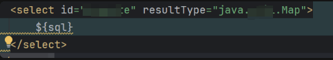](https://cdn.nlark.com/yuque/0/2024/png/21762749/1707454588651-35db5ef3-95d3-4aeb-88fb-ac98daf4ef33.png#averageHue=%23252c2f&clientId=u1a050abd-bc2d-4&from=paste&height=58&id=u3dcb3b4d&originHeight=87&originWidth=483&originalType=binary&ratio=1.5&rotation=0&showTitle=false&size=12584&status=done&style=none&taskId=ubccef180-4fc3-485f-9cf7-4773b973d49&title=&width=322)  
找到一处这里使用的是$拼接符号  
其对应的 mapper 的 dao 层如[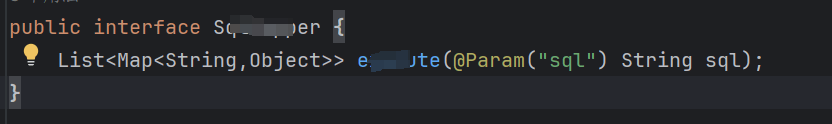](https://cdn.nlark.com/yuque/0/2024/png/21762749/1707454633020-52834c7e-52c7-4af2-a4ce-e31429c62044.png#averageHue=%23222429&clientId=u1a050abd-bc2d-4&from=paste&height=83&id=u241b78d2&originHeight=124&originWidth=832&originalType=binary&ratio=1.5&rotation=0&showTitle=false&size=15608&status=done&style=none&taskId=u899bdfdb-9f60-48ce-b99c-9f9c44b4a45&title=&width=554.6666666666666)  
查看此方法被那个 controller 调用[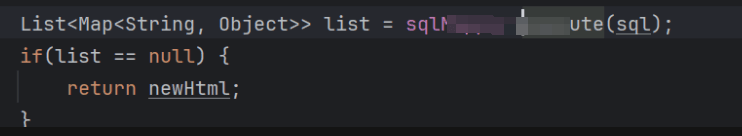](https://cdn.nlark.com/yuque/0/2024/png/21762749/1707454705364-39c91ecf-81f3-4d94-9929-618a2bc6ec7f.png#averageHue=%23222428&clientId=u1a050abd-bc2d-4&from=paste&height=91&id=u3c8f1f66&originHeight=136&originWidth=742&originalType=binary&ratio=1.5&rotation=0&showTitle=false&size=21285&status=done&style=none&taskId=u8860b43b-bb2e-4531-bb71-45e82936b81&title=&width=494.6666666666667)  
在可控参数处插入 SQL 语句查询`SELECT SCHEMA_NAME AS NAME FROM information_schema.SCHEMATA LIMIT 0;`  
尝试 debug 可以看到前端传入的 SQL 语句已经被执行了[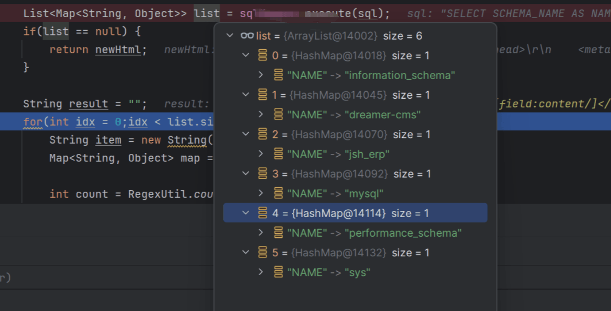](https://cdn.nlark.com/yuque/0/2024/png/21762749/1707454750652-eec65774-e18e-46d2-9953-e55cdbf1e90a.png#averageHue=%23292c33&clientId=u1a050abd-bc2d-4&from=paste&height=433&id=udfd25426&originHeight=649&originWidth=1275&originalType=binary&ratio=1.5&rotation=0&showTitle=false&size=233477&status=done&style=none&taskId=ua72c11c7-47c3-4d81-822f-6a5625d0ba6&title=&width=850)

# 失败的目录穿越

查看代码[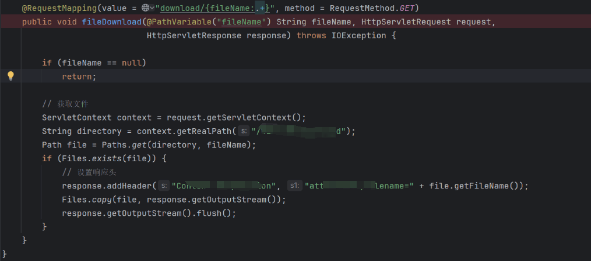](https://cdn.nlark.com/yuque/0/2024/png/21762749/1707026047475-cba251b7-8f7f-4fd3-9754-4e1a4d57a34b.png#averageHue=%23202125&clientId=u5f11db5c-dd70-4&from=paste&height=300&id=u4ca02ed8&originHeight=450&originWidth=1014&originalType=binary&ratio=1.5&rotation=0&showTitle=false&size=104742&status=done&style=none&taskId=u375ca846-3b1b-4ef0-aa35-93b5767cc37&title=&width=676)  
发现没有对`../`进行过滤，尝试挖掘  
get 请求`/WMS/commons/fileSource/download/../1.txt`，发现返回 404，才发现他的 value 的值如下`value = "download/{fileName:.+}"`这里直接拼接`/../`springboot 会解析到上层接口  
如下写法即可直接解析`/../`

```plain
@RequestMapping(value = "/download/**", method = RequestMethod.GET)
public void downloadFile(@PathVariable String fileName, HttpServletResponse response) throws IOException {
    // ...
}
```

要想在这个接口进行目录穿越就要`如下请求/WMS/commons/fileSource/download/supplierInfo.xlsx/../1.txt`  
但是被`@PathVariable`注解取出参数为 1.txt,，所以此处并无任意文件读取。

# 越权[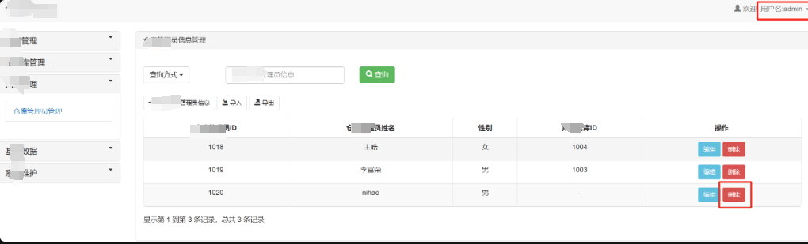](https://cdn.nlark.com/yuque/0/2024/png/21762749/1707026088754-ad073996-b45b-48a6-8b8d-1aac8336e0ad.png#averageHue=%23f7f6f6&clientId=u5f11db5c-dd70-4&from=paste&height=206&id=ua1031857&originHeight=309&originWidth=1020&originalType=binary&ratio=1.5&rotation=0&showTitle=false&size=37567&status=done&style=none&taskId=u0770ec56-2d79-4e1a-b7b4-d3f85eafc30&title=&width=680)

请求包如下  
[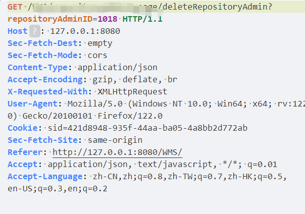](https://cdn.nlark.com/yuque/0/2024/png/21762749/1707026129581-32bf92d8-7093-4a84-a0c3-f034704a2763.png#averageHue=%23e7ecf3&clientId=u5f11db5c-dd70-4&from=paste&height=283&id=u2a88a91f&originHeight=424&originWidth=604&originalType=binary&ratio=1.5&rotation=0&showTitle=false&size=61313&status=done&style=none&taskId=u853c81f2-ee45-4b04-b4e0-8247b8fb5dc&title=&width=402.6666666666667)  
登录普通用户，使用普通用户的 cookie 进行操作，即可删除成功  
查看代码也没有看到鉴权的地方  
[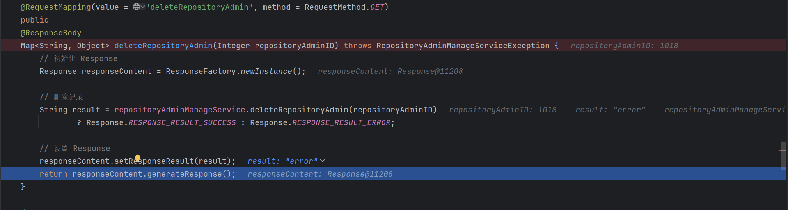](https://cdn.nlark.com/yuque/0/2024/png/21762749/1707018512864-43ed69c8-cadf-455d-8ac3-5ffa728e94a1.png#averageHue=%2320242c&clientId=u8fbacc72-bcc4-4&from=paste&height=360&id=ud4030ef4&originHeight=540&originWidth=2020&originalType=binary&ratio=1.5&rotation=0&showTitle=false&size=110657&status=done&style=none&taskId=u4969ba24-1df2-4270-befb-998419c5749&title=&width=1346.6666666666667)  
通读后端的 api 都没有做相关的鉴权处理，只对 cookie 的 sid 的值做了判断。

# 未授权

我想看看它的鉴权系统是怎么做的，这里他用的 shiro 做的权限配置

> Shiro 的认证流程如下：
> 
> 1.  用户提交登录请求
> 2.  Shiro Filter 拦截请求
> 3.  Shiro Filter 根据请求的 URL 配置，判断是否需要进行身份认证
> 4.  如果需要进行身份认证，Shiro Filter 将请求转发给认证器
> 5.  认证器根据用户的身份信息进行认证
> 6.  如果认证成功，Shiro Filter 将请求转发给目标资源
> 7.  如果认证失败，Shiro Filter 将返回登录页面

其中安全管理器是 Shiro 的核心，负责 Shiro 的所有安全操作。安全管理器需要配置以下几个属性：

-   Realm：用于认证和授权的领域
-   记住我管理器：用于记住用户的登录状态
-   认证器：用于进行身份认证
-   授权器：用于进行权限授权

再看 shiro 的配置的时候，发现一个控制 URL 权限信息的地方  
[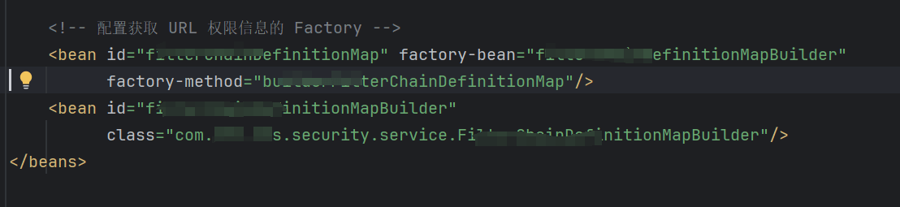](https://cdn.nlark.com/yuque/0/2024/png/21762749/1707043389791-7adc508e-29ef-42be-ad6b-5928251da6e5.png#averageHue=%231f2125&clientId=uda25b173-7ab7-4&from=paste&height=170&id=u7ff1e847&originHeight=255&originWidth=1108&originalType=binary&ratio=1.5&rotation=0&showTitle=false&size=40148&status=done&style=none&taskId=u791039bf-4eed-4e8b-b2fc-5301442069f&title=&width=738.6666666666666)  
查看其中对应的白名单创建类如下  
[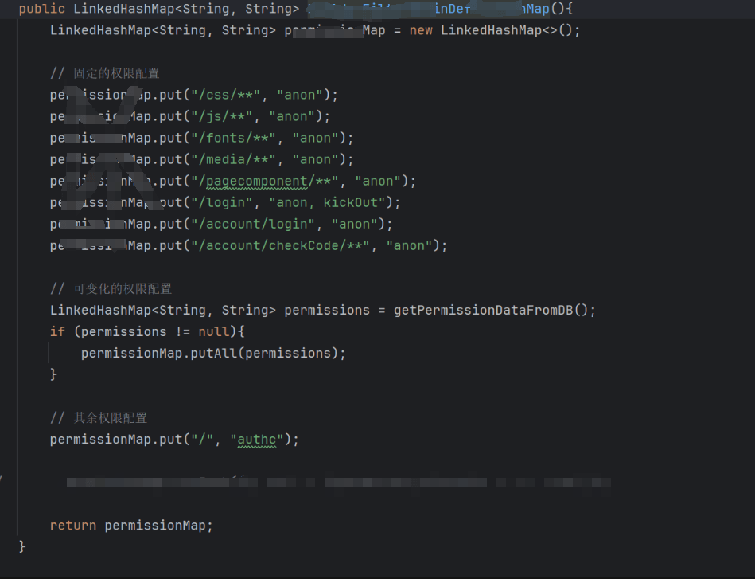](https://cdn.nlark.com/yuque/0/2024/png/21762749/1707026186909-fabaed40-b6f0-4f20-9561-4747131b1797.png#averageHue=%23202125&clientId=u5f11db5c-dd70-4&from=paste&height=485&id=ufd71f8e2&originHeight=727&originWidth=949&originalType=binary&ratio=1.5&rotation=0&showTitle=false&size=143641&status=done&style=none&taskId=u7d1d029d-5732-4391-bb69-9ba278308d2&title=&width=632.6666666666666)  
这个类用于构建一个定义权限规则的 Map 结构。该 Map 将 URL 路径映射到对应的过滤器链，用来控制对这些 URL 的访问权限。  
这里在请求的时候，在路径上添加这些前缀即可 `/css/,/js/,/fonts/,/media/,/pagecomponent/,/account/checkCode/`[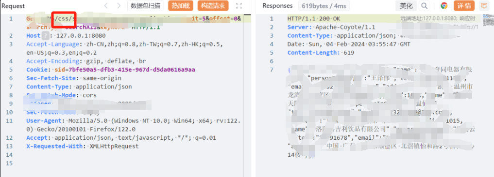](https://cdn.nlark.com/yuque/0/2024/png/21762749/1707026399870-f5d2c426-caee-4be3-b0ff-3415293cf868.png#averageHue=%23e8ebef&clientId=u5f11db5c-dd70-4&from=paste&height=244&id=u553c3fa4&originHeight=366&originWidth=1017&originalType=binary&ratio=1.5&rotation=0&showTitle=false&size=174887&status=done&style=none&taskId=uabd38efc-549a-424c-900c-8bec0f2d93c&title=&width=678)

# 存储型 XSS

[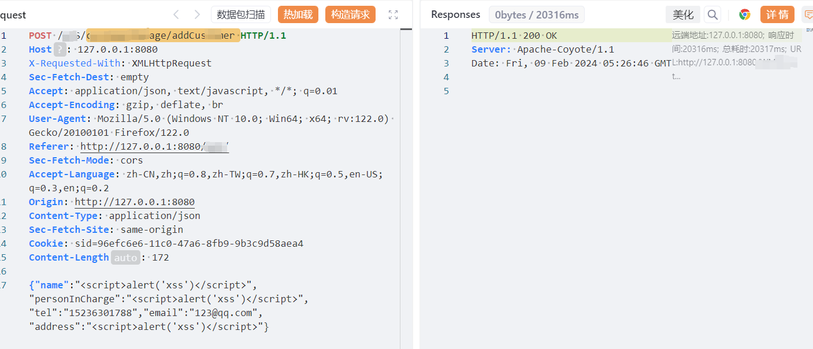](https://cdn.nlark.com/yuque/0/2024/png/21762749/1707456441536-2800fc6a-bf28-4d8f-8b5b-3c3716fb8af4.png#averageHue=%23eceff4&clientId=u8a921088-4e04-4&from=paste&height=403&id=u6350ed78&originHeight=604&originWidth=1407&originalType=binary&ratio=1.5&rotation=0&showTitle=false&size=110980&status=done&style=none&taskId=u84731eeb-d40f-4629-883f-6d72c9ccedd&title=&width=938)  
查看接口处进行 debug  
[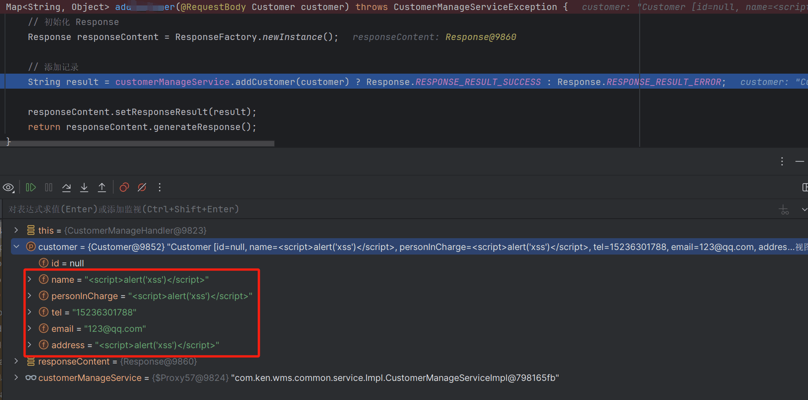](https://cdn.nlark.com/yuque/0/2024/png/21762749/1707456502126-2636044f-a5e5-4f95-9411-500c6efcfda4.png#averageHue=%23282c33&clientId=u8a921088-4e04-4&from=paste&height=587&id=u60fc93b7&originHeight=880&originWidth=1776&originalType=binary&ratio=1.5&rotation=0&showTitle=false&size=177284&status=done&style=none&taskId=uf73451eb-428b-49e4-9a1e-6e5a647b14d&title=&width=1184)  
查看 dao 层  
[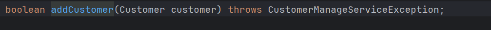](https://cdn.nlark.com/yuque/0/2024/png/21762749/1707456529714-117da3f1-c5d6-4871-b91f-82e09ffd5f8b.png#averageHue=%2324272d&clientId=u8a921088-4e04-4&from=paste&height=44&id=u4ec40df3&originHeight=66&originWidth=1032&originalType=binary&ratio=1.5&rotation=0&showTitle=false&size=11773&status=done&style=none&taskId=u7381b274-7964-46c7-beb1-2b70817dcaf&title=&width=688)  
之后就是调用 mapper.xml 中的对应的 sql 语句  
[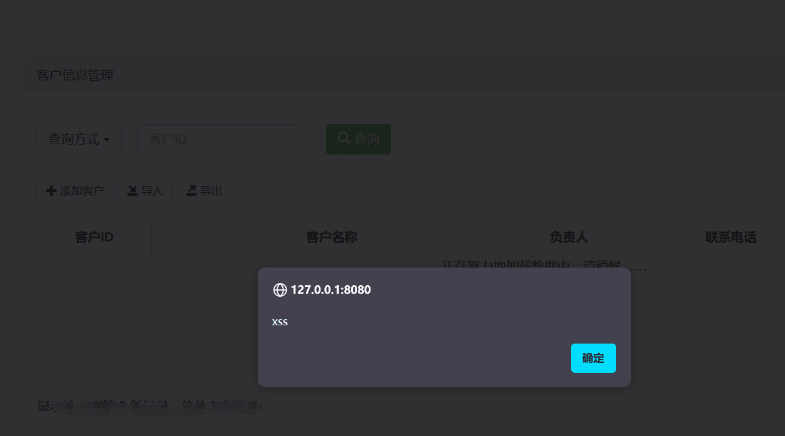](https://cdn.nlark.com/yuque/0/2024/png/21762749/1707456692888-874ceaea-3eaa-4669-b091-af8c99ebbf2e.png#averageHue=%23313035&clientId=u8a921088-4e04-4&from=paste&height=478&id=ud0ba1f2d&originHeight=717&originWidth=1288&originalType=binary&ratio=1.5&rotation=0&showTitle=false&size=33569&status=done&style=none&taskId=u526d9b55-86f7-4854-8bb7-0e0a15991af&title=&width=858.6666666666666)  
没有任何对 XSS 的过滤，所里理论上不止这一个接口，所有跟数据库又交互的地方，应该都有 XSS

# shiro

[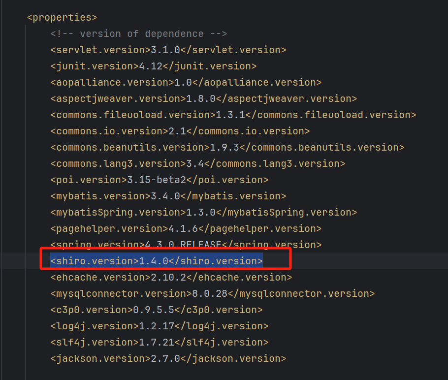](https://cdn.nlark.com/yuque/0/2024/png/21762749/1707456883672-cc8b1a64-6fd9-4728-b00b-6af526064a4f.png#averageHue=%231f2125&clientId=u8a921088-4e04-4&from=paste&height=515&id=u20f1e5d3&originHeight=772&originWidth=910&originalType=binary&ratio=1.5&rotation=0&showTitle=false&size=111813&status=done&style=none&taskId=ua97b7f5b-09f9-40c3-b434-91c53b157c9&title=&width=606.6666666666666)  
版本很老，shiro 的 721 是 1.4.2 版本之后，也就是说自 2019 年之后 shiro 的漏洞 它都有。攻击方法具体参考如下：[https://www.jianshu.com/p/833582b2f560](https://www.jianshu.com/p/833582b2f560)

# 小结

这个管理系统后台没有上传点和模板管理处，无法 RCE。只针对从各个功能点的缺陷进行审计。
