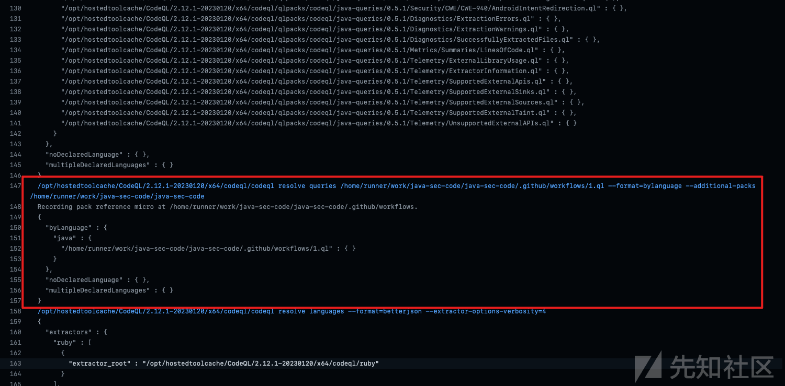

# 思路分享：解决 Codeql 本地使用时编译不成功问题 - 先知社区

思路分享：解决 Codeql 本地使用时编译不成功问题

- - -

# 写在前面的话

CodeQL 很强，基础配置啥的网上教程一堆，可以自行去搜索一下。本文主要是记录本地环境执行不成功的情况下，如何利用现有的渠道是执行我们的规则。本文仅仅是一种思路，欢迎补充内容

这里使用的就是 Github 自带的 actions 去实现。主要是为了解决如：**codeql 如何扫描 Android 项目**中因为环境搭建失败导致无法继续使用 codeql 的情况。

# 一般操作流程

举个例子来进行说明吧

1、在 Github 上找一个自己想要扫描的项目，并 Fork 下来

> 案例项目：[https://github.com/JoyChou93/java-sec-code](https://github.com/JoyChou93/java-sec-code)

[](https://xzfile.aliyuncs.com/media/upload/picture/20230412155826-ce2369f6-d907-1.png)

[](https://xzfile.aliyuncs.com/media/upload/picture/20230412155830-d0513de8-d907-1.png)

点击 configure 进入，相关功能，会出现如下图所示界面，我们现在使用默认的配置文件去扫描项目代码。直接点击 start commit，然后就是下一步、下一步的操作。

[](https://xzfile.aliyuncs.com/media/upload/picture/20230412155833-d2498392-d907-1.png)

[](https://xzfile.aliyuncs.com/media/upload/picture/20230412155836-d437436c-d907-1.png)

有过 actions 使用经验的同学，此时已经点到相关功能去观察扫描流程的执行情况了。

[](https://xzfile.aliyuncs.com/media/upload/picture/20230412155839-d6268d66-d907-1.png)

当扫描执行结束后，漏洞结果会在如下指示的地方显示。

[](https://xzfile.aliyuncs.com/media/upload/picture/20230412155843-d81e335c-d907-1.png)

# 使用自己的规则

在将要扫描的项目目录中创建漏洞规则和规则必要文件，偷懒的选择了 codeql 执行配置文件所在的目录，在此处创建相关文件。

[](https://xzfile.aliyuncs.com/media/upload/picture/20230412155846-da10b380-d907-1.png)

演示我们这里拉一下官方 xss 的规则，改一下名字。

[](https://xzfile.aliyuncs.com/media/upload/picture/20230412155849-dc01149c-d907-1.png)

qlpack.yml 文件的内容，可参考官方或其他大佬项目中的内容进行编写，这个内容相信大家在接触 codeql 初期就已经了解过了。接下来，编辑 codeql.yml。

[](https://xzfile.aliyuncs.com/media/upload/picture/20230412155852-dde8157e-d907-1.png)

在配置文件中，初级阶段使用下（仅仅执行自己的漏洞规则）修改的地方不多。步骤 Initialize Code 修改前的规则内容：

[](https://xzfile.aliyuncs.com/media/upload/picture/20230412155856-dfd07b90-d907-1.png)

修改后的内容为：（注意添加规则前有个 + 号，官方在当前步骤的注释里附上了相关链接，用以介绍如何加载自定义规则）

[](https://xzfile.aliyuncs.com/media/upload/picture/20230412155859-e1b5b1e8-d907-1.png)

当文件都修改完成后，和一般步骤一样，保存下一步，进入 actions 功能，查看初始化日志，确认我们的规则是否被加载。

[](https://xzfile.aliyuncs.com/media/upload/picture/20230412155902-e3ab0f50-d907-1.png)

发现了自己的规则被加载。如果遇到与 qlpack.yml 文件相关的报错，去规则目录下按官网实例添加，大概率可以解决。

[](https://xzfile.aliyuncs.com/media/upload/picture/20230412155905-e5acd354-d907-1.png)

回到一般操作查看结果地方查看我们规则的结果，发现规则的结果已经过来了。

[](https://xzfile.aliyuncs.com/media/upload/picture/20230412155909-e7a1a6d2-d907-1.png)

# 获取 Github 编译成功的结果，本地使用

Github 要使用的包地址[https://github.com/actions/upload-artifact.git](https://github.com/actions/upload-artifact.git)

前面的步骤和本文《使用自己规则》一样，只用修改创建 Actions 的 codeql.yml 配置文件，个人配置内容如下：

```plain
# For most projects, this workflow file will not need changing; you simply need
# to commit it to your repository.
#
# You may wish to alter this file to override the set of languages analyzed,
# or to provide custom queries or build logic.
#
# ******** NOTE ********
# We have attempted to detect the languages in your repository. Please check
# the `language` matrix defined below to confirm you have the correct set of
# supported CodeQL languages.
#
name: "CodeQL"

on:
  push:
    branches: [ "master" ]
  pull_request:
    # The branches below must be a subset of the branches above
    branches: [ "master" ]
  schedule:
    - cron: '26 22 * * 6'

jobs:
  analyze:
    name: Analyze
    runs-on: ubuntu-latest
    permissions:
      actions: read
      contents: read
      security-events: write

    strategy:
      fail-fast: false
      matrix:
        language: [ 'java' ]
        # CodeQL supports [ 'cpp', 'csharp', 'go', 'java', 'javascript', 'python', 'ruby' ]
        # Use only 'java' to analyze code written in Java, Kotlin or both
        # Use only 'javascript' to analyze code written in JavaScript, TypeScript or both
        # Learn more about CodeQL language support at https://aka.ms/codeql-docs/language-support

    steps:
    - name: Checkout repository
      uses: actions/checkout@v3

    # Initializes the CodeQL tools for scanning.
    - name: Initialize CodeQL
      uses: github/codeql-action/init@v2
      with:
        languages: ${{ matrix.language }}
        # If you wish to specify custom queries, you can do so here or in a config file.
        # By default, queries listed here will override any specified in a config file.
        # Prefix the list here with "+" to use these queries and those in the config file.

        # Details on CodeQL's query packs refer to : https://docs.github.com/en/code-security/code-scanning/automatically-scanning-your-code-for-vulnerabilities-and-errors/configuring-code-scanning#using-queries-in-ql-packs
        # queries: security-extended,security-and-quality


    # Autobuild attempts to build any compiled languages  (C/C++, C#, Go, or Java).
    # If this step fails, then you should remove it and run the build manually (see below)
    - name: Autobuild
      uses: github/codeql-action/autobuild@v2

    # Command-line programs to run using the OS shell.
    #
```

#### 积分打赏

1 分 2 分 5 分

  

8 分 10 分 20 分

关闭 确定

1.  5 条回复

-    [篖\*柔](https://xz.aliyun.com/u/66313) 2023-04-12 19:13:12 来自湖北
    
    最后部分有点内容被吞掉了，在这里补充一次：
    
    ```plain
    # For most projects, this workflow file will not need changing; you simply need
    # to commit it to your repository.
    #
    # You may wish to alter this file to override the set of languages analyzed,
    # or to provide custom queries or build logic.
    #
    # ******** NOTE ********
    # We have attempted to detect the languages in your repository. Please check
    # the `language` matrix defined below to confirm you have the correct set of
    # supported CodeQL languages.
    #
    name: "CodeQL"
    
    on:
      push:
        branches: [ "master" ]
      pull_request:
        # The branches below must be a subset of the branches above
        branches: [ "master" ]
      schedule:
        - cron: '26 22 * * 6'
    
    jobs:
      analyze:
        name: Analyze
        runs-on: ubuntu-latest
        permissions:
          actions: read
          contents: read
          security-events: write
    
        strategy:
          fail-fast: false
          matrix:
            language: [ 'java' ]
            # CodeQL supports [ 'cpp', 'csharp', 'go', 'java', 'javascript', 'python', 'ruby' ]
            # Use only 'java' to analyze code written in Java, Kotlin or both
            # Use only 'javascript' to analyze code written in JavaScript, TypeScript or both
            # Learn more about CodeQL language support at https://aka.ms/codeql-docs/language-support
    
        steps:
        - name: Checkout repository
          uses: actions/checkout@v3
    
        # Initializes the CodeQL tools for scanning.
        - name: Initialize CodeQL
          uses: github/codeql-action/init@v2
          with:
            languages: ${{ matrix.language }}
            # If you wish to specify custom queries, you can do so here or in a config file.
            # By default, queries listed here will override any specified in a config file.
            # Prefix the list here with "+" to use these queries and those in the config file.
    
            # Details on CodeQL's query packs refer to : https://docs.github.com/en/code-security/code-scanning/automatically-scanning-your-code-for-vulnerabilities-and-errors/configuring-code-scanning#using-queries-in-ql-packs
            # queries: security-extended,security-and-quality
    
    
        # Autobuild attempts to build any compiled languages  (C/C++, C#, Go, or Java).
        # If this step fails, then you should remove it and run the build manually (see below)
        - name: Autobuild
          uses: github/codeql-action/autobuild@v2
    
        # ℹ️ Command-line programs to run using the OS shell.
        # 
                                
    ```
    
    0 回复 Ta
    
    - - -
    

-    [篖\*柔](https://xz.aliyun.com/u/66313) 2023-04-12 19:13:57 来自湖北
    
    ```plain
    # If this step fails, then you should remove it and run the build manually (see below)
        - name: Autobuild
          uses: github/codeql-action/autobuild@v2
    
        # ℹ️ Command-line programs to run using the OS shell.
        # 
                                
    ```
    
    0 回复 Ta
    
    - - -
    

-    [篖\*柔](https://xz.aliyun.com/u/66313) 2023-04-12 19:14:29 来自湖北
    
    [](https://xzfile.aliyuncs.com/media/upload/picture/20230412191425-2f071492-d923-1.png)
    
    0 回复 Ta
    
    - - -
    

-    [篖\*柔](https://xz.aliyun.com/u/66313) 2023-04-12 19:15:22 来自湖北
    
    执行步骤过程：
    
    [](https://tuchuang-1303875118.cos.ap-shanghai.myqcloud.com/TyporaIMG/202302131636692.png)
    
    过程执行结束，相关文件获取内容。
    
    [](https://tuchuang-1303875118.cos.ap-shanghai.myqcloud.com/TyporaIMG/202302131635340.png)
    
    0 回复 Ta
    
    - - -
    

-    [紫霞仙子](https://xz.aliyun.com/u/4791) 2023-04-13 10:48:24 来自北京
    
    特殊字符或者表情，导致内容截断了，ℹ️
    
    0 回复 Ta
    
    - - -
    

[**登录**](https://account.aliyun.com/login/login.htm?oauth_callback=https%3A%2F%2Fxz.aliyun.com%2Ft%2F12412&from_type=xianzhi) 后跟帖
