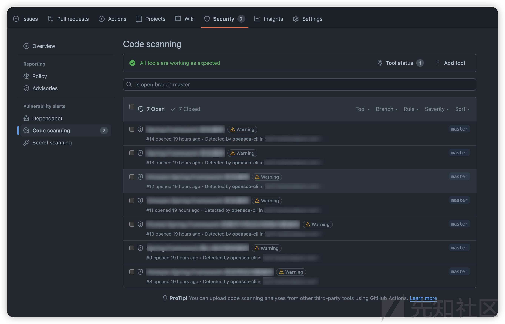
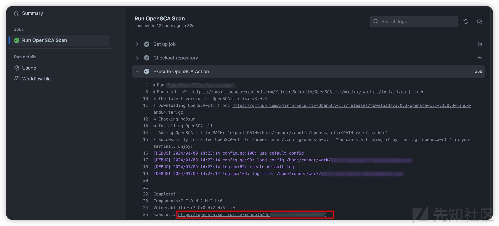
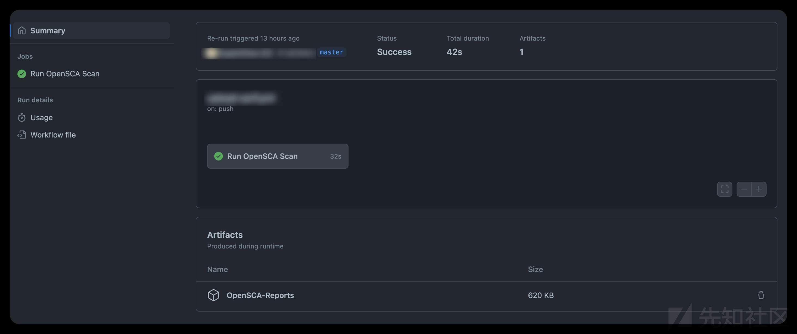

# 技术文档 | 将 OpenSCA 接入 GitHub Action，从软件供应链入口控制风险面 - 先知社区

技术文档 | 将 OpenSCA 接入 GitHub Action，从软件供应链入口控制风险面

- - -

继 Jenkins 和 Gitlab CI 之后，GitHub Action 的集成也安排上啦~

若您解锁了其他 OpenSCA 的用法，也欢迎向项目组来稿，将经验分享给社区的小伙伴们~

### 参数说明

| 参数  | 是否必须 | 描述  |
| --- | --- | --- |
| token | ✔   | OpenSCA 云漏洞库服务 token，可在 OpenSCA 官网获得 |
| proj | ✖   | 用于同步检测结果至 OpenSCA SaaS 指定项目 |
| need-artifact | ✖   | "是否上传日志/结果文件至 workflow run（默认：否） |
| out | ✖   | 指定上传的结果文件格式（文件间使用“,”分隔；仅 outputs 目录下的结果文件会被上传） |

### 使用样例

workflow 示例

```plain
on:
  push:
    branches:
        - master
        - main
  pull_request:
    branches:
        - master
        - main

jobs:
  opensca-scan:
    runs-on: ubuntu-latest
    name: OpenSCA Scan
    steps:
      - name: Checkout your code
        uses: actions/checkout@v4
      - name: Run OpenSCA Scan
        uses: XmirrorSecurity/opensca-scan-action@v1
        with:
          token: ${{ secrets.OPENSCA_TOKEN }}
```

\*需要先基于 OpenSCA 云漏洞库服务 token 创建秘钥，详细信息请见[https://docs.github.com/en/actions/security-guides/using-secrets-in-github-actions#about-secrets](https://docs.github.com/en/actions/security-guides/using-secrets-in-github-actions#about-secrets)

扫描结束后，可在仓库的 Security/Code scanning 里找到结果  
[](https://xzfile.aliyuncs.com/media/upload/picture/20240118111154-55131596-b5af-1.jpg)

也可直接跳转至 OpenSCA SaaS 查看更多详细信息；跳转链接可在 Action 日志中找到  
[](https://xzfile.aliyuncs.com/media/upload/picture/20240118111206-5c0827f6-b5af-1.jpg)

### 更多场景

#### 同步检测结果至 OpenSCA SaaS 指定项目

使用 proj 参数将检测任务绑定至指定项目下；ProjectID 可在 SaaS 平台获取

```plain
- name: Run OpenSCA Scan
  uses: XmirrorSecurity/opensca-scan-action@v1
  with:
    token: ${{ secrets.OPENSCA_TOKEN }}
    proj: ${{ secrets.OPENSCA_PROJECT_ID }}
```

#### 保留日志用于问题排查

```plain
- name: Run OpenSCA Scan
  uses: XmirrorSecurity/opensca-scan-action@v1
  with:
    token: ${{ secrets.OPENSCA_TOKEN }}
    need-artifact: "true"
```

#### 上传日志及检测报告至 workflow run

```plain
- name: Run OpenSCA Scan
  uses: XmirrorSecurity/opensca-scan-action@v1
  with:
    token: ${{ secrets.OPENSCA_TOKEN }}
    out: "outputs/result.json,outputs/result.html"
    need-artifact: "true"
```

\*仅 outputs 目录下的结果文件会被上传

### 常见问题

#### Permission denied

若遇 permission denied 报错，可前往`Settings` -> `Actions` -> `General`，在`Workflow permissions`里选中 "Read and write permissions"并保存

#### 找不到 artifact?

在 workflow summary 页面底部区域，截图示意如下：  
[](https://xzfile.aliyuncs.com/media/upload/picture/20240118111225-6758eca8-b5af-1.jpg)

如有其他问题或反馈，欢迎向我们提交 ISSUE~

[https://github.com/XmirrorSecurity/opensca-scan-action](https://github.com/XmirrorSecurity/opensca-scan-action)
