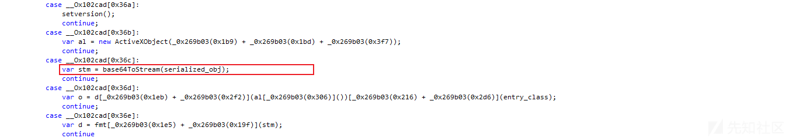
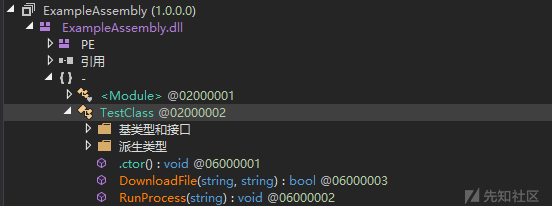
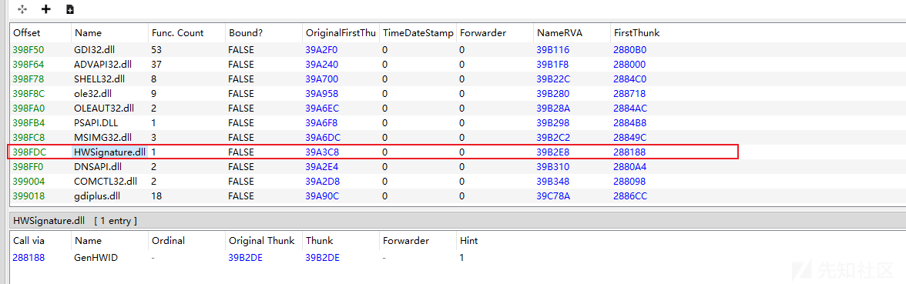

# 揭密某黑产组织新型免杀攻击样本 - 先知社区

揭密某黑产组织新型免杀攻击样本

- - -

# 概述

一年一度的活动结束了，各位红蓝队的兄弟们都辛苦了，活动虽然己经结束，但是真实的攻击从来没有停止过，安全意识要常态化，跟之前一样笔者及笔者团队今年仍然以协助其他团队进行样本的分析、溯源等相关工作，主要负责处理一些其他团队处置不过来的或者处理不了的复杂攻击样本，整个活动阶段一共分析处置了几十例“奇形怪状”的各种不同类型的攻击样本。

去年笔者在活动之后的随记中重点提到了笔者及笔者团队的沙箱工具，沙箱是安全分析团队最重要的工具之一，今年整个活动期间，几大安全友商都在大力推广自己的沙箱，同时基于沙箱的文件行为和流量行为相结合捕获到了一个 WPS 0day 漏洞的攻击样本，沙箱的主要功能以及详细的内容，笔者去年的文章就己经讲的很清楚了。

这里就不多说了，其实沙箱最简单的一个作用就是可以帮助安全分析人员去过滤掉 99.99% 的样本，这样高级安全分析专家只需要去专注去分析和研究最后的 0.01 的高端复杂对抗型样本或者从中挖掘 0.01 的高价值样本即可，就像上面的 WPS 0day 漏洞攻击型样本一样，全球每天的安全攻击事件中有几万、几十万各种不同类型，不同家族的恶意软件攻击样本，如何快速识别这些恶意软件家族或者快速找到新型的或者高价值的恶意软件家族，这就需要使用沙箱了，可以给高级安全分析专家节省的很多宝贵的时间，对沙箱感兴趣的朋友可以去看笔者去年的文章《谈谈安全对抗的本质》。

最后还是那句话，安全意识要常态化，活动仅仅是一次活动，活动虽然结束了，但真实的攻击事件每天都在发生，真实的攻击样本，各种不同类型恶意软件家族每天都很活跃。

此前笔者闲逛某论坛时跟踪发现了一批新型免杀攻击样本，该类型的攻击样本目前在 VT 的检出率都比较低，如下所示：  
  
对于这些新型的免杀攻击样本以及全球黑客组织真实攻击事件中使用的各种类型的新型攻击样本，笔者一直本着“遇到抓到、不放过、研究到底”的安全研究态度，今天笔者就针对该批类型的免杀攻击样本进行深入的分析和研究。

# 攻击流程

黑客组织攻击流程图，如下所示：  

# 详细分析

1.攻击样本伪装成 CHM 文件，如下所示：  
  
2.双点之后，会弹出提示对话框，如下所示：  
  
3.点击是之后，会弹出执行脚本对话框，如下所示：  
  
4.执行成功之后，会显示注销用户的对话框，如下所示：  
  
5.静态提取 CHM 文件中的 js 代码，如下所示：  
  
6.动态调试分析里面嵌套的 js 脚本代码，会解密出一段 base64 加密的数据，如下所示：  
  
7.对这段数据使用 base64 解码，如下所示：  
  
8.js 脚本在内存中动态加载解密出来的 DLL 模块，调用该 DLL 模块 TestClass 类，解密出来的 DLL 恶意模块，如下所示：  
  
9.从远程服务器上下载相应的恶意文件，如下所示：  
  
10.LNK 文件执行，通过密码解压恶意文件到相应的目录，如下所示：  
  
11.解压 0day.jpg 文件到相应的目录，解压之后，如下所示：  
  
12.伪装成 sogou 应用程序的 LNK 文件，加载 sogou.exe 应用程序，如下所示：  
  
13.sogou 应用程序通过白 + 黑的方式加载同目录下的 HWSignature.dll 文件，如下所示：  
  
14.拷贝 sogou.exe 程序到同目录下的 Zer.com 程序，如下所示：  
  
15.读取同目录下的 Q.jpg 文件到内存，如下所示：  
  
16.读取的数据，如下所示：  
  
17.将内存中的数据进行解密操作，解密出来的 payload 数据，如下所示：  
  
18.启动 Zer.com 程序，将解密出来的 payload 注入到 Zer.com 进程，如下所示：  
  
19.注入 payload 到启动的 Zer.com 进程，如下所示：  
  
20.注入 Zer.com 进程之后，如下所示：  
  
21.解密出来的 payload 是一个 Gh0st 木马，如下所示：  
  
22.黑客远程服务器 IP 地址为 38.55.185.75，如下所示：  

# 威胁情报

# 关联分析

基于上面的分析成果，笔者做了一些关联分析，主要从样本、IP 等威胁情报进行关联分析。

通过 IP 地址 38.165.12.236 可以关联到一堆相似的攻击样本，这些攻击样本的检出率都比较低，如下所示：  
  
同 C 段的某个 IP 被标记为了“银狐”黑产组织，如下所示：  
  
通过 IP 地址 38.55.185.75，同 C 段的多个 IP 地址也被标记为了“银狐”黑产组织，如下所示：  
  
通过解密出来的 payload 样本 pdb 信息，可以关联到该攻击样本的最后 payload 此前被某厂商标记为了“谷堕”大盗，后面都被归因为“银狐”A 黑产组织，如下所示：  
  
通过关联分析，该攻击样本可以被归因为“银狐”黑产组织，此前友商已经发布“银狐”黑产组织并非一个黑产组织，而是一个工具，该攻击样本可以归因为“银狐”AB 黑产组织的新型免杀攻击样本，此前归因的很多“银狐”黑产组织大多数都是因为它们最后都使用了相同的基于开源 Gh0st 修改的 payload 后门程序，但是后面经过笔者对这些攻击样本的详细分析跟踪发现这些黑产组织的攻击目标、攻击资产和攻击方式都不太相同，同时基于 Gh0st 修改版的开源远控后门代码也早已经在一些黑产组织中流传开来，开发出了多个不同的版本，任何一个黑产组织都可以使用该后门工具进行攻击活动，所以最后认定此前标记的“银狐”黑产组织是一个去中心化的工具，而并非指特定某个黑产组织，这些攻击活动背后可能是多个不同的黑产组织。

笔者此前对多个不同的黑产组织的攻击样本和“银狐”(ABCDEFGH...) 黑产组织的多个不同类型的攻击样本都进行了深入的跟踪、分析和研究，其中发现“银狐”黑产组织的攻击样本更新过于频繁，同时攻击样本外层加载方式更新变化很大，免杀加载方式和攻击手法都存在很大的区别，攻击样本使用的资产服务器过于庞大，如果是同一个黑产组织，那么这个黑产组织可能是一个非常庞大的组织，因为该黑产组织使用的攻击样本、攻击资产、攻击手法和传播方式等都更新的太快了，一个小小的黑产组织绝不可能在短时间内更新如此频繁，运营和维护成本都非常高。

基于上面针对该批攻击样本的的详细分析以及相关威胁情报关联溯源分析，笔者就不以“银狐”黑产组织命名了，暂定此次发现的这批新型免杀攻击样本为某个黑产组织，不一定是“银狐”黑产组织。

各类黑产组织太活跃了，笔者近日又跟踪到一批最新的攻击样本，通过详细分析可以发现黑产组织一直在更新自己的攻击样本，以逃避安全厂商的检测，“银狐”是一个工具，未来黑产组织可能会使用更多其他工具，这些黑产组织可能是 A，B，C，D，E，F，G，H......，未来可能还会使用其他更多新型的木马工具，免杀技术也会更强，反沙箱和反调试能力也会不断更新，正所谓野火烧不尽，春风吹又生，安全对抗会持续升级，做安全永远在路上。

# 总结

黑客组织利用各种恶意软件进行的各种攻击活动已经无处不在，防不胜防，很多系统可能已经被感染了各种恶意软件，全球各地每天都在发生各种恶意软件攻击活动，这些攻击活动主要包含：勒索攻击、APT 窃密攻击等，笔者最近几年专注于针对勒索病毒黑客组织、APT 定向攻击黑客组织、以及各种黑灰产黑客组织进行跟踪分析和研究，发现这些组织一直在持续更新自己的攻击样本以及攻击技术，不断有企业被攻击，这些黑客组织从来没有停止过攻击活动，而且非常活跃，持续不断地更新攻击样本，采用新的攻击技术。

笔者在此前的文章中已经多次提到，安全是一个过程，而不是一个结果，安全没有结果，这就是安全行业与 IT 行业里面其他都不相同的一个特点，攻与防双方都在不断提升自己的安全能力，安全的核心就是人与人的对抗，人与人之间就是安全技术的对抗，例如今天你解决了这个安全问题，明天黑客就会使用新的攻击手法，你又得去解决新出现的问题，今天你能杀掉这类攻击样本，明天黑客就会改进自己的攻击样本，所以安全就是一个持续不断、对抗不断升级的过程，这就是安全行业的特点。

基于上面这个特点，所以浮燥的人很难在安全行业里面长久生存下去，能够在安全行业做十几年，几十年的都是那些真正热爱安全，不断保持学习，不断进步，持续积累的人，这就是做安全需要付出的代价，安全就是一条“不归路”，只有你真的热爱安全行业，喜欢研究安全技术，并乐于花时间研究各种真实的黑客组织的攻击活动和攻击技术，脚踏实地，持续深入的学习和研究，不断提升自己的专业能力，未来才能在这个行业长久走下去，笔者前几天看了一篇文章，里面的一段话：

和其他的 IT 技术不一样，网络安全无论攻防两端，都是一个高速动态发展、持续提高的过程，“防得了一时，防不了一世”。没有绝对的安全，也没有永远的安全，只有相对暂时的安全。网络安全面对的是全世界智商最高的犯罪分子，我们不能低估我们的对手，也不能高估自己的能力。因此，网络安全是一个持续进化的旅程，而不是一个持续稳定的结果。

这个作者与笔者的观念基本一致，未来黑客会研究和采用更高级的攻击手法，使用更高级的攻击样本和攻击技术，会开发更为复杂的恶意软件，会使用更隐藏的免杀植入方式，会挖掘更多新的安全漏洞，安全对抗没有终点，如果想在安全行业走的更远，就踏踏实实不断提升自己的能力，黑客组织都在进步，安全从业人员更需要持续不断的进步，才能抵御未来各种网络安全攻击，而且未来高端的安全对抗会越来越激烈，安全厂商和安全研究人员需要持续不断的提升自己的安全能力。
