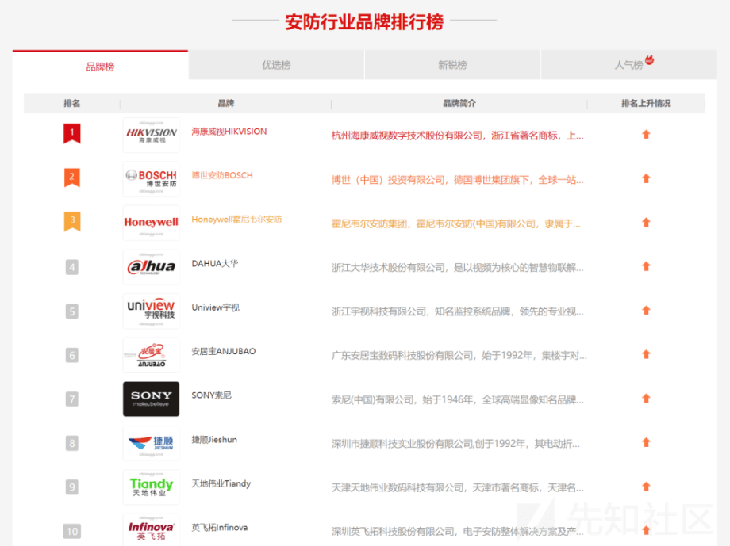
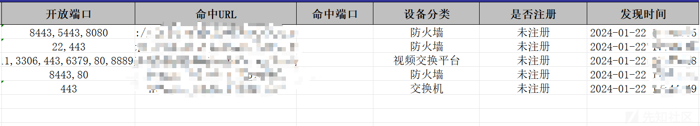
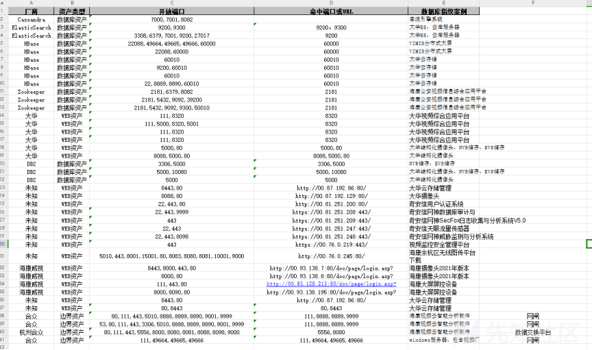
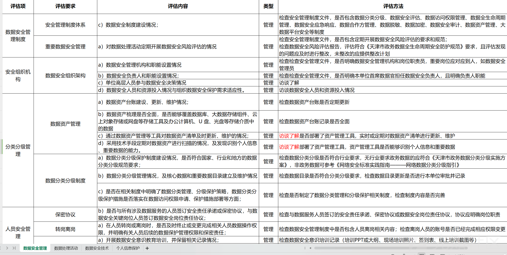

# 数据安全与边界安全检查实例 - 先知社区

数据安全与边界安全检查实例

- - -

在 23 年末，我加入了一家数据安全公司，经历了许多挑战。在脱离安服的马甲之后，短短一个月内接触到了 Ga、网信办的检查项目，主要涉及数据安全和边界安全。本文将介绍实际检查需求及相应的解决方案。

# 一、概念介绍

我们先来聊聊什么是数据安全，什么又是边界安全，涵盖哪些内容，方便各位师傅们有一个大概的认知。

1.  数据安全：通过采取必要措施，确保网络数据处于有效保护和合法利用的状态，以及具备保障持续安全状态的能力。
2.  边界安全：传统边界安全主要作用在真实存在的物理边界上，包括防火墙、杀毒软件、IDS、IPS、DLP、WAF、EPP 等设备。目前防护的边界在专网上主要涵盖各类安防厂商。  
    图 1 安防厂家名单如下：  
    

# 二、边界安全检查

1.  根据使用网段进行对应设备扫描，设备规则主要包括命中 URL 的目录字段产品匹配、多个命中端口产品匹配、结合标题或者返回字段中关键字进行二次筛选产品匹配。  
    
2.  在检查过程中，设备保障快速，人工也需要保障准确程度。除筛除部分已知安全设备外，主要针对未知情况下，对仅靠命中端口进行产品匹配项进行二次检查。  
    表 1 检查端口案例如下：  
    

# 三、数据安全检查

1.  数据安全风险评估是一项繁杂的工作，需要团队和业主的双重支撑。评估细节紧紧围绕全国信息安全标准化技术委员会秘书处中《网络数据安全风险评估实施指引》的评估准则。  
    图 2 部分数据安全评估项如下：  
      
    已添加至附件可供下载查看。
2.  存储日期检查相对于前面的检查来说较为简单，可以通过脚本或交付给设备研发来完成。

# 四、数据安全与边界安全的关联

1.  数据安全和边界安全是相辅相成的。边界安全主要是防止未经授权的访问，保护网络数据不被非法获取和篡改；而数据安全则是确保数据的完整性、可用性和保密性，防止数据被恶意破坏或泄露。
2.  在实际操作中，我们需要同时关注数据安全和边界安全。例如，我们可以通过防火墙、IDS/IPS 等边界设备来防止未经授权的访问，同时通过数据加密、访问控制等手段来保护数据的安全。

# 五、总结

1.  数据安全和边界安全是网络安全的重要组成部分，我们需要通过技术和管理手段来保护网络数据的安全。
2.  在实际操作中，我们需要根据具体的检查需求制定合理的检查方案，并结合设备的特性进行有效的检查。同时，我们也需要不断学习和掌握新的安全技术和方法以应对日益复杂的网络安全威胁。

# 六、留言

这篇文章，其实主要还是分享实施时的思路，以及对于这类新型安全，希望给师傅们抛砖引玉带来一些思考。设备可能还是结合数据安全公司更有针对性的扫描规则会应对这类新型安全需求的项目让实施人员如虎添翼，毕竟每一个安服都希望设备 yyds。

数据安全风险评估检查项 终版.zip (0.031 MB) [下载附件](https://xzfile.aliyuncs.com/upload/affix/20240205100749-5cc5c462-c3cb-1.zip)
