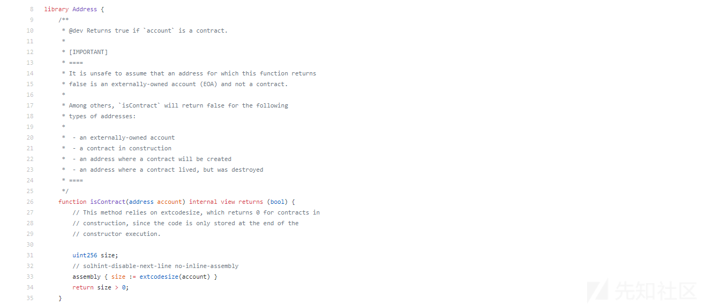

# 智能合约安全之合约检测绕过 - 先知社区

智能合约安全之合约检测绕过

- - -

### 文章前言

智能合约是区块链技术的重要应用之一，它能够实现去中心化的交易和智能化的合约执行，然而智能合约安全问题一直是困扰区块链行业的一个难题，本篇文章我们将主要介绍在合约中对于合约地址检查的方法以及其绕过方式，希望能够为各位合约安全审计人员以及合约研发人员提供安全思考

### 交互方式

在以太坊智能合约中交互的场景有内部交互和外部交互：

#### 内部交互

在以下示例代码中 ContractA 合约通过调用 ContractB 合约的 getNumber 函数来获取 ContractB 合约中保存的数字，可以看到在下面的代码中 ContractA 合约通过构造函数接收 ContractB 合约的实例，然后调用 getNumberFromB 函数来获取 ContractB 合约中保存的数字，这是一种典型的内部交互场景，调用者和被调用者都是智能合约

```plain
pragma solidity ^0.8.0;

contract ContractB {
    uint256 public number;

    function setNumber(uint256 _number) public {
        number = _number;
    }

    function getNumber() public view returns (uint256) {
        return number;
    }
}

contract ContractA {
    ContractB public contractB;

    constructor(ContractB _contractB) {
        contractB = _contractB;
    }

    function getNumberFromB() public view returns (uint256) {
        return contractB.getNumber();
    }
}
```

#### 外部交互

在以下示例代码中 ContractA 合约通过调用外部账号的函数来向外部账号转移以太币，可以看到 ContractA 合约通过调用 transferEther 函数来向外部账号转移以太币，在调用该函数时需要传递一个可支付地址 (payable address) 作为接收者并且需要同时向函数发送足够的以太币作为转移金额，这是一种典型的外部交互场景，调用者是智能合约，被调用者是外部账号

```plain
pragma solidity ^0.8.0;

contract ContractA {
    function transferEther(address payable recipient) public payable {
        recipient.transfer(msg.value);
    }
}
```

### 交互账号

在以太坊智能合约中交互的账号主要有两种：合约账号和外部账号

#### 合约账号

合约账号是指部署在以太坊网络上的智能合约，它们可以通过调用内部函数或者外部账号的函数来完成一些操作，合约账号可以持有以太币和其他代币也可以拥有自己的存储空间和状态，以下是一个示例代码，其中 ContractA 合约是一个简单的计数器合约，它可以接受以太币的转账并记录转账的数量，其中 ContractA 合约通过 increment 函数接受以太币的转账并将计数器加 1，这是一个典型的合约账号的示例，它可以通过外部账号调用 increment 函数来完成一些操作

```plain
pragma solidity ^0.8.0;

contract ContractA {
    uint256 public count;

    function increment() public payable {
        count++;
    }
}
```

#### 外部账号

外部账号是指在以太坊网络上注册的账户，它们可以直接与合约账号进行交互也可以进行自身之间的交互，外部账号可以持有以太币和其他代币，但是不具有存储空间和状态，以下是一个示例代码，其中 ContractA 合约通过 transfer 函数向外部账号转移以太币

```plain
pragma solidity ^0.8.0;

contract ContractA {
    function transferEther(address payable recipient) public payable {
        recipient.transfer(msg.value);
    }
}
```

在上述代码中 ContractA 合约通过 transferEther 函数向外部账号转移以太币，在调用该函数时需要传递一个可支付地址 (payable address) 作为接收者并且需要同时向函数发送足够的以太币作为转移金额，这是一个典型的外部账号的示例，它可以通过合约账号调用 transferEther 函数来完成一些操作~

### 地址检查

在编写智能合约时对合约地址进行检测是为了防止合约调用和交互中的安全漏洞和错误

#### 避免调用不存在的合约

在智能合约中调用一个不存在的合约会导致交易失败或者损失资金，因此在调用其他合约的函数之前需要先检测该合约地址是否存在以避免调用不存在的合约，在以下示例代码中 transferTo 函数用于向指定的地址转移以太币，在调用该函数前需要检查该地址是否为合约地址以避免与非合约地址进行交互 (使用 extcodesize 检查合约地址的缺陷后面我们介绍)

```plain
pragma solidity ^0.8.0;

contract MyContract {
    function transferTo(address payable _to) public payable {
        require(isContract(_to), "Only contract address allowed");
        _to.transfer(msg.value);
    }

    function isContract(address _addr) private view returns (bool) {
        uint256 size;
        assembly {
            size := extcodesize(_addr)
        }
        return size > 0;
    }
}
```

在上述代码中 isContract 函数用于检测指定的地址是否为合约地址，该函数通过 extcodesize 指令获取指定地址的代码长度，如果长度大于 0 则认为该地址为合约地址，在 transferTo 函数中如果检测到该地址不是合约地址，则会抛出异常并终止函数执行

#### 避免调用不存在的合约

在以下示例代码中 callOtherContract 函数用于调用指定地址的合约中的函数，在调用该函数前需要检查该地址是否存在合约以避免调用不存在的合约

```plain
pragma solidity ^0.8.0;

contract MyContract {
    function callOtherContract(address _contractAddress) public returns (uint256) {
        require(isContract(_contractAddress), "Contract address does not exist");
        return OtherContract(_contractAddress).getValue();
    }

    function isContract(address _addr) private view returns (bool) {
        uint256 size;
        assembly {
            size := extcodesize(_addr)
        }
        return size > 0;
    }
}

contract OtherContract {
    uint256 public value = 42;

    function getValue() public view returns (uint256) {
        return value;
    }
}
```

在上述代码中 isContract 函数的作用和上一个示例代码中的一样，用于检测指定的地址是否为合约地址，在 callOtherContract 函数中如果检测到该地址不是合约地址，则会抛出异常并终止函数执行，如果该地址是合约地址则调用该合约的 getValue 函数并返回结果

#### 避免重入攻击安全风险

重入攻击是一种常见的安全漏洞，攻击者通过在智能合约中多次调用同一个函数来重复执行该函数，从而导致数据错误或者资金损失，为了防范重入攻击可以通过检查地址是否为合约地址来限制函数的重复调用，以下是一个示例代码，其中在 withdraw 函数中的 isContract 断言会检测到调用者地址为合约地址，如果是则抛出异常终止函数执行

```plain
pragma solidity ^0.8.0;

contract Bank {
    mapping(address => uint256) balances;
    bool private locked;

    function withdraw(uint256 _amount) public {
        require(_amount <= balances[msg.sender], "Insufficient balance.");
        require(isContract(msg.sender) == false, "Contracts are not allowed to withdraw.");
        require(payable(msg.sender).send(_amount), "Withdrawal failed.");
        balances[msg.sender] -= _amount;
    }

    function getBalance() public view returns (uint256) {
        return balances[msg.sender];
    }

    function isContract(address _addr) private view returns (bool) {
        uint256 size;
        assembly {
            size := extcodesize(_addr)
        }
        return size > 0;
    }
}
```

### 合约检测

在以太坊智能合约中可以通过调用 extcodesize 函数来检查一个地址是否为智能合约地址，extcodesize 函数返回给定地址的代码大小，如果返回值大于 0，则表示该地址为智能合约地址，否则表示该地址为普通账号地址，这是因为智能合约在部署时会生成相应的字节码，而普通账号则没有，以下是一个检查地址是否为智能合约地址的示例代码：

```plain
pragma solidity ^0.8.0;

contract Test {
    function isContract(address addr) public view returns (bool) {
        uint256 codeSize;
        assembly {
            codeSize := extcodesize(addr)
        }
        return codeSize > 0;
    }
}
```

在上述代码中 isContract 函数接受一个地址作为参数并返回一个布尔值，表示该地址是否为智能合约地址，在函数中使用了 extcodesize 函数来获取地址的代码大小并将其与 0 进行比较来判断该地址是否为智能合约地址

### 检测绕过

虽然 extcodesize 函数可以用来检查一个地址是否为合约地址，但是也存在一些攻击方式可以绕过该检查，其中比较常见的攻击方式是创建一个合约然后将其代码清空，这样调用 extcodesize 函数时会返回 0，从而欺骗检查程序，以下是一个绕过 extcodesize 函数检查合约地址的示例代码，其中 Malicious 合约是一个空合约，它的作用是欺骗 Test 合约的 isContract 函数，当调用 isContract 函数时由于 Malicious 合约的代码已经被清空，因此 extcodesize 函数会返回 0，从而导致 isContract 函数错误地判断 Malicious 合约不是智能合约，攻击者可以利用这一点将 Malicious 合约地址传递给 Test 合约的 test 函数从而欺骗 Test 合约将资金转移到攻击者的地址上

```plain
pragma solidity ^0.8.0;

contract Malicious {
    address payable public owner = payable(msg.sender);

    function() external payable {
        owner.transfer(msg.value);
    }
}

contract Test {
    function isContract(address addr) public view returns (bool) {
        uint256 codeSize;
        assembly {
            codeSize := extcodesize(addr)
        }
        return codeSize > 0;
    }

    function test(address payable addr) public payable {
        require(isContract(addr), "Not a contract address");
        (bool success,) = addr.call{value: msg.value}("");
        require(success, "Call failed");
    }
}
```

### 构造函数

在以太坊智能合约中，我们可以通过构造恶意合约来绕过该函数的检查，从而实施重入攻击等恶意行为，以下是一个示例代码，演示了如何通过构造函数绕过 extcodesize 函数的检查：  
假设有一个名为 Bank 的智能合约，其中包含一个 withdraw 函数用于提现账户中的以太币，该函数使用 extcodesize 函数检查调用者地址是否为合约地址以防止重入攻击，示例代码如下所示：

```plain
pragma solidity ^0.8.0;

contract Bank {
    mapping(address => uint256) balances;

    function withdraw(uint256 _amount) public {
        require(_amount <= balances[msg.sender], "Insufficient balance.");
        require(!isContract(msg.sender), "Contracts are not allowed to withdraw.");
        balances[msg.sender] -= _amount;
        require(payable(msg.sender).send(_amount), "Withdrawal failed.");
    }

    function isContract(address _addr) private view returns (bool) {
        uint256 size;
        assembly {
            size := extcodesize(_addr)
        }
        return size > 0;
    }
}
```

在上述代码中 withdraw 函数使用 isContract 函数检查调用者地址是否为合约地址，但是攻击者可以通过构造恶意合约来绕过该函数的检查，具体来说就是攻击者可以构造一个恶意合约，使其在部署时不包含任何代码，但是在合约部署后在构造函数中动态地修改合约的代码，从而绕过 extcodesize 函数的检查，示例代码如下所示：

```plain
pragma solidity ^0.8.0;

contract MaliciousContract {
    address public bankAddress;

    constructor(address _bankAddress) {
        bankAddress = _bankAddress;
        assembly {
            mstore(0x00, 0x37) // 0x37 is the opcode of "extcodesize"
            mstore(0x04, bankAddress)
            // call extcodesize with bankAddress as argument
            // the result will be stored in memory at offset 0x00
            let size := call(5000, 0x04, 0x00, 0, 0, 0, 0)
            // if the result is non-zero, it means bankAddress is a contract
            if gt(size, 0) {
                // perform a reentry attack
                // ...
            }
        }
    }
}
```

在上述代码中 MaliciousContract 合约在构造函数中使用汇编代码调用了 extcodesize 函数并将 Bank 合约的地址作为参数传递给该函数，由于 extcodesize 函数只能检查合约的代码是否存在，而无法检查合约的状态和合约的代码是否被修改，因此在部署 MaliciousContract 合约时，攻击者可以在构造函数中动态地修改 Bank 合约的代码，从而绕过 extcodesize 函数的检查并实施重入攻击等恶意行为

### 防御方案

这里有人给出了这样的一个方案，使用 OpenZeppelin 的 Address.sol 来判断玩家是否为合约，就不允许合约参加游戏  
[https://github.com/OpenZeppelin/openzeppelin-solidity/blob/master/contracts/utils/Address.sol](https://github.com/OpenZeppelin/openzeppelin-solidity/blob/master/contracts/utils/Address.sol)

[](https://xzfile.aliyuncs.com/media/upload/picture/20240204145552-6fee36d8-c32a-1.png)  
这样的修复方案看似没问题，通过判断 extcodesize 不为 0 的话便是合约地址，可是合约在构造的时候 extcodesize 就是为 0，因此可以将攻击代码写在构造函数中进行绕过

```plain
pragma solidity ^0.4.18;

contract attack{
    function attack(address _addr) public payable{
        _addr.call.value(msg.value)();
    }
}
```

更佳的判断方式时使用 EIP-1052

```plain
pragma solidity 0.6.2;

/**
 * @dev Utility library of inline functions on addresses.
 * @notice Based on:
 * https://github.com/OpenZeppelin/openzeppelin-contracts/blob/master/contracts/utils/Address.sol
 * Requires EIP-1052.
 */
library AddressUtils
{

  /**
   * @dev Returns whether the target address is a contract.
   * @param _addr Address to check.
   * @return addressCheck True if _addr is a contract, false if not.
   */
  function isContract(
    address _addr
  )
    internal
    view
    returns (bool addressCheck)
  {
    // This method relies in extcodesize, which returns 0 for contracts in
    // construction, since the code is only stored at the end of the
    // constructor execution.

    // According to EIP-1052, 0x0 is the value returned for not-yet created accounts
    // and 0xc5d2460186f7233c927e7db2dcc703c0e500b653ca82273b7bfad8045d85a470 is returned
    // for accounts without code, i.e. `keccak256('')`
    bytes32 codehash;
    bytes32 accountHash = 0xc5d2460186f7233c927e7db2dcc703c0e500b653ca82273b7bfad8045d85a470;
    assembly { codehash := extcodehash(_addr) } // solhint-disable-line
    addressCheck = (codehash != 0x0 && codehash != accountHash);
  }

}
© 2021 GitHub, Inc.
```

### 防御措施

1、通过"tx.origin==msg.sender"来校验调用者  
2、采用 EIP-1502 来进行检测调用者是否为合约

### 参考链接

[https://learnblockchain.cn/docs/eips/eip-1052.html](https://learnblockchain.cn/docs/eips/eip-1052.html)  
[https://github.com/FishMeat/longz-token/blob/5a1c271b0ad49e48a0d73ba0e69595f027527ace/contracts/utils/address-utils.sol](https://github.com/FishMeat/longz-token/blob/5a1c271b0ad49e48a0d73ba0e69595f027527ace/contracts/utils/address-utils.sol)
