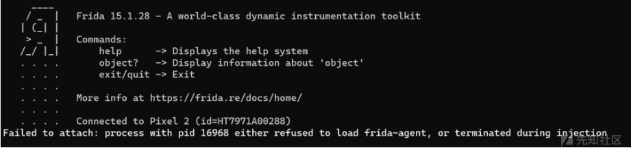
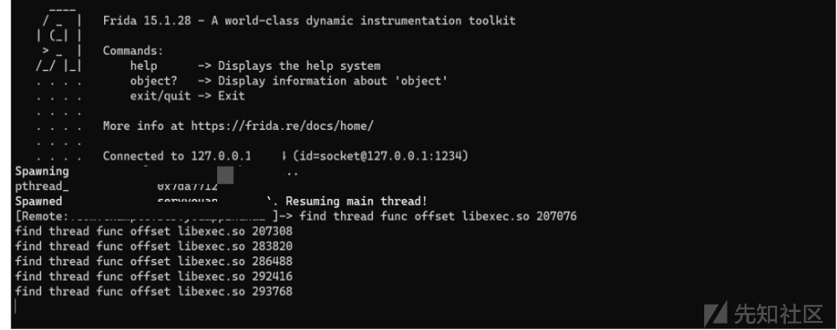
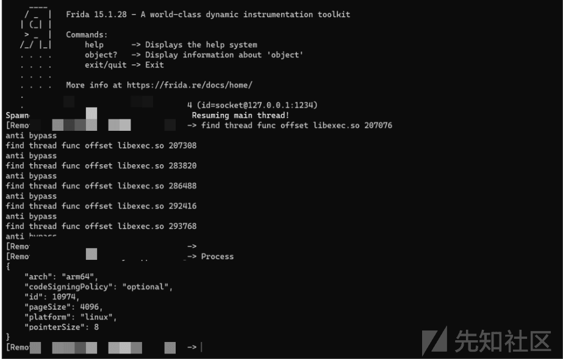
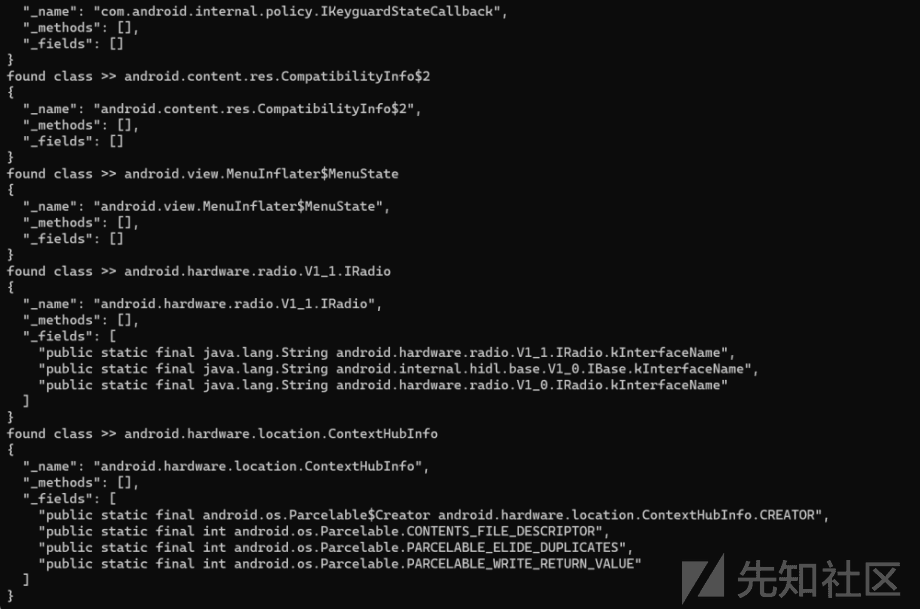
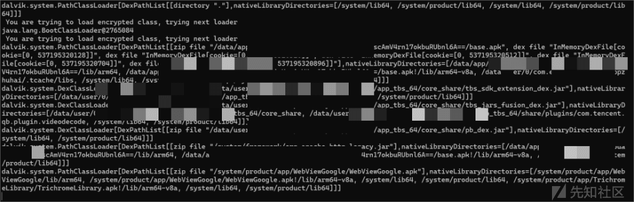
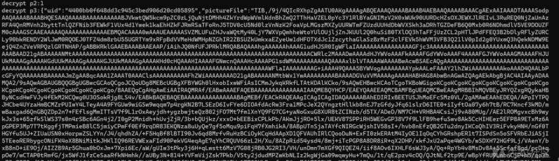

# 某企业版加固 app 绕过 hook - 先知社区

某企业版加固 app 绕过 hook

- - -

# 1、环境及背景

pixel 2  
某 app（\*\*\*企业版加固）  
frida 15.1.28

# 2、hook 绕过

启用 frida 并更改端口没有发现检测行为但是直接 hook 会闪退

[](https://xzfile.aliyuncs.com/media/upload/picture/20240102095217-8f4ce638-a911-1.png)

打印 so 调用堆栈

```plain
function hook_pthread(){
        var pthread_create_addr = Module.findExportByName(null, 'pthread_create
    var pthread_create = new NativeFunction(pthread_create_addr, "int", ["pointer", "pointer", "pointer", "pointer"]);

    Interceptor.replace(pthread_create_addr, new NativeCallback(function (parg0, parg1, parg2, parg3) {
        var so_name = Process.findModuleByAddress(parg2).name;
        var so_path = Process.findModuleByAddress(parg2).path;
        var so_base = Module.getBaseAddress(so_name);
        var offset = parg2 - so_base;
        var PC = 0;
        if ((so_name.indexOf("libexec.so") > -1)) {
            console.log("find thread func offset", so_name, offset);
        } else {
            PC = pthread_create(parg0, parg1, parg2, parg3);
        }
        return PC;
    }, "int", ["pointer", "pointer", "pointer", "pointer"]))
}
hook_pthread();
```

[](https://xzfile.aliyuncs.com/media/upload/picture/20240102095252-a3edb824-a911-1.png)

找到了 libexec.so 开启 pthread\_create 的偏移量，对其进行 bypass，即

```plain
function hook_pthread() {

    var pthread_create_addr = Module.findExportByName(null, 'pthread_create');

    var pthread_create = new NativeFunction(pthread_create_addr, "int", ["pointer", "pointer", "pointer", "pointer"]);
    Interceptor.replace(pthread_create_addr, new NativeCallback(function (parg0, parg1, parg2, parg3) {
        var so_name = Process.findModuleByAddress(parg2).name;
        var so_path = Process.findModuleByAddress(parg2).path;
        var so_base = Module.getBaseAddress(so_name);
        var offset = parg2 - so_base;
        var PC = 0;
        if ((so_name.indexOf("libexec.so") > -1)) {
            console.log("find thread func offset", so_name, offset);
            if ((207076 === offset)) {
                console.log("anti bypass");
            } else if (207308 === offset) {
                console.log("anti bypass");
            } else if (283820 === offset) {
                console.log("anti bypass");
            } else if (286488 === offset) {
                console.log("anti bypass");
            } else if (292416 === offset) {
                console.log("anti bypass");
            } else if (78136 === offset) {
                console.log("anti bypass");
            } else if (293768 === offset) {
                console.log("anti bypass");
            } else {
                PC = pthread_create(parg0, parg1, parg2, parg3);
            }
        } else {
            PC = pthread_create(parg0, parg1, parg2, parg3);
        }
        return PC;
    }, "int", ["pointer", "pointer", "pointer", "pointer"]))
}
hook_pthread();
```

[](https://xzfile.aliyuncs.com/media/upload/picture/20240102095314-b129f6ba-a911-1.png)

已经对其进行绕过 frida 的检测。

# 3、class 的遍历和 hook

绕过 frida 的检测之后，开始对其加载的 class 以及 class 中的函数进行遍历

```plain
Java.enumerateLoadedClasses({
        onMatch: function(className) {
        console.log("found class >> " + className);
        //遍历类中所有的方法和属性
        var jClass = Java.use(className);
             console.log(JSON.stringify({
                    _name: className,
                    _methods: Object.getOwnPropertyNames(jClass.__proto__).filter(function(m) {
                    return !m.startsWith('$') // filter out Frida related special properties
                    || m == 'class' || m == 'constructor' // optional
                }), 
                     _fields: jClass.class.getFields().map(function(f) {
                     return f.toString()
                    })
              }, null, 2));
               //遍历类中所有的方法和属性
          },
        onComplete: function() {
              console.log("[*] class enuemration complete");
           }
    });
```

[](https://xzfile.aliyuncs.com/media/upload/picture/20240102095513-f82c9504-a911-1.png)

class 和函数大部分已经被遍历出来了，但是由于是加固的，部分函数并没有被加载出来 (意料之中)，利用常规的框架尝试去执行

```plain
//框架为
if(Java.available) {
    Java.perform(function(){
        var application = Java.use("android.app.Application");

        application.attach.overload('android.content.Context').implementation = function(context) {
            var result = this.attach(context); // 先执行原来的attach方法
            var classloader = context.getClassLoader(); // 获取classloader
            Java.classFactory.loader = classloader;
            var Hook_class = Java.classFactory.use("com.xxx.xxx");  // app的类
            console.log("Hook_class: " + Hook_class);
            // 下面代码和写正常的hook一样
            Hook_class.函数.implementation = function()  // 有参数填参数
            {
            }

            return result;
        }
    });
}
```

发现会执行不成功，说明加固后的 app 没有用常规的 classloader 去加载函数。因此需要去遍历在加载 app 的时候，是哪些 classloader 被加载  
1、可以通过重加载指定 classloader 去使得脱壳后的源码能在内存中被找到  
2、可以一次性重加载所有调用的 classloader 去执行

```plain
//获取加固的 classloader 并 hook 函数
Java.enumerateClassLoaders({
        onMatch: function(loader){
            // 每次匹配到，都要把匹配到的赋值给 java 默认的 loader
            Java.classFactory.loader = loader;
            var TryClass;
            // console.log(loader); // 输出被加载的 classloader
            // 没报错就 hook 到了，报错了就 hook 下一个，如果全都报错了，没打印东西，那可能就是 hook 错了。
            try{ // 每一次加载尝试是否可以找到想要的 class
                TryClass = Java.use("cn.xxx"); // 需要被加载之后查询的类
                TryClass.xx.implementation = function(p1,p2){ // 类的函数
                    console.log('p1:'+p1)
                    console.log('p2:'+p2)
                    return this.xx(p1,p2)
                }
            }catch(error){
                if(error.message.includes("ClassNotFoundException")){
                    console.log(" You are trying to load encrypted class, trying next loader");
                }
                else{
                    console.log(error.message);
               }
            }
        },
        onComplete: function(){
        }
})
```

[](https://xzfile.aliyuncs.com/media/upload/picture/20240102095531-02ee8f06-a912-1.png)

用 2 的方法被加载成功。

# 4、最后

最终成功实现在\*\*\*企业版中去 hook 数据，当然这需要成功的脱壳之后查看原 app 存在哪些函数才行。依靠遍历出来的 class  
[](https://xzfile.aliyuncs.com/media/upload/picture/20240102095540-08117e3a-a912-1.png)
