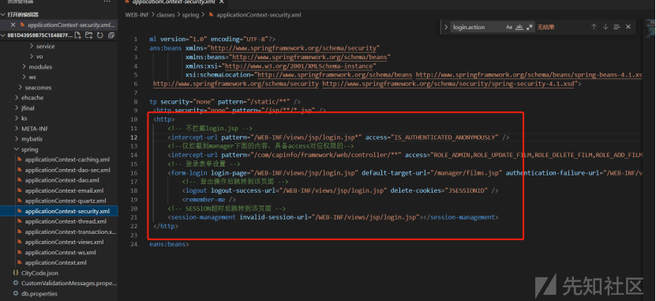
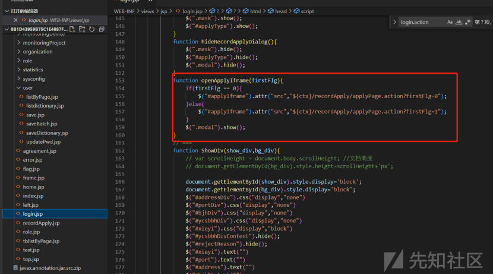
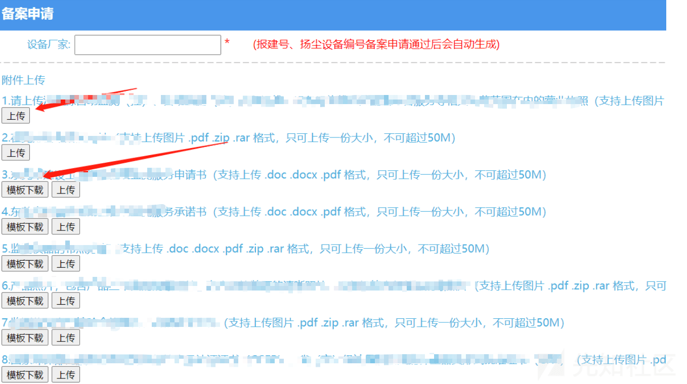
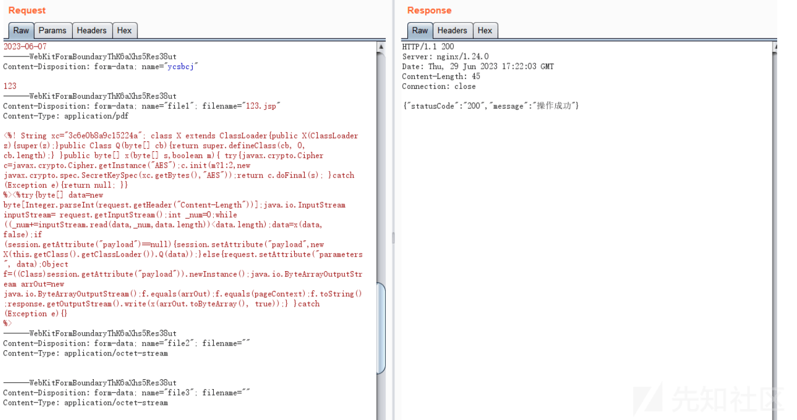
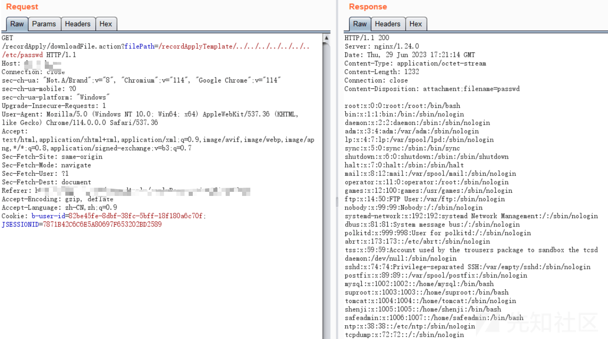
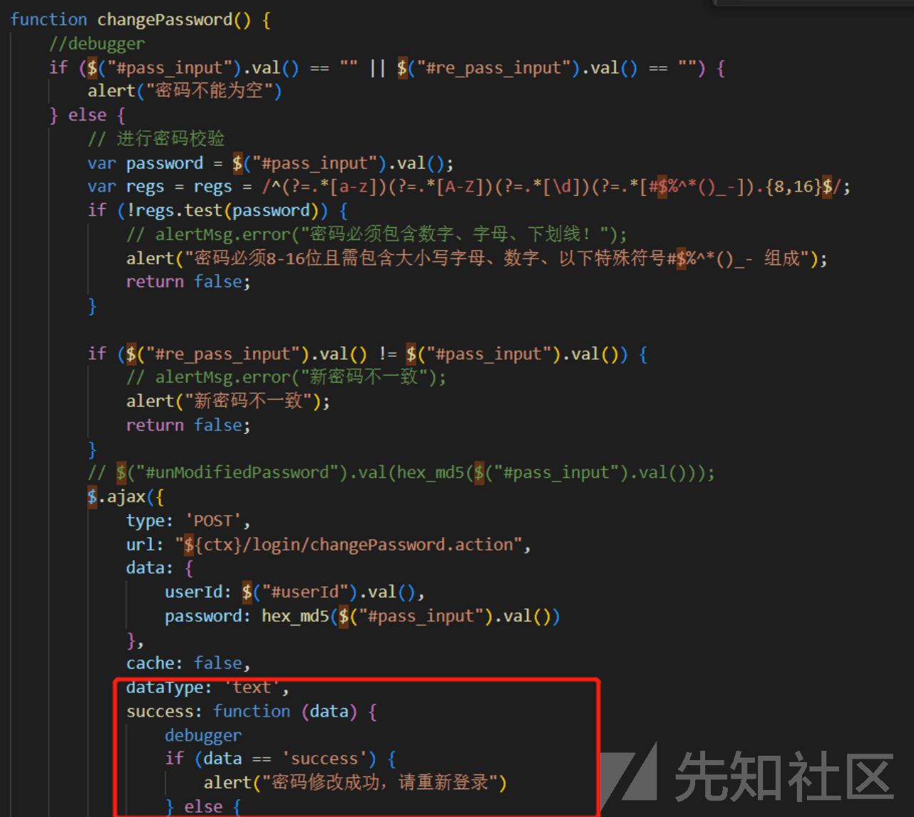
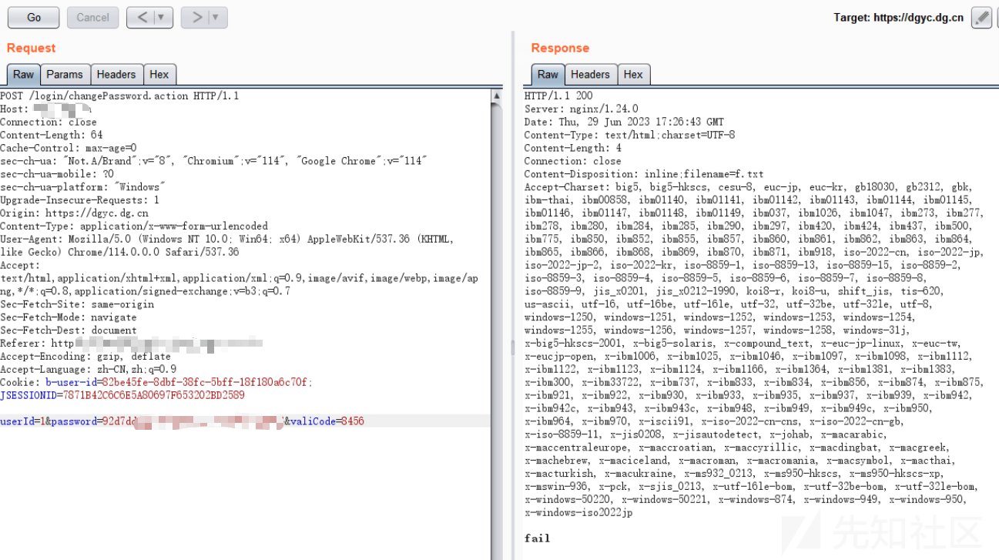
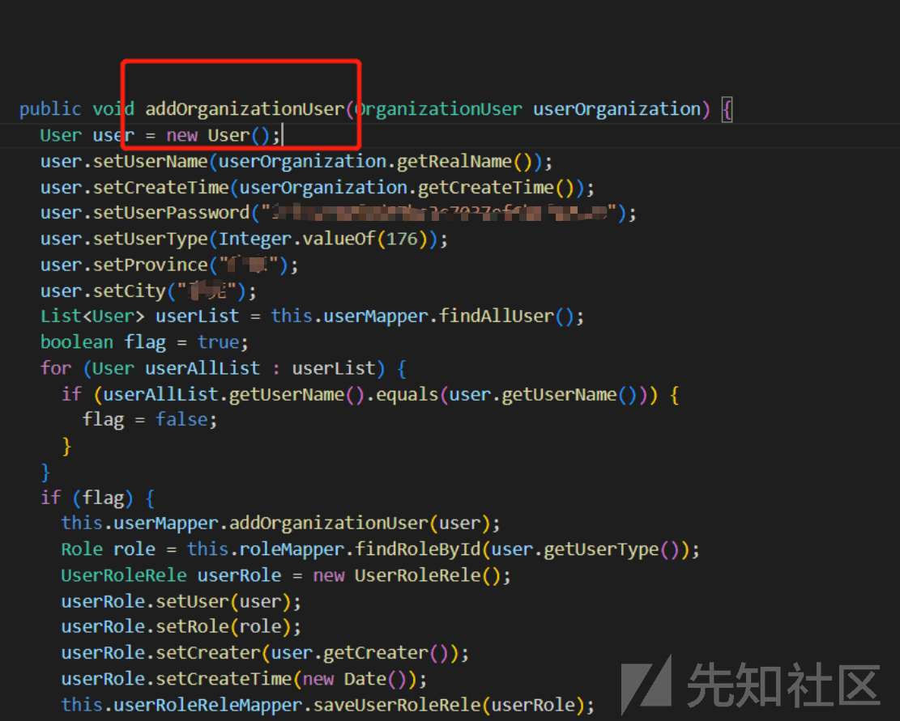
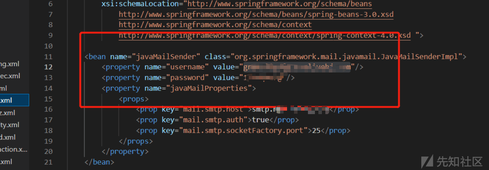

# 某在线监控信息管理平台-java 代审 - 先知社区

某在线监控信息管理平台-java 代审

- - -

## 前言

针对客户需求，进行了一次甲方系统的代码审计。

## Spring 方法未拦截

通过审计发现系统存在权限校验，针对 login.jsp 中的方法不进行拦截  

## 任意文件下载

login.jsp 中存在相关可用功能，发现存在任意文件下载漏洞

## 任意文件包含及任意文件上传

该功能点存在任意文件包含以及任意文件上传漏洞，经利用，发现任意文件上传漏洞回显路径未知，任意文件下载漏洞成功利用

## 未授权任意密码修改

通过审计发现 login.jsp 中存在密码修改功能，初步判定为存在未授权任意密码修改漏洞，但由于传递参数为 userId，无法根据 userId 匹配到相关用户名，初步判定利用困难

## 默认口令

通过审计发现代码中存在默认密钥 XXX，经审计代码逻辑发现功能为添加用户功能，自动赋予默认口令，但用户登陆后会强制用户修改为强口令，利用可能较小

## 敏感信息泄露

经过审计，发现代码中存在邮箱

