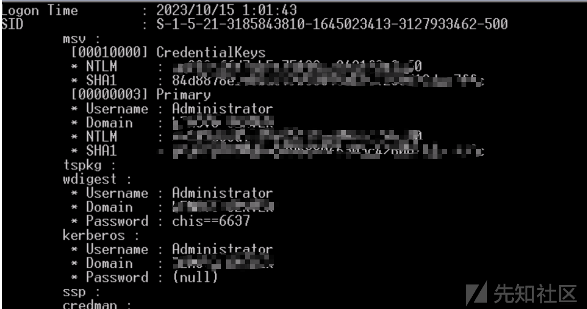
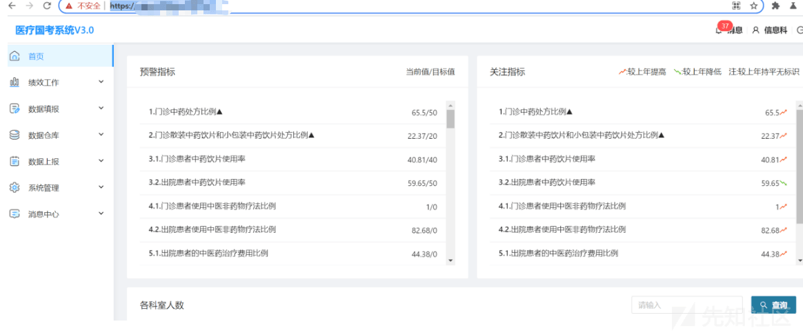

# 某次安全设备突破口的实战案例 - 先知社区

某次安全设备突破口的实战案例

- - -

真实案例，运气较好，在获取 day 当天找到了目标靶标。

# qax 堡垒机权限认证绕过

  
拿到后台，查看运维主机

  
均出网，frp 反向代理

# 本机信息收集

获取网站后台配置文件并留作密码本  
web 网站数据库配置文件中的密码，Web.config,config,php,\*.properties 等等文件，针对不同 OA 名称也不一样，列举几个常用配置文件

| 厂商  | 配置文件 |
| --- | --- |
| 用友  | ierp/bin/prop.xml |
| 万户  | WEB-INF/config/whconfig.xml |
| 通达  | webroot/inc/oa\_config.php |
| 金和  | C6/JhSoft.Web.Dossier.JG/JhSoft.Web.Dossier.JG/XMLFile/OracleDbConn.xml |
| Tomcat | /conf/tomcat-users.xml |
| Weblogi | %DOMAIN\_HOME%/servers/AdminServer/security/boot.properties |

在翻 mimikatz 收集密码本  

# 维权

堡垒机最高权限获取 sysadmin 65r)VIHd>5(x 可进行维权

# 内网横向

因为已经是堡垒机，并且获取了多个权限，就开始全面扫描  
分享一个自己用的 fscan 结果优化脚本，更新 DC 域筛选功能 ([https://github.com/LuckyRiver99/fscanDC](https://github.com/LuckyRiver99/fscanDC))  
获取多台网络设备，数据库，主机等  
数据库拿了 10 个以上，其中一台 mssql 拿下了数十万敏感数据

突破网络隔离  

web 统一进行弱口令探测，图不一一展示了

  
针对打印机得分的话还是算上的，一台 20 分左右，结合摄像头等等分数还是蛮不错

大华摄像头未授权 ([https://github.com/bp2008/DahuaLoginBypass](https://github.com/bp2008/DahuaLoginBypass))  
堡垒机放置在公网安全风险要大很多，当然好运气也是支撑拿分的首选了
