# 某运营管理平台登录绕过及文件上传漏洞分析 - 先知社区

某运营管理平台登录绕过及文件上传漏洞分析

- - -

# 某运营管理平台漏洞分析

## Filter 分析

查看 web.xml 文件，可以发现多个路由都由 controllerFilter 来处理

[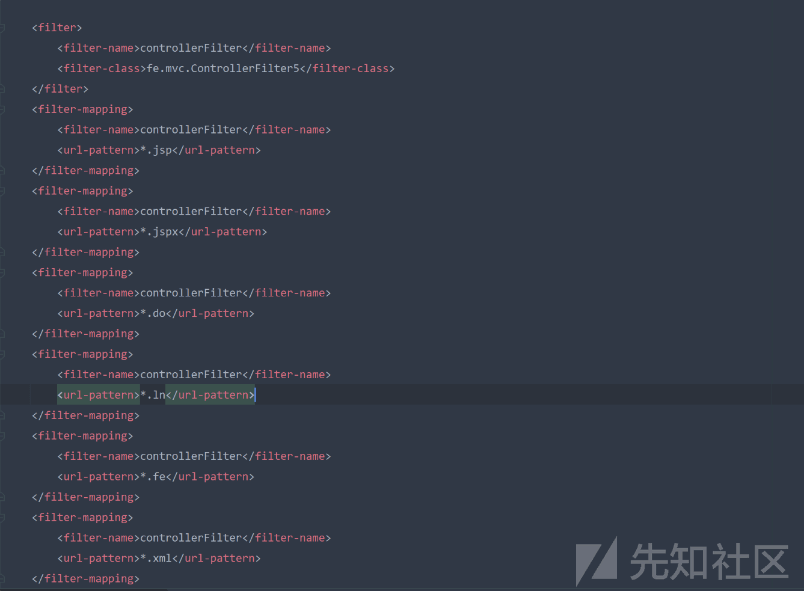](https://xzfile.aliyuncs.com/media/upload/picture/20240117164959-65985272-b515-1.png)  
看看这个 filter 的实现逻辑，doFilter 方法中首先检测访问的 url 中是否包含/dwr/，或以.js 结尾，只要不包含/dwr/或者不以.js 结尾就为 true

[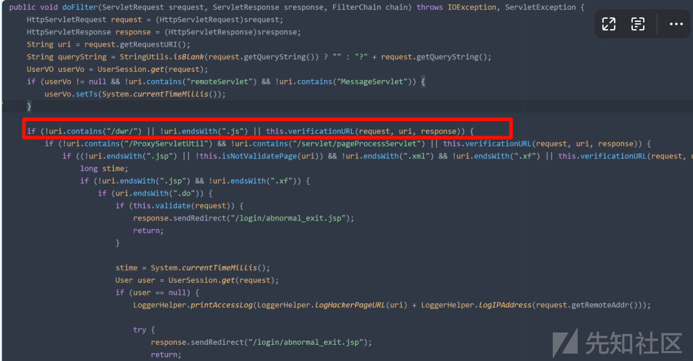](https://xzfile.aliyuncs.com/media/upload/picture/20240117165012-6d60697c-b515-1.png)  
verificationURL 方法验证用户是否登录，未登录直接重定向到/login/abnormal\_exit.jsp，返回 false，所以在未登录状态下，在前面条件未满足情况下，就会重定向到/login/abnormal\_exit.jsp，不会进入 if 语句逻辑

[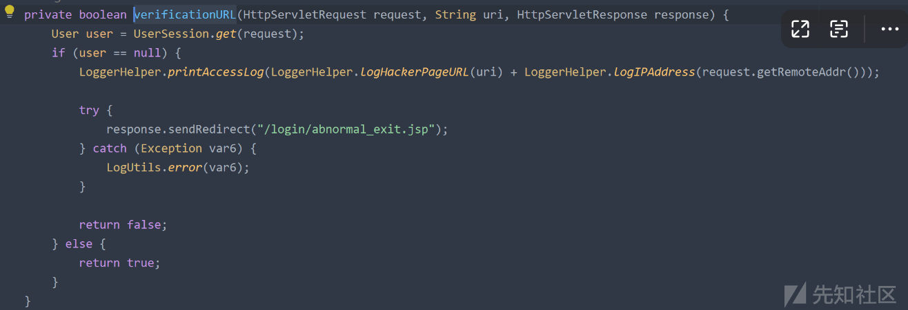](https://xzfile.aliyuncs.com/media/upload/picture/20240117165031-7865fc38-b515-1.png)  
看第二个 if 判断，判断访问的 url 中是否包含/ProxyServletUtil 和/servlet/pageProcessServlet，只要不包含/ProxyServletUtil 和/servlet/pageProcessServlet 就为 true

[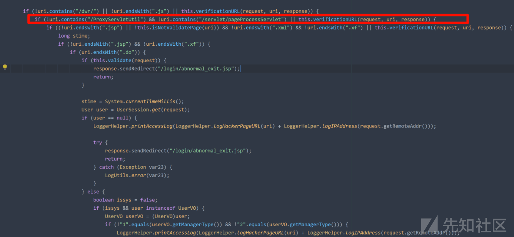](https://xzfile.aliyuncs.com/media/upload/picture/20240117165049-8320dd5a-b515-1.png)  
看第三个 if 判断，访问的 url 不以.xf 和.xml 结尾，并且满足 (!uri.endsWith(".jsp") || !this.isNotValidatePage(uri)) 就为 true

[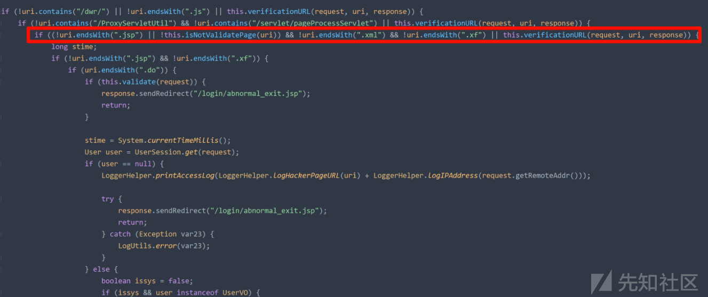](https://xzfile.aliyuncs.com/media/upload/picture/20240117165108-8e75094c-b515-1.png)  
isNotValidatePage 方法相当于是定义了能够访问的 jsp 文件的白名单

[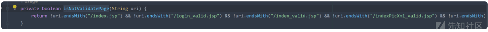](https://xzfile.aliyuncs.com/media/upload/picture/20240117165122-96e7353c-b515-1.png)  
当 url 不以.xf 和.xm 和.jsp 结尾时，为 true，如果访问的 url 以 jsp 结尾，jsp 文件的名称需要在白名单中，才为 true，否则为 false  
当这三个 if 判断都满足了后，如果访问的 url 是白名单中的 jsp 文件，则判断传入的参数是否存在违规字符

[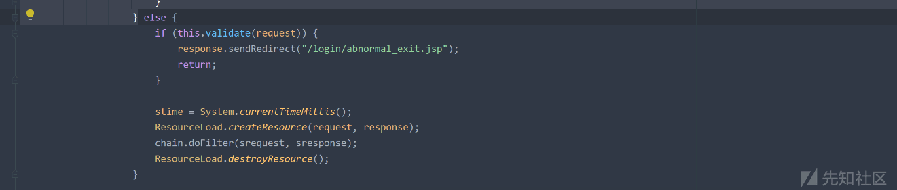](https://xzfile.aliyuncs.com/media/upload/picture/20240117165137-9f9cbdc8-b515-1.png)  
validate 方法用来检测传入的参数是否存在违规字符

[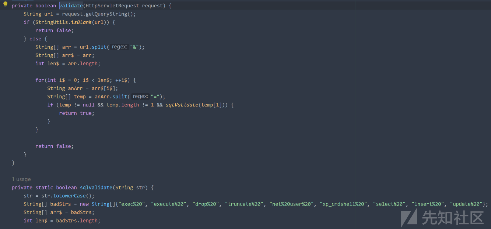](https://xzfile.aliyuncs.com/media/upload/picture/20240117165151-a860a244-b515-1.png)  
如果访问的 url 以.do 结尾，先检测是否包含违规字符，在检测是否登录

[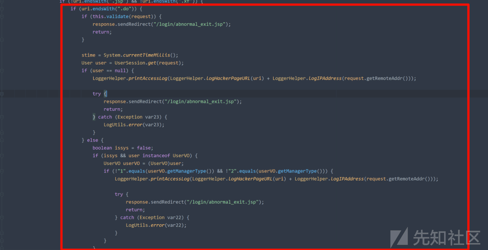](https://xzfile.aliyuncs.com/media/upload/picture/20240117165207-b1e35da2-b515-1.png)  
如果访问的 url 是图片文件

[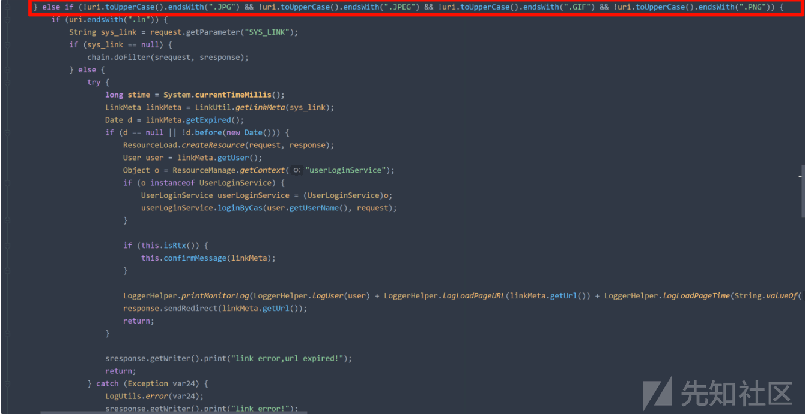](https://xzfile.aliyuncs.com/media/upload/picture/20240117165222-bad75c6a-b515-1.png)  
未做什么判断

[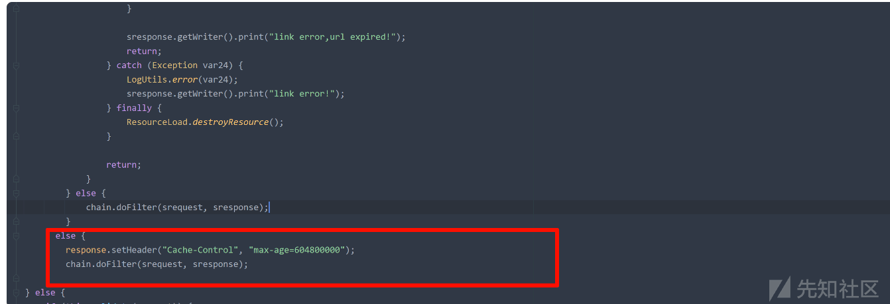](https://xzfile.aliyuncs.com/media/upload/picture/20240117165235-c2283584-b515-1.png)  
如果访问的 url 以.ln 结尾，获取传入的 SYS\_LINK 参数，调用 LinkUtil.getLinkMeta 方法获取 LinkMeta 对象，然后判断 LinkMeta 对象中获取到的时间是否在当前时间之前，根据 LinkMeta 对象中获取到的用户名进行登录操作，然后重定向到 LinkMeta 对象中获取到的 url

[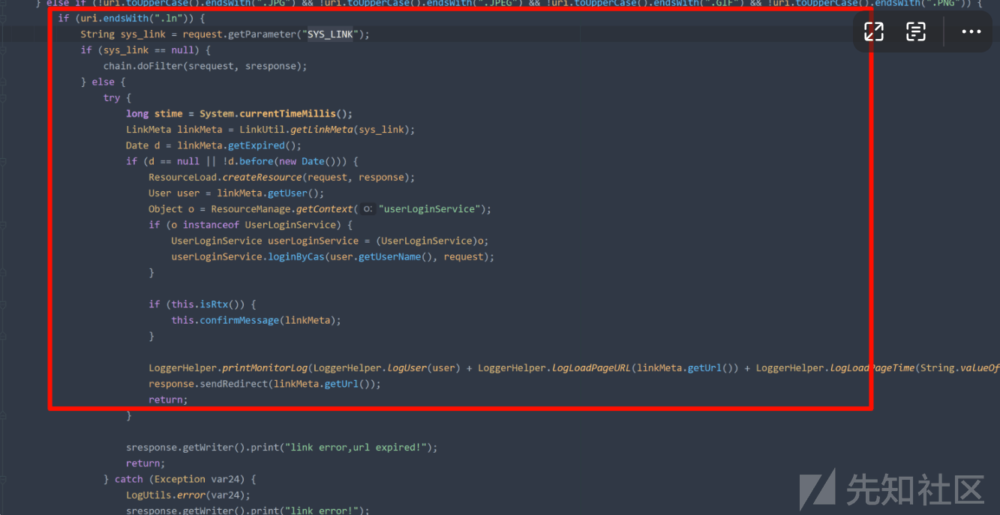](https://xzfile.aliyuncs.com/media/upload/picture/20240117165249-caaed6ae-b515-1.png)  
loginByCas 方法中调用 loginByUserName 方法

[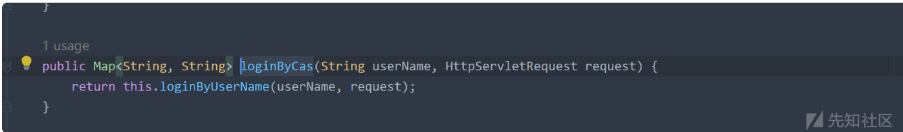](https://xzfile.aliyuncs.com/media/upload/picture/20240117165300-d146b91e-b515-1.png)  
loginByUserName 方法

[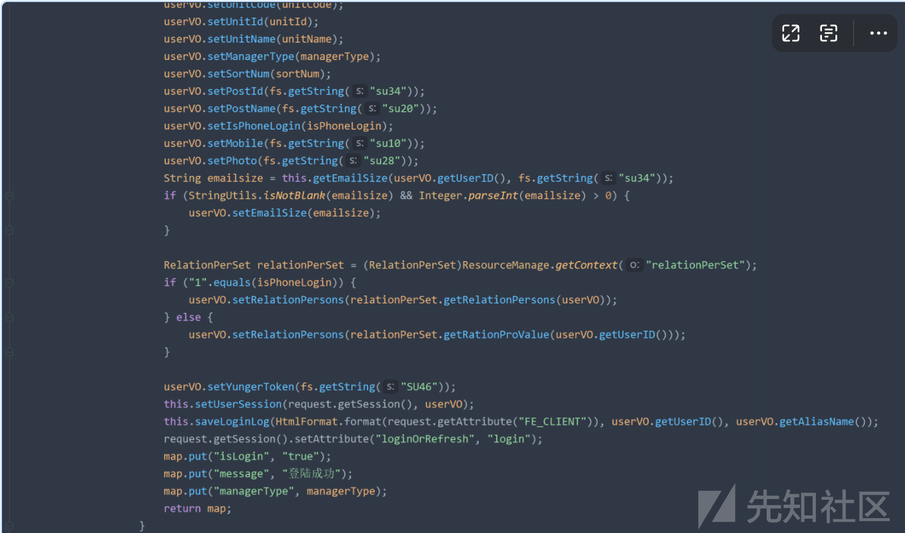](https://xzfile.aliyuncs.com/media/upload/picture/20240117165315-d9ee8ee8-b515-1.png)  
很明显，这里存在一个登录绕过漏洞

## 登录绕过

看下 LinkUtil.getLinkMeta 方法是怎么获取到 LinkMeta 对象的

[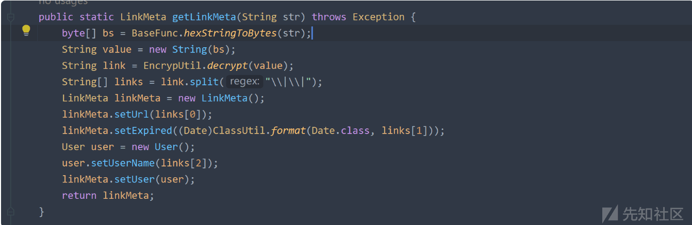](https://xzfile.aliyuncs.com/media/upload/picture/20240117165341-e9c122e0-b515-1.png)  
调用 BaseFunc.hexStringToBytes 对传入的 SYS\_LINK 进行 hex 解码，然后调用 EncrypUtil.decrypt 对其进行解密，将解密后的内容按||进行分割，第一块为 url、第二块为时间，第三块为用户，所以解密后的内容应该就是这种形式：  
url||时间||用户  
时间转换的格式：

[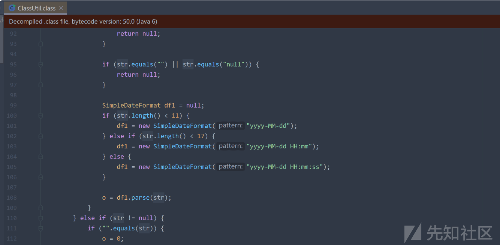](https://xzfile.aliyuncs.com/media/upload/picture/20240117165355-f1f49a78-b515-1.png)  
所以我们可以构造如下 payload：  
/main/main.jsp||2025-01-01||admin  
然后先调用 EncrypUtil.encrypt 对其进行加密，再调用 BaseFunc.bytesToHexString 将其转为 hex  
利用获取到的 hex 数据，访问如下 url 即可直接进入后台：

[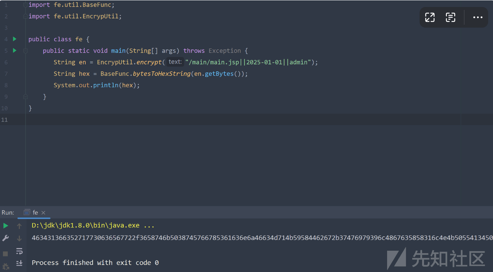](https://xzfile.aliyuncs.com/media/upload/picture/20240117165407-f9114b76-b515-1.png)  
/xxx.ln?SYS\_LINK=hex

## 文件上传

看到依赖中有 DBstep.jar 文件，用到了金格组件

[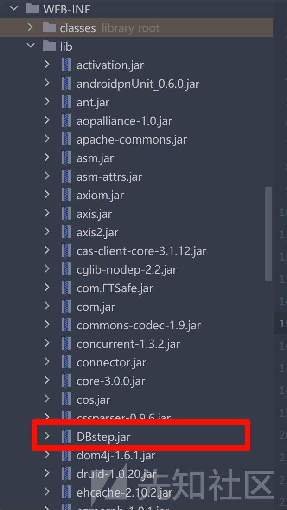](https://xzfile.aliyuncs.com/media/upload/picture/20240117165437-0b3271e0-b516-1.png)  
搜索下 DBstep，发现/iweboffice/OfficeServer.jsp 中调用了

[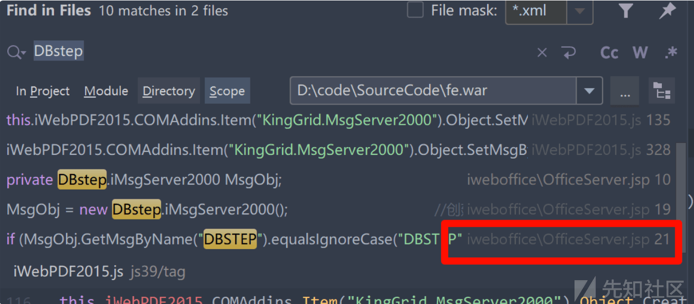](https://xzfile.aliyuncs.com/media/upload/picture/20240117165450-130023d6-b516-1.png)  
存在文件上传漏洞，保存路径目录穿越下就行了

[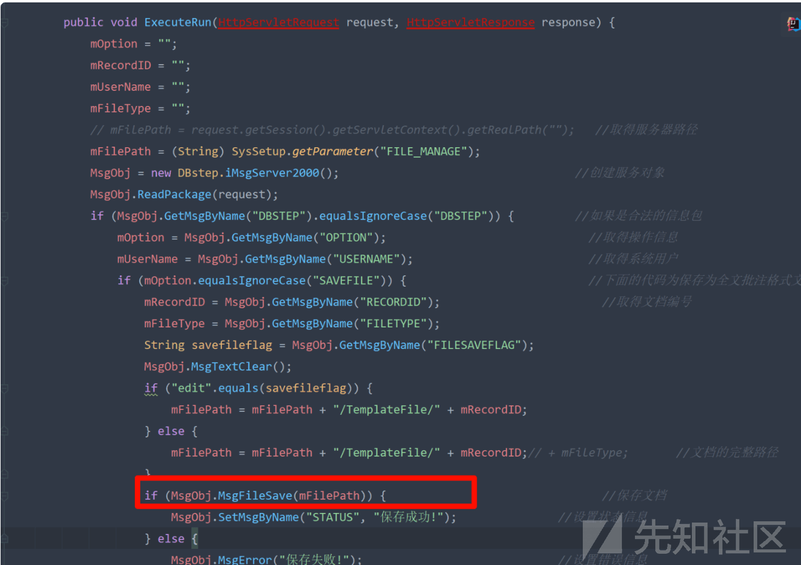](https://xzfile.aliyuncs.com/media/upload/picture/20240117165503-1a594716-b516-1.png)  
但是还有个问题就是，/iweboffice/OfficeServer.jsp 直接是访问不到的，会重定向到/login/abnormal\_exit.jsp

[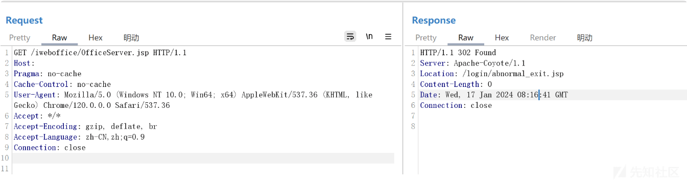](https://xzfile.aliyuncs.com/media/upload/picture/20240117165517-22bdc18e-b516-1.png)  
看响应包可以看到 Server: Apache-Coyote/1.1，说明是tomcat中间件，可以利用其特性来绕过

[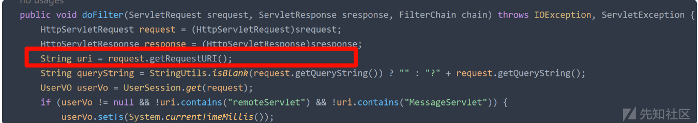](https://xzfile.aliyuncs.com/media/upload/picture/20240117165533-2c2c5fe6-b516-1.png)  
根据前面 Filter 的分析，我们知道以 jsp 结尾的文件只能是白名单中的才能访问，但是我们可以通过.jsp;或者.js%70 的形式进行绕过  
这样子 uri.endsWith 识别不到.jsp，但是之后 tomcat 自己会去除;号、进行 url 解码等

[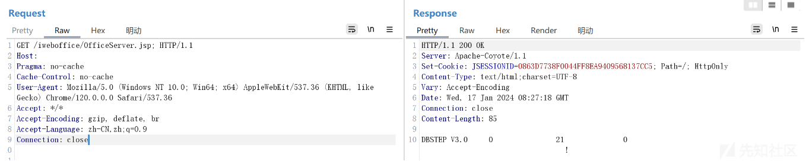](https://xzfile.aliyuncs.com/media/upload/picture/20240117165547-34dc7e32-b516-1.png)

[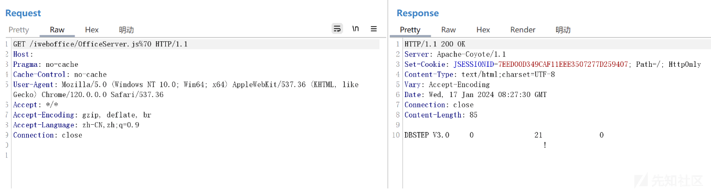](https://xzfile.aliyuncs.com/media/upload/picture/20240117165618-476f9e4e-b516-1.png)  
而我们上传的 jsp 文件，我们只需要在一个存在的目录下，上传一个在白名单中的 jsp 名称，即可直接访问了

[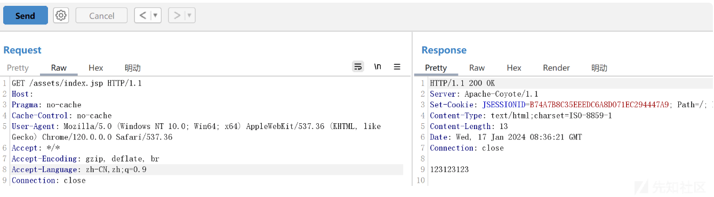](https://xzfile.aliyuncs.com/media/upload/picture/20240117165633-5075bb5e-b516-1.png)

## 登录绕过 2

查看 servlet，可以发现.fe 与.xf 结尾的由 workflow 定义

[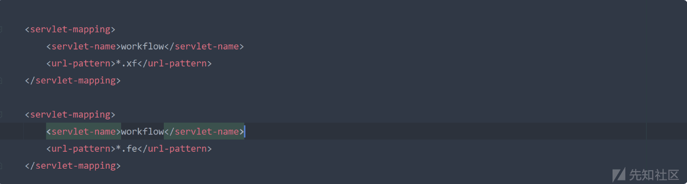](https://xzfile.aliyuncs.com/media/upload/picture/20240117170533-922776ae-b517-1.png)  
这个 servlet 初始化了配置文件/WEB-INF/classes/spring/workflow-bean.xml

[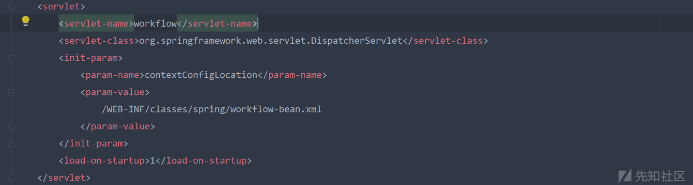](https://xzfile.aliyuncs.com/media/upload/picture/20240117170543-9840473c-b517-1.png)  
/WEB-INF/classes/spring/workflow-bean.xml文件中定义了一些.fe结尾的路由

[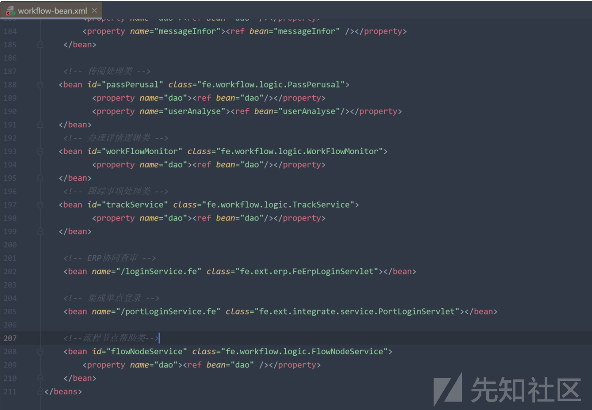](https://xzfile.aliyuncs.com/media/upload/picture/20240117170558-a1326140-b517-1.png)  
/loginService.fe 对应的 fe.ext.erp.FeErpLoginServlet 中只要传入的参数 op 等于 D，就会设置 userName=admin，然后调用 loginByCas(userName, request)

[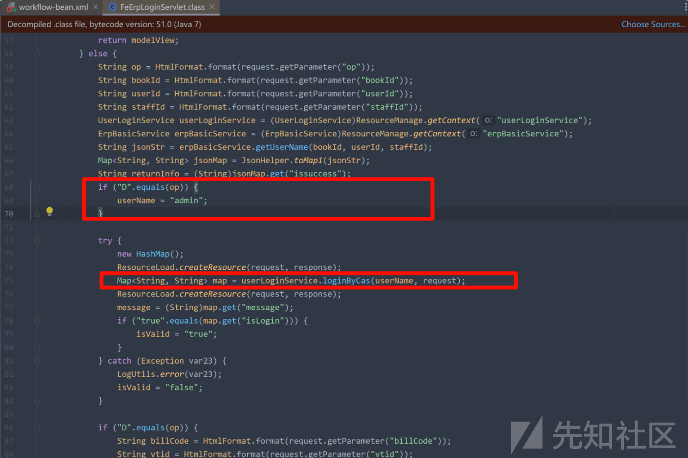](https://xzfile.aliyuncs.com/media/upload/picture/20240117170611-a9060f34-b517-1.png)  
就和上文那个一样了

## 参考链接

[https://blog.csdn.net/qq\_41904294/article/details/135258831](https://blog.csdn.net/qq_41904294/article/details/135258831)  
[https://stack.chaitin.com/vuldb/detail/9fbafeda-3c94-49ee-93f0-f9131e8f9e15](https://stack.chaitin.com/vuldb/detail/9fbafeda-3c94-49ee-93f0-f9131e8f9e15)
