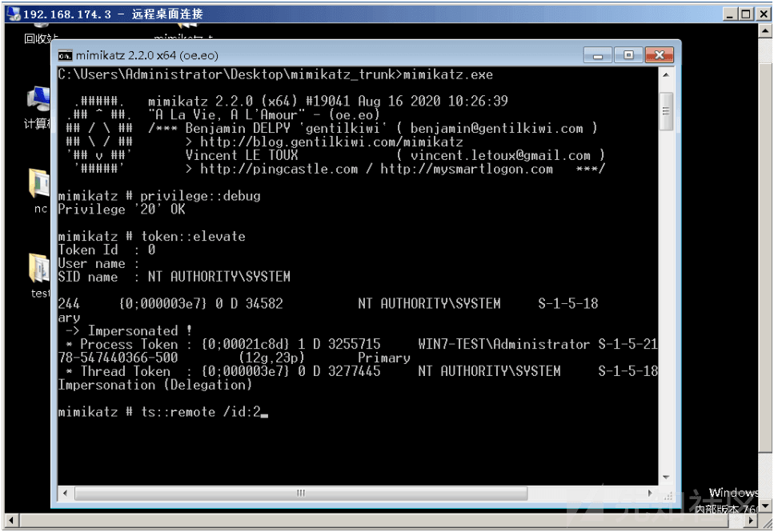

# 横向移动之 RDP&Desktop Session Hijack - 先知社区

横向移动之 RDP&Desktop Session Hijack

- - -

## 文章前言

管理员在内部网络中广泛使用远程桌面协议 (rdp)，这允许系统所有者和管理员远程管理 windows 环境，然而，RDP 可以给攻击者提供各种机会来实施攻击，这些攻击可以用于红队场景中的横向移动，下面的攻击可以让 RedTeam 获得凭据，劫持其他用户的 RDP 会话，并对远程系统执行任意代码，这些远程系统将使用 RDP 作为受感染工作站的身份验证机制。

## RDP 劫持

实施中间人攻击通常会导致凭据捕获，它正在对 RDP 会话执行这种攻击，这将允许攻击者为了横向移动的目的而轻易地获得域帐户的纯文本密码，seth 是一个工具，无论是否启用网络级身份验证 (nla),它都可以自动执行 RDP 中间人攻击，实施这种攻击需要四个参数：

-   以太网接口
-   攻击者的 ip
-   受害主机的 ip
-   目标 rdp 主机的 ip
    
    ```plain
    ./seth.sh eth0 10.0.0.2 10.0.0.3 10.0.0.1
    ```
    
    [](https://xzfile.aliyuncs.com/media/upload/picture/20240124101841-e44d7d7e-ba5e-1.png)

在执行时，该工具将在后台执行一系列步骤，以确保成功实施攻击：

1.  ARP 欺骗
2.  允许转发 ipv4 流量，将流量从受害主机重定向到攻击者计算机，然后重定向到目标 rdp 服务器
3.  配置 iptable 规则来拒绝 syn 数据包，以防止直接 rdp 身份验证
4.  捕获目的主机的 syn 数据包
5.  ssl 证书的克隆
6.  重新配置 iptables 规则，将流量从受害工作站路由到目标 rdp 主机
7.  阻止到端口 88 的流量，以将 kerberos 身份验证降级到 ntlm

步骤 1-3 将在受害者认证之前执行，试图通过 rdp 向目标服务器进行身份验证的用户将收到以下消息： 
[](https://xzfile.aliyuncs.com/media/upload/picture/20240124101909-f4d8b37a-ba5e-1.png)  
当用户建立连接时，凭据将以纯文本形式显示给攻击者  
[](https://xzfile.aliyuncs.com/media/upload/picture/20240124101921-fc3b6fe0-ba5e-1.png)

PS:该方法笔者在本地未实验成功，因为有 SSL 强校验，在实战中建议慎用~

## RDP Inception

mdsec 发现了一种技术，该技术允许攻击者在启动时执行任意代码并通过 RDP 连接传播，从而在网络内部执行横向移动，整个思路大致如下：  
[](https://xzfile.aliyuncs.com/media/upload/picture/20240124102018-1e60d998-ba5f-1.png)  
而在渗透测试中，如果我们获得某台服务器 C 的控制权，而最终目标是 PC X，但由于对方高度安全的网络环境限制，我们只有采取 RDPInception 攻击方式，通过对接入 C 的服务器 B 进行攻击控制，之后，对接入 B 的服务器 A 进行攻击控制，最终，对接入 A 的 PC X 形成攻击控制，整个攻击链如下：

```plain
PC X RDP ————> Server A
Server A RDP ————> Server B
Server B RDP ————> Server C
```

为了促进这种攻击，mdsec 开发了一个批处理脚本 ([https://github.com/mdsecactivebreach/RDPInception](https://github.com/mdsecactivebreach/RDPInception) ) 来实现概念验证，不过该技术在利用时有一个先决条件就是内网其他主机远程连接受感染主机时"本地资源"选项中设置了加载 C 盘：  
[](https://xzfile.aliyuncs.com/media/upload/picture/20240124102049-3074cca2-ba5f-1.png)  
之后攻击者可以在已经获得访问权限的主机上执行批处理脚本将获得一个 shell  
[](https://xzfile.aliyuncs.com/media/upload/picture/20240124102106-3ab0d83c-ba5f-1.png)  
该脚本执行之后将会在已经获得访问权限的 WIndow 7 主机上和远程连接的主机上同时创建启动项：  
[](https://xzfile.aliyuncs.com/media/upload/picture/20240124102121-438f88e0-ba5f-1.png)  
之后当远程连接受感染主机的 Windows Server 2008 重新启动时将会执行恶意载荷：  
[](https://xzfile.aliyuncs.com/media/upload/picture/20240124102134-4b69120c-ba5f-1.png)  
同时打开一个新的 Meterpreter 会话：  
[](https://xzfile.aliyuncs.com/media/upload/picture/20240124102144-518f3ee0-ba5f-1.png)  
从而成功获取到 Windows Server 2008 的权限，由于是启动项所以同时也实现了权限维持，该技巧还有一个好处就是如果当我们初始获得的权限较低，我们可以先运行脚本 run.bat，之后当有域管理员用户或者管理员远程 RDP 登录目标主机时我们可以获得一个高权限的会话，从而间接实现权限提升~  
[](https://xzfile.aliyuncs.com/media/upload/picture/20240124102156-583db41a-ba5f-1.png)

## RDP Session Hijacking

如果在目标系统上获得了本地管理员访问权限，攻击者就有可能劫持另一个用户的 RDP 会话，这消除了攻击者发现该用户凭据的需要，这项技术最初是由 alexander korznikov 发现的，并在他的博客中进行了描述。  
[http://www.korznikov.com/2017/03/0-day-or-feature-privilege-escalation.html](http://www.korznikov.com/2017/03/0-day-or-feature-privilege-escalation.html)  
在 cmd 中输入"taskmg"之后可以从"Users"选项卡中的 windows 任务管理器中检索可用会话列表

[](https://xzfile.aliyuncs.com/media/upload/picture/20240124102215-63b1f0d6-ba5f-1.png)  
从命令提示符可以获得相同的信息  
[](https://xzfile.aliyuncs.com/media/upload/picture/20240124102237-71287730-ba5f-1.png)  
之后我们可以创建一个以系统级权限执行 tscon 的服务将劫持 id 为 2 的会话

```plain
sc create sesshijack binpath= "cmd.exe /k tscon 1 /dest:rdp-tcp#0"
net start sesshijack
```

[](https://xzfile.aliyuncs.com/media/upload/picture/20240124102257-7cedf54a-ba5f-1.png)  
PS：这里的劫持命令构造补充一下

[](https://xzfile.aliyuncs.com/media/upload/picture/20240124102317-88a146bc-ba5f-1.png)  
当服务启动时，我们可以明显的感觉到当前远程登录的操作界面已经发生了变化，之后我们打开 CMD 发现当前用户已经变为了"Administrator"，即用户"Al1ex"在不知道密码的情况下使用 Administrator 的会话：

[](https://xzfile.aliyuncs.com/media/upload/picture/20240124102435-b7463fea-ba5f-1.png)  
mimikatz 也支持这种技术，我们这使用 Mimikatz 从 administrator 切换为 Al1ex 用户：  
第一步是检索终端服务会话列表

```plain
ts::sessions
```

[](https://xzfile.aliyuncs.com/media/upload/picture/20240124102513-ce123a9e-ba5f-1.png)  
如果是低权限用户，尝试直接使用会话 2 将失败，因为 mimikatz 尚未作为系统权限执行，因此，以下命令会将令牌从本地管理员提升到系统，在不需要知道用户密码的情况下使用另一个会话：

```plain
privilege::debug
token::elevate
ts::remote /id:2
```

[](https://xzfile.aliyuncs.com/media/upload/picture/20240124102536-db696988-ba5f-1.png)  
再次执行以下命令又回到了熟悉的"Al1ex"用户的会话界面

```plain
ts::remote /id:2
```

[](https://xzfile.aliyuncs.com/media/upload/picture/20240124102554-e650c49a-ba5f-1.png)

## Desktop Session Hijacking

Windows 允许多个用户在同一时间登录操作系统，但是在某一个时间段内只能由一个用户操作，所有如果有其他用户想要使用同样的主机，那么当前的用户必须退出登录 (log out) 会话或者使用 Switch user 功能切换到另一用户，同时保持他们原有的会话在后端运行，当新用户登录后我们可以在任务管理模块看到先前用户的 Session 会话信息依旧存在，例如：

[](https://xzfile.aliyuncs.com/media/upload/picture/20240124102610-f0057508-ba5f-1.png)

该会话信息会等待先前的用户再次使用，我们也可以通过在命令行中执行以下命令来查看当前的会话信息：

```plain
quser
```

[](https://xzfile.aliyuncs.com/media/upload/picture/20240124102647-0605a206-ba60-1.png)  
而 RDP 也允许通过远程的方式进行连接，当用户由于网络问题断开连接时用户的会话信息依旧会被保存，之后用户可以通过重新连接，Session 对于用户来说非常友好，但是正如我们上图中看到的当用户会话被断开时依旧保存之前的记录信息，如果先前登录的用户具备高权限，那么攻击者可以通过会话劫持的方式进行来获得高权限，具体如下所示：

[](https://xzfile.aliyuncs.com/media/upload/picture/20240124102703-0fb01f02-ba60-1.png)  
之后键入回车后直接切换会话信息且不用输入前一个用户的登录认证密码：

[](https://xzfile.aliyuncs.com/media/upload/picture/20240124102714-15eab918-ba60-1.png)

之后成功劫持 Alex 用户的 Session 会话，你可以在此基础上进行各项操作：

[](https://xzfile.aliyuncs.com/media/upload/picture/20240124102736-22ed28da-ba60-1.png)

## 参考链接

[https://www.reddit.com/r/purpleteamsec/comments/m6jyj1/desktop\_session\_hijacking\_lateral\_movement/](https://www.reddit.com/r/purpleteamsec/comments/m6jyj1/desktop_session_hijacking_lateral_movement/)
