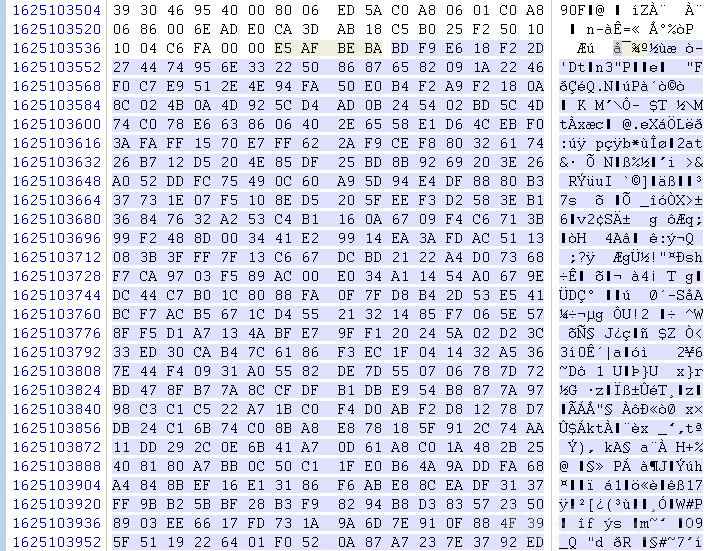

# 浅谈 Linux 取证 - 先知社区

浅谈 Linux 取证

- - -

# Linux 取证

## 查询内核版本对应镜像号

[Deep Security 12.0 Supported Linux Kernels (trendmicro.com)](https://files.trendmicro.com/documentation/guides/deep_security/Kernel%20Support/12.0/Deep_Security_12_0_kernels_EN.html)

Ubuntu:[Deep Security 12.0 Supported Linux Kernels (trendmicro.com)](https://files.trendmicro.com/documentation/guides/deep_security/Kernel%20Support/12.0/Deep_Security_12_0_kernels_EN.html#Ubuntu)

Debian:[Deep Security 12.0 Supported Linux Kernels (trendmicro.com)](http://files.trendmicro.com/documentation/guides/deep_security/Kernel%20Support/12.0/Deep_Security_12_0_kernels_EN.html#Debian)

## linux 取证 vol 命令

```plain
linux_apihooks             - Checks for userland apihooks                                                                                                                                                                                                          
linux_arp                  - Print the ARP table                                                                                                                                                                                                                   
linux_aslr_shift           - Automatically detect the Linux ASLR shift                                                                                                                                                                                             
linux_banner               - Prints the Linux banner information                                                                                                                                                                                                   
linux_bash                 - Recover bash history from bash process memory                                                                                                                                                                                         
linux_bash_env             - Recover a process dynamic environment variables                                                                                                                                                                                      
linux_bash_hash            - Recover bash hash table from bash process memory                                                                                                                                                                                      
linux_check_afinfo         - Verifies the operation function pointers of network protocols                                                                                                                                                                         
linux_check_creds          - Checks if any processes are sharing credential structures                                                                                                                                                                             
linux_check_evt_arm        - Checks the Exception Vector Table to look for syscall table hooking                                                                                                                                                                   
linux_check_fop            - Check file operation structures for rootkit modifications                                                                                                                                                                             
linux_check_idt            - Checks if the IDT has been altered                                                                                                                                                                                                    
linux_check_inline_kernel  - Check for inline kernel hooks                                                                                                                                                                                                         
linux_check_modules        - Compares module list to sysfs info, if available                                                                                                                                                                                      
linux_check_syscall        - Checks if the system call table has been altered                                                                                                                                                                                      
linux_check_syscall_arm    - Checks if the system call table has been altered                                                                                                                                                                                      
linux_check_tty            - Checks tty devices for hooks                                                                                                                                                                                                          
linux_cpuinfo              - Prints info about each active processor                                                                                                                                                                                               
linux_dentry_cache         - Gather files from the dentry cache                                                                                                                                                                                                    
linux_dmesg                - Gather dmesg buffer                                                                                                                                                                                                                   
linux_dump_map             - Writes selected memory mappings to disk                                                                                                                                                                                               
linux_dynamic_env          - Recover a process dynamic environment variables                                                                                                                                                                                      
linux_elfs                 - Find ELF binaries in process mappings                                                                                                                                                                                                 
linux_enumerate_files      - Lists files referenced by the filesystem cache                                                                                                                                                                                        
linux_find_file            - Lists and recovers files from memory                                                                                                                                                                                                  
linux_getcwd               - Lists current working directory of each process                                                                                                                                                                                       
linux_hidden_modules       - Carves memory to find hidden kernel modules                                                                                                                                                                                           
linux_ifconfig             - Gathers active interfaces                                                                                                                                                                                                             
linux_info_regs            - It's like 'info registers' in GDB. It prints out all the                                                                                                                                                                              
linux_iomem                - Provides output similar to /proc/iomem                                                                                                                                                                                                
linux_kernel_opened_files  - Lists files that are opened from within the kernel                                                                                                                                                                                    
linux_keyboard_notifiers   - Parses the keyboard notifier call chain                                                                                                                                                                                               
linux_ldrmodules           - Compares the output of proc maps with the list of libraries from libdl                                                                                                                                                                
linux_library_list         - Lists libraries loaded into a process                                                                                                                                                                                                 
linux_librarydump          - Dumps shared libraries in process memory to disk                                                                                                                                                                                      
linux_list_raw             - List applications with promiscuous sockets                                                                                                                                                                                            
linux_lsmod                - Gather loaded kernel modules                                                                                                                                                                                                          
linux_lsof                 - Lists file descriptors and their path                                                                                                                                                                                                 
linux_malfind              - Looks for suspicious process mappings                                                                                                                                                                                                 
linux_memmap               - Dumps the memory map for linux tasks                                                                                                                                                                                                  
linux_moddump              - Extract loaded kernel modules                                                                                                                                                                                                         
linux_mount                - Gather mounted fs/devices                                                                                                                                                                                                             
linux_mount_cache          - Gather mounted fs/devices from kmem_cache                                                                                                                                                                                             
linux_netfilter            - Lists Netfilter hooks                                                                                                                                                                                                                 
linux_netscan              - Carves for network connection structures                                                                                                                                                                                              
linux_netstat              - Lists open sockets                                                                                                                                                                                                                    
linux_pidhashtable         - Enumerates processes through the PID hash table                                                                                                                                                                                       
linux_pkt_queues           - Writes per-process packet queues out to disk                                                                                                                                                                                          
linux_plthook              - Scan ELF binaries' PLT for hooks to non-NEEDED images                                                                                                                                                                                 
linux_proc_maps            - Gathers process memory maps                                                                                                                                                                                                           
linux_proc_maps_rb         - Gathers process maps for linux through the mappings red-black tree                                                                                                                                                                    
linux_procdump             - Dumps a process's executable image to disk                                                                                                                                                                                            
linux_process_hollow       - Checks for signs of process hollowing                                                                                                                                                                                                 
linux_psaux                - Gathers processes along with full command line and start time                                                                                                                                                                         
linux_psenv                - Gathers processes along with their static environment variables                                                                                                                                                                       
linux_pslist               - Gather active tasks by walking the task_struct->task list                                                                                                                                                                             
linux_pslist_cache         - Gather tasks from the kmem_cache                                                                                                                                                                                                      
linux_psscan               - Scan physical memory for processes                                                                                                                                                                                                    
linux_pstree               - Shows the parent/child relationship between processes                                                                                                                                                                                 
linux_psxview              - Find hidden processes with various process listings                                                                                                                                                                                   
linux_recover_filesystem   - Recovers the entire cached file system from memory                                                                                                                                                                                    
linux_route_cache          - Recovers the routing cache from memory                                                                                                                                                                                                
linux_sk_buff_cache        - Recovers packets from the sk_buff kmem_cache                                                                                                                                                                                          
linux_slabinfo             - Mimics /proc/slabinfo on a running machine                                                                                                                                                                                            
linux_strings              - Match physical offsets to virtual addresses (may take a while, VERY verbose)                                                                                                                                                          
linux_threads              - Prints threads of processes                                                                                                                                                                                                           
linux_tmpfs                - Recovers tmpfs filesystems from memory                                                                                                                                                                                                
linux_truecrypt_passphrase - Recovers cached Truecrypt passphrases                                                                                                                                                                                                 
linux_vma_cache            - Gather VMAs from the vm_area_struct cache                                                                                                                                                                                             
linux_volshell             - Shell in the memory image                                                                                                                                                                                                             
linux_yarascan             - A shell in the Linux memory image
```

## 以一道题目进行技术分析

### 2023 强网杯 - 找到 PNG 了吗

下载附件，是一个 mem 文件，尝试正常的 volatility 取证，发现无果，考虑 linux 取证

先看一下版本号 (利用 vol3)

```plain
python vol.py -f flag.mem banner
```

[](https://xzfile.aliyuncs.com/media/upload/picture/20240208221923-0eaa51a2-c68d-1.png)

可以看到是 Ubuntu20.04 的版本，那么我们就要利用 Ubuntu20.04 的镜像进行一系列的 linux 取证前置操作

### 虚拟机内核更换版本

首先下载正常的镜像，启动虚拟机，之后查看一下内核版本

```plain
uname -r
```

[](https://xzfile.aliyuncs.com/media/upload/picture/20240208221928-11b952da-c68d-1.png)

发现直接下载的和题目给出的内核版本不一样，尝试换源

**先查看当前系统已安装的内核镜像**

```plain
dpkg --get-selections |grep linux-image
```

发现没有目的的内核版本，下载一下

```plain
linux-image-5.15.0-67-generic           install
linux-image-5.15.0-91-generic           install
```

**查询指定版本的 linux 镜像包**

```plain
apt-cache search linux| grep 5.4.0-100
```

**安装指定版本内核的 linux 系统头文件及镜像**

```plain
apt-get install linux-headers-5.4.0-100-generic linux-image-5.4.0-100-generic
```

**查看当前系统中内核的启动顺序**

```plain
grep menuentry /boot/grub/grub.cfg
```

[](https://xzfile.aliyuncs.com/media/upload/picture/20240208221935-15db0be2-c68d-1.png)

**修改内核启动顺序**

如果你升级的版本比当前内核版本高的话，默认新安装的内核就是第一顺序启动的，只需重启系统就行了，否则，则需要修改配置文件，具体如下：

```plain
vim /etc/default/grub
```

[](https://xzfile.aliyuncs.com/media/upload/picture/20240208221941-194940dc-c68d-1.png)

```plain
Advanced options for Ubuntu>Ubuntu, with Linux 5.4.0-100-generic
```

将 GRUB\_DEFAULT=0 修改为**GRUB\_DEFAULT="Advanced options for Ubuntu>Ubuntu, with Linux 4.15.0-76-generic"**，保存退出。

**生效 grub 配置**

```plain
update-grub
```

之后重启即可

#### 创建 vtypes

先在 Ubuntu20.04 下载一个 volatility2，进行 dwarf 的编译

先在/volatility/tools/linux 目录下，将 module.c 的最后末尾加上

```plain
MODULE_LICENSE("GPL");
```

[](https://xzfile.aliyuncs.com/media/upload/picture/20240208221947-1d2fdecc-c68d-1.png)

之后安装 gcc

```plain
sudo apt install gcc
```

再安装 dwarfdump

```plain
sudo apt-get install dwarfdump 
sudo apt-get install build-essential
```

之后再 make 编译

```plain
cd /volatility/tools/linux
sudo make
```

发现成功得到**dwarf**文件

[](https://xzfile.aliyuncs.com/media/upload/picture/20240208221952-20350ffc-c68d-1.png)

#### 获取符号表

一般我们可以在/boot 目录下找到该 System.map 文件。该文件包含系统的符号信息。

```plain
cd /boot
```

[](https://xzfile.aliyuncs.com/media/upload/picture/20240208221957-23284f30-c68d-1.png)

这个就是我们需要的符号表

#### 制作用户配置文件

将 moudle.dwarf 以及 system.map 文件打包成一个 zip 文件

```plain
sudo zip /home/qwb/Desktop/Ubuntu20.5-4-0-100.zip /home/qwb/Desktop/volatility/tools/linux/module.dwarf /boot/System.map-`uname -r`
```

这样我们一个可以调试的内核就制作好了

### 开始做题

然后我们回到自己的 kali 虚拟机，使用**vol2**，将 Ubuntu.zip 放到自己的**/volatility-master/volatility/plugins/linux/**目录下

[](https://xzfile.aliyuncs.com/media/upload/picture/20240208222003-26783f92-c68d-1.png)

第一个就是，我们选用这个作为我们的 profiles

```plain
python2 vol.py -f '/home/evil/Desktop/vol images/找到PNG了吗.mem' --profile=LinuxUbuntu20_5-4-0-100x64 linux_enumerate_files
```

这里发现桌面有一个比较奇怪的东西，dump 一下

[](https://xzfile.aliyuncs.com/media/upload/picture/20240208222008-29657a1c-c68d-1.png)

```plain
python2 vol.py -f '/home/evil/Desktop/vol images/找到PNG了吗.mem' --profile=LinuxUbuntu20_5-4-0-100x64 linux_find_file -i 0xffff9ce28fe300e8 -O 1.jocker
```

之后导出发现是空的，尝试在内存中搜索 jocker

[](https://xzfile.aliyuncs.com/media/upload/picture/20240208222014-2d19a412-c68d-1.png)

发现源码

```plain
int main()
{
    int clientSocket = socket(AF_INET, SOCK_STREAM, 0);
    if (clientSocket == -1) {
        printf("socket failed!\n");
        return 1;
    }
    struct sockaddr_in serverAddr;
    serverAddr.sin_family = AF_INET;
    serverAddr.sin_port = htons(SERVER_PORT);
    serverAddr.sin_addr.s_addr = inet_addr(SERVER_IP);
    connect(clientSocket, (struct sockaddr*)&serverAddr, sizeof(serverAddr));
    int result = recv(clientSocket, buff, sizeof(buff), 0);
    int a=0;
    char q[10];
    unsigned char key[]="do_not_care";
    unsigned char key2[] = "where_is_the_key";
    FILE* file = fopen("have_your_fun.jocker", "wb");
    if (file == NULL) {
        printf("open file failed!\n");
        return 1;
    }
    unsigned char *str;
    str = (char *) malloc(20000);
    memcpy(str, buff, 20000);
    rc4_encrypt_decrypt(key2, str, 20000);
    printf("please give me the key of fun:");
    scanf("%s",q);
    rc4_encrypt_decrypt(key, str, 20000);

    fwrite(buff, 1, 20000, file);
    printf("maybe you go wrong");
    fclose(file);
    close(clientSocket);
    return 0;
}
```

其实就是利用 RC4 加密，Cyber 操作一下

[](https://xzfile.aliyuncs.com/media/upload/picture/20240208222021-310dba90-c68d-1.png)

winhex 搜索一下，整段复制出来解密

[](https://xzfile.aliyuncs.com/media/upload/picture/20240208222026-346a1792-c68d-1.png)

之后继续 RC4 解密即可

[](https://xzfile.aliyuncs.com/media/upload/picture/20240208222031-3738c22a-c68d-1.png)

## 2023 0xGame on my linux

首先看一下版本号

[](https://xzfile.aliyuncs.com/media/upload/picture/20240208222036-3a3deb9e-c68d-1.png)

```plain
Linux version 5.10.0-21-amd64 (debian-kernel@lists.debian.org) (gcc-10 (Debian 10.2.1-6) 10.2.1 20210110, GNU ld (GNU Binutils for Debian) 2.35.2) #1 SMP Debian 5.10.162-1 (2023-01-21)
```

### Vol3 做法

利用网站查询一下 kernel 版本，[Deep Security 12.0 Supported Linux Kernels (trendmicro.com)](http://files.trendmicro.com/documentation/guides/deep_security/Kernel%20Support/12.0/Deep_Security_12_0_kernels_EN.html#Debian)

[](https://xzfile.aliyuncs.com/media/upload/picture/20240208222042-3dab0a0a-c68d-1.png)

发现是 debian11 的，下一下 deb 包，[Index of /debian-security/pool/main/l/linux (sipwise.com)](https://debian.sipwise.com/debian-security/pool/main/l/linux/)

[](https://xzfile.aliyuncs.com/media/upload/picture/20240208222046-40669822-c68d-1.png)

之后解压，得到 data.tar，拖入 linux 分析解压

之后利用 vol3 进行操作，vol3 的貌似便捷一点 (这里 vol3 需要结合 wsl)

```plain
tar -xvf data.tar ./usr/lib/debug/boot/
```

[](https://xzfile.aliyuncs.com/media/upload/picture/20240208222050-42dbd0b8-c68d-1.png)

之后开始制作符号表文件

```plain
dwarf2json linux --system-map /mnt/h/linux-image-5.10.0-21-amd64-dbg_5.10.162-1_amd64/usr/lib/debug/boot/System.map-5.10.0-21-amd64 --elf /mnt/h/linux-image-5.10.0-21-amd64-dbg_5.10.162-1_amd64/usr/lib/debug/boot/vmlinux-5.10.0-21-amd64
 > linux-image-5.10.0-21-amd64-dbg_5.10.162-1_amd64.json
```

```plain
sudo mv linux-image-5.10.0-21-amd64-dbg_5.10.162-1_amd64.json /mnt/d/CTF/Misc/volatility3用这个/volatility3/framework/symbols/linux
```

之后成功将我们的符号表文件导入 vol3 中，直接分析即可

```plain
python3 vol.py -f oh-my-linux.mem linux.pslist
```

[](https://xzfile.aliyuncs.com/media/upload/picture/20240208222056-45f790d4-c68d-1.png)

之后查看一下历史命令

```plain
python3 vol.py -f oh-my-linux.mem linux.bash
```

[](https://xzfile.aliyuncs.com/media/upload/picture/20240208222101-48f260f2-c68d-1.png)

提示我们要查看 zsh 里的命令之后还得看 vol2，vol2 的做法还是得下镜像之后按照 qwb 的题目来做

### Vol2 做法

就是和 qwb 一样，得下 iso 镜像，debian11 的，之后创建 vtypes 和符号表，用 vol2 做

# 参考

[祥云杯 misc/re | Dr34m](https://dr34m.club/article/4#e5e83d02bc3e438b9d9884c0a6f201f0)

[0xGame2023 oh-my-linux 技术分析 | Randark\_JMT - 陈橘墨](https://treasure-house.randark.site/blog/2023-10-26-0xGame2023-oh-my-linux)  
[Ubuntu Linux 内核版本升级或降级到指定版本（基于 ubuntu 18.04 示例）\_ubuntu 降版本 20 降到 18-CSDN 博客](https://blog.csdn.net/weixin_42915431/article/details/106614841#:~:text=Ubuntu%20Linux%E5%86%85%E6%A0%B8%E7%89%88%E6%9C%AC%E5%8D%87%E7%BA%A7%E6%88%96%E9%99%8D%E7%BA%A7%E5%88%B0%E6%8C%87%E5%AE%9A%E7%89%88%E6%9C%AC%EF%BC%88%E5%9F%BA%E4%BA%8Eubuntu%2018.04%E7%A4%BA%E4%BE%8B%EF%BC%89%201%201%E3%80%81%E6%9F%A5%E7%9C%8B%E5%BD%93%E5%89%8D%E7%B3%BB%E7%BB%9F%E5%B7%B2%E5%AE%89%E8%A3%85%E7%9A%84%E5%86%85%E6%A0%B8%E9%95%9C%E5%83%8F%20root%40zyg%3A~%20%23%20dpkg,6%E3%80%81%E7%94%9F%E6%95%88grub%E9%85%8D%E7%BD%AE%20...%207%206%E3%80%81%E7%A7%BB%E9%99%A4%E4%B8%8D%E7%94%A8%E7%9A%84%E5%86%85%E6%A0%B8%20...%208%207%E3%80%81%E5%85%B3%E9%97%AD%E5%86%85%E6%A0%B8%E6%88%96%E5%8C%85%E7%9A%84%E8%87%AA%E5%8A%A8%E6%9B%B4%E6%96%B0)
