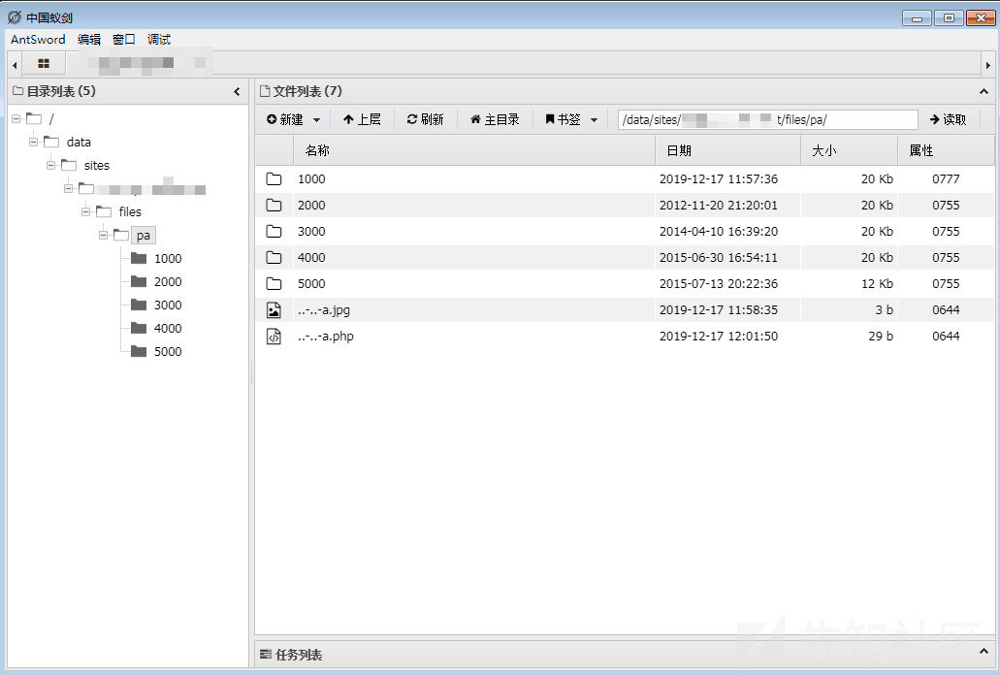

# 渗透测试实战（一） - 先知社区

渗透测试实战（一）

- - -

#### 写在前面

> 准备分享一些实战向的、思路比较有趣的文章，算不上系列吧，只是不知道怎么命名好一些。

​ 工作中某迂回目标的 c 段服务器，由于各种原因需要迂回战术去搞，所以遇到了文中的站点。对于上传点的利用过程感觉比较有意思，所以准备分享出来当作各位茶余饭后的休闲文章。

**注：** 由于不可抗拒因素，站点相关图片可能较少，分析过程尽可能详细一些。

- - -

#### 登录认证

```plain
工作以后，很多时候目标可能只有一个登录框，通常都很头疼。其实常规的手段都尝试一下，深入理解功能点、接口、数据传输形式等等，还是有可能突破的。希望在准备的一些实战总结文章中可以给各位提供一些思路。
```

通过 c 段端口扫描发现 .81 这台机器开放 82 端口，服务为 http。访问后为 xx 文档系统登录页面，需要认证登录，无验证码。因此可以考虑弱口令爆破、测试 SQL 注入、目录扫描、查看 js/抓包寻找接口等等。

经过测试存在注入，并且目录扫描扫到了.git。我似乎已经看到了 root 权限，但是在进一步漏洞利用的过程中的的确确遇到了一些有意思的问题。

- - -

#### 突破认证

> 毫无过滤的注入，让我直接放弃了去看代码的想法，准备好了黑盒注入 + 上传一条龙。

经过简单的判断为盲注，但是当注入语句未闭合时会返回详细的 mysql 报错信息，返回的语句单引号经过转义，所以无法利用报错注入。直接用 sqlmap 跑就好了，发现非 root 用户，挂在 vps 去跑表和字段，准备找一个账号密码登录进去看看。

同时利用[lijiejie](https://github.com/lijiejie/GitHack)的.git 泄露 exploit 脚本，将源码下载了回来。

[](https://xzfile.aliyuncs.com/media/upload/picture/20200104015404-0839d450-2e52-1.png)

找到了登录 认证出的代码，发现在未闭合 sql 语句返回错误处可以利用，利用错误日志功能达到回显注入的目的。

[](https://xzfile.aliyuncs.com/media/upload/picture/20200104015458-2817b97c-2e52-1.png)

通过测试发现$row\['usr\_id'\]内容为 post 的 username 参数值，将错误语句写入日志，再通过 getErrorMsg 函数 select 读取出来，导致了可以利用该功能进行回显注入，直接利用 sqlmap 跑出来的表名字段名读取了用户密码。

[](https://xzfile.aliyuncs.com/media/upload/picture/20200104015542-422b788a-2e52-1.png)

登录到系统后很快就找到了上传点，管理文档处可以上传 pdf 文件，但是只是单纯的前端校验。上传 php 文件后访问却 404，观察 url 发现上传的文件名被写入数据库，通过参数调用的方式来加载文件（url：project.php?fn=1.pdf&file=1.php），这种形式的调用文件通常会将文件放在非 web 应用程序目录，而且就算放在了 web 目录由于没有返回路径也无法直接访问。

但是我们有源代码，这下 shell 没跑了吧？

- - -

#### 其他上传接口

> 此时遇到了个严重的问题，登录后的默认文件 project.php，在我利用 lijiejie 脚本还原的文件里并不存在？？

这种情况其实很常见，网上有很多.git 泄露利用工具，但是每种还原的都不相同。暂时没有考虑还原全部 commit，通过全局搜索危险函数，准备用最便捷的方式 getshell。只找到了 move\_uploaded\_file 函数，简单的阅读代码，让我眼前一亮。

```plain
/**
*api.php
**/
```

[](https://xzfile.aliyuncs.com/media/upload/picture/20200104015749-8e0438be-2e52-1.png)

从代码中可以看出，文件后缀名路径皆可控，只要 post $\_FILES\[\\'snapshot\\'\]\[\\'name\\'\]参数，以及正确的用户名密码即可上传任意文件。所以尝试直接，访问 api.php 文件，通过自己构造上传类型的数据包上传正常文件。

[](https://xzfile.aliyuncs.com/media/upload/picture/20200104015825-a3b37648-2e52-1.png)

的确执行了上传的操作，通过响应 body 中的 2 可以知道上传失败了，根据报错信息查看了 config 文件，发现出大问题。

```plain
define( 'PATH_ROOT',    'c:/wamp/www/webname' );
/* ...... */
define( 'PATH_UPL_PA',              PATH_ROOT . '/files/pa' );
```

下载回来的配置文件中的绝对路径是 windows 目录，然而此时的 web 运行在 linux 上。这个运维直接将 windows 下的 web 程序迁移到了 linux 中。。。。TQL

仔细下面这段代码，发现很有意思。

[](https://xzfile.aliyuncs.com/media/upload/picture/20200104015900-b8bdcd4a-2e52-1.webp)

最直观的想法是，利用../可以控制上传目录，并且文件名可控，完全可以利用下面构造的文件名直接上传至根目录。那么可不可以利用目录跳转跳过定义的 c 盘目录，拼接前面爆出的此时 linux 的绝对路径。

```plain
../-../-../../../../../../../webpath/a.php
```

发现同样是失败的，后来经过同事提醒发现并不可以，因为在 linux 中无法跳过并不存在的目录。

[](https://xzfile.aliyuncs.com/media/upload/picture/20200104020003-de0ca562-2e52-1.png)

同事在测的时候发现还有一个问题就是，../在 php 上传文件的时候反斜线后面就会被截断，也就是说根本不能通过../这样的形式进行目录跳转。

如果该 api 在迁移后仍在用，可以利用“..-..-a.php”文件名跳转绕过目录的限制（使用该文件名上传了一次发现依旧返回为 2）。为了确认 api 还在使用，尝试还原所有 commit 看能否找到更改后的代码。

- - -

#### .git 还原问题

> 网络上的工具还原方式不同，导致还原的文件也不相同，推荐使用 GitTools 工具，还原的代码很全面，就是比较耗时。

[GitTools](https://github.com/internetwache/GitTools),将所有 commit 还原后我找到了最新的 config 文件，发现了代码修改的部分。

config.php 文件在/inc 目录下。

[](https://xzfile.aliyuncs.com/media/upload/picture/20200104020210-29766934-2e53-1.png)

发现迁移到 linux 以后的代码验证了 host，之前一直用 ip:port 访问并不能上传成功，修改 host 为 beauty.xxxx.net（ip 为.81），上传文件..-..-a.php 成功。

[](https://xzfile.aliyuncs.com/media/upload/picture/20200104020305-4a823b94-2e53-1.png)

[](https://xzfile.aliyuncs.com/media/upload/picture/20200104020332-5a8ae3f6-2e53-1.png)

- - -

### 写在后面

在构造上传包和文件名处是比较有趣的，同时自己也学到了一些东西。不知道为什么，当想尽办法绕过的时候觉得是个很有趣的点，回过头来写文章却发现平平无奇，由于项目暂停了也没法搞内网了，看了一下内网还是挺大的，linux 代理进去搞一波可能会有收获，文章就到这里吧。
