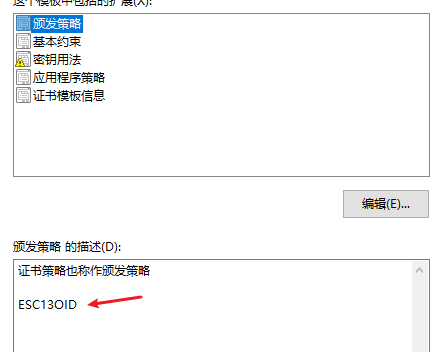

# 滥用 ADCS 进行权限提升——ESC13 详解 - 先知社区

滥用 ADCS 进行权限提升——ESC13 详解

- - -

## 0x1 起因：

​ 自 Will Schroeder（[@harmj0y](https://twitter.com/harmj0y)）和 Lee Christensen（[@tifkin\_](https://twitter.com/tifkin_)）在 2021 年的 BlackHat 大会上发布白皮书以来，ADCS 的攻击面首次系统化的进入人们的视野。[Certified Pre-Owned - Abusing Active Directory Certificate Services](https://www.specterops.io/assets/resources/Certified_Pre-Owned.pdf)这本白皮书可以说是为 ADCS 的利用奠定了各种理论基础。  
​ 随着 ADCS 的利用越加广泛，各种工具层出不穷，其中 Certipy 更是其中的佼佼者，近日在学习 Certipy 的相关代码实现的时候，偶然发现了这样一条 PR

[](https://cdn.nlark.com/yuque/0/2024/png/25946722/1708914927187-82296929-cb7d-40c9-9870-679ed15f5df5.png#averageHue=%2312171e&clientId=u45251239-0d4a-4&from=paste&height=393&id=uc7a279be&originHeight=589&originWidth=1853&originalType=binary&ratio=1.5&rotation=0&showTitle=false&size=79883&status=done&style=none&taskId=uf22aa9a9-573c-4abd-8216-4280825c7a3&title=&width=1235.3333333333333)  
众所周知（应该），在白皮书中一共介绍了 ESC1-ESC8 这 8 种 ESC 命名的攻击手法，后续又补充了[Oliver Lyak](https://medium.com/u/cd3a881c1abc?source=post_page-----fda4272fbd53--------------------------------)提出的[ESC9 和 ESC10](https://research.ifcr.dk/certipy-4-0-esc9-esc10-bloodhound-gui-new-authentication-and-request-methods-and-more-7237d88061f7)、 [Sylvain Heiniger](https://twitter.com/sploutchy)提出的中继到 RPC 的 [ESC11](https://blog.compass-security.com/2022/11/relaying-to-ad-certificate-services-over-rpc/)和利用条件比较局限的的[ESC12](https://pkiblog.knobloch.info/esc12-shell-access-to-adcs-ca-with-yubihsm)，针对这条 PR 附带的[博客文章](https://posts.specterops.io/adcs-esc13-abuse-technique-fda4272fbd53)，我尝试对这个 ESC13 进行分析和复现。

## 0x2 分析：

​ 首先，先上结论：正如标题，这不是一个可以和 ESC1 或者 ESC8 一样可以直接获取域内权限的致命漏洞，它只能算是一个域内权限提升漏洞，提升的权限取决于你错误配置指向的组的权限，且它的限制颇多。  
​ 说的详细一点的话就是，我们可以使用指向给定 AD 组的 OID 组链接的颁发策略来配置证书模板。当我们用这个模板申请证书成功之后，我们利用该证书进行身份验证就可以获取这个组的权限，哪怕我们的用户不在这个组里。

这里面涉及到三个关键：

-   颁发策略
-   指向 AD 组的 OID 组链接
-   使用证书认证

我们对此进行逐步分析

### 证书颁发策略

证书颁发策略是指用于控制证书颁发的一组规则和条件。颁发策略定义了在何种情况下、以何种方式以及向谁颁发证书。  
我们可以打开一个证书模板查看其拓展，可以看到是包括了颁发策略这一部分的，而且当前模板默认是没有值  
[](https://cdn.nlark.com/yuque/0/2024/png/25946722/1708918016197-6a505c5b-2cd3-43a5-8df3-75eeaa1086e7.png#averageHue=%23f8f7f6&clientId=u230a819b-e668-4&from=paste&height=385&id=u18b7d027&originHeight=577&originWidth=915&originalType=binary&ratio=1.5&rotation=0&showTitle=false&size=73074&status=done&style=none&taskId=uaa9ddf63-788c-48d2-8836-749b662b67b&title=&width=610)  
我们可以点击编辑添加颁发策略，也可以新建我们自己的颁发策略  
[](https://cdn.nlark.com/yuque/0/2024/png/25946722/1708918078789-58e43ae4-20a1-4eec-a40b-2ccaa9c1c7da.png#averageHue=%23f2f2f1&clientId=u230a819b-e668-4&from=paste&height=323&id=ue8e1c19d&originHeight=484&originWidth=752&originalType=binary&ratio=1.5&rotation=0&showTitle=false&size=34866&status=done&style=none&taskId=ucc9890b9-3087-4752-8c27-2c9adeac44b&title=&width=501.3333333333333)  
证书的颁发策略同样是用 OID 进行标志的，它存储在 LDAP 中的 CN=OID,CN=Public Key Services,CN=Services,CN=Configuration,DC=esg-red,DC=local 中，每一个 CN 代表一个 OID 对象  
[](https://cdn.nlark.com/yuque/0/2024/png/25946722/1708918442888-84c364a8-d563-42ac-84e4-8e5ffaca90e4.png#averageHue=%23f8f7f6&clientId=u230a819b-e668-4&from=paste&height=465&id=u66ac5de5&originHeight=697&originWidth=1240&originalType=binary&ratio=1.5&rotation=0&showTitle=false&size=97131&status=done&style=none&taskId=ub9f1220c-95fd-41ea-b478-d98d6a54b3e&title=&width=826.6666666666666)  
同样我们也可以通过 powershell 来查看

```plain
Get-ADObject -Filter * -SearchBase "CN=OID,CN=Public Key Services,CN=Services,CN=Configuration,DC=esg-red,DC=local" -Properties DisplayName,msPKI-Cert-Template-OID
```

[](https://cdn.nlark.com/yuque/0/2024/png/25946722/1708919300339-9f5a206b-b6ea-4900-a88f-8e35e408f4f7.png#averageHue=%23012456&clientId=u230a819b-e668-4&from=paste&height=553&id=u02de8495&originHeight=829&originWidth=1377&originalType=binary&ratio=1.5&rotation=0&showTitle=false&size=52356&status=done&style=none&taskId=u4841601f-7d15-4020-8aa6-b12711fd6ff&title=&width=918)  
注意，上面存储的 OID 是 ADCS 中所有的 OID，而证书模板具有的颁发策略的 OID 则存储在证书模板中的 msPKI-Certificate-Policy 属性中  
[](https://cdn.nlark.com/yuque/0/2024/png/25946722/1708919336264-7ebd03a1-f56d-448c-9f27-8d9b598126c6.png#averageHue=%23f3f2f1&clientId=u230a819b-e668-4&from=paste&height=413&id=u41f2738e&originHeight=620&originWidth=1248&originalType=binary&ratio=1.5&rotation=0&showTitle=false&size=98683&status=done&style=none&taskId=u38f946fc-5a2c-4e07-a6c3-68728d5223f&title=&width=832)

### OID 组链接

对应 CN=OID 这个容器，我们可以看到它是一个`msPKI-Enterprise-Oid`类，而对于这个类，它存在一个继承 的`msDS-OIDToGroupLink`属性  
[](https://cdn.nlark.com/yuque/0/2024/png/25946722/1708919491225-4d2d4819-10d8-47bc-a262-61e48acefbdf.png#averageHue=%23f0eeed&clientId=u230a819b-e668-4&from=paste&height=290&id=u5dd9b8b7&originHeight=435&originWidth=853&originalType=binary&ratio=1.5&rotation=0&showTitle=false&size=55336&status=done&style=none&taskId=u98c04447-7256-4952-823f-221391a5c14&title=&width=568.6666666666666)[](https://cdn.nlark.com/yuque/0/2024/png/25946722/1708919746008-72eee16a-bdb6-458e-8425-83ef1852a64e.png#averageHue=%23f5f4f2&clientId=u230a819b-e668-4&from=paste&height=511&id=uafe70662&originHeight=766&originWidth=1362&originalType=binary&ratio=1.5&rotation=0&showTitle=false&size=136993&status=done&style=none&taskId=ubfbd46d1-8d5d-4793-b4fe-63a7b7524ab&title=&width=908)  
`msDS-OIDToGroupLink`这个属性便是 ESC13 的关键，它标识了与该 OID 表示的发布策略对应的组对象。换句话说，我们可以利用这个属性将我们的颁发策略和相应的 AD 组链接起来，如果用户利用带有相关颁发策略的证书进行身份验证，那么系统将认为该用户作为 AD 组的成员（即使用户不在该组中），并授予相应的权限。  
[](https://cdn.nlark.com/yuque/0/2024/png/25946722/1708926380028-d7fc811f-edbf-431f-8465-5f682b28e6ff.png#averageHue=%23f9f8f6&clientId=u230a819b-e668-4&from=paste&height=508&id=ua9b6c4e3&originHeight=762&originWidth=1495&originalType=binary&ratio=1.5&rotation=0&showTitle=false&size=116127&status=done&style=none&taskId=u4b2539be-8d66-45c6-839a-9a5cbefead8&title=&width=996.6666666666666)  
但是并不是任何组都可以被颁发策略链接的，它需要满足以下要求

1.  必须是 AD 的通用组
2.  组内没有任何成员

当我们设置了`msDS-OIDToGroupLink`属性后，尝试向这个组内添加成员会报错  
[](https://cdn.nlark.com/yuque/0/2024/png/25946722/1708926550502-f84963fc-be61-4d20-bff4-73621f708f5a.png#averageHue=%23f9f9f8&clientId=u230a819b-e668-4&from=paste&height=199&id=u52d5d50c&originHeight=298&originWidth=713&originalType=binary&ratio=1.5&rotation=0&showTitle=false&size=8675&status=done&style=none&taskId=ub7509b79-0fb6-4d98-baaf-d9521e7e2c8&title=&width=475.3333333333333)

### 证书认证：

前面说到，这是利用证书颁发策略的`msDS-OIDToGroupLink`属性导致的权限滥用，所以我们必须要使用证书进行身份验证才行，也就是说我们的证书模板要支持证书认证。  
我们可以验证一下，我们为 ESCUser13 用户申请具有漏洞的 ESC13 模板证书，我们利用 Rubeus 申请 TGT 票据，并利用 krbtgt 的密钥解密查看 PAC 部分  
[](https://cdn.nlark.com/yuque/0/2024/png/25946722/1708927396119-5839c1ab-91e2-459f-a220-eb8b196a2044.png#averageHue=%23161616&clientId=u230a819b-e668-4&from=paste&height=446&id=u2fdade49&originHeight=669&originWidth=1722&originalType=binary&ratio=1.5&rotation=0&showTitle=false&size=64918&status=done&style=none&taskId=uc2e78c56-c46c-4eec-984b-b45ecb469ff&title=&width=1148)  
我们可以看到 ESC13User 除了默认的 513User 组外，没有加入任何其他组  
[](https://cdn.nlark.com/yuque/0/2024/png/25946722/1708927501328-ed74ff2d-6af2-4021-bcdf-9a62b0c57cb7.png#averageHue=%230a2c5c&clientId=u230a819b-e668-4&from=paste&height=149&id=ud44fac20&originHeight=223&originWidth=643&originalType=binary&ratio=1.5&rotation=0&showTitle=false&size=7801&status=done&style=none&taskId=u84af355c-fc10-4ad4-9ecf-bddb882e95f&title=&width=428.6666666666667)  
但是在我们查看票据的 PAC 的时候，可以看到它拥有着 ESC13Group 这个组的权限  
[](https://cdn.nlark.com/yuque/0/2024/png/25946722/1708927428326-cccdbc5c-b312-4857-a0c0-06c57b6b09ac.png#averageHue=%23101010&clientId=u230a819b-e668-4&from=paste&height=545&id=u592a5e9e&originHeight=817&originWidth=1106&originalType=binary&ratio=1.5&rotation=0&showTitle=false&size=25041&status=done&style=none&taskId=u8426d23a-c5d9-4c04-be1e-e5a46b4c74d&title=&width=737.3333333333334)  
[](https://cdn.nlark.com/yuque/0/2024/png/25946722/1708927549008-cb2c31c4-f35c-4700-9597-5e071f82d9aa.png#averageHue=%23f6f5f4&clientId=u230a819b-e668-4&from=paste&height=447&id=u95811611&originHeight=671&originWidth=1010&originalType=binary&ratio=1.5&rotation=0&showTitle=false&size=104050&status=done&style=none&taskId=ued2b311e-90a2-4b2e-b849-953c640204d&title=&width=673.3333333333334)  
而我们利用正常账号密码申请票据，发现只有一个 513User 组  
[](https://cdn.nlark.com/yuque/0/2024/png/25946722/1708927608876-3757adff-588b-4887-a435-91ef37bd7801.png#averageHue=%23151515&clientId=u230a819b-e668-4&from=paste&height=449&id=u727c9d63&originHeight=674&originWidth=1542&originalType=binary&ratio=1.5&rotation=0&showTitle=false&size=64381&status=done&style=none&taskId=u2f25f66e-fbb7-420b-b916-b2c6a899d3c&title=&width=1028)  
[](https://cdn.nlark.com/yuque/0/2024/png/25946722/1708927638298-2e4817d8-b3f2-4779-8963-950d48c86871.png#averageHue=%23101010&clientId=u230a819b-e668-4&from=paste&height=507&id=ua756cd20&originHeight=761&originWidth=1059&originalType=binary&ratio=1.5&rotation=0&showTitle=false&size=22607&status=done&style=none&taskId=u3135fc9b-52d2-433c-98cf-7c9ea2b9729&title=&width=706)

## 0x3 漏洞复现：

### 配置

搭建域控和 ADCS 的步骤这里不再赘述了  
域控：DC Windows server 2019 Datacenter 10.10.10.128  
ADCS：ADCS Windows server 2019 Datacenter 10.10.10.131  
域名：esg-red.local  
CA 名：esg-red-ADCS-CA  
首先我们新建一个普通用户，确保它没有加入任何其他组

```plain
Get-ADUser ESC13User -Properties MemberOf
```

[](https://cdn.nlark.com/yuque/0/2024/png/25946722/1708928161501-eb3f13d2-7784-4499-bcaa-12428718e751.png#averageHue=%230b2c5c&clientId=u230a819b-e668-4&from=paste&height=143&id=uc6cb32a2&originHeight=214&originWidth=633&originalType=binary&ratio=1.5&rotation=0&showTitle=false&size=6619&status=done&style=none&taskId=u1357ab96-d4ee-47d2-acc0-3bed9341782&title=&width=422)  
然后创建一个通用组，组内没有任何用户  
[](https://cdn.nlark.com/yuque/0/2024/png/25946722/1708928218262-fc69a70a-e671-459d-a346-455b72159b46.png#averageHue=%23f2f0ee&clientId=u230a819b-e668-4&from=paste&height=424&id=u515d51f3&originHeight=636&originWidth=857&originalType=binary&ratio=1.5&rotation=0&showTitle=false&size=105988&status=done&style=none&taskId=udbe6c567-ca7a-47d9-962f-c3f6a0d867c&title=&width=571.3333333333334)  
[](https://cdn.nlark.com/yuque/0/2024/png/25946722/1708928234061-d40b41da-a944-4d9e-896c-ba87b20a82f6.png#averageHue=%23efefee&clientId=u230a819b-e668-4&from=paste&height=273&id=u033e9812&originHeight=410&originWidth=540&originalType=binary&ratio=1.5&rotation=0&showTitle=false&size=21248&status=done&style=none&taskId=u34b208cf-3176-4030-b02f-039bd0353cd&title=&width=360)  
为了验证权限，我们为这个组设置对域内 DCSync 的权限  
[](https://cdn.nlark.com/yuque/0/2024/png/25946722/1708939042023-6d4bcd88-ace1-48eb-9858-adef0975f270.png#averageHue=%23f5f3f1&clientId=u54327113-d12a-4&from=paste&height=268&id=u6ea25eb4&originHeight=402&originWidth=444&originalType=binary&ratio=1.5&rotation=0&showTitle=false&size=28409&status=done&style=none&taskId=u225c02be-e7f1-43f3-8c57-5656257a9f6&title=&width=296)  
接着我们来到我们的 ADCS，在终端中输入`certsrv.msc`打开我们的证书颁发机构，在证书模板这里右键管理打开证书模板控制台，我们可以直接复制现有的模板来创建新的漏洞模板。我们右键工作组身份验证选择复制模板，修改模板名称，在拓展这里双击颁发策略，点击添加  
[](https://cdn.nlark.com/yuque/0/2024/png/25946722/1708928861889-4606c86b-1bbd-42ba-97f6-b6cdfa20d6db.png#averageHue=%23f0f0ef&clientId=u230a819b-e668-4&from=paste&height=372&id=u61fdae3c&originHeight=558&originWidth=558&originalType=binary&ratio=1.5&rotation=0&showTitle=false&size=36528&status=done&style=none&taskId=uf2f33612-de83-43de-88aa-808eb49c4ab&title=&width=372)  
我们可以选择现有的颁发策略，也可以直接新建颁发策略，新建时填写名称就行了  
[](https://cdn.nlark.com/yuque/0/2024/png/25946722/1708928921174-ee039622-f217-4b23-9e61-9fe16c88e59e.png#averageHue=%23f1efee&clientId=u230a819b-e668-4&from=paste&height=313&id=ua2093655&originHeight=470&originWidth=880&originalType=binary&ratio=1.5&rotation=0&showTitle=false&size=50738&status=done&style=none&taskId=ub0691b52-b435-49c1-983f-434f323bc31&title=&width=586.6666666666666)  
在填完完成之后，点击拓展里的颁发策略，下面会显示已有的策略  
[](https://cdn.nlark.com/yuque/0/2024/png/25946722/1708928983194-ff9ed238-b996-4d5a-b66e-daae66536fed.png#averageHue=%23fbfafa&clientId=u230a819b-e668-4&from=paste&height=235&id=u0a3e6489&originHeight=352&originWidth=442&originalType=binary&ratio=1.5&rotation=0&showTitle=false&size=12979&status=done&style=none&taskId=u8d624044-f5d6-4d06-b6b8-5f35ec9b5a2&title=&width=294.6666666666667)  
我们需要给予用户对证书的申请权限  
[](https://cdn.nlark.com/yuque/0/2024/png/25946722/1708929289096-602c22a6-b7d1-41e5-a7a1-f4a79c6ea493.png#averageHue=%23f7f6f5&clientId=u230a819b-e668-4&from=paste&height=423&id=ub6ec8b3c&originHeight=634&originWidth=455&originalType=binary&ratio=1.5&rotation=0&showTitle=false&size=32160&status=done&style=none&taskId=ub5c96577-e789-4d3f-8ccd-84f11b93e92&title=&width=303.3333333333333)  
同时还有一个非常重要的一点，我们需要在使用者名称这里，将 DNS 名修改为用户主体名称 (UPN)，因为我们新建的用户是没有 dNSHostName 这个属性的，不更改的话会导致证书申请失败  
[](https://cdn.nlark.com/yuque/0/2024/png/25946722/1708929219915-390945d9-f0ad-43d1-807b-d1cb225d8d51.png#averageHue=%23ebeae9&clientId=u230a819b-e668-4&from=paste&height=355&id=u9c926504&originHeight=533&originWidth=439&originalType=binary&ratio=1.5&rotation=0&showTitle=false&size=31879&status=done&style=none&taskId=u0bb5d110-bcd2-47d1-860c-8c13d0945b3&title=&width=292.6666666666667)  
我们在终端中输入`adsiedit.msc`打开 ADSI 编辑器，然后连接 AD 的 Configuration  
[](https://cdn.nlark.com/yuque/0/2024/png/25946722/1708928392356-0b01c427-706e-4ea5-890d-87b54c77794e.png#averageHue=%23f9f8f8&clientId=u230a819b-e668-4&from=paste&height=463&id=uc2b17dfb&originHeight=694&originWidth=1129&originalType=binary&ratio=1.5&rotation=0&showTitle=false&size=45598&status=done&style=none&taskId=u62555f8a-69c7-403e-a189-166fbb4bd95&title=&width=752.6666666666666)  
找到我们的 OID 容器，在`CN=OID,CN=Public Key Services,CN=Services,CN=Configuration,DC=esg-red,DC=local`下，找到我们创建的颁发策略，修改其`msDS-OIDToGroupLink`属性为我们创建的通用组  
[](https://cdn.nlark.com/yuque/0/2024/png/25946722/1708928566245-84c4753e-707b-454d-a148-12ae106c2b82.png#averageHue=%23f4f2f0&clientId=u230a819b-e668-4&from=paste&height=427&id=u9520fa4e&originHeight=641&originWidth=955&originalType=binary&ratio=1.5&rotation=0&showTitle=false&size=90125&status=done&style=none&taskId=uf0202ba1-d05f-473a-83cd-770b28fc4d5&title=&width=636.6666666666666)

### 利用

我们找到支持 ESC13 的[分支](https://github.com/sploutchy/Certipy/tree/main)下载下来，进入主目录，利用 find 进行简单的信息收集  
可以看到，成功的扫描出了 ESC13 这个漏洞  
[](https://cdn.nlark.com/yuque/0/2024/png/25946722/1708929665639-a7fc218a-4798-4c0a-abb5-04657d27a15d.png#averageHue=%232c2e38&clientId=u230a819b-e668-4&from=paste&height=444&id=ubdd963a8&originHeight=666&originWidth=1450&originalType=binary&ratio=1.5&rotation=0&showTitle=false&size=188814&status=done&style=none&taskId=u5ea93e5d-a11a-4ad6-a072-52b5b0d559e&title=&width=966.6666666666666)  
然后我们申请 pfx 证书

```plain
python entry.py req -u 'ESC13User@esg-red.local' -p 'Admin13' -template 'ESC13'  -target adcs.esg-red.local  -ca esg-red-ADCS-CA
```

[](https://cdn.nlark.com/yuque/0/2024/png/25946722/1708929770957-314ef791-2c51-461f-9e3b-4e1f1b86225b.png#averageHue=%23292b35&clientId=u230a819b-e668-4&from=paste&height=191&id=ufd57e4a9&originHeight=286&originWidth=1644&originalType=binary&ratio=1.5&rotation=0&showTitle=false&size=74467&status=done&style=none&taskId=u8eaf06c3-9ea2-48ef-a91a-2d189d53275&title=&width=1096)  
我们利用申请的证书申请 kirbi 类型的票据并将其转化为 Linux 上使用的 ccache 类型

```plain
python entry.py auth -pfx esc13user.pfx -dc-ip 10.10.10.128 -kirbi
impacket-ticketConverter esc13user.kirbi esc13user.ccache
```

[](https://cdn.nlark.com/yuque/0/2024/png/25946722/1708939385399-fb4b4920-46ff-4e79-bcb2-39c13f9a0ef4.png#averageHue=%232b2d37&clientId=u54327113-d12a-4&from=paste&height=311&id=ua1ef076f&originHeight=467&originWidth=1299&originalType=binary&ratio=1.5&rotation=0&showTitle=false&size=98957&status=done&style=none&taskId=ua27dd07b-2a42-430b-814c-cd16797552a&title=&width=866)  
我们利用 impacket 分支的[describeTicket.py](https://github.com/ThePorgs/impacket/blob/7a0ec36036b9b3339a7a72290f33c243a5e4f0b9/examples/describeTicket.py#L4)脚本解密查看，可以看到确实是存在 2616 这个组的权限

```plain
python aaa.py esc13user.ccache --aes 3c4f06f1b46e0d5d30fe428ce08921964cae205def01fcf3b643dacf40a27983
```

[](https://cdn.nlark.com/yuque/0/2024/png/25946722/1708939562089-5c4c3e23-d5ee-4173-80e8-889526247687.png#averageHue=%232b2e37&clientId=u54327113-d12a-4&from=paste&height=311&id=u65aaacfe&originHeight=467&originWidth=853&originalType=binary&ratio=1.5&rotation=0&showTitle=false&size=88306&status=done&style=none&taskId=u340213bb-4ae4-448c-a60e-c5805a8181b&title=&width=568.6666666666666)  
导入票据

```plain
export KRB5CCNAME=esc13user.ccache
```

[](https://cdn.nlark.com/yuque/0/2024/png/25946722/1708939595985-de6e2e2e-db72-429a-b3fe-4741ac6638d6.png#averageHue=%232d2f39&clientId=u54327113-d12a-4&from=paste&height=211&id=u289cc822&originHeight=316&originWidth=948&originalType=binary&ratio=1.5&rotation=0&showTitle=false&size=56631&status=done&style=none&taskId=uda6421e1-922e-4735-8c80-ea6ef2050b2&title=&width=632)  
尝试 DCSync 攻击

```plain
impacket-secretsdump esg-red.local/ESC13User@DC.esg-red.local  -k -no-pass -just-dc-user 'krbtgt' -debug
```

[](https://cdn.nlark.com/yuque/0/2024/png/25946722/1708939699045-942d1018-3918-4f21-b05e-77f7aa54852c.png#averageHue=%232d2f39&clientId=u54327113-d12a-4&from=paste&height=496&id=u9d5969be&originHeight=744&originWidth=1469&originalType=binary&ratio=1.5&rotation=0&showTitle=false&size=226821&status=done&style=none&taskId=u2de54266-3298-45bc-bea7-be90de2aa25&title=&width=979.3333333333334)

## 0x4 总结：

感觉这个利用属于是”可遇而不可求“，感觉利用限制很多，而且获取的还不一定是高权限组的权限，不过我们可以配合其他漏洞，例如 ESC5 来修改 PKI 的 ACL 等。本篇文章只是暂时分析了一下成因及其简单利用，后续有其他利用姿势欢迎大佬补充，文章有什么错误也欢迎大佬斧正。

滥用 ADCS 进行权限提升——ESC13 详解.pdf (2.004 MB) [下载附件](https://xzfile.aliyuncs.com/upload/affix/20240226175734-76ca8aa0-d48d-1.pdf)
