# 用友 NC-CLOUD 任意文件上传和 SQL 注入漏洞分析 - 先知社区

用友 NC-CLOUD 任意文件上传和 SQL 注入漏洞分析

- - -

## 漏洞描述

用友 NC Cloud ncchr 登陆校验中存在安全特性绕过漏洞，由于登陆调用 Loginfilter.class 类针对 request 请求头中 accesstokenNCC 解密校验场景缺失，因此存在模拟访问时，特定 accesstokenNCC 序列串校验永不失效。  
根据安全通报中的漏洞描述，对于 ncchr 的路由鉴权存在漏洞。

## 路由分析

通过安装包安装完成站点，然后将服务端的代码打包使用 idea 打开。可以先通过 web.xml 看一下路由信息。系统有用 spring 框架，路由还是比较好分析。  
[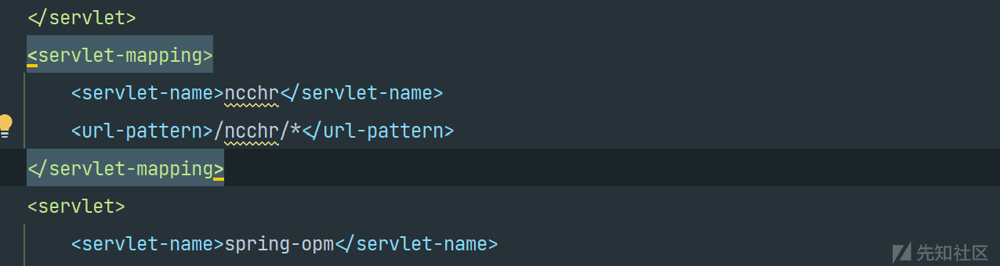](https://xzfile.aliyuncs.com/media/upload/picture/20231212173547-d49f97d0-98d1-1.png)  
可以看到在路径中访问 ncchr 由什么应用服务处理，这里可以再去 WEN-INF 下的 lib 里找相应的 jar 包。然后反编译工具或者使用 idea，lib 导入 jar 查看源码。  
这里继续搜索发现 ncchr 路由的过滤器。  
[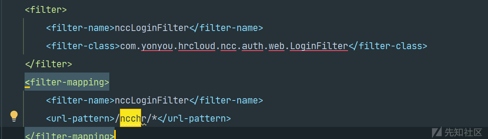](https://xzfile.aliyuncs.com/media/upload/picture/20231212173648-f8fff0ac-98d1-1.png)  
其中应该就是相应鉴权代码，进入相应文件查看。  
[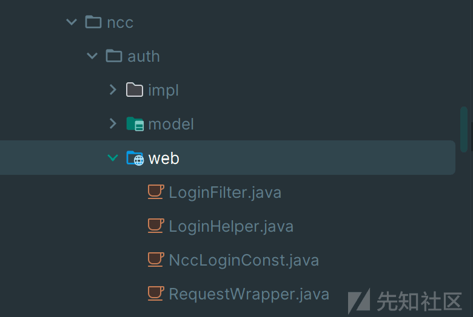](https://xzfile.aliyuncs.com/media/upload/picture/20231212173720-0bf4d128-98d2-1.png)

## 鉴权分析

可以看见 LoginFilter 继承至 Spring 框架中的 OncePerRequestFilter，通过 OncePerRequestFilter 这个类我们知道 LoginFilter 对于同一个请求只被调用一次，同时定义了一些静态常量字符串用于识别鉴权请求中的特定参数和后续的操作的附加信息  
[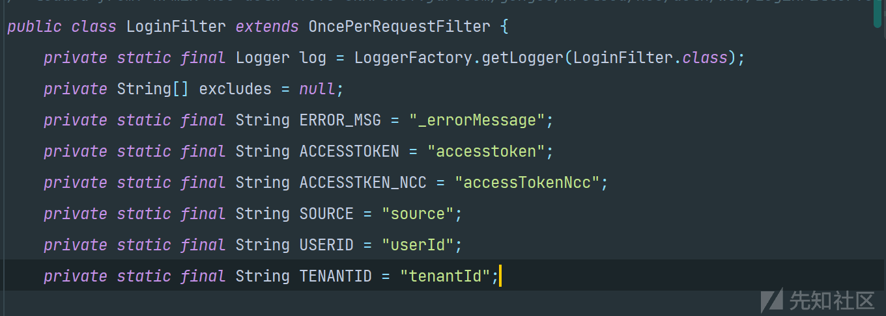](https://xzfile.aliyuncs.com/media/upload/picture/20231212173736-15557ca4-98d2-1.png)  
在继续分析之前，我们需要先了解过滤器的生命周期。过滤器的生命周期通常包括以下阶段。

-   实例化：在 Servlet 容器（通常是 Tomcat）根据配置（web.xml）在启动时或者在应用的第一次请求到来时就会创建过滤器的实例
-   初始化：在创建后 Servlet 容器会调用该实例的 init 方法。进行必要的配置和初始化工作。
-   请求处理：对于每个到来的 HTTP 请求，如果该请求与过滤器的映射路径匹配，Servlet 容器将调用过滤器的 doFilter 方法。同时在前面我们提到过 OncePerRequestFilter 类。在 Spring 框架中可以通过这个类一次请求中只调用一次过滤器，无论请求多少次资源。过滤器可以在 doFilter 方法中执行它的主要操作检查请求头、修改请求或响应对象、执行安全检查等等。
-   销毁：当 Web 应用被卸载或 Servlet 容器关闭时，destroy 方法会被调用。也就是过滤器会释放它持有的资源。  
    通过以上我们可以了解到一个过滤器应该具备的功能，同时在 LoginFilter 中也应该存在以上功能。其中最重要，也是我们最关心的就是请求处理的方法。  
    [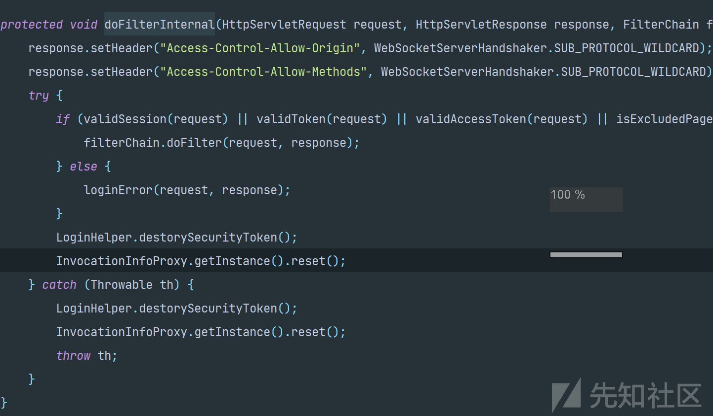](https://xzfile.aliyuncs.com/media/upload/picture/20231212173815-2cbdc75c-98d2-1.png)  
    可以看见其中启用了 filterChain.doFilter(request, response);这个方法用来将请求和响应传递给过滤器链中的下一个实体，在 if 判断中即至少一个验证方法返回 true，请求才会继续传递下。分别为 validSession(request),validToken(request),validAccessToken(request),isExcludedPage(request)，其中 validSession(HttpServletRequest request) 检测获取名为 NCCloudSessionID 的 cookie 值。而 validAccessToken(HttpServletRequest request) 从 HTTP 请求中获取名为 ACCESSTKEN\_NCC 的访问令牌进行检测，validToken(HttpServletRequest request) 从 HTTP 请求中获取名为 ACCESSTOKEN 的访问令牌进行检测，isExcludedPage(request) 确定传入的 HTTP 请求是否针对不需要执行安全检查的页面。  
    其中 validAccessToken 就是本次的漏洞点

## 漏洞点分析

[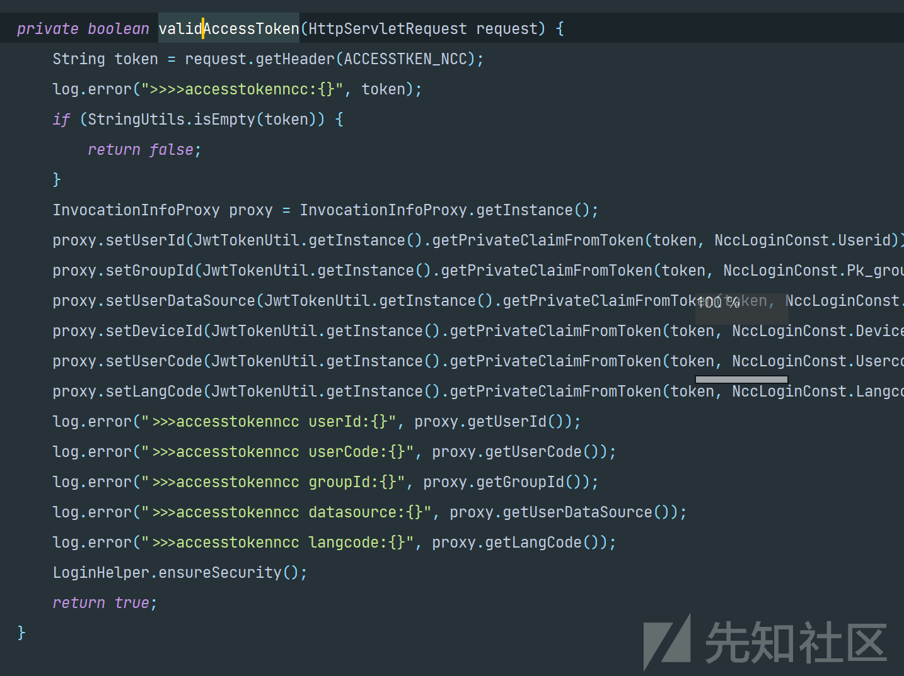](https://xzfile.aliyuncs.com/media/upload/picture/20231212174509-235c81c0-98d3-1.png)  
其中 validAccessToken 方法如上，主要操作为获取 HTTP 请求中的 accessTokenNcc（在上面中 accessTokenNcc 被定义成私有的静态字符串 ACCESSTKEN\_NCC），然后进行判断为空直接返回 false。获取 InvocationInfoProxy（用来持有用户请求信息的代理类）的实例，然后进行 JWT 解密。就是从 token 中取出值设置到实例中，包括用户 ID、组 ID、数据源、设备 ID、用户代码以及语言代码。跟进 JwtTokenUtil 工具类查看具体校验流程，  
[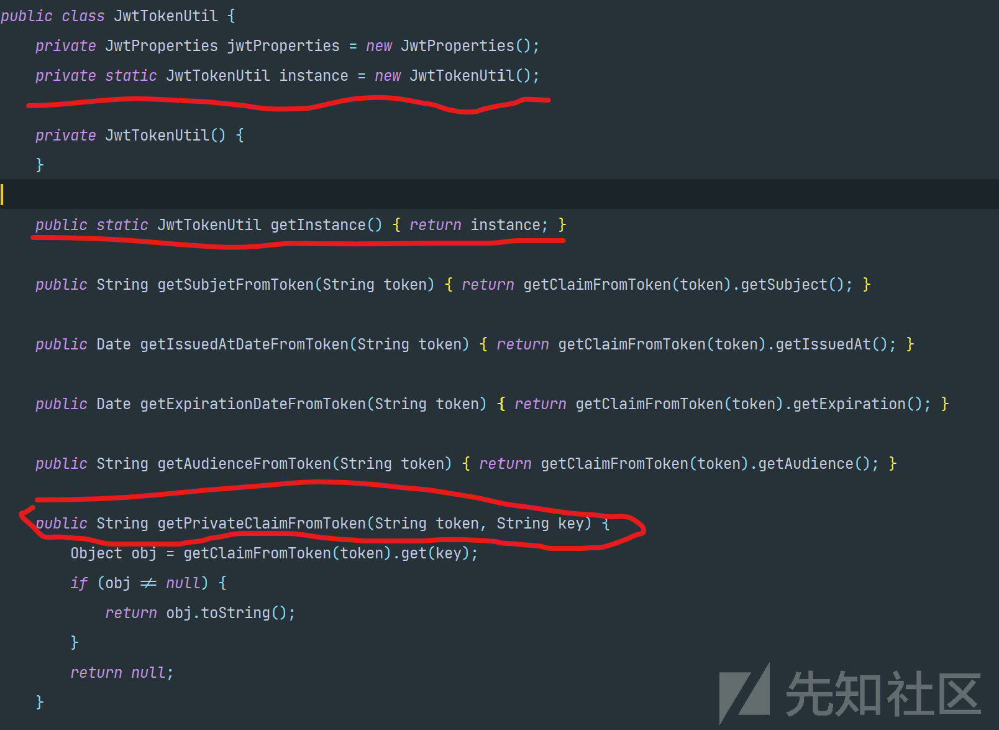](https://xzfile.aliyuncs.com/media/upload/picture/20231212174537-33ea720e-98d3-1.png)  
根据以上可得到，JWT 校验流程，为先获取 JwtTokenUtil 的单例实例，然后通过实例中的 getPrivateClaimFromToken 方法来处理传入的 token，其中调用了 getClaimFromToken 方法来获取 token 中的私有声明，具体代码如下。  
[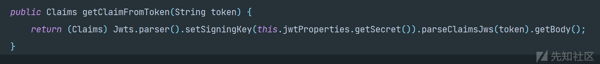](https://xzfile.aliyuncs.com/media/upload/picture/20231212174554-3dfb1564-98d3-1.png)  
主要逻辑为通过 parser() 方法创建一个 JwtParser 实例（用来验证和解析 JWT，提取其中的信息并进行相应的处理。），然后通过从 jwtProperties 中获取的密钥解析传入的 token，获取声明。其中跟进 jwtProperties 代码可以发现，jwt 的默认密钥硬编码到了代码中，所以我们可以自己生成 jwt 即可绕过鉴权。  
[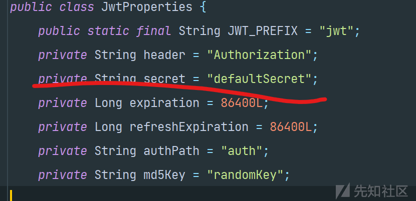](https://xzfile.aliyuncs.com/media/upload/picture/20231212174615-4ac659de-98d3-1.png)  
后续流程为有错进行日志记录，没有就执行 LoginHelper.ensureSecurity();  
[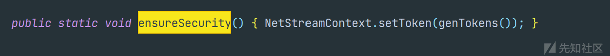](https://xzfile.aliyuncs.com/media/upload/picture/20231212174710-6bc18668-98d3-1.png)  
从代码可知 ensureSecurity() 是设置一个安全令牌，这样我们就可以访问 ncchr 的路由。

## uploadChunk 任意文件上传

绕过前台的校验，我们就可以查看后台的是否存在漏洞。  
在/ncchr/pm/fb/attachment.java 中存在文件上传功能  
[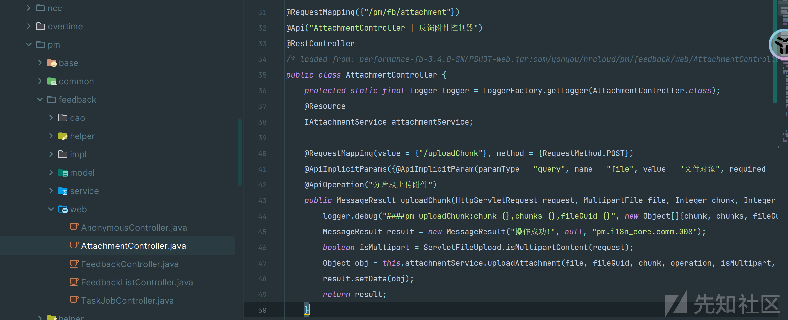](https://xzfile.aliyuncs.com/media/upload/picture/20231212174903-aedd916c-98d3-1.png)  
@RequestMapping 定义了一个请求映射，将 POST 到/uploadChunk 路径的请求路径到 uploadChunk 方法，查看代码，uploadChunk 方法实际是处理文件分片上传请求的。接收参数为（HttpServletRequest request, MultipartFile file, Integer chunk, Integer chunks, String fileGuid, String operation）  
其中 Integer 对象分别为分片序号和总分片数，这个不重要。重要是 fileGuid 为 string 类型，跟进后面可以发现 fileGuid 为文件名，且在当前控制层未发现对文件名的处理。

```plain
Object obj = this.attachmentService.uploadAttachment(file, fileGuid, chunk, operation, isMultipart, chunk.intValue() == chunks.intValue() - 1);
```

具体上传代码在 attachmentService 接口的实现类中，进入相应代码查看  
[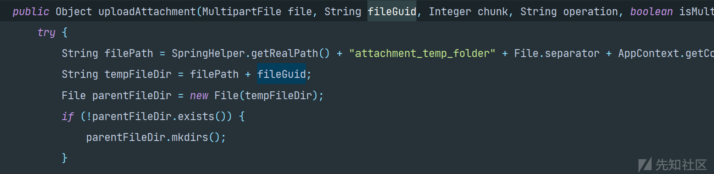](https://xzfile.aliyuncs.com/media/upload/picture/20231212174937-c31aa82c-98d3-1.png)  
首先构造了相应的临时文件路径，由 SpringHelper.getRealPath()(用于获取应用程序运行的环境的实际路径)，File.separator(提供了系统相关的默认名称分隔符),AppContext.getContext().getScope()(当前的作用域) ,然后和输入的文件名拼接组成了存储上传文件的路径。  
[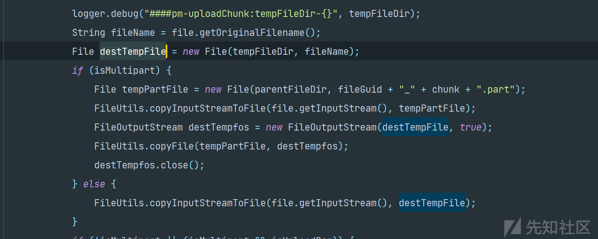](https://xzfile.aliyuncs.com/media/upload/picture/20231212175000-d0e24064-98d3-1.png)  
然后就是通过 Spring 框架中处理上传文件的方法上传文件，getOriginalFilename 就是获取原始文件名。后续的代码就是处理分段上传和是否上传至 OSS 相关的代码。现在我们已经掌握了上传任意文件至任意目录的条件。文件类型可控，且可以通过../穿越目录。便可以上传 jsp 文件至可执行目录。

## SQL 注入漏洞

通过分析代码发现，应用没有使用 ORM 持久层框架，所有的查询都是使用拼接字符串的方式来构造查询条件。根据关键字搜索，可以找到，如下几个模糊查询的实现类中的方法。  
[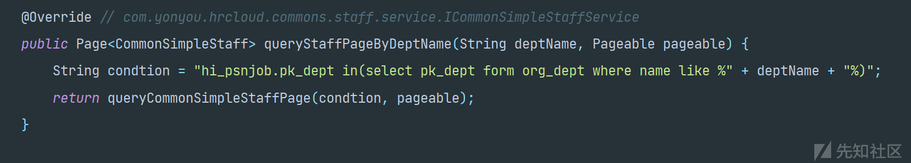](https://xzfile.aliyuncs.com/media/upload/picture/20231212175022-de35edc4-98d3-1.png)  
[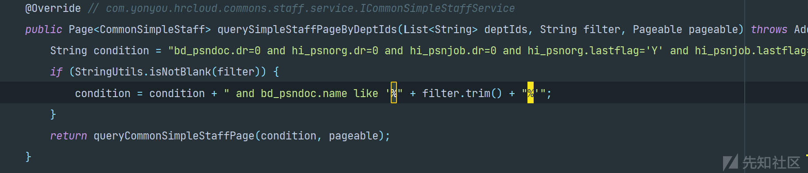](https://xzfile.aliyuncs.com/media/upload/picture/20231212175044-eadb1c84-98d3-1.png)  
[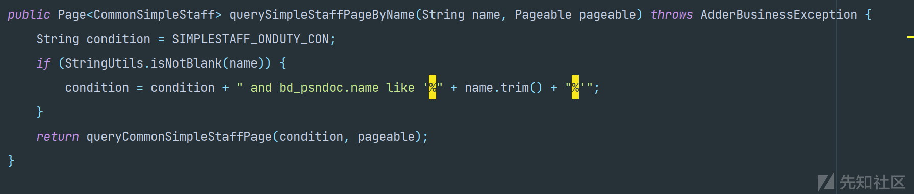](https://xzfile.aliyuncs.com/media/upload/picture/20231212175102-f5c238bc-98d3-1.png)  
以上代码执行的操作都为，定义默认的查询条件，对传入参数进行判断是否为空，不为孔则将其作为查询条件加入到原始条件中，然后调用 queryCommonSimpleStaffPage 方法进行实际的查询，然后返回 page 对象。queryCommonSimpleStaffPage 方法代码如下。  
[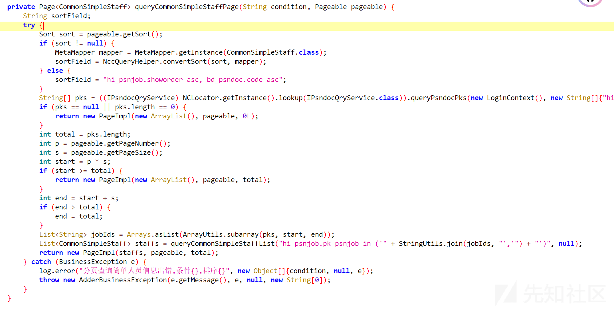](https://xzfile.aliyuncs.com/media/upload/picture/20231212175122-01cf1904-98d4-1.png)  
主要就是做获取分页的排序信息，处理排序信息等的操作，然后调用 `queryCommonSimpleStaffList` 方法查询符合条件的员工信息列，进入相应方法查看。  
[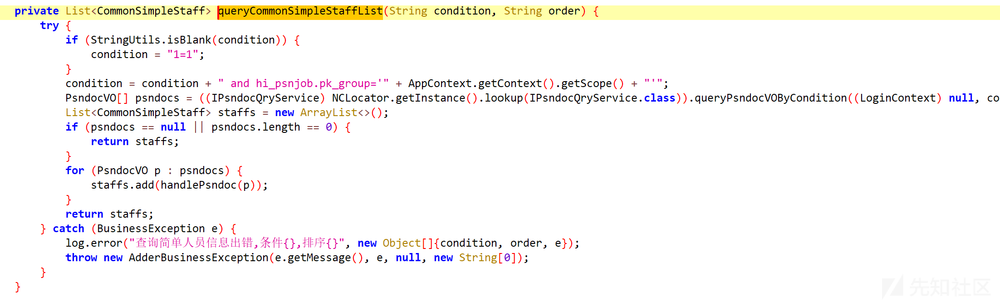](https://xzfile.aliyuncs.com/media/upload/picture/20231212175142-0db24e44-98d4-1.png)  
首先判断查询条件为空，为空设定为默认条件"1=1"，然后在查询条件中添加组织信息，限制查询结果为当前组织，再使用 IPsndocQryService 进行查询。此时我们已经找到存在 SQL 注入的实现方法，只需要寻找到哪些接口掉用了这些方法，且对参数未进行过滤。

### queryStaffByName 接口

这里我们找到一个 queryStaffByName 接口。  
[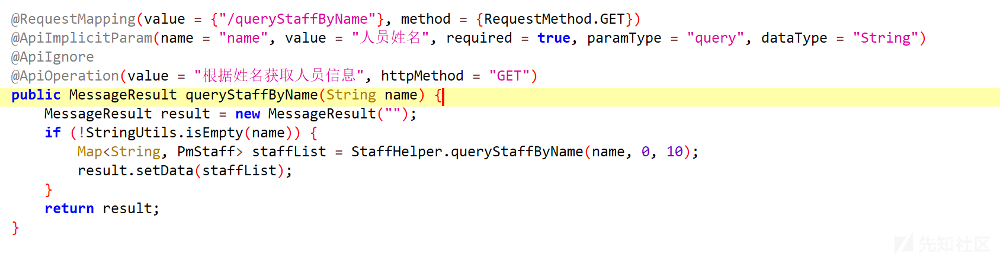](https://xzfile.aliyuncs.com/media/upload/picture/20231212175200-182544bc-98d4-1.png)  
其中对 name 参数的查询调用了 StaffHelper.queryStaffByName 方法，其中 queryStaffByName 方法，又调用了 querySimpleStaffPageByName，也就是上文中存在 SQL 注入的实现方法。  
[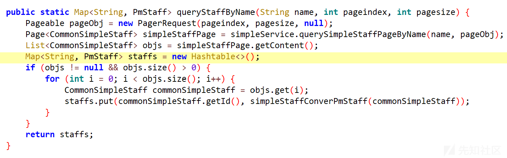](https://xzfile.aliyuncs.com/media/upload/picture/20231212175220-2471b6e2-98d4-1.png)  
并且对输入 name 未有任何过滤和检测操作，所以这里我们构造符合条件的数据包就可以进行漏洞检测。构建延时注入命令检测。  
[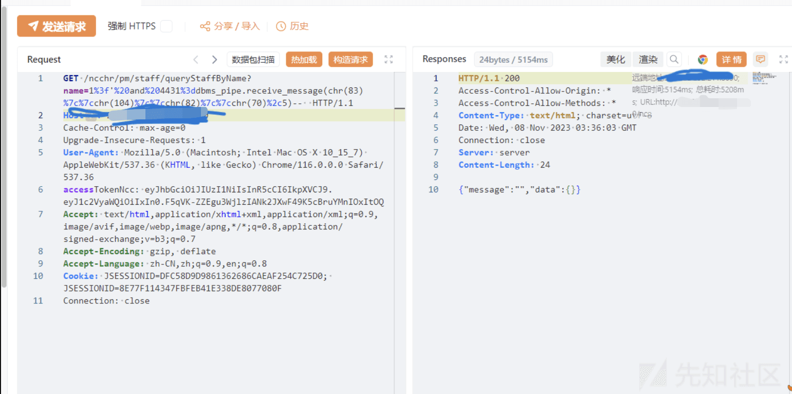](https://xzfile.aliyuncs.com/media/upload/picture/20231212180800-54636524-98d6-1.png)  
使用 sqlmap  
[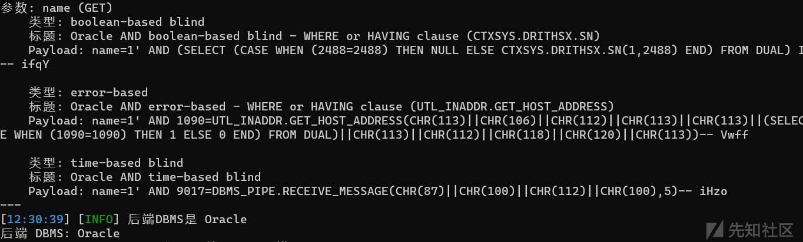](https://xzfile.aliyuncs.com/media/upload/picture/20231212175258-3b2671a2-98d4-1.png)
