# 【符号模拟】Ponce 插件在二进制攻防的应用 - 先知社区

【符号模拟】Ponce 插件在二进制攻防的应用

- - -

# 1、介绍

Ponce 是一款使用 C/C++ 开发的 IDA Pro 插件，它使用户能够以简单直观的方式对二进制文件执行污点分析和符号执行。

[https://github.com/illera88/Ponce](https://github.com/illera88/Ponce)

下载 Release 里面，根据系统决定下载哪一个

[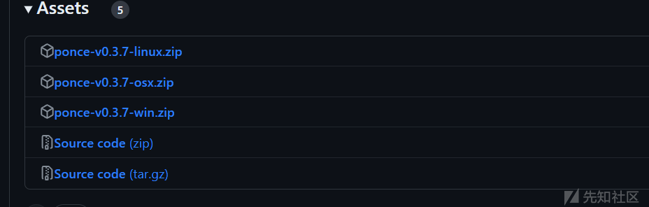](https://xzfile.aliyuncs.com/media/upload/picture/20240217174421-20b66992-cd79-1.png)

安装方法也很简单：

Ponce works with both x86 and x64 binaries in any IDA version >= 7.0. Installing the plugin is as simple as copying the appropiate files from the [latest builds](https://github.com/illera88/Ponce/releases/latest) to the `plugins\` folder in your IDA installation directory.

[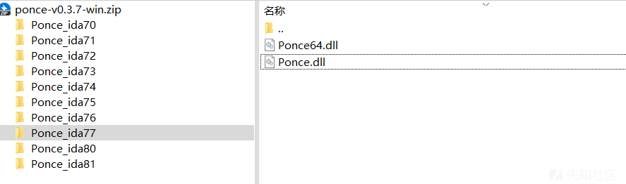](https://xzfile.aliyuncs.com/media/upload/picture/20240217174428-24c44752-cd79-1.png)

作为 2016 年 IDA 插件大赛获奖者，该插件应用的范围可以看到很广泛，毕竟是符号模拟插件

[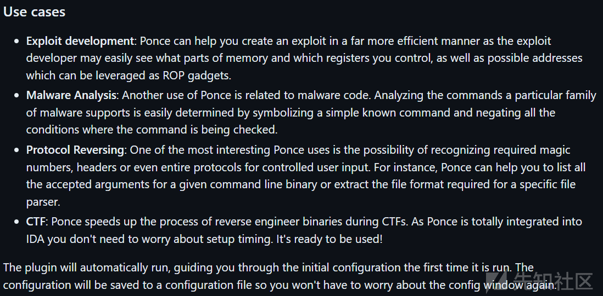](https://xzfile.aliyuncs.com/media/upload/picture/20240217174435-28be5afa-cd79-1.png)

# 2、练习

[https://github.com/illera88/Ponce/tree/master/examples](https://github.com/illera88/Ponce/tree/master/examples)

这是官方给我们提供的练习程序，我们使用 crackme\_xor.cpp

```plain
#include <stdio.h>
#include <stdlib.h>

const char *serial = "\x31\x3e\x3d\x26\x31";

int check(char *ptr)
{
    int i = 0;

    while (i < 5){
        if (((ptr[i] - 1) ^ 0x55) != serial[i])
            return 1;
        i++;
    }
    return 0;
}

int main(int ac, char **av)
{
    int ret;

    if (ac != 2)
        return -1;

    ret = check(av[1]);
    if (ret == 0)
        printf("Win\n");
    else
        printf("fail\n");

    return 0;
}
```

打开程序

[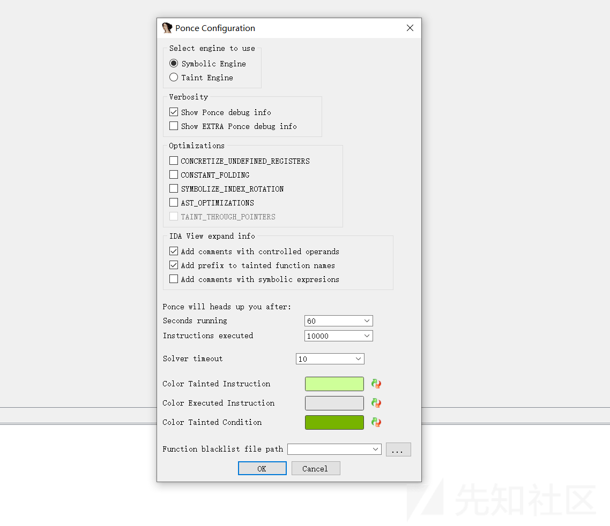](https://xzfile.aliyuncs.com/media/upload/picture/20240217174500-37fb180a-cd79-1.png)

自动弹出 Ponce 的配置页面

进入 main 函数

[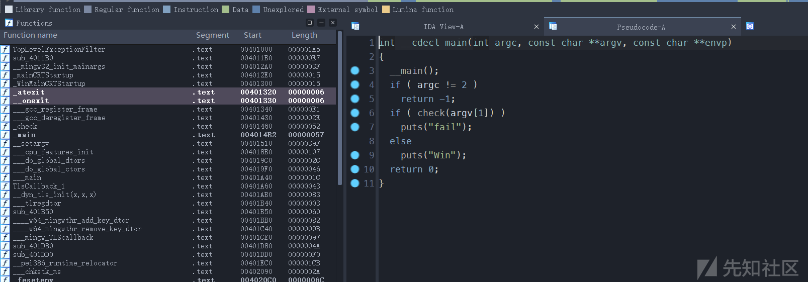](https://xzfile.aliyuncs.com/media/upload/picture/20240217174506-3b7f6756-cd79-1.png)

ponce 需要动态运行，所以还需要配置一下

[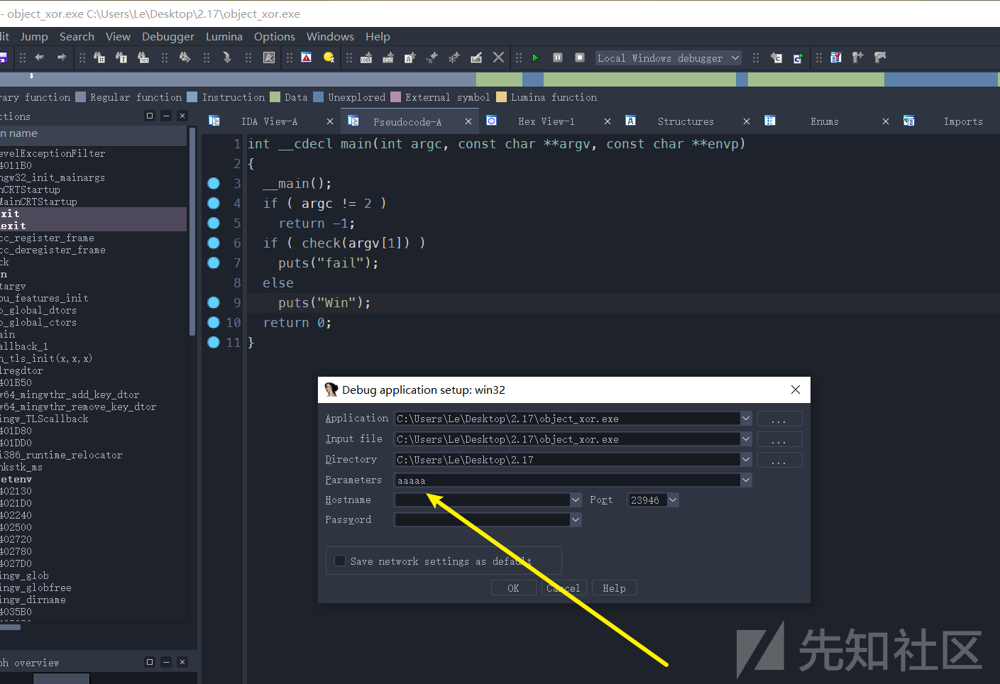](https://xzfile.aliyuncs.com/media/upload/picture/20240217174514-3ff7cbfc-cd79-1.png)

接下来需要在关键比较的地方下断点：

1、符号化关键比较

[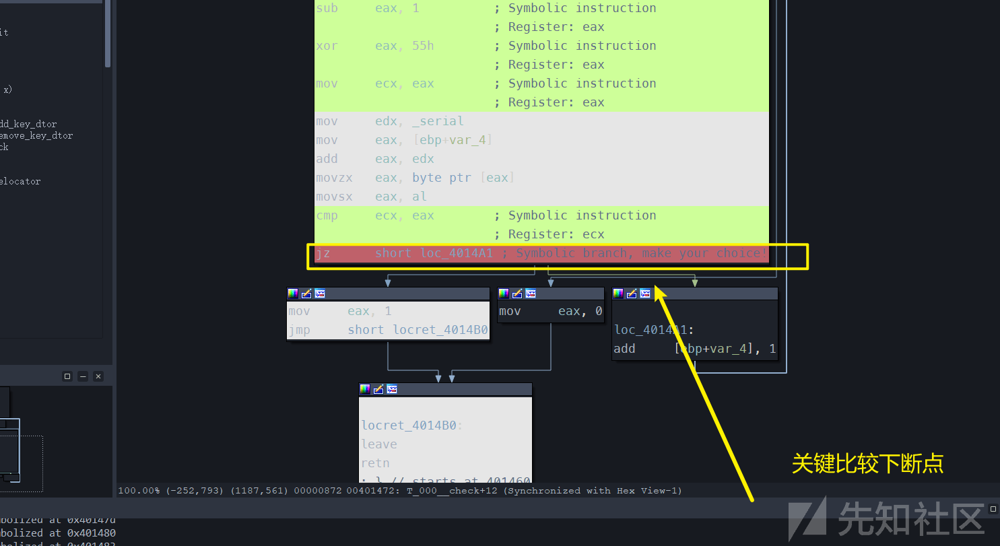](https://xzfile.aliyuncs.com/media/upload/picture/20240217174519-42ec82a8-cd79-1.png)

2、符号化关键数据

[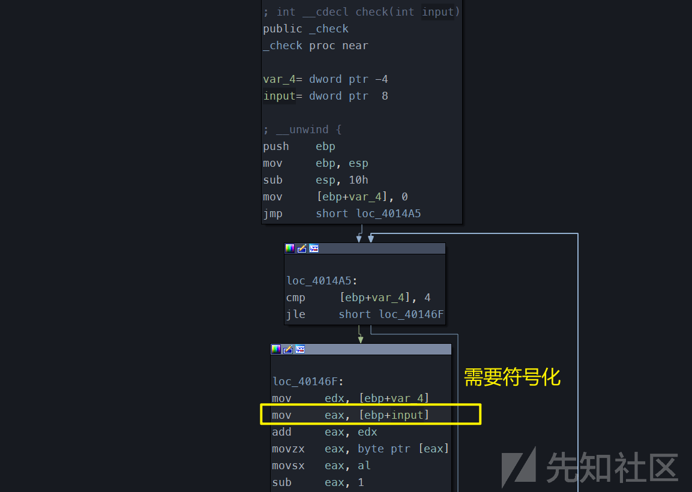](https://xzfile.aliyuncs.com/media/upload/picture/20240217174524-45f68336-cd79-1.png)

动态运行，在\[ebp+input\]的地方断下来

[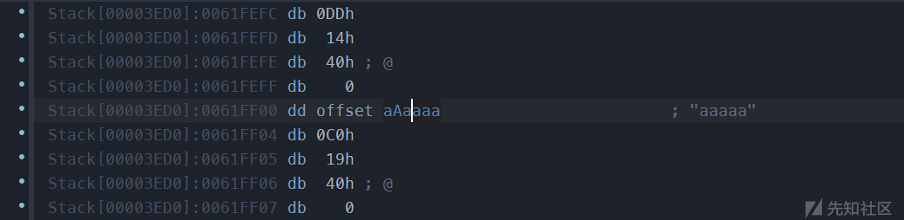](https://xzfile.aliyuncs.com/media/upload/picture/20240217174528-48ad6c20-cd79-1.png)

符号化，也可以使用快捷键

[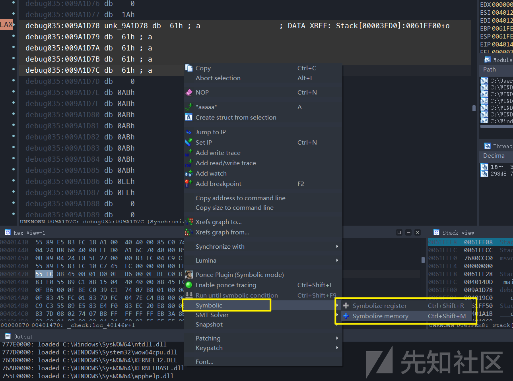](https://xzfile.aliyuncs.com/media/upload/picture/20240217174537-4d80faaa-cd79-1.png)

[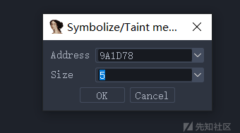](https://xzfile.aliyuncs.com/media/upload/picture/20240217174539-4ec621f6-cd79-1.png)

确定

[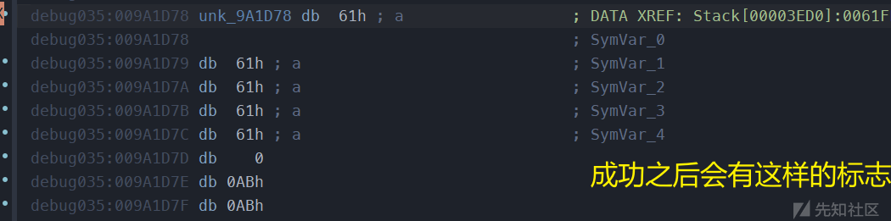](https://xzfile.aliyuncs.com/media/upload/picture/20240217174546-53022314-cd79-1.png)

再次运行，此时不断闪烁的边是程序即将跳转的分支

[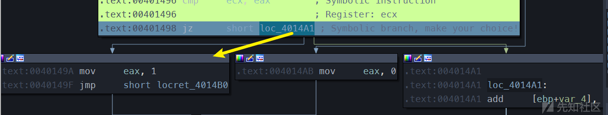](https://xzfile.aliyuncs.com/media/upload/picture/20240217174552-56b9680a-cd79-1.png)

接下来右键关键比较的地方

[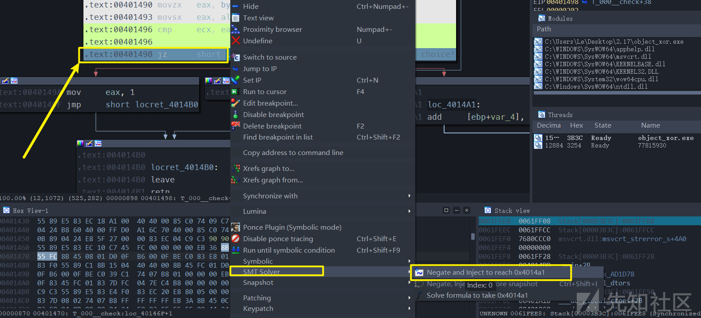](https://xzfile.aliyuncs.com/media/upload/picture/20240217174601-5beb131e-cd79-1.png)

创建 SMT 模拟

```plain
右键断点位置-->SMT Solver--> Negate and Inject
```

[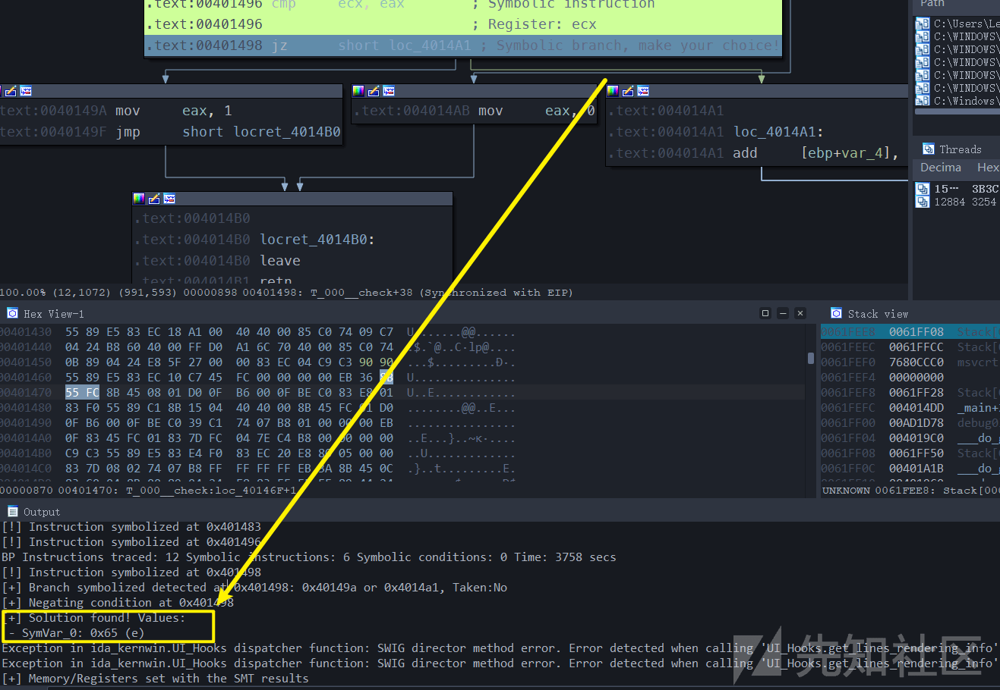](https://xzfile.aliyuncs.com/media/upload/picture/20240217174609-61062fbe-cd79-1.png)

发现是成功得到了结果

不断重复过程

[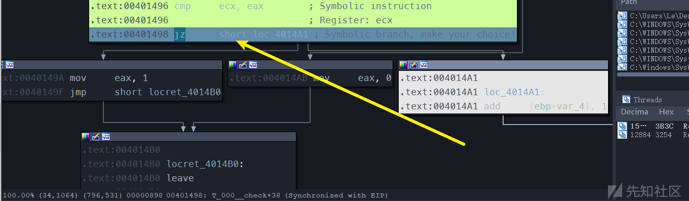](https://xzfile.aliyuncs.com/media/upload/picture/20240217174614-63f1d9c6-cd79-1.png)

跳转到另一边，然后再运行

美中不足的是每次动态调试都要重新设置符号变量

[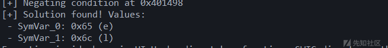](https://xzfile.aliyuncs.com/media/upload/picture/20240217174620-675b5b8c-cd79-1.png)

不过用起来真的很爽

[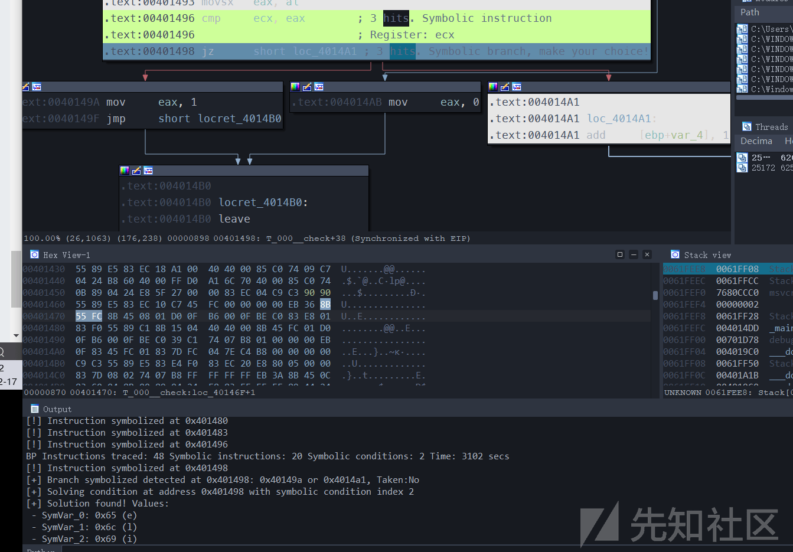](https://xzfile.aliyuncs.com/media/upload/picture/20240217174629-6cad6d3c-cd79-1.png)

# 3, 2023N1CTF-addtion plus

[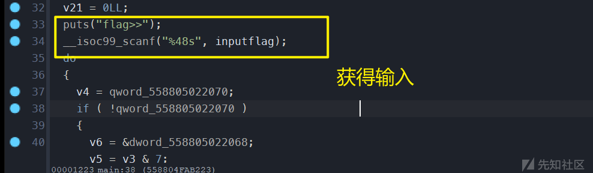](https://xzfile.aliyuncs.com/media/upload/picture/20240217174743-98a11092-cd79-1.png)

废话不多说，IDA 打开分析即可

[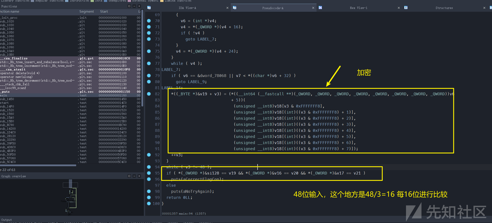](https://xzfile.aliyuncs.com/media/upload/picture/20240217174750-9cda58d0-cd79-1.png)

生成的假 flag

```plain
111111111111111111111111111111111111111111111111
```

这是动态调用加密函数，call 一个地址

[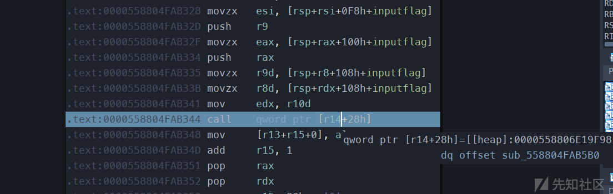](https://xzfile.aliyuncs.com/media/upload/picture/20240217174754-9fb728b2-cd79-1.png)

该函数极大，单纯分析的话，真的费时间。

预期解为使用 z3 模式求解

[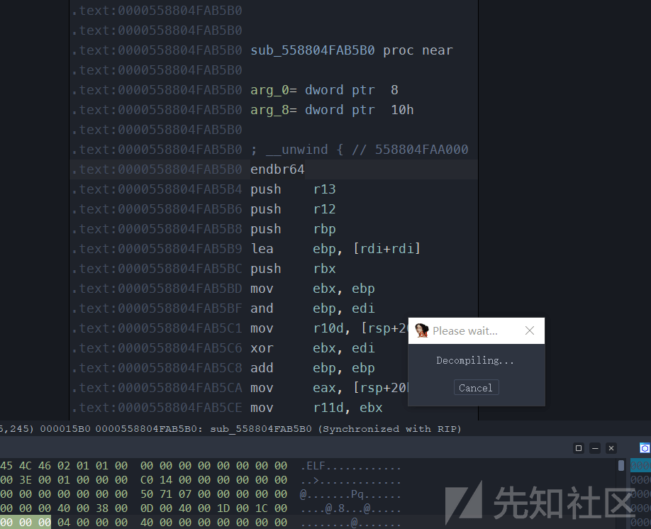](https://xzfile.aliyuncs.com/media/upload/picture/20240217174800-a2bd0a86-cd79-1.png)

会调用 0x30 次，说明对输入的每一个 flag 进行加密

[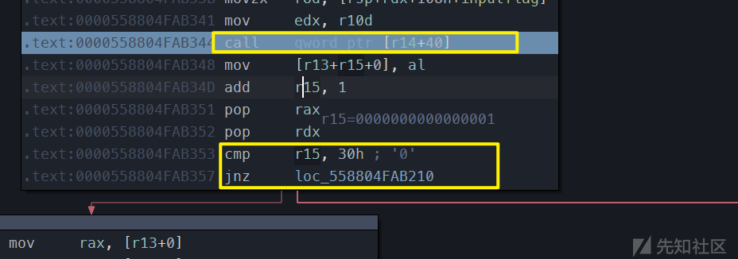](https://xzfile.aliyuncs.com/media/upload/picture/20240217174804-a57e61c0-cd79-1.png)

继续分析，找到关键比较的地方

[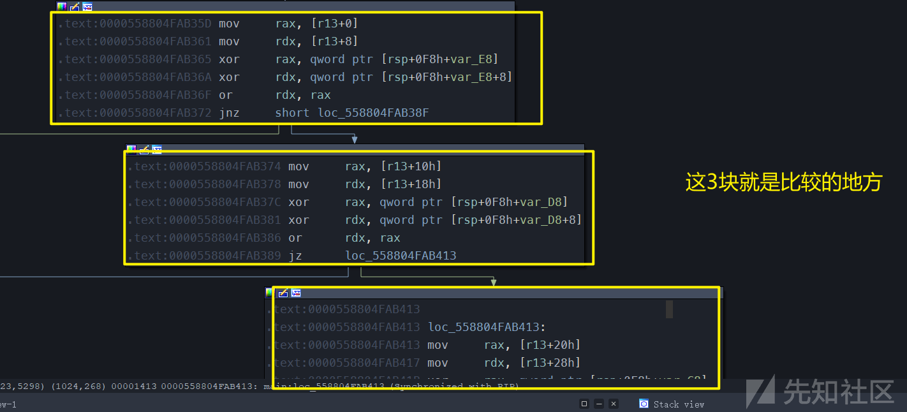](https://xzfile.aliyuncs.com/media/upload/picture/20240217174811-a98db356-cd79-1.png)

可以看到是每 16 字节进行比较，正好分为了 3 部分

如果同时爆这 48 位，很难爆出，我们缩减思路，每 8 位进行爆破，因为加密的时候就是每 8 个字节进行加密的（8 个字节为一组，依次调用不同的加密的函数）

[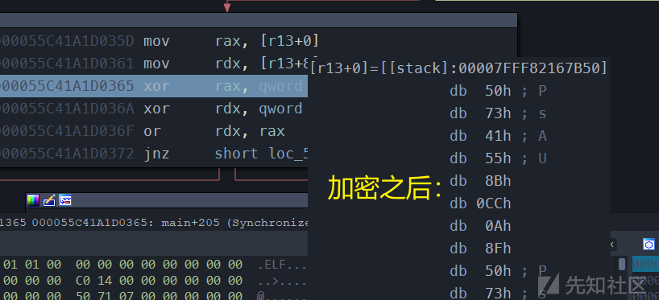](https://xzfile.aliyuncs.com/media/upload/picture/20240217174815-abe36f60-cd79-1.png)

对第一块比较进行分析

[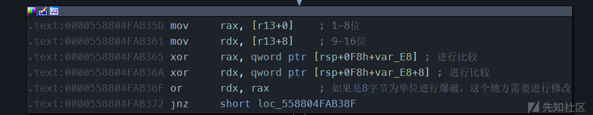](https://xzfile.aliyuncs.com/media/upload/picture/20240217174821-af978aa6-cd79-1.png)

8 字节爆破，需要修改一些东西

[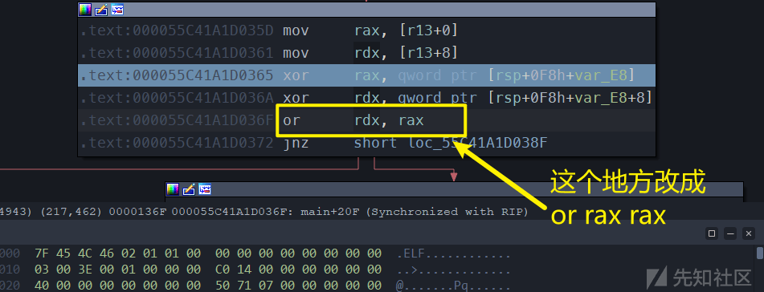](https://xzfile.aliyuncs.com/media/upload/picture/20240217174841-bbc2293a-cd79-1.png)

修改完成后就达到了 8 字节爆破的目的

[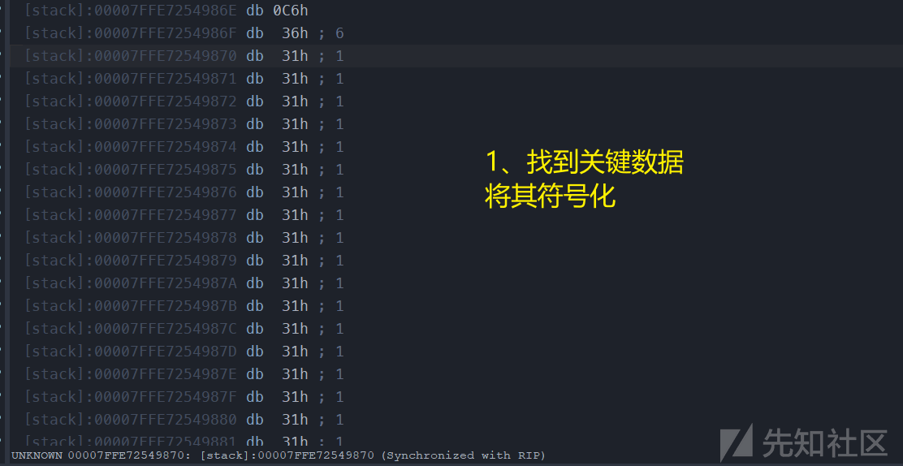](https://xzfile.aliyuncs.com/media/upload/picture/20240217174848-bfe83e78-cd79-1.png)

先符号化前 8 位

[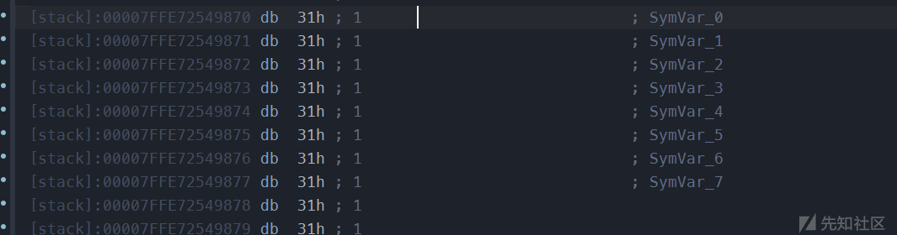](https://xzfile.aliyuncs.com/media/upload/picture/20240217174855-c4192bc4-cd79-1.png)

[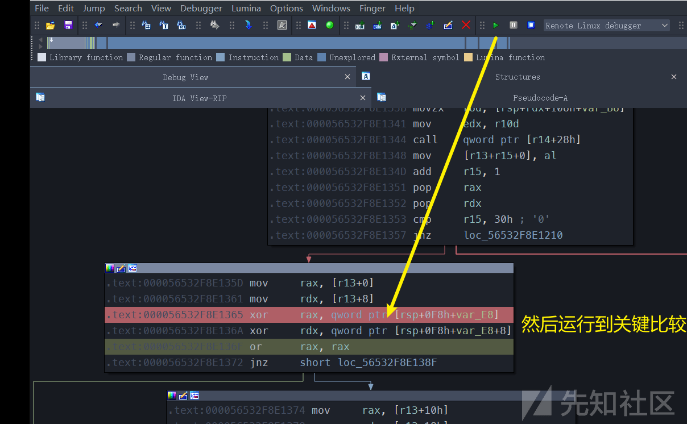](https://xzfile.aliyuncs.com/media/upload/picture/20240217174903-c8dc9bfa-cd79-1.png)

[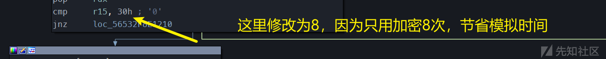](https://xzfile.aliyuncs.com/media/upload/picture/20240217174907-cab2ac9e-cd79-1.png)

需要进行简单 patch，这里需要注意的是远程 Linux 拷贝的文件，需要进行删除，然后重新 copy！

[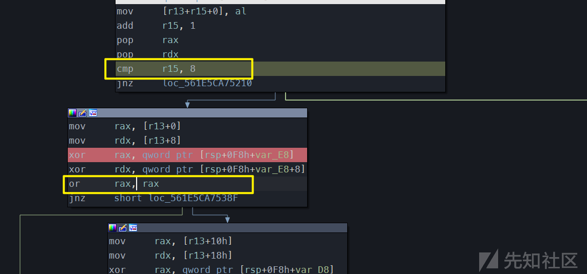](https://xzfile.aliyuncs.com/media/upload/picture/20240217174912-cdd59d6e-cd79-1.png)

之后的效果如下：

[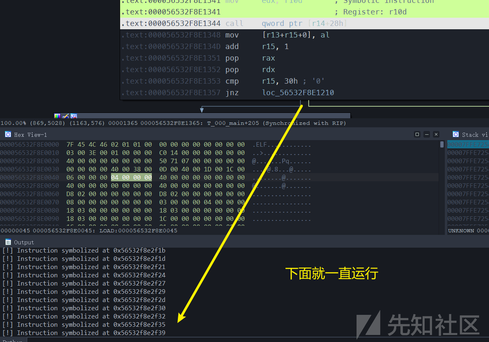](https://xzfile.aliyuncs.com/media/upload/picture/20240217174922-d3b09de2-cd79-1.png)

等待大概 20 分钟，虽然很方便，但是很费时间

期间弹出的窗口还是点击确认

[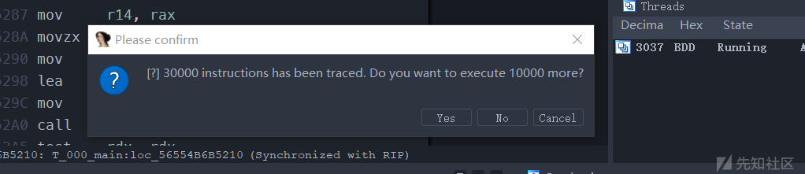](https://xzfile.aliyuncs.com/media/upload/picture/20240217174927-d70e80ee-cd79-1.png)

[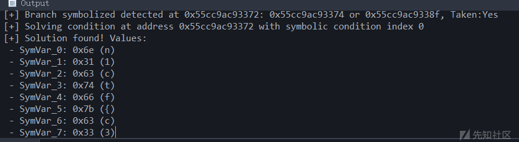](https://xzfile.aliyuncs.com/media/upload/picture/20240217174931-d96ffb06-cd79-1.png)

前 8 位爆破要了半小时

后面比较中间 17-32 的时候，需要将加密的起始位置修改为 17 开始，相同的操作，就是很费时间。

# 总结：

使用 ponce，我们需要标记（符号化）

1、关键数据地址

2、关键比较

然后就静等片刻咯
