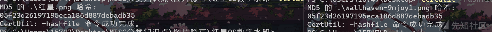
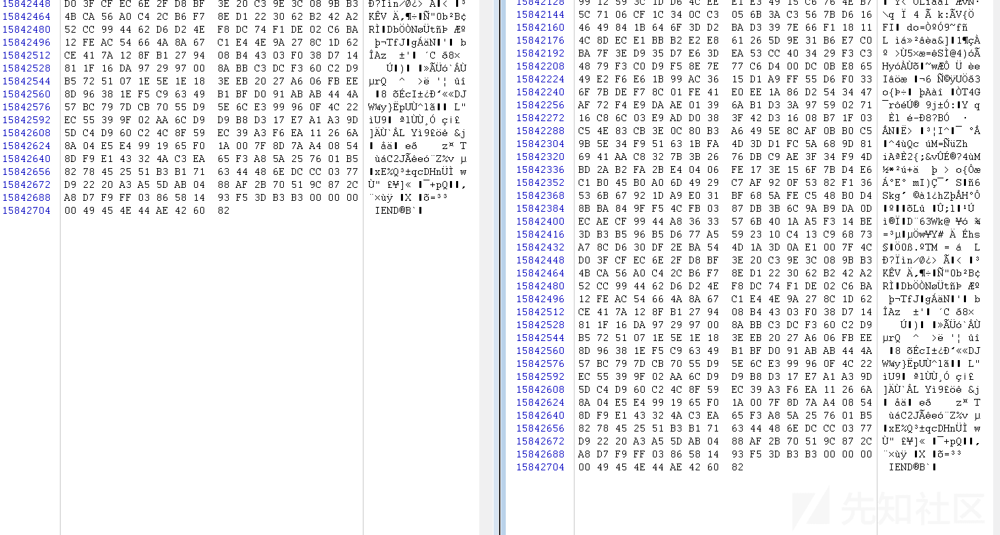
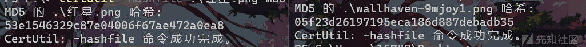
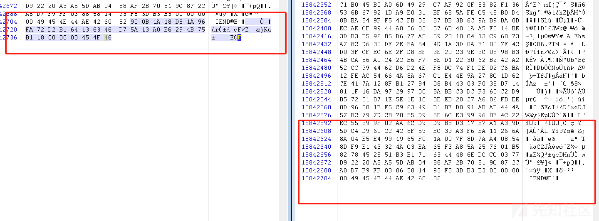
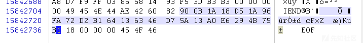
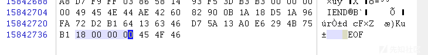
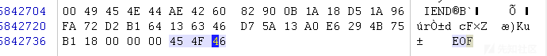
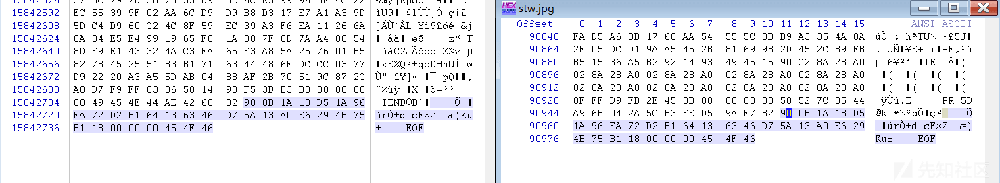
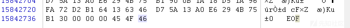
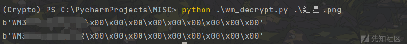

# 红星 OS 数字水印技术分析 - 先知社区

红星 OS 数字水印技术分析

- - -

# 前言

这几天从 Github 上逛的时候，发现有一个项目引起我的注意，后来多加了解，发现网上关于朝鲜的红星 OS 系统大多只停留在使用阶段，发现这个系统相比于 Linux，Windows 有一个更安全的功能，就是自带数字水印技术。

# 红星 OS 数字水印技术

## 加密

我们先来了解一下什么是红星 OS 系统

```plain
红星（Red Star）操作系统是朝鲜在 Linux 操作系统的基础上自行研发、改进的电脑操作系统，技术上尽管与微软的 Windows 不同，但使用环境和设计与 Windows 非常相似，尤其是桌面环境，与 Windows 几乎相同。而新版的红星操作系统界面则与苹果 OS X 相似。
```

在百度百科上，是这么描述红星 OS 的系统安全性能的

```plain
朝鲜基于 Linux 操作系统自行研发了红星（Red Star）操作系统，朝鲜曾多次表示，它可以完全阻止黑客攻击，但是安全公司 Hacker House 在红星操作系统中发现了一个漏洞，通过诱使用户打开恶意链接，潜在攻击者可以远程访问运行红星电脑，而这种安全漏洞可用于安装恶意软件或利用运行红星操作系统的电脑。
```

这里我们只拿出来红星 OS 数字水印这一方面进行探讨

对于插入电脑的任何 USB 设备，红星系统能在设备文件上打上“数字水印”。简单来说，只要将存储了文件、照片、视频的 USB 存储设备插入安装有红星系统的计算机，红星系统就会获取当前硬盘设备的序列号并对其加密，然后将加密序列写入文件，在文件上打上印记。

我们做一个对比，如果是 Windows 和 Linux 打开同一个图片，之后检验 hash

[](https://xzfile.aliyuncs.com/media/upload/picture/20240124140435-7346b800-ba7e-1.png)

之后利用 winhex 查看一下两个图片的结构

[](https://xzfile.aliyuncs.com/media/upload/picture/20240124140442-772820e4-ba7e-1.png)

发现两个图片的文件结构是一模一样的，说明同一个文件，在 linux 和 Windows 下分别打开之后，没有经过任何处理，也就是没有进行安全处理

但是朝鲜的红星 OS 系统则是创新型的对文件加上了数字水印，我们实操看一下

[](https://xzfile.aliyuncs.com/media/upload/picture/20240124140447-7a37d48c-ba7e-1.png)

我们这里将原图在红星 OS 系统打开，然后再检验 MD5，发现两个相同的图片的 MD5 居然不一样了

[](https://xzfile.aliyuncs.com/media/upload/picture/20240124140451-7c960b54-ba7e-1.png)

看一下文件结构，

-   左图为在红星 OS 打开的图片
-   右图为原图

[](https://xzfile.aliyuncs.com/media/upload/picture/20240124140455-7f45b296-ba7e-1.png)

可以发现在红星 OS 末尾又加了一串加密数据，这其实就是我们所说的红星 OS 的数字水印技术

(这里可以自己尝试一下，这些加密数据是随机的)

我们这里解释一下数字水印的结构：

-   加密数据 (其实是磁盘序列号)

这里一共 24 个字节 (对应的就是十六进制的 0x18)

[](https://xzfile.aliyuncs.com/media/upload/picture/20240124140500-820d7496-ba7e-1.png)

-   数字签名

这里就是记录签名加密数据的大小 (最大大小为 FF FF FF FF)

[](https://xzfile.aliyuncs.com/media/upload/picture/20240124140504-84a55ca0-ba7e-1.png)

-   文件结束标识

EOF => End of file，也就是文件结束标识

[](https://xzfile.aliyuncs.com/media/upload/picture/20240124140513-89d0c304-ba7e-1.png)

规律总结，我们这里又找了几个图片多做几次测试

[](https://xzfile.aliyuncs.com/media/upload/picture/20240124140517-8c3fe07a-ba7e-1.png)

如果是相同的系统，所加的数字水印是相同的，可以设想一下

如果我们在不同的设备上 (或者利用别的虚拟机软件) 创建两个不同的红星 OS 系统，由于磁盘序列号不同，所加的数字水印是否相同？而且水印是否可以叠加？

答案是可以的：

[](https://xzfile.aliyuncs.com/media/upload/picture/20240124140522-8f6b112a-ba7e-1.png)

这里可以发现，我们数字签名区域变为了 0x30，也就是十进制的 48，说明我们的水印嵌套成功

说明水印是可以叠加的，而由于磁盘序列号不同，故水印也不同

现在我们了解了红星 OS 是如何进行数字水印加密的了

## 解密

利用 GitHub 的项目，这个项目已经为我们写好了解密脚本了

用法

```plain
python decrypy.py xxx
```

[](https://xzfile.aliyuncs.com/media/upload/picture/20240124140530-93de32dc-ba7e-1.png)

可以发现已经将磁盘序列号进行解密成功了

至此，我们对于红星 OS 数字水印技术已经有了一定的了解

# 参考

[takeshixx/redstar-tools: Tools for Red Star OS (붉은별) (github.com)](https://github.com/takeshixx/redstar-tools)
